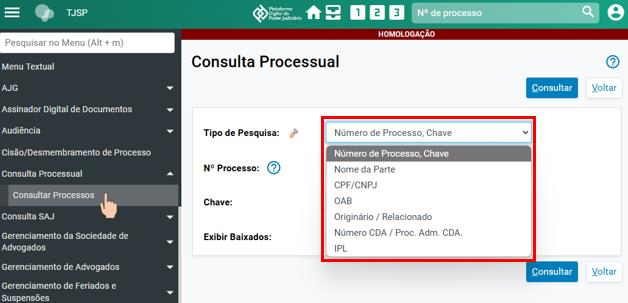
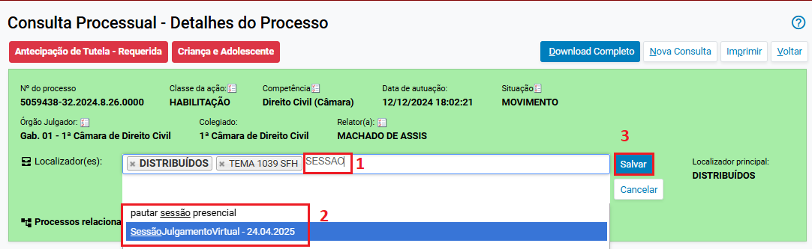
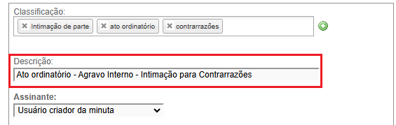
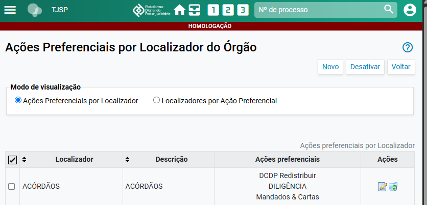
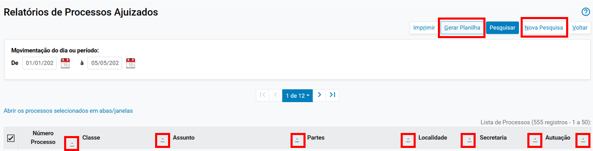
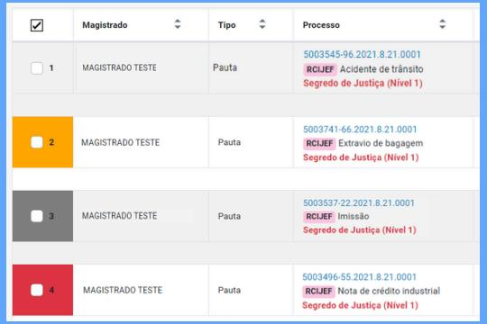
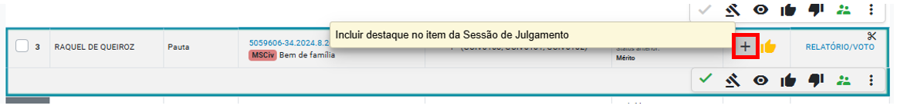

# ▪ INTRODUÇÃO

*Documento eProc - Material de Treinamento*

---

---

<small>Imagem decorativa de capa: linhas e luzes de sistema e logotipo do eproc. Na lateral está escrit</small><small>o: EPROC</small><small>*PORTAL NACIONAL DO CONHECIMENTO EPROC*</small>

**EPROC PARA SEGUNDO GRAU****–****GABINETE**

## Conteúdo integral do curso

Atualizado em**04/06/2025.**

---

**SUMÁRIO**

**EPROC PARA SEGUNDO GRAU****–****GABINETE**
<small>▪</small>
**INTRODUÇÃO**

**8**
<small>O QUE É O EPROC?</small><small>8</small><small>VANTAGENS DO SISTEMA EPROC</small><small>8</small><small>PROCESSO DIGITAL X PROCESSO ELETRÔNICO</small><small>9</small><small>MUDANÇA DE*MINDSET*</small><small>9</small><small>▪</small>
**INTERFACE DO SISTEMA**

**11**
<small>Perfil do usuário</small><small>12</small><small>MENU LATERAL OU MENU TEXTUAL</small><small>14</small><small>▪</small>
**CONSULTA PROCESSUAL**

**15**
<small>Na tela inicial do sistema</small><small>15</small><small>No menu lateral</small><small>16</small><small>CAPA DO PROCESSO</small><small>18</small><small>▪</small>
**PAINÉIS DOS PERFIS**

**24**
<small>PAINEL DO DIRETOR DE SECRETARIA</small><small>24</small><small>PAINEL DO SERVIDOR</small><small>26</small><small>▪</small>
**TRAMITAÇÃO**

**28**
<small>SEGUNDO GRAU</small><small>28</small><small>Tramitação dos processos</small><small>28</small><small>▪</small>
**CADASTRO DE PARTES E REPRESENTANTES**

**31**
<small>Incluindo e editando partes no processo</small><small>32</small><small>Cadastro de procuradores</small><small>36</small><small>CADASTRO DE ENTIDADES</small><small>38</small><small>Ministério Público como parte no processo</small><small>38</small><small>Ministério Público como*custos juris*</small><small>39</small><small>▪</small>
**RETIFICAÇÃO DE AUTUAÇÃO**

**41**
<small>Dados complementares</small><small>44</small>

---

INTRODUÇÃO

**EPROC PARA SEGUNDO GRAU****–****GABINETE****|**Conteúdo integral do curso
<small>**3**</small><small>▪</small>
**LOCALIZADORES****–****TIPOS DE LOCALIZADORES**

**45**
<small>TIPOS DE LOCALIZADORES</small><small>46</small><small>Localizadores de sistema</small><small>46</small><small>Localizadores do órgão</small><small>47</small><small>Alteração do cadastro do localizador do Órgão</small><small>49</small><small>Desativação do localizador do órgão</small><small>49</small><small>Localizadores fixos</small><small>50</small><small>▪</small>
**LOCALIZADORES****–****LISTA DE PROCESSOS POR LOCALIZADOR**

**51**
<small>▪</small>
**LOCALIZADORES****–****MEUS LOCALIZADORES**

**53**
<small>Configurando a tela “Meus Localizadores” como página inicial</small><small>53</small><small>Acessando a tela “Meus Localizadores”</small><small>53</small><small>Personalizando a tela “Meus Localizadores”</small><small>54</small><small>▪</small>
**LOCALIZADORES****–****ALOCAR PROCESSOS UTILIZANDO OS LOCALIZADORES**

**57**
<small>▪</small>
**LOCALIZADORES****–****GERENCIAR LOCALIZADORES PELA CAPA DO PROCESSO**

**59**
<small>Para incluir um localizador</small><small>59</small><small>Para excluir um localizador</small><small>60</small><small>Histórico de localizadores do processo</small><small>61</small><small>Incluir memo em localizador</small><small>62</small><small>▪</small>
**EVENTOS**

**64**
<small>Tabela de eventos</small><small>64</small><small>Filtragem de eventos</small><small>69</small><small>▪</small>
**LANÇAMENTO DE EVENTOS**

**71**
<small>Configuração manual de eventos</small><small>71</small><small>Eventos automáticos</small><small>73</small><small>ALTERAÇÃO DO TIPO DO DOCUMENTO DE PETIÇÃO PARA INCIDENTE</small><small>73</small><small>▪</small>
**MINUTAS****–****CONCEITO, BLOQUEIO, DESBLOQUEIO E ACESSO**

**75**
<small>Bloqueio de minutas</small><small>75</small><small>Desbloqueio de minutas</small><small>75</small><small>Acesso às minutas</small><small>76</small><small>▪</small>
**MINUTAS****–****TEXTO-PADRÃO**

**78**
<small>Criação do texto-padrão</small><small>78</small><small>Utilização do texto-padrão</small><small>81</small><small>▪</small>
**MINUTAS****–****MODELOS-MATRIZ E INSTITUCIONAIS**

**88**

---

INTRODUÇÃO

**EPROC PARA SEGUNDO GRAU****–****GABINETE****|**Conteúdo integral do curso
<small>**4**</small><small>MODELOS INSTITUCIONAIS</small><small>89</small><small>▪</small>
**MINUTAS****–****MODELOS-PADRÃO**

**90**
<small>Criação de modelo-padrão</small><small>91</small><small>Inserção de*tags*</small><small>92</small><small>Inserção de textos-padrão em modelo-padrão</small><small>95</small><small>Utilização do modelo-padrão</small><small>98</small><small>▪</small>
**MINUTAS****–****ÁREA DE TRABALHO**

**100**
<small>Acesso à tela “Minuta Área de Trabalho”</small><small>101</small><small>BUSCA DE DOCUMENTOS</small><small>101</small><small>Criados em outras unidades</small><small>102</small><small>Por localizadores</small><small>104</small><small>Por classificação</small><small>104</small><small>Por lote de documentos</small><small>106</small><small>▪</small>
**MINUTAS****–****AGENDAMENTO E VINCULAÇÃO DE CARGOS NA ASSINATURA**

**108**
<small>Agendamento</small><small>109</small><small>Vinculação de cargos na assinatura de minutas</small><small>112</small><small>▪</small>
**MINUTAS****–****DESPACHO E DECISÃO**

**114**
<small>Minutas elaboradas pela unidade judicial para assinatura dos Magistrados</small><small>118</small><small>Assinatura individual</small><small>119</small><small>Assinatura em lote</small><small>120</small><small>▪</small>
**MINUTAS EM LOTE**

**121**
<small>▪</small>
**EXPEDIÇÃO DE DOCUMENTOS****–****CITAÇÕES E INTIMAÇÕES ELETRÔNICAS**

**125**
<small>Configurando a citação e a intimação eletrônicas</small><small>125</small><small>Intimação de unidades externas</small><small>129</small><small>Intimação da Defensoria Pública e do Ministério Público</small><small>131</small><small>Domicílio Judicial Eletrônico</small><small>131</small><small>▪</small>
**EXPEDIÇÃO DE DOCUMENTOS****–****INTIMAÇÕES PARA O DJEN**

**135**
<small>INTEGRAÇÃO EPROC E DJEN</small><small>135</small><small>INTIMAÇÕES PARA O DJEN</small><small>135</small><small>Conteúdo para Publicação</small><small>135</small><small>Lançamento do evento de intimação</small><small>136</small><small>Envio da publicação</small><small>136</small><small>Disponibilização e publicação</small><small>136</small><small>Prazos</small><small>137</small><small>Réu revel</small><small>137</small>

---

INTRODUÇÃO

**EPROC PARA SEGUNDO GRAU****–****GABINETE****|**Conteúdo integral do curso
<small>**5**</small><small>Relatório</small><small>139</small><small>Consulta</small><small>141</small><small>Painel do advogado no eproc</small><small>141</small><small>PUBLICAÇÃO DE EDITAIS NO DJEN</small><small>142</small><small>Criar modelo de edital</small><small>142</small><small>Enviar edital para o DJEN</small><small>142</small><small>Prazos</small><small>144</small><small>▪</small>
**CRIAÇÃO E TIPOS DE PREFERÊNCIAS**

**147**
<small>TIPOS DE PREFERÊNCIAS</small><small>147</small><small>Preferências de minutas</small><small>147</small><small>Preferências de movimentação</small><small>152</small><small>Preferências de intimação</small><small>154</small><small>▪</small>
**PREFERÊNCIAS DE MINUTAS**

**157**
<small>ALTERAÇÃO DAS PREFERÊNCIAS DE MINUTAS</small><small>158</small><small>Alteração dos dados cadastrais</small><small>158</small><small>Alteração dos campos da preferência</small><small>160</small><small>Importação das preferências de minutas</small><small>161</small><small>▪</small>
**PREFERÊNCIAS E AÇÕES PREFERENCIAIS**

**163**
<small>VISUALIZAÇÃO DAS PREFERÊNCIAS CRIADAS</small><small>164</small><small>AÇÕES PREFERENCIAIS POR LOCALIZADOR</small><small>165</small><small>Criação das ações preferenciais por localizador</small><small>165</small><small>Alteração das ações preferenciais por localizador</small><small>168</small><small>▪</small>
**SIGILO**

**170**
<small>NÍVEIS DE SIGILO</small><small>170</small><small>Nível 0 (sem sigilo)</small><small>171</small><small>Nível 1 (segredo de justiça)</small><small>171</small><small>Nível 2 (sigilo interno 2)</small><small>172</small><small>Nível 3 (sigilo interno 3)</small><small>172</small><small>Nível 4 (sigilo interno 4)</small><small>173</small><small>Nível 5 (sigilo interno 5)</small><small>173</small><small>ALTERAÇÃO DE SIGILO DO PROCESSO</small><small>174</small><small>ALTERAÇÃO DE SIGILO DO DOCUMENTO</small><small>175</small><small>PERMISSÃO EXPRESSA</small><small>176</small><small>Para acessar o processo</small><small>176</small><small>Para acessar o documento</small><small>177</small>

---

INTRODUÇÃO

**EPROC PARA SEGUNDO GRAU****–****GABINETE****|**Conteúdo integral do curso
<small>**6**</small><small>▪</small>
**RELATÓRIO GERAL DE PROCESSOS**

**178**
<small>RELATÓRIO GERAL</small><small>178</small><small>Importantes filtros de pesquisa</small><small>181</small><small>Consulta ao relatório</small><small>182</small><small>▪</small>
**OUTROS RELATÓRIOS**

**183**
<small>RELATÓRIO ESTATÍSTICO DE MINUTAS</small><small>183</small><small>RELATÓRIO DE PROCESSOS SEM MOVIMENTAÇÃO NOS ÚLTIMOS ‘N’ DIAS</small><small>185</small><small>RELATÓRIO DE RESUMO DA MOVIMENTAÇÃO POR DIA/PERÍODO</small><small>186</small><small>RELATÓRIO DE DISTRIBUIÇÃO</small><small>187</small><small>RELATÓRIO DE ACESSOS AO SISTEMA</small><small>189</small><small>▪</small>
**INCLUIR PROCESSO NA PAUTA**

**191**
<small>Processos sem criação de minuta</small><small>192</small><small>Processos com minutas criadas</small><small>193</small><small>Gerenciamento de localizadores</small><small>193</small><small>INCLUSÃO DE MÉRITO E INCIDENTE NA MESMA PAUTA</small><small>194</small><small>INCLUSÃO EM LOTE NA PAUTA</small><small>195</small><small>RELATÓRIO DA INCLUSÃO NA PAUTA</small><small>197</small><small>EFEITOS NA INCLUSÃO DA PAUTA</small><small>197</small><small>▪</small>
**MINUTAS DE RELATÓRIO/VOTO E DE ACÓRDÃO**

**198**
<small>MINUTA DE RELATÓRIO/VOTO</small><small>201</small><small>MINUTA DE ACÓRDÃO</small><small>202</small><small>▪</small>
**DISPONIBILIZAÇÃO DE MINUTAS**

**204**
<small>PELO PAINEL DA SESSÃO</small><small>204</small><small>Retirada da disponibilização</small><small>206</small><small>PELA CAPA DO PROCESSO</small><small>207</small><small>PELA PRÓPRIA MINUTA</small><small>208</small><small>CORES NO PAINEL DA SESSÃO</small><small>210</small><small>▪</small>
**REVISÃO DE PROCESSOS**

**211**
<small>Ações da minuta</small><small>213</small><small>Marcar a minuta como visualizada</small><small>214</small><small>Inclusão de destaques</small><small>215</small><small>Destaque “Comentário”</small><small>219</small><small>▪</small>
**RETIRADA DE PAUTA DE PROCESSOS**

**220**

---

INTRODUÇÃO

**EPROC PARA SEGUNDO GRAU****–****GABINETE****|**Conteúdo integral do curso
<small>**7**</small><small>Retirada de processo em pauta já gerada</small><small>221</small><small>▪</small>
**SESSÃO DE JULGAMENTO**

**223**
<small>INÍCIO DA SESSÃO DE JULGAMENTO</small><small>223</small><small>REALIZAÇÃO DA SESSÃO</small><small>226</small><small>Cadastro de sustentação oral</small><small>227</small><small>Consulta de memoriais</small><small>229</small><small>Alterações e destaques durante a sessão pelo gabinete</small><small>229</small><small>ATUALIZAÇÃO DO RESULTADO DO JULGAMENTO</small><small>230</small><small>ADIAMENTOS E RETIRADA DA PAUTA</small><small>231</small><small>FINALIZAÇÃO EM LOTE DA SESSÃO DE JULGAMENTO</small><small>233</small><small>Agrupamentos com atualização individual</small><small>233</small><small>Lançamento de resultado em lote de determinado agrupamento</small><small>234</small><small>Lançamento de resultado individual no agrupamento.</small><small>235</small><small>LANÇAMENTO DE EVENTOS</small><small>237</small><small>Pedidos de vista</small><small>239</small><small>CANCELAMENTO DO RESULTADO DO JULGAMENTO</small><small>239</small><small>RESUMO DO ITEM DA SESSÃO</small><small>240</small><small>▪</small>
**PÓS-SESSÃO DE JULGAMENTO**

**242**
<small>ENVIO DAS MINUTAS PARA ASSINATURA</small><small>242</small><small>Minutas de processos com relatoria de outro(a) magistrado(a)</small><small>245</small><small>ASSINATURA PELO MAGISTRADO</small><small>249</small><small>JUNTADA DA MINUTA AO PROCESSO</small><small>251</small><small>PROCEDIMENTOS CONFORME RESULTADO DO JULGAMENTO</small><small>253</small><small>CRÉDITOS</small><small>255</small>

---

INTRODUÇÃO

**EPROC PARA SEGUNDO GRAU****–****GABINETE****|**Conteúdo integral do curso
<small>**8**</small>
# ▪ INTRODUÇÃO

**O QUE É O****EPROC?**

O eproc é um sistema eletrônico de tramitação processual que integra a lógica digital nos

processos judiciais. Criado pelo TRF4 em 2003, atualmente é utilizado por diversos tribunais e tem

índice de satisfação de 96, 8%.

Com a implementação, os Tribunais iniciam uma nova fase digital e uma verdadeira revolução para

a justiça no país, trazendo maior agilidade na tramitação dos processos, eficiência na comunicação,

padronização de procedimentos e significativa redução de custos.

O eproc oferece novas funcionalidades, como:

▪ controle automático de prazos;

▪ integração com a Receita Federal;

▪ localizadores personalizáveis;

▪ otimização e automação de tarefas.

É possível acessá-lo por navegadores, como Google Chrome, Microsoft Edge, Firefox Mozilla e

Safari, seja em um computador,*smartphone*,*tablet*ou*notebook*.

**VANTAGENS DO SISTEMA EPROC**

O sistema eproc pode ser customizado e adaptado por cada unidade de acordo com suas

necessidades, trazendo mais**conveniência**ao trabalho da equipe. Nele, as correções são

realizadas diariamente e o sistema tem**atualização contínua**, não sendo necessário criar novas

versões para corrigir erros.

Períodos de instabilidade são raros e seu funcionamento demanda menos recursos

computacionais, garantindo maior**confiabilidade**e**eficiência**no uso. Por ter desenvolvimento

colaborativo, as soluções criadas por um tribunal podem ser compartilhadas e aproveitadas por

outros, promovendo**inovação**e**integração**em todo o sistema judicial.

Por fim, o eproc é**acessível**a todos. Sua interface é intuitiva, compatível com tecnologias assistidas

e pode ser personalizada com recursos de acessibilidade conforme a preferência do usuário.

---

INTRODUÇÃO

**EPROC PARA SEGUNDO GRAU****–****GABINETE****|**Conteúdo integral do curso
<small>**9**</small>
**PROCESSO DIGITAL X PROCESSO ELETRÔNICO**

Um processo digital nada mais é do que um processo físico que foi digitalizado e armazenado em

um sistema gerenciador de documentos, mantendo sua lógica de procedimentos, como a

utilização de certificações manuais, poucas automatizações e a necessidade de registrar atividades

em meio físico.

Já um processo eletrônico registra e disponibiliza seus atos processuais (ações e eventos)

diretamente em meio digital, gerenciando e armazenando atividades sem a necessidade de

expedir documentos físicos.

Por exemplo, no processo digital é necessário expedir uma certidão de decurso de prazo. No

eletrônico, essa ação é registrada diretamente no sistema como evento.
<small>**Descrição da imagem**: à esquerda, imagem da certidão gerada em processo</small><small>digital; à direita, seção de eventos do sistema eproc.</small>
**MUDANÇA DE*****MINDSET***

Os Tribunais aderentes ao eproc estão passando por uma grande mudança. Para aproveitar ao

máximo os benefícios dessa transição, é essencial adotar um novo*mindset*no uso do eproc, que

vai além de aprender a usar uma nova tecnologia. Alguns pontos a considerar:

▪**Adotar uma cultura de inovação e flexibilidade**

É preciso estar aberto a novas formas de trabalho, focando em inovação e melhoria

contínua. Isso inclui desapegar de tradições e aceitar que a tecnologia oferece soluções

mais rápidas e eficientes.

▪**Valorizar eficiência e agilidade**

O eproc traz uma nova forma de “ler” o processo. Ao abri-lo, muitas informações já

estarão disponíveis sem a necessidade de abrir uma pasta digital. É importante

entender que o processo eletrônico agiliza o fluxo de trabalho, aumentando a

praticidade sem comprometer a qualidade.

---

INTRODUÇÃO

**EPROC PARA SEGUNDO GRAU****–****GABINETE****|**Conteúdo integral do curso
<small>**10**</small>
▪**Compromisso com a sustentabilidade**

Enxergar o processo eletrônico como uma poderosa forma de promover a

sustentabilidade, reduzindo o impacto ambiental e otimizando o uso de recursos.

▪**Comprometimento com o aprendizado contínuo**

É imprescindível que todos participem das capacitações disponíveis. Isso dá segurança

para lidar com o novo sistema e mantém a eficiência e qualidade do Tribunal.

Com menos resistência e uma nova mentalidade, a transição para o eproc será mais tranquila e

os benefícios do sistema, mais bem aproveitados.

---

INTERFACE DO SISTEMA

**EPROC PARA SEGUNDO GRAU****–****GABINETE****|**Conteúdo integral do curso
<small>**11**</small>
# ▪ INTERFACE DO SISTEMA

O eproc pode ser customizado para atender às necessidades do usuário, facilitando o fluxo de

trabalho e aumentando a produtividade.

No topo da página, há uma barra com informações e opções de acesso rápido, descritas abaixo:
<small>**Descrição da imagem**: página inicial do eproc com destaque para a barra verde localizada na parte superior da tela.</small>
▪ o ícone**“****Abrir menu****”**, representado por três linhas brancas paralelas, exibe ou oculta

o**menu lateral**;

▪ o símbolo do eproc abre o**“****Painel Inicial****”**;

▪ a sigla do Estado direciona o usuário à página do Tribunal;

▪ o campo seguinte exibe a lotação do usuário;

▪ a**Plataforma Digital do Poder Judiciário****–****Marketplace**;

▪ o ícone representado pelo desenho de uma casinha abre a**página inicial do sistema**;

▪**“****Meus Localizadores****”**, representado pelo desenho de um gaveteiro;

▪ os números**1**,**2**e**3**são botões de acesso rápido configurados pelo usuário;

▪ o campo de**pesquisa pelo número do processo, completo ou reduzido**;

▪ e o ícone**“****Perfil do usuário****”**, representado pelo desenho de uma pessoa.

---

INTERFACE DO SISTEMA

**EPROC PARA SEGUNDO GRAU****–****GABINETE****|**Conteúdo integral do curso
<small>**12**</small>
**Perfil do usuário**

O botão “Perfil do usuário” abre um menu com diversas funcionalidades.
<small>**Descrição da imagem**: parte da tela do eproc com destaque para o menu do ícone**“Perfil do Usuário”**.</small>
Quando o sistema for atualizado ou tiver alguma alteração, o ícone**“Novidades”**estará sinalizado

com uma bolinha vermelha, bastando clicar sobre ele para que a atualização/alteração seja exibida

em uma nova página.

Em**“Configurações”**, o servidor pode habilitar e desabilitar notificações, definir acessos rápidos,

conferir as ações mais utilizadas, personalizar recursos de acessibilidade e a aparência do sistema,

entre outros. É importante que o usuário explore todas as opções de configurações a fim de que

o sistema se torne funcional para o desempenho das atividades rotineiras de maneira

personalizada, ou seja, de acordo com as atividades de cada servidor.

É possível habilitar a**“Barra de acessibilidade”**, visível no topo da tela, com opções que facilitam

a navegação.

---

INTERFACE DO SISTEMA

**EPROC PARA SEGUNDO GRAU****–****GABINETE****|**Conteúdo integral do curso
<small>**13**</small><small>**Descrição da imagem**: tela do eproc com destaque para a**“Barra de acessibilidade”**do ícone**“Perfil do usuário”**e à</small><small>própria barra habilitada no topo da página</small>
O menu também traz:

▪ o número da versão do sistema;

▪ e o botão**“Encerrar Sessão”**,o qual pode também ser ativado por meio do das teclas

“Ctrl”, “Shift” e “F4”.

---

INTERFACE DO SISTEMA

**EPROC PARA SEGUNDO GRAU****–****GABINETE****|**Conteúdo integral do curso
<small>**14**</small>
**MENU LATERAL OU MENU TEXTUAL**

À esquerda da página inicial do eproc está o**menu lateral**, com uma barra de busca no topo e

opções listadas abaixo.
<small>**Descrição da imagem**: tela do eproc com destaque para o menu lateral esquerdo.</small>
O campo**“Pesquisar no Menu”**, pode ser selecionado por um clique ou pelas teclas “Alt” e “M”.

Ao digitar uma palavra completa ou apenas um conjunto de letras, o sistema retorna todas as

funções que contenham tal informação no título.

Por exemplo, uma busca pela expressão “sess” retorna resultados como “Sessão de Julgamento”,

“Cronograma de Sessões de Julgamento”, dentre outros, conforme imagem a seguir.
<small>**Descrição da imagem**: tela do eproc com destaque à pesquisa das funcionalidades que contêm a expressão “sess”.</small>

---

CONSULTA PROCESSUAL

**EPROC PARA SEGUNDO GRAU****–****GABINETE****|**Conteúdo integral do curso
<small>**15**</small>
# ▪ CONSULTA PROCESSUAL

No eproc, a busca por processo pode ser feita a partir de diversos parâmetros: número, nome das

partes, CPF etc. Detalharemos as duas formas de pesquisa a seguir.

**Na tela inicial do sistema**

Na tela inicial do sistema, o campo de consulta processual localizado na barra superiorpossibilita

a consulta pelo número completo (com o ano e os demais caracteres: “. .. 2024. 8. 26. 0000”) ou

reduzido (com os números do processo que antecedem o seu ano, por exemplo: “505959942”).

Após digitar os números, é possível clicar no ícone de uma lupa, para que o processo seja aberto

na mesma janela, ou no ícone**“Abrir em nova janela”**, representado por um quadrado com uma

seta na diagonal.
<small>**Descrição da imagem**: tela “Consulta Processual- Detalhes do Processo” com destaque para o campo de pesquisa e</small><small>o ícone da lupa.</small>
Na consulta, o sistema exibirá todas as informações do processo divididas por seções, como “Capa

do processo”, “Lembretes”, “Assuntos” etc.

---

CONSULTA PROCESSUAL

**EPROC PARA SEGUNDO GRAU****–****GABINETE****|**Conteúdo integral do curso
<small>**16**</small>
**No menu lateral**

É possível acessar a tela**“Consulta Processual”**, a partir do menu lateral, opção “Consultar

Processos”.
<small>**Descrição da imagem**: tela “Consulta Processual” aberta, com destaque à sua localização no menu lateral e ao menu</small><small>expandido do item “Tipo de Pesquisa” no centro da tela.</small>
Na tela Consulta Processual, no campo “Tipo de Pesquisa”, o eproc apresenta vários filtros. Um

deles é o**“Número de Processo, Chave”**, que obedece à mesma lógica do campo de consulta

processual visto anteriormente, por número simplificado ou completo do processo.
<small>**Descrição da imagem**: tela “Consulta Processual”, destaque ao ícone de uma interrogação exibindo uma caixa de</small><small>diálogo com o texto “Consulta simplificada por número de processo”.</small>

---

CONSULTA PROCESSUAL

**EPROC PARA SEGUNDO GRAU****–****GABINETE****|**Conteúdo integral do curso
<small>**17**</small>
No tipo**“Nome da Parte”**, após digitado o nome, o usuário deverá especificar o**“Tipo de Parte”**:

autor, réu, interessado,*amicus curiae*, conciliador, testemunha autor, testemunha réu etc.

O eproc usa a base de dados da Receita Federal. Por isso, uma consulta pelo nome de uma das

partes não necessariamente significa que há um processo cadastrado em relação a ela. Da mesma

forma, se a consulta for feita a partir de um nome comum, o sistema exibirá uma lista de nomes

completos e os respectivos CPFs e CNPJs para que a busca seja refinada.

**Atenção**

Para pesquisar processos a partir do nome da vítima, deve-se selecionar o tipo

“Interessado”.

A pesquisa pode ser feita pelo número do CNPJ da pessoa jurídica ou, se pessoa física, pelo CPF.

O sistema também permite selecionar a classe processual, realizar uma pesquisa fonética, incluir

partes interessadas, buscar por variações do nome digitado e consultar processos já baixados.
<small>**Descrição da imagem**: tela “Consulta Processual” aberta, com destaque aos campos de preenchimento.</small>

---

CONSULTA PROCESSUAL

**EPROC PARA SEGUNDO GRAU****–****GABINETE****|**Conteúdo integral do curso
<small>**18**</small>
**CAPA DO PROCESSO**

A capa do processo é uma seção da página que contém informações importantes, como:

▪ Número do processo

▪ Classe da ação

▪ Competência

▪ Data de autuação

▪ Situação – visível para o público externo

▪ Órgão Julgador

▪ Juiz(a)

▪ Localizadores, visível apenas para o público interno

▪ Processos relacionados (no eproc os processos relacionados equivalem aos processos

apensados).
<small>**Descrição da imagem**: capa de um processo com as informações citadas acima.</small>
**Atenção**

O sistema eproc reproduz as cores das capas dos processos da Justiça Federal. No 2º

grau, as capas dos processos podem variar em 11 cores a depender da classe

processual: amarelo, azul, azul-claro, palha, branco, cinza, laranja, rosa, salmão,

verde e vermelho.

---

CONSULTA PROCESSUAL

**EPROC PARA SEGUNDO GRAU****–****GABINETE****|**Conteúdo integral do curso
<small>**19**</small>
**Lembretes**

Os lembretes servem para os usuários internos, podendo ser direcionados a procuradores dos

processos e outros externos.
<small>**Descrição da imagem**: seção “Lembretes” da capa do processo.</small>
**Assuntos**

A seção de assuntos do processo fica logo abaixo dos lembretes.

Na capa do processo, o botão “Editar” permite remover, inserir e alterar os assuntos e sua ordem

de exibição. O assunto principal será sempre exibido em negrito e antes dos demais.
<small>**Descrição da imagem**: seção “Assuntos” da capa do processo.</small>
**Atenção**

Os assuntos do processo devem ser o mais assertivo possível e corresponder

exatamente aos fatos descritos nos autos, sendo um referencial na fiscalização e

análise dos processos por parte do CNJ junto aos Tribunais e às Varas.

---

CONSULTA PROCESSUAL

**EPROC PARA SEGUNDO GRAU****–****GABINETE****|**Conteúdo integral do curso
<small>**20**</small>
**Partes e Representantes**

Na capa do processo, o sistema exibe os autores, os réus e os interessados, com possibilidade de

inclusão, exclusão e alteração dos dados das partes diretamente na capa do processo.

Abaixo do nome de cada parte, o sistema exibe o nome do respectivo procurador com o número

de inscrição na OAB.

**Importante**

Um sinal de verificação verde ao lado do nome e CPF ou CNPJ da parte significa que

ela está com o cadastro de acordo com os dados da Receita Federal.

Se o sinal de verificação estiver amarelo ou com um ponto de interrogação, deve-se

acessar o cadastro da parte clicando em seu nome para atualizar os dados.
<small>**Descrição da imagem**: seção “Partes e Representantes” da capa do processo com destaque para os sinais de</small><small>verificação na cor verde.</small>
**Minutas**

O eproc reúne todos os expedientes emitidos no processo (despachos, sentenças, decisões,

mandados etc. ) na seção**“Minutas”**.

Se a caixa de seleção “Exibir Anexadas ao Processo” for marcada, somente as minutas que já estão

no processo serão listadas. Se não marcada a caixa de seleção, o sistema mostrará também as

minutas em edição.

Há também as opções “Exibir Excluídas/Anuladas” e “Manter minutas em aberto”.

---

CONSULTA PROCESSUAL

**EPROC PARA SEGUNDO GRAU****–****GABINETE****|**Conteúdo integral do curso
<small>**21**</small><small>**Descrição da imagem**: seção “Minutas” da capa do processo.</small>
**Informações Adicionais**

Nessa seção, o sistema apresenta inúmeras informações importantes do processo, como a chave,

justiça gratuita, parte com doença grave, nível de sigilo do processo, dentre outras.
<small>**Descrição da imagem**: seção “Informações Adicionais” da capa do processo.</small>
A alteração dessas informações é realizada a partir do botão de atividade “Retificar Autuação” da

seção**Ações**da capa do processo, ou a partir do menu lateral, opção “Retificação de Autuação”.

**Ações**

Esta seção reúne todas as atividades que podem ser realizadas no processo como acessar a

“árvore” para visualização dos documentos, citar, intimar, movimentar, associar procurador à

parte, dentre outras.

---

CONSULTA PROCESSUAL

**EPROC PARA SEGUNDO GRAU****–****GABINETE****|**Conteúdo integral do curso
<small>**22**</small><small>**Descrição da imagem**: seção “Ações” da capa do processo.</small>
**Botões facilitadores e preferências**

Logo abaixo da seção**“Ações”**, o sistema apresenta alguns botões que facilitam a realização de

atividades:**Minutar**e**Preferências**(de minutas)**, Movimentar**e**Preferências**(de movimentação),

**Intimar**e**Preferências**(de intimação).
<small>**Descrição da imagem**: barra de botões facilitadores.</small>
**Tabela de eventos**

No eproc, os eventos equivalem às “movimentações” do processo. Nessa seção, são exibidos todos

os eventos realizados no processo e suas especificidades.

O usuário pode filtrar por eventos com documentos, eventos de decisão, eventos externos e

eventos marcados como relevantes. Um evento é marcado como “relevante” se a ele for atribuída

uma estrela de destaque, localizada em coluna própria na tabela de eventos, conforme imagem

abaixo.
<small>**Descrição da imagem**: seção “Eventos” com destaques ao menu de filtros e ao ícone de uma estrela ao lado do</small><small>número de um processo.</small>

---

CONSULTA PROCESSUAL

**EPROC PARA SEGUNDO GRAU****–****GABINETE****|**Conteúdo integral do curso
<small>**23**</small>
Além das seções descritas anteriormente, o eproc exibe na capa do processo uma barra com

botões de atividade para download completo do processo, nova consulta, cópia do processo para

colá-lo no Excel, impressão e retorno à tela anterior.
<small>**Descrição da imagem**: botões de atividade citados acima.</small>

---

PAINÉIS DOS PERFIS

**EPROC PARA SEGUNDO GRAU****–****GABINETE****|**Conteúdo integral do curso
<small>**24**</small>
# ▪ PAINÉIS DOS PERFIS

**PAINEL DO DIRETOR DE SECRETARIA**

Na interface inicial do eproc há um painel com funcionalidades e recursos exibidos de acordo com

o perfil do usuário.

O primeiro abordado nesta aula será o “Painel do Diretor de Secretaria”, que é atribuído ao Gestor

da Unidade Judicial.
<small>**Descrição da imagem**: tela “Painel do Diretor de Secretaria” com lista de processos classificados por tipo e</small><small>quantidade.</small>
O “Painel do Diretor de Secretaria” também pode ser acessado por meio do ícone representado

pelo símbolo do eproc, localizado na barra superior verde.

Ele oferece uma visão geral das tarefas, prazos, pendências e atividades de responsabilidade da

Unidade, possibilitando ao gestor o gerenciamento e controle dos processos. O usuário pode

desenvolver todo seu trabalho a partir dessa tela.

O painel possui as seguintes seções:

▪ “Processos”: o sistema elenca informações importantes que são monitoradas pelo

gestor, como “Processos com sigilo ‘Restrito ao Juiz´”; “Processos com documentos

com sigilo ‘Restrito ao Juiz’”, entre outros;

---

PAINÉIS DOS PERFIS

**EPROC PARA SEGUNDO GRAU****–****GABINETE****|**Conteúdo integral do curso
<small>**25**</small>
▪ “Localizadores”: aqui constam todos os localizadores do sistema com a quantidade de

processos existentes em cada um deles. Ao clicarmos sobre o número informativo, o

sistema abrirá uma tela listando os processos com tal localização;

▪ “Minutas”;

▪ “Meus Localizadores”;

▪ “Processos em Sessões de Julgamento”;

▪ “Meus Localizadores”;

▪ “Processos por Localizador”

▪ “Relatório Geral”;

▪ “Temas Repetitivos e com Repercussão Geral”;

▪ “Assistência Judiciária Gratuita”;

▪ “Mandados”; e

▪ “Cartas AR”.

Na tabela abaixo, está listado o item “Processos com Localizador ‘DECURSO DE PRAZO’” na coluna

“Tipo”, com o número “5” na coluna “Quantidade de Processos”. Ao clicar sobre o número, o

sistema listará todos os processos anotados com este localizador.
<small>**Descrição da imagem**: seção “Localizadores” com destaque para a quantidade de processos com localizador</small><small>“decurso de prazo”.</small>

---

PAINÉIS DOS PERFIS

**EPROC PARA SEGUNDO GRAU****–****GABINETE****|**Conteúdo integral do curso
<small>**26**</small><small>**Descrição da imagem**: tela com lista de processos com localizador “decurso de processo”, exibindo acima o texto</small><small>“15 registros”.</small>
**PAINEL DO SERVIDOR**

O outro que iremos abordar será o “Painel do Servidor”.
<small>**Descrição da imagem**: tela “Painel do Servidor”, visualização da seção “Localizadores”.</small>
Ele possui as mesmas seções do Painel do Diretor de Secretaria, descritas no capítulo anterior, com

exceção da seção “Processos”, que é destinada à gestão e ao controle das Unidades.

---

PAINÉIS DOS PERFIS

**EPROC PARA SEGUNDO GRAU****–****GABINETE****|**Conteúdo integral do curso
<small>**27**</small>
A seção “Cartas AR”, por exemplo, permite ao servidor visualizar e acessar as cartas em edição,

assinadas (não enviadas), as que aguardam envio, as enviadas, dentre outras situações

quantificadas em tabela própria.
<small>**Descrição da imagem**: tela “Painel do Servidor” com destaque para a seção “Cartas AR”.</small>
Para melhorar a visualização, pode-se ocultar o**menu lateral**pelo ícone das três linhas brancas,

no canto superior esquerdo da tela, conforme visto na primeira aula.
<small>**Descrição da imagem**: tela “Painel do Servidor” maximizada após o menu lateral ser oculto a partir do respectivo</small><small>botão, em destaque.</small>
Vale lembrar que o eproc é fluido e permite que cada usuário o personalize de forma a facilitar o

seu trabalho.

---

TRAMITAÇÃO

**EPROC PARA SEGUNDO GRAU****–****GABINETE****|**Conteúdo integral do curso
<small>**28**</small>
# ▪ TRAMITAÇÃO

**SEGUNDO GRAU**

**Tramitação dos processos**

A tramitação dos processos no Segundo Grau atende a dois tipos de recursos:

▪**Recursos oriundos do 1º Grau**:observados classes/assuntos de competência da Seção

de Direito Privado/Público/Criminal os processos remetidos pela primeira instância,

por meio do sistema eproc, ingressarão diretamente na lotação do respectivo

gabinete, no localizador de sistema**“DISTRIBUÍDOS”**;

▪**Recursos originários**: peticionados eletronicamente diretamente no respectivo

Tribunal, observados classes/assuntos de competência da Seção de Direito

Privado/Público/Criminal. Dependendo de fator decorrente da classificação

processual (classe), esses processos ingressarão nos localizadores de sistema da

lotação do respectivo gabinete. A distribuição inicial dos recursos originários receberá

automaticamente o localizador de entrada**“DISTRIBUÍDOS”**. Caso seja um agravo de

instrumento ou*habeas corpus*, os localizadores de entrada serão, respectivamente,

**“DISTRIBUÍDOS –****AGRAVO DE INSTRUMENTO”**e**“DISTRIBUÍDOS –****HABEAS**

**CORPUS”**.

Regra geral, o localizador**“RECEBIDOS”**é utilizado para distribuições secundárias (redistribuições),

processos recebidos de outros gabinetes (para voto/vista) e da própria Unidade Judicial ou em

razão de alguma diligência administrativa (cumprida pelo setor administrativo).

Esses localizadores são listados no**Painel do Usuário**, seção**“Localizadores”**.

---

TRAMITAÇÃO

**EPROC PARA SEGUNDO GRAU****–****GABINETE****|**Conteúdo integral do curso
<small>**29**</small><small>**Descrição da imagem**: Painel do Usuário, destaque para os localizadores “DISTRIBUÍDOS”, “DISTRIBUÍDOS – AGRAVO</small><small>DE INSTRUMENTO”, “DISTRIBUÍDOS – HABEAS CORPUS” e “RECEBIDOS”, presentes na seção “Localizadores”.</small>
As equipes de trabalho do gabinete poderão acessar os processos pelos respectivos localizadores.

O primeiro passo é clicar no*link*presente na coluna**“Quantidade de Processos”**do respectivo

localizador; será aberta a tela**“Lista de Processo por Localizador”**, permitindo o trabalho

individual ou em lote dos processos.
<small>**Descrição da imagem**: tela “Lista de Processos por Localizador” exibindo os processos no localizador</small><small>“DISTRIBUÍDOS”.</small>

---

TRAMITAÇÃO

**EPROC PARA SEGUNDO GRAU****–****GABINETE****|**Conteúdo integral do curso
<small>**30**</small>
O acesso ao processo é realizado ao clicar sobre o número do processo desejado. O processo em

questão será aberto numa nova aba do navegador. Os localizadores em que os processos estão

disponíveis são visualizados na capa do processo.
<small>**Descrição da imagem**: capa do processo, com destaque para a indicação dos localizadores.</small>
Se o usuário desejar realizar atividades em lote, basta selecionar os processos desejados, dentre

aqueles apresentados na tela**“Lista de Processos por Localizador”**e, acionar, na seção**“Ações”**,

o botão de atividade em questão.
<small>**Descrição da imagem**: destaque para a seleção dos processos, para a seção “Ações” e os botões atividades</small><small>apresentados em tela.</small>

---

CADASTRO DE PARTES E REPRESENTANTES

**EPROC PARA SEGUNDO GRAU****–****GABINETE****|**Conteúdo integral do curso
<small>**31**</small>
# ▪ CADASTRO DE PARTES E

**REPRESENTANTES**

O cadastro das partes e representantes pode ser realizado buscando pelo item**Gerenciar Partes**,

dentro da categoria**Gerenciamento de Partes**do menu lateral.
<small>**Descrição da imagem**: menu lateral com destaque para a opção “Gerenciar Partes”.</small>
Aberta a janela**“Consulta Processual –****Gerenciamento de Partes”**, digitar o número do processo

no campo**“Nº Processo”**e clicar em**“Consultar”**(atalho “Alt+C”).
<small>**Descrição da imagem**: tela “Consulta Processual - Gerenciamento de Partes”, com destaque ao campo “Nº</small><small>Processo” preenchido e para o botão “Consultar”.</small>
A tela**“Gerenciamento de Partes”**do processo selecionado será aberta.

---

CADASTRO DE PARTES E REPRESENTANTES

**EPROC PARA SEGUNDO GRAU****–****GABINETE****|**Conteúdo integral do curso
<small>**32**</small><small>**Descrição da imagem**: tela “Gerenciamento de Partes”.</small>
O acesso à tela**“Gerenciamento de Partes”**também pode ser feito a partir da capa do processo.

Localizar a seção**“Partes e Representantes”**e clicar sobre o botão**“Editar”**.
<small>**Descrição da imagem**: seção “Partes e Representantes”, a partir da tela “Consulta Processual – Detalhes do</small><small>Processo”, com destaque para o botão “Editar”.</small>
**Incluindo e editando partes no processo**

A inclusão de nova parte ao processo é realizada ao clicar no botão**“Incluir Nova Parte”**.
<small>**Descrição da imagem**: tela “Gerenciamento de Partes” com destaque para o botão “Incluir Nova Parte”.</small>
Será aberta a tela**“Cadastro de Partes”**. O primeiro passo é selecionar o tipo de pessoa nas opções

listadas. Tratando-se de autoridade, entidade, juízo ou juízo externo, selecionar uma das opções

dentre aquelas listadas no campo próprio. Já para pessoas físicas ou jurídicas, preencher,

respectivamente, o campo CPF ou CNPJ.

A busca também pode ser realizada utilizando de outros documentos ou do nome da parte. Na

sequência, clicar em**“Consultar”**.

---

CADASTRO DE PARTES E REPRESENTANTES

**EPROC PARA SEGUNDO GRAU****–****GABINETE****|**Conteúdo integral do curso
<small>**33**</small><small>**Descrição da imagem**: tela “Cadastro de Partes” com expansão do campo “Tipo Pessoa” para exibição das opções e</small><small>destaque ao botão “Consultar” no campo superior direito.</small>
**Importante**

Tendo em vista a consulta à base de dados da Receita Federal, recomenda-se que a

consulta de pessoas seja sempre realizada pelo CPF ou CNPJ.

O sistema efetuará consulta na base de dados da Receita Federal, exibindo abaixo o resultado da

busca. Clicar sobre os campos presentes na coluna**“Tipo Parte”**(imagem 1), para selecionar o tipo

da parte a ser incluída (recorrente, recorrido, interessado, testemunha etc. ), e na coluna**“Justiça**

**Gratuita”**(imagem 2), para informar o status do pedido de assistência judiciária gratuita

(requerida, não requerida, deferida, indeferida etc. ). Para encerrar, clicar sobre o botão**“Incluir”**

para adicioná-la ao polo.
<small>**Descrição da imagem**: campos “Tipo Parte” e “Justiça Gratuita” preenchidos, com destaque ao botão “Incluir”.</small>
**Importante**

Após a apreciação do pedido de gratuidade judiciária, o servidor deve atualizar o

*status*de acordo com a decisão (“Deferida”, “Indeferida”, “Revogada” etc. ), por meio

da tela**“Gerenciamento de Partes”**, coluna “Justiça Gratuita”. Caso esta alteração

não seja realizada, o advogado da parte não conseguirá gerar a guia para

recolhimento das custas devidas, se o caso.

---

CADASTRO DE PARTES E REPRESENTANTES

**EPROC PARA SEGUNDO GRAU****–****GABINETE****|**Conteúdo integral do curso
<small>**34**</small><small>**Descrição da imagem**: tela “Gerenciamento de Partes” com exibição da lista de opções do campo presente na</small><small>coluna “Justiça Gratuita”.</small>
A parte incluída será visualizada na seção**“Partes e Representantes”**.
<small>**Descrição da imagem**: seção “Partes e Representantes” exibida na consulta do processo com destaque para a nova</small><small>parte incluída.</small>
A edição dos dados das partes é realizada na tela**“Gerenciamento de Partes”**, coluna**“Ações”**e

acionar o ícone**“Alterar Parte do processo”**:
<small>**Descrição da imagem**: coluna “Ações”, com destaque para o ícone “Alterar Parte do processo”.</small>
A tela**“Alterar Cadastro”**será aberta com possibilidade de edição de dados como endereço,

documentos complementares, inclusão de dependentes, formas de contato, entre outros. Após

preencher as informações desejadas, acionar o botão**“Incluir”**, presente em cada umas das seções

de informações.

---

CADASTRO DE PARTES E REPRESENTANTES

**EPROC PARA SEGUNDO GRAU****–****GABINETE****|**Conteúdo integral do curso
<small>**35**</small><small>**Descrição da imagem**: tela “Alterar Cadastro” e seus campos de preenchimento.</small>
Por exemplo, a inclusão de endereço é realizada ao preencher, em primeiro lugar, o campo “CEP”

e acionar o botão “Buscar endereço pelo CEP”, representado por uma lupa ao lado do campo. Na

sequência, preencher os demais campos necessários ao endereço e acionar o botão**“Incluir”**.
<small>**Descrição da imagem**: seção “Endereço(s)” da tela “Alterar Cadastro”, com destaque para a lupa presente ao lado</small><small>do campo CEP e para o botão “Incluir”.</small>
O endereço cadastrado no eproc poderá ser marcado como inativo. Para isso, clicar no botão

“SIM”, presente na coluna**“Ativo? ”**, ou editá-lo clicando sobre o botão**“Alterar Item”**, na coluna

**“Ações”**.
<small>**Descrição da imagem**: endereços cadastrados para a parte, destaque para as colunas “Ativo” e “Ações”.</small>

---

CADASTRO DE PARTES E REPRESENTANTES

**EPROC PARA SEGUNDO GRAU****–****GABINETE****|**Conteúdo integral do curso
<small>**36**</small>
Após incluir ou alterar todas as informações necessárias, clicar no botão**“Salvar”**, presente tanto

na parte superior e quanto inferior da tela.
<small>**Descrição da imagem**: tela “Alterar Cadastro” com destaque para o botão “Salvar” na parte superior da tela.</small>
**Importante**

Tendo em vista o vínculo do eproc com a base de dados da Receita Federal, não é

possível a alteração de nome, CPF ou CNPJ de partes.

**Cadastro de procuradores**

A inclusão dos procuradores das partes é realizada na tela**“Gerenciamento de Partes”**ao clicar

no botão**“Associar Procurador”**.
<small>**Descrição da imagem**: tela “Gerenciamento de Partes” com destaque para o botão “Associar Procurador”.</small>
Aberta a tela**“Gerenciamento de Procuradores de Partes”**, marcar a caixa de seleção da coluna à

esquerda da linha da parte que terá o procurador cadastrado e clicar sobre o botão**“Adicionar**

**Procurador”**, representado pelo símbolo de adição na cor branca dentro de um círculo verde,

presente na coluna**“Ações”**.

A associação do mesmo procurador para mais de uma parte é feita selecionando todas as partes

desejadas e, após, acionando o botão**“Adicionar Procurador”**.
<small>**Descrição da imagem**: tela “Gerenciamento de Procuradores de Partes”, com uma das partes selecionadas e</small><small>destaque para o botão “Adicionar Procurador”.</small>

---

CADASTRO DE PARTES E REPRESENTANTES

**EPROC PARA SEGUNDO GRAU****–****GABINETE****|**Conteúdo integral do curso
<small>**37**</small>
Após digitar parte do nome ou OAB do advogado (UF + Número), o sistema filtrará os cadastros e

indicará as opções disponíveis para seleção.
<small>**Descrição da imagem**: demonstração da filtragem de advogados após digitar parte no nome ou número da OAB.</small>
Clicar sobre o advogado desejado e acionar o botão**“Incluir”**. A operação pode ser repetida para

cada um dos procuradores a serem cadastrados.
<small>**Descrição da imagem**: destaque para o advogado selecionado e para o botão “Incluir”.</small>
Os procuradores incluídos serão listados na seção**“Procuradores pendentes de associação”**. A

exclusão do registro inserido indevidamente é realizada ao clicar no botão**“Remover Item”**,

representado por um “X” na cor vermelha, presente na coluna**Ações**. A finalização do cadastro

dos procuradores é feita ao clicar sobre o botão**“Confirmar Associação”**.
<small>**Descrição da imagem**: seção “Procuradores pendentes de associação” com destaque para a ação “Remover” Item e</small><small>o botão “Confirmar Associação”.</small>

---

CADASTRO DE PARTES E REPRESENTANTES

**EPROC PARA SEGUNDO GRAU****–****GABINETE****|**Conteúdo integral do curso
<small>**38**</small>
**CADASTRO DE ENTIDADES**

Diversos órgãos, públicos e privados, já se encontram cadastrados como**entidades**no eproc. Por

meio de suas procuradorias, as entidades estão habilitadas a receber intimações de forma

eletrônica, simplificando e agilizando as comunicações processuais necessárias.

Uma entidade comumente relacionada aos processos é o Ministério Público, cujo cadastro será

realizado de formas distintas a depender de sua forma de atuação: se como**parte do processo**ou

como**fiscal da lei**(*custos juris*)*.*

**Ministério Público como parte no processo**

Nos processos em que o Ministério Público atue como parte, o órgão deverá ser cadastrado a

partir da tela**“Gerenciamento de Partes”**, clicando sobre o botão**“Incluir Nova Parte”**.
<small>**Descrição da imagem**: tela “Gerenciamento de Partes” com destaque para o botão “Incluir Nova Parte”.</small>
Clicar na seta para baixo no campo**“Tipo Pessoa”**e selecionar o tipo**“Entidade”**. Ao clicar no

campo “Entidade” serão listadas todas as entidades cadastradas no eproc. Localizar e clicar no

**“Ministério Público”**do respectivo Estado.
<small>**Descrição da imagem**: tela “Cadastro de Partes” com o campo Entidade preenchido com o exemplo “Ministério</small><small>Público do Estado de São Paulo”.</small>

---

CADASTRO DE PARTES E REPRESENTANTES

**EPROC PARA SEGUNDO GRAU****–****GABINETE****|**Conteúdo integral do curso
<small>**39**</small>
O MP será listado em um quadro na parte inferior da tela. Selecionar a opção correspondente no

campo**“Tipo Parte”**e, então, clicar em**“Incluir”**.
<small>**Descrição da imagem**: quadro listando a entidade consultada com destaque para o botão “Incluir”.</small>
O Ministério Público será listado abaixo do polo no qual ele foi inserido.

**Ministério Público como*****custos juris***

Caso a atuação do Ministério Público se dê na condição de*custos juris*(fiscal da lei), ele não deverá

ser cadastrado como parte no processo.

Nestas hipóteses, a partir da capa do processo, localizar a seção**“Informações Adicionais”**e clicar

sobre o botão**“Editar”**.
<small>**Descrição da imagem**: seção “Informações Adicionais” com destaque para o botão “Editar”.</small>
Na tela**“Alteração das informações adicionais”**, localizar o campo**“Vista Ministério Público”**e

selecionar a opção “Sim”.
<small>**Descrição da imagem**: tela “Alteração das Informações Adicionais” com destaque para o campo “Vista Ministério</small><small>Público” marcado com a opção “Sim”.</small>

---

CADASTRO DE PARTES E REPRESENTANTES

**EPROC PARA SEGUNDO GRAU****–****GABINETE****|**Conteúdo integral do curso
<small>**40**</small>
O Ministério Público será listado na seção**“Partes e Representantes”**sob o rótulo**“MP”**.
<small>**Descrição da imagem**: seção “Partes e Representantes” com o Ministério Público cadastrado sob o rótulo “MP”.</small>

---

RETIFICAÇÃO DE AUTUAÇÃO

**EPROC PARA SEGUNDO GRAU****–****GABINETE****|**Conteúdo integral do curso
<small>**41**</small>
# ▪ RETIFICAÇÃO DE AUTUAÇÃO

Nos casos de recursos originários, verificadas eventuais inconsistências, as informações no eproc

deverão ser retificadas, tendo em vista que o advogado que cadastrou o processo não pode mais

alterá-las.

A partir do menu lateral, digitar “retificação” para localizar a opção**“Retificação de Autuação”**.
<small>**Descrição da imagem**: menu lateral com a opção “Retificação de Autuação” exibida após busca pela palavra</small><small>“retificação”.</small>
Após clicar sobre ela, será aberta a tela**“Consulta Processual –****Retificar Processo”**. Digitar o

número do processo no campo respectivo e clicar em**“Consultar”**.
<small>**Descrição da imagem**: tela “Consulta Processual – Retificar Processo”, com destaque para o botão “Consultar”.</small>
É possível, ainda, pela capa do processo, seção**“Ações”**, clicar no botão de atividade**“Retificar**

**Autuação”**.

Quaisquer dos dois caminhos, será aberta a tela**“Retificação Autuação Processual –****Detalhes do**

**Processo”**.

---

RETIFICAÇÃO DE AUTUAÇÃO

**EPROC PARA SEGUNDO GRAU****–****GABINETE****|**Conteúdo integral do curso
<small>**42**</small><small>**Descrição da imagem**: tela “Retificação Autuação Processual – Detalhes do Processo”.</small>
O campo**“Classe da Ação”**pode ser alterado clicando sobre a seta e selecionando a opção

adequada dentre as listadas.
<small>**Descrição da imagem**: campo “Classe da Ação”, destaque para a seta para exibição das opções de preenchimento.</small>
Na seção**“Assuntos”**é possível digitar parte do nome do assunto desejado no campo**“Assunto”**,

ou clicar em**“Listar Todos”**para visualizar todas as opções disponíveis para inclusão. Após a

seleção, marcar a caixa de seleção**“É assunto principal da ação”**, se o caso, e clicar em**“Incluir”**.

---

RETIFICAÇÃO DE AUTUAÇÃO

**EPROC PARA SEGUNDO GRAU****–****GABINETE****|**Conteúdo integral do curso
<small>**43**</small><small>**Descrição da imagem**: seção “Assuntos” com o campo “Assunto” preenchido, destaque para a opção “Listar todos”,</small><small>para a caixa de seleção “É assunto principal da ação” e para o botão “Incluir”.</small>
Na parte inferior da seção**“Assuntos”**é apresentado um quadro com todos os assuntos

cadastrados para o processo. Para excluir um dos registros, clicar no botão**“Remover Item”**,

presente na coluna**“Ações”**e representado por um “X” na cor vermelha.
<small>**Descrição da imagem**: Visualização do quadro listando os assuntos cadastrados na seção “Assuntos”, com destaque</small><small>à coluna “Ações” onde estão X na cor vermelha.</small>
Na seção**“Informações Adicionais”**será possível incluir ou retificar uma série de dados relativos

ao processo, como valor da causa, nível de sigilo do processo, ação coletiva de subst. processual,

antecipação de tutela, entre outras.
<small>**Descrição da imagem**: algumas opções presentes na seção “Informações adicionais”.</small>

---

RETIFICAÇÃO DE AUTUAÇÃO

**EPROC PARA SEGUNDO GRAU****–****GABINETE****|**Conteúdo integral do curso
<small>**44**</small>
**Dados complementares**

Ao final da seção**“Informações Adicionais”**, existe a opção**“Incluir novo dado complementar”**.

Após acioná-la, será disponibilizada uma série de dados complementares passíveis de inclusão

para o processo, como “Agravo Retido”, “Efeito Suspensivo”, Julgamento Sobrestado (art. 942 do

CPC)”, entre outros.

Após a inclusão dos dados complementares desejados, clicar em**“Salvar”**para registrar as

alterações realizadas. Importante observar que, caso necessário e viável, o usuário poderá utilizar

uma das opções constantes na seção**“Ações”**para impulsionar o processo sem sair da tela

**“Retificação Autuação Processual –****Detalhes do Processo”**. São elas: “Citação”, “Movimentar

Processo”, “Intimação”, “Nova Consulta” e “Associar Procurador a Parte”.
<small>**Descrição da imagem**: seção “Ações” com destaque para as opções disponíveis e para o botão “Salvar”.</small>
**Importante**

A inserção de dados corretos e na forma mais completa possível contribui para a

otimização do tempo de emissão de expedientes e visualização de dados importantes

(muitos deles visíveis na própria capa dos processos), além de possibilitar a pesquisa

de processos por meio das informações cadastradas.

---

LOCALIZADORES – TIPOS DE LOCALIZADORES

**EPROC PARA SEGUNDO GRAU****–****GABINETE****|**Conteúdo integral do curso
<small>**45**</small>
# ▪ LOCALIZADORES – TIPOS DE

**LOCALIZADORES**

Com o objetivo de gerenciar e facilitar a organização dos processos, o sistema eproc dispõe da

funcionalidade**localizadores**.
<small>**Descrição da imagem**: “Painel do Diretor de Secretaria” com destaque para a seção “Localizadores”.</small>
Os localizadores podem representar a situação do processo (ex. :**“Ag. Decurso de prazo”**) ou uma

característica dele (ex. :**“Meta 2 –****CNJ”**).

No eproc, o processo pode possuir mais de um localizador, mas nunca pode ficar sem um.
<small>**Descrição da imagem**: campo “Localizador(es)” da capa do processo.</small>
**Atenção**

Não é o processo que está no localizador, mas o localizador que está no processo.

Podemos pensar nos localizadores como etiquetas que são coladas e retiradas do

processo durante toda sua tramitação.

---

LOCALIZADORES – TIPOS DE LOCALIZADORES

**EPROC PARA SEGUNDO GRAU****–****GABINETE****|**Conteúdo integral do curso
<small>**46**</small>
**TIPOS DE LOCALIZADORES**

**Localizadores de sistema**

Os localizadores de sistema são aqueles previamente configurados pelos administradores do

sistema. São comuns a todas as unidades e**não**são passíveis de alterações pelos usuários.

Eles estão nomeados em caixa alta (letras maiúsculas) para que sejam rapidamente diferenciados

dos localizadores do órgão, que veremos a seguir.

Esses localizadores “funcionam” de forma automática a partir de determinada ocorrência

processual, como a entrada de uma petição, decurso de prazo ou alguma comunicação recebida;

mas o sistema nunca irá retirar automaticamente do processo esse tipo de localizador sem que

haja a intervenção de um usuário ou algum tipo de automação.

Por exemplo: a distribuição (inicial) de um recurso de apelação, de conflitos de competência

(reexame necessário), mandado de segurança, ações rescisórias, entre outros, receberá

automaticamente o localizador de entrada**“DISTRIBUÍDOS”**. Caso seja um agravo de instrumento

ou habeas corpus, os localizadores de entrada serão, respectivamente,**“DISTRIBUÍDOS –****AGRAVO**

**DE INSTRUMENTO”**e**“DISTRIBUÍDOS –****HABEAS CORPUS”**. Todos os referidos localizadores são

considerados como localizadores de entrada “básicos”.

Tem-se, ainda, outros localizadores de entrada, que são considerados como localizadores

“secundários” como os:

▪**IMPEDIMENTOS:**eventual suspeição ou impedimento previamente cadastrado não

impede a distribuição do processo, mas ensejam sua inclusão nesse localizador, para

exame do gabinete e eventual redistribuição;

▪**RECEBIDOS:**regra geral, utilizado para distribuições secundárias (redistribuições),

processos recebidos de outros gabinetes (para voto/vista) e, também, da própria

Unidade Judicial ou em razão de alguma diligência administrativa (cumprido pelo setor

administrativo);

▪**URGENTE:**os processos incluídos nesse localizador também poderão estar inseridos

em alguns dos localizadores “básicos”. Serve para indicar processos sinalizados pelo

advogado como urgente e, geralmente, apresentam pedido de tutela de urgência. É

importante ressaltar que não são somente os processos incluídos no localizador

urgente que contam com pedido de tutela de urgência.

Já os processos que recebem uma petição intermediária, automaticamente, possuirão o

localizador**“PETIÇÃO”**.

---

LOCALIZADORES – TIPOS DE LOCALIZADORES

**EPROC PARA SEGUNDO GRAU****–****GABINETE****|**Conteúdo integral do curso
<small>**47**</small>
A partir do peticionamento, os localizadores são inseridos nos processos e lá permanecerão até

que sejam removidos seja de forma manual ou valendo-se de automatizações.

Geralmente, os localizadores de sistema podem ser considerados localizadores de entrada.
<small>**Descrição da imagem**: seção “Localizadores” com exibição dos localizadores de sistema.</small>
**Localizadores do órgão**

Localizadores do órgão são aqueles criados pelos usuários em sua respectiva lotação. Cada usuário,

observada a sua lotação, poderá criar localizadores para gerenciar seus processos; no entanto, a

criação de novos localizadores deve ser convencionada junto a toda a equipe.

Eles devem ser criados de acordo com os atos praticados pelos(as) servidores(as) e magistrados(as)

da unidade a fim de impulsionar o processo judicial, refletindo a posição do processo durante seu

trâmite, isto é, acompanham a movimentação processual.

Para uma fluidez melhor do trabalho, é muito importante alinhar com toda a equipe a criação e

organização de localizadores e, ainda, desativar aqueles que não estão sendo utilizados.

A criação de um localizador é realizada no**menu lateral**ao inserir a palavra “localizadores”**(na**

**imagem, 1)**e selecionar a opção**“Localizadores do Órgão”****(2)**. Na tela seguinte, clicar em**“Novo”**

**(3)**.

---

LOCALIZADORES – TIPOS DE LOCALIZADORES

**EPROC PARA SEGUNDO GRAU****–****GABINETE****|**Conteúdo integral do curso
<small>**48**</small><small>**Descrição da imagem**: tela “Localizadores do Órgão”, com destaque às ações acima enumeradas.</small>
Em seguida, inserir um nome para o localizador, sua sigla, se é fixo ou não e criar uma descrição

para o localizador. Após, clicar em**“Salvar”**.
<small>**Descrição da imagem**: tela “Novo Localizador do Órgão” com as informações citadas acima preenchidas.</small>
Sugere-se não os nomear em caixa alta (letra maiúscula) para que não sejam confundidos com os

localizadores do sistema.

A inclusão de um localizador do órgão em um processo se dá pelo usuário ou em consequência da

automatização de localizadores.

**Atenção**

Qualquer usuário pode criar localizadores, inclusive os estagiários. Além disso, é

possível excluir localizadores criados por outros usuários. Até o presente momento,

não é possível verificar quem cria ou exclui localizadores, somente por meio de

solicitação de auditoria. Importante saber que, para excluir um localizador, ele não

pode estar vinculado a nenhum processo ou automatização.

---

LOCALIZADORES – TIPOS DE LOCALIZADORES

**EPROC PARA SEGUNDO GRAU****–****GABINETE****|**Conteúdo integral do curso
<small>**49**</small>
**Alteração do cadastro do localizador do Órgão**

Na tela**“Localizadores do Órgão”**, selecionar o localizador a ser alterado e clicar no ícone**“Alterar**

**Localizador Órgão”**, representado por uma folha de papel e um lápis.
<small>**Descrição da imagem**: tela “Localizadores do Órgão” com localizador selecionado e destaque para ícone “Alterar</small><small>Localizador Órgão”.</small>
Na tela**“Alterar Localizador do Órgão”**, realizar a alteração e clicar em**“Salvar”**.
<small>**Descrição da imagem**: tela “Alterar Localizador do Órgão” com destaque para o botão “Salvar”.</small>
**Desativação do localizador do órgão**

A desativação de um localizador do órgão é realizada na tela**“Localizadores do Órgão”**ao clicar

na caixa de seleção referente ao localizador a ser excluído e, após, acionar o botão**“Desativar”**.
<small>**Descrição da imagem**: tela “Localizadores do Órgão” com destaque ao botão “Desativar”.</small>

---

LOCALIZADORES – TIPOS DE LOCALIZADORES

**EPROC PARA SEGUNDO GRAU****–****GABINETE****|**Conteúdo integral do curso
<small>**50**</small>
**Localizadores fixos**

Um localizador fixo não pode ser alterado por regra de automatização e nem por movimentação

processual, apenas por intervenção de um servidor, que executará a operação diretamente na

capa do processo, de modo individual.

Ele pode ser utilizado para auxiliar no controle de processos em situações excepcionais, como

aqueles priorizados em metas do CNJ. Nesse caso, podem ser considerados “marcadores

processuais”.

Para tornar um localizador fixo, no momento de sua criação ou alteração basta selecionar a opção

**“SIM”**no campo**“Localizador Fixo”**e salvar.
<small>**Descrição da imagem**: tela “Novo Localizador do Órgão” com opção “SIM” marcada no campo “Localizador Fixo”.</small>

---

LOCALIZADORES – LISTA DE PROCESSOS POR LOCALIZADOR

**EPROC PARA SEGUNDO GRAU****–****GABINETE****|**Conteúdo integral do curso
<small>**51**</small>
# ▪ LOCALIZADORES – LISTA DE PROCESSOS

**POR LOCALIZADOR**

A tela**“Lista de Processos por Localizador”**permite realizar uma busca por processos em um ou

mais localizadores, inclusive com personalização das colunas que serão exibidas na tabela de

resultados, por meio do campo**“Critérios de Exibição”**.

Para acessar referida tela, digitar “lista” na barra de busca do**menu lateral**e clicar no item**“Lista**

**de Processos por Localizador”**.

Na tela, selecionar os localizadores específicos que se procura filtrar no campo**“Localizador”**

(imagem 1) ou clicar em**“Selecionar Todos”**(2). Feita a seleção, o campo indicará o nome do

localizador, se só um, ou a quantidade de itens selecionados, se dois ou mais.

Importante observar que a opção**OU**(3) já vem marcada. Ela define que o sistema traga

processos que estão em**pelo menos um**dos localizadores selecionados. Se desejado, selecionar

o**“Tipo de paginação”**(4) e os**“Critérios de Exibição”**(5). Então, clicar em**“Consultar”**(6).
<small>**Descrição da imagem**: tela “Lista de Processos por Localizador” com destaque aos campos citados acima.</small>

---

LOCALIZADORES – LISTA DE PROCESSOS POR LOCALIZADOR

**EPROC PARA SEGUNDO GRAU****–****GABINETE****|**Conteúdo integral do curso
<small>**52**</small>
Realizada a consulta, o sistema exibe o relatório com todos os processos que se encontram nos

localizadores selecionados e de acordo com os critérios de exibição.
<small>**Descrição da imagem**: relação dos processos que se encontram no localizador selecionado.</small>
Para usar o filtro**“E”**ao invés do filtro**“OU”**, é necessário combinar até 03 (três) localizadores. O

eproc exibirá processos que correspondam a todos os localizadores selecionados,

simultaneamente.
<small>**Descrição da imagem**: relação de processos que se encontram nos localizadores selecionados.</small>
Para acessar um dos processos listados, é preciso selecioná-lo e clicar sobre seu número. O eproc

o exibirá em uma nova aba.

Para realizar uma atividade em lote, selecionar os processos e a opção desejada, na seção**“Ações”**.
<small>**Descrição da imagem**: destaque para as atividades exibidas na seção “Ações”.</small>

---

LOCALIZADORES – MEUS LOCALIZADORES

**EPROC PARA SEGUNDO GRAU****–****GABINETE****|**Conteúdo integral do curso
<small>**53**</small>
# ▪ LOCALIZADORES – MEUS

**LOCALIZADORES**

O eproc permite que o servidor personalize sua área de trabalho, incluindo os localizadores mais

utilizados em suas tarefas diárias e agrupando-os na tela**Meus Localizadores**. Essa tela pode ser

alterada a qualquer momento e configurada como página inicial do sistema.

**Configurando a tela “Meus Localizadores” como página inicial**

No painel inicial do eproc, clicar sobre o ícone**“Perfil do usuário”**(na imagem, 1), localizado no

canto superior direito da tela, e selecionar a opção**“Configurações”**(2).
<small>**Descrição da imagem**: Painel inicial com destaque para o ícone “Perfil do usuário” e para a opção “Configurações”.</small>
Com a tela**“Configurações personalizadas”**aberta, na seção**“Inicialização”**, campo**Página inicial**

**do sistema**, selecionar a opção**“Meus Localizadores”**.

As configurações são**salvas automaticamente**quando os campos são alterados.

Caso o usuário deseje configurar outra tela como página inicial, também é possível acessar**“Meus**

**Localizadores”**, conforme indicado a seguir.

**Acessando a tela****“Meus Localizadores”**

Utilizar o campo de pesquisa do**menu lateral**para digitar**“Meus Localizadores”**(ou parte da

expressão) ou clicar no ícone**“Meus Localizadores”**, representado pela figura de um gaveteiro, no

menu superior.

---

LOCALIZADORES – MEUS LOCALIZADORES

**EPROC PARA SEGUNDO GRAU****–****GABINETE****|**Conteúdo integral do curso
<small>**54**</small>
**Personalizando a tela “Meus Localizadores”**

Após acessada a tela**“Meus localizadores”**– pela página inicial, pelo menu lateral ou pelo ícone

na barra verde superior**(1)**–, a personalização da tela dá-se por meio do botão**“Alterar Lista”****(2)**.
<small>**Descrição da imagem**: tela “Meus Localizadores”, destaque ao ícone “Meus Localizadores” e ao botão “Alterar</small><small>Lista”.</small>
Na tela seguinte,**“Cadastro dos Meus Localizadores”**, expandir o campo**“Localizadores”**pela seta

do menu suspenso, localizar e selecionar a opção desejada. Neste exemplo, selecionado o

localizador**“Pautados”**. Ao selecionar o item escolhido, este será exibido automaticamente no

campo**“Localizadores”**.
<small>**Descrição da imagem**: tela “Cadastro dos Meus Localizadores” com destaque para campo “Localizadores” e para a</small><small>opção “Pautados”.</small>
Para encolher o menu suspenso, o usuário poderá clicar com o botão do mouse sobre o campo

**“Localizadores”**ou em qualquer espaço fora do menu e, depois, clicar no botão**“Incluir”**.

---

LOCALIZADORES – MEUS LOCALIZADORES

**EPROC PARA SEGUNDO GRAU****–****GABINETE****|**Conteúdo integral do curso
<small>**55**</small><small>**Descrição da imagem**: tela “Cadastro dos Meus Localizadores” com destaque ao botão “Incluir”.</small>
Ainda nesta tela, é possível selecionar o**“Critério de Ordenação”**e o**“Critério de Exibição”**:
<small>**Descrição da imagem**: visualização dos campos para configuração de exibição de critérios.</small>
Após a inclusão, o localizador escolhido passa a fazer parte da lista. Se desejar que o marcador seja

exibido no painel inicial, marcar a respectiva caixa de seleção da coluna**“Mostrar no Painel Inicial”**

e clicar em**“Salvar no Painel Inicial”**, no canto superior direito da tela.
<small>**Descrição da imagem**: destaque ao localizador “Pautados” e à caixa de seleção da coluna “Mostrar no Painel Inicial”.</small>
Para excluir localizadores da lista, acionar o ícone**“Excluir Item”**, disponível na coluna**“Ações”**,

representado por uma lixeira.

---

LOCALIZADORES – MEUS LOCALIZADORES

**EPROC PARA SEGUNDO GRAU****–****GABINETE****|**Conteúdo integral do curso
<small>**56**</small><small>**Descrição da imagem**: tela “Cadastro dos Meus Localizadores” com destaque à coluna “Ações” e ao ícone “Excluir</small><small>Item”.</small>
Estas configurações permitem que o servidor deixe visíveis na tela somente os localizadores que

mais utiliza no dia a dia, agilizando o cumprimento processual.

---

LOCALIZADORES – ALOCAR PROCESSOS UTILIZANDO OS LOCALIZADORES

**EPROC PARA SEGUNDO GRAU****–****GABINETE****|**Conteúdo integral do curso
<small>**57**</small>
# ▪ LOCALIZADORES – ALOCAR PROCESSOS

**UTILIZANDO OS LOCALIZADORES**

No eproc é possível usar um localizador para alocar processos a servidores específicos.

O gabinete poderá, por exemplo, criar e utilizar localizadores do órgão para cada servidor(a)

auxiliar do(a) magistrado(a). Nesse cenário demonstrativo, serão alocados os processos com

localizador**“Distribuídos”**para tratativa/análise dos servidores auxiliares do(a) magistrado(a)

Lucas e Raul.

Para tanto, na seção**“Localizadores”**, acessar o item**“Processos com Localizador**

**“DISTRIBUÍDOS””**clicando sobre o número indicando a quantidade de processos.
<small>**Descrição da imagem**: “Painel inicial”, seção “Localizadores”, com destaque para o localizador de sistema</small><small>“Distribuídos” e a quantidade de processos existentes nesse localizador.</small>
Na tela**“Lista de Processos por Localizador”**, selecionar os que serão alocados ao servidor auxiliar

do(a) magistrado(a)**“Lucas”**.
<small>**Descrição da imagem**: tela “Lista de Processos por Localizador” exibindo processos selecionados.</small>

---

LOCALIZADORES – ALOCAR PROCESSOS UTILIZANDO OS LOCALIZADORES

**EPROC PARA SEGUNDO GRAU****–****GABINETE****|**Conteúdo integral do curso
<small>**58**</small>
Na seção**“Gerenciar Localizadores”**da tela, campo**“Novo localizador”**, selecionar aquele

correspondente ao servidor auxiliar do(a) magistrado(a) Lucas (na imagem, 1). No campo

**“Localizadores ATUAIS”**, selecionar a opção**“Desmarcar todos”**(2) porque**não serão removidos**

localizadores desses processos, mas acrescentado o localizador**“Lucas”**. Finalizar acionando o

botão**“Alterar Localizador”**.

Caso não seja acionada a opção**Desmarcar todos**, os processos serão removidos do localizador

que estiver selecionado.
<small>**Descrição da imagem**: tela “Lista de Processos por localizador” com destaque aos itens citados acima.</small>
Agora todos os processos selecionados possuem o localizador**“Lucas”**, facilitando sua análise e a

das atividades em lote.
<small>**Descrição da imagem**: relação de processos que possuem o localizador “Lucas”.</small>
Repetir o mesmo procedimento para alocar os processos desejados para o outro servidor auxiliar

do(a) magistrado(a).

---

LOCALIZADORES – GERENCIAR LOCALIZADORES PELA CAPA DO PROCESSO

**EPROC PARA SEGUNDO GRAU****–****GABINETE****|**Conteúdo integral do curso
<small>**59**</small>
## ▪ LOCALIZADORES – GERENCIAR

**LOCALIZADORES PELA CAPA DO PROCESSO**

No sistema eproc a inclusão ou exclusão dos localizadores dá-se pela capa do processo.

Com o processo na tela, no campo**“Localizador(es)”**, clicar sobre o nome de um dos localizadores

já existentes e o campo será expandido para inclusão ou exclusão.
<small>**Descrição da imagem**: capa do processo com destaque para o campo “Localizador(es)”.</small>
**Para incluir um localizador**

Com o campo**“Localizadores”**expandido, digitar parte do nome do localizador (na imagem, 1) e

escolher entre as opções (2). Após, clicar em**“Salvar”**(3).
<small>**Descrição da imagem**: capa do processo com destaque para os campos citados acima.</small>
Após o salvamento, o novo localizador já se encontrará na capa do processo.

---

LOCALIZADORES – GERENCIAR LOCALIZADORES PELA CAPA DO PROCESSO

**EPROC PARA SEGUNDO GRAU****–****GABINETE****|**Conteúdo integral do curso
<small>**60**</small><small>**Descrição da imagem**: capa do processo exibindo o localizador inserido.</small>
**Para excluir um localizador**

Com o campo Localizadores expandido, clicar no “x” correspondente ao localizador que se quer

excluir e acionar o botão**“Salvar”**.
<small>**Descrição da imagem**: capa do processo com destaque ao ícone para exclusão.</small>
O localizador selecionado (neste caso, “DISTRIBUÍDOS”) não constará mais na capa do processo.
<small>**Descrição da imagem**: capa do processo exibindo os localizadores existentes, exceto o que foi excluído.</small>

---

LOCALIZADORES – GERENCIAR LOCALIZADORES PELA CAPA DO PROCESSO

**EPROC PARA SEGUNDO GRAU****–****GABINETE****|**Conteúdo integral do curso
<small>**61**</small>
**Atenção**

Somente usuários internos, inclusive de outras Câmaras e Gabinetes (pelo histórico

dos localizadores), conseguem visualizar, na capa do processo, os localizadores do

processo. Usuários externos (advogado, parte, MP, DP) conseguem apenas visualizar

a situação do processo, não os localizadores.

**Histórico de localizadores do processo**

O campo**“Localizador”**possui um histórico de todos os registros de localizadores existentes no

processo. Para acessá-lo clicar no ícone**“Histórico Processo”**representado por uma folha de papel

à frente do localizador.
<small>**Descrição da imagem**: destaque para o ícone “Histórico Processo”.</small>
Será aberta a tela**“Histórico de Localizadores do Processo”**com informações sobre a inclusão e

exclusão (desativação) dos localizadores naquele processo.
<small>**Descrição da imagem**: tela “Histórico de Localizadores do Processo”.</small>

---

LOCALIZADORES – GERENCIAR LOCALIZADORES PELA CAPA DO PROCESSO

**EPROC PARA SEGUNDO GRAU****–****GABINETE****|**Conteúdo integral do curso
<small>**62**</small>
**Incluir memo em localizador**

Também é possível incluir uma observação no localizador, clicando no ícone**“Incluir Memo em**

**localizador”**representado por um papel e lápis amarelos ao lado do nome do localizador.
<small>**Descrição da imagem**: destaque para o ícone “Incluir Memo em localizador”.</small>
Será aberta a tela**“Memo Localizador do Órgão”**com o campo**“Informações”**para que o usuário

possa inserir o conteúdo desejado. Após, clicar em**“Salvar”.**
<small>**Descrição da imagem**: tela “Memo Localizador do Órgão” com destaque para o campo “Informações” e o botão</small><small>“Salvar”.</small>
Observe que o ícone**“Incluir Memo em localizador”**será alterado pelo ícone representado por

um balão de diálogo amarelo. Ao posicionar o mouse sobre o ícone será exibido o conteúdo do

memo inserido, bem como o usuário que o inseriu.

---

LOCALIZADORES – GERENCIAR LOCALIZADORES PELA CAPA DO PROCESSO

**EPROC PARA SEGUNDO GRAU****–****GABINETE****|**Conteúdo integral do curso
<small>**63**</small><small>**Descrição da imagem**: destaque para o ícone e o conteúdo do memo inserido.</small>
Para excluir o memo inserido, clicar sobre o ícone representado por um balão de diálogo amarelo.

Na tela**“Memo Localizador do Órgão”**clicar no botão**“Desativar”.**
<small>**Descrição da imagem**: destaque para o botão “Desativar”.</small>

---

EVENTOS

**EPROC PARA SEGUNDO GRAU****–****GABINETE****|**Conteúdo integral do curso
<small>**64**</small>
# ▪ EVENTOS

Assim como os localizadores, os**eventos**estão entre os elementos mais importantes do eproc.

Todo ato praticado em um processo, seja por usuários internos ou externos, contendo ou não

documentos, será acompanhado do lançamento de um evento. Em outras palavras, um evento é

o registro de uma atividade ou movimentação realizada no processo.

São exemplos de eventos:

▪ Ato ordinatório praticado;

▪ Decorrido prazo;

▪ Decisão/Despacho – Determinada Requisição de Informações;

▪ Expedida/certificada a comunicação eletrônica;

▪ Remetidos os autos com acórdão.

A função dos eventos no eproc pode ser comparada à das movimentações lançadas nos processos

em trâmite em outros sistemas, mas eles são estruturados e apresentados de uma nova forma,

possibilitando o acompanhamento da**tabela de eventos**.

**Tabela de eventos**

A**tabela de eventos**, localizada na parte inferior da capa do processo, lista todos os eventos

registrados em um processo e suas especificações.
<small>**Descrição da imagem**: tabela de eventos de um processo.</small>

---

EVENTOS

**EPROC PARA SEGUNDO GRAU****–****GABINETE****|**Conteúdo integral do curso
<small>**65**</small>
**Coluna “Evento relevante”**

Para cada um dos eventos, é possível clicar sobre o ícone de uma estrela, localizado na primeira

coluna da tabela, para marcá-lo (estrela amarela) ou desmarcá-lo (estrela branca) como relevante.
<small>**Descrição da imagem**: tabela de eventos com destaque à coluna “Evento relevante”.</small>
Esse destaque será especialmente importante em processos extensos, sendo possível a elaboração

de relatórios e filtros específicos para considerar apenas os eventos marcados como relevantes.
<small>**Descrição da imagem**: menu “Filtros” expandido com seleção do item “Marcados como Relevantes”.</small>
**Coluna “Evento”**

Na segunda coluna da tabela, os eventos são numerados e listados em ordem decrescente. Em

alguns, haverá uma lupa ao lado do número, a qual exibe um quadro de informações quando se

posiciona o cursor sobre ela.
<small>**Descrição da imagem**: destaque à coluna “Evento” da tabela e a um dos itens numerados com o ícone de uma lupa,</small><small>exibindo o quadro “Informações do Evento”.</small>

---

EVENTOS

**EPROC PARA SEGUNDO GRAU****–****GABINETE****|**Conteúdo integral do curso
<small>**66**</small>
**Coluna “Data/Hora”**

A terceira coluna, “Data/Hora”, detalha o dia e a hora da prática do ato processual.
<small>**Descrição da imagem**: destaque para a coluna “Data/Hora” da tabela de eventos.</small>
**Coluna “Descrição”**

Apresenta a especificação e mais informações do evento, variáveis conforme o tipo.

Por exemplo, para uma certificação de intimação eletrônica, é indicado o número do evento para

o qual foi realizada a intimação. Já para uma remessa de autos entre unidade judicial e gabinete,

são indicadas as siglas das lotações de origem e destino.
<small>**Descrição da imagem**: destaque para a coluna “Descrição” da tabela de eventos.</small>
**Coluna “Usuário”**

É possível verificar o responsável pela prática do evento na tabela, seja ele um usuário externo,

interno ou de sistema, como nos casos de eventos lançados por rotinas automatizadas (decurso

de prazo, por exemplo).
<small>**Descrição da imagem**: tabela de eventos com destaque para a coluna “Usuário”.</small>

---

EVENTOS

**EPROC PARA SEGUNDO GRAU****–****GABINETE****|**Conteúdo integral do curso
<small>**67**</small>
Posicionar o mouse sobre o nome do usuário exibirá seus dados, dando rápida identificação.
<small>**Descrição da imagem**: cursor sobre o usuário de evento específico, exibindo quadro “Dados do usuário”.</small>
**Coluna “****Documentos****”**

Caso o evento esteja associado a um documento emitido ou juntado, este será indicado na coluna

“Documentos”.
<small>**Descrição da imagem**: destaque a evento com documento associado na coluna “Documentos” da tabela de eventos.</small>
Junto ao nome do documento, são apresentados ícones que servem de botões de atividade:
<small>**Descrição da imagem**: ícones ao lado do nome do documento na coluna “Documentos”.</small>
▪**Marcar/Desmarcar como relevante**, representado por uma estrela;

▪**Adicionar memorando**, representado por um balão de diálogo: abre a tela “Memo do

documento do processo”. Após digitar o texto desejado no campo “Informações” e

clicar em “Salvar”, o texto será exibido na coluna “Documentos”;

---

EVENTOS

**EPROC PARA SEGUNDO GRAU****–****GABINETE****|**Conteúdo integral do curso
<small>**68**</small><small>**Descrição da imagem**: à esquerda, tela “Memo documento do processo”, destaque ao campo “Informações” com</small><small>texto digitado; à direita, texto exibido na coluna “Documentos”.</small>
▪**Alteração Tipo Documento e Sigilo**, representado por uma sulfite e um lápis: além de

poder editar o tipo e o nível de sigilo, é apresentado o histórico de alterações já

realizadas no documento;
<small>**Descrição da imagem**: tela “Alteração Tipo Documento e Sigilo”.</small>
▪**Copiar link para o documento**, representado por uma janela e uma corrente: permite

que o documento seja acessado no acesso a outros relacionados, sem a necessidade

de consulta recorrente à capa ou à árvore do processo.

---

EVENTOS

**EPROC PARA SEGUNDO GRAU****–****GABINETE****|**Conteúdo integral do curso
<small>**69**</small><small>**Descrição da imagem**: quadro “Copiar link para documento”, destaque ao link disponibilizado.</small>
▪**Informações do documento**, ícone variável conforme o tipo (html, pdf etc. ): ao

posicionar o cursor do mouse sobre ele, são exibidos nome, tipo, sigilo, observação e

tamanho e será aberto um quadro com o teor do documento e opções de cópia ou

impressão.
<small>**Descrição da imagem**: quadro “Informações do Documento” e tela com teor, botões de cópia e impressão.</small>
**Filtragem de eventos**

O menu “Filtros” permite configurar a exibição de eventos:

▪**com documentos**;

▪**de decisão:**despachos, decisões e sentenças;

---

EVENTOS

**EPROC PARA SEGUNDO GRAU****–****GABINETE****|**Conteúdo integral do curso
<small>**70**</small>
▪**de outro Grau:**Exibe os eventos de 1º e 2º Graus, se houver, com cores de fundo

diferenciadas;

▪**externos:**lançados por advogados, procuradores etc. ;

▪**marcados como relevantes**.
<small>**Descrição da imagem**: campo “Filtros”, com exibição das seleções possíveis de filtragem.</small>
Ao lado, encontra-se a barra de**pesquisa nos eventos**.
<small>**Descrição da imagem**: caixa para pesquisa nos eventos, presente ao lado do menu “Filtros”.</small>
De livre digitação, ela filtra a tabela de eventos conforme o texto é inserido, buscando resultados

em todas as colunas. Pode-se, inclusive, pesquisar por descrições de documentos.
<small>**Descrição da imagem**: caixa de pesquisa de eventos preenchida com a palavra “resumo”, resultando na exibição de</small><small>um único evento cujo documento possui esta palavra na descrição.</small>

---

LANÇAMENTO DE EVENTOS

**EPROC PARA SEGUNDO GRAU****–****GABINETE****|**Conteúdo integral do curso
<small>**71**</small>
# ▪ LANÇAMENTO DE EVENTOS

Sempre que um ato é realizado, seja de**intimação**,**movimentação**ou**elaboração de minuta**de

documento, será lançado no processo um evento associado a essa ação. Esse lançamento pode

ser configurado manualmente ou feito de forma automatizada.

**Configuração manual de eventos**

Quando o usuário está realizando um ato manualmente, é necessária a seleção de um evento

associado à ação realizada.

Se necessária uma intimação eletrônica em apenas um processo, por exemplo, pode-se acessar o

botão “Intimar” na seção “Ações” da capa do processo.
<small>**Descrição da imagem**: seção “Ações”, destaque para o botão “Intimar”.</small>
Aberta a tela**“****Intimação Eletrônica****”**, deve-se expandir o menu do campo “Evento de

citação/intimação” e selecionar a opção mais adequada ao caso.
<small>**Descrição da imagem**: tela “Intimação Eletrônica”, destaque ao campo “Evento de citação/intimação” preenchido</small><small>(“Expedida/certificada a intimação eletrônica – Contrarrazões ao(s) agravo(s)”).</small>
Já para a emissão de minutas, acessa-se a opção “Nova” na seção “Minutas”.
<small>**Descrição da imagem**: seção “Minutas” com visualização do botão “Nova”.</small>

---

LANÇAMENTO DE EVENTOS

**EPROC PARA SEGUNDO GRAU****–****GABINETE****|**Conteúdo integral do curso
<small>**72**</small>
Na tela**“****Nova Minuta****”**, o usuário marca a caixa de “Agendar lançamento de Evento/troca de

localizador”, habilitando o campo “Evento a ser lançado”, no qual é possível digitar para realizar

filtragem dinâmica, exibindo opções para seleção, ou clicar em “Listar Todos”.
<small>**Descrição da imagem**: campo “Evento a ser lançado” preenchido com “ajuste”, exibindo opções que contêm este</small><small>texto em seu título. Destaque para o botão “Listar Todos”.</small>
**Importante**

Em algumas hipóteses não se deve agendar o lançamento do evento, como na

emissão de relatório/voto e acórdão. O tema será abordado em mais detalhes na aula

12.

Há também como selecionar evento para simples movimentações de processos, como envio de

autos à mesa para julgamento ou trânsito em julgado (sem intimação e sem documento

associado). Na capa, selecionar “Movimentar Processo” na seção “Ações”.
<small>**Descrição da imagem**: seção “Ações”, destaque para o botão “Movimentar Processo”.</small>
Inserir o evento adequado no campo “Evento a ser lançado”.
<small>**Descrição da imagem**: campo “Evento a ser lançado” preenchido com “inclu”, exibindo resultados com este texto no</small><small>título.</small>

---

LANÇAMENTO DE EVENTOS

**EPROC PARA SEGUNDO GRAU****–****GABINETE****|**Conteúdo integral do curso
<small>**73**</small>
**Eventos automáticos**

Alguns eventos são lançados automaticamente pelo sistema, como o**decurso de prazo**.

Na figura abaixo, pode-se observar que o evento**4**, “Expedida/Certificada a intimação eletrônica”,

teve um prazo de 15 dias associado, após o qual o próprio sistema lançou o evento**6**, “Decorrido

o prazo”, com referência ao evento**4**em sua descrição.
<small>**Descrição da imagem**: tabela de eventos com exibição do evento 6, “Decorrido prazo”, fazendo referência ao evento</small><small>4 na descrição.</small>
**ALTERAÇÃO DO TIPO DO DOCUMENTO DE**

**PETIÇÃO PARA INCIDENTE**

Nos casos em que o incidente tiver sido peticionado de forma equivocada, a correção poderá ser

realizada pela própria tabela de eventos.

Por exemplo, em uma situação hipotética, o advogado peticionou Embargos de Declaração,

quando, na realidade, trata-se de Agravo Interno.
<small>**Descrição da imagem**: evento 8 – Embargos de Declaração.</small>
Para efetuar a correção, na coluna Documentos, clicar em**“Editar Tipo de Petição, Documento e**

**Sigilo”**. Na tela que se abrirá, alterar os campos**“Tipo Documento”**,**“Sigilo”**e**“Tipo de Petição”**

para se fazer constarem os dados corretos, e então clicar em**“Salvar”**.

---

LANÇAMENTO DE EVENTOS

**EPROC PARA SEGUNDO GRAU****–****GABINETE****|**Conteúdo integral do curso
<small>**74**</small><small>**Descrição da imagem**: tela “Alteração Tipo de Petição, Documento e Sigilo”, com destaque aos campos Tipo</small><small>Documento, Sigilo Documento e Tipo de Petição preenchidos e ao botão Salvar.</small>
Após o salvamento, o evento anterior terá sua descrição e tipo de documento alterados conforme

as informações inseridas. Também terá sido lançado um novo evento no processo, informando da

retificação efetivada.
<small>**Descrição da imagem**: tabela de eventos, com destaque para o evento 9 – Retificado o movimento, e para as</small><small>informações atualizadas no evento 8 (descrição e tipo do documento).</small>

---

MINUTAS – CONCEITO, BLOQUEIO, DESBLOQUEIO E ACESSO

**EPROC PARA SEGUNDO GRAU****–****GABINETE****|**Conteúdo integral do curso
<small>**75**</small>
# ▪ MINUTAS – CONCEITO, BLOQUEIO,

**DESBLOQUEIO E ACESSO**

Por definição, minuta é a primeira redação, ainda não definitiva, de um texto ou de um

documento. Trata-se de um rascunho ou esboço.

Embora, em muitos tribunais, minutas sejam relacionadas a documentos decisórios, como

despachos, decisões e sentenças, no eproc, o termo engloba qualquer documento emitido no

sistema por usuários internos, como atos ordinatórios, certidões, ofícios, cartas, mandados e

termos de audiência. Será comum nos referirmos a “minuta de ato ordinatório” e “minuta de

termo de audiência”, por exemplo.

As minutas no eproc sempre pertencem a um processo específico, nunca sendo documentos

avulsos, e podem ser elaboradas individualmente ou em lote. A expedição em lote, porém, requer

um modelo-padrão (abordado mais adiante), não possibilitando edição.

**Bloqueio de minutas**

Não há como usuários diferentes editarem uma minuta ao mesmo tempo. Se utilizada por alguém,

ela ficará bloqueada e sinalizada por um ícone de cadeado. Ao clicar neste, o eproc informa o dia,

a hora e o responsável pelo bloqueio.
<small>**Descrição da imagem**: destaque para o ícone de minuta bloqueada.</small>
**Desbloqueio de minutas**

O usuário que criou a minuta pode autorizar que outros a editem. Para isso, acessar o botão

“Retirar bloqueio da minuta”, representado por um cadeado na coluna “Recursos Disponíveis” da

seção “Minutas” na capa do processo.

---

MINUTAS – CONCEITO, BLOQUEIO, DESBLOQUEIO E ACESSO

**EPROC PARA SEGUNDO GRAU****–****GABINETE****|**Conteúdo integral do curso
<small>**76**</small><small>**Descrição da imagem**: seção “Minutas”, destaque à coluna “Recursos disponíveis” e ícone de retirar bloqueio.</small>
**Atenção**

Clicar no “x” da aba aberta no navegador para fechar um documento manterá a

minuta bloqueada. Deve-se sempre usar os botões disponíveis no editor de texto.

**Acesso às minutas**

Pode-se acessá-las no “Painel Inicial”, pelo**menu lateral**ou por meio dos**processos**. As três formas

serão abordadas a seguir.

**Pelo “Painel Inicial”**

A seção**Minutas**está no painel inicial e exibe tabela com duas colunas:**“Descrição”**e**“Quantidade**

**de minutas”**.
<small>**Descrição da imagem**: “Painel inicial” com destaque às colunas da tabela na seção “Minutas”.</small>

---

MINUTAS – CONCEITO, BLOQUEIO, DESBLOQUEIO E ACESSO

**EPROC PARA SEGUNDO GRAU****–****GABINETE****|**Conteúdo integral do curso
<small>**77**</small>
**Pelo menu lateral**

Na barra de busca do menu lateral, buscar por “minutas” para exibir as opções equivalentes.
<small>**Descrição da imagem**: “Painel inicial” com destaque ao menu lateral após busca personalizada.</small>
**A partir de um processo**

Com processo aberto na tela, localizar a seção “Minutas” e clicar no ícone “Expandir” (sinal de

adição).
<small>**Descrição da imagem**: seção “Minutas” de processo, destaque ao ícone “Expandir”.</small>
O eproc apresentará todas as minutas existentes do processo aberto.
<small>**Descrição da imagem**: seção “Minutas” expandida com relação de minutas já emitidas.</small>

---

MINUTAS – TEXTO-PADRÃO

**EPROC PARA SEGUNDO GRAU****–****GABINETE****|**Conteúdo integral do curso
<small>**78**</small>
# ▪ MINUTAS – TEXTO-PADRÃO

No eproc, o texto-padrão é um conteúdo sem formatação que pode ser aplicado na elaboração de

qualquer documento para agilizar o trabalho. Ele pode ser uma palavra, uma frase, um fragmento

de texto, um texto corrido ou até citações de artigos, cláusulas de acordo etc.

O banco de textos-padrão do eproc exige certa organização e atenção a nomenclaturas e

classificações, assim como nos modelos-padrão, que serão abordados em aulas futuras.

**Criação do texto-padrão**

Para criar um texto-padrão, pesquisar por**“Textos Padrão”**no**menu lateral**. Na tela aberta,

movendo a barra de rolagem, está a biblioteca de textos-padrão existentes. Clicar em**“Novo”**.
<small>**Descrição da imagem**: tela “Textos Padrão” com relação de modelos existentes na biblioteca.</small><small>**Descrição da imagem**: tela “Textos Padrão” com destaque para o botão novo.</small>
Na tela**“Novo Texto Padrão”**, inserir a**descrição**(nome do texto), a**sigla de autotexto**(será usada

nos documentos para importar o texto), a**cor**e a**classificação**, se o caso, e selecionar a opção

“Público” para que todos os usuários internos,**inclusive os de outras unidades**, possam acessá-lo.

Clicar em**Salvar**.

---

MINUTAS – TEXTO-PADRÃO

**EPROC PARA SEGUNDO GRAU****–****GABINETE****|**Conteúdo integral do curso
<small>**79**</small><small>**Descrição da imagem**: tela “Novo Texto Padrão” com destaque aos campos a serem preenchidos e ao botão</small><small>“Salvar”.</small>
O editor de texto-padrão será exibido. Sua aparência é similar à do editor de minutas, mas possui

a**cor verde**no menu para diferenciá-lo da tela de criação de um documento. Inserir o conteúdo

no editor.
<small>**Descrição da imagem**: tela do editor de texto-padrão com o fundo do menu na cor verde.</small>
Após, clicar no botão de atividade “**Salvar texto padrão e sair****”**para que o texto criado apareça na

biblioteca da tela**“Textos Padrão”**.
<small>**Descrição da imagem**: tela “Textos Padrão” com destaque ao texto criado exibido na biblioteca.</small>

---

MINUTAS – TEXTO-PADRÃO

**EPROC PARA SEGUNDO GRAU****–****GABINETE****|**Conteúdo integral do curso
<small>**80**</small>
Na coluna “Ações” da biblioteca estão os seguintes ícones:

▪**“Editar texto****padrão”**(sulfite e lápis azuis): alterar um texto;

▪**“Alterar dados do texto****padrão”**(sulfite e lápis pretos): alterar dados do texto-padrão

(descrição, sigla, cor, classificação ou deixar público ou não);

▪**“Desativar texto****padrão”**(lixeira): excluir texto-padrão. Para consultar os excluídos,

clicar em “Listar Inativos” no menu superior da tela. Para reativar um texto excluído,

clicar em “Reativar texto-padrão” (lixeira com seta branca);

▪**“Histórico de Versões do texto (consultar, comparar, copiar)”**(três janelas

sobrepostas): visualizar o conteúdo de cada versão e copiar uma versão anterior.
<small>**Descrição da imagem**: tela “Versões do Texto” com histórico do texto-padrão criado.</small>
**RESUMO**

Durante a criação do texto padrão, é possível destacar o resumo do documento para exibição na

coluna**“Documentos da tabela de eventos”**.

Para destacá-lo, selecionar o trecho desejado e teclar o atalho**“Alt + R”**ou selecionar a opção

“resumo” no campo**“Estilos de formatação”**, opção**“Estilos de bloco”**na parte superior da tela,

ao lado direito do menu do editor.

---

MINUTAS – TEXTO-PADRÃO

**EPROC PARA SEGUNDO GRAU****–****GABINETE****|**Conteúdo integral do curso
<small>**81**</small><small>**Descrição da imagem**: tela do editor do texto-padrão com o campo do menu superior expandido para seleção de</small><small>“resumo”.</small>
**Utilização do texto-padrão**

O texto-padrão, assim como as*tags*, pode ser utilizado no momento da expedição das minutas

dos documentos (despacho, ofício, ato ordinatório, certidão etc. ) e na criação/edição dos

modelos- padrão.

**TEXTO-PADRÃO EM MINUTAS**

Com o editor de texto aberto, é possível inserir um texto-padrão das seguintes formas:

▪ digitar @ + todo ou parte do nome do documento para que uma lista de opções seja

exibida;
<small>**Descrição da imagem**: editor de texto de minuta com destaque para a digitação de “@term” e, abaixo, lista de</small><small>textos-padrão que contenham a expressão “term” em sua descrição.</small>

---

MINUTAS – TEXTO-PADRÃO

**EPROC PARA SEGUNDO GRAU****–****GABINETE****|**Conteúdo integral do curso
<small>**82**</small>
▪ outra opção para se inserir um texto-padrão em uma minuta, no editor de texto:

acionar o botão inverso do mouse, selecionar a opção “Inserir Texto Padrão ou TAG”,

clicar em “Texto Padrão” e escolher o texto-padrão desejado;
<small>**Descrição da imagem**: editor de texto de minuta, destaque para opção “Inserir Texto Padrão ou TAG” no menu</small><small>acionado com o botão inverso do mouse.</small>
**◦**

aberta a tela “Selecionar Textos Padrão”, é possível filtrar a pesquisa por

diversos critérios, como “Usuário Criador”. Clicar em “Consultar” e o eproc

exibirá todos os textos-padrão criados pelo usuário determinado;
<small>**Descrição da imagem**: tela “Selecionar Textos Padrão”, destaque para filtro “Usuário Criador” e botão “Consultar”.</small>

---

MINUTAS – TEXTO-PADRÃO

**EPROC PARA SEGUNDO GRAU****–****GABINETE****|**Conteúdo integral do curso
<small>**83**</small>
▪ clicar no ícone “Inserir Texto Padrão ou TAG” da barra de ferramentas, representado

por uma caixa de diálogo com a letra “T”. Selecionar “Texto Padrão” e realizar busca

por filtros, como demonstrado no item anterior, se desejado;
<small>**Descrição da imagem**: editor de texto de minuta com destaque para ícone “Inserir Texto Padrão ou TAG”.</small>
**◦**

para inserir o texto, selecioná-lo e clicar no ícone**“****Transportar este item e**

**fechar****”**, representado por uma seta verde, ou em**“****Transportar****”**no menu

superior;
<small>**Descrição da imagem**: tela “Selecionar Textos Padrão”, destaque para o ícone “Transportar este item e Fechar” e o</small><small>botão “Transportar”.</small>

---

MINUTAS – TEXTO-PADRÃO

**EPROC PARA SEGUNDO GRAU****–****GABINETE****|**Conteúdo integral do curso
<small>**84**</small>
▪ digitar a**sigla de autotexto**definida durante a criação do texto-padrão e teclar “Alt” e

“T” para importá-lo. Se a sigla for composta por duas ou mais palavras e houver espaço

entre elas (por exemplo, “Termo in”), é necessário digitá-la, selecioná-la e teclar “Alt”

e “T” para que o conteúdo seja transportado.
<small>**Descrição da imagem**: editor de texto da minuta com sigla do texto-padrão e “ALT+T”.</small>
**TEXTO-PADRÃO EM MODELOS-PADRÃO**

Ao criarmos modelos-padrão, o sistema possibilita a inserção de vários textos-padrão dentro

desses modelos, de tal forma que eles fiquem disponíveis para utilização de acordo com cada

processo. Na barra de ferramentas do editor de modelos-padrão, clicar no ícone “Inserir Texto

Padrão ou TAG”, representado por uma caixa de diálogo com a letra “T”.
<small>Descrição da imagem: tela do editor de texto de modelo-padrão com destaques para o ícone “Inserir Texto Padrão</small><small>ou TAG (Alt + T)” e para a opção “Texto Padrão”.</small>

---

MINUTAS – TEXTO-PADRÃO

**EPROC PARA SEGUNDO GRAU****–****GABINETE****|**Conteúdo integral do curso
<small>**85**</small>
Ao clicar na opção “Texto Padrão”, a tela “Selecionar Textos Padrão” será aberta.
<small>**Descrição da imagem**: tela “Selecionar Textos Padrão”</small>
O texto-padrão pode ser transportado para o modelo-padrão de duas maneiras:
<small>▪</small>
ao clicar no ícone de uma**arroba vermelha**(“Transportar @TXTNNNNNNNNNNNN@

e fechar”): as*tags***“@TXT”**serão automaticamente substituídas pelo texto-padrão no

momento da emissão do documento final. Na tela do modelo-padrão, a*tag*será

exibida como no exemplo abaixo:

**◦**
<small>@TXT610000000664: Teste - TESTETEXTOPADRÃO</small>

---

MINUTAS – TEXTO-PADRÃO

**EPROC PARA SEGUNDO GRAU****–****GABINETE****|**Conteúdo integral do curso
<small>**86**</small><small>**Descrição da imagem**: modelo-padrão com texto-padrão “@txt”.</small>
No documento final, o texto-padrão será inserido na íntegra automaticamente:
<small>**Descrição da imagem**: editor de texto do documento final (termo de audiência) com destaque para o conteúdo</small><small>integral do texto contido na*tag*“@txt”.</small><small>▪</small>
clicar no ícone de uma**arroba azul**(“Transportar @! TXTNNNNNNNNNNNN@ e

fechar”): as*tags***“****@! TXT****”**não são substituídas automaticamente no texto final,

exigindo um comando do teclado para exibição do conteúdo. A tela do modelo-padrão

fica como no modo anterior, exceto pela exclamação após a arroba:

**◦**
<small>@! TXT610000001088@ - preliminarausenciapretresis</small>

---

MINUTAS – TEXTO-PADRÃO

**EPROC PARA SEGUNDO GRAU****–****GABINETE****|**Conteúdo integral do curso
<small>**87**</small><small>**Descrição da imagem**: modelo-padrão com texto-padrão “@! txt”.</small>
No documento final, a*tag*continua da mesma forma. Para exibir o conteúdo,

selecioná-la e teclar “Alt” e “T”.
<small>**Descrição da imagem**: editor de texto do documento final (informação) com destaque para a*tag*“@! txt” ainda</small><small>sendo exibida e selecionada.</small>
**Importante**

Ao alterar o conteúdo de um texto-padrão, todos os modelos-padrão que contêm

referido texto-padrão serão alterados automaticamente, não sendo necessário editar

um por um.

---

MINUTAS – MODELOS-MATRIZ E INSTITUCIONAIS

**EPROC PARA SEGUNDO GRAU****–****GABINETE****|**Conteúdo integral do curso
<small>**88**</small>
# ▪ MINUTAS – MODELOS-MATRIZ E

**INSTITUCIONAIS**

Os**modelos-matriz**são os modelos institucionais que possuem**apenas**formato, sendo vazios de

conteúdo. Geralmente, além do cabeçalho, apresentam o número do processo, os nomes das

partes, do assinante e do usuário e uma área em branco para edição.
<small>**Descrição da imagem**: exibição de um modelo-matriz.</small>
Na relação de tipos de documento e de modelo, o modelo-matriz sempre será apresentado entre

asteriscos com cor de fundo mais escura.
<small>**Descrição da imagem**: exibição do campo “Tipo de documento/Modelo”, opção “Listar Todos”, com destaque para</small><small>os modelos-matriz apresentados entre três asteriscos.</small>

---

MINUTAS – MODELOS-MATRIZ E INSTITUCIONAIS

**EPROC PARA SEGUNDO GRAU****–****GABINETE****|**Conteúdo integral do curso
<small>**89**</small>
Ao criar modelos padrão, o eproc usa o modelo-matriz como base e, no editor de textos, cabe ao

usuário completar os campos que não são preenchidos automaticamente, incluindo textos,*tags*e

textos-padrão.

**MODELOS INSTITUCIONAIS**

O eproc também disponibiliza**modelos institucionais**de diversos tipos de documentos.

A partir do menu lateral, selecionar a opção**Minutas > Modelos.**Na tela “**Modelos Padrão”**, clicar

na caixa de seção do campo**“Exibir Modelos da Instituição”**.
<small>**Descrição da imagem**: tela “Modelos Padrão” com destaque para o campo “Exibir Modelos da Instituição”</small>
Esses modelos são facilmente identificados pela sigla “ADMIN”, presente na coluna “Órgão” da

lista de modelos-padrão.
<small>**Descrição da imagem**: tela “Modelos Padrão” com destaque para modelos institucionais.</small>

---

MINUTAS – MODELOS-PADRÃO

**EPROC PARA SEGUNDO GRAU****–****GABINETE****|**Conteúdo integral do curso
<small>**90**</small>
# ▪ MINUTAS – MODELOS-PADRÃO

Sabendo que a elaboração e emissão de minutas é uma prática constante e que algumas possuem

caráter recorrente, criar modelos padronizados na unidade judicial otimiza as rotinas diárias.

No sistema eproc, modelos de documentos são chamados de**modelos-padrão**. Eles podem ser

criados por determinados perfis de usuários (magistrado, gestores etc. ) e para diversas categorias

de documentos.

A fim de extrair o melhor que essa funcionalidade tem a oferecer, seguem algumas dicas:

▪**Definir responsável pela gestão documental**: a ideia surge do coletivo, de toda a

equipe, mas a elaboração e inserção no sistema ficam a cargo de uma pessoa. Isso

previne a criação de modelos diferentes para a mesma situação.

▪**Padronizar a nomenclatura**: sugere-se estruturar os nomes dos modelos com uma

sigla, referenciando a competência da unidade, uma expressão genérica e, por último,

um termo específico. Isso facilita a localização na biblioteca, especialmente em

unidades que cumulam diversas competências, e agrupa modelos semelhantes, como:

“3CAM – Alvará para perito – laudo entregue”

“3CAM – Alvará para perito – laudo pendente”

▪**Classificação**: ao adotar uma classificação, sinaliza-se que os modelos dela pertencem

a uma família de modelos. Vale ressaltar que um modelo pode pertencer a uma ou

mais classificações, como “Busca e Apreensão”, “Emenda” e “Execução”.

▪**Criar modelos em formato****“p****úblico****”**: os modelos serão disponibilizados a todos os

usuários internos,**inclusive os de outras unidades**.

---

MINUTAS – MODELOS-PADRÃO

**EPROC PARA SEGUNDO GRAU****–****GABINETE****|**Conteúdo integral do curso
<small>**91**</small>
**Criação de modelo-padrão**

Para criar um modelo-padrão, buscar pelo item**“Modelos”**no**menu lateral**. Na tela**“Modelos**

**Padrão”**, está a biblioteca de modelos existentes. Clicar em**“Novo”**.
<small>**Descrição da imagem**: tela “Modelos Padrão” selecionada no menu lateral com exibição dos modelos da unidade e</small><small>destaque para a opção “Novo”.</small>
Em**“Novo modelo****-****padrão”**, preencher os campos**“Tipo de documento”**,**“Descrição”**(nome),

**“Classificação”**, marcar a caixa de seleção**“Público”**(o que possibilita o compartilhamento com

outras unidades). Depois, clicar em**“Salvar”**.
<small>**Descrição da imagem**: tela “Novo modelo padrão” com destaque para os campos “Tipo de documento”,</small><small>“Descrição”, “Classificação”, a caixa de seleção “Público” e a opção “Salvar”.</small>

---

MINUTAS – MODELOS-PADRÃO

**EPROC PARA SEGUNDO GRAU****–****GABINETE****|**Conteúdo integral do curso
<small>**92**</small>
Após o salvamento, será aberto o**editor de textos**do documento. Neste momento, podemos

realizar a inserção de***tags***(na imagem, 1),**textos fixos**(2) e**textos-padrão**(3). Após, clicar no

ícone**“Salvar****Modelo Padrão e Sair”**(atalho “Alt +Z”)**,**representado pelo desenho de um disquete

com uma seta verde.
<small>**Descrição da imagem**: tela do editor de textos com carta de ordem e os itens citados acima em destaque.</small>
**Inserção de*****tags***

Elas preenchem campos variáveis do processo de forma automática, otimizando o trabalho e

evitando erros.

As*tags*, assim como os textos-padrão, podem ser utilizadas no momento da expedição das

minutas dos documentos (despacho, ofício, ato ordinatório, certidão etc. ) e na criação/edição dos

modelos-padrão.

Há várias formas de inserção das*tags*:

▪ digitar @ + todo ou parte do nome da*tag*, para que uma lista de opções seja exibida;

---

MINUTAS – MODELOS-PADRÃO

**EPROC PARA SEGUNDO GRAU****–****GABINETE****|**Conteúdo integral do curso
<small>**93**</small><small>**Descrição da imagem**: editor de modelo-padrão com destaque para a*tag*@nomeautor digitado e, abaixo, lista de</small><small>opções com este texto disponíveis para seleção.</small>
▪ acionar o botão inverso do mouse, selecionar a opção**“Inserir Texto****-****Padrão ou TAG”**,

clicar em**“TAG”**e, na janela aberta, escolher o item desejado. Clicar no ícone

**“Transportar este item e fechar”**, representado por uma seta verde;
<small>**Descrição da imagem**: modelo-padrão com um clique no botão inverso do mouse para abertura da caixa de seleção,</small><small>com destaque para a opção “Inserir Texto Padrão ou TAG” e a caixa para escolha da opção TAG.</small>

---

MINUTAS – MODELOS-PADRÃO

**EPROC PARA SEGUNDO GRAU****–****GABINETE****|**Conteúdo integral do curso
<small>**94**</small><small>**Descrição da imagem**: tela “Selecionar Tag” com a lista de*tags*disponíveis.</small>
▪ clicar no ícone**“Inserir Texto****-****Padrão ou TAG”**da barra de ferramentas, representado

por uma caixa de diálogo com a letra**“T”**. Selecionar**“TAG”**e escolher a opção

desejada;
<small>**Descrição da imagem**: Editor de texto de minuta com destaque para ícone**Inserir Texto-Padrão ou TAG**</small>
**◦**

assim como no item anterior, clicar no ícone**“Transportar****o item****e fechar”**,

representado por uma arroba verde, para inserir a*tag*;

▪ ou utilizar o campo “*Tag**s”*no cabeçalho do editor de texto do modelo-padrão.

---

MINUTAS – MODELOS-PADRÃO

**EPROC PARA SEGUNDO GRAU****–****GABINETE****|**Conteúdo integral do curso
<small>**95**</small><small>**Descrição da imagem**: editor de texto do modelo-padrão com destaque para campo “*Tag**s”*.</small>
**Inserção de textos-padrão em modelo-padrão**

Na criação de um modelo-padrão, podemos inserir vários textos-padrão para utilização de acordo

com cada processo. Com o modelo-padrão aberto na tela, vamos clicar no ícone “Inserir Texto-

Padrão ou TAG” da barra de ferramentas, representado por uma caixa de diálogo com a letra “T”

para seleção do texto-padrão na tela “Selecionar Textos Padrão”.
<small>**Descrição da imagem**: tela “Selecionar Textos Padrão”</small>

---

MINUTAS – MODELOS-PADRÃO

**EPROC PARA SEGUNDO GRAU****–****GABINETE****|**Conteúdo integral do curso
<small>**96**</small>
O texto pode ser transportado para o modelo de duas maneiras:
<small>▪</small>
clicar no ícone de uma**arroba vermelha**(“Transportar @TXTNNNNNNNNNNNN@ e

fechar”): as*tags***“@TXT”**serão automaticamente substituídas pelo texto-padrão no

momento da emissão do documento final. Na tela do modelo-padrão, a*tag*será

exibida como no exemplo abaixo:

**◦**
<small>@TXT610000000664: Teste - TESTETEXTOPADRÃO</small><small>**Descrição da imagem**: modelo-padrão com texto-padrão “@txt”.</small>
No documento final, ao ser editado o texto-padrão expansível (com a borda vermelha),

será inserido na íntegra automaticamente:
<small>**Descrição da imagem**: editor de texto do documento final (termo de audiência) com destaque para o conteúdo</small><small>integral do texto contido na*tag*“@txt”.</small>

---

MINUTAS – MODELOS-PADRÃO

**EPROC PARA SEGUNDO GRAU****–****GABINETE****|**Conteúdo integral do curso
<small>**97**</small><small>▪</small>
clicar no ícone de uma**arroba azul**(“Transportar @! TXTNNNNNNNNNNNN@ e

fechar”): as*tags***“****@! TXT****”**não são substituídas automaticamente no texto final,

exigindo um comando do teclado para exibição do conteúdo. A tela do modelo-padrão

fica como no modo anterior, exceto pela exclamação após a arroba:

**◦**

@! TXT610000001088@ - preliminarausenciapretresis
<small>**Descrição da imagem**: modelo-padrão com texto-padrão “@! txt”.</small>
No documento final, a*tag*continua da mesma forma, ou seja, o texto-padrão não

aparece expandido. Para exibir o conteúdo, selecionar e teclar “Alt” e “T”.
<small>**Descrição da imagem**: editor de texto do documento final (informação) com destaque para a*tag*“@! txt” não</small><small>expandida.</small>

---

MINUTAS – MODELOS-PADRÃO

**EPROC PARA SEGUNDO GRAU****–****GABINETE****|**Conteúdo integral do curso
<small>**98**</small>
**Utilização do modelo-padrão**

O modelo-padrão pode ser utilizado de duas formas:

**A partir do processo**

Essa é forma mais comum. Na tela**“Consulta Processual”**(capa do processo), seção**“Minutas”**,

clicar em**“Nova”**. Localizar a seção**“Texto Inicial”**na tela**“Nova Minuta”**e preencher o campo

**“Tipo de documento/modelo”**. Neste exemplo, será usado a carta de ordem**“carta de ordem de**

**intimação genérica”**.
<small>**Descrição da imagem**: tela “Nova Minuta”, seção “Texto inicial”, campo “Tipo de documento/modelo” com a</small><small>seleção da carta de ordem modelo “Carta de Ordem de intimação genérica”.</small>
**A partir do editor de texto da minuta**

No editor de texto, clicar no ícone “Inserir Modelo” e buscar o modelo desejado na biblioteca,

podendo-se ativar filtros para facilitar a pesquisa. Ao localizar o item desejado, clicar no ícone

representado por uma seta verde para importá-lo ao documento.

O conteúdo transportado será sobreposto ao do documento utilizado como base.

---

MINUTAS – MODELOS-PADRÃO

**EPROC PARA SEGUNDO GRAU****–****GABINETE****|**Conteúdo integral do curso
<small>**99**</small><small>**Descrição da imagem**: tela “Selecionar Modelo Padrão”, destaque à seta verde que transporta o documento.</small>
Durante a criação do modelo, caso isso não tenha sido feito no momento da criação dos textos-

padrão, é possível destacar o resumo do documento para exibição na coluna “Documentos” da

tabela de eventos. O procedimento é o mesmo visto em aula anterior.

**RESUMO**

Para destacar o resumo, selecionar o trecho desejado e teclar “Alt” e “R” ou selecionar a opção

“resumo” no respectivo campo do menu superior:
<small>**Descrição da imagem**: tela do editor do texto-padrão com o campo do menu superior expandido para seleção de</small><small>“resumo”.</small>

---

MINUTAS – ÁREA DE TRABALHO

**EPROC PARA SEGUNDO GRAU****–****GABINETE****|**Conteúdo integral do curso
<small>**100**</small>
# ▪ MINUTAS – ÁREA DE TRABALHO

Na área de trabalho de minutas é possível realizar configurações que otimizarão o trabalho.

Ela funciona como uma ferramenta de busca, listando e organizando minutas a serem revisadas e

assinadas. Para isso, podem-se utilizar filtros, que funcionam como “formulários”, e salvá-los como

preferências a serem incluídas no**“Painel Inicial”**.

Como já visto anteriormente, o**“Painel Inicial”**contém a seção**“Minutas”**. Por padrão, o sistema

exibe as seguintes opções com suas respectivas quantidades de minutas:

▪**“Para assinar”**;

▪**“Devolvidas”**(exceto para magistrados);

▪**“Bloqueadas”**.

Outras opções podem ser incluídas a fim de agilizar a rotina por meio da**“Área de trabalho”**.
<small>**Descrição da imagem**: exibição do “Painel Inicial” com destaque para a seção “Minutas”.</small>

---

MINUTAS – ÁREA DE TRABALHO

**EPROC PARA SEGUNDO GRAU****–****GABINETE****|**Conteúdo integral do curso
<small>**101**</small>
**Acesso à tela “Minuta Área de Trabalho”**

No**menu lateral**, selecionar**“Minutas”,**opção**“Área de Trabalho”**.
<small>**Descrição da imagem**: parte da tela “Minuta Área de Trabalho”.</small>
**BUSCA DE DOCUMENTOS**

Para efetuar a pesquisa de documentos, podem-se usar os filtros disponíveis na tela**“Minuta Área**

**de Trabalho”**.
<small>**Descrição da imagem**: tela “Minuta Área de Trabalho” com diversos filtros preenchidos.</small>

---

MINUTAS – ÁREA DE TRABALHO

**EPROC PARA SEGUNDO GRAU****–****GABINETE****|**Conteúdo integral do curso
<small>**102**</small>
No exemplo acima, deseja-se saber quais despachos e decisões criados pelo usuário “Miguel

Marques (TJSP_2G)” entre 01/01/2024 e 29/04/2025 estão com o status “Para assinar”. Portanto,

foram utilizados os filtros de**“Usuário criador”**,**“Tipo documento”**,**“Status”**e**“Data criação”**.

Ao clicar em “Consultar”, o eproc apresenta a relação de documentos que atendam a esses

critérios.
<small>**Descrição da imagem**: relação de documentos de acordo com os filtros selecionados.</small>
Diversas ações podem ser realizadas nos documentos apresentados, tanto pelos botões que se

encontram na parte superior da relação quanto pelos ícones da coluna**“Recursos disponíveis”**.

Assim como na busca por despachos e decisões pendentes de assinatura, é possível pesquisar

documentos pendentes de conferência, excluídos, já assinados, entre outros.

A tela**“Minuta Área de Trabalho”**é uma excelente ferramenta de pesquisa com diversos tipos de

filtros como**“Filtros básicos”, “Filtros avançados minuta”, “Filtros processo”, “Critérios de**

**exibição”**e botões de atividade como “Visualizar”, “Assinar”, “Lançar evento”, “Alterar

localizador/status”, entre outros.

**Criados em outras unidades**

Na tela “Minuta Área de Trabalho” é possível buscar por documentos criados por outras Câmaras.

A partir do filtro**“Órgão proprietário”,**pode-se selecionar uma outra Câmara.

Isso será útil quando, por exemplo, um magistrado que atuava em uma Câmara passar a atuar em

outra, sendo possível localizar os modelos criados naquela para utilizá-los nesta.

Para exemplificar, pode-se associar ao filtro**“Órgão proprietário”,**o filtro**“Assunto”,**na busca por

uma minuta referente a um tema específico.

No filtro**“Órgão proprietário”**, selecionar, por exemplo, a 7ª Câmara de Direito Civil e clicar na

seta para a direita para sua seleção. Para retirar a seleção de algum órgão já selecionado, clicar

---

MINUTAS – ÁREA DE TRABALHO

**EPROC PARA SEGUNDO GRAU****–****GABINETE****|**Conteúdo integral do curso
<small>**103**</small>
sobre ele e no ícone da seta para a esquerda. Por último, clicar em “Transportar” para que o órgão

pesquisado passe a constar no filtro**“Órgão proprietário”**.

O próximo passo é preencher o**“Tipo do documento”**, como, por exemplo, um relatório/voto;

preencher o**“Assunto”**e acionar o botão**“Consultar”**.
<small>**Descrição da imagem**: tela “Minuta Área de Trabalho” com seleção de filtros conforme citado.</small>
O resultado será listado, de acordo com a seleção dos filtros informados.
<small>**Descrição da imagem**: relação de modelos de relatório/voto.</small>
Selecionar o modelo que se deseja trazer para a unidade atual e clicar no ícone**“Salvar minuta**

**como um novo modelo”**. Preencher**“Descrição”**e**“Classificação”**e clicar em**“Salvar”**.

---

MINUTAS – ÁREA DE TRABALHO

**EPROC PARA SEGUNDO GRAU****–****GABINETE****|**Conteúdo integral do curso
<small>**104**</small><small>**Descrição da imagem**: janela “Novo modelo padrão”</small>
**Por localizadores**

É possível buscar por documentos em determinados localizadores da unidade, como, por exemplo,

todos do tipo “despacho/decisão” dos localizadores “CUSTAS PENDENTES” e “CUSTAS VENCIDAS”.
<small>**Descrição da imagem**: tela “Minuta Área de Trabalho” com seleção de filtros conforme citado.</small>
Ao clicar em**“Consultar”,**o sistema listará as minutas que atendam aos filtros informados.

**Por classificação**

Podemos consultar minutas do tipo**“ato ordinatório”**relacionadas à classificação**“carta de**

**ordem”**, criadas por um determinado usuário e com o status**“rascunho”**a fim de retomar a edição

e finalizá-las.

---

MINUTAS – ÁREA DE TRABALHO

**EPROC PARA SEGUNDO GRAU****–****GABINETE****|**Conteúdo integral do curso
<small>**105**</small><small>**Descrição da imagem**: tela “Minuta Área de Trabalho” exibindo a seleção de filtros para busca de documentos que</small><small>tenham classificação “Carta de ordem”</small>
**Importante**

Para que esse tipo de pesquisa seja eficiente, é necessário inserir a classificação

durante a criação do modelo-padrão e no momento da emissão da minuta.
<small>**Descrição da imagem**: tela “Novo Modelo Padrão” com destaque para o campo “Classificação” no momento da</small><small>criação do modelo-padrão.</small>

---

MINUTAS – ÁREA DE TRABALHO

**EPROC PARA SEGUNDO GRAU****–****GABINETE****|**Conteúdo integral do curso
<small>**106**</small><small>**Descrição da imagem**: tela “Nova Minuta”, destaque para o campo “Classificação”, no momento da emissão da</small><small>minuta.</small>
**Por lote de documentos**

Também é possível buscar documentos com o filtro “Lote”, selecionando o lote desejado e

clicando em “Consultar”.
<small>**Descrição da imagem**: tela “Minuta Área de Trabalho” com destaque para o filtro “Lote”.</small>
Assim como nos demais exemplos, a relação é apresentada com os documentos que compõem

aquele determinado lote.

---

MINUTAS – ÁREA DE TRABALHO

**EPROC PARA SEGUNDO GRAU****–****GABINETE****|**Conteúdo integral do curso
<small>**107**</small><small>**Descrição da imagem**: relação de documentos de um lote consultado.</small>

---

MINUTAS – AGENDAMENTO E VINCULAÇÃO DE CARGOS NA ASSINATURA

**EPROC PARA SEGUNDO GRAU****–****GABINETE****|**Conteúdo integral do curso
<small>**108**</small>
## ▪ MINUTAS – AGENDAMENTO E VINCULAÇÃO

**DE CARGOS NA ASSINATURA**

Como visto no início das aulas sobre minutas, o eproc considera como “minuta” todo e qualquer

documento emitido no sistema, não apenas os relacionados a atos decisórios. Ou seja, pode-se

elaborar a minuta de um despacho, ofício, certidão, termo de audiência etc.

A cada salvamento, o sistema automaticamente atualiza sua versão, exibindo a atual no rodapé.
<small>**Descrição da imagem**: documento sendo editado com destaque para a indicação da versão no rodapé (V2).</small>
O sistema registra todas as alterações já salvas, permitindo saber quem e quando editou, além de

consultar as versões antigas. Isso possibilita a comparação e recuperação de textos.

Para acessar o histórico de versões, clicar no ícone**“Histórico de versões da minuta”**,

representado por três janelas sobrepostas, na seção**“Minutas”**, coluna**“Recursos Disponíveis”**da

capa do processo.
<small>**Descrição da imagem**: minuta de certidão com destaque para o ícone “Histórico de versões da minuta”.</small>

---

MINUTAS – AGENDAMENTO E VINCULAÇÃO DE CARGOS NA ASSINATURA

**EPROC PARA SEGUNDO GRAU****–****GABINETE****|**Conteúdo integral do curso
<small>**109**</small>
Ao clicar no ícone**“Histórico de versões da minuta “**, o sistema abrirá uma janela com as versões

da minuta selecionada para comparação entre as versões. Para comparar, selecionar duas versões

desejadas e clicar em “Comparar”.
<small>**Descrição da imagem**: janela “Versões da Minuta de ORDEM DE LIBERAÇÃO” com as versões 1 e 2 selecionadas.</small><small>**Descrição da imagem**: comparativo das versões nº 1 e nº 2 da minuta.</small>
**Agendamento**

Dado início à expedição de uma minuta, é necessário preencher diversos campos. Essa etapa

recebe o nome de “Agendamento” e possui os critérios descritos a seguir.

**ESCOLHA DO MODELO**

O usuário deve escolher, dentro os modelos existentes, aquele que será utilizado na minuta. É

possível escolher um modelo institucional, um modelo-matriz ou, ainda, um modelo-padrão.

---

MINUTAS – AGENDAMENTO E VINCULAÇÃO DE CARGOS NA ASSINATURA

**EPROC PARA SEGUNDO GRAU****–****GABINETE****|**Conteúdo integral do curso
<small>**110**</small><small>**Descrição da imagem**: tela “Nova Minuta” com destaque para a seção “Texto Inicial”.</small>
**LANÇAMENTO DOS EVENTOS**

O campo “Agendar lançamento de evento/troca de localizador” permite agendar o envio da

movimentação, feito no momento da assinatura da minuta. Ao lançar um evento, o campo

“Eventos Complementares” é exibido para preenchimento, se houver.

A produtividade do magistrado é medida principalmente por meio dos eventos lançados nas

minutas. Logo, é importante escolhê-los cuidadosamente.

Os eventos não são criados pelos Tribunais, mas pelo CNJ. Em caso de dúvidas, consultar as Tabelas

Processuais Unificadas.
<small>**Descrição da imagem**: tela “Nova Minuta” com destaque para “Agendar lançamento de evento”.</small>
**CONFIGURAÇÃO DAS INTIMAÇÕES AUTOMÁTICAS E INDICAÇÃO DOS PRAZOS**

É possível e aconselhável que, no momento da expedição da minuta, já sejam configuradas as

intimações e seus respectivos prazos. Desta forma, o documento será anexado ao processo com

as movimentações de intimação, otimizando o trâmite processual.

---

MINUTAS – AGENDAMENTO E VINCULAÇÃO DE CARGOS NA ASSINATURA

**EPROC PARA SEGUNDO GRAU****–****GABINETE****|**Conteúdo integral do curso
<small>**111**</small><small>**Descrição da imagem**: tela “Nova Minuta” com visualização do campo de intimação de partes e do painel com</small><small>lançamento de prazos.</small>
**JUNTADA DE MINUTA EM OUTRO PROCESSO**

Também é neste momento que se pode deixar pronta a “programação” para o sistema juntar a

minuta que está sendo elaborada em um outro processo, se for o caso.
<small>**Descrição da imagem**: tela “Nova Minuta” com visualização da seção para juntada de documento em outro</small><small>processo.</small>
**GERENCIAMENTO DE LOCALIZADORES**

Neste campo será feita a automação dos localizadores. Escolher o comportamento do localizador

e selecionar os que serão excluídos e incluídos.
<small>**Descrição da imagem**: tela “Nova Minuta” com visualização para o campo “Comportamento do Localizador”</small>

---

MINUTAS – AGENDAMENTO E VINCULAÇÃO DE CARGOS NA ASSINATURA

**EPROC PARA SEGUNDO GRAU****–****GABINETE****|**Conteúdo integral do curso
<small>**112**</small>
**CLASSIFICAÇÃO E DESCRIÇÃO**

Nos campos “Classificação” e “Descrição”, é possível criar um termo que faça referência ao

modelo, facilitando a busca pelo que será utilizado.

**INDICAÇÃO DO ASSINANTE E TRATAMENTO**

Para toda minuta, deve-se indicar o assinante e seu respectivo tratamento, como “Juiz de Direito”.
<small>**Descrição da imagem**: tela “Nova Minuta” com visualização dos campos “Assinante” e “Tratamento”.</small>
**INDICAÇÃO DO NÍVEL DE SIGILO**

Devemos selecionar o nível de sigilo do documento entre os existentes.
<small>**Descrição da imagem**: tela “Nova Minuta” com destaque para o campo “Sigilo”</small>
**INDICAÇÃO DO STATUS DA MINUTA**

As minutas têm um ciclo de vida separado do processo. É importante selecionar o status que a

minuta terá após sua expedição quando mais de uma pessoa trabalhar com ela. Essa

funcionalidade permite organizar a rotina de revisão e de assinatura das minutas, pois esse “ir-e-

vir” deverá ser realizado pelo status, não pelos localizadores.

**Vinculação de cargos na assinatura de minutas**

O eproc permite vincular cargos na assinatura de minutas. Ao automatizar o preenchimento do

cargo do assinante, elimina-se a necessidade de configurá-lo manualmente a cada nova minuta.

Isso facilita o trabalho e reduz o tempo de emissão.

---

MINUTAS – AGENDAMENTO E VINCULAÇÃO DE CARGOS NA ASSINATURA

**EPROC PARA SEGUNDO GRAU****–****GABINETE****|**Conteúdo integral do curso
<small>**113**</small>
Buscar e acessar a página “Cadastro de Usuários” pelo**menu lateral**. Selecionar o usuário (no

exemplo, “Usuário de Teste - TJSP – Secretário) e clicar em “Consultar”. Na tela seguinte,

selecionar o usuário entre os existentes na relação e acionar o ícone “Tipo de Tratamento do

Usuário”, representado por um lápis, na coluna “Ações”.
<small>**Descrição da imagem**: tela “Cadastro de Usuários” com destaque para o acesso no menu lateral.</small><small>**Descrição da imagem**: tela “Cadastro de Usuários” com destaque para o ícone “Tipo de tratamento de usuário”.</small>
Na janela exibida, selecionar o “Tipo de Tratamento” (neste exemplo, “SECRETÁRIO SUBSTITUTO”)

e “Salvar”.

Ao expedir novas minutas e selecionar “Usuário de Testes TJSP – Secretário”, o sistema preencherá

automaticamente o “Tratamento” conforme configurado.

---

MINUTAS – DESPACHO E DECISÃO

**EPROC PARA SEGUNDO GRAU****–****GABINETE****|**Conteúdo integral do curso
<small>**114**</small>
# ▪ MINUTAS – DESPACHO E DECISÃO

O processo de emissão de despachos e decisões no eproc é idêntico, diferenciando-se apenas no

conteúdo e no evento específico atribuído a cada um (ex: conclusos para decisão com parecer do

MP; conclusos para decisão com agravo etc. ).

Na relação do campo**“Tipo de documento/Modelo”**, ambos estarão listados no mesmo item

(“**Despacho/Decisão**”), devendo ser selecionado ao emitir ou criar um modelo de minuta para

estas situações.
<small>**Descrição da imagem**: tela “Nova Minuta” com destaque para a seção “Texto Inicial”, campo “Tipo de</small><small>documento/Modelo”.</small>
Para emitir uma nova minuta de despacho ou decisão, acessar o processo e, na seção**“Minutas”**

da tela capa do processo, selecionar**“Nova”**ou acionar o botão**“Minutar”**entre as seções**“Ações”**

e**“Eventos”**.
<small>**Descrição da imagem**: capa do processo com destaque para a opção “Nova” da seção “Minutas” e o botão</small><small>“Minutar”.</small>

---

MINUTAS – DESPACHO E DECISÃO

**EPROC PARA SEGUNDO GRAU****–****GABINETE****|**Conteúdo integral do curso
<small>**115**</small>
Na tela “Nova Minuta”, é possível clicar em**“Listar Todas”**da seção**“Preferências”**para escolher

alguma, se houver. Não sendo o caso, selecionar o**“Tipo de documento/modelo”**na seção**“Texto**

**Inicial”**. Neste exemplo, vamos selecionar o modelo-padrão “**Despacho/Decisão**”.
<small>**Descrição da imagem**: tela “Nova Minuta” com destaque para o tipo de documento escolhido.</small>
Ainda no campo**“Tipo de documento/Modelo”**, quando acionado o ícone representado por uma

lupa (na imagem, 1) será exibida uma relação dos modelos-padrão disponíveis. Ao posicionar o

mouse sobre o código do documento, o conteúdo fica visível para consulta antes da seleção.

Se utilizado o modelo-matriz**(“***Despacho/Decisão*****”), o sistema exibirá uma relação de

textos-padrão disponíveis para consulta e seleção após seleção do campo**“Texto****-****Padrão”**(2).

A opção**“Documento Base”**(3) permite a utilização de documentos que já foram anexados a

outros processos.
<small>**Descrição da imagem**: tela “Nova Minuta” com destaque para os itens citados acima.</small>
Ao prosseguir com o lançamento do**evento**(na imagem, 4) correspondente àquela decisão,

sugere-se já realizar a intimação eletrônica da parte (5), neste caso, a parte autora do processo

(6). Aqui é importante inserir o prazo processual, atentando-se aos casos em que ele será contado

em dobro, o que também deverá ser lançado manualmente pelo usuário.

Também é necessário selecionar o evento relacionado à intimação para que a intimação eletrônica

seja realizada assim que assinada a decisão. Sendo o caso, marcar o campo**“Intimação Urgente”**

(tutelas, liminares, réu preso etc. ).

---

MINUTAS – DESPACHO E DECISÃO

**EPROC PARA SEGUNDO GRAU****–****GABINETE****|**Conteúdo integral do curso
<small>**116**</small><small>**Descrição da imagem**: tela “Nova Minuta” com destaque para os itens citados acima.</small>
Na seção**“Gerenciar Localizadores”**deve-se indicar se o processo será mantido ou excluído dos

localizadores atuais (na imagem, 7) e adicionar a novo localizador após a assinatura (imagem 8).

Inserir**“Classificação”**(9) e**“Descrição”**(10), se desejado, selecionar**“Assinante”**(11),

**“Tratamento”**(12),**“Nível de Sigilo”**(13) e**“Status destino”**(14).

Em seguida, clicar em**“Salvar e Editar”**(15).
<small>**Descrição da imagem**: tela “Nova Minuta” com destaque para os itens de configuração.</small>
O eproc abrirá o editor de textos para as alterações e inclusões necessárias. Por ter sido utilizado

um modelo-padrão nesta simulação, não há necessidade de alterações.

---

MINUTAS – DESPACHO E DECISÃO

**EPROC PARA SEGUNDO GRAU****–****GABINETE****|**Conteúdo integral do curso
<small>**117**</small>
Selecionar o**“Status desejado ao salvar”**(número 1), neste exemplo:**“Encaminhar minuta para**

**assinatura”;**se no modelo-padrão não estiver selecionado o**resumo do documento**(número 2),

sugere-se defini-lo para exibição na coluna**“Documentos”**da seção**Eventos**da capa do processo.

Para isso, selecionar o texto e teclar o atalho “Alt+R” ou configurar no respectivo campo do menu

superior (número 3) e, em seguida,**“Salvar Minuta e Sair”**(número 4).
<small>**Descrição da imagem**: editor de texto do modelo escolhido com destaques citados acima.</small>
Assinado e disponibilizado o documento nos autos, o resumo aparecerá na**tabela de eventos**.
<small>**Descrição da imagem**: tabela de eventos com destaque para o resumo da decisão na coluna “Documentos”.</small>
**Importante**

A expedição de minutas relacionadas aos demais documentos (ato ordinatório,

certidão, ofício etc. ) será abordada na aula “**Expedição de Documentos****”**.

---

MINUTAS – DESPACHO E DECISÃO

**EPROC PARA SEGUNDO GRAU****–****GABINETE****|**Conteúdo integral do curso
<small>**118**</small>
**Minutas elaboradas pela unidade judicial para assinatura dos**

**Magistrados**

As minutas elaboradas pelas Unidades Judiciais, visíveis na seção “Minutas” da capa do processo,

devem ser disponibilizadas para o gabinete do Órgão Julgador.

Na aba “Recursos Disponíveis”, o servidor deverá selecionar o ícone “Disponibilizar minuta”

representado pelo desenho de “três pessoas”.
<small>**Descrição da imagem**: seção “Minutas” com destaque para o ícone “Disponibilizar minuta”.</small>
O sistema, então, abrirá a tela para escolha do gabinete assinante da minuta, e já trará

selecionado, por padrão, o gabinete do relator do processo; ao clicar em “Disponibilizar minuta”

ela será encaminhada ao gabinete para assinatura.
<small>**Descrição da imagem**: tela “Disponibilização da minuta” com campo para seleção do Órgão Julgador.</small>
Importante atentar-se na escolha do gabinete correto, pois o sistema eproc permite a

disponibilização da minuta em qualquer um deles, possibilitando a remessa das minutas ao relator

do processo ou ao Presidente do Órgão Julgador, se necessário.

---

MINUTAS – DESPACHO E DECISÃO

**EPROC PARA SEGUNDO GRAU****–****GABINETE****|**Conteúdo integral do curso
<small>**119**</small>
Se, por equívoco, for selecionado um gabinete diverso, o servidor poderá desfazer a

disponibilização selecionando o órgão indevidamente escolhido, clicando, após, no botão

“Excluir”, ou diretamente por meio do ícone “Excluir Disponibilização”, representado por uma

lixeira.
<small>**Descrição da imagem**: tela “Disponibilização da minuta” com destaque para o ícone “Excluir Disponibilização”,</small><small>representado pelo desenho de uma lixeira.</small>
**Assinatura individual**

A assinatura pode ser realizada tanto pelo editor de texto do documento quanto pela tela**“Minuta**

**Área de Trabalho”**. Nas duas hipóteses, localizada a minuta a ser assinatura, clicar no ícone

**“Assinar minuta”**, representado por uma caneta.
<small>**Descrição da imagem**: seção “Minutas” da capa do processo com destaque para o ícone “Assinar Minuta”.</small>

---

MINUTAS – DESPACHO E DECISÃO

**EPROC PARA SEGUNDO GRAU****–****GABINETE****|**Conteúdo integral do curso
<small>**120**</small>
**Assinatura em lote**

Feita a conferência, acessar a tela**“Minuta Área de Trabalho”**, selecionar as minutas com status

“Para assinar” e clicar em “Consultar” para que os processos sejam exibidos.

Após, selecionar as minutas que deseja assinar e clicar no botão “Assinar” em todos os processos,

e clicar no botão**“Assinar”**.
<small>**Descrição da imagem**: tela “Minuta Área de Trabalho” com minutas selecionadas e destaque para o botão “Assinar”.</small>
A tela**“Assinar lista de minutas”**será exibida. Inserir a senha e clicar em**“Assinar com Senha”**.

Após processamento, o eproc informa a conclusão da atividade. Em seguida, clicar em**“Fechar”**.
<small>**Descrição da imagem**: tela “Assinar lista de minutas” exibindo minutas selecionadas e botão “Assinar com senha”.</small>

---

MINUTAS EM LOTE

**EPROC PARA SEGUNDO GRAU****–****GABINETE****|**Conteúdo integral do curso
<small>**121**</small>
# ▪ MINUTAS EM LOTE

Para criar minutas em lote, todas devem estar no mesmo localizador. Acessá-lo, selecionar os

processos e clicar em “Criar Minutas em Lote”.
<small>**Descrição da imagem**: tela “Lista de Processos por Localizador”, destaque à seleção de processos e à opção “Criar</small><small>Minutas em Lote”.</small>
Exibida a tela “Nova Minuta em Lote”, é obrigatório inserir a “Descrição do Lote” (sugere-se a data

em que o documento está sendo expedido e o seu tipo, como “05. 05. 25 – Informação

Capacitação”).

Em seguida, proceder da mesma forma utilizada para emissão da minuta unitária. Ao clicar em

“Salvar”, o sistema exibirá**apenas**a tela “Criação de minutas em Lote” (com o lote criado e a

relação de processos que constam do lote), sem exibir novas abas no navegador para edição.

---

MINUTAS EM LOTE

**EPROC PARA SEGUNDO GRAU****–****GABINETE****|**Conteúdo integral do curso
<small>**122**</small><small>**Descrição da imagem**: tela “Criação de Minutas em Lote”.</small>
Para visualizar o lote, clicar em “Clique aqui para ver o lote criado”; na tela com os processos

listados, temos alguns botões de atividade como “Retirar do lote”, “Editar lote”, “Alterar dados

lote”, “Área de trabalho” e “Cancelar”.
<small>**Descrição da imagem**: tela “Processos do lote” com botões de atividade.</small>
Os lotes também podem ser acessados por meio do menu lateral, opção “Lotes”; selecionar o

desejado e, na coluna “Ações”, clicar no ícone “Consultar processos”, representado por uma lupa.

---

MINUTAS EM LOTE

**EPROC PARA SEGUNDO GRAU****–****GABINETE****|**Conteúdo integral do curso
<small>**123**</small><small>**Descrição da imagem**: tela “Lotes de minutas”.</small>
Realizada a consulta, o eproc exibe os dados do lote e uma relação de processos.

Para retirar um processo específico, utilizar o botão “Retirar do lote”.

Para alterar o conteúdo de uma minuta, selecionar o número do processo e clicar no link do

número da minuta.
<small>**Descrição da imagem**: parte da tela “Lotes de minutas”, com um processo selecionado e o cursor do mouse sobre o</small><small>número da minuta.</small>
O eproc exibirá o editor de textos. Acionar “Editar minuta” e escolher a opção referente ao

agendamento e, então, alterar como necessário.
<small>**Descrição da imagem**: tela do editor de textos com destaque para a opção “Editar”.</small>

---

MINUTAS EM LOTE

**EPROC PARA SEGUNDO GRAU****–****GABINETE****|**Conteúdo integral do curso
<small>**124**</small>
Após salvar, o eproc abre novamente a tela de processos do lote. Agora, na coluna “Observação”,

consta que a minuta foi editada. Na coluna “Ações”, há dois botões habilitados:**“****Retirar processo**

**do lote****”**e**“****Replicar as alterações desta minuta para todo o lote****”**.
<small>**Descrição da imagem**: tela de processos de lote específico, destaque às colunas “Observação” e “Ações”.</small>
Se desejado replicar as alterações, o eproc exibe a tela “**Editar Minutas do Lote****”**. Nela, o campo

“**Documento Base****”**virá preenchido com o número da minuta alterada, a qual servirá como base

para os demais documentos. Clicar em “**Salvar****”**para que as alterações sejam replicadas.

Feito isso, uma nova tela é exibida com a informação de que as minutas foram alteradas.

---

EXPEDIÇÃO DE DOCUMENTOS – CITAÇÕES E INTIMAÇÕES ELETRÔNICAS

**EPROC PARA SEGUNDO GRAU****–****GABINETE****|**Conteúdo integral do curso
<small>**125**</small>
# ▪ EXPEDIÇÃO DE DOCUMENTOS –

**CITAÇÕES E INTIMAÇÕES ELETRÔNICAS**

O eproc permite a realização de**citações eletrônicas**para:

▪ entidades representadas por procurador; e

▪ pessoas jurídicas com representante legal cadastrado.

Para verificar a possibilidade de citação eletrônica de uma parte, posicionar o mouse sobre seu

nome na seção**“Partes e Representantes”**. Um aviso com o texto**“Citação eletrônica”**será exibido

caso a modalidade seja aplicável.
<small>**Descrição da imagem**: aviso “Citação eletrônica” exibido ao posicionar o mouse sobre uma entidade habilitada para</small><small>esta modalidade de citação.</small>
As**intimações eletrônicas**destinadas a todas as pessoas físicas, jurídicas de direito privado e

entidades de direito privado com procurador cadastrado serão realizadas pelo Diário de Justiça

Eletrônico Nacional (DJEN).

**Importante**

No eproc, o cenário ideal é que na própria decisão já venha configurada a

citação/intimação eletrônica, de forma a eliminar trabalhos que podem ser realizados

de forma automatizada.

**Configurando a citação e a intimação eletrônicas**

No menu, localizar a seção**“Ações”**e clicar em**“Citar”**ou em**“Intimar”**, conforme a comunicação

a ser efetivada.
<small>**Descrição da imagem**: botões “Citar” e “Intimar”.</small>

---

EXPEDIÇÃO DE DOCUMENTOS – CITAÇÕES E INTIMAÇÕES ELETRÔNICAS

**EPROC PARA SEGUNDO GRAU****–****GABINETE****|**Conteúdo integral do curso
<small>**126**</small>
Em**“Evento de citação/intimação”**, selecionar o evento apropriado à citação/intimação eletrônica

a ser efetivada.
<small>**Descrição da imagem**: destaque para o campo “Evento de citação/intimação” e a seta para abertura do menu</small><small>expansível.</small>
Na seção**“Opções Avançadas”**, selecionar as partes a serem citadas/intimadas e indicar os

respectivos prazos.
<small>**Descrição da imagem**: seção “Opções Avançadas” com os campos para seleção das partes e prazos.</small>
**Atenção**

Quando houver a intimação de uma parte que possua a prerrogativa do**prazo em**

**dobro**, o usuário deverá inserir no campo “Prazo” o número efetivo de dias (já

considerada a contagem em dobro).

Quando houver mais de uma parte no mesmo polo e a contagem de prazo for diferente (prazo

simples x prazo em dobro), na parte inferior da tela de agendamento, selecionar a caixa de seleção

de cada parte.
<small>**Descrição da imagem**: destaque para a caixa de seleção de cada uma das partes.</small>

---

EXPEDIÇÃO DE DOCUMENTOS – CITAÇÕES E INTIMAÇÕES ELETRÔNICAS

**EPROC PARA SEGUNDO GRAU****–****GABINETE****|**Conteúdo integral do curso
<small>**127**</small>
Após selecionar individualmente as partes, serão exibidos campos de prazo para cada uma delas,

a possibilitar que o usuário insira, respectivamente, o prazo simples e em dobro para cada qual.
<small>**Descrição da imagem**: destaque para os campos prazos, com indicação de prazo simples e em dobro.</small>
Ademais, o usuário poderá marcar a caixa de seleção**“Intimação Urgente”**; para aquela parte que

deva se manifestar no processo com prazo reduzido, recomenda-se marcar referido*checkbox.*
<small>**Descrição da imagem**: destaque para a marcação da caixa de seleção “Intimação Urgente” do polo ativo.</small>
Quando a unidade judicial marcar a caixa de seleção**“Intimação Urgente”**,esse processo será

exibido no localizador “Processos pendentes de citação/intimação – Urgentes” no Painel do

Advogado/Procurador/Defensor.
<small>**Descrição da imagem**: destaque para o localizador “Processos pendentes de citação/intimação – Urgentes”.</small>

---

EXPEDIÇÃO DE DOCUMENTOS – CITAÇÕES E INTIMAÇÕES ELETRÔNICAS

**EPROC PARA SEGUNDO GRAU****–****GABINETE****|**Conteúdo integral do curso
<small>**128**</small>
Em**“Vincular Evento de Citação/Intimação”**, selecionar o evento a ser associado à

citação/intimação. É possível adicionar mais de um evento clicando no botão**“Incluir Evento”**,

representado pelo sinal de adição.
<small>**Descrição da imagem**: eventos selecionados na seção “Vincular Evento de Citação/Intimação”.</small>
O sistema automaticamente sugere uma seleção, baseada nos últimos eventos de cada processo.

Após selecionar o evento/documento correlato ou confirmar o evento/documento sugerido pelo

sistema, marcar a respectiva caixa de seleção.
<small>**Descrição da imagem**: destaque para a caixa de seleção “Marque essa opção após confirmar os</small><small>eventos/documentos sugeridos pelo sistema”.</small>
Na seção**“Gerenciar Localizadores”**, o usuário poderá indicar se o sistema deve remover ou incluir

o processo em um ou mais localizadores, tendo em vista a atividade realizada.
<small>**Descrição da imagem**: seção “Gerenciar Localizadores” definida para remover o processo dos localizadores atuais e</small><small>incluí-lo no localizador “Petição para análise – Petição para análise AGG”.</small>
**Importante**

Caso a citação/intimação eletrônica configurada seja de execução recorrente, sugere-

se que as configurações efetuadas sejam salvas como uma**preferência**, facilitando as

emissões futuras. As configurações e usos das “Preferências” serão tratadas na

próxima aula.

---

EXPEDIÇÃO DE DOCUMENTOS – CITAÇÕES E INTIMAÇÕES ELETRÔNICAS

**EPROC PARA SEGUNDO GRAU****–****GABINETE****|**Conteúdo integral do curso
<small>**129**</small>
Por fim, será possível conferir a parte e prazo selecionados. Clicar em**“Citar”**ou**“Intimar”**(a

depender do ato que está sendo praticado) para concluir a ação.
<small>**Descrição da imagem**: seção “Gerenciar Localizadores” com configuração de parte para intimação, destaque ao</small><small>botão “Intimar”.</small>
Após essa etapa, o evento de citação ou intimação será registrado na tabela de eventos.
<small>**Descrição da imagem**: tabela de eventos com exibição do evento de intimação eletrônica.</small>
**Intimação de unidades externas**

A intimação eletrônica também está disponível para uma série de unidades externas, como

Cartórios Extrajudiciais, Unidades Prisionais e Secretarias municipais, possibilitando a ágil

requisição de informações e documentos.

Para tanto, localizar a seção**“Ações”**e clicar em**“Requisição Unidade Externa”**.
<small>**Descrição da imagem**: seção “Ações” com destaque para o botão “Requisição Unidade Externa”.</small>
O campo**“Evento de citação/intimação”**virá automaticamente preenchido e não deve ser

alterado. Em**“Vincular Evento de Citação/Intimação”**selecionar o evento a ser associado à

requisição.

---

EXPEDIÇÃO DE DOCUMENTOS – CITAÇÕES E INTIMAÇÕES ELETRÔNICAS

**EPROC PARA SEGUNDO GRAU****–****GABINETE****|**Conteúdo integral do curso
<small>**130**</small><small>**Descrição da imagem**: evento selecionado na seção “Vincular Evento de Citação/Intimação”.</small>
Na seção**“Requisição Unidade Externa”**, indicar o**prazo**para atendimento da requisição e

selecionar a unidade de destino no campo**“Incluir nova parte”**. Caso necessário, é possível clicar

em**“Listar Todas”**para visualizar todas as unidades disponíveis para a comunicação eletrônica.

Então, clicar em**“Intimar”**.
<small>**Descrição da imagem**: seção “Requisição Unidade Externa” com destaque para os campos de “Prazo” e “Incluir nova</small><small>parte” e para os botões “Listar Todas” e “Intimar”.</small>
A intimação, registrada na tabela de eventos, será encaminhada ao painel do procurador da

unidade, que terá 10 (dez) dias para abri-la. A partir da abertura, o prazo do ato começará a ser

contado.
<small>**Descrição da imagem**: tabela de eventos com exibição dos eventos de intimação eletrônica da Unidade Externa.</small>

---

EXPEDIÇÃO DE DOCUMENTOS – CITAÇÕES E INTIMAÇÕES ELETRÔNICAS

**EPROC PARA SEGUNDO GRAU****–****GABINETE****|**Conteúdo integral do curso
<small>**131**</small>
**Intimação da Defensoria Pública e do Ministério Público**

Nos processos em que a Defensoria Pública consta como procuradora de uma ou mais partes, as

comunicações a ela direcionadas seguirão os mesmos moldes das citações e intimações eletrônicas

explicitadas neste material. Isso também se aplica aos processos em que o Ministério Público atuar

como parte.

Já para os casos em que o Ministério Público atue como*custos juris*(“**Informações Adicionais****”**>

“**Vista Ministério Público****”**), ao configurar a intimação eletrônica da entidade deve ser selecionado

o evento**“Expedida/certificada a intimação eletrônica****-****Vista ao MP para Parecer”**.
<small>**Descrição da imagem**: campo “Evento de citação/intimação” com a seleção do evento “Expedida/certificada a</small><small>intimação eletrônica - Vista ao MP para Parecer”.</small>
**Domicílio Judicial Eletrônico**

A Lei nº 14. 195/2021 ao promover alterações no Código de Processo Civil trouxe algumas

inovações acerca da citação, tornando-a preferencialmente eletrônica. Em decorrência disso o

CNJ, por meio da Resolução CNJ nº 455/2022, alterada pela Resolução CNJ n. º 569/2024,

regulamentou o**Domicílio Judicial Eletrônico**para a citação/intimação pessoal das partes pelo

Portal de Serviços do Poder Judiciário (**PSPJ**).

O**Domicílio Judicial Eletrônico**é o ambiente digital integrado ao**PSPJ**para a comunicação

processual entre os órgãos do Poder Judiciário e os destinatários, sejam ou não partes na relação

processual.

O cadastro dos interessados no**Domicílio Judicial Eletrônico**é feito pelo CNJ, sem intervenção dos

Tribunais ou Unidades Judiciais/Varas. Para as pessoas físicas o cadastro é facultativo, sendo

obrigatório para:

▪ Instituições Públicas da União;

▪ Instituições Públicas dos Estados e Distrito Federal;

▪ Instituições Públicas dos Municípios;

▪ Entidades da Administração Indireta;

▪ Empresas Públicas;

▪ Empresas Privadas;

▪ Ministério Público;

---

EXPEDIÇÃO DE DOCUMENTOS – CITAÇÕES E INTIMAÇÕES ELETRÔNICAS

**EPROC PARA SEGUNDO GRAU****–****GABINETE****|**Conteúdo integral do curso
<small>**132**</small>
▪ Defensoria Pública e

▪ Advocacia Pública.

Como regra, podemos estabelecer as seguintes premissas:

▪ o Domicílio Judicial Eletrônico possibilita às partes envolvidas em processos a

receberem, por meio eletrônico,**citações**(com exceção da citação por edital a ser

realizada via DJEN) e**comunicações processuais**que exijam vista, ciência ou intimação

pessoal da parte ou de terceiros, desde que previamente cadastradas;

▪ a identificação no Domicílio Judicial Eletrônico ocorre exclusivamente com base no

número de CPF/CNPJ registrado na Receita Federal;

▪**Pessoas jurídicas de Direito Público**recebem citação e intimação pelo Domicílio

Judicial Eletrônico;

▪**Pessoas jurídicas de Direito Privado e pessoas físicas**recebem citação pelo Domicílio

Judicial Eletrônico, se cadastradas.

**Atenção**

Todas as demais**intimações (representantes das pessoas jurídicas de direito privado**

**e das pessoas físicas)**serão realizadas pelo Diário de Justiça Eletrônico Nacional

(DJEN).

No eproc, as partes cadastradas no Domicílio Judicial Eletrônico são identificadas pelo próprio

ícone da ferramenta, exibido ao lado do nome da parte, na capa do processo.
<small>**Descrição da imagem**: destaque para o ícone representativo do domicílio judicial eletrônico.</small>
O agendamento das comunicações eletrônicas direcionadas às partes cadastradas no Domicílio

Judicial seguirão os mesmos moldes das citações e intimações eletrônicas explicitadas neste

material.

Uma vez enviada a comunicação eletrônica, o destinatário também possui prazo para sua

abertura. Quando a comunicação é aberta a parte ainda possuirá 05 (cinco) dias úteis adicionais,

antes que o seu prazo para resposta comece a contar efetivamente.

---

EXPEDIÇÃO DE DOCUMENTOS – CITAÇÕES E INTIMAÇÕES ELETRÔNICAS

**EPROC PARA SEGUNDO GRAU****–****GABINETE****|**Conteúdo integral do curso
<small>**133**</small>
O destinatário possui os seguintes prazos para abrir a comunicação eletrônica:

▪**pessoas jurídicas de direito público**: 10 (dez) dias corridos para abertura da citação ou

intimação;

**◦**

para as**intimações**das pessoas jurídicas de direito público aplica-se o prazo de

10 (dez) dias corridos para abertura da comunicação. Porém, decorrido o

período, inicia-se de imediato a contagem do prazo para a resposta, ou seja,

não há prazo adicional para referidas intimações;

▪**pessoas jurídicas de direito privado e pessoas físicas**: 03 (três) dias úteis para abertura

da citação.

Caso a parte não efetue a abertura da comunicação eletrônica dentro dos prazos acima

mencionados, podem ocorrer as seguintes situações:

▪**pessoas jurídicas de direito público**: ocorre a citação ou intimação tácita;

▪**pessoas jurídicas de direito privado e pessoas físicas:**tentativa de citação por outro

meio (Carta AR, mandado, precatória ou edital);

**◦**

decorrido o prazo e não aberta a citação, o sistema encaminhará o processo

para o localizador de sistema**“CITAÇÃO DJE NÃO CONFIRMADA”**; será a partir

desse localizador que o usuário deverá proceder à tentativa de citação por

outro meio.

O eproc permite consultar as comunicações encaminhadas ao Domicílio Judicial Eletrônico. A

consulta é realizada a partir do menu lateral do eproc, opção**Relatórios**>**Domicílio Eletrônico**>

**Relatório de Comunicações enviadas ao Domicílio Eletrônico**.
<small>**Descrição da imagem**: destaque ao menu lateral do eproc, opção “Relatório de Comunicações enviadas ao Domicílio</small><small>Eletrônico”.</small>

---

EXPEDIÇÃO DE DOCUMENTOS – CITAÇÕES E INTIMAÇÕES ELETRÔNICAS

**EPROC PARA SEGUNDO GRAU****–****GABINETE****|**Conteúdo integral do curso
<small>**134**</small>
A tela**“Relatório de Comunicações enviadas ao Domicílio Eletrônico”**será aberta com os

seguintes campos de filtro para a realização de pesquisa da comunicação:

▪**Num. Processo**: campo para a digitação do número do processo;

▪**Num. Comunicação**: campo para digitação do número da comunicação;

▪**Situação**: campo de preenchimento obrigatório. Clicar na seta para baixo e selecionar

entre**“Pendente”**,**“Falha”**e**“Sucesso”**;

▪**Tipo**: campo de preenchimento obrigatório. Clicar na seta para baixo e selecionar entre

**“Enviar Comunicação”**,**“Alteração Data/Prazo Ciência”**,**“Alterar Procuradores”**e

**“Ciência”**;

▪**Data Inicial/Final do Evento**: digitar nos campos a data inicial e data final do evento a

ser pesquisado. Também é possível clicar no ícone representado por um calendário

para a seleção da data;

▪**Data Inicial/Final do Envio**: digitar nos campos a data inicial e data final do envio a ser

pesquisado. Também é possível clicar no ícone representado por um calendário para

a seleção da data.

Preenchidos os campos, clicar em**“Consultar”**. O resultado será exibido no campo inferior da tela.

A coluna**“Ações”**da linha da comunicação possui o ícone**“Histórico”**, representado por um

relógio, em que será apresentado o histórico da comunicação realizada.
<small>**Descrição da imagem**: destaque ao ícone “Histórico” da coluna “Ações” e à tela “Histórico” com informações sobre a</small><small>comunicação realizada.</small>

---

EXPEDIÇÃO DE DOCUMENTOS – INTIMAÇÕES PARA O DJEN

**EPROC PARA SEGUNDO GRAU****–****GABINETE****|**Conteúdo integral do curso
<small>**135**</small>
# ▪ EXPEDIÇÃO DE DOCUMENTOS –

**INTIMAÇÕES PARA O DJEN**

**INTEGRAÇÃO EPROC E DJEN**

O**Diário da Justiça Eletrônico Nacional****–****DJEN**é o canal oficial nacional destinado a publicação

dos atos judiciais e sua utilização é obrigatória.

O sistema**eproc possui uma integração com o DJEN**, que garante o envio dos conteúdos para

publicação, bem como a contagem e o controle automático dos prazos processuais em aberto.

**INTIMAÇÕES PARA O DJEN**

**Conteúdo para Publicação**

O conteúdo das minutas de**Despacho, Decisão e Ato ordinatório**serão encaminhados na íntegra

para o DJEN, sem a necessidade de selecionar o texto que deve ser publicado.

No caso das minutas de**Sentença e Acórdão**será necessário definir o**dispositivo**da

sentença/acórdão. Selecionar o trecho do texto correspondente ao dispositivo e teclar “Alt” e “D”

ou “Ctrl” e “D” ou selecionar a opção “dispositivo” no campo localizado no menu superior do editor

de texto.
<small>**Descrição da imagem**: campo do menu superior do editor de texto com destaque para a opção “Dispositivo”.</small>

---

EXPEDIÇÃO DE DOCUMENTOS – INTIMAÇÕES PARA O DJEN

**EPROC PARA SEGUNDO GRAU****–****GABINETE****|**Conteúdo integral do curso
<small>**136**</small>
**Lançamento do evento de intimação**

No agendamento da minuta ou através da ação “Intimar” (na capa do processo), selecionar o

evento de intimação correspondente, para que a rotina automática de publicação encaminhe o

conteúdo da minuta para o DJEN.
<small>**Descrição da imagem**: tela de agendamento da minuta com destaque para o evento de intimação.</small>
**Envio da publicação**

Após a assinatura da minuta, tem início a**rotina de publicação automática**, com:

▪ Lançamento do evento de intimação, na tabela de eventos, com a indicação que o

conteúdo está “aguardando envio” para o DJEN.
<small>**Descrição da imagem**: tabela de eventos com destaque para o evento de intimação e a informação que o conteúdo</small><small>está aguardando envio para o DJEN.</small>
**Disponibilização e publicação**

Com o término da**rotina de publicação automática**,serão lançados dois eventos:

▪ Disponibilizado no DJ Eletrônico e

▪ Publicado no DJ Eletrônico.
<small>**Descrição da imagem**: tabela de eventos com destaque para os eventos de disponibilização e publicação no DJEN.</small>

---

EXPEDIÇÃO DE DOCUMENTOS – INTIMAÇÕES PARA O DJEN

**EPROC PARA SEGUNDO GRAU****–****GABINETE****|**Conteúdo integral do curso
<small>**137**</small>
**Prazos**

Os prazos relacionados a rotina de publicação no DJEN são os seguintes:

▪**Disponibilização**: dia útil seguinte ao envio;

▪**Publicação**: dia útil seguinte à disponibilização;

▪**Início do prazo**: dia útil seguinte à data da publicação.

**Réu revel**

Nos casos de réu revel, antes de efetuar a publicação ao DJEN, será necessário fazer uma alteração

no cadastro da parte.

Na capa do processo, aba “Parte e Representantes”, clicar em “Editar”.
<small>**Descrição da imagem**: seção “Partes e Representantes” com destaque para o botão “Editar”.</small>
Na tela Gerenciamento de Partes, selecionar “Associar Procurador”.
<small>**Descrição da imagem**: tela “Gerenciamento de Partes” com destaque para o botão “Associar Procurador”.</small>
Na tela “Gerenciamento de Procuradores de Partes”, selecionar a parte e na coluna “Ações”,

escolher a opção “**Citado e sem Procurador**”.

---

EXPEDIÇÃO DE DOCUMENTOS – INTIMAÇÕES PARA O DJEN

**EPROC PARA SEGUNDO GRAU****–****GABINETE****|**Conteúdo integral do curso
<small>**138**</small><small>**Descrição da imagem**: tela “Gerenciamento de Procuradores de Partes” com destaque para a coluna Ações e para a</small><small>opção “Citado e sem Procurador”.</small>
Na sequência, clicar em OK, na caixa de diálogo com a pergunta “Confirma parte Citada sem

procurador? ”.
<small>**Descrição da imagem**: caixa de diálogo com a pergunta “Confirma parte Citada sem Procurador? ”.</small>
O sistema apresentará a caixa de diálogo com a mensagem: “Citado e sem procurador cadastrado

com sucesso”. Clicar em OK.
<small>**Descrição da imagem**: caixa de diálogo com a mensagem “Citado e sem procurador cadastrado com sucesso”.</small>
Na capa do processo, seção Partes e Representante, constará a informação “Citado e sem

procurador”.

---

EXPEDIÇÃO DE DOCUMENTOS – INTIMAÇÕES PARA O DJEN

**EPROC PARA SEGUNDO GRAU****–****GABINETE****|**Conteúdo integral do curso
<small>**139**</small><small>**Descrição da imagem**: seção “Partes e Representantes” com destaque para a informação “Citado e sem Procurador”</small><small>exibida abaixo do nome da parte.</small>
Após a configuração da parte, realizar a intimação ao DJEN, selecionando o evento

“**Expedida/certificada a intimação****–****Publicação no Diário Eletrônico**”, no agendamento da minuta

ou através da ação “Intimar”.
<small>**Descrição da imagem**: tela “Intimação Eletrônica” com destaque para o campo “Evento de citação/intimação”.</small>
**Relatório**

O eproc possui um relatório utilizado para auxiliar a Unidade no acompanhamento dos processos

enviados ao DJEN. No menu lateral do eproc, acessar a opção “**Relatório de Comunicações de**

**intimações enviadas ao DJEN**”.
<small>**Descrição da imagem**: tela “Relatório de Comunicações de intimações enviadas ao DJEN”.</small>
Preencher os campos disponibilizados (Órgão Julgador, Num. Processo, Situação, Data do

Processamento inicial e final, Data da Intimação inicial e final) conforme a pesquisa que se deseja

efetuar e clicar em “Consultar”.

---

EXPEDIÇÃO DE DOCUMENTOS – INTIMAÇÕES PARA O DJEN

**EPROC PARA SEGUNDO GRAU****–****GABINETE****|**Conteúdo integral do curso
<small>**140**</small><small>**Descrição da imagem**: tela “Relatório de Comunicações de intimações enviadas ao DJEN” com destaque aos campos</small><small>“Situação” e “Data do Processamento” preenchidos e ao botão consultar</small>
O eproc disponibilizará o resultado da pesquisa de acordo com os filtros selecionados.
<small>**Descrição da imagem**: exibição do resultado da consulta.</small>
**Atenção**

Caso ocorra algum erro ou inconsistência na rotina de publicação no DJEN, o processo

receberá automaticamente o localizador “**ERRO_ENVIO_INTIMAÇÃO_DJEN**”.

---

EXPEDIÇÃO DE DOCUMENTOS – INTIMAÇÕES PARA O DJEN

**EPROC PARA SEGUNDO GRAU****–****GABINETE****|**Conteúdo integral do curso
<small>**141**</small>
**Consulta**

No painel do DJEN, disponível através do endereço**https: //comunica. pje. jus. br/**, é possível

efetuar a consulta das intimações da seguinte forma:

▪ Visualização do conteúdo integral dos documentos: para**documentos produzidos no**

**eproc**(despachos, decisões, sentenças, ementas de acórdão);
<small>**Descrição da imagem**: painel do DJEN com destaque ao conteúdo do documento.</small>
▪ Visualização apenas do evento a que a intimação se refere: para**documentos não**

**produzidos no eproc**(intimação de petição juntada pela parte).
<small>**Descrição da imagem**: painel do DJEN com destaque ao evento referente à intimação.</small>
**Importante**

Nos processos sigilosos, a visualização da consulta das intimações fica restrita ao

número dos autos e os nomes dos advogados. Os nomes das partes e o conteúdo das

intimações não serão visualizados na consulta.

**Painel do advogado no eproc**

O painel do advogado no sistema eproc continuará recebendo as comunicações relativas às

intimações dos processos em que atua.

Os advogados poderão consultar os processos com intimação na seção “Citações/Intimações”,

“**PROCESSOS COM PRAZO EM ABERTO**”, porém, não será possível abrir o prazo das intimações,

---

EXPEDIÇÃO DE DOCUMENTOS – INTIMAÇÕES PARA O DJEN

**EPROC PARA SEGUNDO GRAU****–****GABINETE****|**Conteúdo integral do curso
<small>**142**</small>
tendo em vista que a abertura do prazo, com a implementação do DJEN, é automática (primeiro

dia útil após a publicação).

Os advogados ainda poderão renunciar a prazos, movimentar processos e peticionar

(independentemente do início de prazo ou da publicação).

**PUBLICAÇÃO DE EDITAIS NO DJEN**

Os editais também deverão ser encaminhados para publicação no DJEN.

**Criar modelo de edital**

A Unidade poderá criar um modelo-padrão de edital utilizando como base o modelo “Edital

(DJEN)”.
<small>**Descrição da imagem**: campo para seleção do tipo/modelo de minuta com destaque para a opção “Edital (DJEN)”.</small>
**Enviar edital para o DJEN**

Após a expedição e assinatura da minuta de edital, o eproc lançará o evento de “**Expedição de**

**Edital**”.
<small>**Descrição da imagem**: tabela de eventos com destaque ao evento “Expedição de Edital”.</small>
No menu lateral do eproc, acessar a área de trabalho de minutas para localizar a minuta assinada.
<small>**Descrição da imagem**: menu lateral com o campo de pesquisa preenchido com a expressão “área de” e destaque</small><small>para a opção “Área de Trabalho”.</small>

---

EXPEDIÇÃO DE DOCUMENTOS – INTIMAÇÕES PARA O DJEN

**EPROC PARA SEGUNDO GRAU****–****GABINETE****|**Conteúdo integral do curso
<small>**143**</small>
Na tela “Minuta Área de trabalho”, inserir o número do processo e clicar em “Consultar”.
<small>**Descrição da imagem**: tela “Minuta Área de Trabalho” com destaque ao campo “Nro. Processo” e ao botão</small><small>“Consultar”.</small>
No resultado da pesquisa, selecionar a minuta do edital e na coluna “Recursos disponíveis”, clicar

no ícone “**Enviar minuta para o diário eletrônico**” (representado por uma folha de papel com uma

seta verde).
<small>**Descrição da imagem**: resultado da pesquisa com destaque ao botão “Enviar minuta para o diário eletrônico”</small><small>presente na coluna “Recursos disponíveis”.</small>
Na tela “Enviar minuta para o diário eletrônico” preencher os campos “Data de disponibilização”,

“Prazo do edital” (conforme determinado pelo magistrado) e “Prazo da citação/intimação”

(constante do ato judicial que a determinou). A gestão dos localizadores pode ser feita

preenchendo os campos “Localizadores ATUAIS” e “Novo Localizador”. Clicar em “Salvar”.
<small>**Descrição da imagem**: tela “Enviar minuta para o diário eletrônico” com destaque para os campos preenchidos e</small><small>para a seção de gerenciamento de localizadores.</small>
Na tabela de eventos será disponibilizado o evento “**Ato ordinatório praticado**- Documento

encaminhado à disponibilização no Diário Eletrônico” e o documento estará disponível na coluna

“Documentos” do referido evento.

---

EXPEDIÇÃO DE DOCUMENTOS – INTIMAÇÕES PARA O DJEN

**EPROC PARA SEGUNDO GRAU****–****GABINETE****|**Conteúdo integral do curso
<small>**144**</small><small>**Descrição da imagem**: tabela de eventos com destaque para o evento “Ato ordinatório praticado” e respectivo</small><small>documento associado.</small>
Após a disponibilização no DJEN, o eproc lançará o evento “**Disponibilizado no Diário Eletrônico****–**

**Edital**”.
<small>**Descrição da imagem**: tabela de eventos com destaque para o evento “Disponibilizado no Diário Eletrônico”.</small>
**Prazos**

Os prazos dos editais**não**são contabilizados automaticamente, portanto, por ora, as Unidades

deverão realizar esse controle no eproc.

**Localizar a publicação**

O primeiro passo para o controle dos prazos dos editais é**localizar a publicação do Edital**no site

do DJEN.

Acessar o site do DJEN através do endereço (https: //comunica. pje. jus. br/). Clicar no mapa sobre o

estado desejado e na sequência, ao lado direito do mapa, selecionar o Tribunal que se deseja

efetuar a consulta.
<small>**Descrição da imagem**: site do DJEN com destaque ao estado selecionado e tribunais exibidos para seleção.</small>
Na tela seguinte, inserir o número do processo e clicar em “Pesquisar” para localizar processo com

o Edital publicado.

---

EXPEDIÇÃO DE DOCUMENTOS – INTIMAÇÕES PARA O DJEN

**EPROC PARA SEGUNDO GRAU****–****GABINETE****|**Conteúdo integral do curso
<small>**145**</small><small>**Descrição da imagem**: tela para localização de publicações com destaque ao campo “Nº de processo” preenchido e</small><small>ao botão “Pesquisar”.</small>
**Lançar evento no eproc**

Após a confirmação da publicação do Edital, o segundo passo é o**lançamento do evento de**

**intimação por edital**.

Acessar o eproc e consultar o processo. Na capa do processo, seção “Ações”, clicar em “Intimar”.
<small>**Descrição da imagem**: seção “Ações” com destaque à ação “Intimar”.</small>
Na tela “Intimação eletrônica”, inserir o evento de “**Intimação por Edital**” e a data final, com o

objetivo de iniciar automaticamente a contagem do prazo para resposta e a certificação do

decurso de prazo. Clicar em “Intimar”.

---

EXPEDIÇÃO DE DOCUMENTOS – INTIMAÇÕES PARA O DJEN

**EPROC PARA SEGUNDO GRAU****–****GABINETE****|**Conteúdo integral do curso
<small>**146**</small><small>**Descrição da imagem**: tela Intimação Eletrônica com destaque ao campo Evento de citação/intimação e para o</small><small>campo de seleção do prazo da parte com o campo “Data final” preenchido.</small>
**Atenção**

Tendo em vista que o prazo dos editais é constituído de prazo de disponibilização e

publicação + prazo do edital + prazo de resposta, até o início efetivo da contabilização

do prazo, deve-se preferencialmente preencher o campo “**Data final**” ao invés de

inserir a quantidade de dias.

O evento “Intimação por Edital” será lançado na tabela de eventos.
<small>**Descrição da imagem**: tabela de eventos com exibição do evento “Intimação por Edital”.</small>
**Importante**

O lançamento desse evento substitui a certificação ou a juntada da publicação do

Edital.

---

CRIAÇÃO E TIPOS DE PREFERÊNCIAS

**EPROC PARA SEGUNDO GRAU****–****GABINETE****|**Conteúdo integral do curso
<small>**147**</small>
# ▪ CRIAÇÃO E TIPOS DE PREFERÊNCIAS

No sistema eproc, “preferências” são ações configuradas previamente para execução repetitiva.

Como abordado nas aulas a respeito de minutas, o usuário, no momento da emissão, deve agendar

um evento, preencher campos, gerenciar localizadores e configurar classificação, assinante e

tratamento. Se a minuta em questão for usada frequentemente, é possível salvar todo o

preenchimento destes campos como uma**preferência**a fim de que a tarefa seja automatizada no

futuro.

Da mesma forma, um magistrado que gera relatórios periodicamente na intenção de verificar

quais processos estão conclusos e com determinado servidor pode, para evitar preencher os

mesmos campos todas as vezes, criar uma**preferência**e, inclusive, colocá-la na página inicial do

sistema, na seção “Relatório Geral”.

Determinadas preferências também podem virar**ações preferenciais**, como atalhos na capa do

processo. Isso será abordado mais adiante.

**TIPOS DE PREFERÊNCIAS**

Sempre que encontrarmos o botão “Salvar Nova Preferência”, significa que podemos salvar as

informações preenchidas em tela para uso futuro.
<small>**Descrição da imagem**: destaque para o botão “Salvar Nova Preferência”, exibido na tela Nova Minuta.</small>
No eproc, há várias atividades que permitem salvar preferências, mas merecem especial destaque

as preferências de**“Minutas”**,**“Movimentação”**e**“Intimação”**.

**Preferências de minutas**

Para criar uma preferência para minutas, será seguido o mesmo procedimento para a emissão

destas. Sendo assim, acessar um processo e clicar em “Nova”, na seção “Minutas”, ou em

“Minutar”, acima da**tabela de eventos**.

Neste exemplo, será simulada a criação de uma preferência de minuta de decisão.

---

CRIAÇÃO E TIPOS DE PREFERÊNCIAS

**EPROC PARA SEGUNDO GRAU****–****GABINETE****|**Conteúdo integral do curso
<small>**148**</small>
Na tela “Nova Minuta”, selecionar o “Tipo de documento/Modelo”, agendar lançamento de

evento, selecionar os campos para “Intimar Partes” (se o caso), “Gerenciar Localizadores” e

configurar “Classificação” (se o caso), inserir a “Descrição” (se o caso), “Assinante”, “Tratamento”,

“Nível de Sigilo” e “Status Destino”. Feito isso, clicar em “Salvar Nova Preferência”.
<small>**Descrição da imagem**: tela “Nova Minuta” exibindo todos os campos preenchidos e destacando o botão “Salvar</small><small>Nova Preferência”.</small>
A seção “Preferências” será aberta com os seguintes campos para preenchimento e configuração:

▪**Descrição**: é o nome que será dado a essa preferência (no exemplo, “Decisão de

Sobrestamento”);

▪**Tipo de preferência**:

**◦**

**Individual**: ao selecionar, somente o usuário que criou poderá utilizá-la;

**◦**

**Unidade**: se selecionada, todos os usuários da unidade podem utilizar a

preferência, porém somente os com perfil de gestor podem selecionar esta

opção;

▪**Grupo**: selecionar caso a preferência seja voltada para utilização por determinado

grupo, como “Grupo Gabinete”;

▪**Seleção de localizadores**: deixar selecionada a opção “Desmarcar todos”, pois o

gerenciamento de localizadores será realizado em campo próprio;

---

CRIAÇÃO E TIPOS DE PREFERÊNCIAS

**EPROC PARA SEGUNDO GRAU****–****GABINETE****|**Conteúdo integral do curso
<small>**149**</small>
▪**Opção**:

**◦**

**Marcar como padrão:**se selecionada, toda vez que o usuário for expedir uma

nova minuta, a preferência será exibida automaticamente no campo “Tipo de

documento/Modelo”. Sugerimos que a opção**não**seja selecionada;

**◦**

**Ação preferencial**: criará um atalho da preferência na página inicial do

processo;

Após preencher e selecionar todos os campos, clicar em “Salvar preferência”.
<small>**Descrição da imagem**: seção “Preferências” da tela “Nova Minuta”, destaque ao botão “Salvar preferência”.</small>
Ao salvar uma preferência, o eproc registra todos os campos preenchidos e configurados para que,

selecionada no futuro, seja feito um preenchimento automático.

Exibida mensagem de cadastro concluído, o sistema retorna à tela “Nova Minuta”. Como a página

foi utilizada apenas para a criação da preferência e não há interesse em emitir uma minuta neste

momento, clicar em “Cancelar”.

De volta à tela “Consulta Processual”, clicar no ícone “Preferências de minutas”, representado por

uma**estrela azul**e a palavra “Preferência”. Localizar a seção “Minutas” e clicar no ícone “Ações

Preferenciais”, representado por uma chave inglesa. Aberta a caixa de diálogo “Configurações”,

habilitar o item “Mostrar preferências da unidade”.
<small>**Descrição da imagem**: tela “Consulta Processual”, seção “Minuta”, com ícone “Ações preferenciais” e caixa de</small><small>diálogo “Configurações” aberta, destaque à opção “Mostrar preferências da unidade”.</small>

---

CRIAÇÃO E TIPOS DE PREFERÊNCIAS

**EPROC PARA SEGUNDO GRAU****–****GABINETE****|**Conteúdo integral do curso
<small>**150**</small>
Após a habilitação, observe a ação preferencial criada (“Decisão de Sobrestamento”) aparecendo

na seção “Minutas”.
<small>**Descrição da imagem**: tela “Consulta Processual” com destaque para a ação preferencial criada.</small>
**Preferência de minuta com “Descrição”**

O preenchimento do campo “Descrição” quando do cadastro de uma preferência de minuta é uma

importante ferramenta de auxílio aos magistrados e servidores encarregados da emissão de

minutas na otimização da revisão de minutas decisórias, permitindo que o magistrado, por

exemplo, ao conferir minutas pendentes de assinatura ou conferência, consiga fazê-lo por blocos

temáticos de decisões, baseados na fase processual, no tipo de peça, no teor da decisão etc.

Para tanto, é importante que o magistrado e os servidores encarregados da emissão de minutas

estabeleçam padrões de terminologias, semelhantes aos que são empregados na criação de

modelos, por exemplo. Para a geração de descrições padronizadas, organizadas e intuitivas

sugerimos:

▪ comece indicando o tipo de documento (despacho, decisão, sentença etc. );

▪ insira os complementos úteis e/ou necessários (fase processual, parte destinatária da

minuta, ato a que se refere o documento etc. );

▪ descreva o teor ou mérito da decisão (concessão, denegação, deferimento,

improcedência etc. ).

Como exemplo, no caso de uma minuta de ato ordinatório, onde é determinada a intimação das

partes para apresentarem contrarrazões ao agravo Interno, sua descrição poderia ser: “Ato

ordinatório - Agravo Interno - Intimação para Contrarrazões”.

---

CRIAÇÃO E TIPOS DE PREFERÊNCIAS

**EPROC PARA SEGUNDO GRAU****–****GABINETE****|**Conteúdo integral do curso
<small>**151**</small><small>**Descrição da imagem**: campo “Descrição” da minuta preenchido.</small>
No momento de salvar a preferência, uma boa prática é nomeá-la com o mesmo texto definido

para a descrição da minuta.
<small>**Descrição da imagem**: seção “Dados da nova preferência” com o campo “Descrição” preenchido com o mesmo</small><small>conteúdo do campo “Descrição” da minuta.</small>
**Atenção**

Os campos**“Descrição” da preferência**e**“Descrição” da minuta**são elementos

distintos e com propósitos diferentes. O primeiro corresponde ao nome da

preferência, que será exibido, por exemplo, na seção de “Ação Preferencial” do

processo. Já o segundo possibilita o posterior agrupamento das minutas na Área de

Trabalho das minutas.

Por fim, seguindo essa orientação para todas as preferências criadas, bem como nas minutas

agendadas manualmente, elas poderão ser devidamente agrupadas pelo magistrado por ocasião

da revisão e assinatura na tela “Minutas – Área de Trabalho”.

---

CRIAÇÃO E TIPOS DE PREFERÊNCIAS

**EPROC PARA SEGUNDO GRAU****–****GABINETE****|**Conteúdo integral do curso
<small>**152**</small>
**Preferências de movimentação**

As preferências para movimentações servem quando, por exemplo, se realiza uma remessa

interna ou entre a Câmara e o Gabinete.

Por padrão, é necessário clicar em “Movimentar Processo” na seção “Ações” ou no botão

“Movimentar”, acima da**tabela de eventos**. Na tela aberta, gerenciar os localizadores, lançar o

evento, especificar o magistrado e, enfim, “Salvar”.

Para não precisar repetir este procedimento, cria-se uma preferência de movimentação.

Neste exemplo, simularemos a movimentação de um processo do localizador de sistema

“DISTRIBUÍDOS” ao localizador do órgão “DCDP - revisão”.
<small>**Descrição da imagem**: tela “Detalhes do Processo”, destaque ao campo “Localizador(es)”.</small>
Para criar a preferência, acessar um processo qualquer e clicar em “Movimentar Processo”, na

seção “Ações”, ou em “Movimentar”, acima da**tabela de eventos**.

Na tela “Movimentação Processual”, gerenciar os localizadores, selecionando, se o caso, os que se

encontram no campo “Localizadores ATUAIS”. No exemplo dado, deseja-se que o localizador saia

do processo após a movimentação. Sendo assim, escolher “DISTRIBUÍDOS”.

Em seguida, no campo “Novo localizador”, selecionar aquele que será inserido no processo. É

possível selecionar mais de um clicando em “Incluir processo em outros localizadores”.

Otimiza-se mais ainda o trabalho mantendo selecionada a caixa “Manter Gerenciar Localizadores

Aberto”.

---

CRIAÇÃO E TIPOS DE PREFERÊNCIAS

**EPROC PARA SEGUNDO GRAU****–****GABINETE****|**Conteúdo integral do curso
<small>**153**</small><small>**Descrição da imagem**: tela “Movimentação Processual” com destaque aos campos “Localizadores ATUAIS” e “Novo</small><small>localizador” e à caixa de seleção “Manter Gerenciar Localizadores Aberto”.</small>
O próximo passo é selecionar “Evento a ser lançado”. No exemplo dado, o evento será “Remessa

Interna para Revisão”. Em seguida, selecionar o “Órgão” e clicar em “Salvar Nova Preferência”.
<small>**Descrição da imagem**: tela “Movimentação Processual” com destaque aos campos “Evento a ser lançado” e</small><small>“Magistrado” e ao botão “Salvar Nova Preferência”.</small>
Na seção “Preferências”, será incluído o campo “Dados da nova preferência” para preenchimento

de “Descrição” (o nome da preferência), “Tipo de Preferência”, “Como salvar a seleção de

localizadores” e “Opções”.

Feito isso, clicar em “Salvar Preferência” e em “OK”. A preferência estará criada.

---

CRIAÇÃO E TIPOS DE PREFERÊNCIAS

**EPROC PARA SEGUNDO GRAU****–****GABINETE****|**Conteúdo integral do curso
<small>**154**</small><small>**Descrição da imagem**: tela “Movimentação Processual” com destaque para a seção preferências e os campos dados</small><small>da nova preferência.</small>
De volta à tela “Consulta Processual”, clicar no ícone “Preferências de movimentação”,

representado por uma**estrela verde**e a palavra “preferência”. No campo “Movimentações”, clicar

no ícone “Ações Preferenciais”, representado por uma chave inglesa. Na caixa de diálogo

“Configurações”, habilitar o item “Mostrar preferências da unidade”.
<small>**Descrição da imagem**: tela “Consulta Processual” exibindo campo “Movimentações”, ícone “Ações preferenciais” e a</small><small>janela “Configurações” com destaque para a opção “Mostrar preferências da unidade”.</small>
A ação preferencial criada (“Conclusos Decisão Inicial”) aparecerá na seção “Movimentações”.
<small>**Descrição da imagem**: tela “Consulta Processual” com destaque para a ação preferencial criada.</small>
**Preferências de intimação**

Assim como as vistas anteriormente, as preferências de intimações também otimizam o trabalho.

Para criar uma preferência de intimação, acessar um processo qualquer e clicar em um dos dois

botões “Intimar”: o da seção “Ações” ou o acima da tabela de eventos.

---

CRIAÇÃO E TIPOS DE PREFERÊNCIAS

**EPROC PARA SEGUNDO GRAU****–****GABINETE****|**Conteúdo integral do curso
<small>**155**</small><small>**Descrição da imagem**: capa do processo, destaque aos botões “Intimar” no campo “Ações” e no menu logo abaixo.</small>
Na tela “Intimação Eletrônica”, selecionar o evento de citação ou intimação. Nesta simulação, será

escolhido “Expedida/certificada a intimação eletrônica – Contrarrazões ao(s) agravo(s)”.

O eproc abrirá o painel “Opções Avançadas” para seleção das partes.
<small>**Descrição da imagem**: tela “Intimação Eletrônica” com destaque para os campos mencionados.</small>
Em seguida, indicar o evento a que se refere a citação ou intimação. O eproc traz marcado, por

padrão, o último, mas pode ser necessário alterá-lo.

Em seguida, gerenciar os localizadores. Neste exemplo, será configurada a inclusão do localizador

“Agravo interno – prazo aberto” no processo. Em seguida, confirmar os campos referentes ao

autor e ao réu e clicar em “Salvar Nova Preferência”.
<small>**Descrição da imagem**: tela “Intimação Eletrônica” com destaque para o botão “Salvar Nova Preferência”.</small>

---

CRIAÇÃO E TIPOS DE PREFERÊNCIAS

**EPROC PARA SEGUNDO GRAU****–****GABINETE****|**Conteúdo integral do curso
<small>**156**</small>
No campo “Dados” da nova preferência, especificar descrição (neste exemplo, “Intimação para

contrarrazões - Agravo”), tipo de preferência e localizadores e definir se será uma ação

preferencial ou não. Em seguida, “Salvar preferência”.
<small>**Descrição da imagem**: tela “Intimação Eletrônica” com destaque para o campo dados da nova preferência e botão</small><small>“Salvar preferência”.</small>
De volta à capa do processo, clicar no ícone “Preferências de intimação”, representado por uma

**estrela vermelha**e a palavra “preferência”. No campo “Intimações”, acionar o botão “Ações

Preferenciais”, representado por uma chave inglesa. Na caixa de diálogo “Configurações”, habilitar

o item “Mostrar preferências da unidade”.
<small>**Descrição da imagem**: tela “Consulta Processual” exibindo campo “Intimações”, ícone “Ações preferenciais” e caixa</small><small>de diálogo “Configurações” com destaque para opção “Mostrar preferências da unidade”.</small>
A ação preferencial criada (“Intimação Audiência Conciliação”) aparecerá na seção “Intimações”.
<small>**Descrição da imagem**: tela “Consulta Processual” com destaque para a ação preferencial criada.</small>

---

PREFERÊNCIAS DE MINUTAS

**EPROC PARA SEGUNDO GRAU****–****GABINETE****|**Conteúdo integral do curso
<small>**157**</small>
# ▪ PREFERÊNCIAS DE MINUTAS

Há duas formas de utilizar a preferência criada.

Se ela não foi salva como ação preferencial, o usuário deve acessar o processo no qual será

expedida a minuta e clicar em “Nova”, na seção “Minutas”, ou em “Minutar”, acima da**tabela de**

**eventos**.

Na seção “Preferências” da página “Nova Minuta”, clicar em “Listar Todos”, localizar a preferência

criada e selecioná-la para que o eproc preencha os campos automaticamente.
<small>**Descrição da imagem**: tela “Consulta Processual”, destaque para o botão “Listar Todos” da seção “Preferências”.</small>
Em seguida, clicar em “Salvar e Editar” para abrir o editor de texto. Finalizada a edição, configurar

qual status o documento deverá exibir após ser salvo (“Encaminhar a minuta para rascunho”,

“Encaminhar a minuta para assinatura” etc. ) e clicar no ícone “Salvar minuta e Sair”. A minuta será

exibida na seção “Minutas” com o status definido (rascunho, para assinar etc. ).
<small>**Descrição da imagem**: seção “Minutas” na capa do processo, destaque a minuta expedida com status “Para assinar”.</small>
Se a preferência foi salva como ação preferencial, basta clicar no botão “Preferências” ao lado do

botão Minutar e selecioná-la na seção “Minutas”.

---

PREFERÊNCIAS DE MINUTAS

**EPROC PARA SEGUNDO GRAU****–****GABINETE****|**Conteúdo integral do curso
<small>**158**</small><small>**Descrição da imagem**: tela “Consulta Processual” com destaque para a ação preferencial criada e para o botão</small><small>“Preferências” de Minutas.</small>
O sistema exibirá a tela “Nova Minuta” já preenchida e o usuário só deve clicar em “Salvar e Editar”

para prosseguir com a edição do documento e os passos listados anteriormente.

**ALTERAÇÃO DAS PREFERÊNCIAS DE MINUTAS**

O sistema eproc permite, em relação às preferências já criadas, alterar:

▪ os dados cadastrais;

▪ o preenchimento dos campos.

**Alteração dos dados cadastrais**

Para alterar os**dados cadastrais**, acessar, em um processo qualquer, a tela “Nova Minuta” por

meio do botão “Minutar” ou clicar em “Nova”, dentro da seção “Minutas”. Com a abertura da tela,

localizar a preferência clicando em “Listas Todos”, dentro da seção “Preferências”.

Encontrada e selecionada a preferência, clicar no ícone “Editar Preferências”, representado pelo

desenho de um boneco e localizado à direita do botão “Listar Todos”.

---

PREFERÊNCIAS DE MINUTAS

**EPROC PARA SEGUNDO GRAU****–****GABINETE****|**Conteúdo integral do curso
<small>**159**</small><small>**Descrição da imagem**: tela “Consulta Processual” com destaque para a seção “Preferências”.</small>
Será exibida a tela “Preferências” listando todas as já criadas pelo usuário e aquelas às quais ele

tem acesso. Selecionar a que será alterada e clicar no ícone “Alterar preferência”, representado

por um lápis.
<small>**Descrição da imagem**: tela “Preferências” com destaque para o ícone “Alterar preferência” na coluna “Ações”.</small>
Aberta a tela “Descrição da Pesquisa Preferencial”, os dados cadastrais poderão ser alterados.

Feitas as alterações, clicar em “Salvar”. O eproc exibirá mensagem confirmando a operação.

Ainda na página “Preferências” é possível desativar aquela desejada. O ícone é representado por

uma lixeira e está logo abaixo do botão “Alterar preferência”. Esta ação também pode ser realizada

em lote, selecionando-se vários itens e acionando “Desativar Todos Selecionados”. Se desativada,

a preferência sairá da relação do usuário e de todos da unidade, conforme a configuração

(“Individual” ou “Unidade”).

---

PREFERÊNCIAS DE MINUTAS

**EPROC PARA SEGUNDO GRAU****–****GABINETE****|**Conteúdo integral do curso
<small>**160**</small><small>**Descrição da imagem**: tela “Preferências” com destaque para o ícone “Desativar preferência” na coluna “Ações” e</small><small>para o botão “Desativar Todos Selecionados” na parte superior da tela.</small>
**Alteração dos campos da preferência**

Para alterar os**campos preenchidos**da preferência, clicar em “Atualizar preferência”, localizado

entre as opções do primeiro campo da seção “Preferências”.
<small>**Descrição da imagem**: tela “Nova Minuta” com destaque para botão “Atualizar preferência”.</small>
O “formulário” será aberto para que sejam realizadas as alterações necessárias. Após, acionar o

botão “Salvar preferência”, localizado na seção “Preferências” da tela “Nova Minuta”.

---

PREFERÊNCIAS DE MINUTAS

**EPROC PARA SEGUNDO GRAU****–****GABINETE****|**Conteúdo integral do curso
<small>**161**</small><small>**Descrição da imagem**: tela “Nova Minuta”, destaque ao botão “Salvar preferência” na seção “Preferências”.</small>
**Atenção**

Alterações/atualizações das preferências do tipo**“Unidade”**só podem ser realizadas

por servidores que possuam perfil específico para criá-las. Caso contrário, eles

conseguirão alterar somente as preferências do tipo**“I****ndividua****l”**.

**Importação das preferências de minutas**

Mesmo que uma preferência seja criada como “Individual” por um usuário, é possível importá-la

para toda a unidade deste servidor desde que o responsável pela importação também seja da

mesma lotação.

Para isso, acessar um processo qualquer e selecionar a opção “Nova”, na seção “Minutas”, ou clicar

em “Minutar”, acima da**tabela de eventos**. Clicar sobre o ícone “Editar Preferências” da tela “Nova

Minuta” e em “Importar Preferências” da próxima tela, “Preferências”.
<small>**Descrição da imagem**: tela “Preferências”, destaque ao botão “Importar Preferência”.</small>
Será aberta a página “Nova Minuta – Importar Preferências”. Nela, informar a preferência e o

usuário que a criou, uma nova descrição (se o caso), definir como ação preferencial (se o caso) e

escolher o tipo de preferência. Preenchidos todos os campos, “Salvar”.

---

PREFERÊNCIAS DE MINUTAS

**EPROC PARA SEGUNDO GRAU****–****GABINETE****|**Conteúdo integral do curso
<small>**162**</small><small>**Descrição da imagem**: tela “Nova Minuta - Importar Preferências” com destaque para os campos existentes e para o</small><small>botão “Salvar”.</small>
Em seguida, confirmar a importação da preferência clicando em “OK”. A preferência importada

aparecerá na relação de preferências do usuário.
<small>**Descrição da imagem**: tela “Preferências” com destaque para a preferência importada.</small>
Como visto, as preferências otimizam muito o trabalho e preenchem formulários inteiros com

apenas um clique.

Para finalizar, é importante entender que ações preferenciais**não são automações**, pois não

geram eventos e nem minutas.

---

PREFERÊNCIAS E AÇÕES PREFERENCIAIS

**EPROC PARA SEGUNDO GRAU****–****GABINETE****|**Conteúdo integral do curso
<small>**163**</small>
# ▪ PREFERÊNCIAS E AÇÕES PREFERENCIAIS

Conforme abordamos anteriormente, as preferências possibilitam que o sistema preencha

automaticamente os campos configurados no momento de sua criação, agilizando a realização de

atividades que são utilizadas com frequência.

Alguns exemplos de atividades para as quais podemos criar preferências são:

▪ minutas;

▪ movimentação;

▪ intimação;

▪ relatório geral de processos;

▪ lista de processos por localizador; e

▪ área de trabalho de minutas.

Dependendo da tela preenchida, essa preferência pode ser salva como uma “**Ação Preferencial**”,

de forma a se transformar num botão ou link, na capa do processo. Para isso, basta que, no

momento do salvamento da preferência, seja marcado o campo “Ação Preferencial”.
<small>**Descrição da imagem**: seção “Preferências”, destaque ao botão “Salvar preferência” e à opção “Ação Preferencial”</small><small>marcada.</small>
Embora as preferências possam ser criadas para diversas atividades, as “Ações Preferenciais”

somente poderão ser criadas para as atividades**“Minutar”**,**“Movimentar”**e**“Intimar”**.

---

PREFERÊNCIAS E AÇÕES PREFERENCIAIS

**EPROC PARA SEGUNDO GRAU****–****GABINETE****|**Conteúdo integral do curso
<small>**164**</small>
**VISUALIZAÇÃO DAS PREFERÊNCIAS CRIADAS**

As preferências poderão ser visualizadas e selecionadas após acessar as telas da atividade para a

qual foram criadas.

Por exemplo, ao acessar a tela “Nova Minuta” (clicando em “Nova”, na seção “Minutas”, ou em

“Minutar”, acima da**tabela de eventos**), logo abaixo da capa do processo encontra-se a seção

Preferências.
<small>**Descrição da imagem**: tela “Nova Minuta”, com destaque para a seção “Preferências”, localizada abaixo da capa do</small><small>processo.</small>
O usuário pode então clicar no botão “Listar Todos”, para exibir todas as preferências de minutas

existentes, ou ainda digitar parte do nome da preferência desejada no campo de pesquisa.

Ao clicar sobre uma das preferências listadas, todos os campos da página serão automaticamente

preenchidos conforme as configurações anteriormente efetuadas.
<small>**Descrição da imagem**: campo “Preferências” preenchido com a expressão “dec” e exibição das opções que a</small><small>contêm. Destaque para o botão “Listar Todos”.</small>
Em relação às preferências criadas com a opção “Ação Preferencial”, elas também poderão ser

visualizadas pelo método acima indica. Além disso, serão exibidas na consulta processual, ao

acessar a opção “Preferências” de cada grupo (Minutar, Movimentar ou Intimar), localizada abaixo

da seção “Ações”.

---

PREFERÊNCIAS E AÇÕES PREFERENCIAIS

**EPROC PARA SEGUNDO GRAU****–****GABINETE****|**Conteúdo integral do curso
<small>**165**</small><small>**Descrição da imagem**: destaque para os botões “Preferências” dos grupos “Minutar”, “Movimentar” e “Intimar”.</small>
**Importante**

As ações preferenciais criadas são exibidas na tela “Consulta Processual” para**todos**

os processos consultados.

Após clicar sobre um dos botões de preferências, as ações preferenciais do respectivo grupo serão

apresentadas na tela para seleção.
<small>**Descrição da imagem**: exibição das ações preferenciais de minutas.</small>
**AÇÕES PREFERENCIAIS POR LOCALIZADOR**

O sistema eproc permite vincular ações preferenciais a localizadores específicos. Deste modo, elas

ficam ocultas nos processos que não estejam em determinado localizador.

**Criação das ações preferenciais por localizador**

Buscar e acessar a página “Ações Preferenciais por Localizador” pelo**menu lateral**.
<small>**Descrição da imagem**: tela inicial do sistema com destaque à busca por página no menu lateral.</small>

---

PREFERÊNCIAS E AÇÕES PREFERENCIAIS

**EPROC PARA SEGUNDO GRAU****–****GABINETE****|**Conteúdo integral do curso
<small>**166**</small>
Na tela “Ações Preferenciais por Localizador do Órgão”, é possível configurar a visualização de

“Ações Preferenciais por Localizador” ou “Localizadores por Ação Preferencial”.
<small>**Descrição da imagem**: tela “Ações Preferenciais por Localizador do Órgão”.</small>
Clicar em “Novo”. Na tela aberta, “Novo vínculo entre localizadores e ações preferenciais”,

selecionar a ação preferencial desejada e, em seguida, selecionar os localizadores nos quais ela

deverá estar disponível. Em seguida, “Salvar”.
<small>**Descrição da imagem**: tela “Novo vínculo entre localizadores e ações preferenciais” com destaque aos itens citados.</small>
O eproc exibirá mensagem de confirmação da vinculação.

De volta à tela “Ações Preferenciais por Localizador do Órgão”, os localizadores selecionados serão

listados com as ações preferenciais indicadas.

---

PREFERÊNCIAS E AÇÕES PREFERENCIAIS

**EPROC PARA SEGUNDO GRAU****–****GABINETE****|**Conteúdo integral do curso
<small>**167**</small><small>**Descrição da imagem**: tabela da tela “Ações Preferenciais por Localizador do Órgão”, destaque ao item citado.</small>
A partir de agora, aquelas ações preferenciais estarão visíveis apenas na capa dos processos que

possuem ao menos um dos localizadores para os quais foram configurados, não “poluindo” os

demais.

Como exemplo, o processo exibido na imagem abaixo contém os localizadores “DECURSO DE

PRAZO” e “DESPACHOS”. Logo, as ações preferenciais cadastradas para o localizador “AGRAVO”

não estarão disponíveis na capa do processo.
<small>**Descrição da imagem**: capa de processo com destaque aos seus localizadores e ações preferenciais.</small>
Ao adicionarmos o localizador “AGRAVO” a este mesmo processo, as ações preferenciais

cadastradas tornam-se disponíveis.

---

PREFERÊNCIAS E AÇÕES PREFERENCIAIS

**EPROC PARA SEGUNDO GRAU****–****GABINETE****|**Conteúdo integral do curso
<small>**168**</small><small>**Descrição da imagem**: capa de processo com destaque à ação “Conclusos Decisão Inicial” listada.</small>
**Alteração das ações preferenciais por localizador**

Para alterar uma vinculação, buscar e acessar a página “Ações Preferenciais por Localizador” pelo

**menu lateral**. Nela, selecionar a ação preferencial desejada e clicar no ícone “Alterar”,

representado por uma sulfite e um lápis, na coluna “Ações” da tela aberta.
<small>**Descrição da imagem**: tela “Ações Preferenciais por Localizador do Órgão” com destaque para o ícone “Alterar”.</small>
A tela para alteração será exibida para as inclusões e exclusões necessárias. Em seguida, clicar em

“Salvar”.

Para desativar uma vinculação, clicar no ícone “Desativar”, representado pelo desenho uma lixeira,

na coluna “Ações”.

---

PREFERÊNCIAS E AÇÕES PREFERENCIAIS

**EPROC PARA SEGUNDO GRAU****–****GABINETE****|**Conteúdo integral do curso
<small>**169**</small><small>**Descrição da imagem**: tela “Ações Preferenciais por Localizador do Órgão” com destaque para o ícone “Desativar”.</small>

---

SIGILO

**EPROC PARA SEGUNDO GRAU****–****GABINETE****|**Conteúdo integral do curso
<small>**170**</small>
# ▪ SIGILO

No sistema eproc há níveis de sigilo, de zero a cinco, que se aplicam a processos e documentos.

**Importante**

O nível de sigilo de um processo será aplicado a todos os seus documentos, mas níveis

de sigilo de documentos específicos, como decisões que requerem sigilo, não serão

necessariamente aplicados a todo o processo.

Eles ajudam a garantir a segurança e confidencialidade das informações, sendo ajustados por

quem possui perfil de gestor no órgão onde tramita o processo, além de pelo respectivo

magistrado.

Processos relacionados com níveis de sigilo diferentes obedecem, cada um, a seu respectivo nível.

O usuário habilitado para consultar um processo com nível zero não terá acesso a um com nível

dois, por exemplo, mesmo ambos estando relacionados.

É importante salientar que o nível de sigilo não se comunica entre instâncias diferentes. Ou seja,

caso seja atribuído um nível de sigilo ao processo no segundo grau, tal atribuição não afetará o

nível de sigilo do processo no primeiro grau.

**Importante**

Verificada a necessidade de atribuição de um sigilo maior ao processo, recomenda-

se entrar em contato com a Vara de Origem para que o sigilo seja alterado também

na primeira instância.

**NÍVEIS DE SIGILO**

Cada perfil possui um nível de sigilo máximo, até o qual ele conseguirá consultar informações:

▪ Magistrado: nível 5

▪ Gestores de Unidade: nível 4

▪ Servidores: nível 3

▪ Estagiários: nível 1

---

SIGILO

**EPROC PARA SEGUNDO GRAU****–****GABINETE****|**Conteúdo integral do curso
<small>**171**</small>
▪ Advogados: nível 1

▪ Assistentes (dos advogados): nível 0

▪ Polícia Civil: nível 2 (exceto para processos criados por eles – até nível 5)

▪ Ministério Público: nível 2 (exceto para processos criados por eles – até nível 5)

Para cada nível de sigilo, a disponibilização das informações do processo pelo eproc é diferente.

**Nível 0 (sem sigilo)**

▪**Usuários internos do eproc**: acesso a todas as informações e documentos do processo.

▪**Usuários externos vinculados ao processo**: acesso a todas as informações e todos os

documentos do processo.

▪**Usuários externos não vinculados ao processo, mas identificados no portal**

**(advogados, procuradores, defensores e membros do Ministério Público)**:acesso a

todas as informações do processo. Para ter acesso a todos os documentos, é

**obrigatório demonstrar interesse**e o sistema registra o acesso de acordo com a

Resolução nº 121/2010, art. 3º, § 11º - CNJ.

▪**Consulta pública no eproc**: acesso a todas as informações processuais e visualização

apenas dos documentos decisórios (acórdãos, sentenças, decisões e despachos).

**Nível 1 (segredo de justiça)**

▪**Usuários internos do eproc**: acesso a todas as informações e documentos do processo.

▪**Usuários externos vinculados ao processo**: acesso a todas as informações e todos os

documentos do processo, exceto assistentes de advogados e assistentes de

procuradores.

▪**Usuários externos identificados no portal e não vinculados ao processo**: acesso aos

detalhes do processo, incluindo número, classe, competência, data de autuação,

situação, vara, assuntos e juiz. Procuradores que não fazem parte do processo podem

peticionar e interpor recursos, mas não têm acesso aos documentos do processo.

▪**Consulta pública no eproc**: as informações são omitidas. Se a consulta for realizada

com a chave, o sistema exibe a íntegra do processo.

---

SIGILO

**EPROC PARA SEGUNDO GRAU****–****GABINETE****|**Conteúdo integral do curso
<small>**172**</small>
**Nível 2 (sigilo interno 2)**

Visualização somente pelos usuários internos e órgãos públicos (entidades). O sigilo nível 2, em

geral, é aplicado a pedidos cautelares preparatórios que não requerem sigilo absoluto devido ao

caso específico. Ele pode ser atribuído a minutas de processos sem sigilo, como decisões que

deferem o pedido de bloqueio de ativos financeiros. O sigilo deverá ser removido assim que a

ordem for cumprida.

▪**Usuários internos do eproc**: acesso a todas as informações e documentos do processo.

O perfil de**estagiário não tem acesso**.

▪**Usuários externos vinculados ao processo**: entidades como a Polícia e o Ministério

Público têm acesso a todas as informações e documentos do processo. Advogados

vinculados têm acesso e conseguem peticionar apenas com permissão expressa

concedida pelo magistrado.

▪**Usuários externos identificados no portal e não vinculados ao processo**: o sistema

exibe a mensagem "**Processo sigiloso**" e não permite acesso ao processo. Advogados

não vinculados têm acesso e conseguem peticionar apenas com permissão expressa

concedida pelo magistrado.

▪**Consulta pública no eproc**: o sistema exibe a mensagem "**Processo sigiloso**" e não

permite acesso ao processo.

**Nível 3 (sigilo interno 3)**

Visualização somente pelos usuários internos do juízo em que tramita o processo. Sugere-se sua

atribuição a documentos em que há necessidade de proteger informações pessoais ou imagens e

mídias cuja divulgação em consulta pública pode constranger as partes envolvidas.

Caso o processo esteja sob sigilo nível 2, deve-se avaliar a necessidade de proteção do documento.

▪**Usuários internos do eproc**: acesso apenas às informações e documentos dos

processos que tramitam na unidade judicial à qual estão vinculados. O perfil de

**estagiário não tem acesso**.

▪**Usuários externos identificados no portal, vinculados ou não ao processo**: o sistema

exibe a mensagem "**Processo sigiloso**" e não permite acesso ao processo. Advogados,

Polícia e o Ministério Público têm acesso apenas com permissão expressa concedida

pelo magistrado.

▪**Consulta pública no eproc**: o sistema exibe a mensagem "**Processo sigiloso**" e não

permite acesso ao processo.

---

SIGILO

**EPROC PARA SEGUNDO GRAU****–****GABINETE****|**Conteúdo integral do curso
<small>**173**</small>
**Nível 4 (sigilo interno 4)**

Assim como o sigilo interno 3, sugere-se a sua atribuição a documentos cuja divulgação possa

trazer constrangimento às partes envolvidas. Este é o nível máximo que o gestor da unidade

consegue atribuir ao processo.

A diferença entre o sigilo interno 3 e o 4 é que somente os perfis de Magistrado e Gestor de

Unidade atuantes na unidade têm acesso aos documentos deste.

▪**Usuários internos do eproc**: Magistrado do processo e Gestor de Unidade atuantes no

Juízo ou Gabinete onde tramita o processo têm acesso a todas as informações e

documentos dos processos que tramitam na unidade judicial à qual estão vinculados.

▪**Usuários externos identificados no portal, vinculados ou não ao processo**: o sistema

exibe a mensagem "**Processo sigiloso**" e não permite acesso ao processo. Advogados,

a Polícia e o Ministério Público têm acesso apenas com permissão expressa concedida

pelo magistrado.

▪**Consulta pública no eproc**: o sistema exibe a mensagem "**Processo sigiloso**" e não

permite acesso ao processo ou documento.

**Nível 5 (sigilo interno 5)**

Visualização somente pelo magistrado ou a quem ele atribuir. Por ser o mais rigoroso, deve ser

utilizado apenas em casos excepcionais de procedimentos cautelares preparatórios, como quebras

de sigilo. Ele não deve ser aplicado a um processo principal, como um inquérito, e seu uso

inadequado pode impedir a manifestação do Ministério Público, do magistrado plantonista e de

agentes essenciais para a celeridade do cumprimento dos atos judiciais.

▪**Usuário internos do eproc**: apenas o juiz do processo tem acesso aos dados e

documentos do processo (Magistrado atuante no Juízo ou Gabinete onde ele tramita).

O Gestor de Unidade visualiza a relação de processos de nível 5 atribuídos aos

Magistrados da sua unidade, mas não tem acesso aos autos. Os demais usuários

internos têm acesso apenas com permissão expressa do proponente (Delegado,

Promotor ou Magistrado).

▪**Usuários externos identificados no portal, vinculados ou não ao processo**: o sistema

exibe a mensagem "**Processo não encontrado**" e não permite acesso ao processo.

Advogados, Polícia e o Ministério Público têm acesso apenas com permissão expressa

do proponente (Delegado, Promotor ou do Magistrado).

---

SIGILO

**EPROC PARA SEGUNDO GRAU****–****GABINETE****|**Conteúdo integral do curso
<small>**174**</small>
▪**Consulta pública no eproc**: o sistema exibe a mensagem "**Processo não encontrado**"

e não permite acesso ao processo.

▪ O Delegado ou Promotor que propôs a medida tem acesso imediato aos dados e

documentos.

**Importante**

Os perfis de Procurador, Analista, Delegado ou Escrivão no eproc podem escolher

entre os níveis de sigilo 0, 1, 2 ou 5 para o processo no momento do peticionamento.

Atribuído um nível superior a 2, o peticionante recebe automaticamente “permissão

expressa” e nível equivalente para acessar o processo.

**ALTERAÇÃO DE SIGILO DO PROCESSO**

Para alterar o nível de sigilo do processo, clicar em “Editar”, dentro da seção “Informações

Adicionais” da capa do processo.
<small>**Descrição da imagem**: seção “Informações Adicionais” e ícone “Editar”.</small>
Exibida a tela “Alteração das Informações Adicionais”, no campo “Nível de Sigilo do Processo”,

selecionar o sigilo que se quer atribuir ao processo (neste exemplo, nível 2) e “Salvar”.

Na seção “Informações Adicionais” é possível visualizar o novo nível de sigilo do processo.
<small>**Descrição da imagem**: seção “Informações Adicionais” com destaque para nível de sigilo do processo.</small>
Após o salvamento, o sistema exibirá uma tarja, na capa do processo, com o nível do sigilo.

---

SIGILO

**EPROC PARA SEGUNDO GRAU****–****GABINETE****|**Conteúdo integral do curso
<small>**175**</small>
**ALTERAÇÃO DE SIGILO DO DOCUMENTO**

Para alterar o sigilo do documento, localizá-lo na tabela de eventos e acionar o ícone “Editar Tipo

de Documento e Sigilo” da coluna “Documentos”.
<small>**Descrição da imagem**: tabela de eventos com destaque para o ícone “Editar Tipo de Documento e Sigilo”.</small>
A tela “Alteração Tipo Documento e Sigilo” é exibida para preenchimento do campo “Sigilo

Documento”. Feita a alteração, clicar em “Salvar”.

Ao passar o mouse sobre o documento, o eproc abre uma caixa de diálogo com informações sobre

ele, inclusive o nível de sigilo.
<small>**Descrição da imagem**: tabela de eventos com destaque para as informações do documento cujo sigilo foi alterado.</small>

---

SIGILO

**EPROC PARA SEGUNDO GRAU****–****GABINETE****|**Conteúdo integral do curso
<small>**176**</small>
**PERMISSÃO EXPRESSA**

É a ação que concede a um usuário o acesso ao processo ou ao documento com um nível de sigilo

maior do que o do seu perfil.

**Para acessar o processo**

Para conceder a permissão expressa, buscar e acessar a página “Permissões no Processo” pelo

menu lateral.

A tela “Consulta Processual – Permissão/Negação Expressa Processo” será exibida e o usuário deve

inserir o número do processo e clicar em “Consultar”. Na próxima tela, “Cadastro de Permissões”,

o eproc exibe as seguintes informações:

▪ aviso de que a permissão ou negação em um processo propagará para os eventos,

documentos e partes dele;

▪ aviso de que as permissões serão efetivadas somente ao clicar no botão “Salvar”;

▪ aviso sobre a possibilidade de buscar um usuário individualmente ou um grupo.

Selecionar o**tipo de permissão**(“Permitir” ou “Negar”), o**nível do sigilo**(o sistema traz preenchido

o nível de sigilo atual), a**data de validade**, se o caso, e a**busca individual**(“Sigla” ou “Nome”).

Lembrando que é necessário que a pessoa esteja cadastrada no eproc.
<small>**Descrição da imagem**: tela cadastro de permissões com destaque para a seção cadastro e seus campos.</small>
Localizado o usuário, clicar em “Incluir” e, em seguida, “Salvar”. Ainda nessa tela, o sistema

apresentará todas as informações sobre a ação realizada.
<small>**Descrição da imagem**: tela “Cadastro de Permissões” com destaque para a seção “Permissões/Negações Ativas”.</small>
Também é possível editar o sigilo pelos ícones “Alterar Permissão” e “Desativar Permissão”, ambos

na coluna “Ações” da seção “Permissões/Negações Ativas”.

---

SIGILO

**EPROC PARA SEGUNDO GRAU****–****GABINETE****|**Conteúdo integral do curso
<small>**177**</small>
**Para acessar o documento**

Para casos em que a pessoa terá acesso somente a um documento, não ao processo todo, buscar

e acessar a página “Permissões Expressas” pelo**menu lateral**. Em seguida, selecionar “Permissões

no Documento”.

A tela “**Permissão Expressa de Documentos”**será exibida e o usuário deve selecionar o

documento e clicar em “**Permitir****” ou “****Negar****”**.

Na próxima tela, “**Cadastro de Permissões****”**, proceder exatamente como foi feito no caso de

permissão para processos: selecionar o**tipo de permissão**(“Permitir” ou “Negar”), o**nível do sigilo**

(o sistema traz preenchido o nível de sigilo atual) e a**busca individual**(“Sigla” ou “Nome”).

Observe que, quando se trata de permissão para acesso a documentos, não há o campo para

especificar prazo de validade. Clicar em “Incluir” e “Salvar” e a ação aparecerá com permissão

expressa de um usuário para um documento específico.
<small>**Descrição da imagem**: tela “Cadastro de Permissões” exibindo permissão expressa para um documento selecionado.</small>
De volta à tela “Permissão Expressa de Documentos”, o eproc apresenta informações sobre o

documento ao qual foi concedida permissão para acesso.
<small>**Descrição da imagem**: tela “Permissão Expressa de Documentos”.</small>

---

RELATÓRIO GERAL DE PROCESSOS

**EPROC PARA SEGUNDO GRAU****–****GABINETE****|**Conteúdo integral do curso
<small>**178**</small>
# ▪ RELATÓRIO GERAL DE PROCESSOS

A categoria**“Relatórios”**do menu lateral do eproc disponibiliza funções que auxiliam na gestão e

controle das informações processuais dos Gabinetes.

A seguir, serão detalhados tipos de relatórios importantes para monitorar prazos e identificar

processos não movimentados ou pendentes.

**RELATÓRIO GERAL**

Trata-se de uma ferramenta muito utilizada, inclusive como ponto de partida do trabalho diário

dos usuários (magistrados, gestores e servidores).

A tela**“Relatório Geral”**pode ser buscada e acessada pelo menu lateral.
<small>**Descrição da imagem**: eproc aberto na página “Relatório Geral de Processos” com destaque ao item “Relatório</small><small>Geral” no menu lateral.</small>
Assim como já demonstrado no tópico acerca de**preferências**, é possível a criação de uma

**preferência**de relatório, conforme a necessidade de trabalho.

A criação de**preferências de relatórios**gera verdadeiras filas de trabalho com informações

atualizadas em tempo real, permitindo controlar entradas, remessas e movimentações

processuais e acompanhar a partir da data mais antiga dos processos, das petições juntadas e

dados do gabinete com total transparência.

---

RELATÓRIO GERAL DE PROCESSOS

**EPROC PARA SEGUNDO GRAU****–****GABINETE****|**Conteúdo integral do curso
<small>**179**</small>
Os critérios de pesquisa do relatório geral de processos são divididos em seções:

▪**Geral**:
<small>**Descrição da imagem**: seção “Geral” e os seus campos de pesquisa.</small>
▪**Eventos:**
<small>**Descrição da imagem**: seção “Eventos” e os seus campos de pesquisa.</small>

---

RELATÓRIO GERAL DE PROCESSOS

**EPROC PARA SEGUNDO GRAU****–****GABINETE****|**Conteúdo integral do curso
<small>**180**</small>
▪**Partes:**
<small>**Descrição da imagem**: seção “Partes” e os seus campos de pesquisa.</small>
▪**Classe/Assunto:**
<small>**Descrição da imagem**: seção “Classe/Assunto” e os seus campos de pesquisa.</small>
▪**Valores:**
<small>**Descrição da imagem**: seção “Valores” e os seus campos de pesquisa.</small>

---

RELATÓRIO GERAL DE PROCESSOS

**EPROC PARA SEGUNDO GRAU****–****GABINETE****|**Conteúdo integral do curso
<small>**181**</small>
▪**Medicamentos:**
<small>**Descrição da imagem**: seção “Medicamentos” e os seus campos de pesquisa.</small>
▪**Temas:**
<small>**Descrição da imagem**: seção Temas dos critérios de pesquisa.</small>
**Importantes filtros de pesquisa**

**Seção “Geral” –****“Minutas pendentes de juntada”**

Na seção “Geral”, o campo**“Minutas pendentes de juntada”**exibe as opções de seleção “**Possuam**

**minutas pendentes de juntada**” e “**NÃO possuam minutas pendentes de juntada**”.
<small>**Descrição da imagem**: filtro “Minutas pendentes de juntada”.</small>

---

RELATÓRIO GERAL DE PROCESSOS

**EPROC PARA SEGUNDO GRAU****–****GABINETE****|**Conteúdo integral do curso
<small>**182**</small>
A partir desse filtro, o(a) magistrado(a) poderá verificar se minutas já devidamente assinadas não

foram juntadas aos processos, principalmente nos casos que envolvem as Sessões de Julgamento

da Câmara.

**Seção “Geral” –****“Informação Complementar”**

A partir desse filtro, pode-se gerenciar projetos de acordo com as informações adicionais

cadastradas por etiquetas/tarjas, como a prioridade de tramitação, se há parte idosa, pessoa com

deficiência, doença grave, META 2, entre outros critérios.
<small>**Descrição da imagem**: tela “Relatório Geral” com destaque para o filtro “Informação complementar”.</small>
**Consulta ao relatório**

Na tela**“Relatório Geral de Processos”**,após preencher os campos de filtros desejados, clicar no

botão**“Consultar”**.
<small>**Descrição da imagem**: tela “Relatório Geral” com destaque ao campo “Minutas pendentes de juntada” e ao botão</small><small>“Consultar”.</small>

---

OUTROS RELATÓRIOS

**EPROC PARA SEGUNDO GRAU****–****GABINETE****|**Conteúdo integral do curso
<small>**183**</small>
# ▪ OUTROS RELATÓRIOS

**RELATÓRIO ESTATÍSTICO DE MINUTAS**

Extraído a partir da tela**“Estatística”**, disponível pelo menu lateral dentro da categoria**“Minutas”**,

o relatório**“Estatística de Minutas”**contabiliza a produtividade dos servidores do gabinete do(a)

Magistrado(a) para minutas de forma individualizada.
<small>**Descrição da imagem**: página “Estatística de Minutas”, destaque ao item “Estatística” no menu lateral.</small>
Os critérios de pesquisa disponíveis são:

▪**“Data criação inicial”**: clicar no campo e digitar a data inicial de pesquisa. É possível

clicar no ícone do calendário para selecionar a data;

▪**“Data criação final”**: clicar no campo e digitar a data final de pesquisa. É possível clicar

no ícone do calendário para selecionar a data;

▪**“Usuário criador”**: clicar no campo e digitar o nome do usuário em relação ao qual se

deseja obter as informações sobre a produção de minutas. O campo poderá ser

preenchido com tantos usuários do eproc quantos se desejam selecionar;

▪**“Assunto”**: preencher o campo se a pesquisa desejar um**assunto**específico. Não

preenchido o campo serão exibidas as minutas de todos os assuntos;

▪**“Tipo de documento”**: permite a seleção do tipo de minuta a ser pesquisada. Não

preenchido serão exibidas todas as minutas;

---

OUTROS RELATÓRIOS

**EPROC PARA SEGUNDO GRAU****–****GABINETE****|**Conteúdo integral do curso
<small>**184**</small>
▪**“Classe processo”**: preencher o campo se a pesquisa foca em**classes**específicas de

processo. Não preenchido serão exibidas as minutas de todas as classes;

▪**“Status”**, contendo as opções:

**◦**

**“Somente minuta”**: pesquisará as minutas elaboradas e ainda não anexadas

aos processos;

**◦**

**“Somente documento anexado ao processo”**: pesquisa envolvendo os

documentos já constantes nos processos por terem sido anexados;

**◦**

**“Ambos”**: pesquisa as minutas com as duas opções anteriores;

▪**“Exibir no relatório”**: clicar nas caixas de seleção de**“Nome Usuário”**,**“Tipo**

**Documento”**,**“Classe Processo”**,**“Assunto do Processo”**e**“Evento”**, para a exibição

das informações no relatório.

Preenchidos os campos, clicar em**“Consultar”**(atalho “Alt+C”).
<small>**Descrição da imagem**: tela “Estatística de Minutas” com os campos preenchidos e destaque ao botão “Consultar”.</small>
O campo inferior da tela apresentará o resultado da pesquisa, contendo as colunas selecionadas

no campo**“Exibir no relatório”**. A coluna**“Total”**apresenta a quantidade de documentos gerados

por cada um dos usuários do eproc.

Abaixo da lista de documentos de cada usuário, é exibida linha**“Subtotal”**com a soma de todos

os documentos.

---

OUTROS RELATÓRIOS

**EPROC PARA SEGUNDO GRAU****–****GABINETE****|**Conteúdo integral do curso
<small>**185**</small><small>**Descrição da imagem**: relatório estatístico de minuta com as informações.</small>
**RELATÓRIO DE PROCESSOS SEM**

**MOVIMENTAÇÃO NOS ÚLTIMOS ‘N’ DIAS**

Importante ferramenta de gerenciamento dos gabinetes, esse relatório identifica e lista os

processos que estão sem movimentação durante um período específico de dias, definido pelo

usuário.

Podemos acessá-lo a partir do menu lateral, buscando por**“Processos sem Movimentação nos**

**Últimos N Dias”**.
<small>**Descrição da imagem:**tela “Relatório de processo sem movimentação nos últimos dias” e destaque ao atalho no</small><small>menu lateral.</small>
Para salvar como uma preferência de relatório, selecionar, primeiramente, os filtros desejados e,

após, clicar em**“Salvar Nova Preferência”**.

Para exemplificar, pode-se extrair o relatório dos processos que estão sem movimentação há mais

de**100 dias**, refinando a pesquisa a partir dos filtros “Localizador”, “Juízo”, “Competência”, “por

período” e “por classe”, de forma a agilizar o cumprimento dos processos parados/atrasados.

---

OUTROS RELATÓRIOS

**EPROC PARA SEGUNDO GRAU****–****GABINETE****|**Conteúdo integral do curso
<small>**186**</small>
O usuário poderá selecionar os campos para que apenas sejam considerados processos em

tramitação, que não sejam considerados os processos que aguardam digitalização e que não sejam

exibidos processo com prazos em aberto.

Preenchidos os campos, clicar em**“Pesquisar”**para a exibição do resultado no campo inferior da

tela.
<small>**Descrição da imagem:**opções de seleção dos critérios de busca desejados com destaques.</small>
**RELATÓRIO DE RESUMO DA MOVIMENTAÇÃO**

**POR DIA/PERÍODO**

O relatório**“Resumo da Movimentação por Dia/Período”**é acessado pelo menu lateral, opção

**Relatórios > Resumo da Movimentação por Dia/Período**.
<small>**Descrição da imagem:**tela “Relatório da Movimentação por Dia/Período” e destaque ao atalho no menu lateral.</small>
A tela possui os seguintes campos de filtro para preenchimento das informações do relatório:

▪**Movimentação do dia ou período**: informar o período em relação ao qual que se

deseja realizar a pesquisa. Digitar nos campos as datas de início e término ou, ainda,

clicar no calendário para a seleção do período;

---

OUTROS RELATÓRIOS

**EPROC PARA SEGUNDO GRAU****–****GABINETE****|**Conteúdo integral do curso
<small>**187**</small>
▪**Caixas de seleção**: clicar em uma ou mais caixas de seleção para a realização da

pesquisa das movimentações:

**◦**

**Considerar apenas último evento**;

**◦**

**Eventos de Usuário Internos;**e

**◦**

**Eventos de Usuários Externo**;

▪**Juízo**: clicar na seta para baixo e selecionar o juízo referente ao gabinete;

▪**Critério de ordenação**: selecionar entre as opções**“Pelo número do processo”**,**“Pela**

**data do último evento”**e**“Pela descrição do assunto”**;

▪**Tipo de Paginação**: selecionar entre 25, 50 ou 100 processos por página.

Preenchidos os filtros, clicar em**“Pesquisar”**. O resultado será exibido no campo inferior da tela.
<small>**Descrição da imagem:**tela “Relatório da Movimentação por Dia/Período” com o resultado da pesquisa.</small>
**RELATÓRIO DE DISTRIBUIÇÃO**

O relatório de distribuição é acessado pelo menu lateral do eproc, opção**Relatórios**>**Relatório de**

**Distribuição**.
<small>**Descrição da imagem:**tela “Relatório de Processos Ajuizados” e destaque ao atalho no menu lateral.</small>

---

OUTROS RELATÓRIOS

**EPROC PARA SEGUNDO GRAU****–****GABINETE****|**Conteúdo integral do curso
<small>**188**</small>
O relatório permite a avaliação da quantidade de processos ajuizados em um determinado

período, sendo que não existe limite para a extração das informações.

Acessada a tela**“Relatórios de Processos Ajuizados”**, preencher o campo**“Movimentação do dia**

**ou período”**digitando as datas de início e término que se deseja procurar as informações do

relatório.

O usuário também poderá clicar no ícone representado por um calendário para obter a

informação.

Preenchido o campo, clicar em**“Pesquisa”**e o sistema exibirá uma planilha com todos os processos

ajuizados no período, exibindo os dados de**“Número do processo”**,**“Classe”**,**“Assunto”**,**“Partes”**,

**“Localidade”**,**“Unidade”**e a**“Data de autuação”**.
<small>**Descrição da imagem:**tela “Relatório de Processos Ajuizados” com o resultado da pesquisa no campo inferior.</small>
Ao clicar nos ícones disponíveis nas colunas, será possível organizar as informações apresentadas

conforme a coluna desejada.

Também será possível a extração das informações para o formato de planilha acionando o botão

**“Gerar Planilha”**.

O usuário poderá realizar uma nova pesquisa ao clicar no botão**“Nova Pesquisa”**.
<small>**Descrição da imagem:**destaque aos botões Gerar Planilha, Nova Pesquisa e os ícones das colunas.</small>

---

OUTROS RELATÓRIOS

**EPROC PARA SEGUNDO GRAU****–****GABINETE****|**Conteúdo integral do curso
<small>**189**</small>
**RELATÓRIO DE ACESSOS AO SISTEMA**

Ao buscar e acessar a opção**“Relatório de Acessos ao Sistema”**pelo menu lateral, o(a)

Desembargador(a) ou Juiz(íza) Substituto(a) em Segundo Grau poderá extrair lista de acessos ao

sistema, lista de eventos lançados, lista com o total de eventos lançados por data, lista com o total

por tipo de evento e lista dos processos consultados.

**Atenção**

Todos os atos realizados no sistema ficam registrados e podem ser consultados.
<small>**Descrição da imagem:**destaque para os tipos de relatório de acessos.</small>
Em “**Tipo de Usuário**”, selecionar “Interno” ou “Externo” e, em “**Situação do Usuário**”, “Ativo” ou

“Inativo”, indicando o nome ou login do usuário e o período a ser pesquisado no campo**“Usuário”**.

Após, clicar em**“Consultar”**.

O relatório de acesso trará a informação do usuário que acessou o sistema, a data e o horário do

acesso, bem como o endereço do IP da máquina utilizada.

---

OUTROS RELATÓRIOS

**EPROC PARA SEGUNDO GRAU****–****GABINETE****|**Conteúdo integral do curso
<small>**190**</small><small>**Descrição da imagem:**destaque para a lista “Acessos de Sessão”.</small>

---

INCLUIR PROCESSO NA PAUTA

**EPROC PARA SEGUNDO GRAU****–****GABINETE****|**Conteúdo integral do curso
<small>**191**</small>
# ▪ INCLUIR PROCESSO NA PAUTA

Após o cadastramento e abertura da**Pauta da Sessão de Julgamento**pelo(a) usuário(a) com perfil

**Gestor de Unidade**, os gabinetes dos(as) magistrados(as) que compõe a Câmara poderão incluir

os processos na pauta, independentemente da elaboração de minuta do**RELATÓRIO/VOTO**e do

**ACÓRDÃO**no processo sob a relatoria do gabinete.

Para incluir um processo na pauta da**Sessão de Julgamento**será necessário acionar o botão**Incluir**

**em Pauta/Mesa,**disponível:

▪ na capa do processo, seção**Ações**;

▪ na tela**Minutas Área de Trabalho**, após filtrar as informações por**Tipo de Documento**

e selecionar**Relatório/Voto**,**Relatório**e**Acórdão**;

▪ na tela**Lista de Processos por Localizador**, após filtrar as informações por**Localizador**

desejado**.**
<small>**Descrição da imagem**: seção “Ações” com destaque ao botão “Incluir em Pauta/Mesa”.</small>
A janela**Incluir item na Sessão de Julgamento**será aberta com os seguintes campos para

preencher:

▪**Órgão Julgador**;

▪**Tipo de inclusão**: selecionar entre as opções**Pauta**,**Pauta****–****Revisor**,**Aditamento**,

**Aditamento****–****Revisor**,**Mesa**e**Retificação da Ata**, conforme a situação do processo.

As opções**Adiamento**e**Aditamento****–****Revisor**são utilizadas para incluir processos na

sessão de julgamento quando houver a publicação da pauta pelo responsável pelo

secretariado antes da data limite e o gabinete pretender incluir mais processos na

pauta;

▪**Sessão de julgamento**: clicar na seta para baixo e selecionar entre as sessões de

julgamento listadas com a pauta aberta;

▪**Juízo do magistrado**;

---

INCLUIR PROCESSO NA PAUTA

**EPROC PARA SEGUNDO GRAU****–****GABINETE****|**Conteúdo integral do curso
<small>**192**</small>
▪**Magistrado**.
<small>**Descrição da imagem**: tela “Incluir item na Sessão” com os campos a serem preenchidos.</small>
O preenchimento do campo**Julgamentos**será realizado de acordo com a criação ou não de

minutas de**RELATÓRIO/VOTO**e**ACÓRDÃO**.

**Processos sem criação de minuta**

Os processos a serem incluídos na pauta sem a criação de minutas de**RELATÓRIO/VOTO**e

**ACÓRDÃO**deverão ter a caixa de seleção**Novo Julgamento**marcada no campo**Julgamentos**.

Na sequência, clicar na seta para baixo disponibilizada e selecionar a opção de julgamento aplicável

ao processo.
<small>**Descrição da imagem**: tela “Incluir item na Sessão” com destaque à caixa de seleção “Novo Julgamento” marcada e</small><small>ao campo preenchido.</small>

---

INCLUIR PROCESSO NA PAUTA

**EPROC PARA SEGUNDO GRAU****–****GABINETE****|**Conteúdo integral do curso
<small>**193**</small>
**Processos com minutas criadas**

Já para os processos a serem incluídos na pauta com minutas criadas de**RELATÓRIO/VOTO**e

**ACÓRDÃO**, o campo**Julgamentos**apresentará aquele cadastrado no momento da elaboração da

minuta, exibindo no campo inferior as minutas salvas.
<small>**Descrição da imagem**: campo “Julgamentos” com a caixa de seleção “Mérito” já preenchida, em razão da emissão</small><small>da minuta antes da inclusão na pauta.</small>
**Gerenciamento de localizadores**

O campo inferior da tela**Incluir item na Sessão**possui a opção**Abrir/Fechar Gerenciamento de**

**Localizadores**. Clicar no botão permitirá expandirá a janela, permitindo o gerenciamento dos

localizadores em que o processo está vinculado.

Sugere-se a criação e utilização de um localizador para cada sessão, conforme o padrão adotado

pela Câmara.

Neste localizador da sessão deverão ser incluídos todos os processos pautados pelo gabinete para

a sessão de julgamento.
<small>**Descrição da imagem**: opções de gerenciamento de localizadores da janela “Incluir item na Sessão”.</small>
Preenchidos os campos e gerenciados os localizadores, clicar em**“Salvar”**para pautar o processo.

---

INCLUIR PROCESSO NA PAUTA

**EPROC PARA SEGUNDO GRAU****–****GABINETE****|**Conteúdo integral do curso
<small>**194**</small>
**Importante**

A realização de aditamento da pauta é possível até o limite de sua publicação.

**INCLUSÃO DE MÉRITO E INCIDENTE NA**

**MESMA PAUTA**

Nos processos em que for necessária a inclusão na pauta do julgamento tanto do mérito**(Principal)**

quanto do incidente**(Embargos Declaratórios**,**Agravo Interno**e**Agravo Regimental)**serão

necessárias as seguintes providências na janela**Incluir item na Sessão**:

▪**Processo Principal**(mérito): selecionar o**Tipo de inclusão**“**Pauta**” e manter a caixa de

seleção**Mérito**marcada;

▪**Processo Incidental:**selecionar o**Tipo de inclusão**“**Mesa**” e marcar a caixa de seleção

**Novo julgamento**,selecionando o tipo de julgamento relacionado ao incidente

(**Agravo Interno**,**Agravo Regimental**ou**Embargos Declaratórios**, por exemplo).
<small>**Descrição da imagem**: destaque ao campo “Tipo de inclusão” preenchido com a opção “Mesa”.</small>
Neste caso, cada tipo de julgamento que foi incluído na**sessão de julgamento**possuirá a criação

de uma minuta própria (**RELATÓRIO/VOTO**+**ACÓRDÃO**).

Isso permite o controle completo e íntegro das estatísticas, contabilizando o julgamento principal

(mérito) e cada um dos incidentes que forem julgados (se o caso).

---

INCLUIR PROCESSO NA PAUTA

**EPROC PARA SEGUNDO GRAU****–****GABINETE****|**Conteúdo integral do curso
<small>**195**</small>
**INCLUSÃO EM LOTE NA PAUTA**

O eproc permite a inclusão em lote de processos na**pauta**da**sessão de julgamento**. O primeiro

passo é acessar a tela**“Minuta Área de Trabalho”**ou**“Lista de Processos por Localizador”**.

Isto porque ambas as telas permitem a realização de filtros e seleção de vários processos para

executar a tarefa em lote.

O segundo passo é filtrar os processos desejados na tela e, na sequência, marcar a caixa de seleção

da primeira coluna dos processos a serem pautados.

Por fim, acionar o botão de atividade**“Incluir em Pauta/Mesa”**.
<small>**Descrição da imagem**: tela “Lista de Processos por Localizador” com destaque à caixa de seleção de dois processos</small><small>selecionados e ao botão “Incluir em Pauta/Mesa”.</small>
A janela**“Incluir item na Sessão de Julgamento”**será aberta com os seguintes campos a serem

preenchidos:

▪**Órgão Julgador**;

▪**Tipo de inclusão**: selecionar entre as opções**“Pauta”**,**“Pauta –****Revisor”**,

**“Aditamento”**,**“Aditamento –****Revisor”**,**“Mesa”**e**“Retificação da Ata”**, conforme a

situação de todos os processos selecionados. Por isso a importância de realizar um

filtro na atividade.

---

INCLUIR PROCESSO NA PAUTA

**EPROC PARA SEGUNDO GRAU****–****GABINETE****|**Conteúdo integral do curso
<small>**196**</small>
As opções**Adiamento**e**Aditamento****–****Revisor**são utilizadas para incluir processos na

sessão de julgamento quando houver a publicação da pauta pelo responsável pelo

secretariado antes da data-limite e o gabinete pretender incluir mais processos na

pauta;

▪**Sessão de julgamento**: clicar na seta para baixo e selecionar entre as sessões de

julgamento listadas com a pauta aberta;

▪**Juízo do magistrado**;

▪**Magistrado**.

O campo inferior da janela conta com o*link***“Abrir/Fechar Gerenciamento de Localizadores”**,

permitindo a indicação dos localizadores que serão sinalizados nos processos.

Preenchidos os campos e gerenciados os localizadores, clicar em**“Salvar”**.
<small>**Descrição da imagem**: janela “Incluir item na Sessão” com destaque aos campos de preenchimento e gerenciamento</small><small>de localizadores, além do botão “Salvar”.</small>
**Importante**

A inserção em lote de processos na pauta de julgamento não abre o campo

**“Julgamento”**como ocorre na inclusão individual.

---

INCLUIR PROCESSO NA PAUTA

**EPROC PARA SEGUNDO GRAU****–****GABINETE****|**Conteúdo integral do curso
<small>**197**</small>
**RELATÓRIO DA INCLUSÃO NA PAUTA**

Após salvar as informações na janela**“Incluir item na Sessão”**, o eproc poderá identificar alguma

pendência nos processos a serem incluídos na pauta e apresentará na tela a seguinte informação:

“**Os processos abaixo não foram incluídos por conterem avisos. Selecione os processos que**

**deseja incluir**”.

No exemplo abaixo, os processos selecionados possuem a informação**“Parte sem procurador”**.
<small>**Descrição da imagem**: processos listados com aviso de procurador não validado.</small>
O número do processo possui link para abertura da capa do processo em uma nova aba no

navegador. Isto permite a consulta da informação e a alteração de dados, se necessário.

Clicar novamente em Salvar para incluir os processos na**pauta**.

**EFEITOS NA INCLUSÃO DA PAUTA**

A inclusão de processo na**Pauta**da**Sessão de Julgamento**não gera nenhum evento no eproc. A

sinalização da inclusão será feita na seção**“Minutas”**da capa do processo, mesmo que ainda não

tenha sido realizada a elaboração da minuta sobre o**RELATÓRIO/VOTO**e o**ACÓRDÃO**.
<small>**Descrição da imagem**: sinalização da inclusão de processo em pauta na seção “Minutas” da capa do processo, sem</small><small>nenhum evento correspondente.</small>

---

MINUTAS DE RELATÓRIO/VOTO E DE ACÓRDÃO

**EPROC PARA SEGUNDO GRAU****–****GABINETE****|**Conteúdo integral do curso
<small>**198**</small>
# ▪ MINUTAS DE RELATÓRIO/VOTO E DE

**ACÓRDÃO**

Os gabinetes dos(as) Relatores(as) dos processos nas Câmaras são responsáveis pela elaboração

de minutas de**RELATÓRIO/VOTO**.

As minutas poderão ser elaboradas tanto antes quanto depois do processo ser pautado na**sessão**

**de julgamento**.

A criação da minuta em processo não incluído na pauta é realizada ao clicar no botão**“Nova”**na

seção**“Minutas”**ou acionar o botão**“Minutar”**entre as seções**“Ações e Eventos”**.
<small>**Descrição da imagem**: inclusão de minuta não incluída na pauta, com destaque aos botões “Nova” e “Minutar”.</small>
Para os processos já incluídos na pauta, a criação da minuta é realizada ao acionar o botão**“Nova”**

disponível na seção**“Minuta”**, com campo com a indicação do tipo de julgamento inserido na

pauta, por exemplo:**“Mérito (incluído em Pauta em 25/02/2025”)**. Com isso, as minutas ficarão

vinculadas à pauta já cadastrada no processo.
<small>**Descrição da imagem**: inclusão de minuta incluída na pauta, com destaque ao botão “Nova”.</small>

---

MINUTAS DE RELATÓRIO/VOTO E DE ACÓRDÃO

**EPROC PARA SEGUNDO GRAU****–****GABINETE****|**Conteúdo integral do curso
<small>**199**</small>
**Importante**

Aplicam-se às minutas de RELATÓRIO/VOTO e ACÓRDÃO as mesmas facilidades das

demais minutas no sistema eproc, ou seja, possibilidade de criação de preferências e

utilização de modelos-padrão e textos-padrão.

Preenchida

a

seção

**“Texto**

**Inicial”**,

campo

**“Tipo**

**de**

**documento/Modelo”**

com

**“RELATÓRIO/VOTO”**, o eproc automaticamente disponibilizará uma nova seção com o nome

**Texto Inicial 2**, devendo ser preenchido o campo**Tipo “de documento/Modelo”**com o**ACÓRDÃO**,

selecionando-se se o**julgamento**abrange o mérito ou se se refere a outro tipo de modelo

aplicável.
<small>**Descrição da imagem**: seções “Texto Inicial” e “Texto Inicial 2” preenchidas.</small>
O gabinete do(a) Relator(a) poderá criar modelos-padrão de**RELATÓRIO/VOTO**e**ACÓRDÃO**para

utilização na emissão das minutas a serem incluídas nas sessões de julgamento.

Os modelos-padrão de**RELATÓRIO/VOTO**e**ACÓRDÃO**deverão ser cadastrados com o mesmo

nome para o melhor funcionamento no sistema eproc.

Isto porque, ao preencher o campo**“Tipo de documento/Modelo”**com o modelo-padrão criado

de**RELATÓRIO/VOTO**, o eproc disponibilizará do lado direito da tela o botão**“Buscar**

**Relacionados”**.
<small>**Descrição da imagem**: campo “Tipo de documento/Modelo” preenchido com um modelo-padrão e destaque ao</small><small>botão “Buscar Relacionados”.</small>

---

MINUTAS DE RELATÓRIO/VOTO E DE ACÓRDÃO

**EPROC PARA SEGUNDO GRAU****–****GABINETE****|**Conteúdo integral do curso
<small>**200**</small>
O gabinete deverá clicar no botão**“Buscar Relacionados”**e o campo**“Texto Inicial 2”**será

preenchido automaticamente com o modelo-padrão de**Acórdão**criado com o mesmo nome.
<small>**Descrição da imagem**: campos “Texto Inicial 1” e “Texto Inicial 2” preenchidos com os modelos-padrão de</small><small>RELATÓRIO/VOTO e ACÓRDÃO criados com o mesmo nome.</small>
A seção**“Julgamento”**possuirá apenas a opção**“Novo Julgamento”**nas minutas criadas sem

inclusão na pauta. Clicar na caixa de seleção e escolher no menu expansível o tipo de julgamento

que envolve a minuta.
<small>**Descrição da imagem**: seção “Julgamento” de minuta de processo não incluído na pauta.</small>
Nas minutas de processos incluídos na pauta, a seção**“Julgamento”**apresentará a opção

selecionada quando o processo foi incluído na pauta e, ainda, permite a seleção de**“Novo**

**Julgamento”**.
<small>**Descrição da imagem**: seção “Julgamento” de minuta de processo incluído na pauta.</small>

---

MINUTAS DE RELATÓRIO/VOTO E DE ACÓRDÃO

**EPROC PARA SEGUNDO GRAU****–****GABINETE****|**Conteúdo integral do curso
<small>**201**</small>
O gabinete do(a) Relator(a) não deve agendar lançamento de evento e trocar de localizador,

mantendo desmarcada a caixa**Agendar lançamento de evento/troca de localizador**para os

documentos do**RELATÓRIO/VOTO**e**ACÓRDÃO**.

Preenchidos os demais campos da minuta (Classificação, Descrição, Assinante, Tratamento,

Relator, Nível de Sigilo e Status destino), clicar em**“Salvar e editar”**.

O eproc abrirá o**Editor de Textos**em duas novas abas no navegador.

A primeira aba possuirá o documento**RELATÓRIO/VOTO**e a segunda aba o documento

**ACÓRDÃO**.
<small>**Descrição da imagem**: abas do navegador contendo os documentos “RELATÓRIO/VOTO” e “ACÓRDÃO”.</small>
**ATENÇÃO**

O(a) usuário(a) deve verificar se o navegador não está com o bloqueador de pop-ups

ativado. Caso esteja, deverá permitir que o eproc seja utilizado sem o bloqueio.

**MINUTA DE RELATÓRIO/VOTO**

A minuta de**RELATÓRIO/VOTO**apresenta em seu modelo-matriz dois tópicos a serem

preenchidos: o**RELATÓRIO**e o**VOTO**.

O**RELATÓRIO**possui escrita livre e sem qualquer restrição, ou seja, podem ser inseridas todas as

informações consideradas necessárias sobre o caso em análise.

Por outro lado, o**VOTO**deverá apresentar a seguinte forma padrão:**“Voto por + verbo no**

**infinitivo + complemento”**.

▪ Exemplo: “Diante do exposto, Voto por dar provimento ao recurso. ”

---

MINUTAS DE RELATÓRIO/VOTO E DE ACÓRDÃO

**EPROC PARA SEGUNDO GRAU****–****GABINETE****|**Conteúdo integral do curso
<small>**202**</small>
O voto não poderá ser nenhuma digitação de texto após o complemento. Frases como**“nos termos**

**da fundamentação”**não podem ser utilizadas.

Também não poderá ser selecionado o texto e inserida a marcação de dispositivo (atalho “Alt+D”)

como ocorre na elaboração da sentença no eproc 1G.

Preenchido os tópicos, manter o documento como rascunho e clicar em**“Salvar Minuta e Sair”**,

ícone representado por um disquete com uma seta verde para frente.
<small>**Descrição da imagem**: minuta de documento “RELATÓRIO/VOTO”.</small>
**MINUTA DE ACÓRDÃO**

A minuta de acórdão será aberta em aba própria do navegador. O tópico**“EMENTA”**deve ser

redigido normalmente, porém é obrigatório o uso do estilo**“caputEmenta”**em pelo menos um

trecho da ementa.

O editor de textos do eproc já está configurado para que o trecho para redação da ementa esteja

com o estilo**“caputEmenta”**.

Caso o estilo seja alterado pelo usuário ou se deseje apenas a seleção de trechos do conteúdo

redigido para a ementa, a inclusão do estilo é realizada ao selecionar o conteúdo desejadoe teclar

---

MINUTAS DE RELATÓRIO/VOTO E DE ACÓRDÃO

**EPROC PARA SEGUNDO GRAU****–****GABINETE****|**Conteúdo integral do curso
<small>**203**</small>
o atalho “Alt+8”, ou acionar o campo**“Estilo”**do editor de textos e selecionar a opção

**“caputEmenta”.**
<small>**Descrição da imagem**: editor de texto do eproc contendo minuta de acórdão, com destaque à ementa selecionada e</small><small>ao campo “Estilo” com a opção “caputEmenta”.</small>
O tópico**ACÓRDÃO**será preenchido automaticamente pelo sistema, conforme a votação realizada

na**sessão de julgamento**.

Por isso ele não deverá ser preenchido no momento da elaboração da minuta.

Após o preenchimento da**EMENTA**,clicar em**“Salvar Minuta e Sair”**, botão representado por um

disquete com uma seta verde.

---

DISPONIBILIZAÇÃO DE MINUTAS

**EPROC PARA SEGUNDO GRAU****–****GABINETE****|**Conteúdo integral do curso
<small>**204**</small>
# ▪ DISPONIBILIZAÇÃO DE MINUTAS

A disponibilização de minutas de**RELATÓRIO/VOTO**e**ACÓRDÃO**possibilita o acesso dos demais

magistrados(as) ao conteúdo dos documentos, para a votação quando da realização da**sessão de**

**julgamento**.

Os gabinetes das Câmaras poderão disponibilizar as minutas dos processos pautados nas**sessões**

**de julgamento**de três formas:

▪ pelo**Painel da Sessão de Julgamento**: permitindo a realização em lote;

▪ pela**capa do processo**na seção**“Minutas de Sessão”**;

▪ por dentro da**própria minuta**.

**PELO PAINEL DA SESSÃO**

O painel da**Sessão de Julgamento**é acessado pelo item**“Cronograma de Sessões de Julgamento”**,

dentro da categoria**sessão de julgamento**do menu lateral do eproc.

Utilizar os filtros disponíveis na tela**“Sessões de Julgamento”**para localizar a sessão desejada.

Clicar no ícone**“Painel –****Listar itens da Sessão de Julgamento”**, representado por três linhas com

o símbolo de avançar, presente na coluna**“Ações”**.
<small>**Descrição da imagem**: tela “Sessão de Julgamento” com destaque ao botão “Painel – Listar itens da Sessão de</small><small>Julgamento”.</small>
Aberta a tela com as informações da**sessão de julgamento**, clicar na aba**“Pauta”**e selecionar a

opção**“Processos que EU pautei”**.

Os processos pautados pelo gabinete estarão listados no campo inferior da tela. Marcar a caixa de

seleção da primeira coluna à esquerda de todos os processos e acionar o botão**“Disponibilizar”**,

representado por duas pessoas, localizado na barra do centro da tela:

---

DISPONIBILIZAÇÃO DE MINUTAS

**EPROC PARA SEGUNDO GRAU****–****GABINETE****|**Conteúdo integral do curso
<small>**205**</small><small>**Descrição da imagem**: tela “Sessão de Julgamento” com destaque à aba “Pauta”, à opção “Processos que EU pautei”</small><small>e ao botão “Disponibilizar”.</small>
A janela**“Disponibilizações de Minutas”**será aberta. Caso tenha sido selecionado apenas um

processo para disponibilizar, a janela apresentará as informações sobre o recurso e as minutas.
<small>**Descrição da imagem**: janela “Disponibilizações de Minutas” com visualização em bloco.</small><small>**Descrição da imagem**: janela “Disponibilizações de Minutas” com visualização individual.</small>
A seção**“Disponibilização para sessão de Julgamento”**estará com a caixa de seleção**“órgãos do**

**Colegiado”**marcada. Clicar na seta para baixo para selecionar os órgãos individualmente. Caso

mantida a seleção de uma Câmara, todos(as) os(as) magistrados(as) terão acesso às minutas de

**RELATÓRIO/VOTO**e**ACÓRDÃO**.

---

DISPONIBILIZAÇÃO DE MINUTAS

**EPROC PARA SEGUNDO GRAU****–****GABINETE****|**Conteúdo integral do curso
<small>**206**</small><small>**Descrição da imagem**: seção “Disponibilização para sessão de julgamento”.</small>
A disponibilização da minuta para a unidade responsável pela Sessão de Julgamento é realizada na

seção**“Disponibilização para órgão individual”**. Clicar na seta para baixo e selecionar a**unidade**

no menu expansível.
<small>**Descrição da imagem**: seção “Disponibilização para órgão individual”.</small>
Preenchidos os campos, clicar no botão**“Disponibilizar”**.

**Retirada da disponibilização**

A retirada da disponibilização em lote das minutas é realizada selecionando os processos e, após,

acionando a opção**“Mais”**, representada por três pontinhos, localizada no centro da tela**“Sessão**

**de Julgamento”**.

Na janela expansível aberta, clicar em**“Retirar Disponibilização”**.
<small>**Descrição da imagem**: destaque ao botão “Mais” e à opção “Retirar Disponibilização”.</small>

---

DISPONIBILIZAÇÃO DE MINUTAS

**EPROC PARA SEGUNDO GRAU****–****GABINETE****|**Conteúdo integral do curso
<small>**207**</small>
Por outro lado, a retirada individual de minuta disponibilizada é realizada ao clicar no ícone

representado por duas pessoas na cor verde, disponível no canto direito da linha da minuta. Aberta

a janela com as informações da disponibilização, clicar no ícone representado por uma lixeira,

disponível na coluna**“Ações”**.
<small>**Descrição da imagem**: destaque ao botão de retirada de disponibilização de minuta individualmente.</small>
**PELA CAPA DO PROCESSO**

A disponibilização de minutas feita pela capa processo é realizada na seção**“Minutas”**, opção

referente à**sessão de julgamento**incluída.

A coluna**“Recursos Disponíveis”**das minutas de**RELATÓRIO/VOTO**e**ACÓRDÃO**possuirá o ícone

**“Disponibilizar Minuta”**, representando por três bonecos juntos. Caso o primeiro boneco seja

**amarelo**, significa que a minuta ainda não foi disponibilizada. Se o primeiro boneco estiver na cor

**verde**, a minuta já foi disponibilizada.
<small>**Descrição da imagem**: seção “Minutas” com destaque ao ícone “Disponibilizar minuta”.</small><small>**Descrição da imagem**: ícones indicando a disponibilização ou não da minuta.</small>

---

DISPONIBILIZAÇÃO DE MINUTAS

**EPROC PARA SEGUNDO GRAU****–****GABINETE****|**Conteúdo integral do curso
<small>**208**</small>
Passando o mouse sobre o ícone**“Disponibilizar Minuta”**,será aberta uma caixa de diálogo

informando para quem foi disponibilizada a minuta.
<small>**Descrição da imagem**: caixa de diálogo com a informação sobre a disponibilização da minuta.</small>
**PELA PRÓPRIA MINUTA**

As minutas também podem ser disponibilizadas pela própria minuta, seja na tela de visualização

da tela ou pelo próprio**Editor de Textos**do eproc.

Em ambas as telas, o botão**“Disponibilizar Minutas”**, representado por três pessoas, estará

disponível, com o primeiro boneco em amarelo caso a minuta não tenha sido disponibilizada.
<small>**Descrição da imagem**: botão “Disponibilizar minuta” exibido na tela de visualização da minuta e no editor de textos</small><small>do eproc.</small>
Cada minuta será aberta em uma aba distinta no eproc. Selecionar o órgão para disponibilização,

marcando a caixa de seleção**“Disponibilizar para os órgãos do colegiado”**, e clicar em

**“Disponibilizar”**.

---

DISPONIBILIZAÇÃO DE MINUTAS

**EPROC PARA SEGUNDO GRAU****–****GABINETE****|**Conteúdo integral do curso
<small>**209**</small><small>**Descrição da imagem**: destaque às abas abertas pelo eproc em razão da disponibilização das minutas.</small>
As disponibilizações sempre envolverão as duas minutas,**RELATÓRIO/VOTO**e**ACÓRDÃO**. Na tela

**“Disponibilizações de Minutas”**será possível preencher a seção**“Disponibilização para órgão**

**individual”**para a disponibilização das minutas para a**Unidade Judicial**.
<small>**Descrição da imagem**: tela “Disponibilizações de Minutas” partir da própria minuta com destaque ao campo</small><small>“Disponibilização individual”.</small>
A informação sobre a disponibilização das minutas está presente na coluna**“Data”**da janela aberta

para a disponibilização do conteúdo.
<small>**Descrição da imagem**: destaque a coluna “Data” com a informação da disponibilização.</small>
A retirada da disponibilização também é realizada na mesma tela, acionando o ícone representado

por uma lixeira presente na coluna**“Ações”**.

---

DISPONIBILIZAÇÃO DE MINUTAS

**EPROC PARA SEGUNDO GRAU****–****GABINETE****|**Conteúdo integral do curso
<small>**210**</small><small>**Descrição da imagem**: destaque ao ícone representado por uma lixeira na coluna “Ações”.</small>
**CORES NO PAINEL DA SESSÃO**

O**painel**da**Sessão de Julgamento**sinalizará na coluna sequencial as situações de disponibilização

das minutas, por meio de cores.

Vejamos as cores e as situações:

▪**Cor cinza**: existe minuta vinculada criada e já está disponibilizada;

▪**Cor alaranjada**: existe minuta vinculada, mas ainda não foi disponibilizada pelo

gabinete do(a) usuário(a);

▪**Cor grafite**: existe minuta vinculada, mas ainda não foi disponibilizada pelo outro

gabinete participante do julgamento;

▪**Cor vermelha**: não há minuta vinculada ao processo.
<small>**Descrição da imagem**: Painel da Sessão de Julgamento com a sinalização das cores.</small>

---

REVISÃO DE PROCESSOS

**EPROC PARA SEGUNDO GRAU****–****GABINETE****|**Conteúdo integral do curso
<small>**211**</small>
# ▪ REVISÃO DE PROCESSOS

Os gabinetes dos(as) magistrados(as) componentes das Câmaras realizam a inclusão das minutas

na pauta de Sessão de Julgamento e, ainda, a revisão dos processos em que o(a) magistrado(a) é

votante.

A revisão dos processos é realizada no**Painel**da**Sessão de Julgamento**. Clicar na aba**“Pauta”**e

marcar a opção**“Processos que não pautei mas sou VOTANTE”**.
<small>**Descrição da imagem**: opção “Processos que não pautei mas sou VOTANTE”.</small>
A lista de processos será atualizada exibindo os processos na condição selecionada. A coluna

**“Minuta”**apresenta as minutas de**RELATÓRIO/VOTO**de cada um dos processos.

Na linha do primeiro processo listado, coluna**“Minuta”**,clicar no link presente na expressão

**RELATÓRIO/VOTO**.
<small>**Descrição da imagem**: destaque ao link presente na expressão “RELATÓRIO/VOTO” da coluna “Minuta”.</small>
A tela de consulta à minuta será exibida conforme a configuração realizada em**Critério de Exibição**

do**Painel**, localizado logo abaixo dos ícones do lado direito da tela. As possibilidades são:

▪**Janela/aba atual:**aba minuta abre ao lado do painel da seção. Opção ideal para se

trabalhar com um monitor;

---

REVISÃO DE PROCESSOS

**EPROC PARA SEGUNDO GRAU****–****GABINETE****|**Conteúdo integral do curso
<small>**212**</small><small>**Descrição da imagem**: consulta da minuta na aba atual.</small>
▪**Nova janela/aba (compartilhada)**: aba da minuta é aberta em nova janela, mas com a

guia ao lado da guia do painel de sessão de julgamento no navegador;
<small>**Descrição da imagem**: consulta da minuta em nova janela/aba compartilhada.</small>
▪**Nova janela/aba (individual)**: aba da minuta aberta em uma nova janela, em uma guia

separada de todas.
<small>**Descrição da imagem**: consulta da minuta em nova janela/aba individual.</small>
Independentemente da forma de visualização, o processo ficará sinalizado no**Painel**da**Sessão de**

**Julgamento**, mantendo um contorno na cor verde.
<small>**Descrição da imagem**: destaque a processo que está sendo visualizado no Painel da Sessão de Julgamento.</small>

---

REVISÃO DE PROCESSOS

**EPROC PARA SEGUNDO GRAU****–****GABINETE****|**Conteúdo integral do curso
<small>**213**</small>
**Ações da minuta**

A aba de visualização da**minuta**e a tela do**Painel da Sessão de Julgamento**apresentam as

possibilidades de ações disponíveis no eproc em razão da revisão do conteúdo das minutas

elaboradas pelo(a) Relator(a) original.
<small>**Descrição da imagem**: destaque aos botões de ação na visualização da minuta.</small><small>**Descrição da imagem**: destaque aos botões de ação no Painel da Sessão de Julgamento.</small>
O botão representado por uma seta para frente permite a navegação para o próximo processo

listado no painel da Sessão de Julgamento. O botão representado por uma seta para trás retorna

ao processo anterior na lista de processo no painel.
<small>**Descrição da imagem**: destaque aos botões de navegação dos processos no Painel da Sessão de Julgamento.</small>
Caso o(a) magistrado(a) acompanhe o(a) Relator(a) no julgamento, será possível, ao revisar a

minuta, acionar o ícone**“Acompanhar o Relator”**, representado por um dedo polegar apontado

para cima.
<small>**Descrição da imagem**: destaque ao botão “Acompanhar o Relator”.</small>

---

REVISÃO DE PROCESSOS

**EPROC PARA SEGUNDO GRAU****–****GABINETE****|**Conteúdo integral do curso
<small>**214**</small>
O eproc registra a concordância com o(a) relator(a) na coluna**“Destaques”**da linha do processo

no**Painel da Sessão de Julgamento**, exibindo ícone representado por um polegar amarelo voltado

para cima.
<small>**Descrição da imagem**: coluna “Destaques” contendo ícone sinalizando a concordância com o voto do Relator.</small>
**Marcar a minuta como visualizada**

O(a) magistrado(a) poderá registrar a visualização das minutas durante a revisão dos processos

em que não é relator(a), acionando o ícone representado por um símbolo de visto, disponível na

linha do processo no**Painel da Sessão de Julgamento**.

No menu expansível exibido, selecionar a opção**“Marcar item como visualizado”**. O menu permite

também que seja marcado o item como visualizado e já registrado o destaque de**“Acompanhar o**

**Relator”**,**“Acompanhar a Divergência”**e**“Pedir Vista”**.
<small>**Descrição da imagem**: destaque ao ícone representado pelo símbolo de visto e as ações disponíveis no menu</small><small>expansível, principalmente sobre a visualização do processo.</small>
O ícone representado pelo símbolo de visto passará a ter a cor verde após o registro da

visualização.
<small>**Descrição da imagem**: destaque ao ícone representado pelo símbolo de visto com a cor verde em razão da</small><small>visualização.</small>

---

REVISÃO DE PROCESSOS

**EPROC PARA SEGUNDO GRAU****–****GABINETE****|**Conteúdo integral do curso
<small>**215**</small>
Após a visualização, se outro(a) magistrado(a) realizar alguma mudança na minuta de

**RELATÓRIO/VOTO**ou de destaque, o processo ficará marcado no Painel da**Sessão de Julgamento**

com a expressão**“alterado”.**
<small>**Descrição da imagem**: destaque à marcação de alterado no Painel da Sessão de Julgamento.</small>
**Importante**

A marcação de visualização é diferente da disponibilização da minuta e do registro

de acompanhar o relator, por isso cada marcação possui um ícone próprio.

**Inclusão de destaques**

O(a) magistrado(a), durante a revisão das minutas elaboradas pelo(a) relator(a), poderá inserir

destaques sobre o RELATÓRIO/VOTO.

Os destaques funcionam como apontamento sobre a revisão do(a) magistrado(a) em relação ao

posicionamento do(a) relator(a), podendo ser a concordância com o voto, o registro de

comentário, uma divergência, entre outras opções.

A função principal dos destaques é facilitar a realização da sessão de julgamento dos processos,

na medida em que os magistrados já deixam registradas na pauta suas observações.

Os destaques nas minutas podem ser inclusos das seguintes formas:

▪ acionando o ícone**“Incluir destaque na Sessão de Julgamento”**, representado pelo

símbolo de adição localizado na coluna**“Destaques”**da linha do processo no**Painel da**

**Sessão de Julgamento**;
<small>**Descrição da imagem**: ícone “Incluir destaque na Sessão de Julgamento” na coluna “Destaques”.</small>

---

REVISÃO DE PROCESSOS

**EPROC PARA SEGUNDO GRAU****–****GABINETE****|**Conteúdo integral do curso
<small>**216**</small>
▪ selecionando o processo no**Painel da Sessão de Julgamento**, acionando o botão

**“Mais”**, representado por três pontinhos, localizado no painel central, e selecionando

a opção**“Incluir Destaque”**, representado pelo símbolo de adição.
<small>**Descrição da imagem**: opção “Incluir Destaque” disponível no menu acionando a partir do botão “Mais”.</small>
A janela**“Destaques”**será aberta. Clicar na seta para baixo do campo**“Tipo”**e selecionar o

destaque desejado entre as opções:

▪ Acompanha a divergência;

▪ Acompanha o(a) Relator(a);

▪ Aguarda Vista;

▪ Aviso de alteração;

▪ Comentário;

▪ Comentário interno;

▪ Divergência: o eproc abre uma caixa de seleção com a opção de criação de minuta de

**voto divergente**. Não será obrigatória a elaboração da minuta;

▪ Esclarecimentos;

▪ Memoriais;

▪ Pedido de Vista;

▪ Previsão de Resultado;

▪ Ressalva;

▪ Tutela deferida/revogada/outras diligências;

▪ Voto: o eproc abre uma caixa de seleção com a opção de criação de minuta de VOTO.

Não será obrigatória a elaboração da minuta;

▪ Voto Revisão.

---

REVISÃO DE PROCESSOS

**EPROC PARA SEGUNDO GRAU****–****GABINETE****|**Conteúdo integral do curso
<small>**217**</small>
O campo inferior da tela possui digitação livre e, caso se deseje sua inclusão no**Extrato da Ata**, o

qual é juntado aos eventos do processo, marcar a opção**“Incluir no Extrato de Ata”**.

Preenchidos os campos clicar em**“Salvar e Sair”**.
<small>**Descrição da imagem**: janela “Destaques” com os campos a serem preenchidos.</small>
**Importante**

Caso não seja feita nova minuta em voto e divergência, anotar esta informação

dentro do campo de digitação livre. Se a minuta foi criada, não preencher.

Além disso, em voto ou divergência é preciso usar o dispositivo VOTO POR / VOTO

NO SENTIDO DE, inclusive no campo de digitação livre.

Os destaques ficam disponíveis para visualização na coluna**“Destaques”**, com a substituição do

ícone representado por uma estrela pelo desenho correspondente ao tipo de destaque inserido.
<small>**Descrição da imagem**: coluna destaque atualizada devido a inclusão de um destaque no processo.</small>

---

REVISÃO DE PROCESSOS

**EPROC PARA SEGUNDO GRAU****–****GABINETE****|**Conteúdo integral do curso
<small>**218**</small>
Os desenhos representativos dos destaques são:

▪**Acompanha a Divergência**: representado pelo dedo polegar apontado para baixo;

▪**Comentário Interno**: representado por um cadeado;

▪**Acompanha o(a) Relator(a)**: representado por um dedo polegar apontado para cima;

▪**Divergência**: representado por um triângulo com um ponto de exclamação no interior;

▪**Aviso de Alteração**: representado por um megafone;

▪**Esclarecimento**: representado por um ponto de interrogação dentro de um círculo;
<small>**Descrição da imagem**: tipos de destaque e os ícones de identificação.</small>
▪**Comentário**: representado por uma bandeira;

▪**Ressalva**: representando por um ponto de exclamação em negrito;

▪**Memoriais**: representado por uma folha de papel dobrada;

▪**Voto**: representado por uma sulfite em negrito;

▪**Pedido de Vista**: representado por um olho;

▪**Tutela deferida/revogada/outras diligências**: representado por uma folha de papel

com um símbolo de verificação no canto inferior direito.
<small>**Descrição da imagem**: tipos de destaque e os ícones de identificação.</small>

---

REVISÃO DE PROCESSOS

**EPROC PARA SEGUNDO GRAU****–****GABINETE****|**Conteúdo integral do curso
<small>**219**</small>
O eproc exibirá o conteúdo do destaque ao se passar o mouse sobre o ícone de sinalização:
<small>**Descrição da imagem**: exibição do texto do destaque após passar o mouse sobre o ícone.</small>
**Destaque “Comentário”**

O tipo de destaque**“Comentário Interno”**é somente visualizado por quem o criou, permitindo

que o(a) magistrado(a) que visualizou o processo o deixe marcado, pois é necessária uma melhor

análise antes de proferir seu voto.
<small>**Descrição da imagem**: “Comentário Interno” sinalizado com um cadeado na coluna “Destaques”.</small>
Por outro lado, o tipo de destaque**“Comentário”**disponibiliza a caixa de seleção**“Privado”**e o

campo**“Órgão Destino”**, podendo ser a Câmara julgadora ou apenas o gabinete que efetuou a

leitura da minuta.

Selecionando-se o próprio gabinete, esse comentário terá a mesma função do**“Comentário**

**Interno”**.
<small>**Descrição da imagem**: tela tipo de destaque “Comentário” com a caixa de seleção “Privado” marcada e o</small><small>destinatário selecionado.</small>

---

RETIRADA DE PAUTA DE PROCESSOS

**EPROC PARA SEGUNDO GRAU****–****GABINETE****|**Conteúdo integral do curso
<small>**220**</small>
# ▪ RETIRADA DE PAUTA DE PROCESSOS

O sistema eproc permite a retirada dos processos inseridos nas pautas das**sessões de julgamento**

das Câmaras do Segundo Grau.

Caso a pauta ainda não tenha sido gerada, ou seja, ainda não há os eventos de comunicação de

que o processo foi incluído na sessão de julgamento, a exclusão da pauta poderá ser realizada

tanto pelo(a) responsável pela unidade judicial quanto pelo gabinete, por meio do**Painel da**

**Sessão de Julgamento**, acionando o ícone**“Excluir item da Pauta Sessão de Julgamento”**,

representado por uma lixeira, na linha referente ao respectivo processo.
<small>**Descrição da imagem**: Painel da Sessão de Julgamento com destaque ao ícone “Excluir item da Pauta Sessão de</small><small>Julgamento”.</small>
A coluna**“Julgamento”**passará a apresentar a informação**“Excluído”**, em razão da retirada da

pauta.
<small>**Descrição da imagem**: coluna “Julgamento” com a informação da exclusão do processo.</small>

---

RETIRADA DE PAUTA DE PROCESSOS

**EPROC PARA SEGUNDO GRAU****–****GABINETE****|**Conteúdo integral do curso
<small>**221**</small>
**Retirada de processo em pauta já gerada**

Na hipótese de a**pauta**da**sessão de julgamento**já ter sido gerada com lançamento do evento de

comunicação de que o processo está na sessão, existem duas possibilidades para a retirada do

processo da pauta.

**Retirada antes da sessão de julgamento**

Realizada apenas pelos gabinetes dos magistrados que compõem a Câmara, acessando o**Painel**

**da Sessão de Julgamento**; pesquisar e localizar o processo na pauta. Na linha do processo, acionar

o ícone**“Mais ações do item”**, representado por três pontinhos, e, no menu expansível aberto,

selecionar a opção**“Retirar de pauta”**, representado por uma seta voltada para trás.
<small>**Descrição da imagem**: destaque ao ícone “Mais ações do item” e à opção “Retirar de pauta” presente na linha do</small><small>processo no Painel da Sessão de Julgamento.</small>
Após a confirmação da retirada da pauta, o eproc abrirá uma janela de confirmação para a

realização do lançamento do evento sobre a retirada da pauta.

Ao clicar em**“Ok”**, a coluna**“Julgamento”**passará a ter a informação**“Retirado”**e o sistema

automaticamente lançará o evento no processo.

Clicando em**“Cancelar”**, a coluna**“Julgamento”**também passará a ter a informação**“Retirado”**,

porém o gabinete precisará efetuar o lançamento do evento sobre a retirada de pauta, realizado

ao acionar o ícone**“Mais ações do item”**, representado por três pontinhos, e, no menu expansível

aberto, selecionar a opção**“Lançar evento de resultado do julgamento”**, representado por um

clipe.

---

RETIRADA DE PAUTA DE PROCESSOS

**EPROC PARA SEGUNDO GRAU****–****GABINETE****|**Conteúdo integral do curso
<small>**222**</small><small>**Descrição da imagem**: destaque ao ícone “Mais ações do item” e à opção “Lançar evento de resultado do</small><small>julgamento”.</small>
**Retirada durante a sessão de julgamento**

Realizada apenas pelo responsável pelo secretariado da**Sessão de Julgamento**e o acionamento é

similar ao realizado pelo gabinete, ou seja, acionando o ícone**“Retirar de pauta”**, representado

por uma seta voltada para trás, localizado na linha do processo.

**Importante**

Após a retirada do processo da Pauta da Sessão de Julgamento, o gabinete do(a)

Relator(a) deverá pautar novamente o processo para julgamento na próxima sessão

disponível.

---

SESSÃO DE JULGAMENTO

**EPROC PARA SEGUNDO GRAU****–****GABINETE****|**Conteúdo integral do curso
<small>**223**</small>
# ▪ SESSÃO DE JULGAMENTO

**INÍCIO DA SESSÃO DE JULGAMENTO**

Na data e horário agendados para a realização da Sessão de Julgamento de uma das Câmaras do

Segundo Grau, o(a) responsável pelo secretariado acessará o item**“Cronograma de Sessões de**

**Julgamento”**,dentro da categoria**“Sessão de Julgamento”**do**menu lateral**.

Aberta a tela**“Sessões de Julgamento”**,clicar no botão**“Sessões de Hoje”**.
<small>**Descrição da imagem**: tela “Sessões de Julgamento” com destaque ao botão “Sessões de Hoje”.</small>
O campo inferior da tela exibirá apenas a sessão agendada para a data. Na coluna**“Ações”**, clicar

no ícone**“Abrir a Sessão de Julgamento”**, representado por uma porta, para alterar o*status*da

sessão para**“Sessão aberta”**e iniciar os procedimentos de julgamento.
<small>**Descrição da imagem**: coluna “Ações” da tela “Sessão de Julgamento” com destaque ao ícone “Abrir a Sessão de</small><small>Julgamento”.</small>

---

SESSÃO DE JULGAMENTO

**EPROC PARA SEGUNDO GRAU****–****GABINETE****|**Conteúdo integral do curso
<small>**224**</small>
Abrindo o**Painel**da**Sessão de Julgamento**, constará a informação**“Sessão aberta”**no topo da

tela e, ao se acessar a aba**“Pauta”**, os destaques realizados pelos magistrados estarão sinalizados

na coluna**“Destaques”**.
<small>**Descrição da imagem**: Painel da Sessão de Julgamento com a informação “Sessão aberta”, destaque à coluna</small><small>“Destaques” com as informações lançadas pelos magistrados antes da sessão.</small>
O(a) responsável pelo secretariado da sessão poderá também utilizar a aba**“Sessão”**e escolher a

opção de filtro**“Íntegra”**para observar a pauta em sua totalidade, com separação dos processos

em relação à existência de**divergências**, além de outros**destaques**, como a inclusão de voto e

processos**sem apontamentos**.

---

SESSÃO DE JULGAMENTO

**EPROC PARA SEGUNDO GRAU****–****GABINETE****|**Conteúdo integral do curso
<small>**225**</small><small>**Descrição da imagem**: aba “Sessão” com o filtro “Íntegra” selecionado, exibindo processos separados conforme a</small><small>existência de destaques ou votação sem apontamentos.</small>
A aba**“Sessão”**conta também com a opção de filtro**“Com apontamentos”**, em que haverá a

separação dos processos conforme os apontamentos indicados na votação ou ocorrência de

eventuais**“Impedimentos”**.
<small>**Descrição da imagem**: aba “Sessão” com o filtro “Com apontamentos” selecionado, exibindo os apontamentos</small><small>realizados nos processos.</small>

---

SESSÃO DE JULGAMENTO

**EPROC PARA SEGUNDO GRAU****–****GABINETE****|**Conteúdo integral do curso
<small>**226**</small>
A configuração dos agrupamentos apresentados na aba**“Sessão”**, opção de filtro**“Com**

**apontamentos”**,é realizada pela tela**Tipos de agrupamento do órgão**, acessada pelo menu lateral

do eproc, opção**Sessão de Julgamento**>**Tipos de agrupamento do órgão**.

A edição da ordem e precedência é realizada ao clicar no ícone**“Alterar Tipo de agrupamento do**

**órgão”**, representado por uma folha sulfite com um lápis, disponível na coluna**“Ações”**.
<small>**Descrição da imagem**: destaque ao ícone “Alterar Tipo de agrupamento do órgão” da coluna “Ações” e à opção</small><small>“Tipos de agrupamento do órgão” do menu lateral.</small>
**REALIZAÇÃO DA SESSÃO**

As sessões de julgamento são realizadas conforme a metodologia de trabalho de cada**Câmara**do

Segundo Grau. Uma sugestão é que o(a) responsável pelo secretariado combine com os

magistrados a ordem em que as abas serão trabalhadas, ou seja, a ordem do julgamento dos

processos.

Os gabinetes dos magistrados poderão acompanhar a realização da sessão a partir das abas

disponibilizadas no painel, em especial as abas**“Sessão”**,**“Pauta”**e**“Mesa”**, esta última contendo

os processos encaminhados para julgamento com a opção**“Mesa”**.

A sinalização do processo que está sendo julgado é realizada ao acionar o botão**“Marcar item**

**como em julgamento”**, representado por uma televisão, disponível no menu inferior da linha do

processo. Realizado o julgamento, será possível clicar sobre o ícone para retirar a marcação.

---

SESSÃO DE JULGAMENTO

**EPROC PARA SEGUNDO GRAU****–****GABINETE****|**Conteúdo integral do curso
<small>**227**</small><small>**Descrição da imagem**: ícone “Marcar item como em julgamento”.</small>
Caso o gabinete do(a) magistrado não tenha visualizado a minuta do(a) relator(a) antes da**Sessão**

**de Julgamento**, o acesso pode ser feito ao clicar em**RELATÓRIO/VOTO**,presente na coluna

**Minuta**da linha do processo. Com isso, a minuta será exibida conforme o**Critério de exibição**

selecionado.
<small>**Descrição da imagem**: destaque ao link presente na coluna “Minutas” e à exibição da minuta no Painel.</small>
**Cadastro de sustentação oral**

O cadastro de pedido de sustentação oral é realizado pela coluna**“Pedidos”**da linha do processo

em julgamento, acionando-se o ícone**“Cadastrar Pedido no Item da Sessão de Julgamento”**,

representado por um símbolo de adição.
<small>**Descrição da imagem**: destaque ao ícone “Cadastrar Pedido no Item da Sessão de Julgamento”.</small>
Aberta a janela**“Novo Pedido”**,clicar na seta para baixo do campo**“Tipo de Pedido”**e selecionar

entre as opções**“Sustentação Oral por Videoconferência”**e**“Sustentação Oral Presencial”**.

---

SESSÃO DE JULGAMENTO

**EPROC PARA SEGUNDO GRAU****–****GABINETE****|**Conteúdo integral do curso
<small>**228**</small>
Também será possível registrar na mesma tela pedido de**preferência**,selecionando-se a

respectiva opção.
<small>**Descrição da imagem**: janela “Novo Pedido” com destaque ao campo “Tipo de Pedido”.</small>
Na sequência, clicar na seta para baixo nos campos**“Parte”**e**“Procurador”**e selecionar a parte e

o procurador que realizará a sustentação oral.

Caso o pedido seja confirmado, marcar a caixa de seleção**“Pedido Confirmado”**. Por fim, clicar em

**“Salvar”**.
<small>**Descrição da imagem**: destaque ao campo “Pedido Confirmado”, “Parte” e “Procurador”, além do botão “Salvar”.</small>
As sustentações orais cadastradas serão sinalizadas na linha do processo, no campo inferior.
<small>**Descrição da imagem**: processo contendo sustentação oral cadastrada.</small>

---

SESSÃO DE JULGAMENTO

**EPROC PARA SEGUNDO GRAU****–****GABINETE****|**Conteúdo integral do curso
<small>**229**</small>
**Consulta de memoriais**

Os advogados das partes recorrentes poderão apresentar memoriais nos processos submetidos a

**sessão de julgamento**, utilizando o tipo de petição**“Memoriais”**.

Com a realização do peticionamento e lançamento do correspondente evento no processo, a

coluna**“Destaques”**,da linha do processo no**Painel da Sessão de Julgamento**,apresentará o ícone

**“Memoriais”**, representado por uma folha de papel dobrada.
<small>**Descrição da imagem**: coluna “Destaques” contendo o ícone “Memoriais”.</small>
Os gabinetes dos(as) magistrados(as) poderão identificar a presença do memorial a partir do ícone

presente na coluna**“Destaques”**e, ainda, clicar no linkdisponível no número do processo para

poder visualizar a peça do**memorial**e, eventualmente, efetuar alguma sinalização na votação.

**Alterações e destaques durante a sessão pelo gabinete**

O gabinete do(a) magistrado(a) poderá realizar alterações ou a inclusão de destaques durante a

**sessão de julgamento**, com os mesmos passos realizados na fase de revisão, após a

disponibilização das minutas pelos relatores.

O eproc permite a realização de alterações em momento posterior à sessão, mas é necessária a

atenção nos seguintes pontos:

▪ cuidado redobrado no momento da assinatura das minutas;

▪ efetuar alterações da realização da assinatura da minuta modificada.

---

SESSÃO DE JULGAMENTO

**EPROC PARA SEGUNDO GRAU****–****GABINETE****|**Conteúdo integral do curso
<small>**230**</small>
**ATUALIZAÇÃO DO RESULTADO DO**

**JULGAMENTO**

O(a) responsável pelo secretariado da sessão poderá realizar a alteração do resultado do

julgamento da**Pauta**da**Sessão de Julgamento**individualmente, em razão das conclusões dos

magistrados na apreciação do caso.

A alteração é realizada ao clicar no ícone**“Atualizar Resultado de Julgamento”**, representado por

um símbolo de verificação, disponível na linha do processo julgado.
<small>**Descrição da imagem**: destaque ao ícone “Atualizar Resultado de Julgamento”.</small>
Uma nova aba do navegador será aberta constando as informações da votação realizada, inclusive

destacando a votação registrada até o momento no lado direito da tela.

A modificação do voto do(a) magistrado(a) é realizada ao clicar na caixa de seleção localizada na

frente do número de ordem do(a) magistrado(a) votante e, após, clicar na seta para baixo e

selecionar dentre as opções:

▪ Adicionar divergência;

▪ Pedido de vista;

▪ Impedido;

▪ Suspeito;

▪ Acompanha o relator.

Também existe a possibilidade de se clicar e arrastar o resultado constante no lado direito da tela

e posicioná-lo sobre o outro resultado, fazendo-se, por exemplo, um voto que acompanhava a

divergência se tornar um acompanhamento ao relator.

Clicar no voto do(a) magistrado que estava em**“Acompanham a Divergência”**e arrastá-lo até a

posição de**“Acompanham o Relator”**.

---

SESSÃO DE JULGAMENTO

**EPROC PARA SEGUNDO GRAU****–****GABINETE****|**Conteúdo integral do curso
<small>**231**</small>
Preenchidos e configurados os votos, alimentar o campo**“Resultado de Julgamento”**, clicando na

seta para baixo e selecionando uma das opções disponíveis. Após, acionar**“Salvar previsão de**

**resultado. ”**

A opção**“Salvar Resultado”**apenas deve ser acionada quando encerrada a votação; já a opção

**“Salvar apenas votantes”**deve ser selecionada quando a votação for interrompida durante a

**sessão de julgamento**, como ocorre em casos de intervalos.
<small>**Descrição da imagem**: tela de atualização do resultado do julgamento com destaque aos campos utilizados para a</small><small>modificação.</small>
O símbolo de verificação ficará com o fundo laranja e, ao se posicionar o cursor do mouse sobre

ele, exibirá a informação**“Previsão de Resultado de Julgamento”**.
<small>**Descrição da imagem**: ícone “Previsão de Resultado de Julgamento” laranja após das informações lançadas.</small>
**ADIAMENTOS E RETIRADA DA PAUTA**

Caso, durante a realização da sessão de julgamento, ocorra o adiamento da votação de

determinado processo, o(a) responsável pelo secretariado da**sessão de julgamento**deverá

localizar o processo no**Painel da Sessão**e acionar o ícone**“Adiar o julgamento”**, representado por

uma seta apontada para frente.

---

SESSÃO DE JULGAMENTO

**EPROC PARA SEGUNDO GRAU****–****GABINETE****|**Conteúdo integral do curso
<small>**232**</small><small>**Descrição da imagem**: ícone “Adiar o julgamento” presente na barra de atividades da linha do processo.</small>
A janela**“Adiar item da sessão de julgamento”**será aberta. Em**“Tipo de adiamento”**,selecionar

entre**“Adiado”**e**“Adiado nos termos do Art. 935”**. Após, clicar em**“Salvar”**.
<small>**Descrição da imagem**: janela “Adiar item da sessão de julgamento”, destaque ao campo “Tipo de adiamento” e ao</small><small>botão “Salvar”.</small>
A coluna**“Julgamento”**passará a exibir a informação**“Adiado”**na linha do processo.

Já a retirada de processo da**pauta**da**sessão de julgamento**é realizada ao clicar no ícone**“Retirar**

**de pauta”**, representado por uma seta para trás, presente na linha do processo na pauta.
<small>**Descrição da imagem**: ícone “Retirar de pauta” presente na barra de atividades da linha do processo.</small>
Uma janela de confirmação da retirada de pauta surgirá no navegador. Clicar em**“OK”**.

A coluna**“Julgamento”**passará a exibir a informação**“Retirado”**na linha do processo. O gabinete

do(a) relator(a) deverá incluir posteriormente o processo em uma nova pauta.
<small>**Descrição da imagem**: coluna “Julgamento” com destaque à informação “Retirado”.</small>

---

SESSÃO DE JULGAMENTO

**EPROC PARA SEGUNDO GRAU****–****GABINETE****|**Conteúdo integral do curso
<small>**233**</small>
**FINALIZAÇÃO EM LOTE DA SESSÃO DE**

**JULGAMENTO**

O(a) responsável pelo secretariado da**Sessão de Julgamento**poderá realizar a finalização do

julgamento em lote, clicando no ícone**“Mais ações”**, representado por três pontinhos localizados

no lado direito superior do**Painel da Sessão de Julgamento**; e selecionar a opção**“Atualizar**

**Resultados da Sessão de Julgamento”**, representado por uma folha de sulfite com um símbolo de

retornar dentro.
<small>**Descrição da imagem**: Painel da Sessão de Julgamento com destaque ao ícone “Mais opções” e à opção “Atualizar</small><small>Resultados da Sessão de Julgamento”.</small>
O eproc agrupará os resultados parecidos na tela**“Atualização de Resultados da Sessão de**

**Julgamento”**.

**Agrupamentos com atualização individual**

Os agrupamentos em que houve a atualização individual do resultado e este está pendente de

confirmação serão sinalizados com o ícone**“Confirmar previsão de resultado”**, representado por

um símbolo de verificação laranja na coluna**“Ações”**.

A coluna também possuirá os ícones**“Atualização Individual”**,representado por um símbolo de

verificação preto, e**“Excluir resultados”**, representado por uma lixeira.
<small>**Descrição da imagem**: destaque a agrupamento e aos ícones na coluna “Ações”.</small>

---

SESSÃO DE JULGAMENTO

**EPROC PARA SEGUNDO GRAU****–****GABINETE****|**Conteúdo integral do curso
<small>**234**</small>
A confirmação do resultado é realizada ao clicar no ícone**“Confirmar previsão de resultado”**,

representado por um símbolo de verificação laranja. Na janela aberta, clicar em**“Confirmar**

**previsão”**.
<small>**Descrição da imagem**: janela para confirmação da previsão de resultado de julgamento.</small>
A coluna**“Ações”**passará a apresentar o ícone**“Lançar eventos”**, representado por um clip.
<small>**Descrição da imagem**: destaque ao ícone “Lançar eventos” da coluna “Ações” do agrupamento.</small>
**Lançamento de resultado em lote de determinado agrupamento**

O lançamento dos resultados em lote de determinado**agrupamento**é realizado ao clicar no ícone

**“Atualizar em Bloco”**, representado por uma folha de papel com o símbolo de verificação no canto

inferior direito, presente na coluna**“Ações”**.
<small>**Descrição da imagem**: destaque a agrupamento com o botão “Atualizar em bloco”, disponível na coluna “Ações”.</small>
Aberta a nova janela, a opção**“Ver processos”**exibirá os processos listados no agrupamento. Caso

seja necessário, clicar na seta para baixo nos campos**“Tipo de Julgamento”**e**“Resultado de**

**julgamento”**e, no menu expansível, selecionar a opção aplicável ao julgamento.

---

SESSÃO DE JULGAMENTO

**EPROC PARA SEGUNDO GRAU****–****GABINETE****|**Conteúdo integral do curso
<small>**235**</small>
Após, clicar em**“Salvar resultado”**.
<small>**Descrição da imagem**: campos referentes ao agrupamento preenchidos e destaque ao botão “Salvar resultado”.</small>
A coluna**“Ações”**passará a apresentar o ícone**“Lançar eventos”**, representado por um clip.
<small>**Descrição da imagem**: destaque ao ícone “Lançar eventos” da coluna “Ações” do agrupamento.</small>
**Lançamento de resultado individual no agrupamento.**

Caso o agrupamento apresente na coluna**“Ações”**apenas o ícone**“Atualização Individual”**,

representado por um símbolo de verificação, será necessário o lançamento individual do resultado

do julgamento.

Após clicar no ícone, será aberta a janela**“Atualização dos Resultados”**, apresentando na coluna

**“Destaques”**as circunstâncias do julgamento.

No exemplo dado, houve uma divergência no julgamento e um magistrado acompanhou a

divergência. O(a) responsável pelo secretariado da**sessão de julgamento**deverá clicar no ícone

**“Atualizar resultado de Julgamento”**, presente na coluna**“Ações”**da janela.

---

SESSÃO DE JULGAMENTO

**EPROC PARA SEGUNDO GRAU****–****GABINETE****|**Conteúdo integral do curso
<small>**236**</small><small>**Descrição da imagem**: tela “Atualizar Resultados da Sessão” com destaque ao ícone “Atualizar Resultado de</small><small>Julgamento”.</small>
Uma nova aba do navegador será aberta para o lançamento do resultado do julgamento. No caso,

o campo**“Acompanham Divergência”**possui os dois votos e o**resultado da sessão**já está

preenchido com a informação “**decidiu, por maioria, vencido o relator****”**.

Na sequência, por estar próximo ao encerramento da sessão, clicar em**Salvar resultado**.
<small>**Descrição da imagem**: aba do navegador com a tela de alteração do resultado do julgamento.</small>
A janela**“Atualizar Resultados da Sessão”**terá o ícone representado por um símbolo de

verificação verde, sinalizando o**resultado de julgamento**ao se passar o mouse sobre ele.

---

SESSÃO DE JULGAMENTO

**EPROC PARA SEGUNDO GRAU****–****GABINETE****|**Conteúdo integral do curso
<small>**237**</small><small>**Descrição da imagem**: janela “Atualizar Resultado da Sessão” com destaque ao ícone “Resultado do Julgamento”na</small><small>coluna “Ações”.</small>
Fechada a janela, retornando à tela inicial, a coluna**“Ações”**passará a apresentar o ícone**“Lançar**

**eventos”**, representado por um clip.
<small>**Descrição da imagem**: destaque ao ícone “Lançar eventos” da coluna “Ações” do agrupamento.</small>
**LANÇAMENTO DE EVENTOS**

Após o cadastramento dos resultados do julgamento na Sessão do Julgamento, o lançamento dos

eventos nos processos é realizado por meio do ícone**“Lançar eventos”**, representado por um clip.

O ícone está presente:

▪ na barra de atividades de cada processo no**Painel da Sessão de Julgamento;**

▪ na tela de**“Atualização de Resultados da Sessão”**: após a verificação e análise pelo(a)

responsável pelo secretariado da sessão. Sugere-se a utilização por esse caminho para

a realização do trabalho em lote.

Com os agrupamentos verificados e regularizados, clicar no ícone**“Lançar eventos”**, representado

por um clip, disponível na coluna**“Ações”**da linha**“Total”**.

---

SESSÃO DE JULGAMENTO

**EPROC PARA SEGUNDO GRAU****–****GABINETE****|**Conteúdo integral do curso
<small>**238**</small><small>**Descrição da imagem**: tela “Atualização de Resultados da Sessão” com destaque ao ícone “Lançar eventos”.</small>
A janela**“Lançar Eventos de Resultado da Sessão”**será aberta e apresentará os processos da pauta

e o resultado cadastrado. Clicar em**“Abrir/Fechar Gerenciamento de Localizador”**para o

gerenciamento dos localizadores dos processos, conforme o método de trabalho da Câmara.

Clicar em**“Lançar eventos”**para a inclusão dos eventos no processo.
<small>**Descrição da imagem**: janela “Lançar Eventos de Resultado da Sessão” com destaque aos campos para o</small><small>lançamento dos eventos.</small>

---

SESSÃO DE JULGAMENTO

**EPROC PARA SEGUNDO GRAU****–****GABINETE****|**Conteúdo integral do curso
<small>**239**</small><small>**Descrição da imagem**: evento do julgamento realizado pela Câmara lançado no processo.</small>
**Pedidos de vista**

Os processos com pedido de vista deverão ser atualizados individualmente, no momento da

realização do lançamento do evento.

Na sequência, o gabinete do(a) Relator(a) deverá realizar o envio do processo ao gabinete do(a)

magistrado(a) que solicitou a vista do processo.

Após a análise e apreciação da vista, o último gabinete deverá realizar uma remessa de devolução

ao(à) Relator(a) solicitando que seja incluído em pauta, a fim de que na sessão conste a informação

igual aos demais processos, ou seja, o(a) Relator(a) incluindo o processo em pauta.

O gabinete do(a) Relator(a) deverá incluir em pauta ou mesa novamente o processo, conforme o

método de trabalho da Câmara.

**CANCELAMENTO DO RESULTADO DO**

**JULGAMENTO**

O**cancelamento**do evento do resultado de julgamento não é realizado pela capa do processo,

mas apenas no**Painel**da**Sessão de Julgamento**, localizando o processo com o evento a ser

cancelado, clicando no ícone**“Mais ações do item”**e selecionando a opção**“Cancelar o evento de**

**resultado de julgamento do item”**, representado pela letra “xis”.
<small>**Descrição da imagem**: destaque ao ícone “Mais ações do item” e à opção “Cancelar o evento de resultado de</small><small>julgamento do item”.</small>

---

SESSÃO DE JULGAMENTO

**EPROC PARA SEGUNDO GRAU****–****GABINETE****|**Conteúdo integral do curso
<small>**240**</small>
**RESUMO DO ITEM DA SESSÃO**

Com o lançamento dos eventos de julgamento, as linhas dos processos no**Painel da Sessão de**

**Julgamento**passarão a exibir o ícone**“Visualizar resumo do item da sessão de julgamento”**,

representado por um martelo.
<small>**Descrição da imagem**: ícone “Visualizar resumo do item da sessão de julgamento”, representado por um martelo.</small>
Ao clicar no ícone, será apresentada a janela**“Resumo do item”**, contendo todo o conteúdo da

votação cadastrada.
<small>**Descrição da imagem**: janela “Resumo do Item”.</small>
As mesmas informações poderão ser visualizadas ao clicar no*link*presente em

**“RELATÓRIO/VOTO”**da coluna**“Minuta”**e, com as opções exibidas, clicar na aba**“RESUMO”**.

---

SESSÃO DE JULGAMENTO

**EPROC PARA SEGUNDO GRAU****–****GABINETE****|**Conteúdo integral do curso
<small>**241**</small><small>**Descrição da imagem**: aba “Resumo” acessada a partir do*link*disponível na coluna “RELATÓRIO/VOTO”.</small>

---

PÓS-SESSÃO DE JULGAMENTO

**EPROC PARA SEGUNDO GRAU****–****GABINETE****|**Conteúdo integral do curso
<small>**242**</small>
# ▪ PÓS-SESSÃO DE JULGAMENTO

O(a) responsável pelo secretariado da**sessão de julgamento**irá realizar os lançamentos dos

resultados das votações, o lançamento dos eventos nos processos sobre o julgamento e a extração

da ata.

Os gabinetes participantes da**sessão de julgamento**acessarão o**menu lateral**do eproc, opção

**Sessão de Julgamento**>**Cronograma de Sessões de Julgamento**.

Após, clicar nos seguintes ícones presentes na coluna**“Ações da Sessão de Julgamento”**:

▪**Conferência da Sessão de Julgamento**, representado por um olho;

▪**Consultar Relatório da Ata da Sessão de Julgamento**, representado por um formulário

contínuo.

O acionamento dos ícones é voltado à consulta e à verificação de eventuais pendências na ata,

bem como à visualização do conteúdo da ata em si.
<small>**Descrição da imagem**: destaque aos ícones de consulta e verificação sobre a pauta disponíveis na coluna “Ações”.</small>
O próximo passo é o encaminhamento das minutas para a assinatura pelos magistrados.

**ENVIO DAS MINUTAS PARA ASSINATURA**

O gabinete do(a) magistrado(a) relator(a) deverá acessar o**Painel da Sessão de Julgamento**da

sessão já encerrada e encaminhar os documentos para assinatura.

Aberto o**Painel**, clicar na aba**“Pesquisa”**, acionar**“Abrir/Fechar filtros avançados”**e, na

sequência, preencher os filtros:

---

PÓS-SESSÃO DE JULGAMENTO

**EPROC PARA SEGUNDO GRAU****–****GABINETE****|**Conteúdo integral do curso
<small>**243**</small>
▪**Filtros**: clicar na seta para baixo no campo**“Magistrados”**e selecionar o(a)

magistrado(a) responsável pelo gabinete;

▪**Filtros básicos**: clicar na seta para baixo no campo**“Status do Processo”**e selecionar

a opção**“Julgado”**;

▪**Filtros de documentos**: clicar na seta para baixo no campo**“Assinante indicado”**e

selecionar o(a) magistrado(a) responsável pela assinatura da minuta.

Após, clicar em**“Consultar”**.
<small>**Descrição da imagem**: aba “Pesquisa” do Painel da Sessão de Julgamento com destaque aos campos de filtro.</small>
**Importante**

A pesquisa realizada no Painel da Sessão de Julgamento poderá ser salva como

preferência ao clicar no botão “Salvar nova preferência”.

Inserindo a descrição na janela aberta, será possível, nas sessões futuras, utilizar a

preferência cadastrada acionando o campo “Preferência”, localizado ao lado do filtro.

Os processos serão listados no campo inferior da tela. Clicar na caixa de seleção**“Selecionar Tudo”**,

acima da tabela com a relação dos processos, à esquerda.

Na sequência, clicar na opção**“Mais”**(três pontinhos), no menu central da tela, e selecionar

**“Alterar Localizador/Status”**(seta para baixo).

---

PÓS-SESSÃO DE JULGAMENTO

**EPROC PARA SEGUNDO GRAU****–****GABINETE****|**Conteúdo integral do curso
<small>**244**</small><small>**Descrição da imagem**: resultado da pesquisa no painel com destaque às minutas selecionadas e ao botão “Alterar</small><small>Localizador/Status”.</small>
O eproc abrirá uma janela com a quantidade de minutas que foram selecionadas. Clicar em

**“Prosseguir”.**
<small>**Descrição da imagem**: tela com quantidade de minutas e destaque ao botão “Prosseguir”.</small>
Aberta a tela**“Alteração de localizadores do processo e status da minuta”**, clicar na seta para

baixo no campo**“Status destino”**e selecionar a opção**“Para assinar”**. Após, clicar em**“Gravar”**.

Neste momento não se deve marcar a caixa de seleção**“Agendar lançamento de evento/troca de**

**localizador”**, pois pode ocorrer travamento na assinatura dos magistrados.
<small>**Descrição da imagem**: tela “Alteração de localizadores do processo e status da minuta” com destaque ao campo</small><small>“Status destino” e ao botão “Gravar”.</small>
As minutas serão encaminhadas para o**Painel do Magistrado**para a realização das assinaturas dos

documentos a partir da seção**“Sessões de Julgamento”**, na coluna**“Processos com minutas para**

**assinar”**.

---

PÓS-SESSÃO DE JULGAMENTO

**EPROC PARA SEGUNDO GRAU****–****GABINETE****|**Conteúdo integral do curso
<small>**245**</small><small>**Descrição da imagem**: Painel do Magistrado com destaque à seção “Sessões de Julgamento”.</small>
**Minutas de processos com relatoria de outro(a) magistrado(a)**

Nas situações em que o(a) magistrado(a) tiver apresentado voto ou voto de divergência, o

gabinete precisará encaminhar para assinatura as minutas dos votos e voto de divergência e,

ainda, a minuta de acórdão que ganhou a relatoria.

Por esse motivo, a pesquisa a ser realizada na aba**“Pesquisa”**será diferente em relação aos casos

de relatoria.

O preenchimento será feito na aba**“Pesquisa”**. Clicar em**“Abrir/Fechar filtros avançados”**e, na

sequência, alimentar os filtros:

▪**Filtros**: clicar na seta para baixo no campo**“Magistrados”**e selecionar o(a)

magistrado(a) relator(a) do processo no qual houve o voto do(a) magistrado(a)

responsável pelo gabinete;

▪**Filtros básicos**: clicar na seta para baixo no campo**“Status do Processo”**e selecionar

a opção**Julgado**;

▪**Filtros de documentos**: clicar na seta para baixo no campo**“Assinante indicado”**e

selecionar o(a) magistrado(a) do gabinete. Isto porque as assinaturas a serem

realizadas são sobre o Voto/Divergência e/ou Acórdão.

Após, clicar em**“Consultar”**.

---

PÓS-SESSÃO DE JULGAMENTO

**EPROC PARA SEGUNDO GRAU****–****GABINETE****|**Conteúdo integral do curso
<small>**246**</small><small>**Descrição da imagem**: aba “Pesquisa” do Painel da Sessão de Julgamento com destaque aos campos de filtro de</small><small>processo de relatoria de outro magistrado.</small>
Os processos de outra relatoria serão apresentados no campo inferior da tela, nos quais será

necessária a apresentação da minuta de voto/divergência para assinar pelo(a) magistrado(a) do

gabinete.

**Importante**

Nos processos em que o gabinete inaugurou a divergência e ganhou a relatoria será

necessária a edição da minuta de acórdão com a nova ementa.

Marcar a caixa de seleção dos processos na primeira coluna, à esquerda.

Na sequência, clicar na opção**“Mais”**(três pontinhos), no menu central da tela, e selecionar

**“Alterar Localizador/Status”**(seta para baixo).
<small>**Descrição da imagem**: resultado da pesquisa no Painel com destaque à minuta selecionada e ao botão “Alterar</small><small>Localizador/Status”.</small>

---

PÓS-SESSÃO DE JULGAMENTO

**EPROC PARA SEGUNDO GRAU****–****GABINETE****|**Conteúdo integral do curso
<small>**247**</small>
O eproc abrirá uma tela com a quantidade de minutas que foram selecionadas. Por se tratar de

casos em que houve**voto de divergência**ou apresentação de**voto**,sugere-se clicar no ícone

**“Detalhar”**, representado por uma lupa.
<small>**Descrição da imagem**: tela com quantidade de minutas e destaque ao botão “Detalhar”.</small>
Uma nova aba será aberta no navegador com o número do processo. A função é permitir ao

gabinete do(a) magistrado(a), o qual foi designado como relator(a) em razão da divergência,

identificar os processos.

Com o número do processo, o gabinete deverá abrir nova aba no navegador, pesquisar o processo

e, com a capa do processo aberta, ir até a seção**“Minutas”**, localizar a minuta do**ACÓRDÃO**e

clicar no botão**“Editar minuta”**, representado por uma folha de sulfite com um lápis, disponível

na coluna**“Recursos Disponíveis”**.

Aberto o**“Editor de textos”**, inserir a nova**ementa**do acórdão em razão da relatoria pela

divergência. Após, clicar no botão**“Salvar Minuta e Sair”**, representado por uma caixa de diálogo

com a seta para frente.
<small>**Descrição da imagem**: capa do processo, seção “Minutas” com a minuta do acórdão a ser editada e destaque ao</small><small>botão “Editar minuta”.</small>
Retornando à janela com o total de processos e minutas selecionadas, clicar em**“Prosseguir”**.

---

PÓS-SESSÃO DE JULGAMENTO

**EPROC PARA SEGUNDO GRAU****–****GABINETE****|**Conteúdo integral do curso
<small>**248**</small><small>**Descrição da imagem**: tela com quantidade de minutas e destaque ao botão “Prosseguir”.</small>
Aberta a tela**“Alteração de localizadores do processo e status da minuta”**, clicar na seta para

baixo no campo**“Status destino”**e selecionar a opção**“Para assinar”**. Após, clicar em**“Gravar”**.

Neste momento, como visto anteriormente, não selecionar a caixa de seleção**“Agendar**

**lançamento de evento/troca de localizador”**a fim de evitar travamento na assinatura dos

magistrados.
<small>**Descrição da imagem**: tela “Alteração de localizadores do processo e status da minuta” com destaque ao campo</small><small>“Status destino” e ao botão “Gravar”.</small>
As minutas serão encaminhadas ao**Painel do Magistrado**para a realização das assinaturas dos

documentos a partir da seção**“Sessões de Julgamento”**, na coluna**“Processos com minutas para**

**assinar”**.
<small>**Descrição da imagem**: Painel do Magistrado com destaque à seção “Sessões de Julgamento”.</small>

---

PÓS-SESSÃO DE JULGAMENTO

**EPROC PARA SEGUNDO GRAU****–****GABINETE****|**Conteúdo integral do curso
<small>**249**</small>
Antes da realização das assinaturas das minutas pelos magistrados, será necessária a observância

de algumas circunstâncias na realização do julgamento:

▪ A minuta do**ACÓRDÃO**só deverá ser assinada após a confirmação do resultado do

julgamento pelo(a) responsável pelo secretariado da sessão.

**◦**

Isto porque o campo**Acórdão**da minuta será preenchido automaticamente

pelo sistema eproc com as informações lançadas no resultado do julgamento.

▪ A**minuta**de**ACÓRDÃO**criada no gabinete do(a)**Relator(a) vencido(a)**será

**automaticamente desativada**, evitando a assinatura de minuta que não é mais do

processo.

**◦**

O sistema eproc criará nova minuta de acórdão no gabinete do(a) Relator(a)

vencedor(a) na divergência e selecionado como redator do**ACÓRDÃO**;

▪ O gabinete dos juízes deve evitar o bloqueio das minutas por fechamento inadequado.

**◦**

A consequência do bloqueio será o impedimento de o sistema eproc realizar a

confirmação do resultado do julgamento, especialmente na minuta de

**ACÓRDÃO**.

**ASSINATURA PELO MAGISTRADO**

Após as providências do gabinete sobre as minutas com julgamento realizado, o(a) magistrado(a)

poderá realizar a assinatura dos documentos a partir do**Painel do Magistrado**(tela inicial do

eproc), seção**“Sessões de Julgamento”**, identificando as minutas disponíveis para assinatura na

coluna**“Processos com minutas para assinar”**.
<small>**Descrição da imagem**: Painel do Magistrado com destaque à seção “Sessões de Julgamento” e à quantidade de</small><small>minutas a assinar.</small>

---

PÓS-SESSÃO DE JULGAMENTO

**EPROC PARA SEGUNDO GRAU****–****GABINETE****|**Conteúdo integral do curso
<small>**250**</small>
O(a) magistrado(a) acionará o*link*presente no número registrado na coluna**“Processos com**

**minutas para assinar”**,abrindo o painel da sessão de julgamento exibindo a lista de processos com

minutas a serem assinadas.

Marcar a caixa de seleção de todas as minutas e acionar o ícone**“Assinar”**, representado por uma

caneta, localizado na barra central de atividades do**Painel da Sessão de Julgamento**.
<small>**Descrição da imagem**: Painel da Sessão de Julgamento com destaque ao processo selecionado e ao ícone “Assinar”.</small>
Aberta a janela**“Assinar lista de minutas”**, clicar na seta para baixo do campo “**Tratamento**”e

selecionar a opção aplicável ao(à) magistrado(a). Na sequência, habilitar a caixa**“Marque esta**

**opção para utilizar sempre o tratamento selecionado”**, preencher o campo “**Senha**”e clicar em

**“Assinar com Senha”**.
<small>**Descrição da imagem**: janela “Assinar lista de minutas” com destaque aos campos a serem preenchidos para</small><small>assinatura pelo(a) magistrado(a).</small>

---

PÓS-SESSÃO DE JULGAMENTO

**EPROC PARA SEGUNDO GRAU****–****GABINETE****|**Conteúdo integral do curso
<small>**251**</small>
**JUNTADA DA MINUTA AO PROCESSO**

Após a realização da assinatura das minutas pelo(a) magistrado(a), o gabinete deverá realizar a

juntada da minuta ao processo, acessando o**Painel da Sessão de Julgamento**, aba**“Pesquisa”**,e

preenchendo os campos de filtro:

▪**Filtros de documentos****–****Assinante indicado**: clicar na seta para baixo e selecionar o(a)

magistrado(a) do gabinete;

▪**Filtros de documento - Status minuta**: clicar na seta para baixo e selecionar

“Assinada”;

▪**Filtros de resultado de julgamento**: permitirá a realização do trabalho em lote ou

individual dos processos, conforme a situação do julgamento. Clicar na seta para baixo

e selecionar cada uma das seguintes situações:

**◦**

“**decidiu, por unanimidade**”: possibilita filtro e encaminhamento em lote dos

processos julgados de forma unânime pelo colegiado;

**◦**

“**decidiu, por maioria, vencido o relator**”: realizado o filtro, os processos

devem ser movimentados um a um, conforme ajuste realizado pelas relatorias

para evitar intimações em duplicidade das partes;

As minutas de decisão por unanimidade poderão ser selecionadas em conjunto, enquanto as

“decisões de vencido o relator” deverão ser encaminhadas individualmente.

O gabinete deverá selecionar os processos marcando a caixa de seleção da primeira coluna à

esquerda e acionar o botão**“Mais”**, opção**“Anexar Minutas ao Processo”**, representada por um

clip.
<small>**Descrição da imagem**: destaque ao processo selecionado e a opção “Anexar Minutas ao processo”.</small>

---

PÓS-SESSÃO DE JULGAMENTO

**EPROC PARA SEGUNDO GRAU****–****GABINETE****|**Conteúdo integral do curso
<small>**252**</small>
**Importante**

O processo já é considerado julgado com a inclusão do extrato da ata de julgamento

da sessão, não havendo necessidade da classificação CNJ. O gabinete apenas

precisará juntar as minutas ao processo.

Na tela**Anexar minutas ao processo**, preencher os campos:

▪**Evento a ser lançado:**sugere-se a utilização do evento**“Juntada de**

**Relatório/Voto/Acórdão”**;

▪**Intimar/Citar Partes:**clicar na caixa de seleção e realizar a configuração da intimação

eletrônica das partes sobre o**ACÓRDÃO**proferido no processo. Caso a juntada seja

referente ao voto de divergência ou apenas ao voto, mas não envolva o**ACÓRDÃO**,o

gabinete não precisará marcar a caixa de seleção;

▪**Gerenciar Localizadores**: sugestão da realização da troca do localizador dos processos

que foram julgados na sessão, encaminhando-o para um localizador de**“Aguardar**

**Prazo Pós Sessão”**.
<small>**Descrição da imagem**: janela “Anexar minutas aos processos” com os campos “Evento a ser lançado” e</small><small>“Intimar/Citar Partes” preenchidos.</small><small>**Descrição da imagem**: janela “Anexar minutas aos processos” com o campo “Gerenciar Localizadores” preenchido</small><small>com o localizador “Aguardar Prazo Pós Sessão”.</small>

---

PÓS-SESSÃO DE JULGAMENTO

**EPROC PARA SEGUNDO GRAU****–****GABINETE****|**Conteúdo integral do curso
<small>**253**</small>
Preenchidas as informações, clicar em**“Anexar”**, inserindo no processo os eventos sobre as

minutas do(a) magistrado(a) no processo, realizando a intimação eletrônica e encaminhando os

autos para o localizador configurado.
<small>**Descrição da imagem**: eventos de processo contendo as minutas sobre o julgamento e a expedição de intimação</small><small>eletrônica.</small>
**PROCEDIMENTOS CONFORME RESULTADO**

**DO JULGAMENTO**

Segue abaixo um quadro geral com as possibilidades de procedimento a serem adotadas pelos

gabinetes, conforme o resultado do julgamento:

▪**Julgamento Unânime**: o(a) Relator(a) assina as minutas de**relatório/voto e acórdão**,

havendo

o

lançamento

por

seu

gabinete

do

evento

**“Juntada**

**de**

**Relatório/Voto/Acórdão”**;

▪**Julgamento Por maioria****–****relator vencido**: o(a) Relator(a) originário assinará a minuta

do

**relatório/voto**

e

seu

gabinete

lançará

o

evento

**“Juntada**

**de**

**Relatório/Voto/Acórdão”**, remetendo o processo para o gabinete do(a) Relator(a)

vencedor, com o evento**“Conclusos para julgamento –****para Acórdão”**.

O gabinete do(a) Relator(a) vencedor elaborará a minuta de**voto divergente**e editará

a minuta de**acórdão**, conforme demonstrado acima. Os documentos serão assinados

pelo(a) Relator(a) vencedor e o gabinete realizará o lançamento do evento**“Juntada**

**de Relatório/Voto/Acórdão”;**

▪**Julgamento Por maioria****–****relator vencedor**: o(a) Relator(a) realiza a assinatura das

minutas de**relatório/voto**e**acórdão**com lançamento por seu gabinete do evento

**“Juntada de Relatório/Voto/Acórdão”**.

---

PÓS-SESSÃO DE JULGAMENTO

**EPROC PARA SEGUNDO GRAU****–****GABINETE****|**Conteúdo integral do curso
<small>**254**</small>
Na sequência, o gabinete remeterá o processo com o evento**Conclusos para**

**julgamento****–****voto divergente**ao gabinete do(a) magistrado(a) que deseja declarar

voto. Após a elaboração da minuta e assinatura pelo(a) magistrado(a) declarante, seu

gabinete lançará o evento**Juntada de Relatório/Voto/Acórdão**no processo;

▪**Pedido de Vista**: o(a) Relator(a) fará remessa ao gabinete que pediu vista com o evento

**“Conclusos para julgamento –****Voto-****Vista”**. O gabinete que pediu vista elaborará a

minuta de**voto-vista**, se o caso; e, após a assinatura do(a) magistrado(a), juntará seu

voto com o evento**“Juntada de Relatório/Voto/Acórdão”**.

Na sequência, o gabinete devolverá o processo ao(à) Relator(a) com o evento

**“Remetidos os autos com voto****-****vista”**, pois a inclusão do processo na pauta sempre

deverá ser realizada pelo(a) Relator(a).

---

**EPROC PARA SEGUNDO GRAU****–****GABINETE****|**Conteúdo integral do curso

**CRÉDITOS**

**PORTAL NACIONAL DO CONHECIMENTO EPROC**

*Material desenvolvido pelo TJSP, com base nos tutoriais 2G elaborados*

*pelo TJSC**–**Divisão de Suporte à Jurisdição de Segundo Grau.*
