# ▪ INTRODUÇÃO

*Documento eProc - Material de Treinamento*

---

---

<small>Imagem decorativa de capa: linhas e luzes de sistema e logotipo do eproc. Na lateral está escrit</small><small>o: EPROC</small><small>*PORTAL NACIONAL DO CONHECIMENTO EPROC*</small>

**EPROC PARA SEGUNDO GRAU****–**

**UNIDADE JUDICIAL**

## Conteúdo integral do curso

Atualizado em**17/06/2025.**

---

**SUMÁRIO**

**EPROC PARA SEGUNDO GRAU****–****UNIDADE**

**JUDICIAL**
<small>▪</small>
**INTRODUÇÃO**

**8**
<small>O QUE É O EPROC?</small><small>8</small><small>VANTAGENS DO SISTEMA EPROC</small><small>8</small><small>PROCESSO DIGITAL X PROCESSO ELETRÔNICO</small><small>9</small><small>MUDANÇA DE*MINDSET*</small><small>9</small><small>▪</small>
**INTERFACE DO SISTEMA**

**11**
<small>Perfil do usuário</small><small>12</small><small>MENU LATERAL OU MENU TEXTUAL</small><small>14</small><small>▪</small>
**CONSULTA PROCESSUAL**

**15**
<small>Na tela inicial do sistema</small><small>15</small><small>No menu lateral</small><small>16</small><small>CAPA DO PROCESSO</small><small>18</small><small>▪</small>
**PAINÉIS DOS PERFIS**

**24**
<small>PAINEL DO DIRETOR DE SECRETARIA</small><small>24</small><small>PAINEL DO SERVIDOR</small><small>26</small><small>▪</small>
**LOCALIZADORES****–****TIPOS DE LOCALIZADORES**

**28**
<small>TIPOS DE LOCALIZADORES</small><small>29</small><small>Localizadores de sistema</small><small>29</small><small>Localizadores do órgão</small><small>30</small><small>Alteração do cadastro do localizador do órgão</small><small>31</small><small>Desativação do localizador do órgão</small><small>32</small><small>Localizadores fixos</small><small>32</small><small>▪</small>
**LOCALIZADORES****–****LISTA DE PROCESSOS POR LOCALIZADOR**

**33**
<small>▪</small>
**LOCALIZADORES****–****MEUS LOCALIZADORES**

**35**
<small>Configurando a tela “Meus Localizadores” como página inicial</small><small>35</small>

---

INTRODUÇÃO

**EPROC PARA SEGUNDO GRAU****–****UNIDADE JUDICIAL****|**Conteúdo integral do curso
<small>**3**</small><small>Acessando a tela “Meus Localizadores”</small><small>35</small><small>Personalizando a tela “Meus Localizadores”</small><small>36</small><small>▪</small>
**LOCALIZADORES****–****GERENCIAR LOCALIZADORES PELA CAPA DO PROCESSO**

**39**
<small>Para incluir um localizador</small><small>39</small><small>Para excluir um localizador</small><small>40</small><small>Histórico de localizadores do processo</small><small>41</small><small>Incluir memo em localizador</small><small>42</small><small>▪</small>
**EVENTOS**

**44**
<small>Tabela de eventos</small><small>44</small><small>Filtragem de eventos</small><small>50</small><small>▪</small>
**LANÇAMENTO DE EVENTOS**

**52**
<small>Configuração manual de eventos</small><small>52</small><small>Eventos automáticos</small><small>54</small><small>ALTERAÇÃO DO TIPO DO DOCUMENTO DE PETIÇÃO PARA INCIDENTE</small><small>54</small><small>▪</small>
**MINUTAS****–****CONCEITO, BLOQUEIO, DESBLOQUEIO E ACESSO**

**56**
<small>Bloqueio de minutas</small><small>56</small><small>Desbloqueio de minutas</small><small>56</small><small>Acesso às minutas</small><small>57</small><small>▪</small>
**MINUTAS****–****TEXTO-PADRÃO**

**59**
<small>Criação do texto-padrão</small><small>59</small><small>Utilização do texto padrão</small><small>62</small><small>▪</small>
**MINUTAS****–****MODELOS-MATRIZ E INSTITUCIONAIS**

**69**
<small>MODELOS INSTITUCIONAIS</small><small>70</small><small>▪</small>
**MINUTAS****–****MODELOS-PADRÃO**

**71**
<small>Criação de modelo-padrão</small><small>72</small><small>Inserção de*tags*</small><small>73</small><small>Inserção de textos-padrão em modelo-padrão</small><small>76</small><small>Utilização do modelo-padrão</small><small>79</small><small>▪</small>
**MINUTAS****–****ÁREA DE TRABALHO**

**81**
<small>Acesso à minuta área de trabalho</small><small>82</small><small>BUSCA DE DOCUMENTOS</small><small>82</small><small>Criados em outras unidades</small><small>83</small><small>Por localizadores</small><small>85</small><small>Por classificação</small><small>85</small>

---

INTRODUÇÃO

**EPROC PARA SEGUNDO GRAU****–****UNIDADE JUDICIAL****|**Conteúdo integral do curso
<small>**4**</small><small>Por lote de documentos</small><small>87</small><small>▪</small>
**MINUTAS****–****AGENDAMENTO E VINCULAÇÃO DE CARGOS NA ASSINATURA**

**89**
<small>Agendamento</small><small>90</small><small>Vinculação de cargos na assinatura de minutas</small><small>93</small><small>▪</small>
**MINUTAS****–****DESPACHO E DECISÃO**

**95**
<small>Minutas elaboradas pela Unidade Judicial para assinatura dos Magistrados</small><small>99</small><small>Assinatura individual</small><small>100</small><small>Assinatura em lote</small><small>101</small><small>▪</small>
**MINUTAS EM LOTE**

**102**
<small>▪</small>
**EXPEDIÇÃO DE DOCUMENTOS****–****OFÍCIOS**

**106**
<small>Agendamento</small><small>106</small><small>Edição da minuta</small><small>110</small><small>Disponibilização da minuta</small><small>112</small><small>▪</small>
**EXPEDIÇÃO DE DOCUMENTOS****–****CARTA DE ORDEM**

**115**
<small>Agendamento</small><small>115</small><small>Edição da minuta</small><small>118</small><small>Disponibilização da minuta</small><small>120</small><small>▪</small>
**EXPEDIÇÃO DE DOCUMENTOS****–****CITAÇÕES E INTIMAÇÕES ELETRÔNICAS**

**124**
<small>Configurando a citação e a intimação eletrônicas</small><small>124</small><small>Intimação de Unidades Externas</small><small>128</small><small>Intimação da Defensoria Pública e do Ministério Público</small><small>130</small><small>Domicílio Judicial Eletrônico</small><small>130</small><small>▪</small>
**INTIMAÇÕES PARA O DJEN**

**134**
<small>INTEGRAÇÃO EPROC E DJEN</small><small>134</small><small>INTIMAÇÕES PARA O DJEN</small><small>134</small><small>Conteúdo para Publicação</small><small>134</small><small>Lançamento do evento de intimação</small><small>135</small><small>Envio da publicação</small><small>135</small><small>Disponibilização e publicação</small><small>135</small><small>Prazos</small><small>136</small><small>Réu revel</small><small>136</small><small>Relatório</small><small>138</small><small>Consulta</small><small>140</small><small>Painel do advogado no eproc</small><small>140</small><small>PUBLICAÇÃO DE EDITAIS NO DJEN</small><small>141</small>

---

INTRODUÇÃO

**EPROC PARA SEGUNDO GRAU****–****UNIDADE JUDICIAL****|**Conteúdo integral do curso
<small>**5**</small><small>Criar modelo de edital</small><small>141</small><small>Enviar edital para o DJEN</small><small>141</small><small>Prazos</small><small>143</small><small>▪</small>
**CRIAÇÃO E TIPOS DE PREFERÊNCIAS**

**146**
<small>TIPOS DE PREFERÊNCIAS</small><small>146</small><small>Preferências de minutas</small><small>146</small><small>Preferências de movimentação</small><small>151</small><small>Preferências de intimação</small><small>154</small><small>▪</small>
**PREFERÊNCIAS DE MINUTAS**

**157**
<small>ALTERAÇÃO DAS PREFERÊNCIAS DE MINUTAS</small><small>158</small><small>Alteração dos dados cadastrais</small><small>158</small><small>Alteração dos campos da preferência</small><small>160</small><small>Importação das preferências de minutas</small><small>161</small><small>▪</small>
**PREFERÊNCIAS E AÇÕES PREFERENCIAIS**

**163**
<small>VISUALIZAÇÃO DAS PREFERÊNCIAS CRIADAS</small><small>164</small><small>AÇÕES PREFERENCIAIS POR LOCALIZADOR</small><small>165</small><small>Criação das ações preferenciais por localizador</small><small>165</small><small>Alteração das ações preferenciais por localizador</small><small>168</small><small>▪</small>
**SIGILO**

**170**
<small>NÍVEIS DE SIGILO</small><small>170</small><small>Nível 0 (sem sigilo)</small><small>171</small><small>Nível 1 (segredo de justiça)</small><small>171</small><small>Nível 2 (sigilo interno 2)</small><small>172</small><small>Nível 3 (sigilo interno 3)</small><small>172</small><small>Nível 4 (sigilo interno 4)</small><small>173</small><small>Nível 5 (sigilo interno 5)</small><small>173</small><small>ALTERAÇÃO DE SIGILO DO PROCESSO</small><small>174</small><small>ALTERAÇÃO DE SIGILO DO DOCUMENTO</small><small>175</small><small>PERMISSÃO EXPRESSA</small><small>175</small><small>Para acessar o processo</small><small>175</small><small>Para acessar o documento</small><small>176</small><small>▪</small>
**PRINCIPAIS AÇÕES NO PROCESSO**

**178**
<small>SEÇÃO “AÇÕES”</small><small>178</small><small>Árvore</small><small>179</small><small>Cancelamento da movimentação</small><small>183</small>

---

INTRODUÇÃO

**EPROC PARA SEGUNDO GRAU****–****UNIDADE JUDICIAL****|**Conteúdo integral do curso
<small>**6**</small><small>Declínio de competência ao 1º grau</small><small>185</small><small>Declínio de competência às Turmas Recursais</small><small>187</small><small>Cancelamento da distribuição</small><small>188</small><small>Baixa definitiva de processo em grau de recurso</small><small>191</small><small>Baixa e arquivamento de processos originários</small><small>193</small><small>▪</small>
**CADASTRO DA SESSÃO DE JULGAMENTO**

**196**
<small>CADASTRO DA SESSÃO DE JULGAMENTO</small><small>196</small><small>Conflito de data e sala</small><small>199</small><small>Opção “Gerar” da tela “Sessões de Julgamento”</small><small>200</small><small>▪</small>
**CONSULTA E ABERTURA DE PAUTA**

**204**
<small>CONSULTA DE SESSÕES</small><small>204</small><small>ABERTURA DE PAUTA</small><small>205</small><small>▪</small>
**EXPEDIR PAUTA E COMPOSIÇÕES**

**208**
<small>ATUAÇÃO NA PAUTA</small><small>208</small><small>FECHAMENTO DA PAUTA</small><small>209</small><small>Quórum da sessão</small><small>210</small><small>Edição da composição</small><small>211</small><small>Gerenciamento da ordem dos gabinetes no colegiado</small><small>213</small><small>GERAR PAUTA DA SESSÃO</small><small>214</small><small>PUBLICAÇÃO DA PAUTA</small><small>215</small><small>▪</small>
**IMPEDIMENTOS**

**218**
<small>CADASTRO DE IMPEDIMENTOS</small><small>221</small><small>▪</small>
**INDICAÇÃO DE COMPOSIÇÃO**

**223**
<small>▪</small>
**SESSÃO DE JULGAMENTO**

**225**
<small>INÍCIO DA SESSÃO DE JULGAMENTO</small><small>225</small><small>REALIZAÇÃO DA SESSÃO</small><small>228</small><small>Cadastro de sustentação oral e preferência</small><small>229</small><small>Consulta de memoriais</small><small>232</small><small>Alterações e destaques durante a sessão pelo gabinete</small><small>233</small><small>ATUALIZAÇÃO DO RESULTADO DO JULGAMENTO</small><small>233</small><small>ADIAMENTOS E RETIRADA DA PAUTA</small><small>235</small><small>FINALIZAÇÃO EM LOTE DA SESSÃO DE JULGAMENTO</small><small>236</small><small>Agrupamentos com atualização individual</small><small>237</small><small>Lançamento de resultado em lote de determinado agrupamento</small><small>238</small>

---

INTRODUÇÃO

**EPROC PARA SEGUNDO GRAU****–****UNIDADE JUDICIAL****|**Conteúdo integral do curso
<small>**7**</small><small>Lançamento de resultado individual no agrupamento.</small><small>239</small><small>LANÇAMENTO DE EVENTOS</small><small>241</small><small>Pedidos de vista</small><small>243</small><small>CANCELAMENTO DO RESULTADO DO JULGAMENTO</small><small>243</small><small>RESUMO DO ITEM DA SESSÃO</small><small>244</small><small>ENCERRAMENTO DA SESSÃO DE JULGAMENTO</small><small>245</small><small>Outras alterações das informações da pauta</small><small>246</small><small>CRÉDITOS</small><small>249</small>

---

INTRODUÇÃO

**EPROC PARA SEGUNDO GRAU****–****UNIDADE JUDICIAL****|**Conteúdo integral do curso
<small>**8**</small>
# ▪ INTRODUÇÃO

**O QUE É O****EPROC?**

O eproc é um sistema eletrônico de tramitação processual que integra a lógica digital nos

processos judiciais. Criado pelo TRF4 em 2003, atualmente é utilizado por diversos tribunais e tem

índice de satisfação de 96, 8%.

Com a implementação, os Tribunais iniciam uma nova fase digital e uma verdadeira revolução para

a justiça no país, trazendo maior agilidade na tramitação dos processos, eficiência na comunicação,

padronização de procedimentos e significativa redução de custos.

O eproc oferece novas funcionalidades, como:

▪ controle automático de prazos;

▪ integração com a Receita Federal;

▪ localizadores personalizáveis;

▪ otimização e automação de tarefas.

É possível acessá-lo por navegadores, como Google Chrome, Microsoft Edge, Firefox Mozilla e

Safari, seja em um computador,*smartphone*,*tablet*ou*notebook*.

**VANTAGENS DO SISTEMA EPROC**

O sistema eproc pode ser customizado e adaptado por cada unidade de acordo com suas

necessidades, trazendo mais**conveniência**ao trabalho da equipe. Nele, as correções são

realizadas diariamente e o sistema tem**atualização contínua**, não sendo necessário criar novas

versões para corrigir erros.

Períodos de instabilidade são raros e seu funcionamento demanda menos recursos

computacionais, garantindo maior**confiabilidade**e**eficiência**no uso. Por ter desenvolvimento

colaborativo, as soluções criadas por um tribunal podem ser compartilhadas e aproveitadas por

outros, promovendo**inovação**e**integração**em todo o sistema judicial.

Por fim, o eproc é**acessível**a todos. Sua interface é intuitiva, compatível com tecnologias assistidas

e pode ser personalizada com recursos de acessibilidade conforme a preferência do usuário.

---

INTRODUÇÃO

**EPROC PARA SEGUNDO GRAU****–****UNIDADE JUDICIAL****|**Conteúdo integral do curso
<small>**9**</small>
**PROCESSO DIGITAL X PROCESSO ELETRÔNICO**

Um processo digital nada mais é do que um processo físico que foi digitalizado e armazenado em

um sistema gerenciador de documentos, mantendo sua lógica de procedimentos, como a

utilização de certificações manuais, poucas automatizações e a necessidade de registrar atividades

em meio físico.

Já um processo eletrônico registra e disponibiliza seus atos processuais (ações e eventos)

diretamente em meio digital, gerenciando e armazenando atividades sem a necessidade de

expedir documentos físicos.

Por exemplo, no processo digital é necessário expedir uma certidão de decurso de prazo. No

eletrônico, essa ação é registrada diretamente no sistema como evento.
<small>**Descrição da imagem**: à esquerda, imagem da certidão gerada em processo</small><small>digital; à direita, seção de eventos do sistema eproc.</small>
**MUDANÇA DE*****MINDSET***

Os Tribunais aderentes ao eproc estão passando por uma grande mudança. Para aproveitar ao

máximo os benefícios dessa transição, é essencial adotar um novo*mindset*no uso do eproc, que

vai além de aprender a usar uma nova tecnologia. Alguns pontos a considerar:

▪**Adotar uma cultura de inovação e flexibilidade**

É preciso estar aberto a novas formas de trabalho, focando em inovação e melhoria

contínua. Isso inclui desapegar de tradições e aceitar que a tecnologia oferece soluções

mais rápidas e eficientes.

▪**Valorizar eficiência e agilidade**

O eproc traz uma nova forma de “ler” o processo. Ao abri-lo, muitas informações já

estarão disponíveis sem a necessidade de abrir uma pasta digital. É importante

entender que o processo eletrônico agiliza o fluxo de trabalho, aumentando a

praticidade sem comprometer a qualidade.

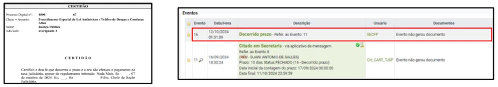

---

INTRODUÇÃO

**EPROC PARA SEGUNDO GRAU****–****UNIDADE JUDICIAL****|**Conteúdo integral do curso
<small>**10**</small>
▪**Compromisso com a sustentabilidade**

Enxergar o processo eletrônico como uma poderosa forma de promover a

sustentabilidade, reduzindo o impacto ambiental e otimizando o uso de recursos.

▪**Comprometimento com o aprendizado contínuo**

É imprescindível que todos participem das capacitações disponíveis. Isso dá segurança

para lidar com o novo sistema e mantém a eficiência e qualidade do Tribunal.

Com menos resistência e uma nova mentalidade, a transição para o eproc será mais tranquila e

os benefícios do sistema, mais bem aproveitados.

---

INTERFACE DO SISTEMA

**EPROC PARA SEGUNDO GRAU****–****UNIDADE JUDICIAL****|**Conteúdo integral do curso
<small>**11**</small>
# ▪ INTERFACE DO SISTEMA

No topo da página, há uma barra com informações e opções de acesso rápido, descritas abaixo:
<small>**Descrição da imagem**: página inicial do eproc com destaque para a barra verde localizada na parte superior da tela.</small>
▪ o ícone**“****Abrir menu****”**, representado por três linhas brancas paralelas, exibe ou oculta

o**menu lateral**;

▪ o símbolo do eproc abre o**“****Painel Inicial****”**;

▪ a sigla do Estado direciona o usuário à página do Tribunal;

▪ o campo seguinte exibe a lotação do usuário;

▪ a**Plataforma Digital do Poder Judiciário****–****Marketplace**;

▪ o ícone representado pelo desenho de uma casinha abre a**página inicial do sistema**;

▪**“****Meus Localizadores****”**, representado pelo desenho de um gaveteiro;

▪ os números**1**,**2**e**3**são botões de acesso rápido configurados pelo usuário;

▪ o campo de**pesquisa pelo número do processo, completo ou reduzido**;

▪ e o ícone**“****Perfil do usuário****”**, representado pelo desenho de uma pessoa.

---

INTERFACE DO SISTEMA

**EPROC PARA SEGUNDO GRAU****–****UNIDADE JUDICIAL****|**Conteúdo integral do curso
<small>**12**</small>
**Perfil do usuário**

O botão “Perfil do usuário” abre um menu com diversas funcionalidades.
<small>**Descrição da imagem**: parte da tela do eproc com destaque para o menu do ícone**“Perfil do Usuário”**.</small>
Quando o sistema for atualizado ou tiver alguma alteração, o ícone**“Novidades”**estará sinalizado

com uma bolinha vermelha, bastando clicar sobre ele para que a atualização/alteração seja exibida

em uma nova página.

Em**“Configurações”**, o servidor pode habilitar e desabilitar notificações, definir acessos rápidos,

conferir as ações mais utilizadas, personalizar recursos de acessibilidade e a aparência do sistema,

entre outros. É importante que o usuário explore todas as opções de configurações a fim de que

o sistema se torne funcional para o desempenho das atividades rotineiras de maneira

personalizada, ou seja, de acordo com as atividades de cada servidor.

É possível habilitar a**“Barra de acessibilidade”**, visível no topo da tela, com opções que facilitam

a navegação.

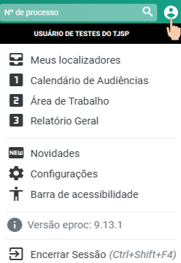

---

INTERFACE DO SISTEMA

**EPROC PARA SEGUNDO GRAU****–****UNIDADE JUDICIAL****|**Conteúdo integral do curso
<small>**13**</small><small>**Descrição da imagem**: tela do eproc com destaque para a**“Barra de acessibilidade”**do ícone**“Perfil do usuário”**e à</small><small>própria barra habilitada no topo da página</small>
O menu também traz:

▪ o número da versão do sistema;

▪ e o botão**“Encerrar Sessão”**,o qual pode também ser ativado por meio do das teclas

“Ctrl”, “Shift” e “F4”.

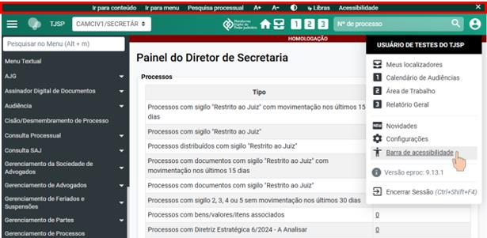

---

INTERFACE DO SISTEMA

**EPROC PARA SEGUNDO GRAU****–****UNIDADE JUDICIAL****|**Conteúdo integral do curso
<small>**14**</small>
**MENU LATERAL OU MENU TEXTUAL**

À esquerda da página inicial do eproc está o**menu lateral**, com uma barra de busca no topo e

opções listadas abaixo.
<small>**Descrição da imagem**: tela do eproc com destaque para o menu lateral esquerdo.</small>
O campo**“Pesquisar no Menu”**, pode ser selecionado por um clique ou pelas teclas “Alt” e “M”.

Ao digitar uma palavra completa ou apenas um conjunto de letras, o sistema retorna todas as

funções que contenham tal informação no título.

Por exemplo, uma busca pela expressão “sess” retorna resultados como “Sessão de Julgamento”,

“Cronograma de Sessões de Julgamento”, dentre outros, conforme imagem a seguir.
<small>**Descrição da imagem**: tela do eproc com destaque à pesquisa das funcionalidades que contêm a expressão “sess”.</small>
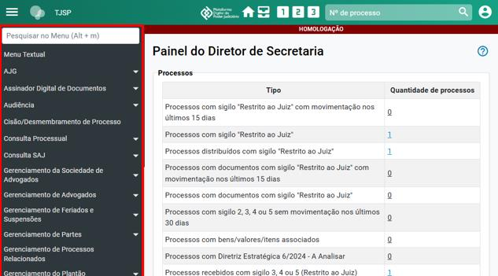

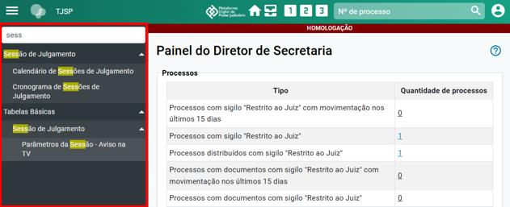

---

CONSULTA PROCESSUAL

**EPROC PARA SEGUNDO GRAU****–****UNIDADE JUDICIAL****|**Conteúdo integral do curso
<small>**15**</small>
# ▪ CONSULTA PROCESSUAL

No eproc, a busca por processo pode ser feita a partir de diversos parâmetros: número, nome das

partes, CPF etc. Detalharemos as duas formas de pesquisa a seguir.

**Na tela inicial do sistema**

Na tela inicial do sistema, o campo de consulta processual localizado na barra superiorpossibilita

a consulta pelo número completo (com o ano e os demais caracteres: .. .2024. 8. 26. 0000) ou

reduzido (com os números do processo que antecedem o seu ano, por exemplo: 505959942).

Após digitar os números, é possível clicar no ícone de uma lupa, para que o processo seja aberto

na mesma janela, ou no ícone**“Abrir em nova janela”**, representado por um quadrado com uma

seta na diagonal.
<small>**Descrição da imagem**: tela “Consulta Processual- Detalhes do Processo” com destaque para o campo de pesquisa e</small><small>o ícone da lupa.</small>
Na consulta, o sistema exibirá todas as informações do processo divididas por seções, como “Capa

do processo”, “Lembretes”, “Assuntos” etc.

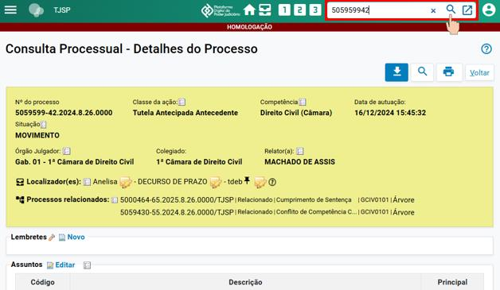

---

CONSULTA PROCESSUAL

**EPROC PARA SEGUNDO GRAU****–****UNIDADE JUDICIAL****|**Conteúdo integral do curso
<small>**16**</small>
**No menu lateral**

É possível acessar a tela**“Consulta Processual”**, a partir do menu lateral, opção “Consultar

Processos”.
<small>**Descrição da imagem**: tela “Consulta Processual” aberta, com destaque à sua localização no menu lateral e ao menu</small><small>expandido do item “Tipo de Pesquisa” no centro da tela.</small>
Na tela Consulta Processual, no campo “Tipo de Pesquisa”, o eproc apresenta vários filtros. Um

deles é o**“Número de Processo, Chave”**, que obedece à mesma lógica do campo de consulta

processual visto anteriormente, por número simplificado ou completo do processo.
<small>**Descrição da imagem**: tela “Consulta Processual”, destaque ao ícone de uma interrogação exibindo uma caixa de</small><small>diálogo com o texto “Consulta simplificada por número de processo”.</small>

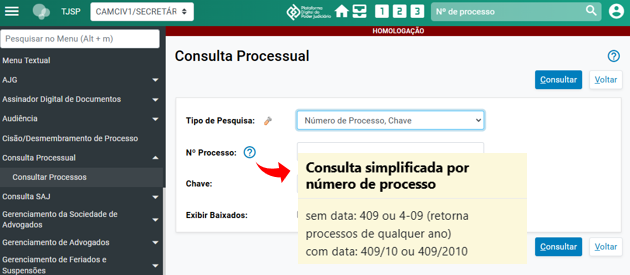

---

CONSULTA PROCESSUAL

**EPROC PARA SEGUNDO GRAU****–****UNIDADE JUDICIAL****|**Conteúdo integral do curso
<small>**17**</small>
No tipo**“Nome da Parte”**, após digitado o nome, o usuário deverá especificar o**“Tipo de Parte”**:

autor, réu, interessado,*amicus curiae*, conciliador, testemunha autor, testemunha réu etc.

O eproc usa a base de dados da Receita Federal. Por isso, uma consulta pelo nome de uma das

partes não necessariamente significa que há um processo cadastrado em relação a ela. Da mesma

forma, se a consulta for feita a partir de um nome comum, o sistema exibirá uma lista de nomes

completos e os respectivos CPFs e CNPJs para que a busca seja refinada.

**Atenção**

Para pesquisar processos a partir do nome da vítima, deve-se selecionar o tipo

“Interessado”.

A pesquisa pode ser feita pelo número do CNPJ da pessoa jurídica ou, se pessoa física, pelo CPF.

O sistema também permite selecionar a classe processual, realizar uma pesquisa fonética, incluir

partes interessadas, buscar por variações do nome digitado e consultar processos já baixados.
<small>**Descrição da imagem**: tela “Consulta Processual” aberta, com destaque aos campos de preenchimento.</small>

---

CONSULTA PROCESSUAL

**EPROC PARA SEGUNDO GRAU****–****UNIDADE JUDICIAL****|**Conteúdo integral do curso
<small>**18**</small>
**CAPA DO PROCESSO**

A capa do processo é uma seção da página que contém informações importantes, como:

▪ Número do processo

▪ Classe da ação

▪ Competência

▪ Data de autuação

▪ Situação – visível para o público externo

▪ Órgão Julgador

▪ Colegiado(a) e Relator;

▪ Localizadores, visível apenas para o público interno

▪ Processos relacionados (no eproc os processos relacionados equivalem aos processos

apensados).
<small>**Descrição da imagem**: capa de um processo com as informações citadas acima.</small>
**Atenção**

O sistema eproc reproduz as cores das capas dos processos da Justiça Federal. No 2º

grau, as capas dos processos podem variar em 11 cores a depender da classe

processual: amarelo, azul, azul-claro, palha, branco, cinza, laranja, rosa, salmão,

verde e vermelho.

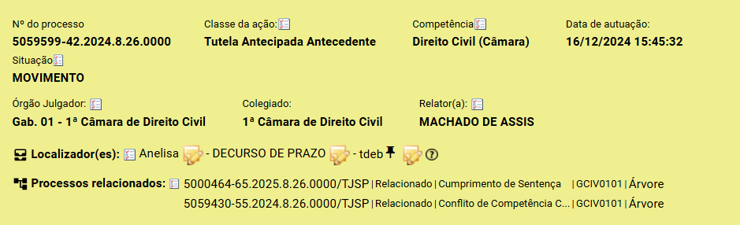

---

CONSULTA PROCESSUAL

**EPROC PARA SEGUNDO GRAU****–****UNIDADE JUDICIAL****|**Conteúdo integral do curso
<small>**19**</small>
**Lembretes**

Os lembretes servem para os usuários internos, podendo ser direcionados a procuradores dos

processos e outros externos.
<small>**Descrição da imagem**: seção “Lembretes” da capa do processo.</small>
**Assuntos**

A seção de assuntos do processo fica logo abaixo dos lembretes.

Na capa do processo, o botão “Editar” permite remover, inserir e alterar os assuntos e sua ordem

de exibição. O assunto principal será sempre exibido em negrito e antes dos demais.
<small>**Descrição da imagem**: seção “Assuntos” da capa do processo.</small>
**Atenção**

Os assuntos do processo devem ser o mais assertivo possível e corresponder

exatamente aos fatos descritos nos autos, sendo um referencial na fiscalização e

análise dos processos por parte do CNJ junto aos Tribunais e às Varas.

**Partes e Representantes**

Na capa do processo, o sistema exibe os autores, os réus e os interessados, com possibilidade de

inclusão, exclusão e alteração dos dados das partes diretamente na capa do processo.

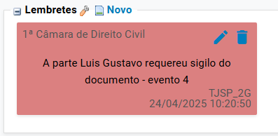

---

CONSULTA PROCESSUAL

**EPROC PARA SEGUNDO GRAU****–****UNIDADE JUDICIAL****|**Conteúdo integral do curso
<small>**20**</small>
Abaixo do nome de cada parte, o sistema exibe o nome do respectivo procurador com o número

de inscrição na OAB.

**Importante**

Um sinal de verificação verde ao lado do nome e CPF ou CNPJ da parte significa que

ela está com o cadastro de acordo com os dados da Receita Federal.

Se o sinal de verificação estiver amarelo ou com um ponto de interrogação, deve-se

acessar o cadastro da parte clicando em seu nome para atualizar os dados.
<small>**Descrição da imagem**: seção “Partes e Representantes” da capa do processo com destaque para os sinais de</small><small>verificação na cor verde.</small>
**Minutas**

O eproc reúne todos os expedientes emitidos no processo (despachos, sentenças, decisões,

mandados etc. ) na seção**“Minutas”**.

Se a caixa de seleção “Exibir Anexadas ao Processo” for marcada, somente as minutas que já estão

no processo serão listadas. Se não marcada a caixa de seleção, o sistema mostrará também as

minutas em edição.

Há também as opções “Exibir Excluídas/Anuladas” e “Manter minutas em aberto”.

---

CONSULTA PROCESSUAL

**EPROC PARA SEGUNDO GRAU****–****UNIDADE JUDICIAL****|**Conteúdo integral do curso
<small>**21**</small><small>**Descrição da imagem**: seção “Minutas” da capa do processo.</small>
**Informações Adicionais**

Nessa seção, o sistema apresenta inúmeras informações importantes do processo, como a chave,

justiça gratuita, parte com doença grave, nível de sigilo do processo, dentre outras.
<small>**Descrição da imagem**: seção “Informações Adicionais” da capa do processo.</small>
A alteração dessas informações é realizada a partir do botão de atividade “Retificar Autuação” da

seção**Ações**da capa do processo, ou a partir do menu lateral, opção “Retificação de Autuação”.

**Ações**

Esta seção reúne todas as atividades que podem ser realizadas no processo como acessar a

“árvore” para visualização dos documentos, citar, intimar, movimentar, associar procurador à

parte, dentre outras.

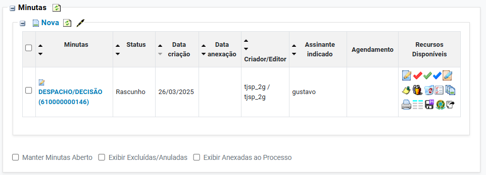

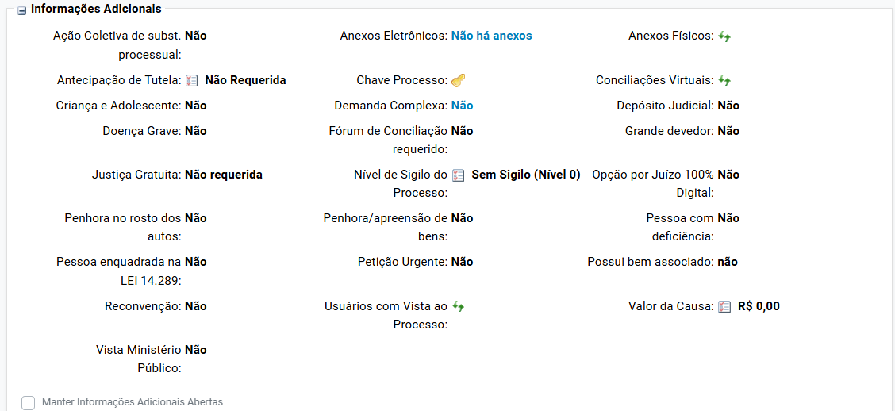

---

CONSULTA PROCESSUAL

**EPROC PARA SEGUNDO GRAU****–****UNIDADE JUDICIAL****|**Conteúdo integral do curso
<small>**22**</small><small>**Descrição da imagem**: seção “Ações” da capa do processo.</small>
**Botões facilitadores e preferências**

Logo abaixo da seção**“Ações”**, o sistema apresenta alguns botões que facilitam a realização de

atividades:**Minutar**e**Preferências**(de minutas)**, Movimentar**e**Preferências**(de movimentação),

**Intimar**e**Preferências**(de intimação).
<small>**Descrição da imagem**: barra de botões facilitadores.</small>
**Tabela de eventos**

No eproc, os eventos equivalem às “movimentações” do outro sistema. Nessa seção, são exibidos

todos os eventos realizados no processo e suas especificidades.

O usuário pode filtrar por eventos com documentos, eventos de decisão, eventos externos e

eventos marcados como relevantes. Um evento é marcado como “relevante” se a ele for atribuída

uma estrela de destaque, localizada em coluna própria na tabela de eventos, conforme imagem

abaixo.
<small>**Descrição da imagem**: seção “Eventos” com destaques ao menu de filtros e ao ícone de uma estrela ao lado do</small><small>número de um processo.</small>

---

CONSULTA PROCESSUAL

**EPROC PARA SEGUNDO GRAU****–****UNIDADE JUDICIAL****|**Conteúdo integral do curso
<small>**23**</small>
Além das seções descritas anteriormente, o eproc exibe na capa do processo uma barra com

botões de atividade para download completo do processo, nova consulta, cópia do processo para

colá-lo no Excel, impressão e retorno à tela anterior.
<small>**Descrição da imagem**: botões de atividade citados acima.</small>

---

PAINÉIS DOS PERFIS

**EPROC PARA SEGUNDO GRAU****–****UNIDADE JUDICIAL****|**Conteúdo integral do curso
<small>**24**</small>
# ▪ PAINÉIS DOS PERFIS

**PAINEL DO DIRETOR DE SECRETARIA**

Na interface inicial do eproc há um painel com funcionalidades e recursos exibidos de acordo com

o perfil do usuário.

O primeiro abordado nesta aula será o “Painel do Diretor de Secretaria”, que é atribuído ao Gestor

da Unidade Judicial.
<small>**Descrição da imagem**: tela “Painel do Diretor de Secretaria” com lista de processos classificados por tipo e</small><small>quantidade.</small>
O “Painel do Diretor de Secretaria” também pode ser acessado por meio do ícone representado

pelo símbolo do eproc, localizado na barra superior verde.

Ele oferece uma visão geral das tarefas, prazos, pendências e atividades de responsabilidade da

Unidade, possibilitando ao gestor o gerenciamento e controle dos processos. O usuário pode

desenvolver todo seu trabalho a partir dessa tela.

O painel possui as seguintes seções:

▪ “Processos”: o sistema elenca informações importantes que são monitoradas pelo

gestor, como “Processos com sigilo ‘Restrito ao Juiz´”; “Processos com documentos

com sigilo ‘Restrito ao Juiz’”, entre outros;

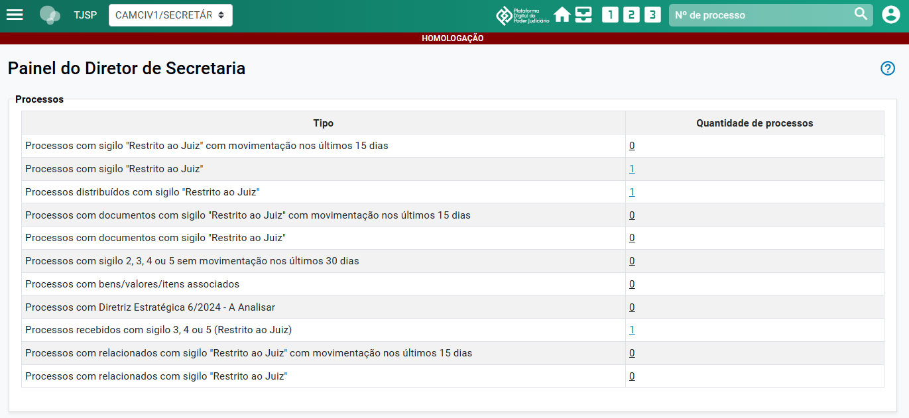

---

PAINÉIS DOS PERFIS

**EPROC PARA SEGUNDO GRAU****–****UNIDADE JUDICIAL****|**Conteúdo integral do curso
<small>**25**</small>
▪ “Localizadores”: aqui constam todos os localizadores do sistema com a quantidade de

processos existentes em cada um deles. Ao clicarmos sobre o número informativo, o

sistema abrirá uma tela listando os processos com tal localização;

▪ “Minutas”;

▪ “Meus Localizadores”;

▪ “Processos em Sessões de Julgamento”;

▪ “Meus Localizadores”;

▪ “Processos por Localizador”

▪ “Relatório Geral”;

▪ “Temas Repetitivos e com Repercussão Geral”;

▪ “Assistência Judiciária Gratuita”;

▪ “Mandados”; e

▪ “Cartas AR”.

Na tabela abaixo, está listado o item “Processos com Localizador ‘DECURSO DE PRAZO’” na coluna

“Tipo”, com o número “5” na coluna “Quantidade de Processos”. Ao clicar sobre o número, o

sistema listará todos os processos anotados com este localizador.
<small>**Descrição da imagem**: seção “Localizadores” com destaque para a quantidade de processos com localizador</small><small>“decurso de prazo”.</small>
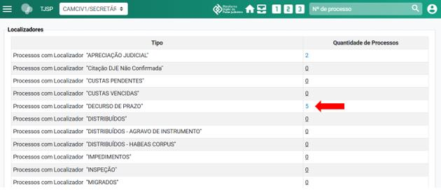

---

PAINÉIS DOS PERFIS

**EPROC PARA SEGUNDO GRAU****–****UNIDADE JUDICIAL****|**Conteúdo integral do curso
<small>**26**</small><small>**Descrição da imagem**: tela com lista de processos com localizador “decurso de processo”, exibindo acima o texto</small><small>“15 registros”.</small>
**PAINEL DO SERVIDOR**

O outro que iremos abordar será o “Painel do Servidor”.
<small>**Descrição da imagem**: tela “Painel do Servidor”, visualização da seção “Localizadores”.</small>
Ele possui as mesmas seções do Painel do Diretor de Secretaria, descritas no capítulo anterior, com

exceção da seção “Processos”, que é destinada à gestão e ao controle das Unidades.

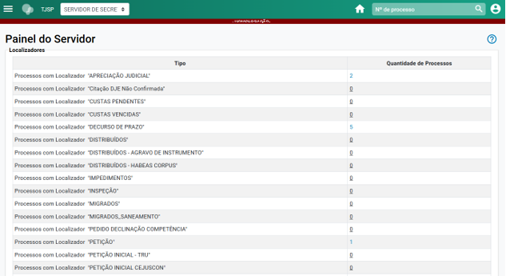

---

PAINÉIS DOS PERFIS

**EPROC PARA SEGUNDO GRAU****–****UNIDADE JUDICIAL****|**Conteúdo integral do curso
<small>**27**</small>
A seção “Cartas AR”, por exemplo, permite ao servidor visualizar e acessar as cartas em edição,

assinadas (não enviadas), as que aguardam envio, as enviadas, dentre outras situações

quantificadas em tabela própria.
<small>**Descrição da imagem**: tela “Painel do Servidor” com destaque para a seção “Cartas AR”.</small>
Para melhorar a visualização, pode-se ocultar o**menu lateral**pelo ícone das três linhas brancas,

no canto superior esquerdo da tela, conforme visto na primeira aula.
<small>**Descrição da imagem**: tela “Painel do Servidor” maximizada após o menu lateral ser oculto a partir do respectivo</small><small>botão, em destaque.</small>
Vale lembrar que o eproc é fluido e permite que cada usuário o personalize de forma a facilitar o

seu trabalho.

---

LOCALIZADORES – TIPOS DE LOCALIZADORES

**EPROC PARA SEGUNDO GRAU****–****UNIDADE JUDICIAL****|**Conteúdo integral do curso
<small>**28**</small>
# ▪ LOCALIZADORES – TIPOS DE

**LOCALIZADORES**

Com o objetivo de gerenciar e facilitar a organização dos processos, o sistema eproc dispõe da

funcionalidade**localizadores**.
<small>**Descrição da imagem**: “Painel do Diretor de Secretaria” com destaque para a seção “Localizadores”.</small>
Os localizadores podem representar a situação do processo (ex. :**“Ag. Decurso de Prazo”**) ou uma

característica dele (ex. :**“Meta 2 –****CNJ”**).

No eproc, o processo pode possuir mais de um localizador, mas nunca pode ficar sem um.
<small>**Descrição da imagem**: campo “Localizador(es)” da capa do processo.</small>
**Atenção**

Não é o processo que está no localizador, mas o localizador que está no processo.

Podemos pensar nos localizadores como etiquetas que são coladas e retiradas do

processo durante toda sua tramitação.

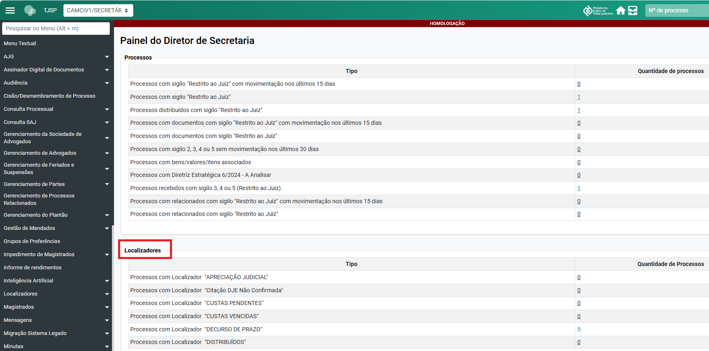

---

LOCALIZADORES – TIPOS DE LOCALIZADORES

**EPROC PARA SEGUNDO GRAU****–****UNIDADE JUDICIAL****|**Conteúdo integral do curso
<small>**29**</small>
**TIPOS DE LOCALIZADORES**

**Localizadores de sistema**

Os localizadores de sistema são aqueles previamente configurados pelos administradores do

sistema. São comuns a todas as unidades e**não**são passíveis de alterações pelos usuários.

Eles estão nomeados em caixa alta (letras maiúsculas) para que sejam rapidamente diferenciados

dos localizadores do órgão, que veremos a seguir.

Esses localizadores “funcionam” de forma automática a partir de determinada ocorrência

processual, como a entrada de uma petição, decurso de prazo ou alguma comunicação recebida;

mas o sistema nunca irá retirar automaticamente do processo esse tipo de localizador sem que

haja a intervenção de um usuário ou algum tipo de automação.

Por exemplo: os processos remetidos pelo Gabinete para a Unidade Judicial receberão

automaticamente o localizador de entrada**“RECEBIDOS”**.

Já os processos que recebem uma petição intermediária, automaticamente possuirão o localizador

**“PETIÇÃO”**.

A partir do peticionamento, os localizadores são inseridos nos processos e lá permanecerão até

que sejam removidos seja de forma manual ou valendo-se de automatizações.

Geralmente, os localizadores de sistema podem ser considerados localizadores de entrada.
<small>**Descrição da imagem**: seção “Localizadores” com exibição dos localizadores de sistema.</small>
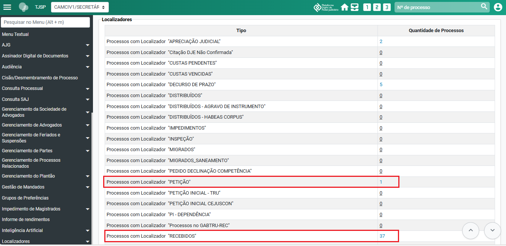

---

LOCALIZADORES – TIPOS DE LOCALIZADORES

**EPROC PARA SEGUNDO GRAU****–****UNIDADE JUDICIAL****|**Conteúdo integral do curso
<small>**30**</small>
**Localizadores do órgão**

Localizadores do órgão são aqueles criados pelos usuários em sua respectiva lotação. Cada usuário,

observada a sua lotação, poderá criar localizadores para gerenciar seus processos; no entanto, a

criação de novos localizadores deve ser convencionada junto a toda a equipe.

Eles devem ser criados de acordo com os atos praticados pelos(as) servidores(as) e magistrados(as)

daquela lotação a fim de impulsionar o processo judicial, refletindo a posição do processo durante

seu trâmite, isto é, acompanham a movimentação processual.

Para uma fluidez melhor do trabalho, é muito importante alinhar com toda a equipe a criação e

organização de localizadores e, ainda, desativar aqueles que não estão sendo utilizados.

A criação de um localizador é realizada no**menu lateral**ao inserir a palavra “localizadores”**(na**

**imagem, 1)**e selecionar a opção**“Localizadores do Órgão”****(2)**. Na tela seguinte, clicar em**“Novo”**

**(3)**.
<small>**Descrição da imagem**: tela “Localizadores do Órgão”, com destaque às ações acima enumeradas.</small>
Em seguida, inserir um nome para o localizador, sua sigla, se é fixo ou não e criar uma descrição

para o localizador. Após, clicar em**“Salvar”**.
<small>**Descrição da imagem**: tela “Novo Localizador do Órgão” com as informações citadas acima preenchidas.</small>
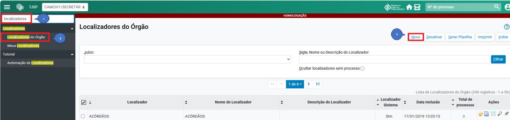

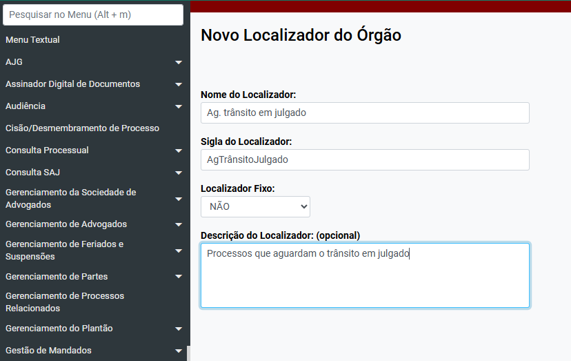

---

LOCALIZADORES – TIPOS DE LOCALIZADORES

**EPROC PARA SEGUNDO GRAU****–****UNIDADE JUDICIAL****|**Conteúdo integral do curso
<small>**31**</small>
Sugere-se não os nomear em caixa alta (letra maiúscula) para que não sejam confundidos com os

localizadores do sistema.

A inclusão de um localizador do órgão em um processo se dá pelo usuário ou em consequência da

automatização de localizadores.

**Atenção**

Qualquer usuário pode criar localizadores, inclusive os estagiários. Além disso, é

possível excluir localizadores criados por outros usuários. Até o presente momento,

não é possível verificar quem cria ou exclui localizadores, somente por meio de

solicitação de auditoria. Importante saber que, para excluir um localizador, ele não

pode estar vinculado a nenhum processo ou automatização.

**Alteração do cadastro do localizador do órgão**

Na tela**“Localizadores do Órgão”**, selecionar o localizador a ser alterado e clicar no ícone**“Alterar**

**Localizador Órgão”**, representado por uma folha de papel e um lápis.
<small>**Descrição da imagem**: tela “Localizadores do Órgão” com localizador selecionado e destaque para ícone “Alterar</small><small>Localizador Órgão”.</small>
Na tela**“Alterar Localizador do Órgão”**, realizar a alteração e clicar em**“Salvar”**.
<small>**Descrição da imagem**: tela “Alterar Localizador do Órgão” com destaque para o botão “Salvar”.</small>

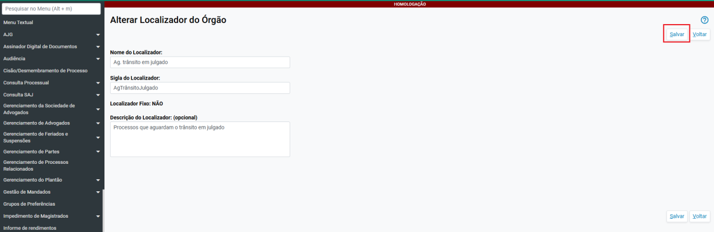

---

LOCALIZADORES – TIPOS DE LOCALIZADORES

**EPROC PARA SEGUNDO GRAU****–****UNIDADE JUDICIAL****|**Conteúdo integral do curso
<small>**32**</small>
**Desativação do localizador do órgão**

A desativação de um localizador do órgão é realizada na tela**“Localizadores do Órgão”**ao clicar

na caixa de seleção referente ao localizador a ser excluído e, após, acionar o botão**“Desativar”**.
<small>**Descrição da imagem**: tela “Localizadores do Órgão” com destaque ao botão “Desativar”.</small>
**Localizadores fixos**

Um localizador fixo não pode ser alterado por regra de automatização e nem por movimentação

processual, apenas por intervenção de um servidor, que executará a operação diretamente na

capa do processo, de modo individual.

Ele pode ser utilizado para auxiliar no controle de processos em situações excepcionais, como

aqueles priorizados em metas do CNJ. Nesse caso, podem ser considerados “marcadores

processuais”.

Para tornar um localizador fixo, no momento de sua criação ou alteração basta selecionar a opção

**“SIM”**no campo**“Localizador Fixo”**e salvar.
<small>**Descrição da imagem**: tela “Novo Localizador do Órgão” com a opção “SIM” marcada no campo “Localizador Fixo”.</small>

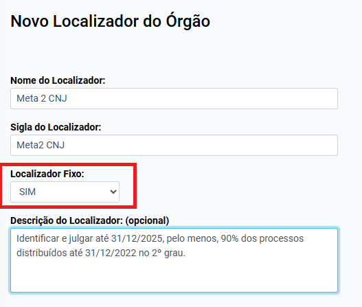

---

LOCALIZADORES – LISTA DE PROCESSOS POR LOCALIZADOR

**EPROC PARA SEGUNDO GRAU****–****UNIDADE JUDICIAL****|**Conteúdo integral do curso
<small>**33**</small>
# ▪ LOCALIZADORES – LISTA DE PROCESSOS

**POR LOCALIZADOR**

A tela**“Lista de Processos por Localizador”**permite realizar uma busca por processos em um ou

mais localizadores, inclusive com personalização das colunas que serão exibidas na tabela de

resultados, por meio do campo**“Critérios de Exibição”**.

Para acessar referida tela, digitar “lista” na barra de busca do**menu lateral**e clicar no item**“Lista**

**de Processos por Localizador”**.

Na tela, selecionar os localizadores específicos que se procura filtrar no campo**“Localizador”**

(imagem 1) ou clicar em**“Selecionar Todos”**(2). Feita a seleção, o campo indicará o nome do

localizador, se só um, ou a quantidade de itens selecionados, se dois ou mais.

Importante observar que a opção**“OU”**(3) já vem marcada. Ela define que o sistema traga

processos que estão em**pelo menos um**dos localizadores selecionados. Se desejado, selecionar o

**“Tipo de paginação”**(4) e os**“Critérios de Exibição”**(5). Então, clicar em**“Consultar”**(6).
<small>**Descrição da imagem**: tela “Lista de Processos por Localizador” com destaque aos campos citados acima.</small>

---

LOCALIZADORES – LISTA DE PROCESSOS POR LOCALIZADOR

**EPROC PARA SEGUNDO GRAU****–****UNIDADE JUDICIAL****|**Conteúdo integral do curso
<small>**34**</small>
Realizada a consulta, o sistema exibe o relatório com todos os processos que se encontram nos

localizadores selecionados e de acordo com os critérios de exibição.
<small>**Descrição da imagem**: relação dos processos que se encontram no localizador selecionado.</small>
Para usar o filtro**“E”**ao invés do filtro**“OU”**, é necessário combinar até 03 (três) localizadores. O

eproc exibirá processos que correspondam a todos os localizadores selecionados,

simultaneamente.
<small>**Descrição da imagem**: relação de processos que se encontram nos localizadores selecionados.</small>
Para acessar um dos processos listados, é preciso selecioná-lo e clicar sobre seu número. O eproc

o exibirá em uma nova aba.

Para realizar uma atividade em lote, selecionar os processos e a opção desejada, na seção**“Ações”**.
<small>**Descrição da imagem**: destaque para as atividades exibidas na seção “Ações”.</small>
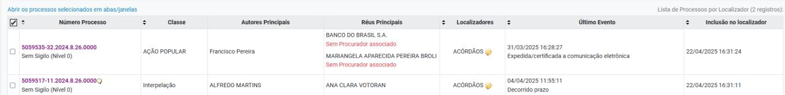

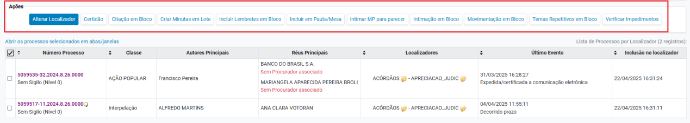

---

LOCALIZADORES – MEUS LOCALIZADORES

**EPROC PARA SEGUNDO GRAU****–****UNIDADE JUDICIAL****|**Conteúdo integral do curso
<small>**35**</small>
# ▪ LOCALIZADORES – MEUS

**LOCALIZADORES**

O eproc permite que o servidor personalize sua área de trabalho, incluindo os localizadores mais

utilizados em suas tarefas diárias e agrupando-os na tela**Meus Localizadores**. Essa tela pode ser

alterada a qualquer momento e configurada como página inicial do sistema.

**Configurando a tela “Meus Localizadores” como página inicial**

No painel inicial do eproc, clicar sobre o ícone**Perfil do usuário**(na imagem, 1), localizado no canto

superior direito da tela, e selecionar a opção**“Configurações”**(2).
<small>**Descrição da imagem**: Painel inicial com destaque para o ícone “Perfil do usuário” e para a opção “Configurações”.</small>
Com a tela**Configurações personalizadas**aberta, na seção**“Inicialização”**, campo**“Página****inicial**

**do sistema”**, selecionar a opção**“Meus Localizadores”**.

As configurações são**salvas automaticamente**quando os campos são alterados.

Caso o usuário deseje configurar outra tela como página inicial, também é possível acessar**“Meus**

**Localizadores”**, conforme indicado a seguir.

**Acessando a tela****“Meus Localizadores”**

Utilizar o campo de pesquisa do**menu lateral**para digitar**“Meus Localizadores”**(ou parte da

expressão) ou clicar no ícone**“Meus Localizadores”**, representado pela figura de um gaveteiro, no

menu superior.

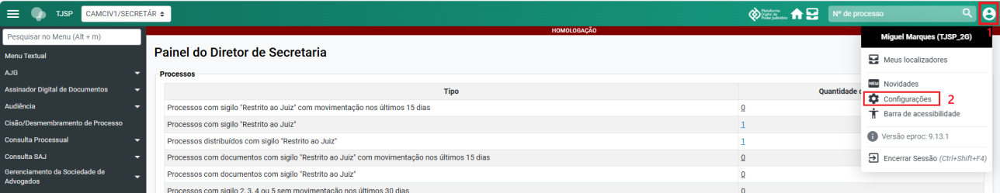

---

LOCALIZADORES – MEUS LOCALIZADORES

**EPROC PARA SEGUNDO GRAU****–****UNIDADE JUDICIAL****|**Conteúdo integral do curso
<small>**36**</small>
**Personalizando a tela “Meus Localizadores”**

Após acessada – pela página inicial,**menu lateral**ou**ícone na barra verde superior**(na imagem,

1) –, a personalização da tela dá-se por meio do botão “Alterar Lista” (2).
<small>**Descrição da imagem**: tela “Meus Localizadores”, destaque ao ícone “Meus Localizadores” e ao botão “Alterar</small><small>Lista”.</small>
Na tela seguinte,**“Cadastro dos Meus Localizadores”**, expandir o campo**“Localizadores”**pela seta

do menu suspenso, localizar e selecionar a opção desejada. Neste exemplo, selecionado o

localizador**“AGRAVO”**. Ao selecionar o item escolhido, este será exibido automaticamente no

campo**“Localizadores”**.
<small>**Descrição da imagem**: tela “Cadastro dos Meus Localizadores” com destaque para campo “Localizadores” e para a</small><small>opção “AGRAVO”.</small>
Na sequência, clicar no botão do menu suspenso do campo**“Localizadores”**para encolhê-lo e,

depois, no botão**“Incluir”**.

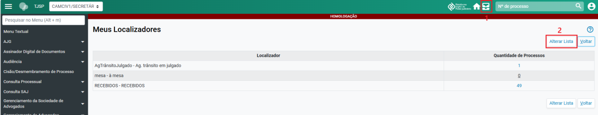

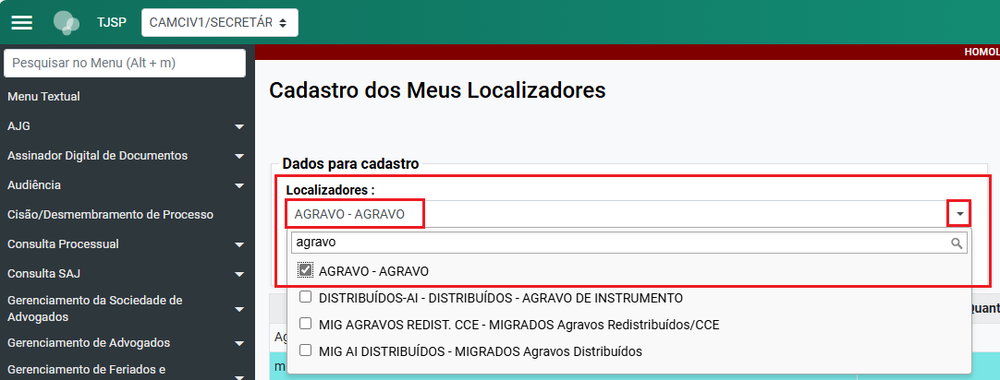

---

LOCALIZADORES – MEUS LOCALIZADORES

**EPROC PARA SEGUNDO GRAU****–****UNIDADE JUDICIAL****|**Conteúdo integral do curso
<small>**37**</small><small>**Descrição da imagem**: tela “Cadastro dos Meus Localizadores” com destaque ao botão “Incluir”.</small>
Ainda nesta tela, é possível selecionar o**“Critério de Ordenação”**e o**“Critério de Exibição”**:
<small>**Descrição da imagem**: visualização dos campos para configuração de exibição de critérios.</small>
Após a inclusão, o localizador escolhido passa a fazer parte da lista. Se desejar que o marcador seja

exibido no painel inicial, marcar a respectiva caixa de seleção da coluna**“Mostrar no Painel Inicial”**

e clicar em**“Salvar no Painel Inicial”**, no canto superior direito da tela.
<small>**Descrição da imagem**: destaque ao localizador “AGRAVO” e à caixa de seleção da coluna “Mostrar no Painel Inicial”.</small>
Para excluir localizadores da lista, acionar o ícone**“Excluir Item”**, disponível na coluna**“Ações”**,

representado por uma lixeira.

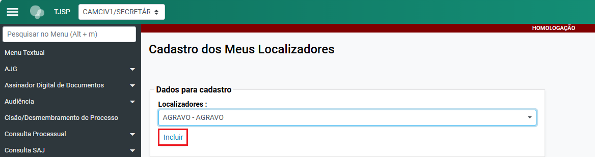

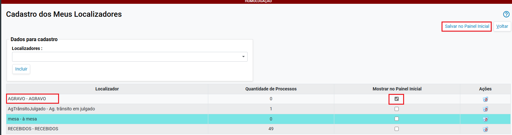

---

LOCALIZADORES – MEUS LOCALIZADORES

**EPROC PARA SEGUNDO GRAU****–****UNIDADE JUDICIAL****|**Conteúdo integral do curso
<small>**38**</small><small>**Descrição da imagem**: tela “Cadastro dos Meus Localizadores” com destaque à coluna “Ações” e ao ícone “Excluir</small><small>Item”.</small>
Estas configurações permitem que o servidor deixe visíveis na tela somente os localizadores que

mais utiliza no dia a dia, agilizando o cumprimento processual.

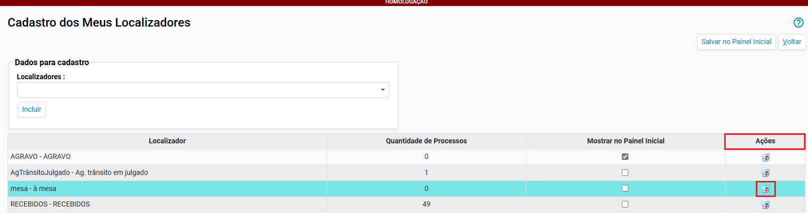

---

LOCALIZADORES – GERENCIAR LOCALIZADORES PELA CAPA DO PROCESSO

**EPROC PARA SEGUNDO GRAU****–****UNIDADE JUDICIAL****|**Conteúdo integral do curso
<small>**39**</small>
## ▪ LOCALIZADORES – GERENCIAR

**LOCALIZADORES PELA CAPA DO PROCESSO**

No sistema eproc a inclusão ou exclusão dos localizadores dá-se pela capa do processo.

Com o processo na tela, no campo**“Localizador(es)”**, clicar sobre o nome de um dos localizadores

já existentes e o campo será expandido para inclusão ou exclusão.
<small>**Descrição da imagem**: capa do processo com destaque para o campo “Localizador(es)”.</small>
**Para incluir um localizador**

Com o campo**“Localizadores”**expandido, digitar parte do nome do localizador (na imagem, 1) e

escolher entre as opções (2). Após, clicar em**“Salvar”**(3).
<small>**Descrição da imagem**: capa do processo com destaque para os campos citados acima.</small>
Após o salvamento, o novo localizador já se encontrará na capa do processo.

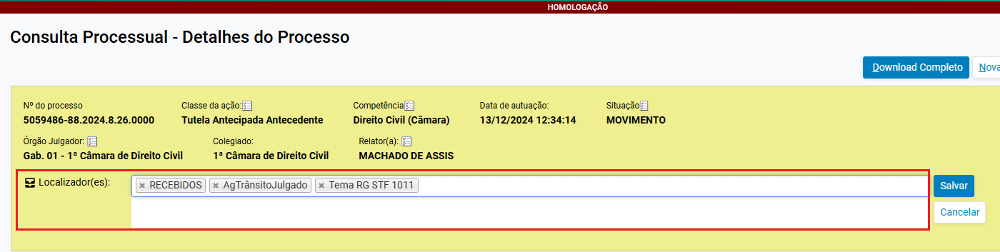

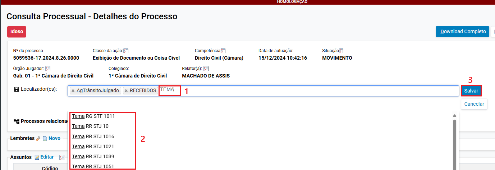

---

LOCALIZADORES – GERENCIAR LOCALIZADORES PELA CAPA DO PROCESSO

**EPROC PARA SEGUNDO GRAU****–****UNIDADE JUDICIAL****|**Conteúdo integral do curso
<small>**40**</small><small>**Descrição da imagem**: capa do processo exibindo o localizador inserido.</small>
**Para excluir um localizador**

Com o campo Localizadores expandido, clicar no “x” correspondente ao localizador que se quer

excluir e acionar o botão**“Salvar”**.
<small>**Descrição da imagem**: capa do processo com destaque ao ícone para exclusão.</small>
O localizador selecionado (neste caso, “RECEBIDOS”) não constará mais na capa do processo.
<small>**Descrição da imagem**: capa do processo exibindo os localizadores existentes, exceto o que foi excluído.</small>
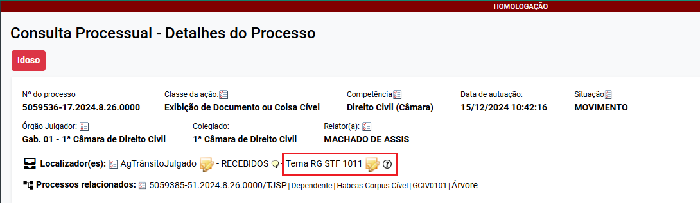

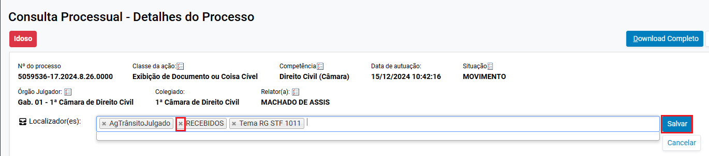

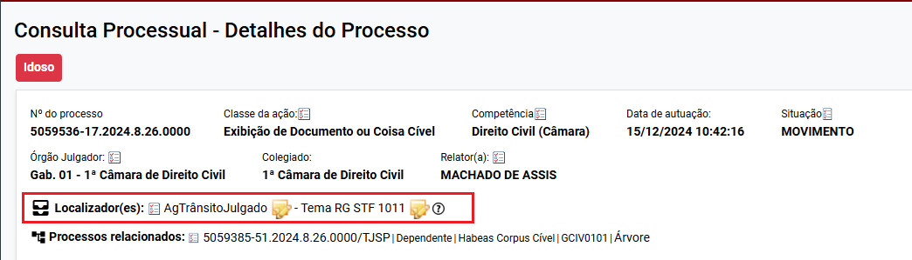

---

LOCALIZADORES – GERENCIAR LOCALIZADORES PELA CAPA DO PROCESSO

**EPROC PARA SEGUNDO GRAU****–****UNIDADE JUDICIAL****|**Conteúdo integral do curso
<small>**41**</small>
**Atenção**

Somente usuários internos, inclusive de outras Câmaras e Gabinetes (pelo histórico

dos localizadores), conseguem visualizar, na capa do processo, os localizadores do

processo. Usuários externos (advogado, parte, MP, DP) conseguem apenas visualizar

a situação do processo, não os localizadores.

**Histórico de localizadores do processo**

O campo**Localizador**possui um histórico de todos os registros de localizadores existentes no

processo. Para acessá-lo clicar no ícone**“Histórico Processo”**representado por uma folha de papel

à frente do localizador.
<small>**Descrição da imagem**: destaque para o ícone “Histórico Processo”.</small>
Será aberta a tela**“Histórico de Localizadores do Processo”**com informações sobre a inclusão e

exclusão (desativação) dos localizadores naquele processo.
<small>**Descrição da imagem**: tela “Histórico de Localizadores do Processo”.</small>

---

LOCALIZADORES – GERENCIAR LOCALIZADORES PELA CAPA DO PROCESSO

**EPROC PARA SEGUNDO GRAU****–****UNIDADE JUDICIAL****|**Conteúdo integral do curso
<small>**42**</small>
**Incluir memo em localizador**

Também é possível incluir uma observação no localizador, clicando no ícone**“Incluir Memo em**

**localizador”**representado por um papel e lápis amarelos ao lado do nome do localizador.
<small>**Descrição da imagem**: destaque para o ícone “Incluir Memo em localizador”.</small>
Será aberta a tela**“Memo Localizador do Órgão”**com o campo**“Informações”**para que o usuário

possa inserir o conteúdo desejado. Após, clicar em**“Salvar”.**
<small>**Descrição da imagem**: tela “Memo Localizador do Órgão” com destaque para o campo “Informações” e o botão</small><small>“Salvar”.</small>
Observe que o ícone**“Incluir Memo em localizador”**será alterado pelo ícone representado por

um balão de diálogo amarelo. Ao posicionar o mouse sobre o ícone será exibido o conteúdo do

memo inserido, bem como o usuário que o inseriu.

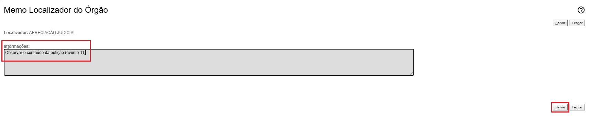

---

LOCALIZADORES – GERENCIAR LOCALIZADORES PELA CAPA DO PROCESSO

**EPROC PARA SEGUNDO GRAU****–****UNIDADE JUDICIAL****|**Conteúdo integral do curso
<small>**43**</small><small>**Descrição da imagem**: destaque para o ícone e o conteúdo do memo inserido.</small>
Para excluir o memo inserido, clicar sobre o ícone representado por um balão de diálogo amarelo.

Na tela**“Memo Localizador do Órgão”**clicar no botão**“Desativar”.**
<small>**Descrição da imagem**: destaque para o botão “Desativar”.</small>
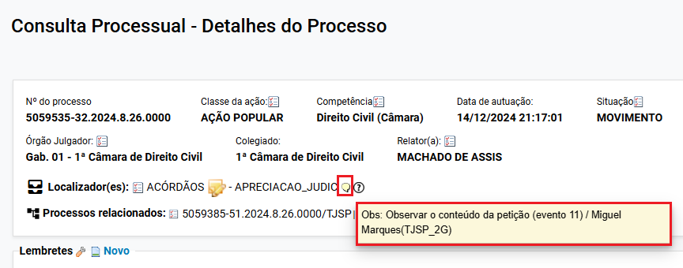

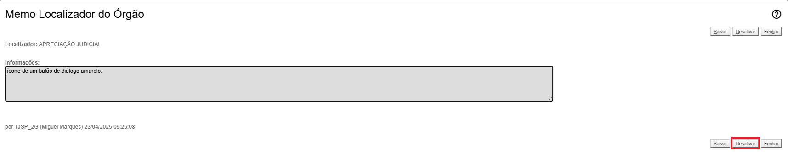

---

EVENTOS

**EPROC PARA SEGUNDO GRAU****–****UNIDADE JUDICIAL****|**Conteúdo integral do curso
<small>**44**</small>
# ▪ EVENTOS

Assim como os localizadores, os**eventos**estão entre os elementos mais importantes do eproc.

Todo ato praticado em um processo, seja por usuários internos ou externos, contendo ou não

documentos, será acompanhado do lançamento de um evento. Em outras palavras, um evento é

o registro de uma atividade ou movimentação realizada no processo.

São exemplos de eventos:

▪ Ato ordinatório praticado;

▪ Decorrido prazo;

▪ Decisão/Despacho – Determinada Requisição de Informações;

▪ Expedida/certificada a comunicação eletrônica;

▪ Remetidos os autos com acórdão.

A função dos eventos no eproc pode ser comparada à das movimentações lançadas nos processos

em trâmite em outros sistemas, mas eles são estruturados e apresentados de uma nova forma,

possibilitando o acompanhamento da**tabela de eventos**.

**Tabela de eventos**

A**tabela de eventos**, localizada na parte inferior da capa do processo, lista todos os eventos

registrados em um processo e suas especificações.
<small>**Descrição da imagem**: tabela de eventos de um processo.</small>
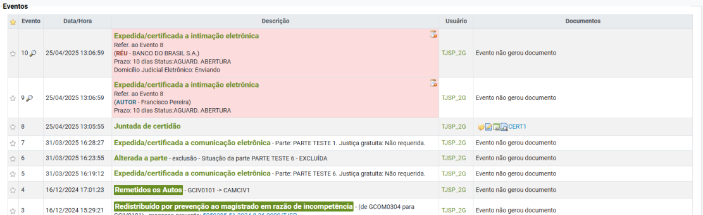

---

EVENTOS

**EPROC PARA SEGUNDO GRAU****–****UNIDADE JUDICIAL****|**Conteúdo integral do curso
<small>**45**</small>
**Coluna “Evento relevante”**

Para cada um dos eventos, é possível clicar sobre o ícone de uma estrela, localizado na primeira

coluna da tabela, para marcá-lo (estrela amarela) ou desmarcá-lo (estrela branca) como relevante.
<small>**Descrição da imagem**: tabela de eventos com destaque à coluna “Evento relevante”.</small>
Esse destaque será especialmente importante em processos extensos, sendo possível a elaboração

de relatórios e filtros específicos para considerar apenas os eventos marcados como relevantes.
<small>**Descrição da imagem**: menu “Filtros” expandido com seleção do item “Marcados como Relevantes”.</small>

---

EVENTOS

**EPROC PARA SEGUNDO GRAU****–****UNIDADE JUDICIAL****|**Conteúdo integral do curso
<small>**46**</small>
**Coluna “Evento”**

Na segunda coluna da tabela, os eventos são numerados e listados em ordem decrescente. Em

alguns, haverá uma lupa ao lado do número, a qual exibe um quadro de informações quando se

posiciona o cursor sobre ela.
<small>**Descrição da imagem**: destaque à coluna “Evento” da tabela e a um dos itens numerados com o ícone de uma lupa,</small><small>exibindo o quadro “Informações do Evento”.</small>
**Coluna “Data/Hora”**

A terceira coluna, “Data/Hora”, detalha o dia e a hora da prática do ato processual.
<small>**Descrição da imagem**: destaque para a coluna “Data/Hora” da tabela de eventos.</small>
**Coluna “Descrição”**

Apresenta a especificação e mais informações do evento, variáveis conforme o tipo.

Por exemplo, para uma certificação de intimação eletrônica, é indicado o número do evento para

o qual foi realizada a intimação. Já para uma remessa de autos entre unidade judicial e gabinete,

são indicadas as siglas das lotações de origem e destino.

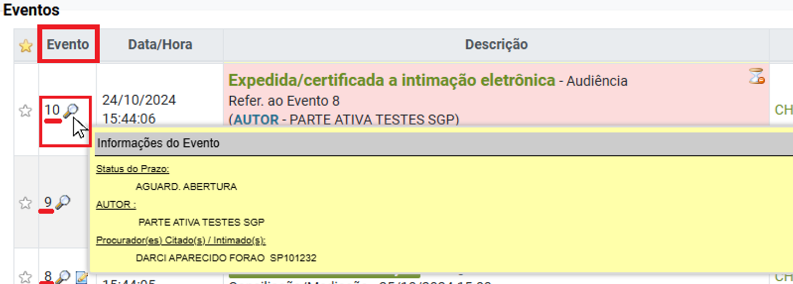

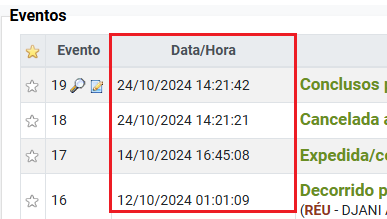

---

EVENTOS

**EPROC PARA SEGUNDO GRAU****–****UNIDADE JUDICIAL****|**Conteúdo integral do curso
<small>**47**</small><small>**Descrição da imagem**: destaque para a coluna “Descrição” da tabela de eventos.</small>
**Coluna “Usuário”**

É possível verificar o responsável pela prática do evento na tabela, seja ele um usuário externo,

interno ou de sistema, como nos casos de eventos lançados por rotinas automatizadas (decurso

de prazo, por exemplo).
<small>**Descrição da imagem**: tabela de eventos com destaque para a coluna “Usuário”.</small>
Posicionar o mouse sobre o nome do usuário exibirá seus dados, dando rápida identificação.
<small>**Descrição da imagem**: cursor sobre o usuário de evento específico, exibindo quadro “Dados do usuário”.</small>
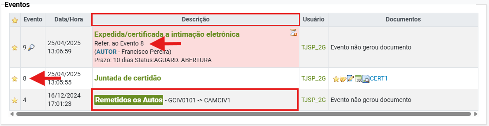

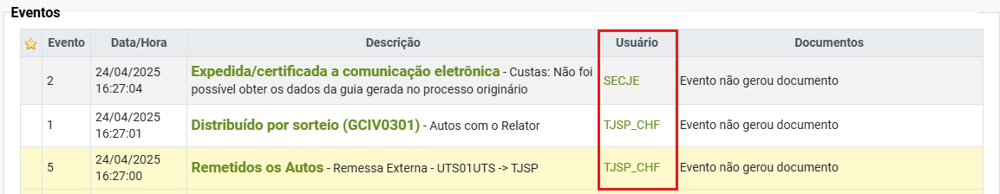

---

EVENTOS

**EPROC PARA SEGUNDO GRAU****–****UNIDADE JUDICIAL****|**Conteúdo integral do curso
<small>**48**</small>
**Coluna “****Documentos****”**

Caso o evento esteja associado a um documento emitido ou juntado, este será indicado na coluna

“Documentos”.
<small>**Descrição da imagem**: destaque a evento com documento associado na coluna “Documentos” da tabela de eventos.</small>
Junto ao nome do documento, são apresentados ícones que servem de botões de atividade:
<small>**Descrição da imagem**: ícones ao lado do nome do documento na coluna “Documentos”.</small>
▪**Marcar/Desmarcar como relevante**, representado por uma estrela;

▪**Adicionar memorando**, representado por um balão de diálogo: abre a tela “Memo do

documento do processo”. Após digitar o texto desejado no campo “Informações” e

clicar em “Salvar”, o texto será exibido na coluna “Documentos”;
<small>**Descrição da imagem**: à esquerda, tela “Memo documento do processo”, destaque ao campo “Informações” com</small><small>texto digitado; à direita, texto exibido na coluna “Documentos”.</small>
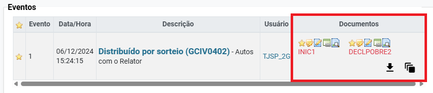

---

EVENTOS

**EPROC PARA SEGUNDO GRAU****–****UNIDADE JUDICIAL****|**Conteúdo integral do curso
<small>**49**</small>
▪**Alteração Tipo Documento e Sigilo**, representado por uma sulfite e um lápis: além de

poder editar o tipo e o nível de sigilo, é apresentado o histórico de alterações já

realizadas no documento;
<small>**Descrição da imagem**: tela “Alteração Tipo Documento e Sigilo”.</small>
▪**Copiar link para o documento**, representado por uma janela e uma corrente: permite

que o documento seja acessado no acesso a outros relacionados, sem a necessidade

de consulta recorrente à capa ou à árvore do processo.
<small>**Descrição da imagem**: quadro “Copiar link para documento”, destaque ao link disponibilizado.</small>

---

EVENTOS

**EPROC PARA SEGUNDO GRAU****–****UNIDADE JUDICIAL****|**Conteúdo integral do curso
<small>**50**</small>
▪**Informações do documento**, ícone variável conforme o tipo (html, pdf etc. ): ao

posicionar o cursor do mouse sobre ele, são exibidos nome, tipo, sigilo, observação e

tamanho e será aberto um quadro com o teor do documento e opções de cópia ou

impressão.
<small>**Descrição da imagem**: quadro “Informações do Documento” e tela com teor, botões de cópia e impressão.</small>
**Filtragem de eventos**

O menu “Filtros” permite configurar a exibição de eventos:

▪**com documentos**;

▪**de decisão:**despachos, decisões e sentenças;

▪**de outro Grau:**Exibe os eventos de 1º e 2º Graus, se houver, com cores de fundo

diferenciadas;

▪**externos:**lançados por advogados, procuradores etc. ;

▪**marcados como relevantes**.
<small>**Descrição da imagem**: campo “Filtros”, com exibição das seleções possíveis de filtragem.</small>
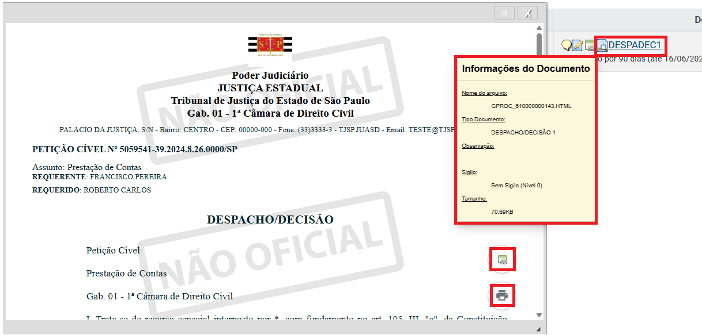

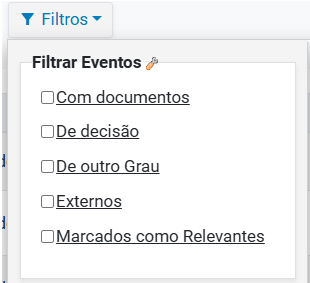

---

EVENTOS

**EPROC PARA SEGUNDO GRAU****–****UNIDADE JUDICIAL****|**Conteúdo integral do curso
<small>**51**</small>
Ao lado, encontra-se a barra de**pesquisa nos eventos**.
<small>**Descrição da imagem**: caixa para pesquisa nos eventos, presente ao lado do menu “Filtros”.</small>
De livre digitação, ela filtra a tabela de eventos conforme o texto é inserido, buscando resultados

em todas as colunas. Pode-se, inclusive, pesquisar por descrições de documentos.
<small>**Descrição da imagem**: caixa de pesquisa de eventos preenchida com a palavra “resumo”, resultando na exibição de</small><small>um único evento cujo documento possui esta palavra na descrição.</small>

---

LANÇAMENTO DE EVENTOS

**EPROC PARA SEGUNDO GRAU****–****UNIDADE JUDICIAL****|**Conteúdo integral do curso
<small>**52**</small>
# ▪ LANÇAMENTO DE EVENTOS

Sempre que um ato é realizado, seja de**intimação**,**movimentação**ou**elaboração de minuta**de

documento, será lançado no processo um evento associado a essa ação. Esse lançamento pode

ser configurado manualmente ou feito de forma automatizada.

**Configuração manual de eventos**

Quando o usuário está realizando um ato manualmente, é necessária a seleção de um evento

associado à ação realizada.

Se necessária uma intimação eletrônica em apenas um processo, por exemplo, pode-se acessar o

botão “Intimar” na seção “Ações” da capa do processo.
<small>**Descrição da imagem**: seção “Ações”, destaque para o botão “Intimar”.</small>
Aberta a tela**“****Intimação Eletrônica****”**, deve-se expandir o menu do campo “Evento de

citação/intimação” e selecionar a opção mais adequada ao caso.
<small>**Descrição da imagem**: tela “Intimação Eletrônica”, destaque ao campo “Evento de citação/intimação” preenchido</small><small>(“Expedida/certificada a intimação eletrônica – Contrarrazões ao(s) agravo(s)”).</small>
Já para a emissão de minutas, acessa-se a opção “Nova” na seção “Minutas”.
<small>**Descrição da imagem**: seção “Minutas” com visualização do botão “Nova”.</small>

---

LANÇAMENTO DE EVENTOS

**EPROC PARA SEGUNDO GRAU****–****UNIDADE JUDICIAL****|**Conteúdo integral do curso
<small>**53**</small>
Na tela**“****Nova Minuta****”**, o usuário marca a caixa de “Agendar lançamento de Evento/troca de

localizador”, habilitando o campo “Evento a ser lançado”, no qual é possível digitar para realizar

filtragem dinâmica, exibindo opções para seleção, ou clicar em “Listar Todos”.
<small>**Descrição da imagem**: campo “Evento a ser lançado” preenchido com “ajuste”, exibindo opções que contêm este</small><small>texto em seu título. Destaque para o botão “Listar Todos”.</small>
**Importante**

Em algumas hipóteses não se deve agendar o lançamento do evento, como na

emissão de relatório/voto e acórdão. O tema será abordado em mais detalhes na aula

11.

Há também como selecionar evento para simples movimentações de processos, como envio de

autos à mesa para julgamento ou trânsito em julgado (sem intimação e sem documento

associado). Na capa, selecionar “Movimentar Processo” na seção “Ações”.
<small>**Descrição da imagem**: seção “Ações”, destaque para o botão “Movimentar Processo”.</small>
Inserir o evento adequado no campo “Evento a ser lançado”.
<small>**Descrição da imagem**: campo “Evento a ser lançado” preenchido com “inclu”, exibindo resultados com este texto no</small><small>título.</small>
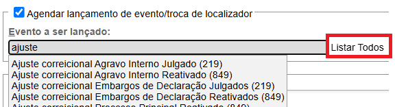

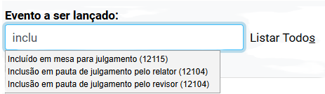

---

LANÇAMENTO DE EVENTOS

**EPROC PARA SEGUNDO GRAU****–****UNIDADE JUDICIAL****|**Conteúdo integral do curso
<small>**54**</small>
**Eventos automáticos**

Alguns eventos são lançados automaticamente pelo sistema, como o**decurso de prazo**.

Na figura abaixo, pode-se observar que o evento**4**, “Expedida/Certificada a intimação eletrônica”,

teve um prazo de 15 dias associado, após o qual o próprio sistema lançou o evento**6**, “Decorrido

o prazo”, com referência ao evento**4**em sua descrição.
<small>**Descrição da imagem**: tabela de eventos com exibição do evento 6, “Decorrido prazo”, fazendo referência ao evento</small><small>4 na descrição.</small>
**ALTERAÇÃO DO TIPO DO DOCUMENTO DE**

**PETIÇÃO PARA INCIDENTE**

Nos casos em que o incidente tiver sido peticionado de forma equivocada, a correção poderá ser

realizada pela própria tabela de eventos.

Por exemplo, em uma situação hipotética, o advogado peticionou embargos de declaração

quando, na realidade, trata-se de agravo interno.
<small>**Descrição da imagem**: evento 8 – Embargos de Declaração.</small>
Para efetuar a correção, na coluna Documentos, clicar em**“Editar Tipo de Petição, Documento e**

**Sigilo”**. Na tela que se abrirá, alterar os campos**“Tipo Documento”**,**“Sigilo”**e**“Tipo de Petição”**

para se fazer constarem os dados corretos, e então clicar em**“Salvar”**.

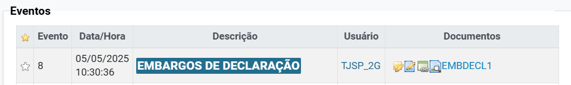

---

LANÇAMENTO DE EVENTOS

**EPROC PARA SEGUNDO GRAU****–****UNIDADE JUDICIAL****|**Conteúdo integral do curso
<small>**55**</small><small>**Descrição da imagem**: tela “Alteração Tipo de Petição, Documento e Sigilo”, com destaque aos campos Tipo</small><small>Documento, Sigilo Documento e Tipo de Petição preenchidos e ao botão Salvar.</small>
Após o salvamento, o evento anterior terá sua descrição e tipo de documento alterados conforme

as informações inseridas. Também terá sido lançado um novo evento no processo, informando da

retificação efetivada.
<small>**Descrição da imagem**: tabela de eventos, com destaque para o evento 9 – Retificado o movimento, e para as</small><small>informações atualizadas no evento 8 (descrição e tipo do documento).</small>

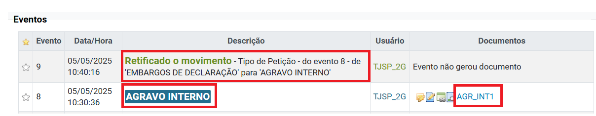

---

MINUTAS – CONCEITO, BLOQUEIO, DESBLOQUEIO E ACESSO

**EPROC PARA SEGUNDO GRAU****–****UNIDADE JUDICIAL****|**Conteúdo integral do curso
<small>**56**</small>
# ▪ MINUTAS – CONCEITO, BLOQUEIO,

**DESBLOQUEIO E ACESSO**

Por definição, minuta é a primeira redação, ainda não definitiva, de um texto ou de um

documento. Trata-se de um rascunho ou esboço.

Embora, em muitos tribunais, minutas sejam relacionadas a documentos decisórios, como

despachos, decisões e sentenças, no eproc, o termo engloba qualquer documento emitido no

sistema por usuários internos, como atos ordinatórios, certidões, ofícios, cartas, mandados e

termos de audiência. Será comum nos referirmos a “minuta de ato ordinatório” e “minuta de

termo de audiência”, por exemplo.

As minutas no eproc sempre pertencem a um processo específico, nunca sendo documentos

avulsos, e podem ser elaboradas individualmente ou em lote. A expedição em lote, porém, requer

um modelo-padrão (abordado mais adiante), não possibilitando edição.

**Bloqueio de minutas**

Não há como usuários diferentes editarem uma minuta ao mesmo tempo. Se utilizada por alguém,

ela ficará bloqueada e sinalizada por um ícone de cadeado. Ao clicar neste, o eproc informa o dia,

a hora e o responsável pelo bloqueio.
<small>**Descrição da imagem**: destaque para o ícone de minuta bloqueada.</small>
**Desbloqueio de minutas**

O usuário que criou a minuta pode autorizar que outros a editem. Para isso, acessar o botão

“Retirar bloqueio da minuta”, representado por um cadeado na coluna “Recursos Disponíveis” da

seção “Minutas” na capa do processo.

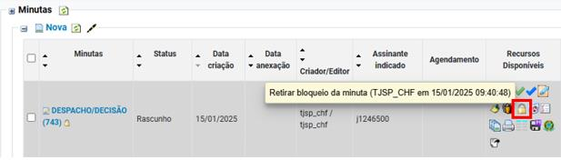

---

MINUTAS – CONCEITO, BLOQUEIO, DESBLOQUEIO E ACESSO

**EPROC PARA SEGUNDO GRAU****–****UNIDADE JUDICIAL****|**Conteúdo integral do curso
<small>**57**</small><small>**Descrição da imagem**: seção “Minutas”, destaque à coluna “Recursos disponíveis” e ao ícone de retirar bloqueio.</small>
**Atenção**

Clicar no “x” da aba aberta no navegador para fechar um documento manterá a

minuta bloqueada. Deve-se sempre usar os botões disponíveis no editor de texto.

**Acesso às minutas**

Pode-se acessá-las no “Painel Inicial”, pelo**menu lateral**ou por meio dos**processos**. As três formas

serão abordadas a seguir.

**Pelo “Painel Inicial”**

A seção**Minutas**está no painel inicial e exibe tabela com duas colunas:**“Descrição”**e**“Quantidade**

**de****minutas”**.
<small>**Descrição da imagem**: “Painel inicial” com destaque às colunas da tabela na seção “Minutas”.</small>

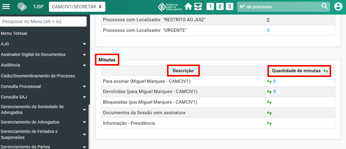

---

MINUTAS – CONCEITO, BLOQUEIO, DESBLOQUEIO E ACESSO

**EPROC PARA SEGUNDO GRAU****–****UNIDADE JUDICIAL****|**Conteúdo integral do curso
<small>**58**</small>
**Pelo menu lateral**

Na barra de busca do menu lateral, buscar por “minutas” para exibir as opções equivalentes.
<small>**Descrição da imagem**: “Painel inicial” com destaque ao menu lateral após busca personalizada.</small>
**A partir de um processo**

Com processo aberto na tela, localizar a seção “Minutas” e clicar no ícone “Expandir” (sinal de

adição).
<small>**Descrição da imagem**: seção “Minutas” de processo, destaque ao ícone “Expandir”.</small>
O eproc apresentará todas as minutas existentes do processo aberto.
<small>**Descrição da imagem**: seção “Minutas” expandida com relação de minutas já emitidas.</small>
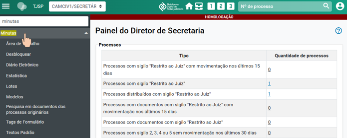

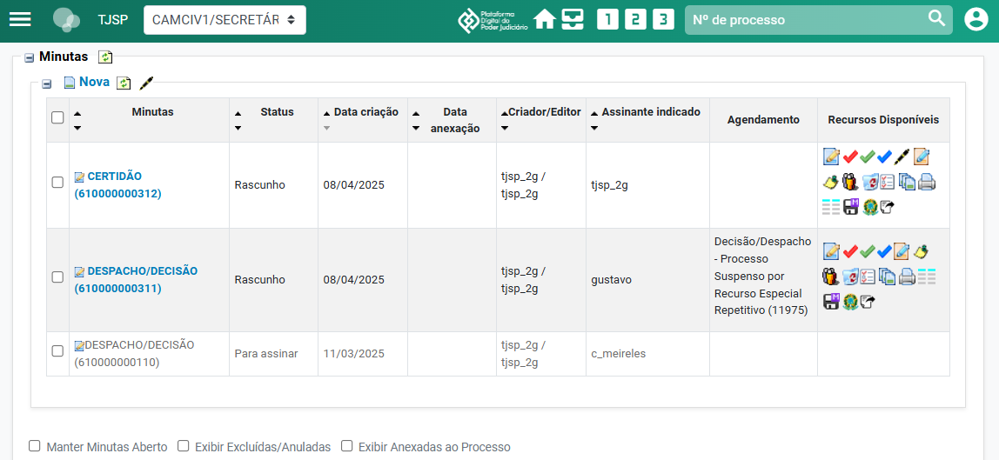

---

MINUTAS – TEXTO-PADRÃO

**EPROC PARA SEGUNDO GRAU****–****UNIDADE JUDICIAL****|**Conteúdo integral do curso
<small>**59**</small>
# ▪ MINUTAS – TEXTO-PADRÃO

No eproc, o texto-padrão é um conteúdo sem formatação que pode ser aplicado na elaboração de

qualquer documento para agilizar o trabalho. Ele pode ser uma palavra, uma frase, um fragmento

de texto, um texto corrido ou até citações de artigos, cláusulas de acordo etc.

O banco de textos-padrão do eproc exige certa organização e atenção a nomenclaturas e

classificações, assim como nos modelos-padrão, que serão abordados em aulas futuras.

**Criação do texto-padrão**

Para criar um texto-padrão, pesquisar por**“Textos Padrão”**no**menu lateral**. Na tela aberta,

movendo a barra de rolagem, está a biblioteca de textos-padrão existentes. Clicar em**“Novo”**.
<small>**Descrição da imagem**: tela “Textos Padrão” com relação de modelos existentes na biblioteca.</small><small>**Descrição da imagem**: tela “Textos Padrão” com destaque para o botão novo.</small>
Na tela**“Novo Texto Padrão”**, inserir a**descrição**(nome do texto), a**sigla de autotexto**(será usada

nos documentos para importar o texto), a**cor**e a**classificação**, se o caso, e selecionar a opção

“Público” para que todos os usuários internos,**inclusive os de outras unidades**, possam acessá-lo.

Clicar em**Salvar**.

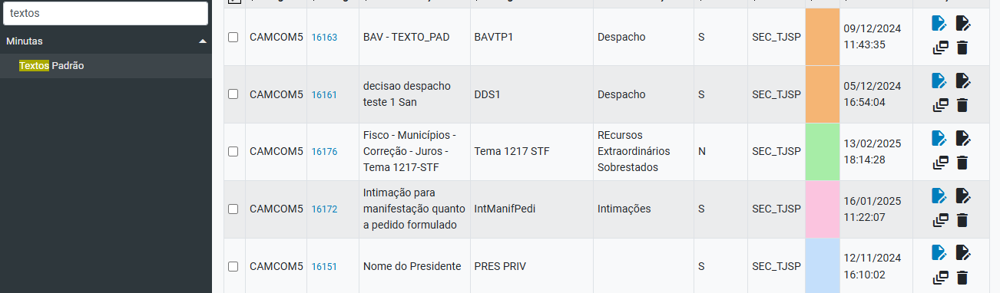

---

MINUTAS – TEXTO-PADRÃO

**EPROC PARA SEGUNDO GRAU****–****UNIDADE JUDICIAL****|**Conteúdo integral do curso
<small>**60**</small><small>**Descrição da imagem**: tela “Novo Texto Padrão” com destaque aos campos a serem preenchidos e ao botão</small><small>“Salvar”.</small>
O editor de texto-padrão será exibido. Sua aparência é similar à do editor de minutas, mas possui

a**cor verde**no menu para diferenciá-lo da tela de criação de um documento. Inserir o conteúdo

no editor.
<small>**Descrição da imagem**: tela do editor de texto-padrão com o fundo do menu na cor verde.</small>
Após, clicar no botão de atividade “**Salvar texto padrão e sair****”**para que o texto criado apareça na

biblioteca da tela**“Textos Padrão”**.
<small>**Descrição da imagem**: tela “Textos Padrão” com destaque ao texto criado exibido na biblioteca.</small>

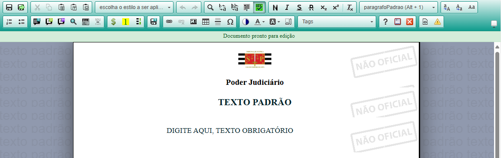

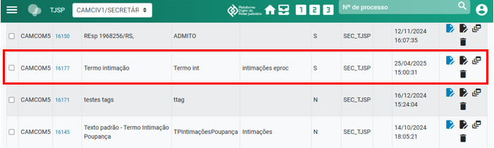

---

MINUTAS – TEXTO-PADRÃO

**EPROC PARA SEGUNDO GRAU****–****UNIDADE JUDICIAL****|**Conteúdo integral do curso
<small>**61**</small>
Na coluna “Ações” da biblioteca estão os seguintes ícones:

▪**“Editar texto****padrão”**(sulfite e lápis azuis): alterar um texto;

▪**“Alterar dados do texto****padrão”**(sulfite e lápis pretos): alterar dados do texto-padrão

(descrição, sigla, cor, classificação ou deixar público ou não);

▪**“Desativar texto****padrão”**(lixeira): excluir texto-padrão. Para consultar os excluídos,

clicar em “Listar Inativos” no menu superior da tela. Para reativar um texto excluído,

clicar em “Reativar texto-padrão” (lixeira com seta branca);

▪**“Histórico de Versões do texto (consultar, comparar, copiar)”**(três janelas

sobrepostas): visualizar o conteúdo de cada versão e copiar uma versão anterior.
<small>**Descrição da imagem**: tela “Versões do Texto” com histórico do texto-padrão criado.</small>
**RESUMO**

Durante a criação do texto padrão, é possível destacar o resumo do documento para exibição na

coluna**“Documentos da tabela de eventos”.**

Para destacá-lo, selecionar o trecho desejado e teclar o atalho**“Alt + R”**ou selecionar a opção

“resumo” no campo**“Estilos de formatação”**, opção**“Estilos de bloco”**na parte superior da tela,

ao lado direito do menu do editor.

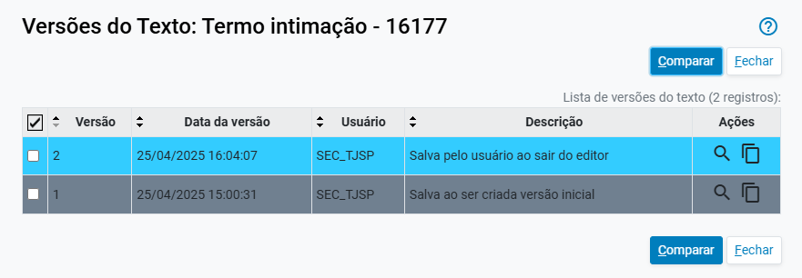

---

MINUTAS – TEXTO-PADRÃO

**EPROC PARA SEGUNDO GRAU****–****UNIDADE JUDICIAL****|**Conteúdo integral do curso
<small>**62**</small><small>**Descrição da imagem**: tela do editor do texto-padrão com o campo do menu superior expandido para seleção de</small><small>“resumo”.</small>
**Utilização do texto padrão**

O texto-padrão, assim como as*tags*, pode ser utilizado no momento da expedição das minutas

dos documentos (despacho, ofício, ato ordinatório, certidão etc. ) e na criação/edição dos

modelos-padrão.

**TEXTO-PADRÃO EM MINUTAS**

Com o editor de texto aberto, é possível inserir um texto-padrão das seguintes formas:

▪ digitar @ + todo ou parte do nome do documento para que uma lista de opções seja

exibida;
<small>**Descrição da imagem**: editor de texto de minuta com destaque para a digitação de “@term” e, abaixo, lista de</small><small>textos-padrão que contenham a expressão “term” em sua descrição.</small>

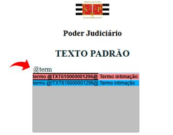

---

MINUTAS – TEXTO-PADRÃO

**EPROC PARA SEGUNDO GRAU****–****UNIDADE JUDICIAL****|**Conteúdo integral do curso
<small>**63**</small>
▪ outra opção para inserir um texto-padrão em uma minuta, no editor de texto: acionar

o botão inverso do mouse, selecionar a opção “Inserir Texto Padrão ou TAG”, clicar em

“Texto Padrão” e escolher o texto-padrão desejado;
<small>**Descrição da imagem**: editor de texto de minuta, destaque para opção “Inserir Texto Padrão ou TAG” no menu</small><small>acionado com o botão inverso do mouse.</small>
**◦**

aberta a tela “Selecionar Textos Padrão”, é possível filtrar a pesquisa por

diversos critérios, como “Usuário Criador”. Clicar em “Consultar” e o eproc

exibirá todos os textos-padrão criados pelo usuário determinado;
<small>**Descrição da imagem**: tela “Selecionar Textos Padrão”, destaque para filtro “Usuário Criador” e botão “Consultar”.</small>

---

MINUTAS – TEXTO-PADRÃO

**EPROC PARA SEGUNDO GRAU****–****UNIDADE JUDICIAL****|**Conteúdo integral do curso
<small>**64**</small>
▪ clicar no ícone “Inserir Texto Padrão ou TAG” da barra de ferramentas, representado

por uma caixa de diálogo com a letra “T”. Selecionar “Texto Padrão” e realizar busca

por filtros, como demonstrado no item anterior, se desejado;
<small>**Descrição da imagem**: editor de texto de minuta com destaque para ícone “Inserir Texto Padrão ou TAG”.</small>
**◦**

para inserir o texto, selecioná-lo e clicar no ícone**“****Transportar este item e**

**fechar****”**, representado por uma seta verde, ou em**“****Transportar****”**no menu

superior;
<small>**Descrição da imagem**: tela “Selecionar Textos Padrão”, destaque para o ícone “Transportar este item e Fechar” e o</small><small>botão “Transportar”.</small>
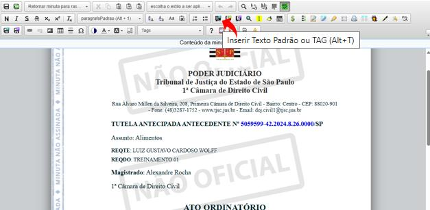

---

MINUTAS – TEXTO-PADRÃO

**EPROC PARA SEGUNDO GRAU****–****UNIDADE JUDICIAL****|**Conteúdo integral do curso
<small>**65**</small>
▪ digitar a**sigla de autotexto**definida durante a criação do texto-padrão e teclar “Alt” e

“T” para importá-lo. Se a sigla for composta por duas ou mais palavras e houver espaço

entre elas (por exemplo, “Termo in”), é necessário digitá-la, selecioná-la e teclar “Alt”

e “T” para que o conteúdo seja transportado.
<small>**Descrição da imagem**: editor de texto da minuta com sigla do texto-padrão e “ALT+T”.</small>
**TEXTO PADRÃO EM MODELOS PADRÃO**

Ao criarmos modelos-padrão, o sistema possibilita a inserção de vários textos-padrão dentro

desses modelos, de tal forma que eles fiquem disponíveis para utilização de acordo com cada

processo. Na barra de ferramentas do editor de modelos-padrão, clicar no ícone “Inserir Texto

Padrão ou TAG”, representado por uma caixa de diálogo com a letra “T”.
<small>Descrição da imagem: tela do editor de texto de modelo padrão com destaques para o ícone “Inserir Texto Padrão</small><small>ou TAG (Alt + T)” e para a opção “Texto Padrão”.</small>
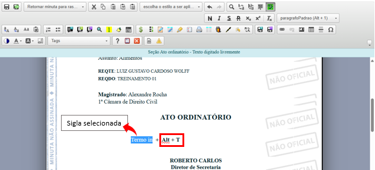

---

MINUTAS – TEXTO-PADRÃO

**EPROC PARA SEGUNDO GRAU****–****UNIDADE JUDICIAL****|**Conteúdo integral do curso
<small>**66**</small>
Ao clicar na opção “Texto Padrão”, a tela “Selecionar Textos Padrão” será aberta.
<small>**Descrição da imagem**: tela “Selecionar Textos Padrão”</small>
O texto-padrão pode ser transportado para o modelo-padrão de duas maneiras:
<small>▪</small>
ao clicar no ícone de uma**arroba vermelha**(“Transportar @TXTNNNNNNNNNNNN@

e fechar”): as*tags***“@TXT”**serão automaticamente substituídas pelo texto-padrão no

momento da emissão do documento final. Na tela do modelo-padrão, a*tag*será

exibida como no exemplo abaixo:

**◦**
<small>@TXT610000000664: Teste - TESTETEXTOPADRÃO</small>
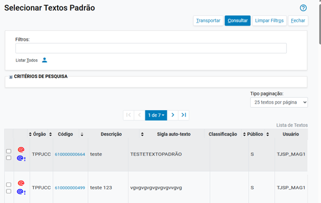

---

MINUTAS – TEXTO-PADRÃO

**EPROC PARA SEGUNDO GRAU****–****UNIDADE JUDICIAL****|**Conteúdo integral do curso
<small>**67**</small><small>**Descrição da imagem**: modelo-padrão com texto-padrão “@txt”.</small>
No documento final, o texto padrão será inserido na íntegra automaticamente:
<small>**Descrição da imagem**: editor de texto do documento final (termo de audiência) com destaque para o conteúdo</small><small>integral do texto contido na*tag*“@txt”.</small><small>▪</small>
clicar no ícone de uma**arroba azul**(“Transportar @! TXTNNNNNNNNNNNN@ e

fechar”): as*tags***“****@! TXT****”**não são substituídas automaticamente no texto final,

exigindo um comando do teclado para exibição do conteúdo. A tela do modelo-padrão

fica como no modo anterior, exceto pela exclamação após a arroba:

**◦**

@! TXT610000001088@ - preliminarausenciapretresis

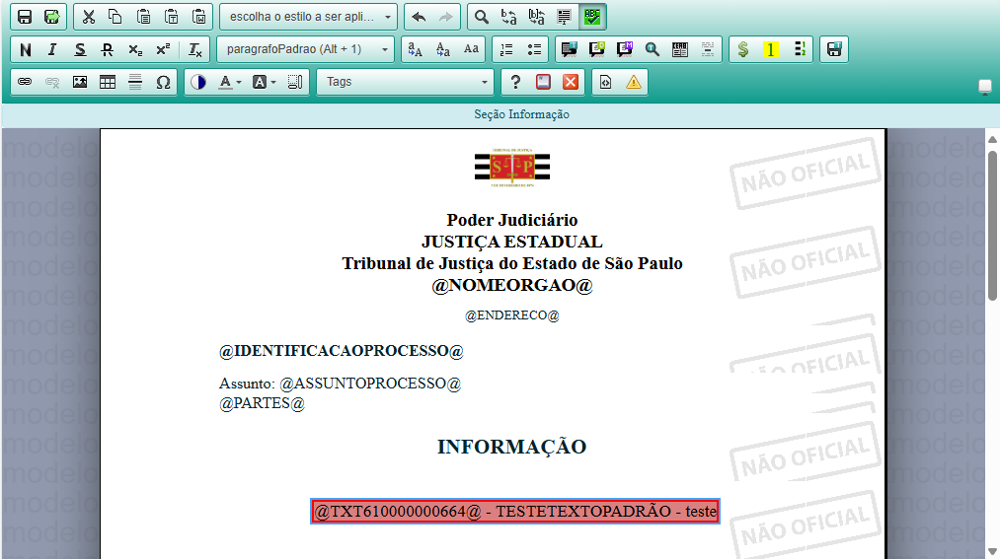

---

MINUTAS – TEXTO-PADRÃO

**EPROC PARA SEGUNDO GRAU****–****UNIDADE JUDICIAL****|**Conteúdo integral do curso
<small>**68**</small><small>**Descrição da imagem**: modelo-padrão com texto-padrão “@! txt”.</small>
No documento final, a*tag*continua da mesma forma. Para exibir o conteúdo,

selecioná-la e teclar “Alt” e “T”.
<small>**Descrição da imagem**: editor de texto do documento final (informação) com destaque para a*tag*“@! txt” ainda</small><small>sendo exibida e selecionada.</small>
**Importante**

Ao alterar o conteúdo de um texto-padrão, todos os modelos-padrão que contêm

referido texto-padrão serão alterados automaticamente, não sendo necessário editar

um por um.

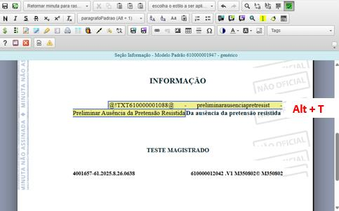

---

MINUTAS – MODELOS-MATRIZ E INSTITUCIONAIS

**EPROC PARA SEGUNDO GRAU****–****UNIDADE JUDICIAL****|**Conteúdo integral do curso
<small>**69**</small>
# ▪ MINUTAS – MODELOS-MATRIZ E

**INSTITUCIONAIS**

Os**modelos-matriz**são os modelos institucionais que possuem**apenas**formato, sendo vazios de

conteúdo. Geralmente, além do cabeçalho, apresentam o número do processo, os nomes das

partes, do assinante e do usuário e uma área em branco para edição.
<small>**Descrição da imagem**: exibição de um modelo-matriz.</small>
Na relação de tipos de documento e de modelo, o modelo-matriz sempre será apresentado entre

asteriscos com cor de fundo mais escura.
<small>**Descrição da imagem**: exibição do campo “Tipo de documento/Modelo”, opção “Listar Todos” com destaque para</small><small>os modelos-matriz apresentados entre três asteriscos.</small>
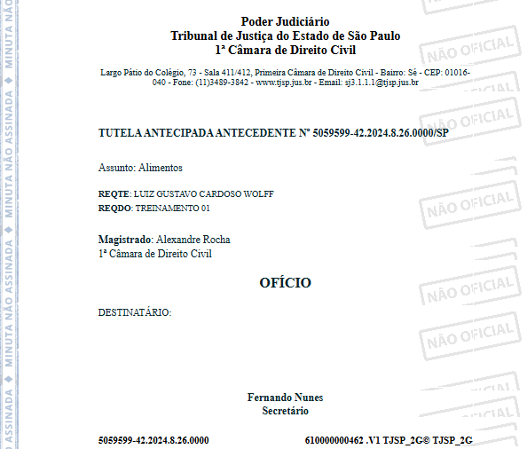

---

MINUTAS – MODELOS-MATRIZ E INSTITUCIONAIS

**EPROC PARA SEGUNDO GRAU****–****UNIDADE JUDICIAL****|**Conteúdo integral do curso
<small>**70**</small>
Ao criar modelos padrão, o eproc usa o modelo-matriz como base e, no editor de textos, cabe ao

usuário completar os campos que não são preenchidos automaticamente, incluindo textos,*tags*e

textos-padrão.

**MODELOS INSTITUCIONAIS**

O eproc também disponibiliza**modelos institucionais**de diversos tipos de documentos.

A partir do menu lateral, selecionar a opção**Minutas > Modelos.**Na tela “**Modelos Padrão”**, clicar

na caixa de seção do campo**“Exibir Modelos da Instituição”**.
<small>**Descrição da imagem**: tela “Modelos Padrão” com destaque para o campo “Exibir Modelos da Instituição”.</small>
Esses modelos são facilmente identificados pela sigla “ADMIN”, presente na coluna “Órgão” da

lista de modelos-padrão.
<small>**Descrição da imagem**: tela “Modelos Padrão” com destaque para modelos institucionais.</small>

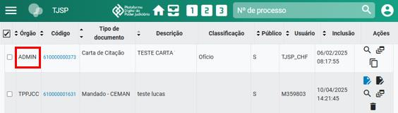

---

MINUTAS – MODELOS-PADRÃO

**EPROC PARA SEGUNDO GRAU****–****UNIDADE JUDICIAL****|**Conteúdo integral do curso
<small>**71**</small>
# ▪ MINUTAS – MODELOS-PADRÃO

Sabendo que a elaboração e emissão de minutas é uma prática constante e que algumas possuem

caráter recorrente, criar modelos padronizados na unidade judicial otimiza as rotinas diárias.

No sistema eproc, modelos de documentos são chamados de**modelos-padrão**. Eles podem ser

criados por determinados perfis de usuários (magistrado, gestores etc. ) e para diversas categorias

de documentos.

A fim de extrair o melhor que essa funcionalidade tem a oferecer, seguem algumas dicas:

▪**Definir responsável pela gestão documental**: a ideia surge do coletivo, de toda a

equipe, mas a elaboração e inserção no sistema ficam a cargo de uma pessoa. Isso

previne a criação de modelos diferentes para a mesma situação.

▪**Padronizar a nomenclatura**: sugere-se estruturar os nomes dos modelos com uma

sigla, referenciando a competência da unidade, uma expressão genérica e, por último,

um termo específico. Isso facilita a localização na biblioteca, especialmente em

unidades que cumulam diversas competências, e agrupa modelos semelhantes, como:

“3CAM – Alvará para perito – laudo entregue”

“3CAM – Alvará para perito – laudo pendente”

▪**Classificação**: ao adotar uma classificação, sinaliza-se que os modelos dela pertencem

a uma família de modelos. Vale ressaltar que um modelo pode pertencer a uma ou

mais classificações, como “Busca e Apreensão”, “Emenda” e “Execução”.

▪**Criar modelos em formato****“p****úblico****”**: os modelos serão disponibilizados a todos os

usuários internos,**inclusive os de outras unidades**.

---

MINUTAS – MODELOS-PADRÃO

**EPROC PARA SEGUNDO GRAU****–****UNIDADE JUDICIAL****|**Conteúdo integral do curso
<small>**72**</small>
**Criação de modelo-padrão**

Para criar um modelo-padrão, buscar pelo item**“Modelos”**no**menu lateral**. Na tela**“Modelos**

**Padrão”**, está a biblioteca de modelos existentes. Clicar em**“Novo”**.
<small>**Descrição da imagem**: tela “Modelos Padrão” selecionada no menu lateral com exibição dos modelos da unidade e</small><small>destaque para a opção “Novo”.</small>
Em**“Novo modelo****-****padrão”**, preencher os campos**“Tipo de documento”**,**“Descrição”**(nome),

**“Classificação”**, marcar a caixa de seleção**“Público”**(o que possibilita o compartilhamento com

outras unidades). Depois, clicar em**“Salvar”**.
<small>**Descrição da imagem**: tela “Novo modelo padrão” com destaque para os campos “Tipo de documento”,</small><small>“Descrição”, “Classificação”, a caixa de seleção “Público” e a opção “Salvar”.</small>

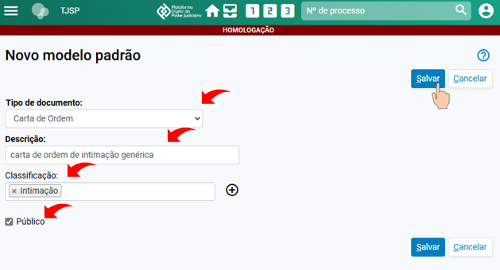

---

MINUTAS – MODELOS-PADRÃO

**EPROC PARA SEGUNDO GRAU****–****UNIDADE JUDICIAL****|**Conteúdo integral do curso
<small>**73**</small>
Após o salvamento, será aberto o**editor de textos**do documento. Neste momento, podemos

realizar a inserção de***tags***(na imagem, 1),**textos fixos**(2) e**textos-padrão**(3). Após, clicar no

ícone**“Salvar****Modelo Padrão e Sair”**(atalho “Alt +Z”)**,**representado pelo desenho de um disquete

com uma seta verde.
<small>**Descrição da imagem**: tela do editor de textos com carta de ordem e os itens citados acima em destaque.</small>
**Inserção de*****tags***

Elas preenchem campos variáveis do processo de forma automática, otimizando o trabalho e

evitando erros.

As*tags*, assim como os textos-padrão, podem ser utilizadas no momento da expedição das

minutas dos documentos (despacho, ofício, ato ordinatório, certidão etc. ) e na criação/edição dos

modelos-padrão.

Há várias formas de inserção das*tags*:

▪ digitar @ + todo ou parte do nome da*tag*, para que uma lista de opções seja exibida;

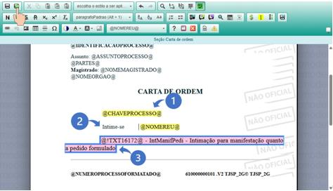

---

MINUTAS – MODELOS-PADRÃO

**EPROC PARA SEGUNDO GRAU****–****UNIDADE JUDICIAL****|**Conteúdo integral do curso
<small>**74**</small><small>**Descrição da imagem**: editor de modelo-padrão com destaque para a*tag*@nomeautor digitado e, abaixo, lista de</small><small>opções com este texto disponíveis para seleção.</small>
▪ acionar o botão inverso do mouse, selecionar a opção**“Inserir Texto****-****Padrão ou TAG”**,

clicar em**“TAG”**e, na janela aberta, escolher o item desejado. Clicar no ícone

**“Transportar este item e fechar”**, representado por uma seta verde;
<small>**Descrição da imagem**: modelo-padrão com um clique no botão inverso do mouse para abertura da caixa de seleção,</small><small>com destaque para a opção “Inserir Texto Padrão ou TAG” e a caixa para escolha da opção TAG.</small>

---

MINUTAS – MODELOS-PADRÃO

**EPROC PARA SEGUNDO GRAU****–****UNIDADE JUDICIAL****|**Conteúdo integral do curso
<small>**75**</small><small>**Descrição da imagem**: tela “Selecionar Tag” com a lista de*tags*disponíveis.</small>
▪ clicar no ícone**“Inserir Texto****-****Padrão ou TAG”**da barra de ferramentas, representado

por uma caixa de diálogo com a letra**“T”**. Selecionar**“TAG”**e escolher a opção

desejada;
<small>**Descrição da imagem**: Editor de texto de minuta com destaque para ícone**Inserir Texto-Padrão ou TAG**</small>
**◦**

assim como no item anterior, clicar no ícone**“Transportar****o item****e fechar”**,

representado por uma arroba verde, para inserir a*tag*;

▪ ou utilizar o campo “*Tag**s”*no cabeçalho do editor de texto do modelo-padrão.

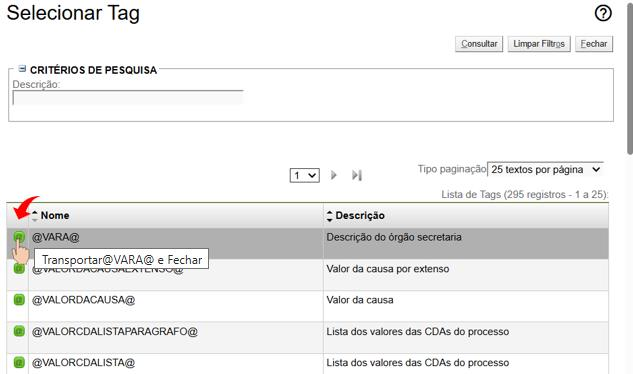

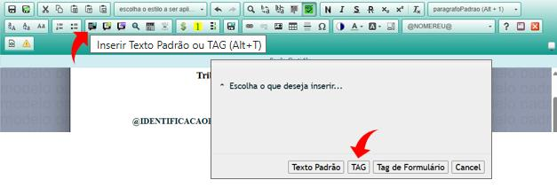

---

MINUTAS – MODELOS-PADRÃO

**EPROC PARA SEGUNDO GRAU****–****UNIDADE JUDICIAL****|**Conteúdo integral do curso
<small>**76**</small><small>**Descrição da imagem**: editor de texto do modelo-padrão com destaque para campo “*Tag**s”*.</small>
**Inserção de textos-padrão em modelo-padrão**

Na criação de um modelo-padrão, podemos inserir vários textos-padrão para utilização de acordo

com cada processo. Com o modelo-padrão aberto na tela, vamos clicar no ícone “Inserir Texto-

Padrão ou TAG” da barra de ferramentas, representado por uma caixa de diálogo com a letra “T”

para seleção do texto-padrão na tela “Selecionar Textos Padrão”.
<small>**Descrição da imagem**: tela “Selecionar Textos Padrão”</small>

---

MINUTAS – MODELOS-PADRÃO

**EPROC PARA SEGUNDO GRAU****–****UNIDADE JUDICIAL****|**Conteúdo integral do curso
<small>**77**</small>
O texto pode ser transportado para o modelo de duas maneiras:
<small>▪</small>
clicar no ícone de uma**arroba vermelha**(“Transportar @TXTNNNNNNNNNNNN@ e

fechar”): as*tags***“@TXT”**serão automaticamente substituídas pelo texto-padrão no

momento da emissão do documento final. Na tela do modelo-padrão, a*tag*será

exibida como no exemplo abaixo:

**◦**
<small>@TXT610000000664: Teste - TESTETEXTOPADRÃO</small><small>**Descrição da imagem**: modelo-padrão com texto-padrão “@txt”.</small>
No documento final, ao ser editado o texto-padrão expansível (com a borda vermelha),

será inserido na íntegra automaticamente:
<small>**Descrição da imagem**: editor de texto do documento final (termo de audiência) com destaque para o conteúdo</small><small>integral do texto contido na*tag*“@txt”.</small>

---

MINUTAS – MODELOS-PADRÃO

**EPROC PARA SEGUNDO GRAU****–****UNIDADE JUDICIAL****|**Conteúdo integral do curso
<small>**78**</small><small>▪</small>
clicar no ícone de uma**arroba azul**(“Transportar @! TXTNNNNNNNNNNNN@ e

fechar”): as*tags***“****@! TXT****”**não são substituídas automaticamente no texto final,

exigindo um comando do teclado para exibição do conteúdo. A tela do modelo-padrão

fica como no modo anterior, exceto pela exclamação após a arroba:

**◦**

@! TXT610000001088@ - preliminarausenciapretresis
<small>**Descrição da imagem**: modelo-padrão com texto-padrão “@! txt”.</small>
No documento final, a*tag*continua da mesma forma, ou seja, o texto-padrão não

aparece expandido. Para exibir o conteúdo, selecionar e teclar “Alt” e “T”.
<small>**Descrição da imagem**: editor de texto do documento final (informação) com destaque para a*tag*“@! txt” não</small><small>expandida.</small>

---

MINUTAS – MODELOS-PADRÃO

**EPROC PARA SEGUNDO GRAU****–****UNIDADE JUDICIAL****|**Conteúdo integral do curso
<small>**79**</small>
**Utilização do modelo-padrão**

O modelo-padrão pode ser utilizado de duas formas:

**A partir do processo**

Essa é forma mais comum. Na tela**“Consulta Processual”**(capa do processo), seção**“Minutas”**,

clicar em**“Nova”**. Localizar a seção**“Texto Inicial”**na tela**“Nova Minuta”**e preencher o campo

**“Tipo de documento/modelo”**. Neste exemplo, será usado a carta de ordem**“carta de ordem de**

**intimação genérica”**.
<small>**Descrição da imagem**: tela “Nova Minuta”, seção “Texto inicial”, campo “Tipo de documento/modelo” com a</small><small>seleção da carta de ordem modelo “Carta de Ordem de intimação genérica”.</small>
**A partir do editor de texto da minuta**

No editor de texto, clicar no ícone “Inserir Modelo” e buscar o modelo desejado na biblioteca,

podendo-se ativar filtros para facilitar a pesquisa. Ao localizar o item desejado, clicar no ícone

representado por uma seta verde para importá-lo ao documento.

O conteúdo transportado será sobreposto ao do documento utilizado como base.

---

MINUTAS – MODELOS-PADRÃO

**EPROC PARA SEGUNDO GRAU****–****UNIDADE JUDICIAL****|**Conteúdo integral do curso
<small>**80**</small><small>**Descrição da imagem**: tela “Selecionar Modelo Padrão”, destaque à seta verde que transporta o documento.</small>
Durante a criação do modelo, caso isso não tenha sido feito no momento da criação dos textos-

padrão, é possível destacar o resumo do documento para exibição na coluna “Documentos” da

tabela de eventos. O procedimento é o mesmo visto em aula anterior.

**RESUMO**

Para destacar o resumo, selecionar o trecho desejado e teclar “Alt” e “R” ou selecionar a opção

“resumo” no respectivo campo do menu superior:
<small>**Descrição da imagem**: tela do editor do texto-padrão com o campo do menu superior expandido para seleção de</small><small>“resumo”.</small>

---

MINUTAS – ÁREA DE TRABALHO

**EPROC PARA SEGUNDO GRAU****–****UNIDADE JUDICIAL****|**Conteúdo integral do curso
<small>**81**</small>
# ▪ MINUTAS – ÁREA DE TRABALHO

Na área de trabalho de minutas é possível realizar configurações que otimizarão o trabalho.

Ela funciona como uma ferramenta de busca, listando e organizando minutas a serem revisadas e

assinadas. Para isso, podem-se utilizar filtros, que funcionam como “formulários”, e salvá-los como

preferências a serem incluídas no**“Painel Inicial”**.

Como já visto anteriormente, o**“Painel Inicial”**contém a seção**“Minutas”**. Por padrão, o sistema

exibe as seguintes opções com suas respectivas quantidades de minutas:

▪**“Para assinar”**;

▪**“Devolvidas”**(exceto para magistrados);

▪**“Bloqueadas”**.

Outras opções podem ser incluídas a fim de agilizar a rotina por meio da**“Área de trabalho”**.
<small>**Descrição da imagem**: exibição do “Painel Inicial” com destaque para a seção “Minutas”.</small>
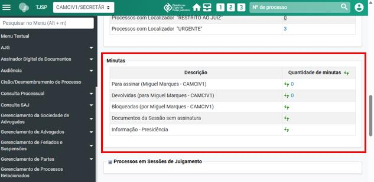

---

MINUTAS – ÁREA DE TRABALHO

**EPROC PARA SEGUNDO GRAU****–****UNIDADE JUDICIAL****|**Conteúdo integral do curso
<small>**82**</small>
**Acesso à minuta área de trabalho**

No**menu lateral**, selecionar**“Minutas”,**opção**“Área de Trabalho”**.
<small>**Descrição da imagem**: parte da tela “Minuta Área de Trabalho”.</small>
**BUSCA DE DOCUMENTOS**

Para efetuar a pesquisa de documentos, podem-se usar os filtros disponíveis na tela**“Minuta Área**

**de Trabalho”**.
<small>**Descrição da imagem**: tela “Minuta Área de Trabalho” com diversos filtros preenchidos.</small>
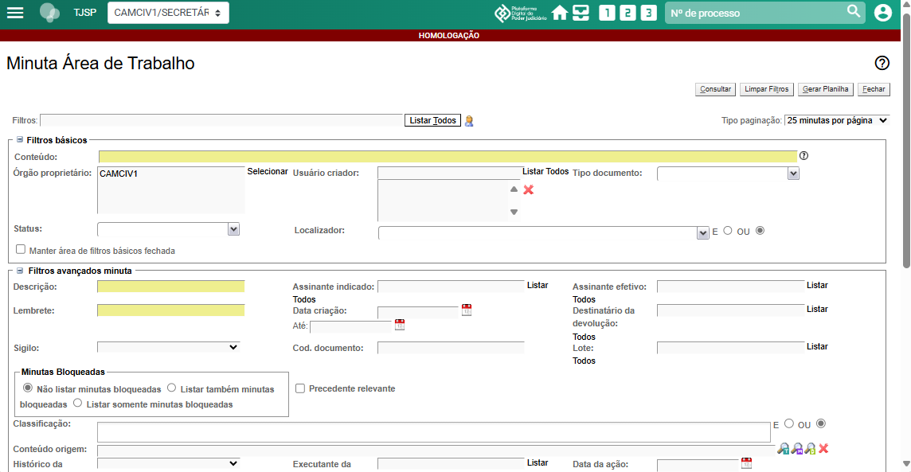

---

MINUTAS – ÁREA DE TRABALHO

**EPROC PARA SEGUNDO GRAU****–****UNIDADE JUDICIAL****|**Conteúdo integral do curso
<small>**83**</small>
No exemplo acima, deseja-se saber quais despachos e decisões criados pelo usuário “Miguel

Marques (TJSP_2G)” entre 01/01/2024 e 29/04/2025 estão com o status “Para assinar”. Portanto,

foram utilizados os filtros de**“Usuário criador”**,**“Tipo documento”**,**“Status”**e**“Data criação”**.

Ao clicar em “Consultar”, o eproc apresenta a relação de documentos que atendam a esses

critérios.
<small>**Descrição da imagem**: relação de documentos de acordo com os filtros selecionados.</small>
Diversas ações podem ser realizadas nos documentos apresentados, tanto pelos botões que se

encontram na parte superior da relação quanto pelos ícones da coluna**“Recursos disponíveis”**.

Assim como na busca por despachos e decisões pendentes de assinatura, é possível pesquisar

documentos pendentes de conferência, excluídos, já assinados, entre outros.

A tela**“Minuta Área de Trabalho”**é uma excelente ferramenta de pesquisa com diversos tipos de

filtros como**“Filtros básicos”, “Filtros avançados minuta”, “Filtros processo”, “Critérios de**

**exibição”**e botões de atividade como “Visualizar”, “Assinar”, “Lançar evento”, “Alterar

localizador/status”, dentre outros.

**Criados em outras unidades**

Na tela “Minuta Área de Trabalho” é possível buscar por documentos criados por outras Câmaras.

A partir do filtro**“Órgão proprietário”,**pode-se selecionar uma outra Câmara.

Isso será útil quando, por exemplo, um juiz/desembargador que atuava em uma Câmara passar a

atuar em outra, sendo possível localizar os modelos criados naquela para utilizá-los nesta.

Para exemplificar, pode-se associar ao filtro**“Órgão proprietário”,**o filtro**“Assunto”,**na busca por

uma minuta referente a um tema específico.

No filtro**“Órgão proprietário”**, selecionar, por exemplo, a 7ª Câmara de Direito Civil e clicar na

seta para a direita para sua seleção. Para retirar a seleção de algum órgão já selecionado, clicar

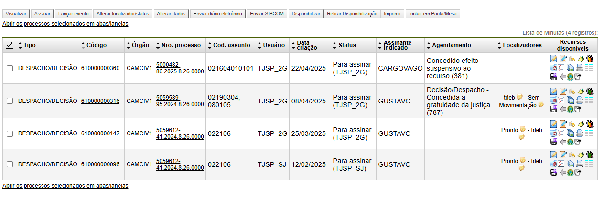

---

MINUTAS – ÁREA DE TRABALHO

**EPROC PARA SEGUNDO GRAU****–****UNIDADE JUDICIAL****|**Conteúdo integral do curso
<small>**84**</small>
sobre ele e no ícone da seta para a esquerda. Por último, clicar em “Transportar” para que o órgão

pesquisado passe a constar no filtro**“Órgão proprietário”**.

O próximo passo é preencher o**“Tipo do documento”**, como, por exemplo, um relatório/voto;

preencher o**“Assunto”**e acionar o botão**“Consultar”**.
<small>**Descrição da imagem**: tela “Minuta Área de Trabalho” com seleção de filtros conforme citado.</small>
O resultado será listado, de acordo com a seleção dos filtros informados.
<small>**Descrição da imagem**: relação de modelos de relatório/voto.</small>
Selecionar o modelo que se deseja trazer para a unidade atual e clicar no ícone**“Salvar minuta**

**como um novo modelo”**. Preencher**“Descrição”**e**“Classificação”**e clicar em**“Salvar”**.

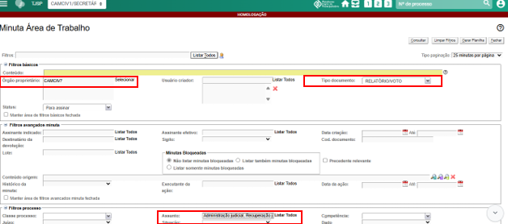

---

MINUTAS – ÁREA DE TRABALHO

**EPROC PARA SEGUNDO GRAU****–****UNIDADE JUDICIAL****|**Conteúdo integral do curso
<small>**85**</small><small>**Descrição da imagem**: janela “Novo modelo padrão”.</small>
**Por localizadores**

É possível buscar por documentos em determinados localizadores da unidade, como, por exemplo,

todos do tipo “despacho/decisão” dos localizadores “CUSTAS PENDENTES” e “CUSTAS VENCIDAS”.
<small>**Descrição da imagem**: tela “Minuta Área de Trabalho” com seleção de filtros conforme citado.</small>
Ao clicar em**“Consultar”,**o sistema listará as minutas que atendam aos filtros informados.

**Por classificação**

Podemos consultar minutas do tipo**“ato ordinatório”**relacionadas à classificação**“carta de**

**ordem”**, criadas por um determinado usuário e com o status**“rascunho”**a fim de retomar a edição

e finalizá-las.

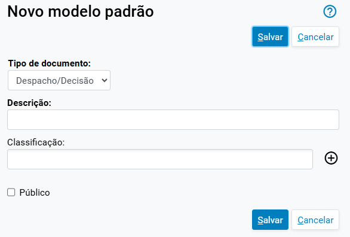

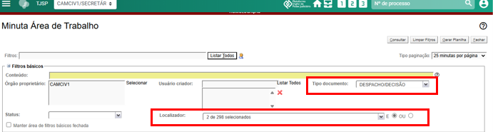

---

MINUTAS – ÁREA DE TRABALHO

**EPROC PARA SEGUNDO GRAU****–****UNIDADE JUDICIAL****|**Conteúdo integral do curso
<small>**86**</small><small>**Descrição da imagem**: tela “Minuta Área de Trabalho” exibindo a seleção de filtros para busca de documentos que</small><small>tenham classificação “Carta de ordem”.</small>
**Importante**

Para que esse tipo de pesquisa seja eficiente, é necessário inserir a classificação

durante a criação do modelo-padrão e no momento da emissão da minuta.
<small>**Descrição da imagem**: tela “Novo Modelo Padrão” com destaque para o campo “Classificação” no momento da</small><small>criação do modelo-padrão.</small>
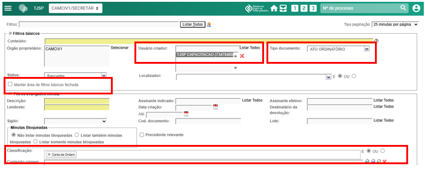

---

MINUTAS – ÁREA DE TRABALHO

**EPROC PARA SEGUNDO GRAU****–****UNIDADE JUDICIAL****|**Conteúdo integral do curso
<small>**87**</small><small>**Descrição da imagem**: tela “Nova Minuta”, destaque para o campo “Classificação”, no momento da emissão da</small><small>minuta.</small>
**Por lote de documentos**

Também é possível buscar documentos com o filtro “Lote”, selecionando o lote desejado e

clicando em “Consultar”.
<small>**Descrição da imagem**: tela “Minuta Área de Trabalho” com destaque para o filtro “Lote”.</small>
Assim como nos demais exemplos, a relação é apresentada com os documentos que compõem

aquele determinado lote.

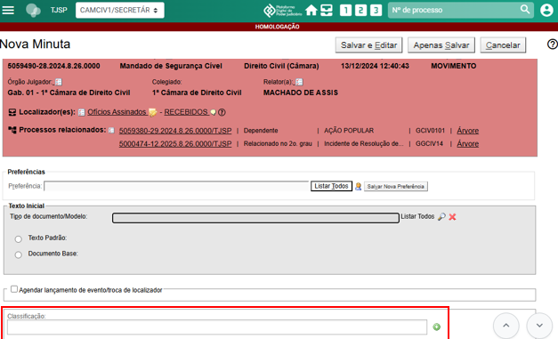

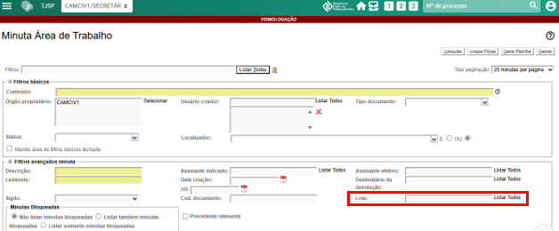

---

MINUTAS – ÁREA DE TRABALHO

**EPROC PARA SEGUNDO GRAU****–****UNIDADE JUDICIAL****|**Conteúdo integral do curso
<small>**88**</small><small>**Descrição da imagem**: relação de documentos de um lote consultado.</small>
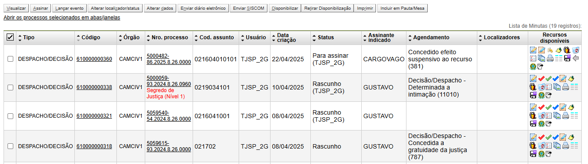

---

MINUTAS – AGENDAMENTO E VINCULAÇÃO DE CARGOS NA ASSINATURA

**EPROC PARA SEGUNDO GRAU****–****UNIDADE JUDICIAL****|**Conteúdo integral do curso
<small>**89**</small>
## ▪ MINUTAS – AGENDAMENTO E VINCULAÇÃO

**DE CARGOS NA ASSINATURA**

Como visto no início das aulas sobre minutas, o eproc considera como “minuta” todo e qualquer

documento emitido no sistema, não apenas os relacionados a atos decisórios. Ou seja, pode-se

elaborar a minuta de um despacho, ofício, certidão, termo de audiência etc.

A cada salvamento, o sistema automaticamente atualiza sua versão, exibindo a atual no rodapé.
<small>**Descrição da imagem**: documento sendo editado com destaque para a indicação da versão no rodapé (V2).</small>
O sistema registra todas as alterações já salvas, permitindo saber quem e quando editou, além de

consultar as versões antigas. Isso possibilita a comparação e recuperação de textos.

Para acessar o histórico de versões, clicar no ícone**“Histórico de versões da minuta”**,

representado por três janelas sobrepostas, na seção**“Minutas”**, coluna**“Recursos Disponíveis”**da

capa do processo.
<small>**Descrição da imagem**: minuta de certidão com destaque para o ícone “Histórico de versões da minuta”.</small>

---

MINUTAS – AGENDAMENTO E VINCULAÇÃO DE CARGOS NA ASSINATURA

**EPROC PARA SEGUNDO GRAU****–****UNIDADE JUDICIAL****|**Conteúdo integral do curso
<small>**90**</small>
Ao clicar no ícone**“Histórico de versões da minuta “**, o sistema abrirá uma janela com as versões

da minuta selecionada para comparação entre as versões. Para comparar, selecionar duas versões

desejadas e clicar em “Comparar”.
<small>**Descrição da imagem**: janela “Versões da Minuta de ORDEM DE LIBERAÇÃO” com as versões 1 e 2 selecionadas.</small><small>**Descrição da imagem**: comparativo das versões nº 1 e nº 2 da minuta.</small>
**Agendamento**

Dado início à expedição de uma minuta, é necessário preencher diversos campos. Essa etapa

recebe o nome de “Agendamento” e possui os critérios descritos a seguir.

**ESCOLHA DO MODELO**

O usuário deve escolher, dentro os modelos existentes, aquele que será utilizado na minuta. É

possível escolher um modelo institucional, um modelo-matriz ou, ainda, um modelo-padrão.

---

MINUTAS – AGENDAMENTO E VINCULAÇÃO DE CARGOS NA ASSINATURA

**EPROC PARA SEGUNDO GRAU****–****UNIDADE JUDICIAL****|**Conteúdo integral do curso
<small>**91**</small><small>**Descrição da imagem**: tela “Nova Minuta” com destaque para a seção “Texto Inicial”.</small>
**LANÇAMENTO DOS EVENTOS**

O campo “Agendar lançamento de evento/troca de localizador” permite agendar o envio da

movimentação, feito no momento da assinatura da minuta. Ao lançar um evento, o campo

“Eventos Complementares” é exibido para preenchimento, se houver.

A produtividade do magistrado é medida principalmente por meio dos eventos lançados nas

minutas. Logo, é importante escolhê-los cuidadosamente.

Os eventos não são criados pelos Tribunais, mas pelo CNJ. Em caso de dúvidas, consultar as Tabelas

Processuais Unificadas.
<small>**Descrição da imagem**: tela “Nova Minuta” com destaque para “Agendar lançamento de evento”.</small>
**CONFIGURAÇÃO DAS INTIMAÇÕES AUTOMÁTICAS E INDICAÇÃO DOS PRAZOS**

É possível e aconselhável que, no momento da expedição da minuta, já sejam configuradas as

intimações e seus respectivos prazos. Desta forma, o documento será anexado ao processo com

as movimentações de intimação, otimizando o trâmite processual.

---

MINUTAS – AGENDAMENTO E VINCULAÇÃO DE CARGOS NA ASSINATURA

**EPROC PARA SEGUNDO GRAU****–****UNIDADE JUDICIAL****|**Conteúdo integral do curso
<small>**92**</small><small>**Descrição da imagem**: tela “Nova Minuta” com visualização do campo de intimação de partes e do painel com</small><small>lançamento de prazos.</small>
**JUNTADA DE MINUTA EM OUTRO PROCESSO**

Também é neste momento que se pode deixar pronta a “programação” para o sistema juntar a

minuta que está sendo elaborada em um outro processo, se for o caso.
<small>**Descrição da imagem**: tela “Nova Minuta” com visualização da seção para juntada de documento em outro</small><small>processo.</small>
**GERENCIAMENTO DE LOCALIZADORES**

Neste campo será feita a automação dos localizadores. Escolher o comportamento do localizador

e selecionar os que serão excluídos e incluídos.
<small>**Descrição da imagem**: tela “Nova Minuta” com visualização para o campo “Comportamento do Localizador”</small>

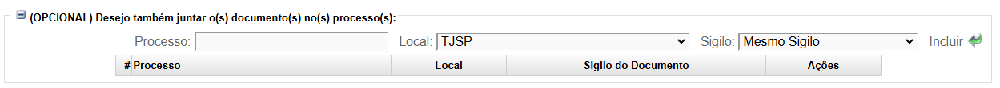

---

MINUTAS – AGENDAMENTO E VINCULAÇÃO DE CARGOS NA ASSINATURA

**EPROC PARA SEGUNDO GRAU****–****UNIDADE JUDICIAL****|**Conteúdo integral do curso
<small>**93**</small>
**CLASSIFICAÇÃO E DESCRIÇÃO**

Nos campos “Classificação” e “Descrição”, é possível criar um termo que faça referência ao

modelo, facilitando a busca pelo que será utilizado.

**INDICAÇÃO DO ASSINANTE E TRATAMENTO**

Para toda minuta, deve-se indicar o assinante e seu respectivo tratamento, como “Juiz de Direito”.
<small>**Descrição da imagem**: tela “Nova Minuta” com visualização dos campos “Assinante” e “Tratamento”.</small>
**INDICAÇÃO DO NÍVEL DE SIGILO**

Devemos selecionar o nível de sigilo do documento entre os existentes.
<small>**Descrição da imagem**: tela “Nova Minuta” com destaque para o campo “Sigilo”</small>
**INDICAÇÃO DO STATUS DA MINUTA**

As minutas têm um ciclo de vida separado do processo. É importante selecionar o status que a

minuta terá após sua expedição quando mais de uma pessoa trabalhar com ela. Essa

funcionalidade permite organizar a rotina de revisão e de assinatura das minutas, pois esse “ir-e-

vir” deverá ser realizado pelo status, não pelos localizadores.

**Vinculação de cargos na assinatura de minutas**

O eproc permite vincular cargos na assinatura de minutas. Ao automatizar o preenchimento do

cargo do assinante, elimina-se a necessidade de configurá-lo manualmente a cada nova minuta.

Isso facilita o trabalho e reduz o tempo de emissão.

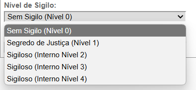

---

MINUTAS – AGENDAMENTO E VINCULAÇÃO DE CARGOS NA ASSINATURA

**EPROC PARA SEGUNDO GRAU****–****UNIDADE JUDICIAL****|**Conteúdo integral do curso
<small>**94**</small>
Buscar e acessar a página “Cadastro de Usuários” pelo**menu lateral**. Selecionar o usuário (no

exemplo, “Usuário de Teste - TJSP – Secretário) e clicar em “Consultar”. Na tela seguinte,

selecionar o usuário entre os existentes na relação e acionar o ícone “Tipo de Tratamento do

Usuário”, representado por um lápis, na coluna “Ações”.
<small>**Descrição da imagem**: tela “Cadastro de Usuários” com destaque para o acesso no menu lateral.</small><small>**Descrição da imagem**: tela “Cadastro de Usuários” com destaque para o ícone “Tipo de tratamento de usuário”.</small>
Na janela exibida, selecionar o “Tipo de Tratamento” (neste exemplo, “SECRETÁRIO SUBSTITUTO”)

e “Salvar”.

Ao expedir novas minutas e selecionar “Usuário de Testes TJSP – Secretário”, o sistema preencherá

automaticamente o “Tratamento” conforme configurado.

---

MINUTAS – DESPACHO E DECISÃO

**EPROC PARA SEGUNDO GRAU****–****UNIDADE JUDICIAL****|**Conteúdo integral do curso
<small>**95**</small>
# ▪ MINUTAS – DESPACHO E DECISÃO

O processo de emissão de despachos e decisões no eproc é idêntico, diferenciando-se apenas no

conteúdo e no evento específico atribuído a cada um (ex: conclusos para decisão com parecer do

MP; conclusos para decisão com agravo etc. ).

Na relação do campo**“Tipo de documento/Modelo”**, ambos estarão listados no mesmo item

(“**Despacho/Decisão**”), devendo ser selecionado ao emitir ou criar um modelo de minuta para

estas situações.
<small>**Descrição da imagem**: tela “Nova Minuta” com destaque para a seção “Texto Inicial”, campo “Tipo de</small><small>documento/Modelo”.</small>
Para emitir uma nova minuta de despacho ou decisão, acessar o processo e, na seção**“Minutas”**

da tela capa do processo, selecionar**“Nova”**ou acionar o botão**“Minutar”**entre as seções**“Ações”**

e**“Eventos”**.
<small>**Descrição da imagem**: capa do processo com destaque para a opção “Nova” da seção “Minutas” e o botão</small><small>“Minutar”.</small>

---

MINUTAS – DESPACHO E DECISÃO

**EPROC PARA SEGUNDO GRAU****–****UNIDADE JUDICIAL****|**Conteúdo integral do curso
<small>**96**</small>
Na tela “Nova Minuta”, é possível clicar em**“Listar Todas”**da seção**“Preferências”**para escolher

alguma, se houver. Não sendo o caso, selecionar o**“Tipo de documento/modelo”**na seção**“Texto**

**Inicial”**. Neste exemplo, vamos selecionar o modelo-padrão “**Despacho/Decisão**”.
<small>**Descrição da imagem**: tela “Nova Minuta” com destaque para o tipo de documento escolhido.</small>
Ainda no campo**“Tipo de documento/Modelo”**, quando acionado o ícone representado por uma

lupa (na imagem, 1) será exibida uma relação dos modelos-padrão disponíveis. Ao posicionar o

mouse sobre o código do documento, o conteúdo fica visível para consulta antes da seleção.

Se utilizado o modelo-matriz**(“***Despacho/Decisão*****”), o sistema exibirá uma relação de

textos-padrão disponíveis para consulta e seleção após seleção do campo**“Texto****-****Padrão”**(2).

A opção**“Documento Base”**(3) permite a utilização de documentos que já foram anexados a

outros processos.
<small>**Descrição da imagem**: tela “Nova Minuta” com destaque para os itens citados acima.</small>
Ao prosseguir com o lançamento do**evento**(na imagem, 4) correspondente àquela decisão,

sugere-se já realizar a intimação eletrônica da parte (5), neste caso, a parte autora do processo

(6). Aqui é importante inserir o prazo processual, atentando-se aos casos em que ele será contado

em dobro, o que também deverá ser lançado manualmente pelo usuário.

Também é necessário selecionar o evento relacionado à intimação para que a intimação eletrônica

seja realizada assim que assinada a decisão. Sendo o caso, marcar o campo**“Intimação Urgente”**

(tutelas, liminares, réu preso etc. ).

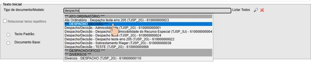

---

MINUTAS – DESPACHO E DECISÃO

**EPROC PARA SEGUNDO GRAU****–****UNIDADE JUDICIAL****|**Conteúdo integral do curso
<small>**97**</small><small>**Descrição da imagem**: tela “Nova Minuta” com destaque para os itens citados acima.</small>
Na seção**“Gerenciar Localizadores”**deve-se indicar se o processo será mantido ou excluído dos

localizadores atuais (na imagem, 7) e adicionar a novo localizador após a assinatura (imagem 8).

Inserir**“Classificação”**(9) e**“Descrição”**(10), se desejado, selecionar**“Assinante”**(11),

**“Tratamento”**(12),**“Nível de Sigilo”**(13) e**“Status destino”**(14).

Em seguida, clicar em**“Salvar e Editar”**(15).
<small>**Descrição da imagem**: tela “Nova Minuta” com destaque para os itens de configuração.</small>
O eproc abrirá o editor de textos para as alterações e inclusões necessárias. Por ter sido utilizado

um modelo-padrão nesta simulação, não há necessidade de alterações.

---

MINUTAS – DESPACHO E DECISÃO

**EPROC PARA SEGUNDO GRAU****–****UNIDADE JUDICIAL****|**Conteúdo integral do curso
<small>**98**</small>
Selecionar o**“Status desejado ao salvar”**(número 1), neste exemplo:**“Encaminhar minuta para**

**assinatura”;**se no modelo-padrão não estiver selecionado o**resumo do documento**(número 2),

sugere-se defini-lo para exibição na coluna**“Documentos”**da seção**Eventos**da capa do processo.

Para isso, selecionar o texto e teclar o atalho “Alt+R” ou configurar no respectivo campo do menu

superior (número 3) e, em seguida,**“Salvar Minuta e Sair”**(número 4).
<small>**Descrição da imagem**: editor de texto do modelo escolhido com destaques citados acima.</small>
Assinado e disponibilizado o documento nos autos, o resumo aparecerá na**tabela de eventos**.
<small>**Descrição da imagem**: tabela de eventos com destaque para o resumo da decisão na coluna “Documentos”.</small>
**Importante**

A expedição de minutas relacionadas aos demais documentos (ato ordinatório,

certidão, ofício etc. ) será abordada na aula “**Expedição de Documentos****”**.

---

MINUTAS – DESPACHO E DECISÃO

**EPROC PARA SEGUNDO GRAU****–****UNIDADE JUDICIAL****|**Conteúdo integral do curso
<small>**99**</small>
**Minutas elaboradas pela Unidade Judicial para assinatura dos**

**Magistrados**

As minutas elaboradas pelas Unidades Judiciais, visíveis na seção “Minutas” da capa do processo,

devem ser disponibilizadas para o gabinete do Órgão Julgador.

Na aba “Recursos Disponíveis”, o servidor deverá selecionar o ícone “Disponibilizar minuta”

representado pelo desenho de “três pessoas”.
<small>**Descrição da imagem**: seção “Minutas” com destaque para o ícone “Disponibilizar minuta”.</small>
O sistema, então, abrirá a tela para escolha do gabinete assinante da minuta, e já trará

selecionado, por padrão, o gabinete do relator do processo; ao clicar em “Disponibilizar minuta”

ela será encaminhada ao gabinete para assinatura.
<small>**Descrição da imagem**: tela “Disponibilização da minuta” com campo para seleção do Órgão Julgador.</small>
Importante atentar-se na escolha do gabinete correto, pois o sistema eproc permite a

disponibilização da minuta em qualquer um deles, possibilitando a remessa das minutas ao relator

do processo ou ao Presidente do Órgão Julgador, se necessário.

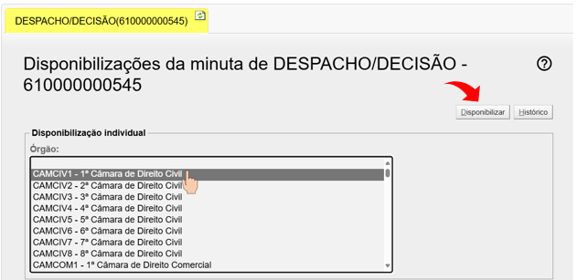

---

MINUTAS – DESPACHO E DECISÃO

**EPROC PARA SEGUNDO GRAU****–****UNIDADE JUDICIAL****|**Conteúdo integral do curso
<small>**100**</small>
Se, por equívoco, for selecionado um gabinete diverso, o servidor poderá desfazer a

disponibilização selecionando o órgão indevidamente escolhido, clicando, após, no botão

“Excluir”, ou diretamente por meio do ícone “Excluir Disponibilização”, representado por uma

lixeira.
<small>**Descrição da imagem**: tela “Disponibilização da minuta” com destaque para o ícone “Excluir Disponibilização”,</small><small>representado pelo desenho de uma lixeira.</small>
**Assinatura individual**

A assinatura pode ser realizada tanto pelo editor de texto do documento quanto pela tela**“Minuta**

**Área de Trabalho”**. Nas duas hipóteses, localizada a minuta a ser assinatura, clicar no ícone

**“Assinar minuta”**, representado por uma caneta.
<small>**Descrição da imagem**: seção “Minutas” da capa do processo com destaque para o ícone “Assinar Minuta”.</small>
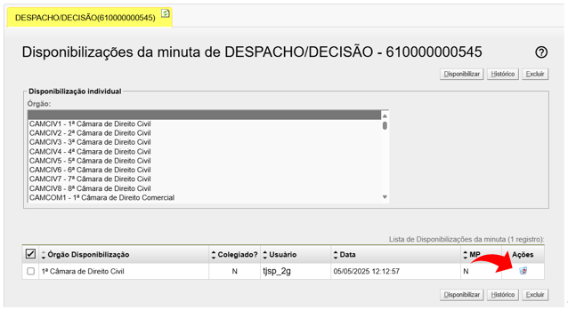

---

MINUTAS – DESPACHO E DECISÃO

**EPROC PARA SEGUNDO GRAU****–****UNIDADE JUDICIAL****|**Conteúdo integral do curso
<small>**101**</small>
**Assinatura em lote**

Feita a conferência, acessar a tela**“Minuta Área de Trabalho”**, selecionar as minutas com status

“Para assinar” e clicar em “Consultar” para que os processos sejam exibidos.

Após, selecionar as minutas que deseja assinar e clicar no botão “Assinar” em todos os processos,

e clicar no botão**“Assinar”**.
<small>**Descrição da imagem**: tela “Minuta Área de Trabalho” com minutas selecionadas e destaque para o botão “Assinar”.</small>
A tela**“Assinar lista de minutas”**será exibida. Inserir a senha e clicar em**“Assinar com Senha”**.

Após processamento, o eproc informa a conclusão da atividade. Em seguida, clicar em**“Fechar”**.
<small>**Descrição da imagem**: tela “Assinar lista de minutas” exibindo minutas selecionadas e botão “Assinar com senha”.</small>

---

MINUTAS EM LOTE

**EPROC PARA SEGUNDO GRAU****–****UNIDADE JUDICIAL****|**Conteúdo integral do curso
<small>**102**</small>
# ▪ MINUTAS EM LOTE

Para criar minutas em lote, todas devem estar no mesmo localizador. Acessá-lo, selecionar os

processos e clicar em “Criar Minutas em Lote”.
<small>**Descrição da imagem**: tela “Lista de Processos por Localizador”, destaque à seleção de processos e à opção “Criar</small><small>Minutas em Lote”.</small>
Exibida a tela “Nova Minuta em Lote”, é obrigatório inserir a “Descrição do Lote” (sugere-se a data

em que o documento está sendo expedido e o seu tipo, como “05. 05. 25 – Informação

Capacitação”).

Em seguida, proceder da mesma forma utilizada para emissão da minuta unitária. Ao clicar em

“Salvar”, o sistema exibirá**apenas**a tela “Criação de minutas em Lote” (com o lote criado e a

relação de processos que constam do lote), sem exibir novas abas no navegador para edição.

---

MINUTAS EM LOTE

**EPROC PARA SEGUNDO GRAU****–****UNIDADE JUDICIAL****|**Conteúdo integral do curso
<small>**103**</small><small>**Descrição da imagem**: tela “Criação de Minutas em Lote”.</small>
Para visualizar o lote, clicar em “Clique aqui para ver o lote criado”; na tela com os processos

listados, temos alguns botões de atividade como “Retirar do lote”, “Editar lote”, “Alterar dados

lote”, “Área de trabalho” e “Cancelar”.
<small>**Descrição da imagem**: tela “Processos do lote” com botões de atividade.</small>
Os lotes também podem ser acessados por meio do menu lateral, opção “Lotes”; selecionar o

desejado e, na coluna “Ações”, clicar no ícone “Consultar processos”, representado por uma lupa.

---

MINUTAS EM LOTE

**EPROC PARA SEGUNDO GRAU****–****UNIDADE JUDICIAL****|**Conteúdo integral do curso
<small>**104**</small><small>**Descrição da imagem**: tela “Lotes de minutas”.</small>
Realizada a consulta, o eproc exibe os dados do lote e uma relação de processos.

Para retirar um processo específico, utilizar o botão “Retirar do lote”.

Para alterar o conteúdo de uma minuta, selecionar o número do processo e clicar no link do

número da minuta.
<small>**Descrição da imagem**: parte da tela “Lotes de minutas”, com um processo selecionado e o cursor do mouse sobre o</small><small>número da minuta.</small>
O eproc exibirá o editor de textos. Acionar “Editar minuta” e escolher a opção referente ao

agendamento e, então, alterar como necessário.
<small>**Descrição da imagem**: tela do editor de textos com destaque para a opção “Editar”.</small>
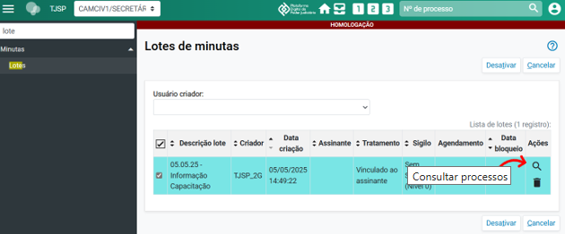

---

MINUTAS EM LOTE

**EPROC PARA SEGUNDO GRAU****–****UNIDADE JUDICIAL****|**Conteúdo integral do curso
<small>**105**</small>
Após salvar, o eproc abre novamente a tela de processos do lote. Agora, na coluna “Observação”,

consta que a minuta foi editada. Na coluna “Ações”, há dois botões habilitados:**“****Retirar processo**

**do lote****”**e**“****Replicar as alterações desta minuta para todo o lote****”**.
<small>**Descrição da imagem**: tela de processos de lote específico, destaque às colunas “Observação” e “Ações”.</small>
Se desejado replicar as alterações, o eproc exibe a tela “**Editar Minutas do Lote****”**. Nela, o campo

“**Documento Base****”**virá preenchido com o número da minuta alterada, a qual servirá como base

para os demais documentos. Clicar em “**Salvar****”**para que as alterações sejam replicadas.

Feito isso, uma nova tela é exibida com a informação de que as minutas foram alteradas.

---

EXPEDIÇÃO DE DOCUMENTOS – OFÍCIOS

**EPROC PARA SEGUNDO GRAU****–****UNIDADE JUDICIAL****|**Conteúdo integral do curso
<small>**106**</small>
# ▪ EXPEDIÇÃO DE DOCUMENTOS – OFÍCIOS

A partir da capa do processo (tela**“Consulta Processual –****Detalhes do Processo”**), o usuário

poderá expedir a minuta de qualquer documento, como, por exemplo, os Ofícios. Para tanto,

localizar a seção**“Minutas”**e clicar em**“Nova”**ou clicar sobre o botão facilitador**“Minutar”**, logo

acima da**tabela de eventos**.
<small>**Descrição da imagem**: destaque para o botão “Nova”, presente na seção Minutas e para o botão “Minutar”,</small><small>localizado acima da tabela de eventos.</small>
**Agendamento**

Na seção**“Texto Inicial”**, campo**“Tipo de documento/Modelo”**, digitar “ofício” para que sejam

filtradas as opções de documento-base. O primeiro resultado possuirá o fundo em cinza entre

asteriscos, sinalizando tratar-se do modelo-matriz (genérico).
<small>**Descrição da imagem**: campo “Tipo de documento/Modelo” preenchido com o texto “ofício” e destaque para o</small><small>modelo-matriz “OFÍCIO”.</small>
O preenchimento da seção**“Destinatário”**é opcional para esse tipo de documento. O destinatário

pode ser selecionado para usar*tags*da minuta para obter os dados de uma pessoa específica.

A caixa de seleção**“Agendar lançamento de evento/troca de localizador”**deverá ser preenchida

com o evento correlato, no caso,**“Expedição de Ofício”**.
<small>**Descrição da imagem**: destaque para a caixa de seleção “Agendar lançamento de evento/troca de localizador”</small><small>marcada e o evento “Expedição de ofício”.</small>
Preenchido o campo evento a ser lançado, serão exibidas as opções**“Intimar/Citar Partes”,**

**“Marcar para Intimação Futura”**e**“Remeter Processo”**.

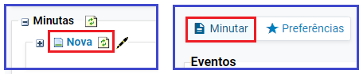

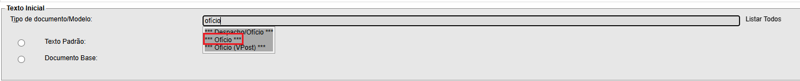

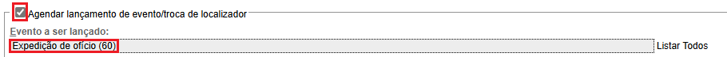

---

EXPEDIÇÃO DE DOCUMENTOS – OFÍCIOS

**EPROC PARA SEGUNDO GRAU****–****UNIDADE JUDICIAL****|**Conteúdo integral do curso
<small>**107**</small><small>**Descrição da imagem:**destaque para as opções “Intimar/Citar Partes”, “Marcar para Intimação Futura” e “Remeter</small><small>Processo”.</small>
Se desejar, o usuário poderá definir previamente eventual intimação eletrônica, cientificando-se

a(s) parte(s) sobre a expedição daquela minuta, e, para isso, basta clicar em**“Intimar/Citar Partes”**.

Em seguida, selecionar o evento de intimação eletrônica apropriado e a(s) parte(s) a ser(em)

intimada(s), preenchendo os prazos correspondentes.
<small>**Descrição da imagem**: seção “Opções Avançadas”, com destaque para o evento de intimação eletrônica e a seleção</small><small>da parte autora com preenchimento do prazo para intimação.</small>
Na seção**“Gerenciar Localizadores”**, o usuário poderá indicar se o sistema deve remover e/ou

incluir o processo em um ou mais localizadores, tendo em vista a atividade realizada (expedição

de ofício).

Neste exemplo, o processo será removido dos localizadores atuais (utilizar a opção marcar todos)

e incluído no localizador do órgão**Ofícios - Assinados**.

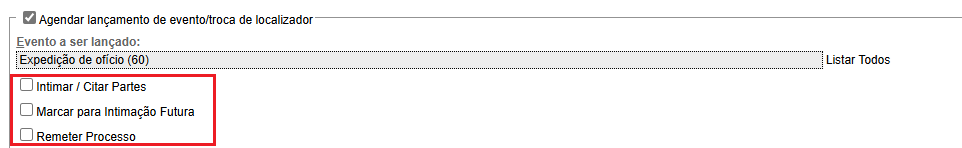

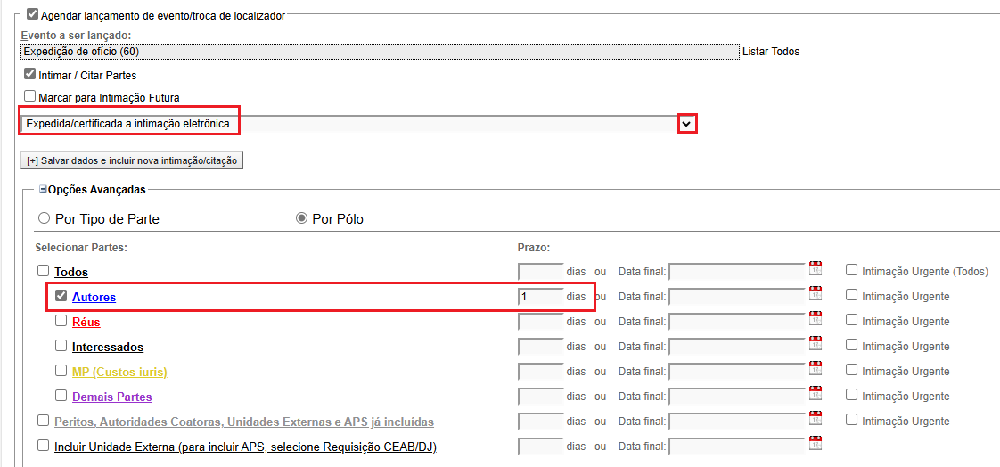

---

EXPEDIÇÃO DE DOCUMENTOS – OFÍCIOS

**EPROC PARA SEGUNDO GRAU****–****UNIDADE JUDICIAL****|**Conteúdo integral do curso
<small>**108**</small><small>**Descrição da imagem**: seção “Gerenciar Localizadores” definida para remover o processo do localizador atual e</small><small>incluí-lo no localizador “Ofícios - Assinados”.</small>
No campo**“Classificação”**o usuário poderá selecionar opção já existente correspondente à minuta

que está sendo emitida ou criar uma classificação que faça referência ao tipo/modelo utilizado

para facilitar posterior localização. Para criar classificação, acionar o ícone**“Gerenciar**

**classificações”**, representado pelo sinal de mais.
<small>**Descrição da imagem**: destaque para o campo “Classificação” e o ícone “Gerenciar classificações”.</small>
No campo**“Descrição”**também é possível inserir nomenclatura que faça referência ao modelo

que está sendo utilizado, a fim de facilitar posterior localização do documento.
<small>**Descrição da imagem**: campo “Descrição” preenchido.</small>
Indicar o usuário responsável pela assinatura do documento no campo**“Assinante”**(Magistrado

atuante no juízo) e seu perfil no campo**“Tratamento”**(Desembargador ou Juiz Substituto em

Segundo Grau).
<small>**Descrição da imagem:**campos “Assinante” e “Tratamento”.</small>
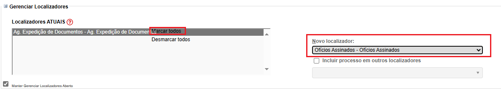

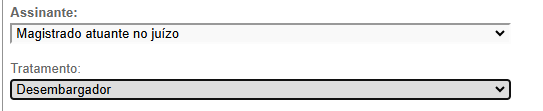

---

EXPEDIÇÃO DE DOCUMENTOS – OFÍCIOS

**EPROC PARA SEGUNDO GRAU****–****UNIDADE JUDICIAL****|**Conteúdo integral do curso
<small>**109**</small>
Por fim, também é possível incluir no**“Cabeçalho”**do documento as informações:

▪ Advogado;

▪ MP;

▪ Interessados;

▪ Outras Partes;

▪ Apensos – Art. 28 LEF;

▪ Apenas Parte Principal;

▪ Processo originário.

Clicar em**“Exibir Cabeçalho”**para visualizar uma prévia de como ficará no documento.
<small>**Descrição da imagem**: seção “Cabeçalho” com destaque para o botão “Exibir Cabeçalho” e a prévia da sua</small><small>visualização.</small>
Selecionar o nível de sigilo do documento entre aqueles disponíveis.
<small>**Descrição da imagem**: campo “Nível de Sigilo” e as opções disponíveis.</small>
As minutas têm um ciclo de vida separado do processo. É importante selecionar o status que a

minuta terá após sua expedição quando mais de uma pessoa trabalhar com ela. O campo**“Status**

**destino”**permite organizar a rotina de revisão e de assinatura das minutas, pois esse “ir e vir”

deverá ser realizado pelo status, não pelos localizadores.

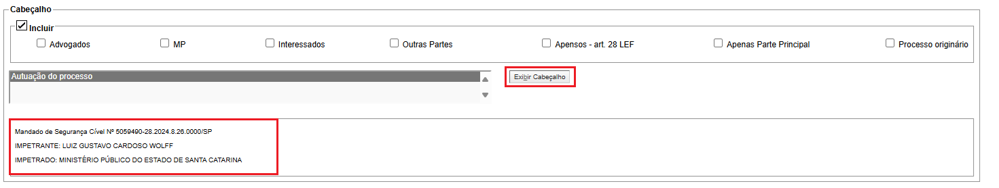

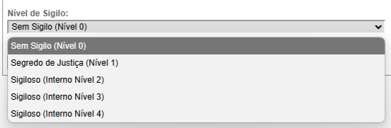

---

EXPEDIÇÃO DE DOCUMENTOS – OFÍCIOS

**EPROC PARA SEGUNDO GRAU****–****UNIDADE JUDICIAL****|**Conteúdo integral do curso
<small>**110**</small><small>**Descrição da imagem**: campo “Status destino” e as opções disponíveis.</small>
**Importante**

Caso o documento configurado seja de expedição recorrente, sugere-se que as

configurações efetuadas sejam salvas como uma**preferência**, facilitando as emissões

futuras. As configurações e usos das “Preferências” serão tratadas em aula futura.

Então, clicar em**“Salvar e Editar”**para abrir o editor de textos.

**Edição da minuta**

No editor de textos, o usuário poderá redigir o conteúdo necessário para a elaboração do

documento usando*tags*, texto-padrão, documentos-base, lembretes e modelos.
<small>**Descrição da imagem**: documento aberto no editor de textos.</small>
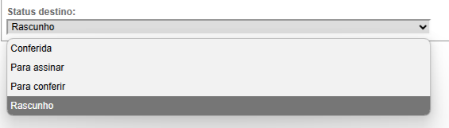

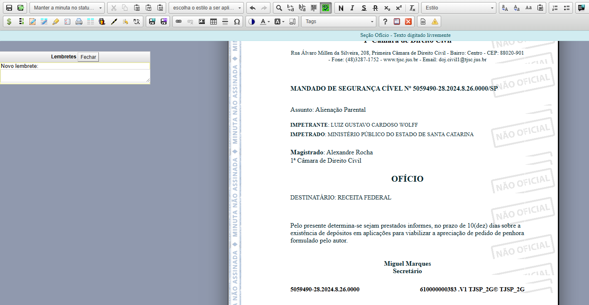

---

EXPEDIÇÃO DE DOCUMENTOS – OFÍCIOS

**EPROC PARA SEGUNDO GRAU****–****UNIDADE JUDICIAL****|**Conteúdo integral do curso
<small>**111**</small>
Após a verificação, redação ou complementação do conteúdo do documento, recomenda-se a

indicação de seu resumo, o que deve ser feito selecionando parte do texto desejado e

pressionando o atalho**“Alt+R”**. O texto selecionado ficará com o fundo em cinza e disponível para

visualização na tabela de eventos, não sendo necessário abrir o documento ou acessar a árvore do

processo para consultar seu teor.
<small>**Descrição da imagem**: destaque para o resumo do documento, realizado por meio do comando ALT + R.</small>
Caso precise alterar alguma das informações configuradas anteriormente, utilizar a opção**“Alterar**

**Dados”**, representada pelo ícone de uma sulfite e um lápis.
<small>**Descrição da imagem**: destaque para o ícone “Alterar Dados”.</small>
Com todas as informações conferidas e o texto finalizado, salvar e encaminhar o ofício para o

próximo passo (conferência ou assinatura), por meio da opção**“Status desejado ao salvar”**.
<small>**Descrição da imagem**: barra superior do editor de textos, com destaque para o campo “Status desejado ao salvar a</small><small>minuta” e para as opções “Encaminhar minuta para conferência” ou “Encaminhar minuta para assinatura”.</small>
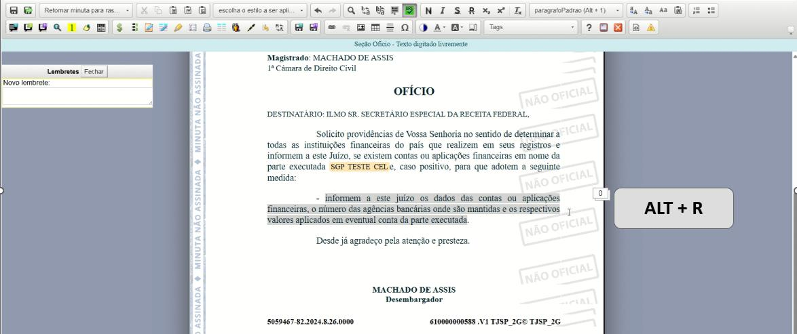

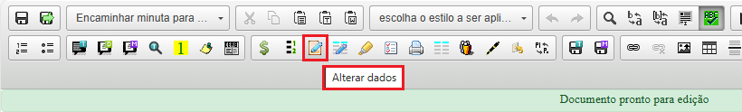

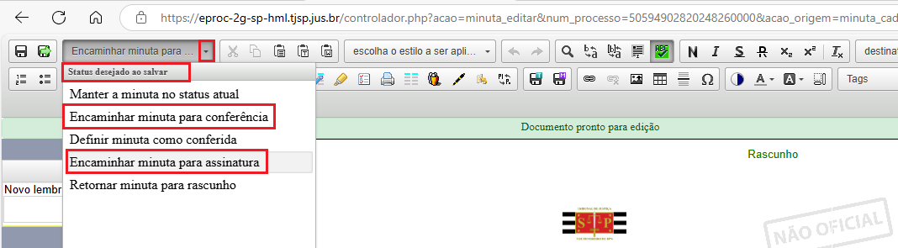

---

EXPEDIÇÃO DE DOCUMENTOS – OFÍCIOS

**EPROC PARA SEGUNDO GRAU****–****UNIDADE JUDICIAL****|**Conteúdo integral do curso
<small>**112**</small>
Por fim, clicar na opção**“Salvar Minuta e Sair”**.

**Disponibilização da minuta**

Necessário disponibilizar a minuta ao gabinete para possibilitar a assinatura pelo(a)

Desembargador(a)/Juiz(íza) Substituto(a) em Segundo Grau.

Para tanto, o usuário deverá acionar a capa do processo e, na seção**“Minutas”**,selecionar o ofício

emitido; na coluna**“Recursos Disponíveis”**,clicar no ícone**“Disponibilizar minuta”**para

encaminhar a minuta ao gabinete.
<small>**Descrição da imagem:**destaque para a minuta “Ofício” e o ícone “Disponibilizar minuta”.</small>
O sistema abrirá a tela para escolha do gabinete assinante da minuta; selecionar o respectivo

gabinete e clicar em**“Disponibilizar”**.
<small>**Descrição da imagem:**destaque para o gabinete assinante e o botão “Disponibilizar”.</small>
**Atenção**

É muito importante escolher o gabinete corretamente, pois o sistema permite a

disponibilização da minuta a qualquer gabinete, assim é possível remeter minutas ao

relator do processo ou ao Presidente do Órgão Julgador, se necessário.

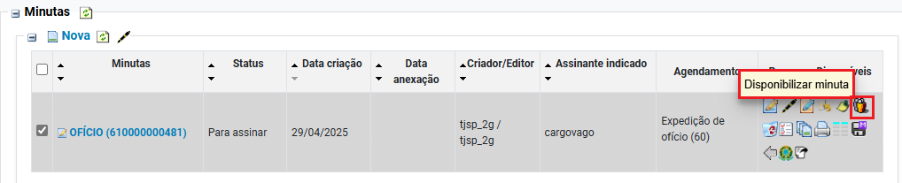

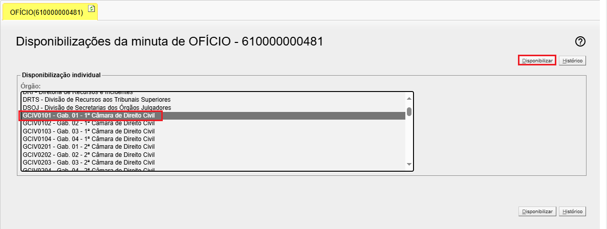

---

EXPEDIÇÃO DE DOCUMENTOS – OFÍCIOS

**EPROC PARA SEGUNDO GRAU****–****UNIDADE JUDICIAL****|**Conteúdo integral do curso
<small>**113**</small>
Caso ocorra algum equívoco na escolha do órgão de disponibilização da minuta, será possível, pela

tela de disponibilização, desfazer a ação, por meio do ícone**“Excluir Disponibilização”**,

representado por uma lixeira, na coluna**“Ações”**.
<small>**Descrição da imagem:**destaque para o ícone “Excluir Disponibilização”.</small>
O sistema exigirá a confirmação da exclusão da disponibilização.
<small>**Descrição da imagem:**janela de confirmação de exclusão da disponibilização.</small>
Após a exclusão, o usuário poderá disponibilizar a minuta ao gabinete correto, acionando

novamente o ícone**“Disponibilizar minuta”**, presente na seção**“Minutas”**, na capa do processo.

Uma vez disponibilizada a minuta, como já foi escolhido o(a) magistrado(a) assinante no momento

da sua elaboração, esta estará disponível no localizador**“Minutas para assinar”**,no painel do

respectivo magistrado(a).

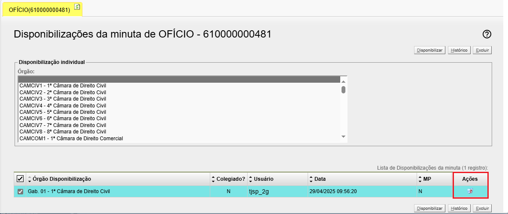

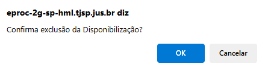

---

EXPEDIÇÃO DE DOCUMENTOS – OFÍCIOS

**EPROC PARA SEGUNDO GRAU****–****UNIDADE JUDICIAL****|**Conteúdo integral do curso
<small>**114**</small><small>**Descrição da imagem:**painel do magistrado com destaque para “Minutas para assinar”.</small>
Após a assinatura, como o evento já foi agendado, o documento será disponibilizado no processo,

assim como o seu resumo (se o usuário o tiver destacado), bem como o respectivo evento lançado

na tabela de eventos**(1)**. Caso tenha sido configurada a intimação eletrônica, o respectivo evento

também será lançado na tabela, com controle de prazo**(2)**.
<small>**Descrição da imagem**: destaque para o evento “Expedição de Ofício”, o documento e seu respectivo resumo, bem</small><small>como o evento “Expedida/certificada a intimação eletrônica”.</small>
O localizador também será inserido no processo de acordo com o gerenciamento realizado no

momento na elaboração da minuta.
<small>**Descrição da imagem:**destaque para o localizador “Ofícios Assinados”.</small>
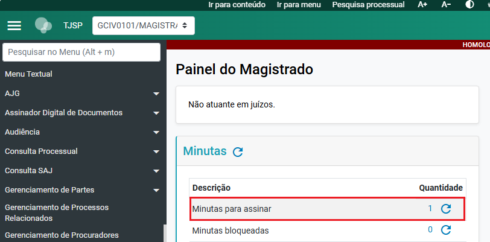

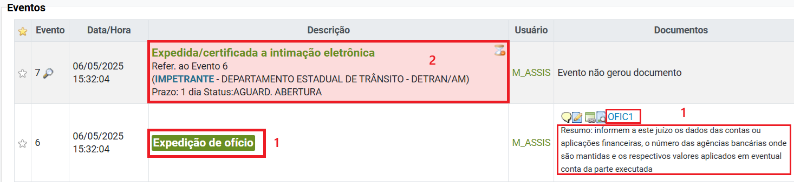

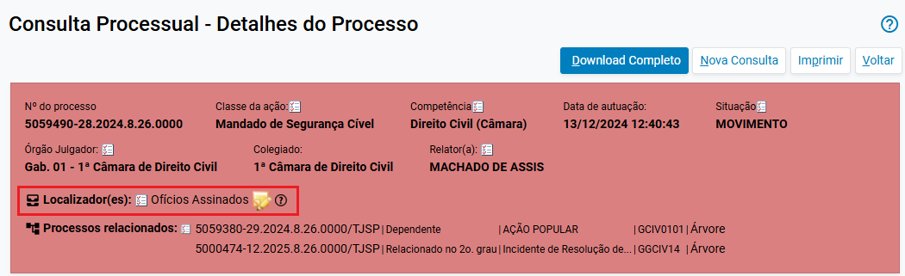

---

EXPEDIÇÃO DE DOCUMENTOS – CARTA DE ORDEM

**EPROC PARA SEGUNDO GRAU****–****UNIDADE JUDICIAL****|**Conteúdo integral do curso
<small>**115**</small>
# ▪ EXPEDIÇÃO DE DOCUMENTOS – CARTA

**DE ORDEM**

A partir da capa do processo (tela**“Consulta Processual –****Detalhes do Processo”**) o usuário poderá

expedir a minuta de qualquer documento, como, por exemplo, as Cartas de Ordem. Para tanto,

localizar a seção**“Minutas”**e clicar em**“Nova”**ou clicar sobre o botão facilitador**“Minutar”**, logo

acima da**tabela de eventos**.
<small>**Descrição da imagem**: destaque para o botão “Nova”, presente na seção Minutas, e para o botão “Minutar”,</small><small>localizado acima da tabela de eventos.</small>
**Agendamento**

Na seção**“Texto Inicial”**, campo**“Tipo de documento/Modelo”**, digitar “carta de ordem” para que

sejam filtradas as opções de documento-base. O primeiro resultado possuirá o fundo em cinza

entre asteriscos, sinalizando tratar-se do modelo-matriz (genérico).
<small>**Descrição da imagem**: campo “Tipo de documento/Modelo” preenchido com o texto “carta de ordem” e destaque</small><small>para o modelo-matriz “CARTA DE ORDEM”.</small>
A caixa de seleção**“Agendar lançamento de evento/troca de localizador”**deverá ser preenchida

com o evento correlato, no caso,**“Expedição de Carta de Ordem/Precatória/Rogatória”**.
<small>**Descrição da imagem**: destaque para a caixa de seleção “Agendar lançamento de evento/troca de localizador”</small><small>marcada e o evento “Expedição de Carta de Ordem/Precatória/Rogatória”.</small>

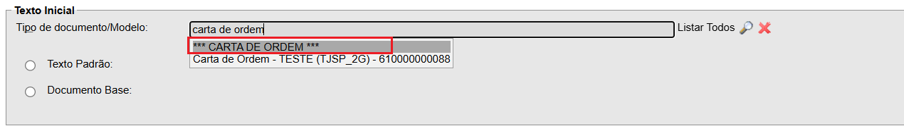

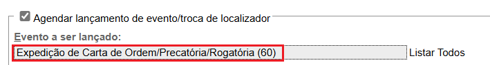

---

EXPEDIÇÃO DE DOCUMENTOS – CARTA DE ORDEM

**EPROC PARA SEGUNDO GRAU****–****UNIDADE JUDICIAL****|**Conteúdo integral do curso
<small>**116**</small>
Na seção**“Gerenciar Localizadores”**, o usuário poderá indicar se o sistema deve remover e/ou

incluir o processo em um ou mais localizadores, tendo em vista a atividade realizada (expedição

de carta de ordem).

Neste exemplo, o processo será removido dos localizadores atuais (utilizar a opção marcar todos)

e incluído no localizador do órgão**“Carta de Ordem****-****Assinada”**.
<small>**Descrição da imagem**: seção “Gerenciar Localizadores”. A configuração está definida para remover o processo dos</small><small>localizadores atuais e incluí-lo no localizador “Carta de Ordem Assinada”.</small>
No campo**“Classificação”**o usuário poderá selecionar opção já existente correspondente à minuta

que está sendo emitida ou criar uma classificação que faça referência ao tipo/modelo utilizado,

para facilitar posterior localização. Para criar classificação, acionar o ícone**“Gerenciar**

**classificações”**, representado pelo sinal de mais.
<small>**Descrição da imagem**: destaque para o campo “Classificação” e o ícone “Gerenciar classificações”.</small>
No campo**“Descrição”**também é possível inserir nomenclatura que faça referência ao modelo

que está sendo utilizado, a fim de facilitar posterior localização do documento.
<small>**Descrição da imagem**: campo “Descrição” preenchido.</small>
Indicar o usuário responsável pela assinatura do documento no campo**“Assinante”**(Magistrado

atuante no juízo) e seu perfil no campo**“Tratamento”**(Desembargador ou Juiz Substituto em

Segundo Grau).

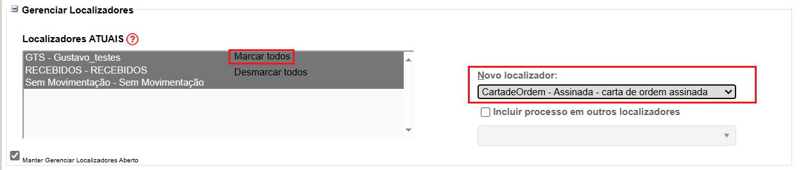

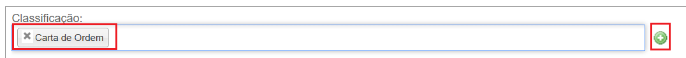

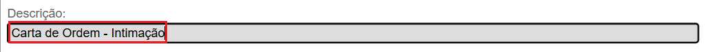

---

EXPEDIÇÃO DE DOCUMENTOS – CARTA DE ORDEM

**EPROC PARA SEGUNDO GRAU****–****UNIDADE JUDICIAL****|**Conteúdo integral do curso
<small>**117**</small><small>**Descrição da imagem**: campos “Assinante” e “Tratamento”.</small>
Por fim, também é possível incluir no**“Cabeçalho”**do documento as informações:

▪ Advogado;

▪ MP;

▪ Interessados;

▪ Outras Partes;

▪ Apensos – Art. 28 LEF;

▪ Apenas Parte Principal;

▪ Processo originário.

Clicar em**“Exibir Cabeçalho”**para visualizar uma prévia de como ficará no documento.
<small>**Descrição da imagem**: seção “Cabeçalho” com destaque para o botão “Exibir Cabeçalho” e a prévia da sua</small><small>visualização.</small>
**Atenção**

Se o processo possuir incidentes e recursos (ex: embargos de declaração, recurso

especial etc. ), no campo “Cabeçalho”, o usuário deverá escolher sobre qual

expediente está minutando a carta e depois clicar em “Exibir cabeçalho”.

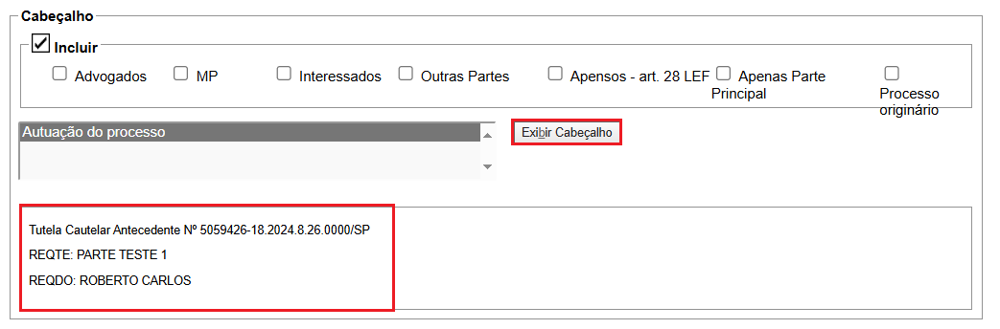

---

EXPEDIÇÃO DE DOCUMENTOS – CARTA DE ORDEM

**EPROC PARA SEGUNDO GRAU****–****UNIDADE JUDICIAL****|**Conteúdo integral do curso
<small>**118**</small>
Selecionar o nível de sigilo do documento entre aqueles disponíveis.
<small>**Descrição da imagem**: campo “Nível de Sigilo” e as opções disponíveis.</small>
As minutas têm um ciclo de vida separado do processo. É importante selecionar o status que a

minuta terá após sua expedição quando mais de uma pessoa trabalhar com ela. O campo**“Status**

**destino”**permite organizar a rotina de revisão e de assinatura das minutas, pois esse “ir e vir”

deverá ser realizado pelo status, não pelos localizadores.
<small>**Descrição da imagem**: campo “Status destino” e as opções disponíveis.</small>
**Importante**

Caso o documento configurado seja de expedição recorrente, sugere-se que as

configurações efetuadas sejam salvas como uma**preferência**, facilitando as emissões

futuras. As configurações e usos das “Preferências” serão tratadas em aula futura.

Então, clicar em**“Salvar e Editar”**para abrir o editor de textos.

**Edição da minuta**

No editor de textos, o usuário poderá redigir o conteúdo necessário para a elaboração do

documento usando*tags*, texto-padrão, documentos-base, lembretes e modelos.

---

EXPEDIÇÃO DE DOCUMENTOS – CARTA DE ORDEM

**EPROC PARA SEGUNDO GRAU****–****UNIDADE JUDICIAL****|**Conteúdo integral do curso
<small>**119**</small><small>**Descrição da imagem**: documento aberto no editor de textos.</small>
Após a verificação, redação ou complementação do conteúdo do documento, recomenda-se a

indicação de seu resumo, o que deve ser feito selecionando parte do texto desejado e

pressionando o atalho**“Alt+R”**. O texto selecionado ficará com o fundo em cinza e disponível para

visualização na tabela de eventos, não sendo necessário abrir o documento ou acessar a árvore do

processo para consultar seu teor.
<small>**Descrição da imagem**: destaque para o resumo do documento, realizado por meio do comando ALT + R.</small>
Ademais, caso precise alterar alguma das informações configuradas anteriormente, utilizar a

opção**“Alterar Dados”**, representada pelo ícone de uma sulfite e um lápis.

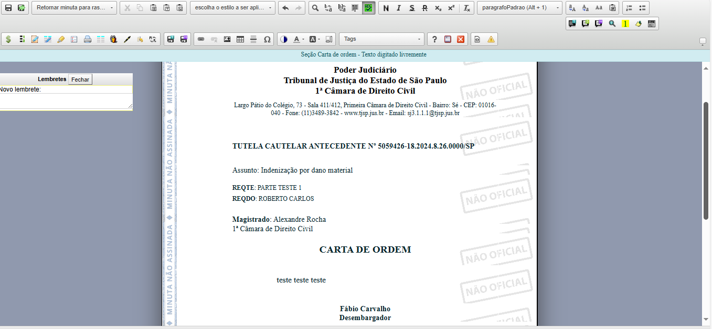

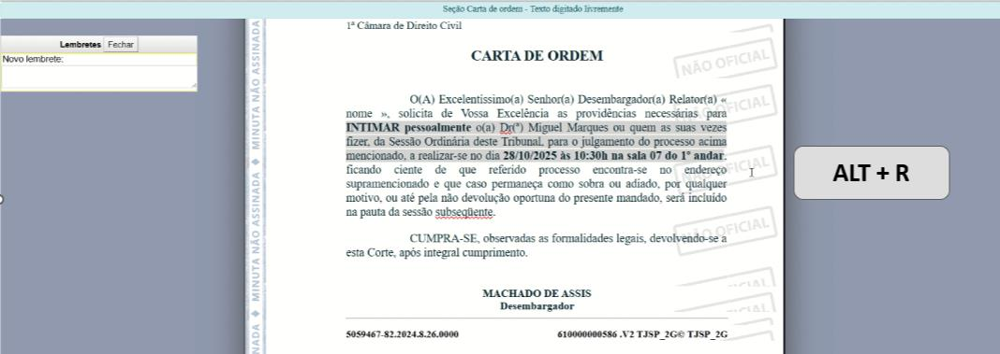

---

EXPEDIÇÃO DE DOCUMENTOS – CARTA DE ORDEM

**EPROC PARA SEGUNDO GRAU****–****UNIDADE JUDICIAL****|**Conteúdo integral do curso
<small>**120**</small><small>**Descrição da imagem**: destaque para o ícone “Alterar Dados”.</small>
Com todas as informações conferidas e o texto finalizado, salvar e encaminhar a carta de ordem

para o próximo passo (conferência ou assinatura), por meio da opção**“Status desejado ao salvar”**.
<small>**Descrição da imagem**: barra superior do editor de textos, com destaque para o campo “Status desejado ao salvar a</small><small>minuta” e para as opções “Encaminhar minuta para conferência” ou “Encaminhar minuta para assinatura”.</small>
Por fim, clicar na opção**“Salvar Minuta e Sair”**.

**Disponibilização da minuta**

Necessário disponibilizar a minuta ao gabinete para possibilitar a assinatura pelo(a)

Desembargador(a)/Juiz(íza) Substituto(a) em Segundo Grau.

O usuário deverá acionar a capa do processo e, na seção**“Minutas”**,selecionar a carta de ordem

emitida; na coluna**“Recursos Disponíveis”**,clicar no ícone**“Disponibilizar minuta”**para

encaminhar a minuta ao gabinete.
<small>**Descrição da imagem:**destaque para a minuta “Carta e Ordem” e o ícone “Disponibilizar minuta”.</small>
O sistema abrirá a tela para escolha do gabinete assinante da minuta; selecionar o respectivo

gabinete e clicar em**“Disponibilizar”**.

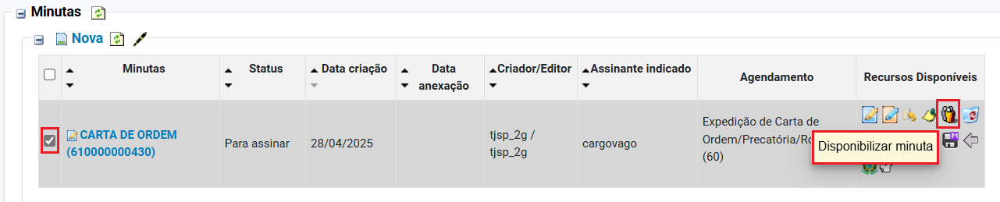

---

EXPEDIÇÃO DE DOCUMENTOS – CARTA DE ORDEM

**EPROC PARA SEGUNDO GRAU****–****UNIDADE JUDICIAL****|**Conteúdo integral do curso
<small>**121**</small><small>**Descrição da imagem:**destaque para o gabinete assinante e o botão “Disponibilizar”.</small>
**Atenção**

É muito importante escolher o gabinete corretamente, pois o sistema permite a

disponibilização da minuta a qualquer gabinete, assim é possível remeter minutas ao

relator do processo ou ao Presidente do Órgão Julgador, se necessário.

Caso ocorra algum equívoco na escolha do órgão de disponibilização da minuta, será possível, pela

tela de disponibilização, desfazer a ação por meio do ícone**“Excluir Disponibilização”**,

representado por uma lixeira, na coluna**“Ações”**.
<small>**Descrição da imagem:**destaque para o ícone “Excluir Disponibilização”.</small>
O sistema exigirá a confirmação da exclusão da disponibilização.

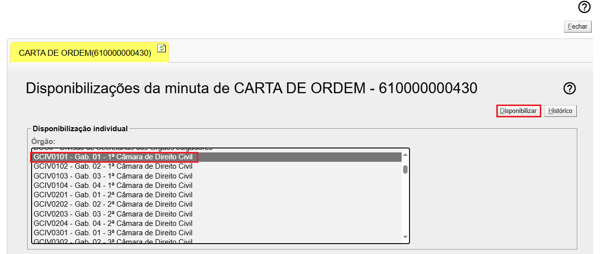

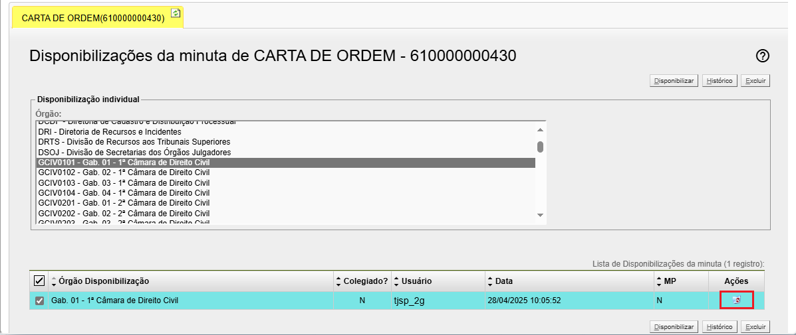

---

EXPEDIÇÃO DE DOCUMENTOS – CARTA DE ORDEM

**EPROC PARA SEGUNDO GRAU****–****UNIDADE JUDICIAL****|**Conteúdo integral do curso
<small>**122**</small><small>**Descrição da imagem:**janela de confirmação de exclusão da disponibilização.</small>
Após a exclusão, o usuário poderá disponibilizar a minuta ao gabinete correto, acionando

novamente o ícone**“Disponibilizar minuta”**, presente na seção**“Minutas”**, na capa do processo.

Uma vez disponibilizada a minuta, como já foi escolhido o(a) magistrado(a) assinante no momento

da sua elaboração, esta estará disponível no localizador**“Minutas para assinar”**,no painel do

respectivo magistrado(a).
<small>**Descrição da imagem:**painel do magistrado com destaque para “Minutas para assinar”.</small>
Após a assinatura, como o evento já foi agendado, o documento será disponibilizado no processo,

assim como o seu resumo (se o usuário o tiver destacado), bem como o respectivo evento lançado

na tabela de eventos.
<small>**Descrição da imagem**: tabela de eventos com destaque para o evento “Expedição de Carta de</small><small>Ordem/Precatória/Rogatória”, o respectivo documento e seu resumo.</small>

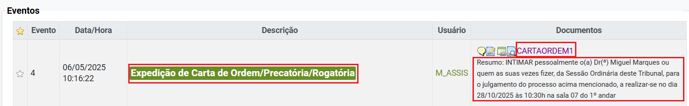

---

EXPEDIÇÃO DE DOCUMENTOS – CARTA DE ORDEM

**EPROC PARA SEGUNDO GRAU****–****UNIDADE JUDICIAL****|**Conteúdo integral do curso
<small>**123**</small>
O localizador também será inserido no processo, de acordo com o gerenciamento realizado no

momento na elaboração da minuta.
<small>**Descrição da imagem:**destaque para o localizador “CartadeOrdem - Assinada”.</small>
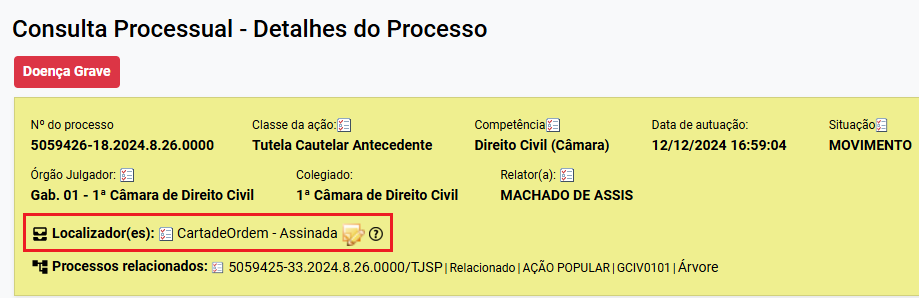

---

EXPEDIÇÃO DE DOCUMENTOS – CITAÇÕES E INTIMAÇÕES ELETRÔNICAS

**EPROC PARA SEGUNDO GRAU****–****UNIDADE JUDICIAL****|**Conteúdo integral do curso
<small>**124**</small>
# ▪ EXPEDIÇÃO DE DOCUMENTOS –

**CITAÇÕES E INTIMAÇÕES ELETRÔNICAS**

O eproc permite a realização de**citações eletrônicas**para:

▪ entidades representadas por procurador; e

▪ pessoas jurídicas com representante legal cadastrado.

Para verificar a possibilidade de citação eletrônica de uma parte, posicionar o mouse sobre seu

nome na seção**“Partes e Representantes”**. Um aviso com o texto**“Citação eletrônica”**será exibido

caso a modalidade seja aplicável.
<small>**Descrição da imagem**: aviso “Citação eletrônica” exibido ao posicionar o mouse sobre uma entidade habilitada para</small><small>esta modalidade de citação.</small>
As**intimações eletrônicas**destinadas a todas as pessoas físicas, jurídicas de direito privado e

entidades de direito privado com procurador cadastrado serão realizadas pelo Diário de Justiça

Eletrônico Nacional (DJEN).

**Importante**

No eproc, o cenário ideal é que na própria decisão já venha configurada a

citação/intimação eletrônica, de forma a eliminar trabalhos que podem ser realizados

de forma automatizada.

**Configurando a citação e a intimação eletrônicas**

No menu, localizar a seção**“Ações”**e clicar em**“Citar”**ou em**“Intimar”**, conforme a comunicação

a ser efetivada.
<small>**Descrição da imagem**: botões “Citar” e “Intimar”.</small>

---

EXPEDIÇÃO DE DOCUMENTOS – CITAÇÕES E INTIMAÇÕES ELETRÔNICAS

**EPROC PARA SEGUNDO GRAU****–****UNIDADE JUDICIAL****|**Conteúdo integral do curso
<small>**125**</small>
Em**“Evento de citação/intimação”**, selecionar o evento apropriado à citação/intimação eletrônica

a ser efetivada.
<small>**Descrição da imagem**: destaque para o campo “Evento de citação/intimação” e a seta para abertura do menu</small><small>expansível.</small>
Na seção**“Opções Avançadas”**, selecionar as partes a serem citadas/intimadas e indicar os

respectivos prazos.
<small>**Descrição da imagem**: seção “Opções Avançadas” com os campos para seleção das partes e prazos.</small>
**Atenção**

Quando houver a intimação de uma parte que possua a prerrogativa do**prazo em**

**dobro**, o usuário deverá inserir no campo “Prazo” o número efetivo de dias (já

considerada a contagem em dobro).

Quando houver mais de uma parte no mesmo polo e a contagem de prazo for diferente (prazo

simples x prazo em dobro), na parte inferior da tela de agendamento, selecionar a caixa de seleção

de cada parte.
<small>**Descrição da imagem**: destaque para a caixa de seleção de cada uma das partes.</small>

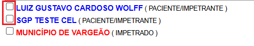

---

EXPEDIÇÃO DE DOCUMENTOS – CITAÇÕES E INTIMAÇÕES ELETRÔNICAS

**EPROC PARA SEGUNDO GRAU****–****UNIDADE JUDICIAL****|**Conteúdo integral do curso
<small>**126**</small>
Após selecionar individualmente as partes, serão exibidos campos de prazo para cada uma delas,

a possibilitar que o usuário insira, respectivamente, o prazo simples e em dobro para cada qual.
<small>**Descrição da imagem**: destaque para os campos prazos, com indicação de prazo simples e em dobro.</small>
Ademais, o usuário poderá marcar a caixa de seleção**“Intimação Urgente”**; para aquela parte que

deva se manifestar no processo com prazo reduzido, recomenda-se marcar referido*checkbox.*
<small>**Descrição da imagem**: destaque para a marcação da caixa de seleção “Intimação Urgente” do polo ativo.</small>
Quando a unidade judicial marcar a caixa de seleção**“Intimação Urgente”**,esse processo será

exibido no localizador “Processos pendentes de citação/intimação – Urgentes” no Painel do

Advogado/Procurador/Defensor.
<small>**Descrição da imagem**: destaque para o localizador “Processos pendentes de citação/intimação – Urgentes”.</small>

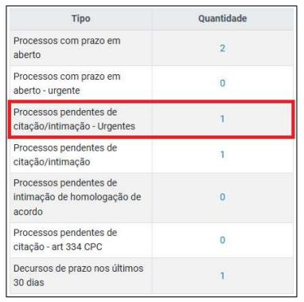

---

EXPEDIÇÃO DE DOCUMENTOS – CITAÇÕES E INTIMAÇÕES ELETRÔNICAS

**EPROC PARA SEGUNDO GRAU****–****UNIDADE JUDICIAL****|**Conteúdo integral do curso
<small>**127**</small>
Em**“Vincular Evento de Citação/Intimação”**, selecionar o evento a ser associado à

citação/intimação. É possível adicionar mais de um evento clicando no botão**“Incluir Evento”**,

representado pelo sinal de adição.
<small>**Descrição da imagem**: eventos selecionados na seção “Vincular Evento de Citação/Intimação”.</small>
O sistema automaticamente sugere uma seleção, baseada nos últimos eventos de cada processo.

Após selecionar o evento/documento correlato ou confirmar o evento/documento sugerido pelo

sistema, marcar a respectiva caixa de seleção.
<small>**Descrição da imagem**: destaque para a caixa de seleção “Marque essa opção após confirmar os</small><small>eventos/documentos sugeridos pelo sistema”.</small>
Na seção**“Gerenciar Localizadores”**, o usuário poderá indicar se o sistema deve remover ou incluir

o processo em um ou mais localizadores, tendo em vista a atividade realizada.
<small>**Descrição da imagem**: seção “Gerenciar Localizadores” definida para remover o processo dos localizadores atuais e</small><small>incluí-lo no localizador “Petição para análise – Petição para análise AGG”.</small>
**Importante**

Caso a citação/intimação eletrônica configurada seja de execução recorrente, sugere-

se que as configurações efetuadas sejam salvas como uma**preferência**, facilitando as

emissões futuras. As configurações e usos das “Preferências” serão tratadas na

próxima aula.

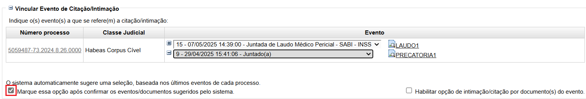

---

EXPEDIÇÃO DE DOCUMENTOS – CITAÇÕES E INTIMAÇÕES ELETRÔNICAS

**EPROC PARA SEGUNDO GRAU****–****UNIDADE JUDICIAL****|**Conteúdo integral do curso
<small>**128**</small>
Por fim, será possível conferir a parte e prazo selecionados. Clicar em**“Citar”**ou**“Intimar”**(a

depender do ato que está sendo praticado) para concluir a ação.
<small>**Descrição da imagem**: seção “Gerenciar Localizadores” com configuração de parte para intimação, destaque ao</small><small>botão “Intimar”.</small>
Após essa etapa, o evento de citação ou intimação será registrado na tabela de eventos.
<small>**Descrição da imagem**: tabela de eventos com exibição do evento de intimação eletrônica.</small>
**Intimação de Unidades Externas**

A intimação eletrônica também está disponível para uma série de unidades externas, como

Cartórios Extrajudiciais, Unidades Prisionais e Secretarias municipais, possibilitando a ágil

requisição de informações e documentos.

Para tanto, localizar a seção**“Ações”**e clicar em**“Requisição Unidade Externa”**.
<small>**Descrição da imagem**: seção “Ações” com destaque para o botão “Requisição Unidade Externa”.</small>
O campo**“Evento de citação/intimação”**virá automaticamente preenchido e não deve ser

alterado. Em**“Vincular Evento de Citação/Intimação”**selecionar o evento a ser associado à

requisição.

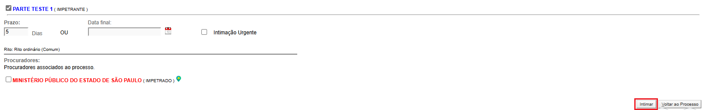

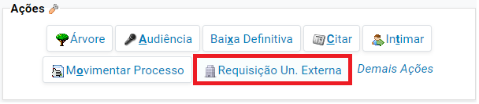

---

EXPEDIÇÃO DE DOCUMENTOS – CITAÇÕES E INTIMAÇÕES ELETRÔNICAS

**EPROC PARA SEGUNDO GRAU****–****UNIDADE JUDICIAL****|**Conteúdo integral do curso
<small>**129**</small><small>**Descrição da imagem**: evento selecionado na seção “Vincular Evento de Citação/Intimação”.</small>
Na seção**“Requisição Unidade Externa”**, indicar o**prazo**para atendimento da requisição e

selecionar a unidade de destino no campo**“Incluir nova parte”**. Caso necessário, é possível clicar

em**“Listar Todas”**para visualizar todas as unidades disponíveis para a comunicação eletrônica.

Então, clicar em**“Intimar”**.
<small>**Descrição da imagem**: seção “Requisição Unidade Externa” com destaque para os campos de “Prazo” e “Incluir nova</small><small>parte” e para os botões “Listar Todas” e “Intimar”.</small>
A intimação, registrada na tabela de eventos, será encaminhada ao painel do procurador da

unidade, que terá 10 (dez) dias para abri-la. A partir da abertura, o prazo do ato começará a ser

contado.
<small>**Descrição da imagem**: tabela de eventos com exibição dos eventos de intimação eletrônica da Unidade Externa.</small>
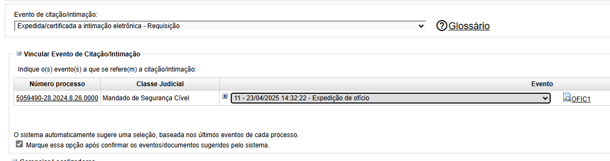

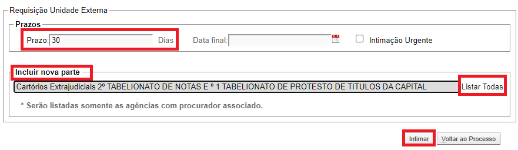

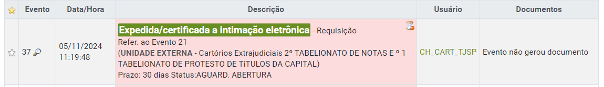

---

EXPEDIÇÃO DE DOCUMENTOS – CITAÇÕES E INTIMAÇÕES ELETRÔNICAS

**EPROC PARA SEGUNDO GRAU****–****UNIDADE JUDICIAL****|**Conteúdo integral do curso
<small>**130**</small>
**Intimação da Defensoria Pública e do Ministério Público**

Nos processos em que a Defensoria Pública consta como procuradora de uma ou mais partes, as

comunicações a ela direcionadas seguirão os mesmos moldes das citações e intimações eletrônicas

explicitadas neste material. Isso também se aplica aos processos em que o Ministério Público atuar

como parte.

Já para os casos em que o Ministério Público atue como*custos juris*(“**Informações Adicionais****”**>

“**Vista Ministério Público****”**), ao configurar a intimação eletrônica da entidade deve ser selecionado

o evento**“Expedida/certificada a intimação eletrônica****-****Vista ao MP para Parecer”**.
<small>**Descrição da imagem**: campo “Evento de citação/intimação” com a seleção do evento “Expedida/certificada a</small><small>intimação eletrônica - Vista ao MP para Parecer”.</small>
**Domicílio Judicial Eletrônico**

A Lei nº 14. 195/2021 ao promover alterações no Código de Processo Civil trouxe algumas

inovações acerca da citação, tornando-a preferencialmente eletrônica. Em decorrência disso o

CNJ, por meio da Resolução CNJ nº 455/2022, alterada pela Resolução CNJ n. º 569/2024,

regulamentou o**Domicílio Judicial Eletrônico**para a citação/intimação pessoal das partes pelo

Portal de Serviços do Poder Judiciário (**PSPJ**).

O**Domicílio Judicial Eletrônico**é o ambiente digital integrado ao**PSPJ**para a comunicação

processual entre os órgãos do Poder Judiciário e os destinatários, sejam ou não partes na relação

processual.

O cadastro dos interessados no**Domicílio Judicial Eletrônico**é feito pelo CNJ, sem intervenção dos

Tribunais ou Cartórios/Varas. Para as pessoas físicas o cadastro é facultativo, sendo obrigatório

para:

▪ Instituições Públicas da União;

▪ Instituições Públicas dos Estados e Distrito Federal;

▪ Instituições Públicas dos Municípios;

▪ Entidades da Administração Indireta;

▪ Empresas Públicas;

▪ Empresas Privadas;

▪ Ministério Público;

---

EXPEDIÇÃO DE DOCUMENTOS – CITAÇÕES E INTIMAÇÕES ELETRÔNICAS

**EPROC PARA SEGUNDO GRAU****–****UNIDADE JUDICIAL****|**Conteúdo integral do curso
<small>**131**</small>
▪ Defensoria Pública e

▪ Advocacia Pública.

Como regra, podemos estabelecer as seguintes premissas:

▪ o Domicílio Judicial Eletrônico possibilita às partes envolvidas em processos a

receberem, por meio eletrônico,**citações**(com exceção da citação por edital a ser

realizada via DJEN) e**comunicações processuais**que exijam vista, ciência ou intimação

pessoal da parte ou de terceiros, desde que previamente cadastradas;

▪ a identificação no Domicílio Judicial Eletrônico ocorre exclusivamente com base no

número de CPF/CNPJ registrado na Receita Federal;

▪**Pessoas jurídicas de Direito Público**recebem citação e intimação pelo Domicílio

Judicial Eletrônico;

▪**Pessoas jurídicas de Direito Privado e pessoas físicas**recebem citação pelo Domicílio

Judicial Eletrônico, se cadastradas.

**Atenção**

Todas as demais**intimações (representantes das pessoas jurídicas de direito privado**

**e das pessoas físicas)**serão realizadas pelo Diário de Justiça Eletrônico Nacional

(DJEN).

No eproc, as partes cadastradas no Domicílio Judicial Eletrônico são identificadas pelo próprio

ícone da ferramenta, exibido ao lado do nome da parte, na capa do processo.
<small>**Descrição da imagem**: destaque para o ícone representativo do domicílio judicial eletrônico.</small>
O agendamento das comunicações eletrônicas direcionadas às partes cadastradas no Domicílio

Judicial seguirão os mesmos moldes das citações e intimações eletrônicas explicitadas neste

material.

Uma vez enviada a comunicação eletrônica, o destinatário também possui prazo para sua

abertura. Quando a comunicação é aberta a parte ainda possuirá 05 (cinco) dias úteis adicionais,

antes que o seu prazo para resposta comece a contar efetivamente.

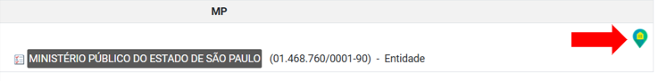

---

EXPEDIÇÃO DE DOCUMENTOS – CITAÇÕES E INTIMAÇÕES ELETRÔNICAS

**EPROC PARA SEGUNDO GRAU****–****UNIDADE JUDICIAL****|**Conteúdo integral do curso
<small>**132**</small>
O destinatário possui os seguintes prazos para abrir a comunicação eletrônica:

▪**pessoas jurídicas de direito público**: 10 (dez) dias corridos para abertura da citação ou

intimação;

**◦**

para as**intimações**das pessoas jurídicas de direito público aplica-se o prazo de

10 (dez) dias corridos para abertura da comunicação. Porém, decorrido o

período, inicia-se de imediato a contagem do prazo para a resposta, ou seja,

não há prazo adicional para referidas intimações;

▪**pessoas jurídicas de direito privado e pessoas físicas**: 03 (três) dias úteis para abertura

da citação.

Caso a parte não efetue a abertura da comunicação eletrônica dentro dos prazos acima

mencionados, podem ocorrer as seguintes situações:

▪**pessoas jurídicas de direito público**: ocorre a citação ou intimação tácita;

▪**pessoas jurídicas de direito privado e pessoas físicas:**tentativa de citação por outro

meio (Carta AR, mandado, precatória ou edital);

**◦**

decorrido o prazo e não aberta a citação, o sistema encaminhará o processo

para o localizador de sistema**“CITAÇÃO DJE NÃO CONFIRMADA”**; será a partir

desse localizador que o usuário deverá proceder à tentativa de citação por

outro meio.

O eproc permite consultar as comunicações encaminhadas ao Domicílio Judicial Eletrônico. A

consulta é realizada a partir do menu lateral do eproc, opção**Relatórios**>**Domicílio Eletrônico**>

**Relatório de Comunicações enviadas ao Domicílio Eletrônico**.
<small>**Descrição da imagem**: destaque ao menu lateral do eproc, opção “Relatório de Comunicações enviadas ao Domicílio</small><small>Eletrônico”.</small>
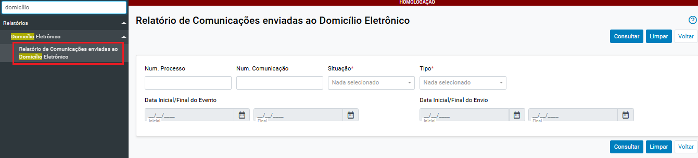

---

EXPEDIÇÃO DE DOCUMENTOS – CITAÇÕES E INTIMAÇÕES ELETRÔNICAS

**EPROC PARA SEGUNDO GRAU****–****UNIDADE JUDICIAL****|**Conteúdo integral do curso
<small>**133**</small>
A tela**“Relatório de Comunicações enviadas ao Domicílio Eletrônico”**será aberta com os

seguintes campos de filtro para a realização de pesquisa da comunicação:

▪**Num. Processo**: campo para a digitação do número do processo;

▪**Num. Comunicação**: campo para digitação do número da comunicação;

▪**Situação**: campo de preenchimento obrigatório. Clicar na seta para baixo e selecionar

entre**“Pendente”**,**“Falha”**e**“Sucesso”**;

▪**Tipo**: campo de preenchimento obrigatório. Clicar na seta para baixo e selecionar entre

**“Enviar Comunicação”**,**“Alteração Data/Prazo Ciência”**,**“Alterar Procuradores”**e

**“Ciência”**;

▪**Data Inicial/Final do Evento**: digitar nos campos a data inicial e data final do evento a

ser pesquisado. Também é possível clicar no ícone representado por um calendário

para a seleção da data;

▪**Data Inicial/Final do Envio**: digitar nos campos a data inicial e data final do envio a ser

pesquisado. Também é possível clicar no ícone representado por um calendário para

a seleção da data.

Preenchidos os campos, clicar em**“Consultar”**. O resultado será exibido no campo inferior da tela.

A coluna**“Ações”**da linha da comunicação possui o ícone**“Histórico”**, representado por um

relógio, em que será apresentado o histórico da comunicação realizada.
<small>**Descrição da imagem**: destaque ao ícone “Histórico” da coluna “Ações” e à tela “Histórico” com informações sobre a</small><small>comunicação realizada.</small>
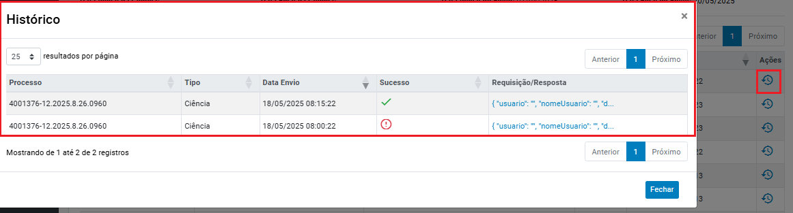

---

INTIMAÇÕES PARA O DJEN

**EPROC PARA SEGUNDO GRAU****–****UNIDADE JUDICIAL****|**Conteúdo integral do curso
<small>**134**</small>
# ▪ INTIMAÇÕES PARA O DJEN

**INTEGRAÇÃO EPROC E DJEN**

O**Diário da Justiça Eletrônico Nacional****–****DJEN**é o canal oficial nacional destinado a publicação

dos atos judiciais e sua utilização é obrigatória.

O sistema**eproc possui uma integração com o DJEN**, que garante o envio dos conteúdos para

publicação, bem como a contagem e o controle automático dos prazos processuais em aberto.

**INTIMAÇÕES PARA O DJEN**

**Conteúdo para Publicação**

O conteúdo das minutas de**Despacho, Decisão e Ato ordinatório**serão encaminhados na íntegra

para o DJEN, sem a necessidade de selecionar o texto que deve ser publicado.

No caso das minutas de**Sentença e Acórdão**será necessário definir o**dispositivo**da

sentença/acórdão. Selecionar o trecho do texto correspondente ao dispositivo e teclar “Alt” e “D”

ou “Ctrl” e “D” ou selecionar a opção “dispositivo” no campo localizado no menu superior do editor

de texto.
<small>**Descrição da imagem**: campo do menu superior do editor de texto com destaque para a opção “Dispositivo”.</small>
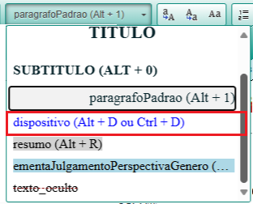

---

INTIMAÇÕES PARA O DJEN

**EPROC PARA SEGUNDO GRAU****–****UNIDADE JUDICIAL****|**Conteúdo integral do curso
<small>**135**</small>
**Lançamento do evento de intimação**

No agendamento da minuta ou através da ação “Intimar” (na capa do processo), selecionar o

evento de intimação correspondente, para que a rotina automática de publicação encaminhe o

conteúdo da minuta para o DJEN.
<small>**Descrição da imagem**: tela de agendamento da minuta com destaque para o evento de intimação.</small>
**Envio da publicação**

Após a assinatura da minuta, tem início a**rotina de publicação automática**, com:

▪ Lançamento do evento de intimação, na tabela de eventos, com a indicação que o

conteúdo está “aguardando envio” para o DJEN.
<small>**Descrição da imagem**: tabela de eventos com destaque para o evento de intimação e a informação que o conteúdo</small><small>está aguardando envio para o DJEN.</small>
**Disponibilização e publicação**

Com o término da**rotina de publicação automática**,serão lançados dois eventos:

▪ Disponibilizado no DJ Eletrônico e

▪ Publicado no DJ Eletrônico.
<small>**Descrição da imagem**: tabela de eventos com destaque para os eventos de disponibilização e publicação no DJEN.</small>
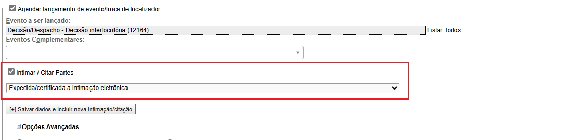

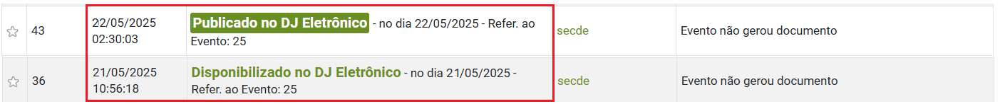

---

INTIMAÇÕES PARA O DJEN

**EPROC PARA SEGUNDO GRAU****–****UNIDADE JUDICIAL****|**Conteúdo integral do curso
<small>**136**</small>
**Prazos**

Os prazos relacionados a rotina de publicação no DJEN são os seguintes:

▪**Disponibilização**: dia útil seguinte ao envio;

▪**Publicação**: dia útil seguinte à disponibilização;

▪**Início do prazo**: dia útil seguinte à data da publicação.

**Réu revel**

Nos casos de réu revel, antes de efetuar a publicação ao DJEN, será necessário fazer uma alteração

no cadastro da parte.

Na capa do processo, aba “Parte e Representantes”, clicar em “Editar”.
<small>**Descrição da imagem**: seção “Partes e Representantes” com destaque para o botão “Editar”.</small>
Na tela Gerenciamento de Partes, selecionar “Associar Procurador”.
<small>**Descrição da imagem**: tela “Gerenciamento de Partes” com destaque para o botão “Associar Procurador”.</small>
Na tela “Gerenciamento de Procuradores de Partes”, selecionar a parte e na coluna “Ações”,

escolher a opção “**Citado e sem Procurador**”.

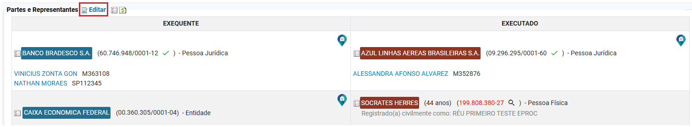

---

INTIMAÇÕES PARA O DJEN

**EPROC PARA SEGUNDO GRAU****–****UNIDADE JUDICIAL****|**Conteúdo integral do curso
<small>**137**</small><small>**Descrição da imagem**: tela “Gerenciamento de Procuradores de Partes” com destaque para a coluna Ações e para a</small><small>opção “Citado e sem Procurador”.</small>
Na sequência, clicar em OK, na caixa de diálogo com a pergunta “Confirma parte Citada sem

procurador? ”.
<small>**Descrição da imagem**: caixa de diálogo com a pergunta “Confirma parte Citada sem Procurador? ”.</small>
O sistema apresentará a caixa de diálogo com a mensagem: “Citado e sem procurador cadastrado

com sucesso”. Clicar em OK.
<small>**Descrição da imagem**: caixa de diálogo com a mensagem “Citado e sem procurador cadastrado com sucesso”.</small>
Na capa do processo, seção Partes e Representante, constará a informação “Citado e sem

procurador”.

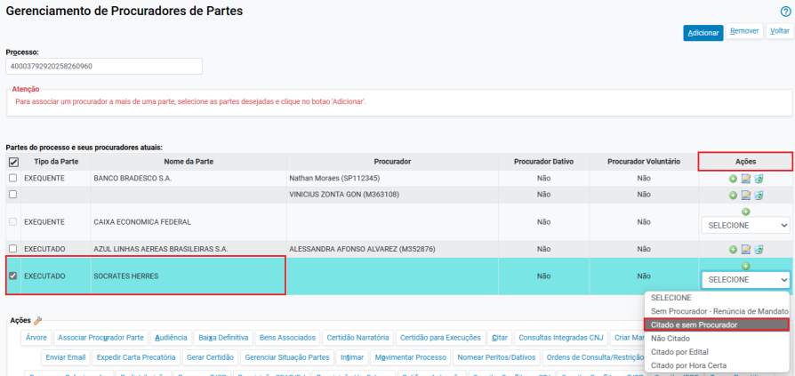

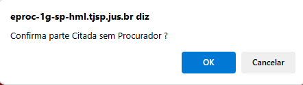

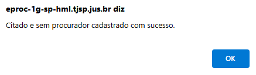

---

INTIMAÇÕES PARA O DJEN

**EPROC PARA SEGUNDO GRAU****–****UNIDADE JUDICIAL****|**Conteúdo integral do curso
<small>**138**</small><small>**Descrição da imagem**: seção “Partes e Representantes” com destaque para a informação “Citado e sem Procurador”</small><small>exibida abaixo do nome da parte.</small>
Após a configuração da parte, realizar a intimação ao DJEN, selecionando o evento

“**Expedida/certificada a intimação****–****Publicação no Diário Eletrônico**”, no agendamento da minuta

ou através da ação “Intimar”.
<small>**Descrição da imagem**: tela “Intimação Eletrônica” com destaque para o campo “Evento de citação/intimação”.</small>
**Relatório**

O eproc possui um relatório utilizado para auxiliar a Unidade no acompanhamento dos processos

enviados ao DJEN. No menu lateral do eproc, acessar a opção “**Relatório de Comunicações de**

**intimações enviadas ao DJEN**”.
<small>**Descrição da imagem**: tela “Relatório de Comunicações de intimações enviadas ao DJEN”.</small>
Preencher os campos disponibilizados (Órgão Julgador, Num. Processo, Situação, Data do

Processamento inicial e final, Data da Intimação inicial e final) conforme a pesquisa que se deseja

efetuar e clicar em “Consultar”.

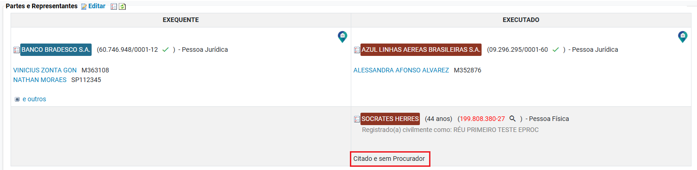

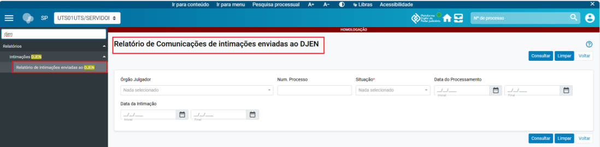

---

INTIMAÇÕES PARA O DJEN

**EPROC PARA SEGUNDO GRAU****–****UNIDADE JUDICIAL****|**Conteúdo integral do curso
<small>**139**</small><small>**Descrição da imagem**: tela “Relatório de Comunicações de intimações enviadas ao DJEN” com destaque aos campos</small><small>“Situação” e “Data do Processamento” preenchidos e ao botão consultar.</small>
O eproc disponibilizará o resultado da pesquisa de acordo com os filtros selecionados.
<small>**Descrição da imagem**: exibição do resultado da consulta.</small>
**Atenção**

Caso ocorra algum erro ou inconsistência na rotina de publicação no DJEN, o processo

receberá automaticamente o localizador “**ERRO_ENVIO_INTIMAÇÃO_DJEN**”.

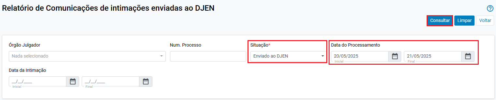

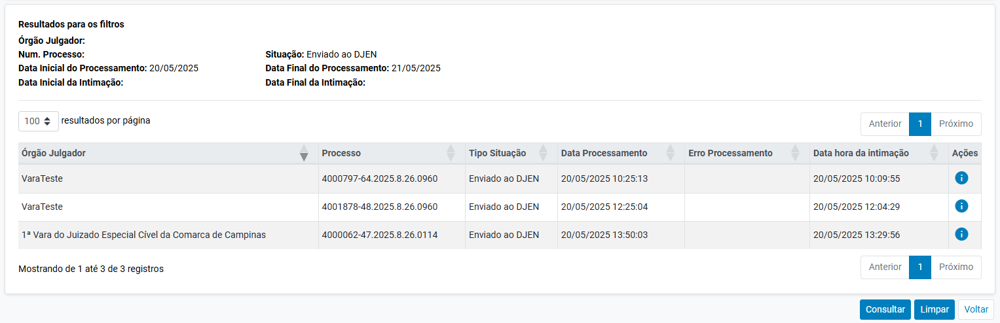

---

INTIMAÇÕES PARA O DJEN

**EPROC PARA SEGUNDO GRAU****–****UNIDADE JUDICIAL****|**Conteúdo integral do curso
<small>**140**</small>
**Consulta**

No painel do DJEN, disponível através do endereço**https: //comunica. pje. jus. br/**, é possível

efetuar a consulta das intimações da seguinte forma:

▪ Visualização do conteúdo integral dos documentos: para**documentos produzidos no**

**eproc**(despachos, decisões, sentenças, ementas de acórdão);
<small>**Descrição da imagem**: painel do DJEN com destaque ao conteúdo do documento.</small>
▪ Visualização apenas do evento a que a intimação se refere: para**documentos não**

**produzidos no eproc**(intimação de petição juntada pela parte).
<small>**Descrição da imagem**: painel do DJEN com destaque ao evento referente à intimação.</small>
**Importante**

Nos processos sigilosos, a visualização da consulta das intimações fica restrita ao

número dos autos e os nomes dos advogados. Os nomes das partes e o conteúdo das

intimações não serão visualizados na consulta.

**Painel do advogado no eproc**

O painel do advogado no sistema eproc continuará recebendo as comunicações relativas às

intimações dos processos em que atua.

Os advogados poderão consultar os processos com intimação na seção “Citações/Intimações”,

“**PROCESSOS COM PRAZO EM ABERTO**”, porém, não será possível abrir o prazo das intimações,

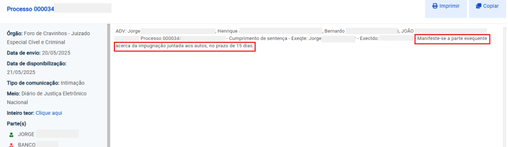

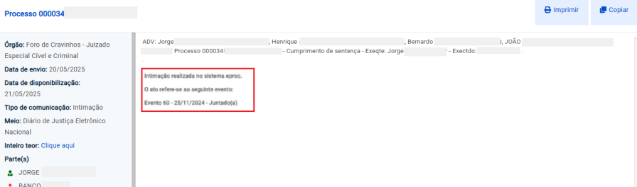

---

INTIMAÇÕES PARA O DJEN

**EPROC PARA SEGUNDO GRAU****–****UNIDADE JUDICIAL****|**Conteúdo integral do curso
<small>**141**</small>
tendo em vista que a abertura do prazo, com a implementação do DJEN, é automática (primeiro

dia útil após a publicação).

Os advogados ainda poderão renunciar a prazos, movimentar processos e peticionar

(independentemente do início de prazo ou da publicação).

**PUBLICAÇÃO DE EDITAIS NO DJEN**

Os editais também deverão ser encaminhados para publicação no DJEN.

**Criar modelo de edital**

A Unidade poderá criar um modelo-padrão de edital utilizando como base o modelo “Edital

(DJEN)”.
<small>**Descrição da imagem**: campo para seleção do tipo/modelo de minuta com destaque para a opção “Edital (DJEN)”.</small>
**Enviar edital para o DJEN**

Após a expedição e assinatura da minuta de edital, o eproc lançará o evento de “**Expedição de**

**Edital**”.
<small>**Descrição da imagem**: tabela de eventos com destaque ao evento “Expedição de Edital”.</small>
No menu lateral do eproc, acessar a área de trabalho de minutas para localizar a minuta assinada.
<small>**Descrição da imagem**: menu lateral com o campo de pesquisa preenchido com a expressão “área de” e destaque</small><small>para a opção “Área de Trabalho”.</small>
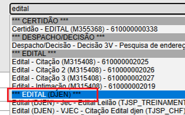

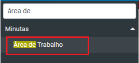

---

INTIMAÇÕES PARA O DJEN

**EPROC PARA SEGUNDO GRAU****–****UNIDADE JUDICIAL****|**Conteúdo integral do curso
<small>**142**</small>
Na tela “Minuta Área de trabalho”, inserir o número do processo e clicar em “Consultar”.
<small>**Descrição da imagem**: tela “Minuta Área de Trabalho” com destaque ao campo “Nro. Processo” e ao botão</small><small>“Consultar”.</small>
No resultado da pesquisa, selecionar a minuta do edital e na coluna “Recursos disponíveis”, clicar

no ícone “**Enviar minuta para o diário eletrônico**” (representado por uma folha de papel com uma

seta verde).
<small>**Descrição da imagem**: resultado da pesquisa com destaque ao botão “Enviar minuta para o diário eletrônico”</small><small>presente na coluna “Recursos disponíveis”</small>
Na tela “Enviar minuta para o diário eletrônico” preencher os campos “Data de disponibilização”,

“Prazo do edital” (conforme determinado pelo magistrado) e “Prazo da citação/intimação”

(constante do ato judicial que a determinou). A gestão dos localizadores pode ser feita

preenchendo os campos “Localizadores ATUAIS” e “Novo Localizador”. Clicar em “Salvar”.
<small>**Descrição da imagem**: tela “Enviar minuta para o diário eletrônico” com destaque para os campos preenchidos e</small><small>para a seção de gerenciamento de localizadores.</small>
Na tabela de eventos será disponibilizado o evento “**Ato ordinatório praticado**- Documento

encaminhado à disponibilização no Diário Eletrônico” e o documento estará disponível na coluna

“Documentos” do referido evento.

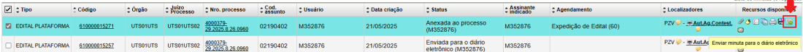

---

INTIMAÇÕES PARA O DJEN

**EPROC PARA SEGUNDO GRAU****–****UNIDADE JUDICIAL****|**Conteúdo integral do curso
<small>**143**</small><small>**Descrição da imagem**: tabela de eventos com destaque para o evento “Ato ordinatório praticado” e respectivo</small><small>documento associado.</small>
Após a disponibilização no DJEN, o eproc lançará o evento “**Disponibilizado no Diário Eletrônico****–**

**Edital**”.
<small>**Descrição da imagem**: tabela de eventos com destaque para o evento “Disponibilizado no Diário Eletrônico”.</small>
**Prazos**

Os prazos dos editais**não**são contabilizados automaticamente, portanto, por ora, as Unidades

deverão realizar esse controle no eproc.

**Localizar a publicação**

O primeiro passo para o controle dos prazos dos editais é**localizar a publicação do Edital**no site

do DJEN.

Acessar o site do DJEN através do endereço (https: //comunica. pje. jus. br/). Clicar no mapa sobre o

estado desejado e na sequência, ao lado direito do mapa, selecionar o Tribunal que se deseja

efetuar a consulta.
<small>**Descrição da imagem**: site do DJEN com destaque ao estado selecionado e tribunais exibidos para seleção.</small>
Na tela seguinte, inserir o número do processo e clicar em “Pesquisar” para localizar processo com

o Edital publicado.

---

INTIMAÇÕES PARA O DJEN

**EPROC PARA SEGUNDO GRAU****–****UNIDADE JUDICIAL****|**Conteúdo integral do curso
<small>**144**</small><small>**Descrição da imagem**: tela para localização de publicações com destaque ao campo “Nº de processo” preenchido e</small><small>ao botão “Pesquisar”.</small>
**Lançar evento no eproc**

Após a confirmação da publicação do Edital, o segundo passo é o**lançamento do evento de**

**intimação por edital**.

Acessar o eproc e consultar o processo. Na capa do processo, seção “Ações”, clicar em “Intimar”.
<small>**Descrição da imagem**: seção “Ações” com destaque à ação “Intimar”.</small>
Na tela “Intimação eletrônica”, inserir o evento de “**Intimação por Edital**” e a data final, com o

objetivo de iniciar automaticamente a contagem do prazo para resposta e a certificação do

decurso de prazo. Clicar em “Intimar”.

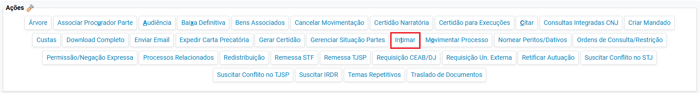

---

INTIMAÇÕES PARA O DJEN

**EPROC PARA SEGUNDO GRAU****–****UNIDADE JUDICIAL****|**Conteúdo integral do curso
<small>**145**</small><small>**Descrição da imagem**: tela Intimação Eletrônica com destaque ao campo Evento de citação/intimação e para o</small><small>campo de seleção do prazo da parte com o campo “Data final” preenchido.</small>
**Atenção**

Tendo em vista que o prazo dos editais é constituído de prazo de disponibilização e

publicação + prazo do edital + prazo de resposta, até o início efetivo da contabilização

do prazo, deve-se preferencialmente preencher o campo “**Data final**” ao invés de

inserir a quantidade de dias.

O evento “Intimação por Edital” será lançado na tabela de eventos.
<small>**Descrição da imagem**: tabela de eventos com exibição do evento “Intimação por Edital”.</small>
**Importante**

O lançamento desse evento substitui a certificação ou a juntada da publicação do

Edital.

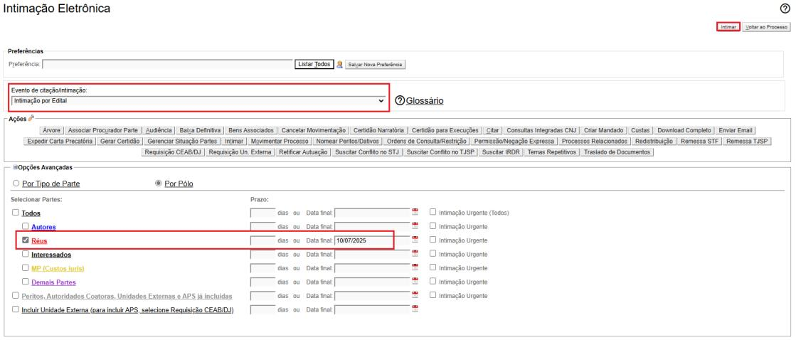

---

CRIAÇÃO E TIPOS DE PREFERÊNCIAS

**EPROC PARA SEGUNDO GRAU****–****UNIDADE JUDICIAL****|**Conteúdo integral do curso
<small>**146**</small>
# ▪ CRIAÇÃO E TIPOS DE PREFERÊNCIAS

No sistema eproc, “preferências” são ações configuradas previamente para execução repetitiva.

Como abordado nas aulas a respeito de minutas, o usuário, no momento da emissão, deve agendar

um evento, preencher campos, gerenciar localizadores e configurar classificação, assinante e

tratamento. Se a minuta em questão for usada frequentemente, é possível salvar todo o

preenchimento destes campos como uma**preferência**a fim de que a tarefa seja automatizada no

futuro.

Da mesma forma, um magistrado que gera relatórios periodicamente na intenção de verificar

quais processos estão conclusos e com determinado servidor pode, para evitar preencher os

mesmos campos todas as vezes, criar uma**preferência**e, inclusive, colocá-la na página inicial do

sistema, na seção “Relatório Geral”.

Determinadas preferências também podem virar**ações preferenciais**, como atalhos na capa do

processo. Isso será abordado mais adiante.

**TIPOS DE PREFERÊNCIAS**

Sempre que encontrarmos o botão “Salvar Nova Preferência”, significa que podemos salvar as

informações preenchidas em tela para uso futuro.
<small>**Descrição da imagem**: destaque para o botão “Salvar Nova Preferência”, exibido na tela Nova Minuta.</small>
No eproc, há várias atividades que permitem salvar preferências, mas merecem especial destaque

as preferências de**“Minutas”**,**“Movimentação”**e**“Intimação”**.

**Preferências de minutas**

Para criar uma preferência para minutas, será seguido o mesmo procedimento para a emissão

destas. Sendo assim, acessar um processo e clicar em “Nova”, na seção “Minutas”, ou em

“Minutar”, acima da**tabela de eventos**.

Neste exemplo, será simulada a criação de uma preferência de minuta de decisão.

---

CRIAÇÃO E TIPOS DE PREFERÊNCIAS

**EPROC PARA SEGUNDO GRAU****–****UNIDADE JUDICIAL****|**Conteúdo integral do curso
<small>**147**</small>
Na tela “Nova Minuta”, selecionar o “Tipo de documento/Modelo”, agendar lançamento de

evento, selecionar os campos para “Intimar Partes” (se o caso), “Gerenciar Localizadores” e

configurar “Classificação” (se o caso), inserir a “Descrição” (se o caso), “Assinante”, “Tratamento”,

“Nível de Sigilo” e “Status Destino”. Feito isso, clicar em “Salvar Nova Preferência”.
<small>**Descrição da imagem**: tela “Nova Minuta” exibindo todos os campos preenchidos e destacando o botão “Salvar</small><small>Nova Preferência”.</small>
A seção “Preferências” será aberta com os seguintes campos para preenchimento e configuração:

▪**Descrição**: é o nome que será dado a essa preferência (no exemplo, “Decisão de

Sobrestamento”);

▪**Tipo de preferência**:

**◦**

**Individual**: ao selecionar, somente o usuário que criou poderá utilizá-la;

**◦**

**Unidade**: se selecionada, todos os usuários da unidade podem utilizar a

preferência, porém somente os com perfil de gestor podem selecionar esta

opção;

▪**Grupo**: selecionar caso a preferência seja voltada para utilização por determinado

grupo, como “Grupo Gabinete”;

▪**Seleção de localizadores**: deixar selecionada a opção “Desmarcar todos”, pois o

gerenciamento de localizadores será realizado em campo próprio;

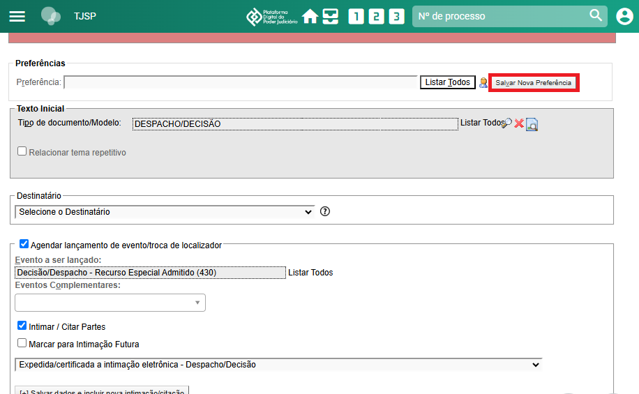

---

CRIAÇÃO E TIPOS DE PREFERÊNCIAS

**EPROC PARA SEGUNDO GRAU****–****UNIDADE JUDICIAL****|**Conteúdo integral do curso
<small>**148**</small>
▪**Opção**:

**◦**

**Marcar como padrão:**se selecionada, toda vez que o usuário for expedir uma

nova minuta, a preferência será exibida automaticamente no campo “Tipo de

documento/Modelo”. Sugerimos que a opção**não**seja selecionada;

**◦**

**Ação preferencial**: criará um atalho da preferência na página inicial do

processo;

Após preencher e selecionar todos os campos, clicar em “Salvar preferência”.
<small>**Descrição da imagem**: seção “Preferências” da tela “Nova Minuta”, destaque ao botão “Salvar preferência”.</small>
Ao salvar uma preferência, o eproc registra todos os campos preenchidos e configurados para que,

selecionada no futuro, seja feito um preenchimento automático.

Exibida mensagem de cadastro concluído, o sistema retorna à tela “Nova Minuta”. Como a página

foi utilizada apenas para a criação da preferência e não há interesse em emitir uma minuta neste

momento, clicar em “Cancelar”.

De volta à tela “Consulta Processual”, clicar no ícone “Preferências de minutas”, representado por

uma**estrela azul**e a palavra “Preferência”. Localizar a seção “Minutas” e clicar no ícone “Ações

Preferenciais”, representado por uma chave inglesa. Aberta a caixa de diálogo “Configurações”,

habilitar o item “Mostrar preferências da unidade”.
<small>**Descrição da imagem**: tela “Consulta Processual”, seção “Minuta”, com ícone “Ações preferenciais” e caixa de</small><small>diálogo “Configurações” aberta, destaque à opção “Mostrar preferências da unidade”.</small>
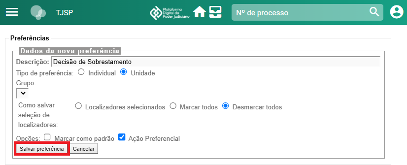

---

CRIAÇÃO E TIPOS DE PREFERÊNCIAS

**EPROC PARA SEGUNDO GRAU****–****UNIDADE JUDICIAL****|**Conteúdo integral do curso
<small>**149**</small>
Após a habilitação, observe a ação preferencial criada (“Decisão de Sobrestamento”) aparecendo

na seção “Minutas”.
<small>**Descrição da imagem**: tela “Consulta Processual” com destaque para a ação preferencial criada.</small>
**Preferência de minuta com “Descrição”**

O preenchimento do campo “Descrição” quando do cadastro de uma preferência de minuta é uma

importante ferramenta de auxílio aos magistrados e servidores encarregados da emissão de

minutas na otimização da revisão de minutas decisórias, permitindo que o magistrado, por

exemplo, ao conferir minutas pendentes de assinatura ou conferência, consiga fazê-lo por blocos

temáticos de decisões, baseados na fase processual, no tipo de peça, no teor da decisão etc.

Para tanto, é importante que o magistrado e os servidores encarregados da emissão de minutas

estabeleçam padrões de terminologias, semelhantes aos que são empregados na criação de

modelos, por exemplo. Para a geração de descrições padronizadas, organizadas e intuitivas

sugerimos:

▪ comece indicando o tipo de documento (despacho, decisão, sentença etc. );

▪ insira os complementos úteis e/ou necessários (fase processual, parte destinatária da

minuta, ato a que se refere o documento etc. );

▪ descreva o teor ou mérito da decisão (concessão, denegação, deferimento,

improcedência etc. ).

Como exemplo, no caso de uma minuta de ato ordinatório, onde é determinada a intimação das

partes para apresentarem contrarrazões ao agravo Interno, sua descrição poderia ser: “Ato

ordinatório - Agravo Interno - Intimação para Contrarrazões”.

---

CRIAÇÃO E TIPOS DE PREFERÊNCIAS

**EPROC PARA SEGUNDO GRAU****–****UNIDADE JUDICIAL****|**Conteúdo integral do curso
<small>**150**</small><small>**Descrição da imagem**: campo “Descrição” da minuta preenchido.</small>
No momento de salvar a preferência, uma boa prática é nomeá-la com o mesmo texto definido

para a descrição da minuta.
<small>**Descrição da imagem**: seção “Dados da nova preferência” com o campo “Descrição” preenchido com o mesmo</small><small>conteúdo do campo “Descrição” da minuta.</small>
**Atenção**

Os campos**“Descrição” da****preferência**e**“Descrição” da minuta**são elementos

distintos e com propósitos diferentes. O primeiro corresponde ao nome da

preferência, que será exibido, por exemplo, na seção de “Ação Preferencial” do

processo. Já o segundo possibilita o posterior agrupamento das minutas na Área de

Trabalho das minutas.

Por fim, seguindo essa orientação para todas as preferências criadas, bem como nas minutas

agendadas manualmente, elas poderão ser devidamente agrupadas pelo magistrado por ocasião

da revisão e assinatura na tela “Minutas – Área de Trabalho”.

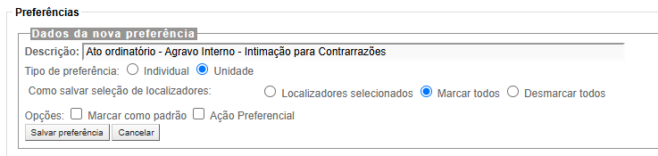

---

CRIAÇÃO E TIPOS DE PREFERÊNCIAS

**EPROC PARA SEGUNDO GRAU****–****UNIDADE JUDICIAL****|**Conteúdo integral do curso
<small>**151**</small>
**Preferências de movimentação**

As preferências para movimentações servem quando, por exemplo, se realiza uma remessa

interna ou entre a Câmara e o Gabinete.

Por padrão, é necessário clicar em “Movimentar Processo” na seção “Ações” ou no botão

“Movimentar”, acima da**tabela de eventos**. Na tela aberta, gerenciar os localizadores, lançar o

evento, especificar o magistrado e, enfim, “Salvar”.

Para não precisar repetir este procedimento, cria-se uma preferência de movimentação.

Neste exemplo, simularemos a movimentação de um processo do localizador de sistema

“DISTRIBUÍDOS” ao localizador do órgão “DCDP - revisão”.
<small>**Descrição da imagem**: tela “Detalhes do Processo”, destaque ao campo “Localizador(es)”.</small>
Para criar a preferência, acessar um processo qualquer e clicar em “Movimentar Processo”, na

seção “Ações”, ou em “Movimentar”, acima da**tabela de eventos**.

Na tela “Movimentação Processual”, gerenciar os localizadores, selecionando, se o caso, os que se

encontram no campo “Localizadores ATUAIS”. No exemplo dado, deseja-se que o localizador saia

do processo após a movimentação. Sendo assim, escolher “DISTRIBUÍDOS”.

Em seguida, no campo “Novo localizador”, selecionar aquele que será inserido no processo. É

possível selecionar mais de um clicando em “Incluir processo em outros localizadores”.

Otimiza-se mais ainda o trabalho mantendo selecionada a caixa “Manter Gerenciar Localizadores

Aberto”.

---

CRIAÇÃO E TIPOS DE PREFERÊNCIAS

**EPROC PARA SEGUNDO GRAU****–****UNIDADE JUDICIAL****|**Conteúdo integral do curso
<small>**152**</small><small>**Descrição da imagem**: tela “Movimentação Processual” com destaque aos campos “Localizadores ATUAIS” e “Novo</small><small>localizador” e à caixa de seleção “Manter Gerenciar Localizadores Aberto”.</small>
O próximo passo é selecionar “Evento a ser lançado”. No exemplo dado, o evento será “Remessa

Interna para Revisão”. Em seguida, selecionar o “Órgão” e clicar em “Salvar Nova Preferência”.
<small>**Descrição da imagem**: tela “Movimentação Processual” com destaque aos campos “Evento a ser lançado” e</small><small>“Magistrado” e ao botão “Salvar Nova Preferência”.</small>
Na seção “Preferências”, será incluído o campo “Dados da nova preferência” para preenchimento

de “Descrição” (o nome da preferência), “Tipo de Preferência”, “Como salvar a seleção de

localizadores” e “Opções”.

Feito isso, clicar em “Salvar Preferência” e em “OK”. A preferência estará criada.

---

CRIAÇÃO E TIPOS DE PREFERÊNCIAS

**EPROC PARA SEGUNDO GRAU****–****UNIDADE JUDICIAL****|**Conteúdo integral do curso
<small>**153**</small><small>**Descrição da imagem**: tela “Movimentação Processual” com destaque para a seção preferências e os campos dados</small><small>da nova preferência.</small>
De volta à tela “Consulta Processual”, clicar no ícone “Preferências de movimentação”,

representado por uma**estrela verde**e a palavra “preferência”. No campo “Movimentações”, clicar

no ícone “Ações Preferenciais”, representado por uma chave inglesa. Na caixa de diálogo

“Configurações”, habilitar o item “Mostrar preferências da unidade”.
<small>**Descrição da imagem**: tela “Consulta Processual” exibindo campo “Movimentações”, ícone “Ações preferenciais” e a</small><small>janela “Configurações” com destaque para a opção “Mostrar preferências da unidade”.</small>
A ação preferencial criada (“Conclusos Decisão Inicial”) aparecerá na seção “Movimentações”.
<small>**Descrição da imagem**: tela “Consulta Processual” com destaque para a ação preferencial criada.</small>

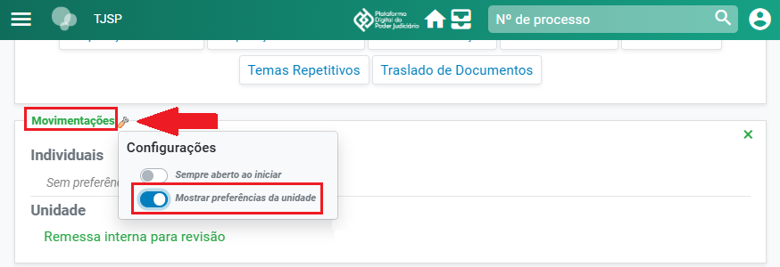

---

CRIAÇÃO E TIPOS DE PREFERÊNCIAS

**EPROC PARA SEGUNDO GRAU****–****UNIDADE JUDICIAL****|**Conteúdo integral do curso
<small>**154**</small>
**Preferências de intimação**

Assim como as vistas anteriormente, as preferências de intimações também otimizam o trabalho.

Para criar uma preferência de intimação, acessar um processo qualquer e clicar em um dos dois

botões “Intimar”: o da seção “Ações” ou o acima da tabela de eventos.
<small>**Descrição da imagem**: capa do processo, destaque aos botões “Intimar” no campo “Ações” e no menu logo abaixo.</small>
Na tela “Intimação Eletrônica”, selecionar o evento de citação ou intimação. Nesta simulação, será

escolhido “Expedida/certificada a intimação eletrônica – Contrarrazões ao(s) agravo(s)”.

O eproc abrirá o painel “Opções Avançadas” para seleção das partes.
<small>**Descrição da imagem**: tela “Intimação Eletrônica” com destaque para os campos mencionados.</small>
Em seguida, indicar o evento a que se refere a citação ou intimação. O eproc traz marcado, por

padrão, o último, mas pode ser necessário alterá-lo.

Em seguida, gerenciar os localizadores. Neste exemplo, será configurada a inclusão do localizador

“Agravo interno – prazo aberto” no processo. Em seguida, confirmar os campos referentes ao

autor e ao réu e clicar em “Salvar Nova Preferência”.

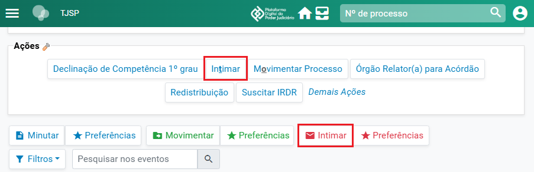

---

CRIAÇÃO E TIPOS DE PREFERÊNCIAS

**EPROC PARA SEGUNDO GRAU****–****UNIDADE JUDICIAL****|**Conteúdo integral do curso
<small>**155**</small><small>**Descrição da imagem**: tela “Intimação Eletrônica” com destaque para o botão “Salvar Nova Preferência”.</small>
No campo “Dados” da nova preferência, especificar descrição (neste exemplo, “Intimação para

contrarrazões - Agravo”), tipo de preferência e localizadores e definir se será uma ação

preferencial ou não. Em seguida, “Salvar preferência”.
<small>**Descrição da imagem**: tela “Intimação Eletrônica” com destaque para o campo dados da nova preferência e botão</small><small>“Salvar preferência”.</small>
De volta à capa do processo, clicar no ícone “Preferências de intimação”, representado por uma

**estrela vermelha**e a palavra “preferência”. No campo “Intimações”, acionar o botão “Ações

Preferenciais”, representado por uma chave inglesa. Na caixa de diálogo “Configurações”, habilitar

o item “Mostrar preferências da unidade”.
<small>**Descrição da imagem**: tela “Consulta Processual” exibindo campo “Intimações”, ícone “Ações preferenciais” e caixa</small><small>de diálogo “Configurações” com destaque para opção “Mostrar preferências da unidade”.</small>
A ação preferencial criada (“Intimação Audiência Conciliação”) aparecerá na seção “Intimações”.

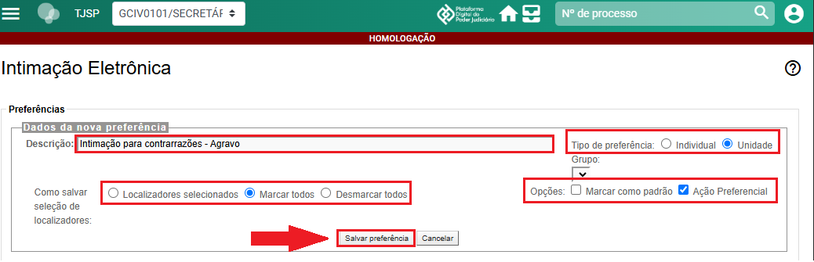

---

CRIAÇÃO E TIPOS DE PREFERÊNCIAS

**EPROC PARA SEGUNDO GRAU****–****UNIDADE JUDICIAL****|**Conteúdo integral do curso
<small>**156**</small><small>**Descrição da imagem**: tela “Consulta Processual” com destaque para a ação preferencial criada.</small>
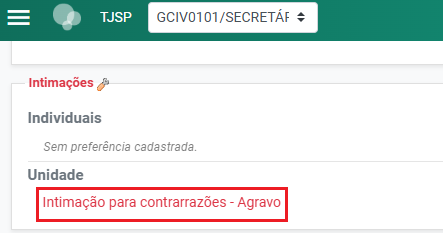

---

PREFERÊNCIAS DE MINUTAS

**EPROC PARA SEGUNDO GRAU****–****UNIDADE JUDICIAL****|**Conteúdo integral do curso
<small>**157**</small>
# ▪ PREFERÊNCIAS DE MINUTAS

Há duas formas de utilizar a preferência criada.

Se ela não foi salva como ação preferencial, o usuário deve acessar o processo no qual será

expedida a minuta e clicar em “Nova”, na seção “Minutas”, ou em “Minutar”, acima da**tabela de**

**eventos**.

Na seção “Preferências” da página “Nova Minuta”, clicar em “Listar Todos”, localizar a preferência

criada e selecioná-la para que o eproc preencha os campos automaticamente.
<small>**Descrição da imagem**: tela “Consulta Processual”, destaque para o botão “Listar Todos” da seção “Preferências”.</small>
Em seguida, clicar em “Salvar e Editar” para abrir o editor de texto. Finalizada a edição, configurar

qual status o documento deverá exibir após ser salvo (“Encaminhar a minuta para rascunho”,

“Encaminhar a minuta para assinatura” etc. ) e clicar no ícone “Salvar minuta e Sair”. A minuta será

exibida na seção “Minutas” com o status definido (rascunho, para assinar etc. ).
<small>**Descrição da imagem**: seção “Minutas” na capa do processo, destaque a minuta expedida com status “Para assinar”.</small>
Se a preferência foi salva como ação preferencial, basta clicar no botão “Preferências” ao lado do

botão Minutar e selecioná-la na seção “Minutas”.

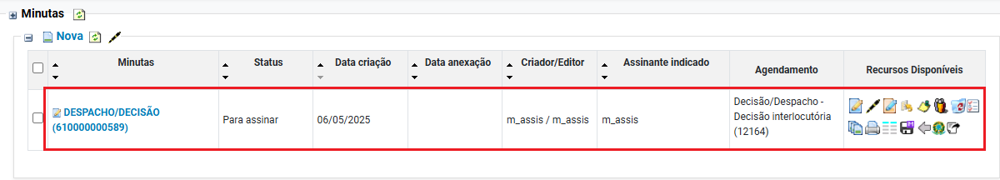

---

PREFERÊNCIAS DE MINUTAS

**EPROC PARA SEGUNDO GRAU****–****UNIDADE JUDICIAL****|**Conteúdo integral do curso
<small>**158**</small><small>**Descrição da imagem**: tela “Consulta Processual” com destaque para a ação preferencial criada e para o botão</small><small>“Preferências” de Minutas.</small>
O sistema exibirá a tela “Nova Minuta” já preenchida e o usuário só deve clicar em “Salvar e Editar”

para prosseguir com a edição do documento e os passos listados anteriormente.

**ALTERAÇÃO DAS PREFERÊNCIAS DE MINUTAS**

O sistema eproc permite, em relação às preferências já criadas, alterar:

▪ os dados cadastrais;

▪ o preenchimento dos campos.

**Alteração dos dados cadastrais**

Para alterar os**dados cadastrais**, acessar, em um processo qualquer, a tela “Nova Minuta” por

meio do botão “Minutar” ou clicar em “Nova”, dentro da seção “Minutas”. Com a abertura da tela,

localizar a preferência clicando em “Listas Todos”, dentro da seção “Preferências”.

Encontrada e selecionada a preferência, clicar no ícone “Editar Preferências”, representado pelo

desenho de um boneco e localizado à direita do botão “Listar Todos”.

---

PREFERÊNCIAS DE MINUTAS

**EPROC PARA SEGUNDO GRAU****–****UNIDADE JUDICIAL****|**Conteúdo integral do curso
<small>**159**</small><small>**Descrição da imagem**: tela “Consulta Processual” com destaque para a seção “Preferências”.</small>
Será exibida a tela “Preferências” listando todas as já criadas pelo usuário e aquelas às quais ele

tem acesso. Selecionar a que será alterada e clicar no ícone “Alterar preferência”, representado

por um lápis.
<small>**Descrição da imagem**: tela “Preferências” com destaque para o ícone “Alterar preferência” na coluna “Ações”.</small>
Aberta a tela “Descrição da Pesquisa Preferencial”, os dados cadastrais poderão ser alterados.

Feitas as alterações, clicar em “Salvar”. O eproc exibirá mensagem confirmando a operação.

Ainda na página “Preferências” é possível desativar aquela desejada. O ícone é representado por

uma lixeira e está logo abaixo do botão “Alterar preferência”. Esta ação também pode ser realizada

em lote, selecionando-se vários itens e acionando “Desativar Todos Selecionados”. Se desativada,

a preferência sairá da relação do usuário e de todos da unidade, conforme a configuração

(“Individual” ou “Unidade”).

---

PREFERÊNCIAS DE MINUTAS

**EPROC PARA SEGUNDO GRAU****–****UNIDADE JUDICIAL****|**Conteúdo integral do curso
<small>**160**</small><small>**Descrição da imagem**: tela “Preferências” com destaque para o ícone “Desativar preferência” na coluna “Ações” e</small><small>para o botão “Desativar Todos Selecionados” na parte superior da tela.</small>
**Alteração dos campos da preferência**

Para alterar os**campos preenchidos**da preferência, clicar em “Atualizar preferência”, localizado

entre as opções do primeiro campo da seção “Preferências”.
<small>**Descrição da imagem**: tela “Nova Minuta” com destaque para botão “Atualizar preferência”.</small>
O “formulário” será aberto para que sejam realizadas as alterações necessárias. Após, acionar o

botão “Salvar preferência”, localizado na seção “Preferências” da tela “Nova Minuta”.
<small>**Descrição da imagem**: tela “Nova Minuta”, destaque ao botão “Salvar preferência” na seção “Preferências”.</small>
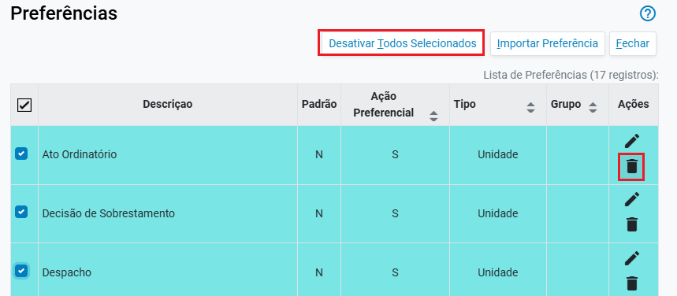

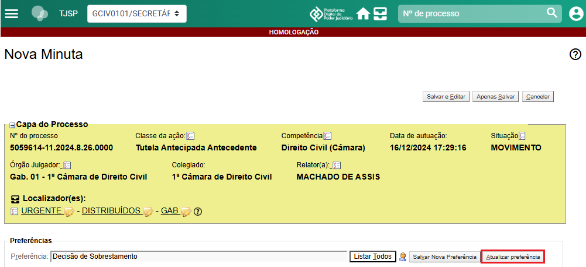

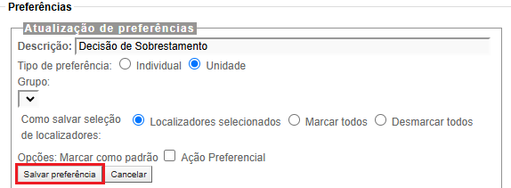

---

PREFERÊNCIAS DE MINUTAS

**EPROC PARA SEGUNDO GRAU****–****UNIDADE JUDICIAL****|**Conteúdo integral do curso
<small>**161**</small>
**Atenção**

Alterações/atualizações das preferências do tipo**“Unidade”**só podem ser realizadas

por servidores que possuam perfil específico para criá-las. Caso contrário, eles

conseguirão alterar somente as preferências do tipo**“I****ndividua****l”**.

**Importação das preferências de minutas**

Mesmo que uma preferência seja criada como “Individual” por um usuário, é possível importá-la

para toda a unidade deste servidor desde que o responsável pela importação também seja da

mesma lotação.

Para isso, acessar um processo qualquer e selecionar a opção “Nova”, na seção “Minutas”, ou clicar

em “Minutar”, acima da**tabela de eventos**. Clicar sobre o ícone “Editar Preferências” da tela “Nova

Minuta” e em “Importar Preferências” da próxima tela, “Preferências”.
<small>**Descrição da imagem**: tela “Preferências”, destaque ao botão “Importar Preferência”.</small>
Será aberta a página “Nova Minuta – Importar Preferências”. Nela, informar a preferência e o

usuário que a criou, uma nova descrição (se o caso), definir como ação preferencial (se o caso) e

escolher o tipo de preferência. Preenchidos todos os campos, “Salvar”.
<small>**Descrição da imagem**: tela “Nova Minuta - Importar Preferências” com destaque para os campos existentes e para o</small><small>botão “Salvar”.</small>

---

PREFERÊNCIAS DE MINUTAS

**EPROC PARA SEGUNDO GRAU****–****UNIDADE JUDICIAL****|**Conteúdo integral do curso
<small>**162**</small>
Em seguida, confirmar a importação da preferência clicando em “OK”. A preferência importada

aparecerá na relação de preferências do usuário.
<small>**Descrição da imagem**: tela “Preferências” com destaque para a preferência importada.</small>
Como visto, as preferências otimizam muito o trabalho e preenchem formulários inteiros com

apenas um clique.

Para finalizar, é importante entender que ações preferenciais**não são automações**, pois não

geram eventos e nem minutas.

---

PREFERÊNCIAS E AÇÕES PREFERENCIAIS

**EPROC PARA SEGUNDO GRAU****–****UNIDADE JUDICIAL****|**Conteúdo integral do curso
<small>**163**</small>
# ▪ PREFERÊNCIAS E AÇÕES PREFERENCIAIS

Conforme abordamos anteriormente, as preferências possibilitam que o sistema preencha

automaticamente os campos configurados no momento de sua criação, agilizando a realização de

atividades que são utilizadas com frequência.

Alguns exemplos de atividades para as quais podemos criar preferências são:

▪ minutas;

▪ movimentação;

▪ intimação;

▪ relatório geral de processos;

▪ lista de processos por localizador; e

▪ área de trabalho de minutas.

Dependendo da tela preenchida, essa preferência pode ser salva como uma “**Ação Preferencial**”,

de forma a se transformar num botão ou link, na capa do processo. Para isso, basta que, no

momento do salvamento da preferência, seja marcado o campo “Ação Preferencial”.
<small>**Descrição da imagem**: seção “Preferências”, destaque ao botão “Salvar preferência” e à opção “Ação Preferencial”</small><small>marcada.</small>
Embora as preferências possam ser criadas para diversas atividades, as “Ações Preferenciais”

somente poderão ser criadas para as atividades**“Minutar”****,****“Movimentar”**e**“Intimar”**.

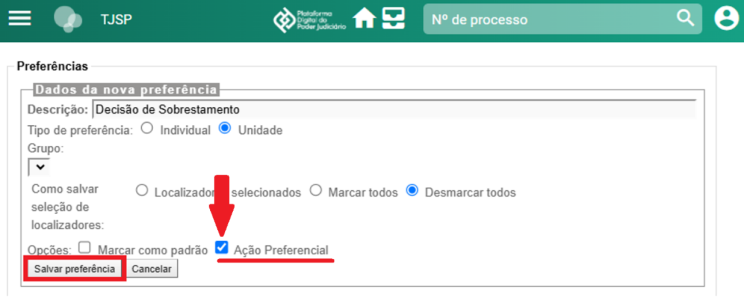

---

PREFERÊNCIAS E AÇÕES PREFERENCIAIS

**EPROC PARA SEGUNDO GRAU****–****UNIDADE JUDICIAL****|**Conteúdo integral do curso
<small>**164**</small>
**VISUALIZAÇÃO DAS PREFERÊNCIAS CRIADAS**

As preferências poderão ser visualizadas e selecionadas após acessar as telas da atividade para a

qual foram criadas.

Por exemplo, ao acessar a tela “Nova Minuta” (clicando em “Nova”, na seção “Minutas”, ou em

“Minutar”, acima da**tabela de eventos**), logo abaixo da capa do processo encontra-se a seção

Preferências.
<small>**Descrição da imagem**: tela “Nova Minuta”, com destaque para a seção “Preferências”, localizada abaixo da capa do</small><small>processo.</small>
O usuário pode então clicar no botão “Listar Todos”, para exibir todas as preferências de minutas

existentes, ou ainda digitar parte do nome da preferência desejada no campo de pesquisa.

Ao clicar sobre uma das preferências listadas, todos os campos da página serão automaticamente

preenchidos conforme as configurações anteriormente efetuadas.
<small>**Descrição da imagem**: campo “Preferências” preenchido com a expressão “dec” e exibição das opções que a</small><small>contêm. Destaque para o botão “Listar Todos”.</small>
Em relação às preferências criadas com a opção “Ação Preferencial”, elas também poderão ser

visualizadas pelo método acima indicado. Além disso, serão exibidas na consulta processual, ao

acessar a opção “Preferências” de cada grupo (Minutar, Movimentar ou Intimar), localizada abaixo

da seção “Ações”.

---

PREFERÊNCIAS E AÇÕES PREFERENCIAIS

**EPROC PARA SEGUNDO GRAU****–****UNIDADE JUDICIAL****|**Conteúdo integral do curso
<small>**165**</small><small>**Descrição da imagem**: destaque para os botões “Preferências” dos grupos Minutar, Movimentar e Intimar.</small>
**Importante**

As ações preferenciais criadas são exibidas na tela “Consulta Processual” para**todos**

os processos consultados.

Após clicar sobre um dos botões de Preferências, as ações preferenciais do respectivo grupo serão

apresentadas na tela para seleção.
<small>**Descrição da imagem**: exibição das “Ações Preferenciais” de Minutas.</small>
**AÇÕES PREFERENCIAIS POR LOCALIZADOR**

O sistema eproc permite vincular ações preferenciais a localizadores específicos. Deste modo, elas

ficam ocultas nos processos que não estejam em determinado localizador.

**Criação das ações preferenciais por localizador**

Buscar e acessar a página “Ações Preferenciais por Localizador” pelo**menu lateral**.
<small>**Descrição da imagem**: tela inicial do sistema com destaque à busca por página no menu lateral.</small>
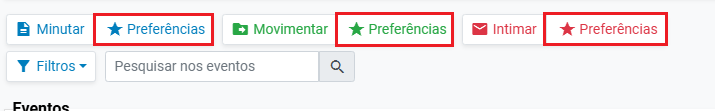

---

PREFERÊNCIAS E AÇÕES PREFERENCIAIS

**EPROC PARA SEGUNDO GRAU****–****UNIDADE JUDICIAL****|**Conteúdo integral do curso
<small>**166**</small>
Na tela “Ações Preferenciais por Localizador do Órgão”, é possível configurar a visualização de

“Ações Preferenciais por Localizador” ou “Localizadores por Ação Preferencial”.
<small>**Descrição da imagem**: tela “Ações Preferenciais por Localizador do Órgão”.</small>
Clicar em “Novo”. Na tela aberta, “Novo vínculo entre localizadores e ações preferenciais”,

selecionar a ação preferencial desejada e, em seguida, selecionar os localizadores nos quais ela

deverá estar disponível. Em seguida, “Salvar”.
<small>**Descrição da imagem**: tela “Novo vínculo entre localizadores e ações preferenciais” com destaque aos itens citados.</small>
O eproc exibirá mensagem de confirmação da vinculação.

De volta à tela “Ações Preferenciais por Localizador do Órgão”, os localizadores selecionados serão

listados com as ações preferenciais indicadas.

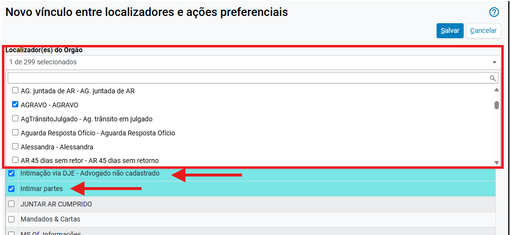

---

PREFERÊNCIAS E AÇÕES PREFERENCIAIS

**EPROC PARA SEGUNDO GRAU****–****UNIDADE JUDICIAL****|**Conteúdo integral do curso
<small>**167**</small><small>**Descrição da imagem**: tabela da tela “Ações Preferenciais por Localizador do Órgão”, destaque ao item citado.</small>
A partir de agora, aquelas ações preferenciais estarão visíveis apenas na capa dos processos que

possuem ao menos um dos localizadores para os quais foram configurados, não “poluindo” os

demais.

Como exemplo, o processo exibido na imagem abaixo contém os localizadores “DECURSO DE

PRAZO” e “DESPACHOS”. Logo, as ações preferenciais cadastradas para o localizador “AGRAVO”

não estarão disponíveis na capa do processo.
<small>**Descrição da imagem**: capa de processo com destaque aos seus localizadores e ações preferenciais.</small>
Ao adicionarmos o localizador “AGRAVO” a este mesmo processo, as ações preferenciais

cadastradas tornam-se disponíveis.

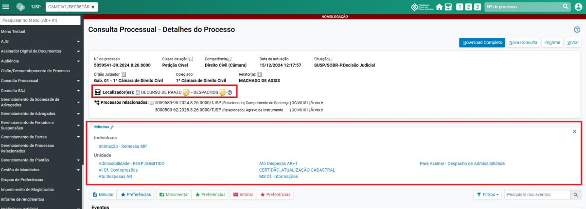

---

PREFERÊNCIAS E AÇÕES PREFERENCIAIS

**EPROC PARA SEGUNDO GRAU****–****UNIDADE JUDICIAL****|**Conteúdo integral do curso
<small>**168**</small><small>**Descrição da imagem**: capa de processo com destaque à ação “Conclusos Decisão Inicial” listada.</small>
**Alteração das ações preferenciais por localizador**

Para alterar uma vinculação, buscar e acessar a página “Ações Preferenciais por Localizador” pelo

**menu lateral**. Nela, selecionar a ação preferencial desejada e clicar no ícone “Alterar”,

representado por uma sulfite e um lápis, na coluna “Ações” da tela aberta.
<small>**Descrição da imagem**: tela “Ações Preferenciais por Localizador do Órgão” com destaque para o ícone “Alterar”.</small>
A tela para alteração será exibida para as inclusões e exclusões necessárias. Em seguida, clicar em

“Salvar”.

Para desativar uma vinculação, clicar no ícone “Desativar”, representado pelo desenho uma lixeira,

na coluna “Ações”.

---

PREFERÊNCIAS E AÇÕES PREFERENCIAIS

**EPROC PARA SEGUNDO GRAU****–****UNIDADE JUDICIAL****|**Conteúdo integral do curso
<small>**169**</small><small>**Descrição da imagem**: tela “Ações Preferenciais por Localizador do Órgão” com destaque para o ícone “Desativar”.</small>

---

SIGILO

**EPROC PARA SEGUNDO GRAU****–****UNIDADE JUDICIAL****|**Conteúdo integral do curso
<small>**170**</small>
# ▪ SIGILO

No sistema eproc há níveis de sigilo, de zero a cinco, que se aplicam a processos e documentos.

**Importante**

O nível de sigilo de um processo será aplicado a todos os seus documentos, mas níveis

de sigilo de documentos específicos, como decisões que requerem sigilo, não serão

necessariamente aplicados a todo o processo.

Eles ajudam a garantir a segurança e confidencialidade das informações, sendo ajustados por

quem possui perfil de gestor no órgão onde tramita o processo, além de pelo respectivo

magistrado.

Processos relacionados com níveis de sigilo diferentes obedecem, cada um, a seu respectivo nível.

O usuário habilitado para consultar um processo com nível zero não terá acesso a um com nível

dois, por exemplo, mesmo ambos estando relacionados.

É importante salientar que o nível de sigilo não se comunica entre instâncias diferentes. Ou seja,

caso seja atribuído um nível de sigilo ao processo no segundo grau, tal atribuição não afetará o

nível de sigilo do processo no primeiro grau.

**Importante**

Verificada a necessidade de atribuição de um sigilo maior ao processo, recomenda-

se entrar em contato com a vara de origem para que o sigilo seja alterado também

na primeira instância.

**NÍVEIS DE SIGILO**

Cada perfil possui um nível de sigilo máximo, até o qual ele conseguirá consultar informações:

▪ Magistrado: nível 5

▪ Gestores de Unidade: nível 4

▪ Servidores: nível 3

---

SIGILO

**EPROC PARA SEGUNDO GRAU****–****UNIDADE JUDICIAL****|**Conteúdo integral do curso
<small>**171**</small>
▪ Estagiários: nível 1

▪ Advogados: nível 1

▪ Assistentes (dos advogados): nível 0

▪ Polícia Civil: nível 2 (exceto para processos criados por eles – até nível 5)

▪ Ministério Público: nível 2 (exceto para processos criados por eles – até nível 5)

Para cada nível de sigilo, a disponibilização das informações do processo pelo eproc é diferente.

**Nível 0 (sem sigilo)**

▪**Usuários internos do eproc**: acesso a todas as informações e documentos do processo.

▪**Usuários externos vinculados ao processo**: acesso a todas as informações e todos os

documentos do processo.

▪**Usuários externos não vinculados ao processo, mas identificados no portal**

**(advogados, procuradores, defensores e membros do Ministério Público)**:acesso a

todas as informações do processo. Para ter acesso a todos os documentos, é

**obrigatório demonstrar interesse**e o sistema registra o acesso de acordo com a

Resolução nº 121/2010, art. 3º, § 11º - CNJ.

▪**Consulta pública no eproc**: acesso a todas as informações processuais e visualização

apenas dos documentos decisórios (acórdãos, sentenças, decisões e despachos).

**Nível 1 (segredo de justiça)**

▪**Usuários internos do eproc**: acesso a todas as informações e documentos do processo.

▪**Usuários externos vinculados ao processo**: acesso a todas as informações e todos os

documentos do processo, exceto assistentes de advogados e assistentes de

procuradores.

▪**Usuários externos identificados no portal e não vinculados ao processo**: acesso aos

detalhes do processo, incluindo número, classe, competência, data de autuação,

situação, vara, assuntos e juiz. Procuradores que não fazem parte do processo podem

peticionar e interpor recursos, mas não têm acesso aos documentos do processo.

▪**Consulta pública no eproc**: as informações são omitidas. Se a consulta for realizada

com a chave, o sistema exibe a íntegra do processo.

---

SIGILO

**EPROC PARA SEGUNDO GRAU****–****UNIDADE JUDICIAL****|**Conteúdo integral do curso
<small>**172**</small>
**Nível 2 (sigilo interno 2)**

Visualização somente pelos usuários internos e órgãos públicos (entidades). O sigilo nível 2, em

geral, é aplicado a pedidos cautelares preparatórios que não requerem sigilo absoluto devido ao

caso específico. Ele pode ser atribuído a minutas de processos sem sigilo, como decisões que

deferem o pedido de bloqueio de ativos financeiros. O sigilo deverá ser removido assim que a

ordem for cumprida.

▪**Usuários internos do eproc**: acesso a todas as informações e documentos do processo.

O perfil de**estagiário não tem acesso**.

▪**Usuários externos vinculados ao processo**: entidades como a Polícia e o Ministério

Público têm acesso a todas as informações e documentos do processo. Advogados

vinculados têm acesso e conseguem peticionar apenas com permissão expressa

concedida pelo magistrado.

▪**Usuários externos identificados no portal e não vinculados ao processo**: o sistema

exibe a mensagem "**Processo sigiloso**" e não permite acesso ao processo. Advogados

não vinculados têm acesso e conseguem peticionar apenas com permissão expressa

concedida pelo magistrado.

▪**Consulta pública no eproc**: o sistema exibe a mensagem "**Processo sigiloso**" e não

permite acesso ao processo.

**Nível 3 (sigilo interno 3)**

Visualização somente pelos usuários internos do juízo em que tramita o processo. Sugere-se sua

atribuição a documentos em que há necessidade de proteger informações pessoais ou imagens e

mídias cuja divulgação em consulta pública pode constranger as partes envolvidas.

Caso o processo esteja sob sigilo nível 2, deve-se avaliar a necessidade de proteção do documento.

▪**Usuários internos do eproc**: acesso apenas às informações e documentos dos

processos que tramitam na unidade judicial à qual estão vinculados. O perfil de

**estagiário não tem acesso**.

▪**Usuários externos identificados no portal, vinculados ou não ao processo**: o sistema

exibe a mensagem "**Processo sigiloso**" e não permite acesso ao processo. Advogados,

Polícia e o Ministério Público têm acesso apenas com permissão expressa concedida

pelo magistrado.

▪**Consulta pública no eproc**: o sistema exibe a mensagem "**Processo sigiloso**" e não

permite acesso ao processo.

---

SIGILO

**EPROC PARA SEGUNDO GRAU****–****UNIDADE JUDICIAL****|**Conteúdo integral do curso
<small>**173**</small>
**Nível 4 (sigilo interno 4)**

Assim como o sigilo interno 3, sugere-se a sua atribuição a documentos cuja divulgação possa

trazer constrangimento às partes envolvidas. Este é o nível máximo que o gestor da unidade

consegue atribuir ao processo.

A diferença entre o sigilo interno 3 e o 4 é que somente os perfis de Magistrado e Gestor de

Unidade atuantes na unidade têm acesso aos documentos deste.

▪**Usuários internos do eproc**: Magistrado do processo e Gestor de Unidade atuantes no

Juízo ou Gabinete onde tramita o processo têm acesso a todas as informações e

documentos dos processos que tramitam na unidade judicial à qual estão vinculados.

▪**Usuários externos identificados no portal, vinculados ou não ao processo**: o sistema

exibe a mensagem "**Processo sigiloso**" e não permite acesso ao processo. Advogados,

a Polícia e o Ministério Público têm acesso apenas com permissão expressa concedida

pelo magistrado.

▪**Consulta pública no eproc**: o sistema exibe a mensagem "**Processo sigiloso**" e não

permite acesso ao processo ou documento.

**Nível 5 (sigilo interno 5)**

Visualização somente pelo magistrado ou a quem ele atribuir. Por ser o mais rigoroso, deve ser

utilizado apenas em casos excepcionais de procedimentos cautelares preparatórios, como quebras

de sigilo. Ele não deve ser aplicado a um processo principal, como um inquérito, e seu uso

inadequado pode impedir a manifestação do Ministério Público, do magistrado plantonista e de

agentes essenciais para a celeridade do cumprimento dos atos judiciais.

▪**Usuário internos do eproc**: apenas o juiz do processo tem acesso aos dados e

documentos do processo (Magistrado atuante no Juízo ou Gabinete onde ele tramita).

O Gestor de Unidade visualiza a relação de processos de nível 5 atribuídos aos

Magistrados da sua unidade, mas não tem acesso aos autos. Os demais usuários

internos têm acesso apenas com permissão expressa do proponente (Delegado,

Promotor ou Magistrado).

▪**Usuários externos identificados no portal, vinculados ou não ao processo**: o sistema

exibe a mensagem "**Processo não encontrado**" e não permite acesso ao processo.

Advogados, Polícia e o Ministério Público têm acesso apenas com permissão expressa

do proponente (Delegado, Promotor ou do Magistrado).

---

SIGILO

**EPROC PARA SEGUNDO GRAU****–****UNIDADE JUDICIAL****|**Conteúdo integral do curso
<small>**174**</small>
▪**Consulta pública no eproc**: o sistema exibe a mensagem "**Processo não encontrado**"

e não permite acesso ao processo.

▪ O Delegado ou Promotor que propôs a medida tem acesso imediato aos dados e

documentos.

**Importante**

Os perfis de Procurador, Analista, Delegado ou Escrivão no eproc podem escolher

entre os níveis de sigilo 0, 1, 2 ou 5 para o processo no momento do peticionamento.

Atribuído um nível superior a 2, o peticionante recebe automaticamente “permissão

expressa” e nível equivalente para acessar o processo.

**ALTERAÇÃO DE SIGILO DO PROCESSO**

Para alterar o nível de sigilo do processo, clicar em “Editar”, dentro da seção “Informações

Adicionais” da capa do processo.
<small>**Descrição da imagem**: seção “Informações Adicionais” e ícone “Editar”.</small>
Exibida a tela “Alteração das Informações Adicionais”, no campo “Nível de Sigilo do Processo”,

selecionar o sigilo que se quer atribuir ao processo (neste exemplo, nível 2) e “Salvar”.

Na seção “Informações Adicionais” é possível visualizar o novo nível de sigilo do processo.
<small>**Descrição da imagem**: seção “Informações Adicionais” com destaque para nível de sigilo do processo.</small>
Após o salvamento, o sistema exibirá uma tarja, na capa do processo, com o nível do sigilo.

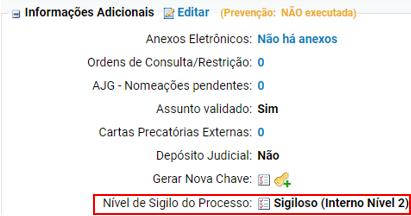

---

SIGILO

**EPROC PARA SEGUNDO GRAU****–****UNIDADE JUDICIAL****|**Conteúdo integral do curso
<small>**175**</small>
**ALTERAÇÃO DE SIGILO DO DOCUMENTO**

Para alterar o sigilo do documento, localizá-lo na tabela de eventos e acionar o ícone “Editar Tipo

de Documento e Sigilo”, na coluna “Documentos”.
<small>**Descrição da imagem**: tabela de eventos com destaque para o ícone “Editar Tipo de Documento e Sigilo”.</small>
A tela “Alteração Tipo Documento e Sigilo” é exibida para preenchimento do campo “Sigilo

Documento”. Feita a alteração, clicar em “Salvar”.

Ao passar o mouse sobre o documento, o eproc abre uma caixa de diálogo com informações sobre

ele, inclusive o nível de sigilo.
<small>**Descrição da imagem**: tabela de eventos com destaque para as informações do documento cujo sigilo foi alterado.</small>
**PERMISSÃO EXPRESSA**

É a ação que concede a um usuário o acesso ao processo ou ao documento com um nível de sigilo

maior do que o do seu perfil.

**Para acessar o processo**

Para conceder a permissão expressa, buscar e acessar a página “Permissões no Processo” pelo

menu lateral.

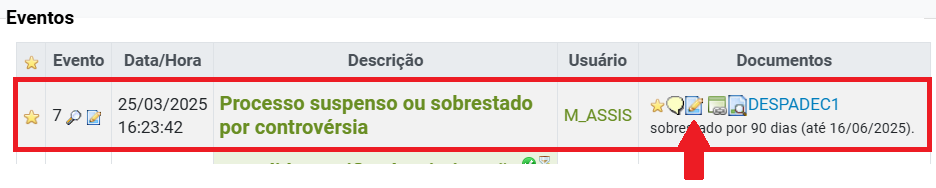

---

SIGILO

**EPROC PARA SEGUNDO GRAU****–****UNIDADE JUDICIAL****|**Conteúdo integral do curso
<small>**176**</small>
A tela “Consulta Processual – Permissão/Negação Expressa Processo” será exibida e o usuário deve

inserir o número do processo e clicar em “Consultar”. Na próxima tela, “Cadastro de Permissões”,

o eproc exibe as seguintes informações:

▪ aviso de que a permissão ou negação em um processo propagará para os eventos,

documentos e partes dele;

▪ aviso de que as permissões serão efetivadas somente ao clicar no botão “Salvar”;

▪ aviso sobre a possibilidade de buscar um usuário individualmente ou um grupo.

Selecionar o**tipo de permissão**(“Permitir” ou “Negar”), o**nível do sigilo**(o sistema traz preenchido

o nível de sigilo atual), a**data de validade**, se o caso, e a**busca individual**(“Sigla” ou “Nome”).

Lembrando que é necessário que a pessoa esteja cadastrada no eproc.
<small>**Descrição da imagem**: tela cadastro de permissões com destaque para a seção cadastro e seus campos.</small>
Localizado o usuário, clicar em “Incluir” e, em seguida, “Salvar”. Ainda nessa tela, o sistema

apresentará todas as informações sobre a ação realizada.
<small>**Descrição da imagem**: tela “Cadastro de Permissões” com destaque para a seção “Permissões/Negações Ativas”.</small>
Também é possível editar o sigilo pelos ícones “Alterar Permissão” e “Desativar Permissão”, ambos

na coluna “Ações” da seção “Permissões/Negações Ativas”.

**Para acessar o documento**

Para casos em que a pessoa terá acesso somente a um documento, não ao processo todo, buscar

e acessar a página “Permissões Expressas” pelo**menu lateral**. Em seguida, selecionar “Permissões

no Documento”.

A tela “**Permissão Expressa de Documentos”**será exibida e o usuário deve selecionar o

documento e clicar em “**Permitir****” ou “****Negar****”**.

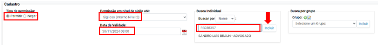

---

SIGILO

**EPROC PARA SEGUNDO GRAU****–****UNIDADE JUDICIAL****|**Conteúdo integral do curso
<small>**177**</small>
Na próxima tela, “**Cadastro de Permissões****”**, proceder exatamente como foi feito no caso de

permissão para processos: selecionar o**tipo de permissão**(“Permitir” ou “Negar”), o**nível do sigilo**

(o sistema traz preenchido o nível de sigilo atual) e a**busca individual**(“Sigla” ou “Nome”).

Observe que, quando se trata de permissão para acesso a documentos, não há o campo para

especificar prazo de validade. Clicar em “Incluir” e “Salvar” e a ação aparecerá com permissão

expressa de um usuário para um documento específico.
<small>**Descrição da imagem**: tela “Cadastro de Permissões” exibindo permissão expressa para um documento selecionado.</small>
De volta à tela “Permissão Expressa de Documentos”, o eproc apresenta informações sobre o

documento ao qual foi concedida permissão para acesso.
<small>**Descrição da imagem**: tela “Permissão Expressa de Documentos”.</small>
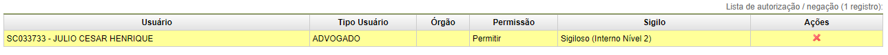

---

PRINCIPAIS AÇÕES NO PROCESSO

**EPROC PARA SEGUNDO GRAU****–****UNIDADE JUDICIAL****|**Conteúdo integral do curso
<small>**178**</small>
# ▪ PRINCIPAIS AÇÕES NO PROCESSO

**SEÇÃO “AÇÕES”**

Na seção**Ações**da capa do processo, o sistema disponibiliza vários botões de acesso rápido a

variadas atividades. Os principais serão abordados nesta aula.
<small>**Descrição da imagem**: seção “Ações” da tela inicial do processo.</small>
Ao selecionar determinado botão de atividade, o sistema apresentará telas adicionais com campos

que devem ser preenchidos de acordo com a atividade selecionada, como, por exemplo, a ação

**“Movimentar Processo”**,para encaminhar o processo concluso ao Desembargador/Juiz Substituto

em Segundo Grau.
<small>**Descrição da imagem**: botão “Movimentar Processo”, com seta indicando a abertura da tela “Movimentação</small><small>Processual” com os campos para preenchimento e o botão “Movimentar”.</small>
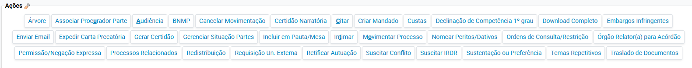

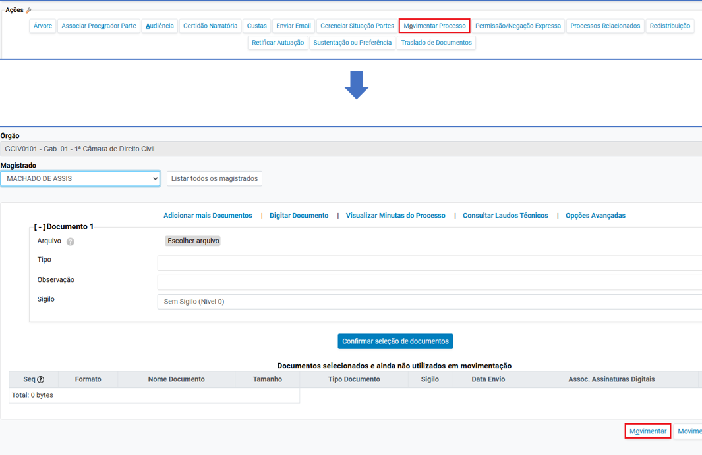

---

PRINCIPAIS AÇÕES NO PROCESSO

**EPROC PARA SEGUNDO GRAU****–****UNIDADE JUDICIAL****|**Conteúdo integral do curso
<small>**179**</small>
**Árvore**

A árvore é a pasta digital do processo, exibindo, ao clicar em seu respectivo ícone na seção

**“Ações”**, a capa do processo e todos os eventos que possuem documentos, permitindo a

visualização, seleção, impressão e download das peças processuais.
<small>**Descrição da imagem**: ícone “Árvore” da Seção “Ações”.</small>
Por padrão, a árvore apresenta apenas os eventos que possuem documentos associados.
<small>**Descrição da imagem**: árvore de um processo com exibição de eventos com documentos associados.</small>
Na parte superior da barra de funcionalidades, o eproc exibe o número do processo e o ícone

**“Minimizar a árvore”**, representado por um quadrado com uma seta azul direcionada para cima.
<small>**Descrição da imagem**: árvore de um processo com destaque para o ícone “Minimizar a árvore”.</small>
Para abri-la novamente, clicar no ícone**“Exibir a árvore”**, representado por um quadrado com uma

seta azul direcionada para a esquerda, localizado no canto superior esquerdo da tela.

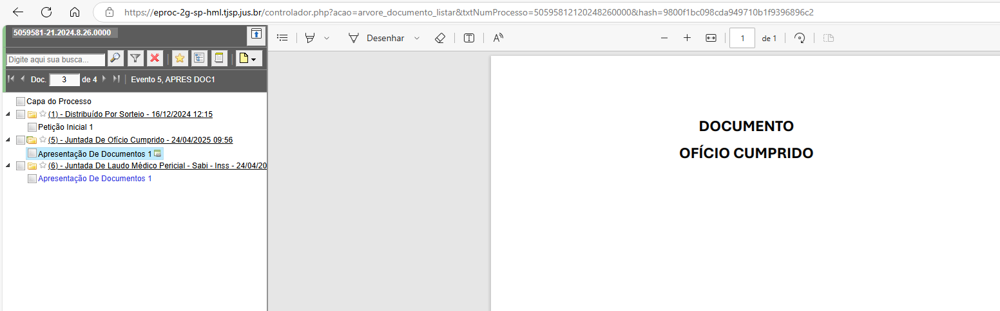

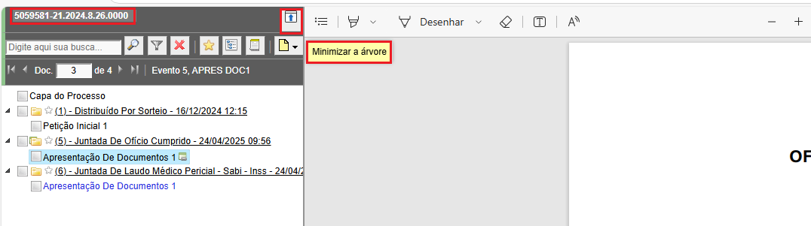

---

PRINCIPAIS AÇÕES NO PROCESSO

**EPROC PARA SEGUNDO GRAU****–****UNIDADE JUDICIAL****|**Conteúdo integral do curso
<small>**180**</small><small>**Descrição da imagem**: árvore de um processo com destaque para o ícone “Exibir a árvore”.</small>
Na parte superior da barra de funcionalidades, o sistema exibe o número do processo e botões de

atividade; posicionando o cursor do mouse sobre eles, é possível visualizar a descrição da ação

correspondente.
<small>**Descrição da imagem**: árvore de um processo com seleção do botão “Limpar busca”.</small>
São estas as atividades exibidas:

▪**campo “Digite aqui sua busca. .. ”:**consulta de peças a partir da digitação da

nomenclatura dos documentos. Após digitar o conteúdo da busca, selecionar o ícone

**“Destaca os eventos ou documentos que atendam ao critério de pesquisa”**

(representado pelo desenho de uma lupa):

**◦**

essa funcionalidade deixará em destaque todos os eventos/documentos do

processo que atendam ao critério pesquisado;

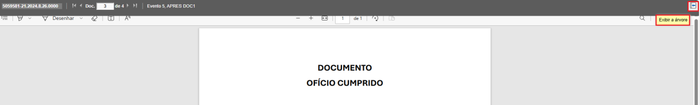

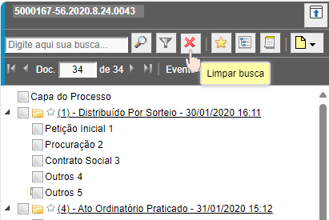

---

PRINCIPAIS AÇÕES NO PROCESSO

**EPROC PARA SEGUNDO GRAU****–****UNIDADE JUDICIAL****|**Conteúdo integral do curso
<small>**181**</small><small>**Descrição da imagem**: árvore de um processo, com busca por eventos ou documentos do tipo “laudo” em destaque.</small>
▪**Exibe o conjunto de eventos ou documentos que atendam ao critério de pesquisa**

(ícone representado pelo desenho de um funil): somente os eventos/documentos

pesquisados serão agrupados e exibidos.
<small>**Descrição da imagem**: árvore de um processo, com exibição de eventos ou documentos do tipo “laudo”.</small>
▪**Limpar busca**(ícone representado pela letra “X” em negrito e na cor vermelha): limpa

o campo**“Digite aqui sua busca. .. ”**;

▪**Exibir apenas eventos relevantes**(ícone representado pelo desenho de uma estrela

na cor amarela): exibirá apenas os eventos marcados com essa informação;

▪**Expandir/recolher eventos**(ícone representado pelo desenho da árvore de um

processo): possibilita a visualização dos eventos com os documentos expandidos ou

recolhidos;

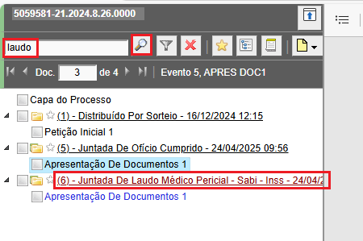

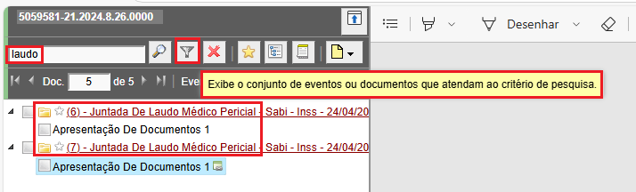

---

PRINCIPAIS AÇÕES NO PROCESSO

**EPROC PARA SEGUNDO GRAU****–****UNIDADE JUDICIAL****|**Conteúdo integral do curso
<small>**182**</small>
▪**Visualizar eventos sem documentos**(ícone representado pelo desenho de um bloco

de anotações): exibirá todos os eventos sem documentos associados;

▪**Tipo de Separador de Páginas**(ícone representado pelo desenho de uma folha de

papel na cor amarela, dobrada na parte superior direita): apresenta as opções

“Nenhum”, “Por Documento”, “Por Evento” e “Ambos (Evento e Documento)”.

Por meio das setas indicativas para a direita e para a esquerda, localizadas abaixo dos botões acima

descritos, é possível navegar entre os eventos, com os documentos sendo exibidos no painel

central, retrocedendo ou avançando por meio das setas.
<small>**Descrição da imagem**: árvore de um processo, com destaque para as setas indicativas do documento exibido.</small>
Na parte inferior da página da árvore do processo, há campos para definir o intervalo de eventos

a partir de um número inicial e um final, além dos botões**“Marcar todos”**,**“Desmarcar todos”**,

**“Versão p/ impressão”**e**“Download selecionados”**.
<small>**Descrição da imagem**: parte inferior da página da árvore de um processo com destaque aos botões citados acima.</small>
**Importante**

É possível navegar pela árvore do processo utilizando as setas do teclado do

computador. Uma vez selecionado o documento desejado, teclar**“Enter”**para exibi-

lo no painel lateral.

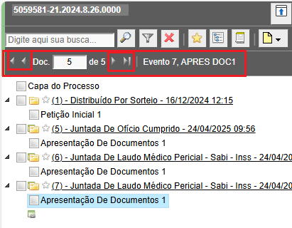

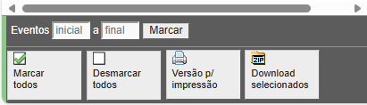

---

PRINCIPAIS AÇÕES NO PROCESSO

**EPROC PARA SEGUNDO GRAU****–****UNIDADE JUDICIAL****|**Conteúdo integral do curso
<small>**183**</small>
**Cancelamento da movimentação**

Determinado pelo(a) magistrado(a) o cancelamento de uma movimentação ou evento ou a

exclusão de um documento, somente o servidor com perfil de Gestor de Unidade e o(a)

Magistrado(a) poderão realizar tal ação. Na seção**“Ações”**, selecionar o botão**“Cancelar**

**Movimentação”**.
<small>**Descrição da imagem**: seção “Ações”, opção “Cancelar Movimentação”.</small>
**Atenção**

Nem todo evento pode ser cancelado! Somente os eventos e documentos que

possuírem o ícone de uma lixeira na coluna “Ações” são passíveis de cancelamento e

exclusão.

Na tela**“Cancelamento da Movimentação Processual”**, todos os eventos são listados, mas

somente os eventos e documentos com o ícone de uma lixeira, na coluna**“Ações”**,poderão ser

cancelados.
<small>**Descrição da imagem**: tela “Cancelamento da Movimentação Processual” com destaque para a coluna “Ações”, o</small><small>ícone lixeira e o botão “Documentos”.</small>
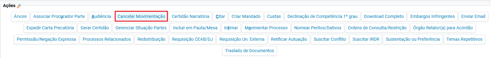

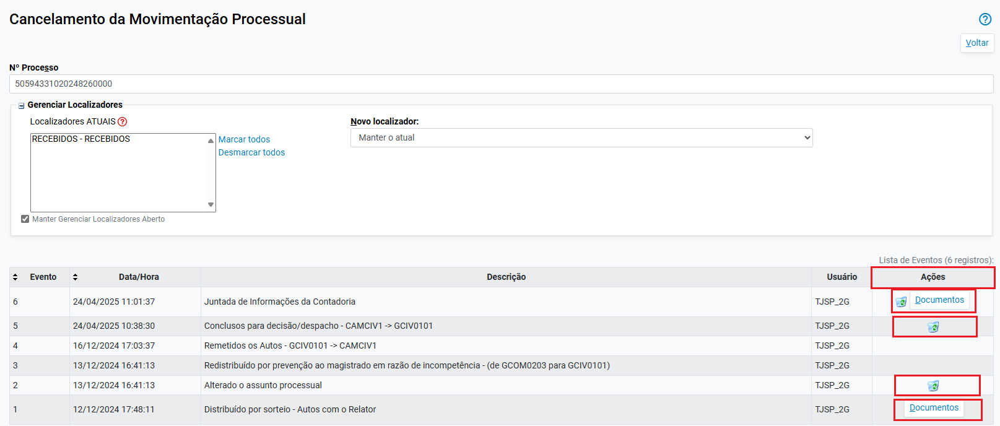

---

PRINCIPAIS AÇÕES NO PROCESSO

**EPROC PARA SEGUNDO GRAU****–****UNIDADE JUDICIAL****|**Conteúdo integral do curso
<small>**184**</small>
Quando houver na coluna**“Ações”**o botão**“Documentos”**, significa que há documento vinculado

àquele evento.

É possível excluir o documento e manter o evento ou excluir ambos. Por exemplo: se o magistrado

determinar somente a exclusão do documento do evento nº 06, deve-se clicar sobre o botão

**“Documentos”**. O eproc abrirá uma tela com os dados do documento.
<small>**Descrição da imagem**: evento 06 com destaque ao botão “Documentos”.</small>
Na tela**“Documentos do evento”**, acionar o ícone de uma lixeira à frente do nome do documento.
<small>**Descrição da imagem**: tela “Documentos do evento 06” e o ícone lixeira.</small>
O eproc abrirá uma janela de confirmação de desativação do documento. Após a confirmação, o

sistema desativará o documento.
<small>**Descrição da imagem**: janela de confirmação da desativação do documento.</small>
Acionando o botão**“Voltar”**, o eproc apresentará um novo evento referente ao

desentranhamento do documento do evento nº 06, bem como o botão**“Documentos”**, sinalizado

em vermelho e com a informação de que aquele evento possui documentos cancelados.

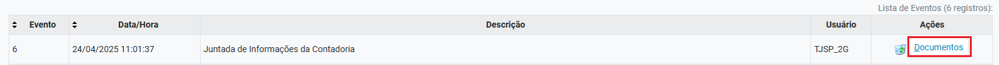

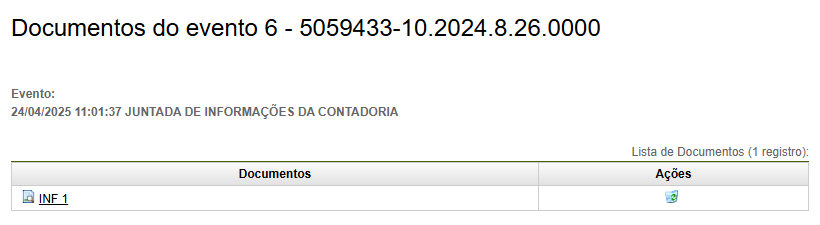

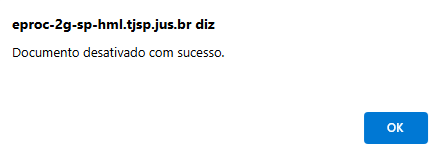

---

PRINCIPAIS AÇÕES NO PROCESSO

**EPROC PARA SEGUNDO GRAU****–****UNIDADE JUDICIAL****|**Conteúdo integral do curso
<small>**185**</small><small>**Descrição da imagem**: tela “Cancelamento de Movimentação Processual” com destaque para o evento referente ao</small><small>desentranhamento do documento e ao evento com documento cancelado.</small>
Caso seja determinado o cancelamento do evento e não somente do documento, clicar no ícone

**“Desativar Evento”**, representado por uma lixeira.
<small>**Descrição da imagem**: evento, com destaque ao ícone da lixeira “Desativar Evento”.</small>
O eproc emitirá mensagem de confirmação e lançará um evento de cancelamento no processo.
<small>**Descrição da imagem**: tela “Cancelamento de Movimentação Processual”, com destaque para o evento referente ao</small><small>cancelamento da movimentação.</small>
**Atenção**

No eproc todos os atos, ações, consultas e acessos ficam registrados e podem ser

mapeados.

**Declínio de competência ao 1º grau**

O declínio de competência, em direito processual, é a decisão de um juiz de que ele não é o

competente para julgar um determinado processo, devendo este ser remetido a outro juízo que

detenha a competência. É uma forma de garantir que o processo seja julgado pelo órgão judiciário

correto, evitando prejuízos e garantindo a legalidade.

Para realizar a atividade de declínio de competência ao primeiro grau, pela capa do processo, na

seção**“Ações”**, acionar o botão de atividade**“Declinação de Competência 1º grau”.**
<small>**Descrição da imagem**: seção “Ações” com destaque ao botão “Declinação de Competência 1º grau”.</small>
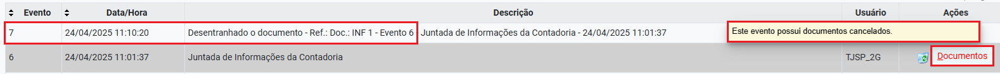

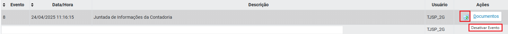

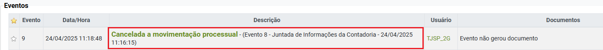

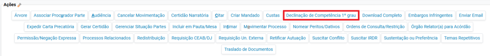

---

PRINCIPAIS AÇÕES NO PROCESSO

**EPROC PARA SEGUNDO GRAU****–****UNIDADE JUDICIAL****|**Conteúdo integral do curso
<small>**186**</small>
Na tela aberta, o usuário deve verificar se existe alguma pendência indicada pelo sistema.

Se não houver nenhuma pendência, o usuário deverá escolher o**“Tipo de Distribuição”**, que

poderá ser por:

▪**Sorteio:**realiza a livre distribuição à comarca eleita no primeiro grau; ou

▪**Dependência:**só deve ser utilizada se houver um número de processo originário

relacionado no eproc 1G, que vincule a distribuição do processo no primeiro grau.
<small>**Descrição da imagem**: destaque para o tipo de distribuição por dependência e o campo processo originário.</small>
Se o tipo de distribuição for por sorteio, o usuário deverá, na sequência, selecionar o órgão de

destino (1º grau), a classe que o processo terá na origem e a localidade judicial (comarca). Em

seguida, clicar no botão**“Declinar”**.
<small>**Descrição da imagem**: tela “Declinação de competência para o 1º grau” com a verificação de pendências e campos</small><small>para preenchimento.</small>
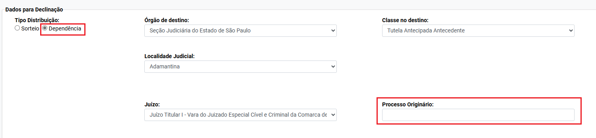

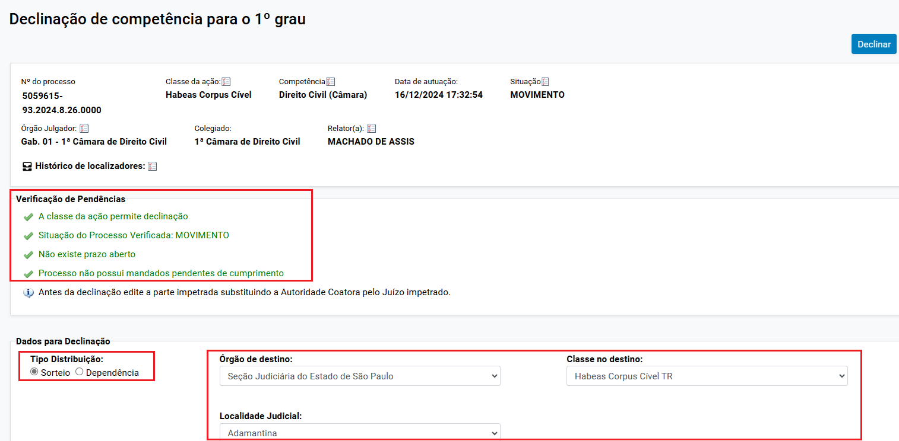

---

PRINCIPAIS AÇÕES NO PROCESSO

**EPROC PARA SEGUNDO GRAU****–****UNIDADE JUDICIAL****|**Conteúdo integral do curso
<small>**187**</small>
**Importante**

A ação**“declinação de competência 1º grau”**está disponível apenas para processos

originários que tenham a classe correspondente também em primeiro grau.

A ação**“declinação de competência 1º grau”**disponível na classe “Agravo de

Instrumento” deve ser usadaapenaspara declinação às Turmas Recursais.

Depois de clicar em**“Declinar”**,o sistema solicita a confirmação da ação.

A atividade de declínio de competência gera, automaticamente, o evento**“Baixa Definitiva –**

**Declinada Competência”**.
<small>**Descrição da imagem**: evento “Baixa Definitiva – Declinada Competência”.</small>
Realizado o declínio, a situação do processo será alterada para**“Incompetência –****Baixa”**.
<small>**Descrição da imagem**: destaque para a situação “Incompetência-Baixa”.</small>
**Declínio de competência às Turmas Recursais**

Para encaminhar um declínio de competência às Turmas Recursais, o usuário também deverá, pela

capa do processo, na seção**“Ações”**,acionar o botão de atividade**“Declinação de Competência**

**1º Grau”**.

O usuário deverá indicar o órgão de destino (primeiro grau), a classe que o processo terá na origem

e a localidade judicial (Turmas Recursais).

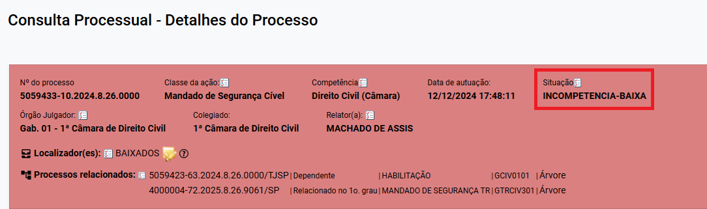

---

PRINCIPAIS AÇÕES NO PROCESSO

**EPROC PARA SEGUNDO GRAU****–****UNIDADE JUDICIAL****|**Conteúdo integral do curso
<small>**188**</small><small>**Descrição da imagem**: árvore de um processo com destaque para as setas indicativas do documento exibido.</small>
Depois de clicar em**“Declinar”**o sistema solicitará a confirmação da ação.

Toda atividade de declínio de competência gera um evento referente nos autos**“Baixa Definitiva**

**–****Declinada Competência”**. A situação do processo também é alterada para**“Incompetência –**

**Baixa”**.

**Cancelamento da distribuição**

O cancelamento da distribuição pode ser feito em virtude de comando judicial por erro na

distribuição, duplicidade na distribuição, entre outras hipóteses. O sistema eproc permite o

**cancelamento de distribuição**de processos em grau de recurso e, também, de processos

originários.

Para tanto, na capa do processo em que se deseja realizar o cancelamento da distribuição, na

seção**“Ações”**, acionar o botão de atividade**“Movimentar Processo”**.
<small>**Descrição da imagem**: destaque para o botão de atividade “Movimentar Processo”.</small>
Na tela**“Movimentação Processual”**,no campo**“Evento a ser lançado”**,selecionar a opção

**“Cancelada a Distribuição”**.

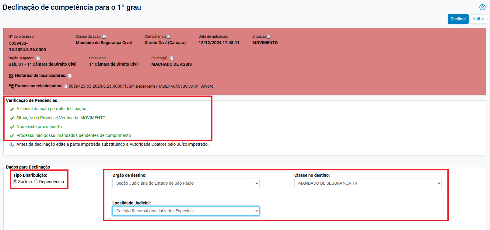

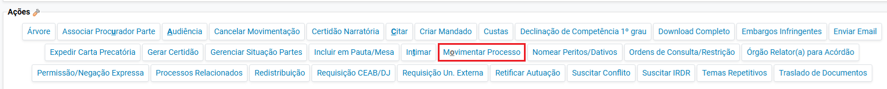

---

PRINCIPAIS AÇÕES NO PROCESSO

**EPROC PARA SEGUNDO GRAU****–****UNIDADE JUDICIAL****|**Conteúdo integral do curso
<small>**189**</small><small>**Descrição da imagem**: destaque para o campo “Evento a ser lançado” preenchido com “Cancelada a Distribuição”.</small>
Em seguida, acionar o botão**“Movimentar”**.

Uma vez realizado o cancelamento de processo originário, observe-se que:

▪ a situação do processo será alterada de**“Movimento”**para**“Baixado –****Ajuste**

**Estatístico”**;

▪ o processo recebe o localizador**“Baixados”**, sendo removidos todos os demais

localizadores existentes;

▪ o sistema lança automaticamente o evento**“Cancelada a Distribuição”**;

▪ é diminuído 01 (um) ponto na quantidade efetiva de peso do mapa da distribuição do

magistrado.

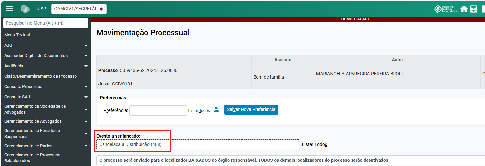

---

PRINCIPAIS AÇÕES NO PROCESSO

**EPROC PARA SEGUNDO GRAU****–****UNIDADE JUDICIAL****|**Conteúdo integral do curso
<small>**190**</small><small>**Descrição da imagem**: destaque para a situação, localizadores e evento do processo cancelado.</small>
Uma vez realizado o cancelamento de processo em grau de recurso, observe-se que:

▪ a situação do processo em trâmite no eproc 2G será alterada de**“Movimento”**para

**“Baixado –****Ajuste Estatístico”**;

▪ o sistema lança automaticamente o evento**“Cancelada a Distribuição”**no processo

2G;

▪ há decréscimo no peso do magistrado relator que teve o processo cancelado.

▪ será realizada a remessa automática do processo ao eproc 1G para que lá passe a

novamente tramitar, com reativação automática do processo e alteração da situação

para**“Movimento”**.

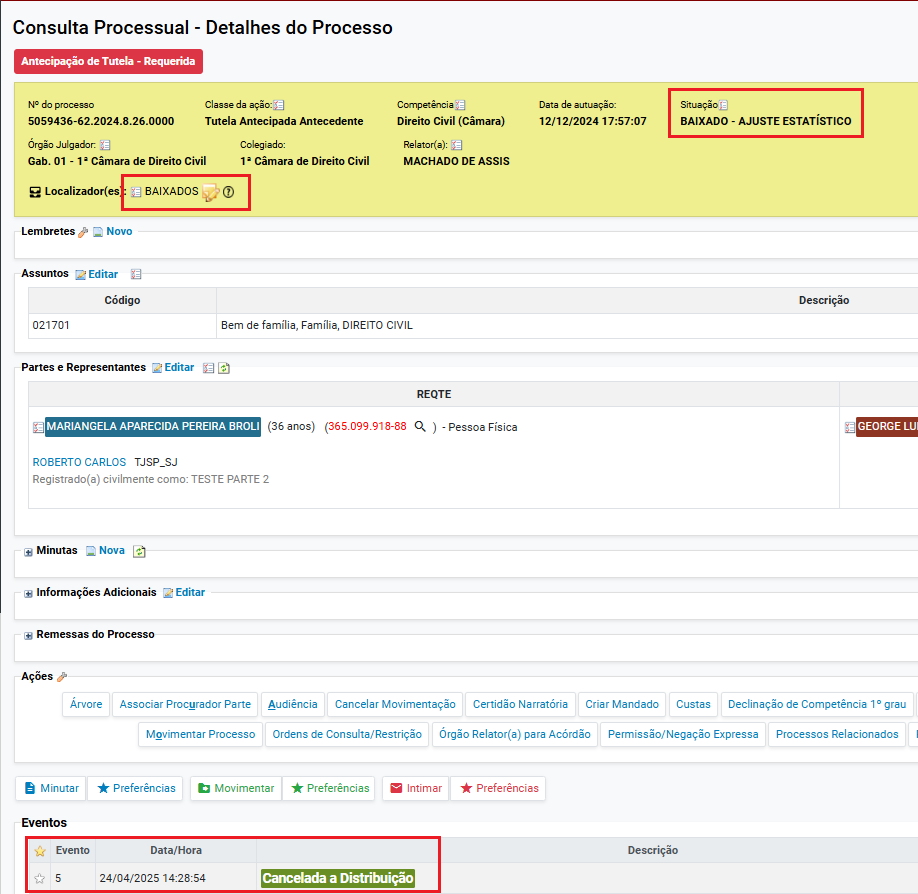

---

PRINCIPAIS AÇÕES NO PROCESSO

**EPROC PARA SEGUNDO GRAU****–****UNIDADE JUDICIAL****|**Conteúdo integral do curso
<small>**191**</small>
**Baixa definitiva de processo em grau de recurso**

Nos processos em grau de recurso que serão baixados ao primeiro grau é necessário lançar o

evento de trânsito em julgado e, em seguida, providenciar a remessa ao primeiro grau.

Para lançar o evento de trânsito em julgado, pela capa do processo, na seção**“Ações”**, acionar o

botão de atividade**“Movimentar Processo”**.
<small>**Descrição da imagem**: destaque para o botão de atividade “Movimentar Processo”.</small>
Na tela**“Movimentação Processual”**,no campo**“Evento a ser lançado”**,selecionar a opção

**“Transitado em Julgado”**e informar a data do trânsito em campo próprio. Na sequência, acionar

o botão**“Movimentação Sucessiva”**.
<small>**Descrição da imagem**: destaque para os campos “Evento a ser lançado” e “Data do Trânsito em Julgado” e o botão</small><small>“Movimentação Sucessiva”.</small>
Nesse momento, será exibida a informação de que a movimentação processual foi realizada com

sucesso, permanecendo aberta a tela**“Movimentação Processual”**para que o usuário possa

realizar o lançamento do outro evento, o de**“Baixa Definitiva –****Remetido a(o)”**.Por fim, clicar em

**“Movimentar”**.

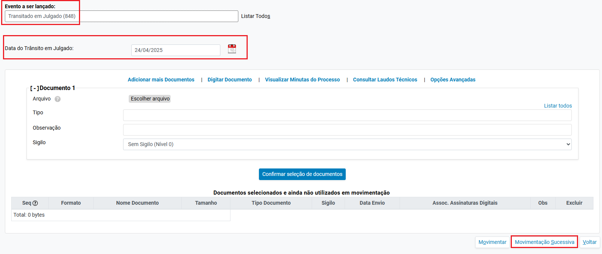

---

PRINCIPAIS AÇÕES NO PROCESSO

**EPROC PARA SEGUNDO GRAU****–****UNIDADE JUDICIAL****|**Conteúdo integral do curso
<small>**192**</small><small>**Descrição da imagem**: destaque à informação de que a primeira movimentação foi realizada com sucesso, ao campo</small><small>“Evento a ser lançado” e ao botão “Movimentar”.</small>
Ao clicar em**“Movimentar”**o processo será baixado ao primeiro grau.
<small>**Descrição da imagem**: destaque para o processo baixado no 2G, com a situação “Baixado” e com o localizador</small><small>“BAIXADOS”.</small><small>**Descrição da imagem**: destaque para os eventos de trânsito em julgado e baixa definitiva lançados no processo</small><small>baixado no 2G.</small>
No primeiro grau, o processo receberá o localizador de entrada de recebidos do segundo grau,

neste exemplo,**“TJSP****-****RECEBIDOS”**,e a situação**“Movimento”**.

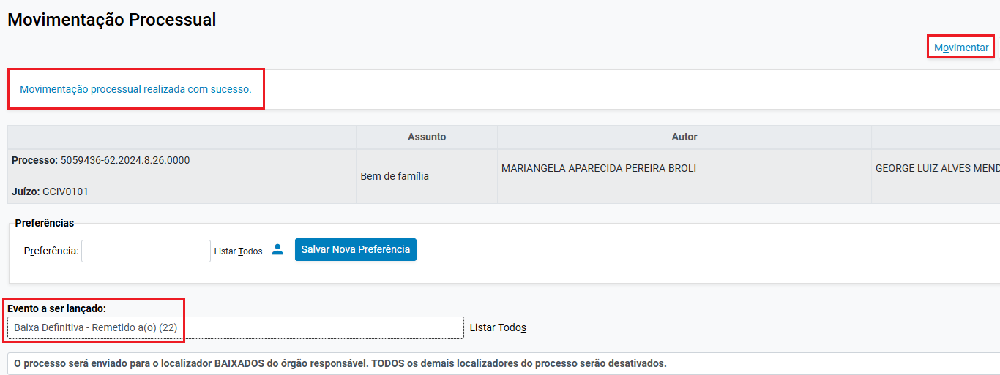

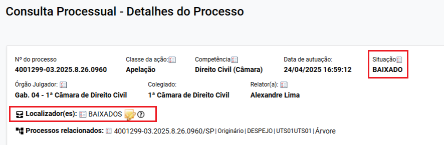

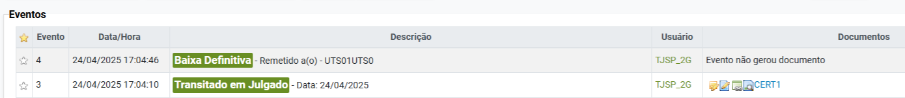

---

PRINCIPAIS AÇÕES NO PROCESSO

**EPROC PARA SEGUNDO GRAU****–****UNIDADE JUDICIAL****|**Conteúdo integral do curso
<small>**193**</small><small>**Descrição da imagem**: destaque para a situação “Movimento” e o localizador “TJSP – RECEBIDOS” lançados no</small><small>processo baixado ao 1G.</small>
**Atenção**

O sistema eproc não permite a movimentação do processo no primeiro grau após a

remessa ao segundo grau e, também, não permite a manipulação do processo no

segundo grau após a baixa.

Além disso, há um bloqueio impedindo o peticionamento em um grau de jurisdição

quando o processo é remetido para outro grau; sendo assim, o advogado deverá

peticionar na instância em que o processo se encontra. A única ação que se pode

fazer quando o processo está em outra instância é o substabelecimento pelo

advogado.

**Baixa e arquivamento de processos originários**

A baixa dos processos originários é realizada**após o registro do trânsito em julgado**, lançando-se

o evento de baixa definitiva.

Para lançar o evento de baixa, pela capa do processo, na seção**“Ações”**, acionar o botão de

atividade**“Movimentar Processo”**.
<small>**Descrição da imagem**: destaque para o botão de atividade “Movimentar Processo”.</small>
Na tela**“Movimentação Processual”**,no campo**“Evento a ser lançado”**,selecionar a opção**“Baixa**

**Definitiva”**. Na sequência, acionar o botão**“Movimentar”**.

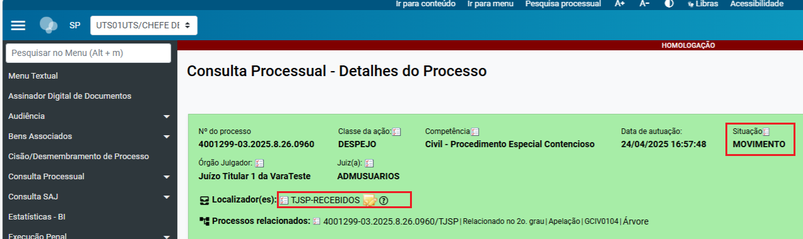

---

PRINCIPAIS AÇÕES NO PROCESSO

**EPROC PARA SEGUNDO GRAU****–****UNIDADE JUDICIAL****|**Conteúdo integral do curso
<small>**194**</small><small>**Descrição da imagem**: destaque para o campo “Evento a ser lançado” e o botão “Movimentar”.</small>
O sistema lançará no processo o evento de**“Baixa Definitiva”**, atribuindo a ele o localizador

**“Baixados”**. A situação do processo será alterada para**“Baixado”**.
<small>**Descrição da imagem**: destaque para a situação do processo e para o localizador atribuído “BAIXADOS”.</small>
**Atenção**

Para processos originários do segundo grau que possuam alguma relação com um

processo de primeiro grau, o sistema está configurado para lançar, automaticamente,

eventos de uma instância em outra. Dessa forma, alguns movimentos relevantes da

outra instância ficam registrados no processo, como, por exemplo, decisões e baixa.

Quando um processo originário de segundo grau recebe o evento de despacho/decisão, no

primeiro grau, seu processo relacionado receberá automaticamente o evento**Comunicação**

**Eletrônica Recebida****–****Decisão proferida em. .. ”**,comunicando, dessa forma, que houve uma

decisão no processo de segundo grau; será inserido, ainda, um localizador específico indicando a

ocorrência dessa decisão.

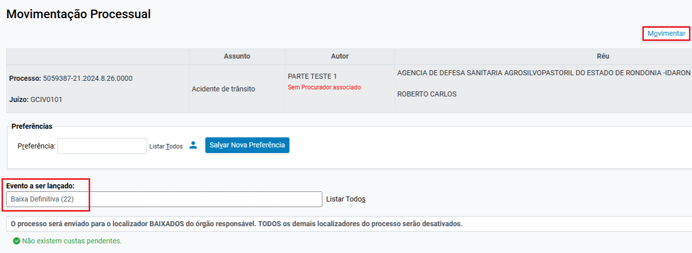

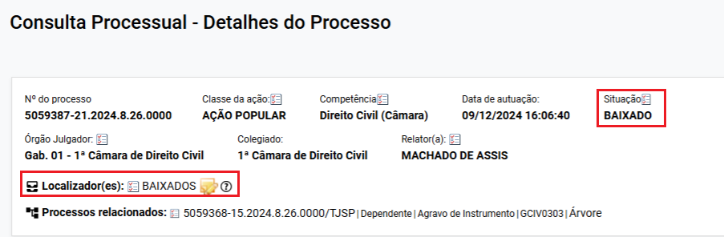

---

PRINCIPAIS AÇÕES NO PROCESSO

**EPROC PARA SEGUNDO GRAU****–****UNIDADE JUDICIAL****|**Conteúdo integral do curso
<small>**195**</small>
Da mesma forma, se o processo relacionado for julgado no primeiro grau, o sistema lançará no

processo de segundo grau o evento**“Comunicação Eletrônica Recebida –****Julgado”**.

Diante dessa integração/comunicação entre os sistemas, quando um processo originário de

segundo grau recebe o evento**“Baixa Definitiva”**, no primeiro grau, seu processo relacionado

receberá automaticamente o evento**“Comunicação Eletrônica Recebida Baixado”**, comunicando,

dessa forma, que houve o arquivamento do processo no segundo grau. Ademais, quando o

processo for arquivado no primeiro grau, o sistema lançará o evento respectivo no processo do

segundo grau.

**Importante**

Para desarquivar processo originário arquivado, o usuário deve lançar o evento

**“Processo Reativado –****Cancelamento de baixa”**, eo processo será colocado

automaticamente no localizador de gabinete**“REATIVADOS”**.

---

CADASTRO DA SESSÃO DE JULGAMENTO

**EPROC PARA SEGUNDO GRAU****–****UNIDADE JUDICIAL****|**Conteúdo integral do curso
<small>**196**</small>
# ▪ CADASTRO DA SESSÃO DE

**JULGAMENTO**

O(a) usuário(a) com perfil**Gestor de Unidade**precisará adotar algumas providências no sistema

eproc para a realização das**sessões de julgamento**nos processos do Segundo Grau.

A primeira providência será acessar o item**“Cronograma de Sessões de Julgamento”**, dentro da

categoria**“Sessão de Julgamento”**do**menu lateral**.
<small>**Descrição da imagem:**menu lateral preenchido com a expressão “cronograma” e destaque às opções “Sessão de</small><small>Julgamento” e “Cronograma de Sessões de Julgamento”.</small>
**CADASTRO DA SESSÃO DE JULGAMENTO**

Aberta a tela**“Sessões de Julgamento”**, clicar em**“Nova”**para o cadastro da**sessão de**

**julgamento**, permitindo a abertura da pauta para a inserção de relatórios e votos dos processos

pelos gabinetes dos componentes da Câmara.

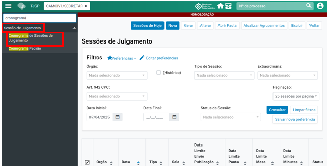

---

CADASTRO DA SESSÃO DE JULGAMENTO

**EPROC PARA SEGUNDO GRAU****–****UNIDADE JUDICIAL****|**Conteúdo integral do curso
<small>**197**</small><small>**Descrição da imagem**: tela “Sessões de Julgamento” com destaque ao botão “Nova”.</small>
A tela**“Nova Sessão de Julgamento”**será aberta para a criação individual de Sessão de

Julgamento. Preencher os seguintes campos:

▪**Órgão**: clicar na seta para baixo e selecionar a respectiva**Câmara**;

▪**Tipo de Sessão**: clicar na seta para baixo e, no menu expansível, selecionar entre

**“Excepcional”**,**“Extraordinária”**,**“Ordinária”**ou**“Virtual”**;

▪**Sala**: clicar na seta para baixo e selecionar, no menu expansível, a sala de realização

das sessões (virtuais ou presenciais);

▪**Data**: digitar a data de realização da sessão ou clicar no ícone representado pelo

calendário para localizar a data a ser aplicada;

▪**Hora**: digitar o horário de início da sessão ou clicar no ícone representado por um

relógio para a seleção do horário;

▪**Secretário**: campo de preenchimento facultativo. Clicar na seta para baixo para

selecionar o secretário desejado;

▪**Procurador**: campo de preenchimento facultativo. Clicar na seta para baixo para

seleção, se o caso, do representante do Ministério Público que participará da sessão;

▪**Limite para Pauta**: informar com a quantidade de dias úteis antes da data-limite para

intimação da sessão;

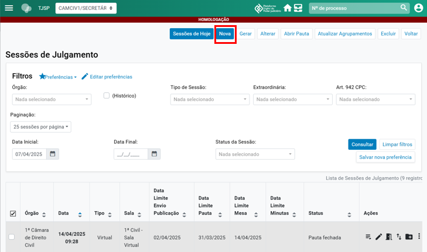

---

CADASTRO DA SESSÃO DE JULGAMENTO

**EPROC PARA SEGUNDO GRAU****–****UNIDADE JUDICIAL****|**Conteúdo integral do curso
<small>**198**</small>
▪**Limite para Mesa**: informar a quantidade de dias úteis antes da data da sessão para a

inclusão de processo na mesa;

▪**Limite para disponibilização de minutas**: informar a quantidade de dias úteis antes da

data da sessão para a disponibilização de minutas;

▪**Art. 942 CPC**: marcar a caixa da seleção caso a sessão seja designada conforme os

termos do art. 942, CPC;
<small>Art. 942. Quando o resultado da apelação for não unânime, o julgamento terá</small><small>prosseguimento em sessão a ser designada com a presença de outros julgadores,</small><small>que serão convocados nos termos previamente definidos no regimento interno,</small><small>em número suficiente para garantir a possibilidade de inversão do resultado inicial,</small><small>assegurado às partes e a eventuais terceiros o direito de sustentar oralmente suas</small><small>razões perante os novos julgadores.</small>
▪**Link/ID da Reunião**: campo de digitação livre para inclusão de informação sobre

eventual link para acesso de sessão virtual;

▪**Observações**: campo de digitação livre para a inclusão de informações que se

considerarem necessárias para a sessão.

Preenchidos os campos, clicar em**“Salvar”**.
<small>**Descrição da imagem**: tela “Nova Sessão de Julgamento” com destaque aos campos de preenchimento e ao botão</small><small>“Salvar”.</small>
A**sessão de julgamento**será cadastrada e ficará disponível no campo inferior da tela**“Sessões de**

**Julgamento”**.

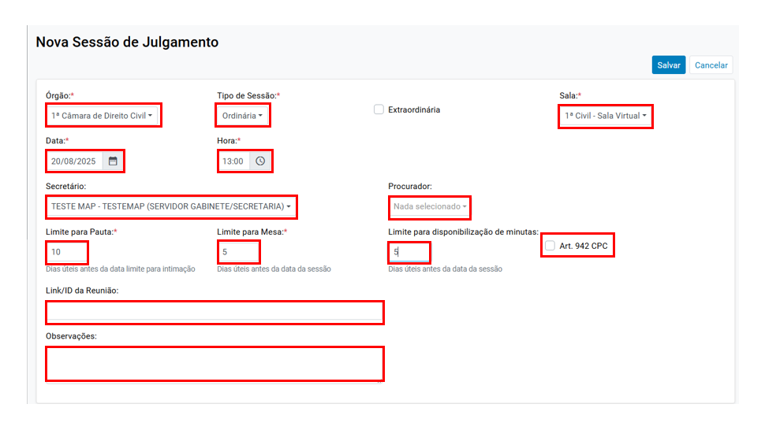

---

CADASTRO DA SESSÃO DE JULGAMENTO

**EPROC PARA SEGUNDO GRAU****–****UNIDADE JUDICIAL****|**Conteúdo integral do curso
<small>**199**</small><small>**Descrição da imagem**: tela “Sessões de Julgamento” com a nova Sessão de Julgamento cadastrada.</small>
As**sessões de julgamento**cadastrada conta com os seguintes ícones na coluna**“Ações”**:

▪**Alterar Dados da Sessão de Julgamento****–****Painel**(representado por um lápis): altera

os dados cadastrados da sessão de julgamento;

▪**Abrir Pauta**(representado por uma porta): abre a possibilidade de inclusão de

processos pelos gabinetes que compõem a Câmara na Sessão de Julgamento. Após a

abertura da pauta, o ícone é alterado para**“Fechar a pauta da sessão de julgamento”**,

representado por uma porta com um traço por cima;

▪**Listar Histórico dos Recursos da Sessão de Julgamento**(representado por um relógio):

apresenta um relatório sobre o cadastro e demais passos da**sessão de julgamento**;

▪**Alterar data/hora da Sessão de Julgamento**(representado por um calendário): abre

janela que permite apenas a alteração da data e hora da sessão de julgamento;

▪**Excluir Sessão de Julgamento**(representado por uma lixeira): remove o registro de

cadastro da sessão de julgamento.

**Conflito de data e sala**

Na hipótese de nova**sessão de julgamento**ser cadastrada no mesmo dia, horário e sala de outra

anterior, o eproc sinalizará a ocorrência do conflito na coluna**“Ações”,**pelo ícone**“Resolver**

**conflito de sala e data”**, representado por uma luva de boxe.

Além disso, a coluna**“Status”**da nova**sessão de julgamento**possuirá a informação**“Conflito de**

**sala e data”**, em razão do agendamento no mesmo horário.

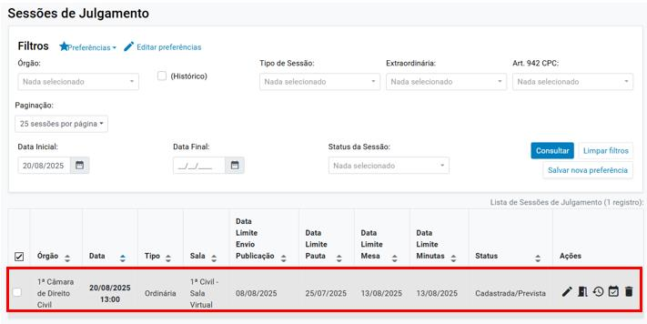

---

CADASTRO DA SESSÃO DE JULGAMENTO

**EPROC PARA SEGUNDO GRAU****–****UNIDADE JUDICIAL****|**Conteúdo integral do curso
<small>**200**</small><small>**Descrição da imagem**: destaque ao ícone “Resolver conflito de sala e data” e à coluna “Status”, com a informação</small><small>“Conflito de sala e data”.</small>
Não havendo problema na manutenção de ambas as sessões no mesmo dia, hora e sala, clicar no

ícone**“Resolver conflito de sala e data”**, representado por uma luva de boxe.

A coluna**“Status”**da nova**sessão**passará a ter a informação**“Cadastrada/Prevista”**,e o ícone

**“Resolver conflito de sala e data”**, representado por uma luva de boxe, será removido da coluna

**“Ações”**.
<small>**Descrição da imagem**: destaque à coluna “Status” com as situações das sessões de julgamento com a mesma data,</small><small>hora e sala, após o acionamento do ícone “Resolver conflito de sala e data”.</small>
Caso não seja possível a manutenção de ambas as sessões na mesma data, hora e sala, acionar o

ícone**“Alterar Dados da Sessão de Julgamento –****Painel”**, representado por um lápis, para a

alteração dos dados de uma das sessões de julgamento.

**Opção “Gerar” da tela “Sessões de Julgamento”**

A tela**“Sessões de Julgamento”**possui o botão**“Gerar”**, permitindo o cadastro em lote de**sessões**

**de julgamento**da**Câmara**.

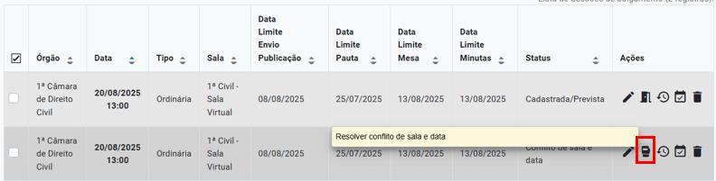

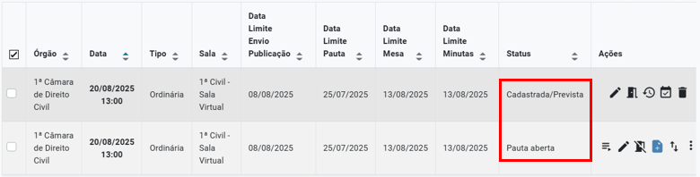

---

CADASTRO DA SESSÃO DE JULGAMENTO

**EPROC PARA SEGUNDO GRAU****–****UNIDADE JUDICIAL****|**Conteúdo integral do curso
<small>**201**</small><small>**Descrição da imagem**: tela “Sessões de Julgamento” com destaque à opção “Gerar”.</small>
A tela**“Gerar Cronograma de Sessões de Julgamento”**será aberta, para a criação das**sessões de**

**julgamento**da**Câmara**dentro de um período, de forma reiterada. Preencher os seguintes campos:

▪**Órgão**: clicar na seta para baixo e selecionar a Câmara;

▪**Tipo de Sessão**: clicar na seta para baixo e, no menu expansível, selecionar entre

**“Excepcional”**,**“Extraordinária”**,**“Ordinária”**ou**“Virtual”**;

▪**Sala**: clicar na seta para baixo e selecionar, no menu expansível, a sala de realização

das sessões (virtuais ou presenciais);

▪**Data inicial**: digitar a data em que se inicia o cronograma de agendamento das sessões

de julgamento ou clicar no ícone representado pelo calendário para localizar a data a

ser aplicada;

▪**Data final**: digitar a data em que se inicia o cronograma de agendamento das sessões

de julgamento ou clicar no ícone representado pelo calendário para localizar a data a

ser aplicada;

▪**Hora Prevista**: digitar o horário calculado para a realização das sessões de julgamento

no período;

▪**Dia da semana**: selecionar o dia da semana de realização da**sessão de julgamento**.

Clicar na seta para baixo e, no menu expansível, selecionar o dia;

▪**Periodicidade**: clicar na seta para baixo e, no menu expansível, selecionar a

periodicidade em que a**sessão de julgamento**será realizada. Isso fará que o eproc

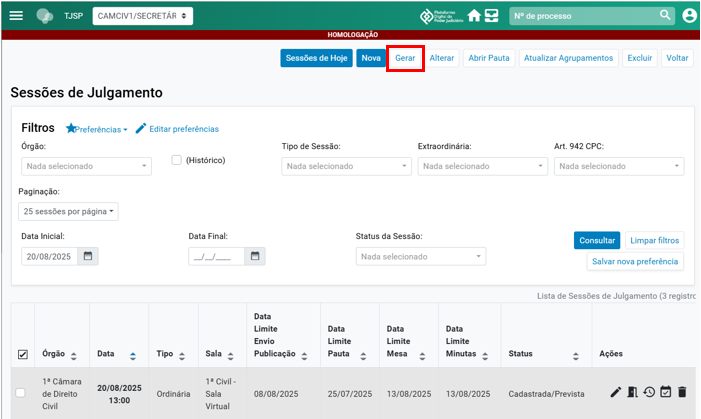

---

CADASTRO DA SESSÃO DE JULGAMENTO

**EPROC PARA SEGUNDO GRAU****–****UNIDADE JUDICIAL****|**Conteúdo integral do curso
<small>**202**</small>
cadastre no período selecionado uma sessão de julgamento no dia da semana

escolhido durante o período;

▪**Secretário**: campo de preenchimento facultativo. Clicar na seta para baixo para

selecionar o secretário desejado;

▪**Procurador**: campo de preenchimento facultativo. Clicar na seta para baixo para

seleção, se o caso, do representante do Ministério Público que participará da sessão;

▪**Limite para Pauta**: informar com a quantidade de dias úteis antes da data-limite para

intimação da sessão;

▪**Limite para Mesa**: informar a quantidade de dias úteis antes da data da sessão para a

inclusão de processo na mesa;

▪**Limite para disponibilização de minutas**: informar a quantidade de dias úteis antes da

data da sessão para a disponibilização de minutas;

▪**Art. 942 CPC**: marcar a caixa da seleção caso a sessão seja designada conforme os

termos do art. 942, CPC;
<small>Art. 942. Quando o resultado da apelação for não unânime, o julgamento terá</small><small>prosseguimento em sessão a ser designada com a presença de outros julgadores,</small><small>que serão convocados nos termos previamente definidos no regimento interno,</small><small>em número suficiente para garantir a possibilidade de inversão do resultado inicial,</small><small>assegurado às partes e a eventuais terceiros o direito de sustentar oralmente suas</small><small>razões perante os novos julgadores.</small>
▪**Link/ID da Reunião**: campo de digitação livre para inclusão de informação sobre

eventual link para acesso de sessão virtual;

▪**Observações**: campo de digitação livre para a inclusão de informações que se

considerarem necessárias para a sessão.

---

CADASTRO DA SESSÃO DE JULGAMENTO

**EPROC PARA SEGUNDO GRAU****–****UNIDADE JUDICIAL****|**Conteúdo integral do curso
<small>**203**</small><small>**Descrição da imagem**: tela “Gerar Cronograma de Sessões de Julgamento” com destaque aos campos e ao botão</small><small>“Gerar”.</small>
Após, clicar em**“Gerar”**. As**sessões de julgamento**no período selecionado serão criadas nos dias

da semana e periodicidade selecionada e ficarão disponíveis para consulta.
<small>**Descrição da imagem**: tela “Sessões de Julgamento” com as sessões cadastradas conforme o cronograma definido.</small>
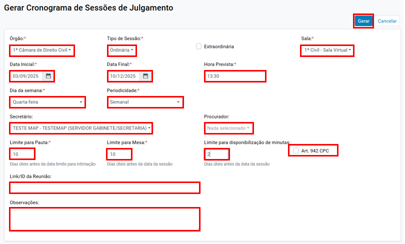

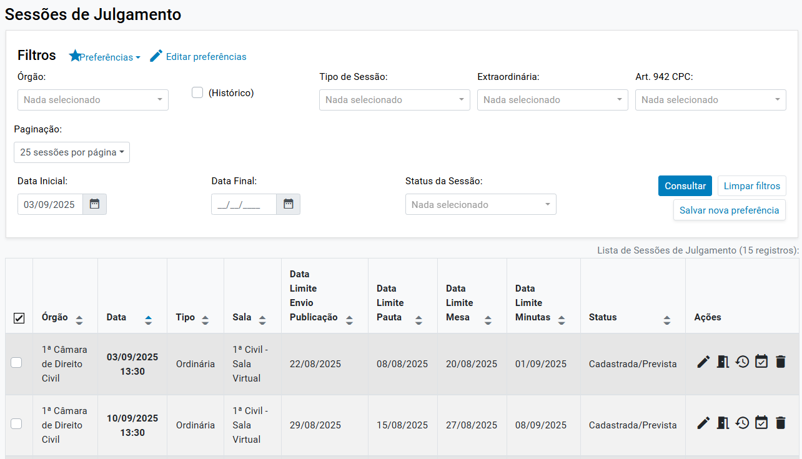

---

CONSULTA E ABERTURA DE PAUTA

**EPROC PARA SEGUNDO GRAU****–****UNIDADE JUDICIAL****|**Conteúdo integral do curso
<small>**204**</small>
# ▪ CONSULTA E ABERTURA DE PAUTA

**CONSULTA DE SESSÕES**

Os usuários lotados na unidade judicial e nos gabinetes do Segundo Grau poderão pesquisar e

localizar as**sessões de julgamento**na tela**“Sessões de Julgamento”**, acessada pelo item

**“Cronograma de Sessões de Julgamento”**, dentro da categoria**“Sessão de Julgamento”**do menu

lateral, preenchendo um ou mais dos seguintes filtros:

▪**Órgão**;

▪**Tipo de Sessão**;

▪**Extraordinária**;

▪**Art. 942 CPC**;

▪**Paginação**: acionar a seta para baixo para selecionar a quantidade de sessões exibida

por página;

▪**Data inicial**;

▪**Data Final**;

▪**Status da Sessão**.

Após preencher os filtros desejados, clicar em**“Consultar”**e o resultado será exibido no campo

inferior da tela.
<small>**Descrição da imagem**: destaque aos filtros de pesquisa de sessão de julgamento e ao botão “Consultar”.</small>
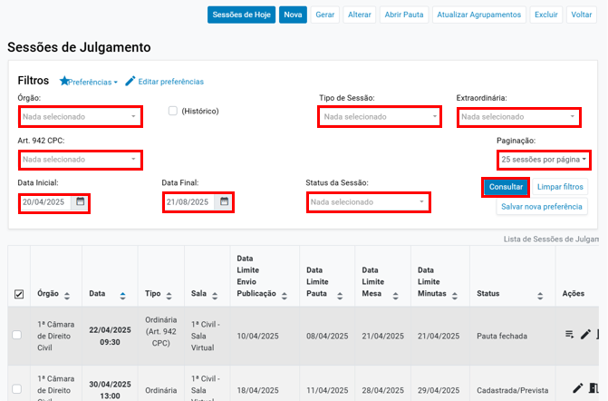

---

CONSULTA E ABERTURA DE PAUTA

**EPROC PARA SEGUNDO GRAU****–****UNIDADE JUDICIAL****|**Conteúdo integral do curso
<small>**205**</small>
**ABERTURA DE PAUTA**

O próximo passo após o cadastro da**sessão de julgamento**pela**unidade judicial**responsável pela

Câmaraé a abertura da pauta, para que os**gabinetes**possam inserir os processos que farão sua

composição.

A abertura da pauta é realizada na tela**“Sessões de Julgamento”**, acessada pelo item

**“Cronograma de Sessões de Julgamento”**, dentro da categoria**“Sessão de Julgamento”**do menu

lateral.

Utilizar os filtros disponíveis para a localização da pauta de julgamento a ser aberta. Sugere-se

clicar na seta para baixo no campo**“Status da Sessão”**e selecionar a opção**“Cadastrada/Prevista”**,

para visualizar na tela apenas as pautas ainda não abertas.

Clicar em**“Consultar”**para a exibição das pautas no campo inferior.
<small>**Descrição da imagem**: tela “Sessões de Julgamento”, destaque ao filtro “Status da Sessão” e ao botão “Consultar”.</small>
Localizada a pauta a ser aberta, clicar no ícone**“Abrir pauta”**, representado por uma porta,

disponível na coluna**“Ações”**.
<small>**Descrição da imagem**: coluna “Ações” com destaque ao ícone “Abrir pauta”.</small>
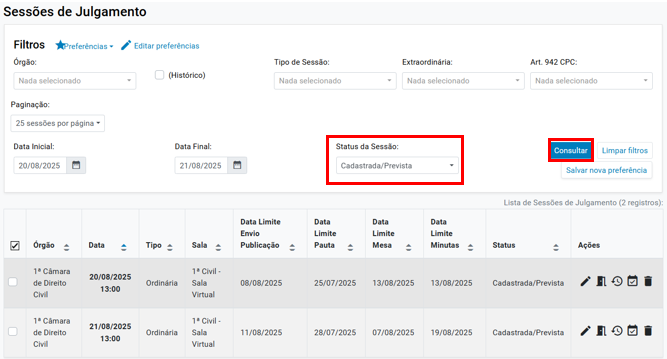

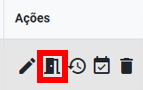

---

CONSULTA E ABERTURA DE PAUTA

**EPROC PARA SEGUNDO GRAU****–****UNIDADE JUDICIAL****|**Conteúdo integral do curso
<small>**206**</small>
A coluna**“Status”**da pauta passará a exibir a informação**“Pauta aberta”**.

Além disso, a coluna**“Ações”**passará a contar com diversos itens utilizados para a inclusão de

processos na pauta e a realização das demais providências necessárias. Os ícones são:

▪**Painel - Listar itens da Sessão de Julgamento**(representado por três linhas paralelas

contendo na última o ícone de avançar): abre o painel em que ficarão as informações

dos processos que serão inseridos na pauta de julgamento. É a principal tela de

configuração;

▪**Alterar Dados da Sessão de Julgamento****–****Painel**(representado por um lápis): altera

os dados cadastrados da sessão de julgamento;

▪**Fechar a pauta da sessão de julgamento**(representado por uma porta com um traço

por cima): encerra a possibilidade de inclusão de processos na pauta da sessão de

julgamento;

▪**Incluir processo na Pauta**(representado por uma sulfite azul com um símbolo de

adição no interior);

▪**Incluir processos de um localizador**(representado por uma seta para cima e outra

para baixo): abrirá em uma nova janela a tela**“Lista de Processos por Localizador”**,

permitindo a pesquisa de processos e sua**“Inclusão na Pauta/Mesa”**, após marcar a

caixa de seleção do lado esquerdo da tela e acionar o botão**“Incluir em Pauta/Mesa”**;

▪**Mais ações**(representado por três pontinhos): abre um menu expansível contendo as

seguintes opções de atividade:

**◦**

**Incluir Processo em Retificação de Julgamento**(representado por uma pasta

com um símbolo de adição no interior);

**◦**

**Listar Histórico dos Recursos da Sessão de Julgamento**(representado por um

relógio);

**◦**

**Ordenar pedidos da Sessão de Julgamento**(representado por uma lista

contendo três linhas);

**◦**

**Alterar data/hora da Sessão de Julgamento**(representado por um calendário);

**◦**

**Excluir Sessão de Julgamento**(representado por uma lixeira);

**◦**

**Cancelar sessão de julgamento**(representado por um “xis”);

**◦**

**Visualizar resumo da Sessão de Julgamento**(representado por um martelo

utilizado em plenários do júri);

**◦**

**Configurar recursos do item da sessão de julgamento**(representado por uma

chave de boca).

---

CONSULTA E ABERTURA DE PAUTA

**EPROC PARA SEGUNDO GRAU****–****UNIDADE JUDICIAL****|**Conteúdo integral do curso
<small>**207**</small><small>**Descrição da imagem**: tela “Sessões de Julgamento” com o*status*“Pauta aberta” e destaque aos novos botões na</small><small>coluna “Ações”.</small>
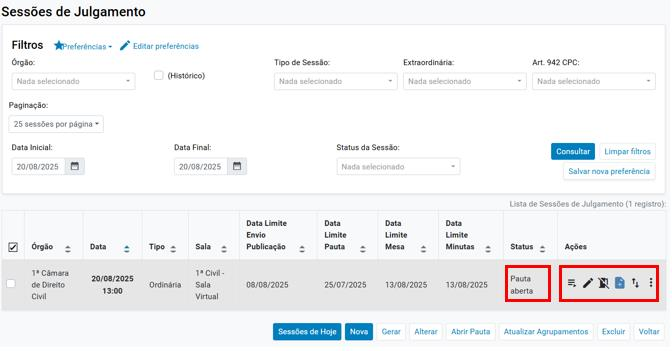

---

EXPEDIR PAUTA E COMPOSIÇÕES

**EPROC PARA SEGUNDO GRAU****–****UNIDADE JUDICIAL****|**Conteúdo integral do curso
<small>**208**</small>
# ▪ EXPEDIR PAUTA E COMPOSIÇÕES

**ATUAÇÃO NA PAUTA**

Enquanto os gabinetes dos(as) magistrados(as) componentes das Câmaras realizam a inclusão e

disponibilização das minutas nas pautas da**sessão de julgamento**, o(a) responsável pelo

secretariado possui outras funções a serem desempenhadas.

A primeira delas é a possibilidade de alteração nos dados da sessão, realizada ao clicar no botão

**“Alterar Dados da Sessão de Julgamento –****Painel”**, representado por um lápis, disponível no

Painel da Sessão de Julgamento.
<small>**Descrição da imagem**: destaque ao botão “Alterar Dados da Sessão de Julgamento”.</small>
A janela aberta possuirá abas contendo os**dados da sessão**, os**textos da ata**,**quorum**e a

**composição**.
<small>**Descrição da imagem**: janela contendo os dados da sessão de julgamento para eventual edição.</small>
A aba**“DADOS DA SESSÃO”**permite a edição das informações inseridas quando cadastrada a

sessão.

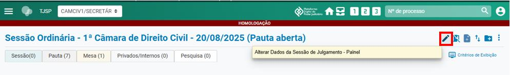

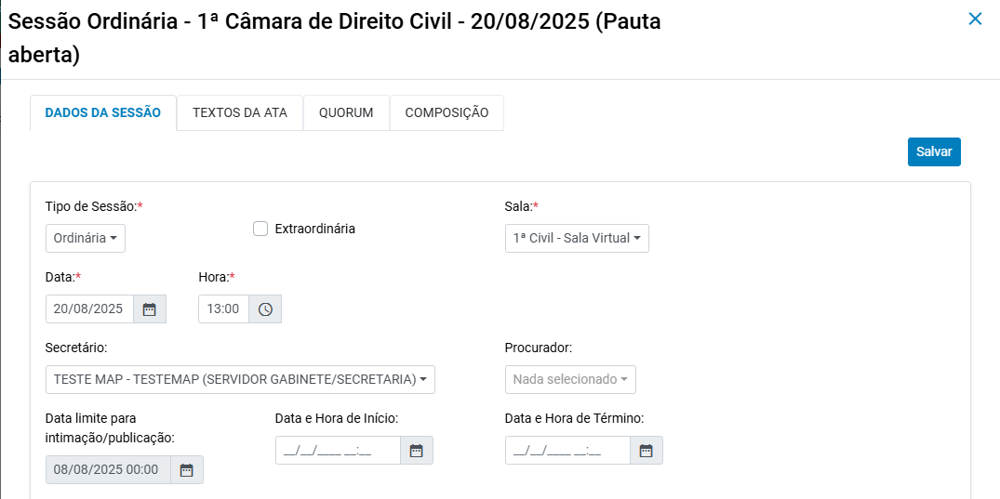

---

EXPEDIR PAUTA E COMPOSIÇÕES

**EPROC PARA SEGUNDO GRAU****–****UNIDADE JUDICIAL****|**Conteúdo integral do curso
<small>**209**</small>
A aba**“TEXTOS DA ATA”**será preenchida após o encerramento da sessão de julgamento.

**FECHAMENTO DA PAUTA**

Conforme a metodologia de trabalho da Câmara e os limites de pauta estabelecidos na criação de

sessão, o(a) responsável pelo secretariado da sessão irá realizar o fechamento da pauta, para que

não seja inserido mais nenhum processo para julgamento.

O fechamento é realizado acionando o ícone**“Fechar a pauta da sessão de julgamento”**,

representado por uma porta com um traço cortando, disponível tanto no**Painel**quanto na tela

**“Sessões de Julgamento”**.
<small>**Descrição da imagem**: destaque ao botão “Fechar a pauta da sessão de julgamento” na tela “Sessões de</small><small>Julgamento”.</small><small>**Descrição da imagem**: destaque ao botão “Fechar a pauta da sessão de julgamento” no Painel da Sessão.</small>
**Importante**

Os gabinetes do Segundo Grau apenas conseguirão inserir processos em mesa com a

pauta de julgamento fechada.

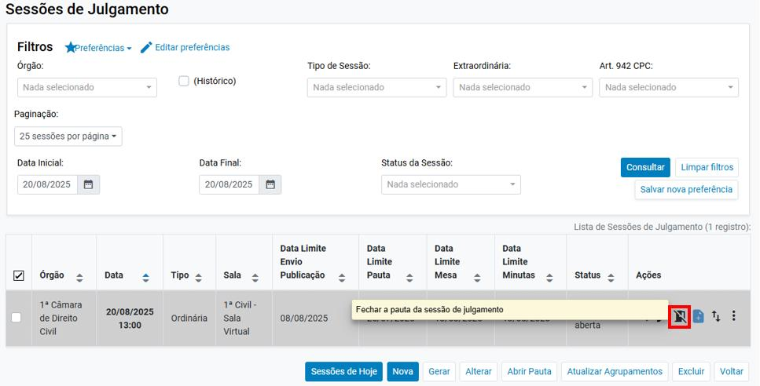

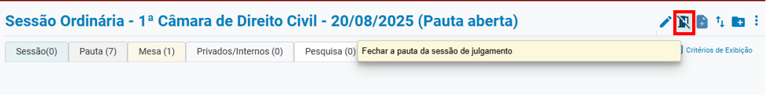

---

EXPEDIR PAUTA E COMPOSIÇÕES

**EPROC PARA SEGUNDO GRAU****–****UNIDADE JUDICIAL****|**Conteúdo integral do curso
<small>**210**</small>
**Quórum da sessão**

Após o fechamento da pauta, seja pela expiração da data ou manualmente como demonstrado,

será possível realizar o cadastro dos magistrados que compõem o quórum de votação na aba

**“QUORUM”**da tela de**“Alterar Dados da Sessão de Julgamento –****Painel”**.

A inclusão dos magistrados que irão compor o julgamento é realizada ao clicar no botão**“Incluir**

**no quórum”**, representado por uma seta para a frente, disponível na coluna**“Incluir”**da linha com

o nome do(a) magistrado(a).

O(a) magistrado(a) selecionado(a) passará a constar no campo**“Magistrados do Quórum”**.
<small>**Descrição da imagem**: aba “QUORUM” com destaque ao ícone “Incluir no quórum” e o campo “Magistrados do</small><small>Quórum” contendo os magistrados participantes da sessão.</small>
O primeiro passo é clicar na caixa de seleção da coluna**“Presidente”**na linha do(a) magistrado(a)

que presidirá a sessão.

Na sequência, verificar a ordem de julgamento em relação aos demais magistrados, realizando as

necessárias modificações na coluna**“Ordem”**.

A coluna**“Ações”**possui os ícones:

▪**Alteração Quórum**: representado por um lápis, altera as informações do(a)

magistrado(a) selecionado(a), inclusive permitindo menção à presença na sessão,

participação eventual e o número de ordem;

▪**Excluir item do Quórum**: representado por uma lixeira, realiza a retirada do(a)

magistrado(a) inserido(a) como participante na sessão.

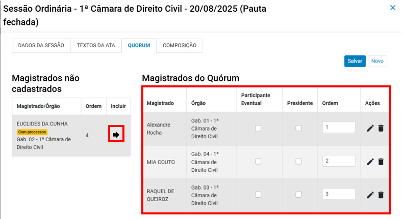

---

EXPEDIR PAUTA E COMPOSIÇÕES

**EPROC PARA SEGUNDO GRAU****–****UNIDADE JUDICIAL****|**Conteúdo integral do curso
<small>**211**</small>
Preenchidas as informações, clicar em**“Salvar”**.
<small>**Descrição da imagem**: destaque à coluna “Ações” e ao botão “Salvar”.</small>
A aba**“COMPOSIÇÃO”**será preenchida com as informações do cadastro realizado na aba

**“QUORUM”**.

**Edição da composição**

A aba**“COMPOSIÇÃO”**da tela de**“Alterar Dados da Sessão de Julgamento –****Painel”**permite a

configuração da composição para o julgamento, conforme o preenchimento da aba**“QUORUM”**.

O primeiro passo é clicar no ícone com símbolo de adição e, na sequência, clicar na coluna**1**na

linha do(a) magistrado(a) presidente da sessão até o preenchimento com o ícone de um martelo

na cor amarela, sinalizando a votação pelo(a) Presidente(a) da Sessão como Relator(a).

Na sequência, clicar na coluna**1**das linhas dos demais magistrados formadores das ordens

subsequentes ao(à) presidente(a) na votação, preenchendo-a com o ícone de uma pessoa.

A coluna referente à composição cadastrada deverá ser mantida com o ícone “**Não participante**”

para os(as) magistrados(as) que não participarão da votação naquela composição.

Caso a composição tenha sido cadastrada de forma equivocada, clicar no ícone representado por

uma lixeira para a exclusão.

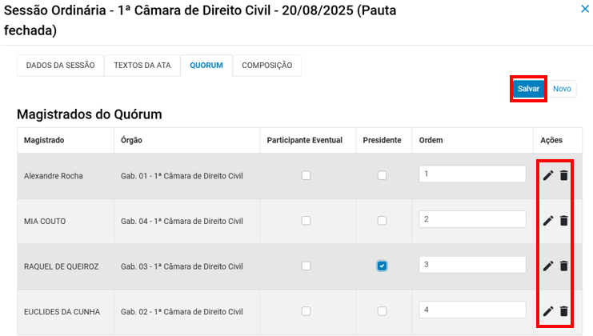

---

EXPEDIR PAUTA E COMPOSIÇÕES

**EPROC PARA SEGUNDO GRAU****–****UNIDADE JUDICIAL****|**Conteúdo integral do curso
<small>**212**</small><small>**Descrição da imagem**: aba “COMPOSIÇÃO” com destaque aos ícones na coluna 1.</small>
As demais composições de julgamento serão cadastradas da mesma forma que a primeira, ou seja,

a partir do acionamento do ícone representado pelo símbolo de adição.

Nas novas composições, caso o Presidente da**sessão de julgamento**não seja votante, preencher

a linha da coluna da composição com o ícone representado por um martelo na cor prata,

sinalizando**“Presidente sem voto”**.

Configuradas todas as possibilidades de composição de julgamento, clicar em**“Salvar”**.
<small>**Descrição da imagem**: composições de julgamento cadastradas, com destaque ao ícone referente ao Presidente sem</small><small>voto e ao botão “Salvar”.</small>
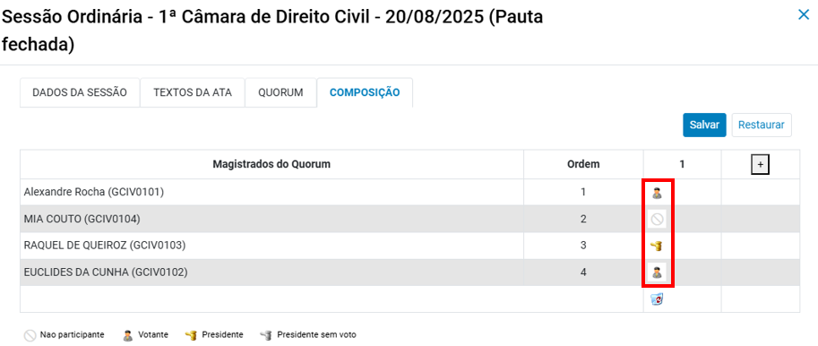

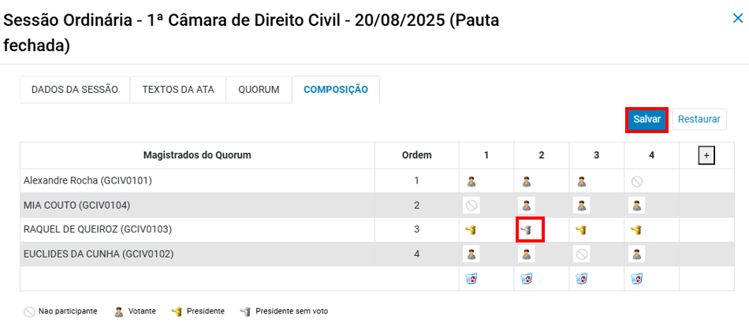

---

EXPEDIR PAUTA E COMPOSIÇÕES

**EPROC PARA SEGUNDO GRAU****–****UNIDADE JUDICIAL****|**Conteúdo integral do curso
<small>**213**</small>
**Gerenciamento da ordem dos gabinetes no colegiado**

A ordem dos gabinetes da Câmara apresentada na aba**“QUORUM”**é cadastrada pelo menu lateral

do eproc, opção**Sessão de Julgamento**>**Gerenciar a ordem dos gabinetes no colegiado**.
<small>**Descrição da imagem**: destaque ao menu lateral, opções” Sessão de Julgamento” e “Gerenciar a ordem dos</small><small>gabinetes no colegiado”.</small>
A tela**“Órgãos”**será aberta com a configuração do**órgão julgador**e a ordem dos gabinetes na

Sessão de Julgamento.
<small>**Descrição da imagem**: tela “Órgãos” com as informações da ordem de julgamento da Câmara.</small>
A alteração da ordem é realizada pela coluna**“Ações”**ao clicar no ícone**“Alterar ordem”**,

representado por uma folha sulfite com um lápis. A exclusão é realizada acionando o item**“Excluir**

**Órgão”**, representado por uma lixeira.
<small>**Descrição da imagem**: destaque ao ícone “Alterar Ordem” disponível na coluna “Ações” da tela Órgãos.</small>
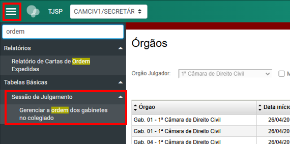

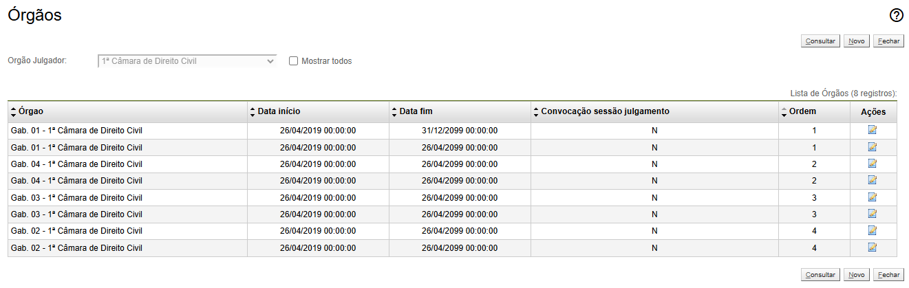

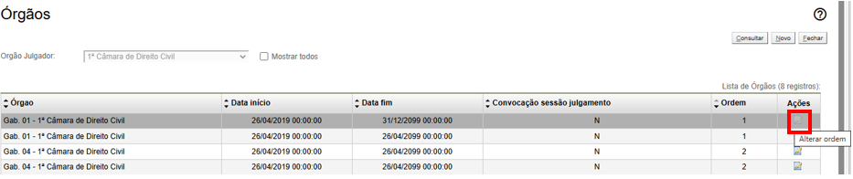

---

EXPEDIR PAUTA E COMPOSIÇÕES

**EPROC PARA SEGUNDO GRAU****–****UNIDADE JUDICIAL****|**Conteúdo integral do curso
<small>**214**</small>
A inclusão de uma nova ordem é realizada ao clicar no botão**“Novo”**.

**GERAR PAUTA DA SESSÃO**

Fechada a pauta e cadastrado o quórum e composição da sessão, o próximo passo será clicar no

botão representado por três pontinhos, disponível tanto na tela**“Sessões de Julgamento”**quanto

no**Painel da Sessão de Julgamento**,e acionar o ícone**“Gerar Pauta da Sessão de Julgamento”**,

representado por uma engrenagem.
<small>**Descrição da imagem**: destaque ao botão representado por três pontinhos e ao ícone “Gerar Pauta da Sessão de</small><small>Julgamento”.</small>
Na tela**“Gerar pauta da Sessão”**, verificar os magistrados e clicar em**“Validar”**. Na sequência,

clicar em**“Gravar”**.
<small>**Descrição da imagem**: janela “Gerar pauta da Sessão” com destaque ao botão “Gravar”.</small>
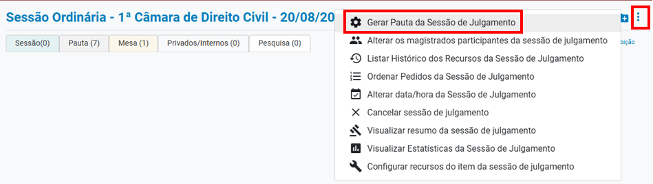

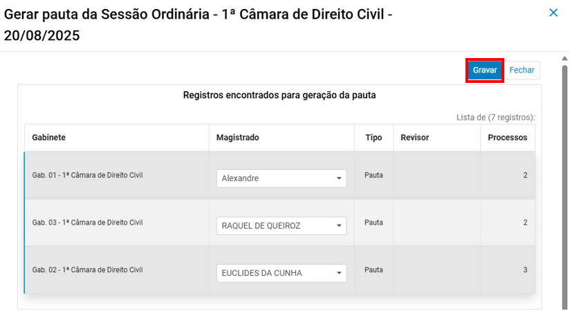

---

EXPEDIR PAUTA E COMPOSIÇÕES

**EPROC PARA SEGUNDO GRAU****–****UNIDADE JUDICIAL****|**Conteúdo integral do curso
<small>**215**</small>
A tela exibirá a possibilidade de outros critérios de ordenação da pauta. Clicar nas caixas de seleção

dos campos**“2º critério de ordenação”**,**“3º critério de ordenação”**e**“4º critério de ordenação”**

a escolha dos demais critérios.

A marcação das caixas de seleção “**Lançar os eventos de inclusão em pauta?**”e “**Publicar a pauta**

**no próximo Diário da Justiça?**” é facultativa, porém facilita as providências posteriores.

Finalizada a geração da pauta, clicar em**“Gerar pauta”**.
<small>**Descrição da imagem**: janela “Gerar pauta” com destaque aos campos preenchidos e ao botão “Gerar pauta”.</small>
**Importante**

Após acionar o botão “Gerar pauta”, as intimações eletrônicas das partes são

realizadas pelo sistema eproc.

**PUBLICAÇÃO DA PAUTA**

A publicação da**pauta da sessão de julgamento**da Câmara do Segundo Grau é realizada ao

acionar, tanto na tela**“Sessões de Julgamento”**quanto no**Painel da Sessão**, o ícone representado

por três pontinhos e, após,**“Publicar Pauta da Sessão de Julgamento”**, representado por uma

nuvem com uma seta para cima.

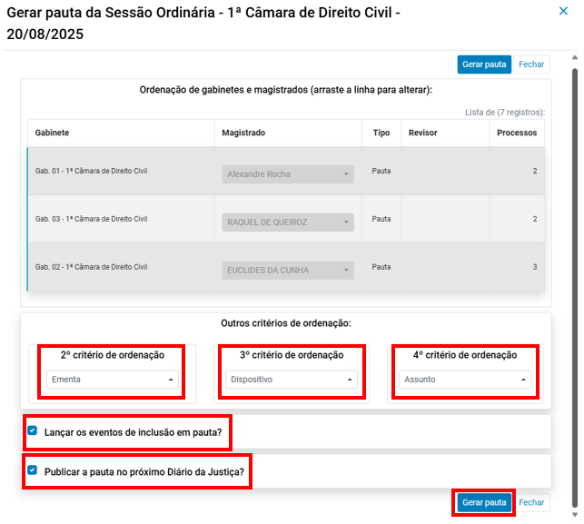

---

EXPEDIR PAUTA E COMPOSIÇÕES

**EPROC PARA SEGUNDO GRAU****–****UNIDADE JUDICIAL****|**Conteúdo integral do curso
<small>**216**</small><small>**Descrição da imagem**: destaque ao ícone “Publicar Pauta da Sessão de Julgamento”.</small>
Na janela aberta, a coluna**“Ações”**conta com três ícones:

▪**Consultar Publicação da Pauta**: representado por uma lupa;

▪**Editar Publicação da Pauta**: representado por um lápis, permite a modificação das

informações inseridas na pauta;

▪**Enviar publicação para o diário eletrônico**: representado por uma nuvem com uma

seta para cima.

Acionado o ícone**“Enviar publicação para o diário eletrônico”**, na janela aberta, preencher o

campo**“Data prevista de disponibilização”**e, na sequência, clicar em**“Enviar”**.
<small>**Descrição da imagem**: destaque aos campos para seleção da “Data prevista de disponibilização” e ao botão “Enviar”.</small>
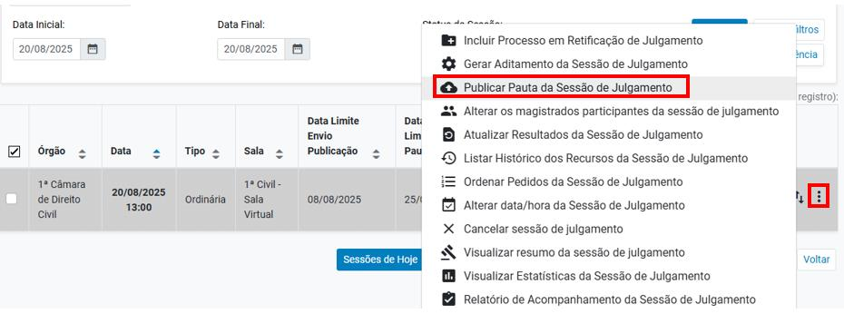

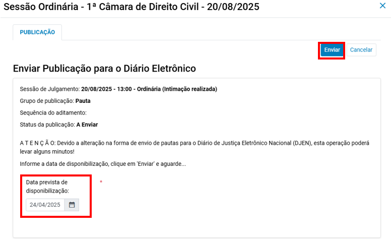

---

EXPEDIR PAUTA E COMPOSIÇÕES

**EPROC PARA SEGUNDO GRAU****–****UNIDADE JUDICIAL****|**Conteúdo integral do curso
<small>**217**</small>
A**pauta da sessão de julgamento**será encaminhada para publicação e os gabinetes da Câmara

conseguirão visualizar os processos dos(das) demais magistrados(as).

Os processos em mesa são sinalizados na linha de processo dentro do**Painel da Sessão de**

**Julgamento**.
<small>**Descrição da imagem**: destaque à sinalização na linha do processo pautado como “Mesa”.</small>
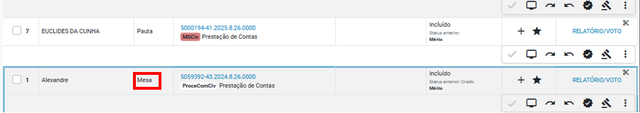

---

IMPEDIMENTOS

**EPROC PARA SEGUNDO GRAU****–****UNIDADE JUDICIAL****|**Conteúdo integral do curso
<small>**218**</small>
# ▪ IMPEDIMENTOS

A verificação de impedimentos na**Pauta da Sessão de Julgamento**é realizada, após o fechamento

e publicação, acessando a aba**“Pauta”**, selecionando todos os processos a serem julgados e, após,

clicando no botão**“Mais”**, opção**“Verificar impedimentos”**, representado por uma lupa com a

letra “xis”.
<small>**Descrição da imagem**: Painel da Sessão com destaque à aba “Pauta”, à seleção de todos os processos, ao botão</small><small>“Mais” e à opção “Verificar impedimentos”.</small>
Na janela**“Impedimentos da Sessão de Julgamento”**, verificar se o campo**“Magistrados a**

**Pesquisar”**está preenchido com os magistrados participantes da sessão. Após, selecionar

novamente os processos e clicar no botão**“Buscar Impedimentos/Suspeições”**:
<small>**Descrição da imagem**: janela “Impedimentos da Sessão de Julgamento” com destaque ao botão “Buscar</small><small>impedimentos/Suspeições”.</small>
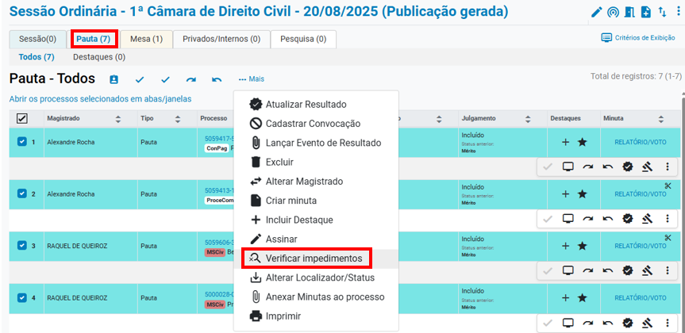

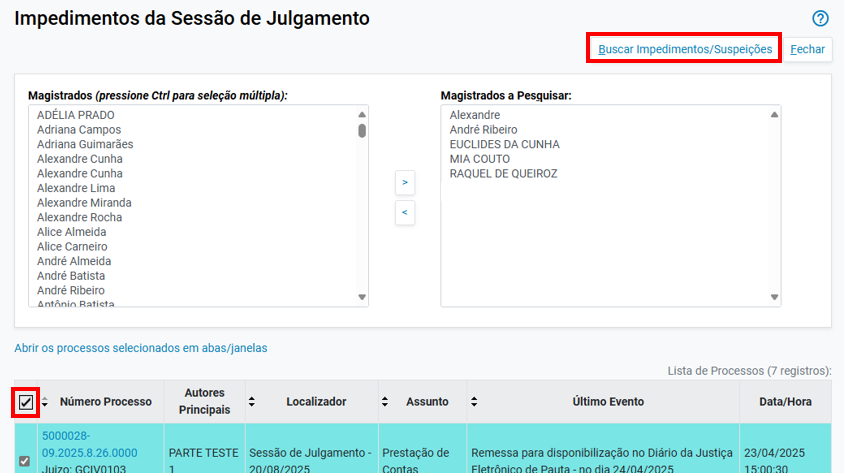

---

IMPEDIMENTOS

**EPROC PARA SEGUNDO GRAU****–****UNIDADE JUDICIAL****|**Conteúdo integral do curso
<small>**219**</small>
A tela indicará a ocorrência do impedimento aos magistrados participantes do julgamento. Clicar

na caixa de seleção**“Gravar impedimento para o magistrado? ”**no impedimento a ser reconhecido

e, na sequência, clicar em**“Gravar”**.
<small>**Descrição da imagem**: destaque à caixa de seleção “Gravar impedimento para o magistrado? ” e ao botão “Gravar”.</small>
O impedimento será gravado e estará disponível para consulta e visualização na aba**“Sessão”**,

opção**“Com apontamentos”**. A lista dos impedimentos cadastrados estará no campo inferior da

tela.
<small>**Descrição da imagem**: Painel da Sessão de Julgamento, aba “Sessão”, opção “Com apontamentos” e destaque ao</small><small>impedimento.</small>
O cadastro do(a) magistrado(a) que substituirá o(a) impedido(a) é realizado ao selecionar a linha

com o impedimento e acionar o ícone**“Mais ações do item”**, representado por três pontinhos e,

após, o ícone**“Cadastrar impedimentos”**, representado por um círculo cortado ao meio.

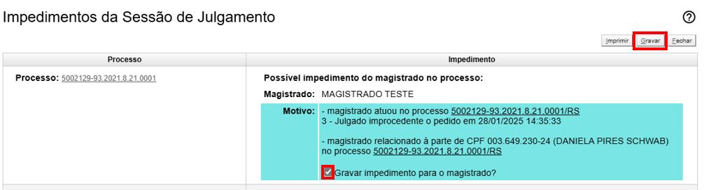

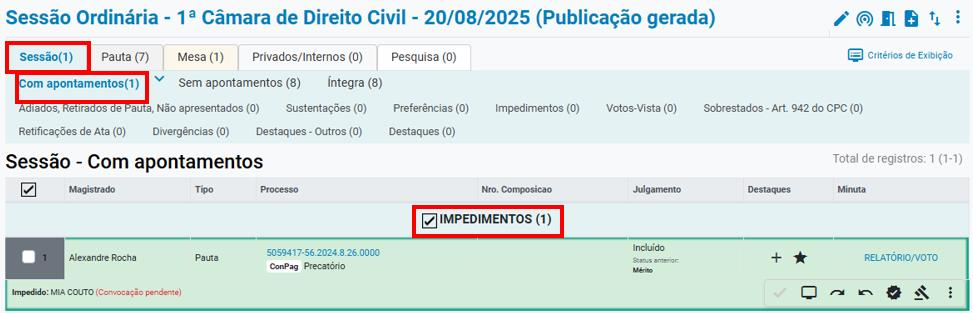

---

IMPEDIMENTOS

**EPROC PARA SEGUNDO GRAU****–****UNIDADE JUDICIAL****|**Conteúdo integral do curso
<small>**220**</small><small>**Descrição da imagem**: destaque ao ícone “Cadastrar impedimentos”.</small>
Na janela aberta, selecionar o(a) magistrado(a) impedido e clicar no ícone**“Alterar impedimento”**,

representado por um lápis, disponível na coluna**“Ações”**.
<small>**Descrição da imagem**: destaque ao ícone “Alterar impedimento”.</small>
Aberta a janela**Alterar Impedimento**, clicar na seta para baixo dos campos**“Magistrado**

**convocado”**e**“Gabinete do magistrado convocado”**e, no menu expansível, selecionar o(a)

magistrado(a) e seu gabinete que substituirão os impedidos.

Após clicar em**“Salvar”**para finalizar o cadastro.

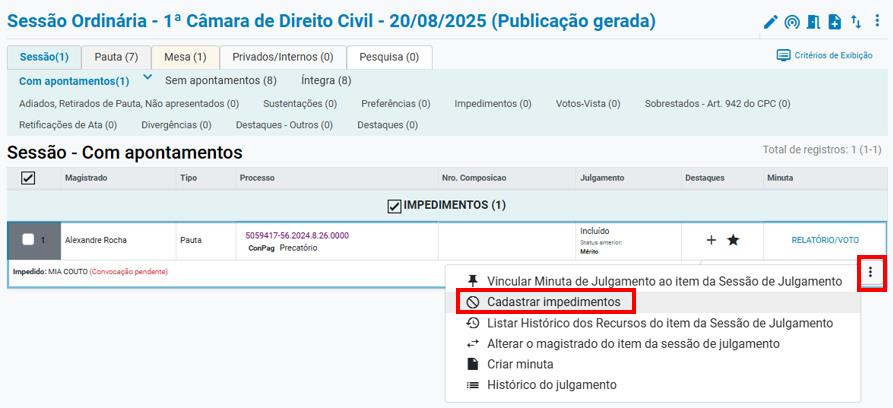

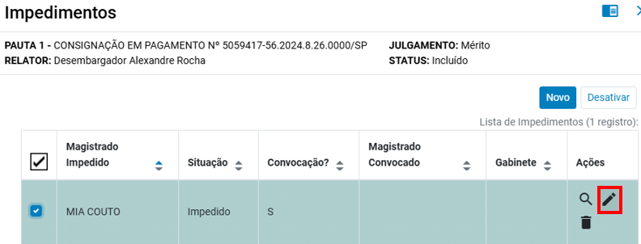

---

IMPEDIMENTOS

**EPROC PARA SEGUNDO GRAU****–****UNIDADE JUDICIAL****|**Conteúdo integral do curso
<small>**221**</small><small>**Descrição da imagem**: janela “Alterar Impedimento”, com destaque aos campos “Magistrado convocado” e</small><small>“Gabinete do magistrado convocado” e ao botão “Salvar”.</small>
**CADASTRO DE IMPEDIMENTOS**

O cadastro de impedimentos dos magistrados é realizado acessando o item**“Cadastrar**

**impedimento Magistrados”**, dentro da categoria**“Impedimento de Magistrados”**do**menu**

**lateral**.
<small>**Descrição da imagem**: itens “Impedimento de Magistrados” e “Cadastrar Impedimento Magistrados” no menu</small><small>lateral do eproc.</small>
Clicar em**“Novo”**e, na tela**“Novo Impedimento/Suspeição de Magistrado”**, clicar na seta para

baixo do campo**“Magistrado”**para selecionar o(a) magistrado(a). Após, clicar na seta para baixo

em**“Tipo de Pessoa”**e selecionar entre**“Pessoa Física”**,**“Pessoa Jurídica”**e**“Pessoa Jurídica –**

**Sociedade de Advogados”**.

Nas novas opções de preenchimento que serão disponibilizadas, escolher entre**“CPF”**,**“OAB”**e

**“Sigla”**e digitar no campo inferior o número do documento ou a sigla.

Clicar em**“Consultar”**para localizar a pessoa e, então, clicar em**“Salvar”**.

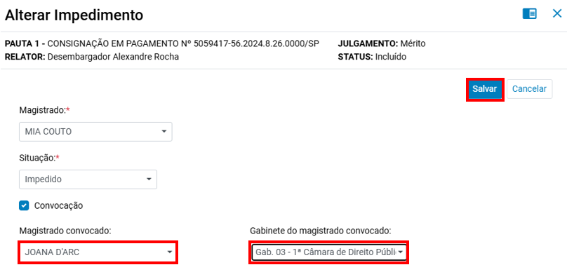

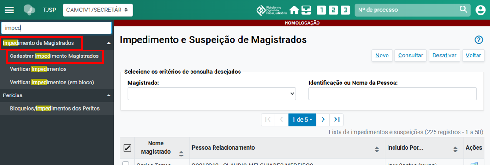

---

IMPEDIMENTOS

**EPROC PARA SEGUNDO GRAU****–****UNIDADE JUDICIAL****|**Conteúdo integral do curso
<small>**222**</small><small>**Descrição da imagem**: tela “Novo Impedimento/Suspeição de Magistrado”.</small>
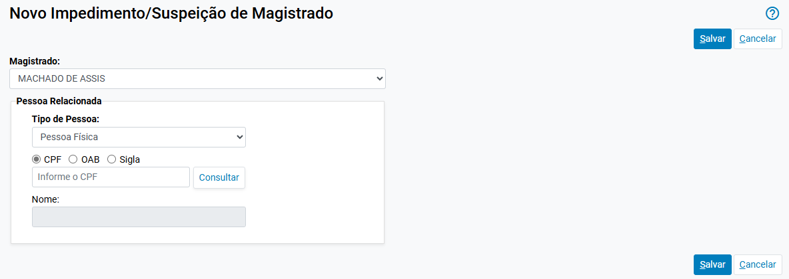

---

INDICAÇÃO DE COMPOSIÇÃO

**EPROC PARA SEGUNDO GRAU****–****UNIDADE JUDICIAL****|**Conteúdo integral do curso
<small>**223**</small>
# ▪ INDICAÇÃO DE COMPOSIÇÃO

A indicação da composição de julgamento na Câmara do Segundo Grau é realizada no**Painel da**

**Sessão de Julgamento**, aba**“Pesquisa”**.

Na seção**“Filtros”**é possível clicar no campo**“Magistrados”**e selecionar o(a) magistrado(a)

relator(a) que se deseja visualizar os processos. Clicar em**“Consultar”**.

No campo inferior, clicar na caixa de seleção com o símbolo de visto para marcar todos os

processos. A indicação da composição é realizada ao clicar no ícone**“Indicar composição”**,

representado por uma pessoa dentro de uma pasta e localizado na barra central da tela.
<small>**Descrição da imagem**: destaque à aba “Pesquisa” e ao botão “Indicar composição”.</small>
A janela**“Indicar composição do item da sessão de julgamento”**será aberta, exibindo as

composições cadastradas para a**sessão de julgamento**. Selecionar a composição aplicável na

hipótese de relatoria do(a) magistrado(a) selecionado(a), e, na sequência, clicar em**“Salvar”**.

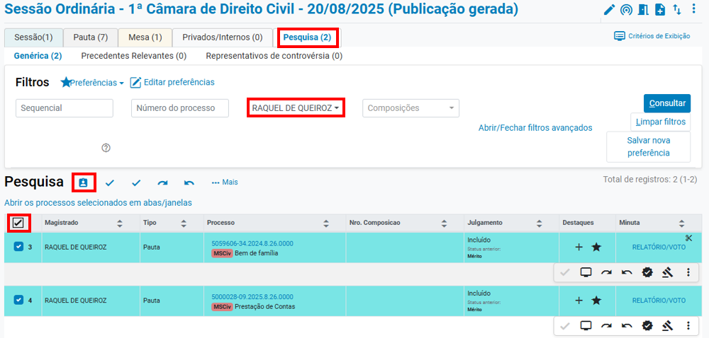

---

INDICAÇÃO DE COMPOSIÇÃO

**EPROC PARA SEGUNDO GRAU****–****UNIDADE JUDICIAL****|**Conteúdo integral do curso
<small>**224**</small><small>**Descrição da imagem**: janela “Indicar composição do item da sessão de julgamento” com destaque à composição</small><small>selecionada e ao botão “Salvar”.</small>
A coluna**“Nro. Composição”**do**Painel da Sessão de Julgamento**passará a exibir a composição

selecionada para cada processo.
<small>**Descrição da imagem**: coluna “Nro. Composição” preenchida com a composição para julgamento.</small>
Na sequência, realizar o mesmo procedimento de filtragem dos processos pelo(a) relator(a) e

indicação da composição, preenchendo a coluna**“Nro. Composição”**em todos os processos da

pauta.

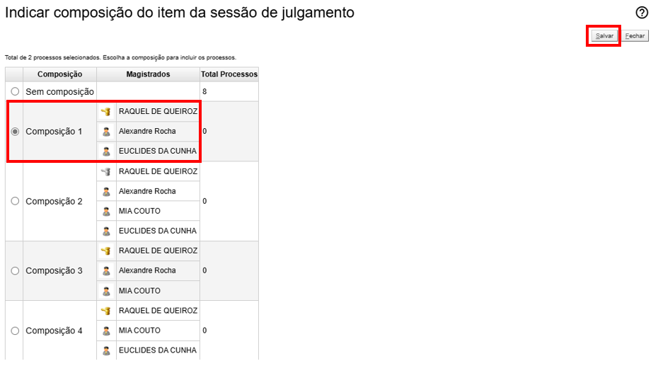

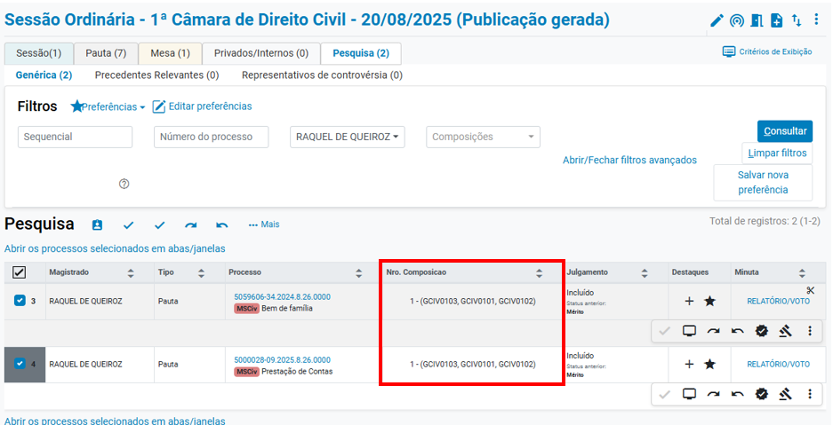

---

SESSÃO DE JULGAMENTO

**EPROC PARA SEGUNDO GRAU****–****UNIDADE JUDICIAL****|**Conteúdo integral do curso
<small>**225**</small>
# ▪ SESSÃO DE JULGAMENTO

**INÍCIO DA SESSÃO DE JULGAMENTO**

Na data e horário agendado para a realização da Sessão de Julgamento de uma das Câmaras do

Segundo Grau, o(a) responsável pelo secretariado acessará o item**“Cronograma de Sessões de**

**Julgamento”**,dentro da categoria**“Sessão de Julgamento”**do**menu lateral**.

Aberta a tela**“Sessões de Julgamento”**,clicar no botão**“Sessões de Hoje”**.
<small>**Descrição da imagem**: tela “Sessões de Julgamento” com destaque ao botão “Sessões de Hoje”.</small>
O campo inferior da tela exibirá apenas a sessão agendada para a data. Na coluna**“Ações”**, clicar

no ícone**“Abrir a Sessão de Julgamento”**, representado por uma porta, para alterar o*status*da

sessão para**“Sessão aberta”**e iniciar os procedimentos de julgamento.
<small>**Descrição da imagem**: coluna “Ações” da tela “Sessão de Julgamento” com destaque ao ícone “Abrir a Sessão de</small><small>Julgamento”.</small>

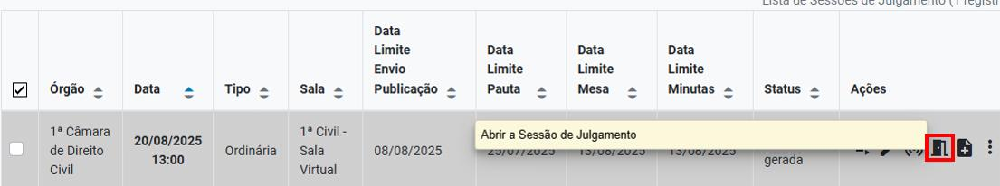

---

SESSÃO DE JULGAMENTO

**EPROC PARA SEGUNDO GRAU****–****UNIDADE JUDICIAL****|**Conteúdo integral do curso
<small>**226**</small>
Abrindo o**Painel**da**Sessão de Julgamento**, constará a informação**“Sessão aberta”**no topo da

tela e, ao se acessar a aba**“Pauta”**, os destaques realizados pelos magistrados estarão sinalizados

na coluna**“Destaques”**.
<small>**Descrição da imagem**: Painel da Sessão de Julgamento com a informação “Sessão aberta”, destaque à coluna</small><small>“Destaques” com as informações lançadas pelos magistrados antes da sessão.</small>
O(a) responsável pelo secretariado da sessão poderá também utilizar a aba**“Sessão”**e escolher a

opção de filtro**“Íntegra”**para observar a pauta como um todo, com separação dos processos em

relação à existência de**DIVERGÊNCIAS**, além de outros**DESTAQUES**, como a inclusão de voto e

processos**SEM APONTAMENTOS**.

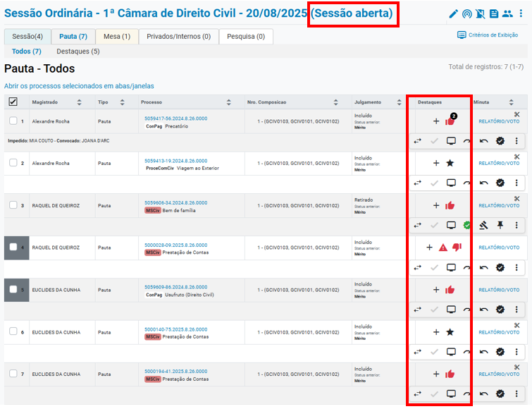

---

SESSÃO DE JULGAMENTO

**EPROC PARA SEGUNDO GRAU****–****UNIDADE JUDICIAL****|**Conteúdo integral do curso
<small>**227**</small><small>**Descrição da imagem**: aba “Sessão” com o filtro “Íntegra” selecionado, exibindo processos separados conforme a</small><small>existência de destaques ou votação sem apontamentos.</small>
A aba**“Sessão”**conta também com a opção de filtro**“Com apontamentos”**, em que haverá a

separação dos processos conforme os apontamentos indicados na votação ou ocorrência de

eventuais**“Impedimentos”**.
<small>**Descrição da imagem**: aba “Sessão” com o filtro “Com apontamentos” selecionado, exibindo os apontamentos</small><small>realizados nos processos.</small>

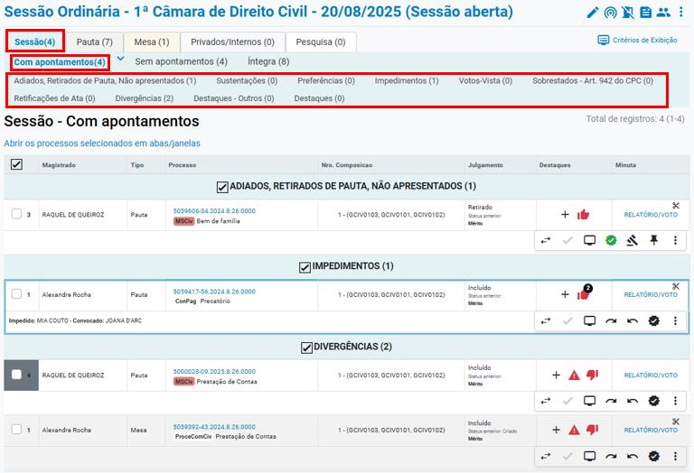

---

SESSÃO DE JULGAMENTO

**EPROC PARA SEGUNDO GRAU****–****UNIDADE JUDICIAL****|**Conteúdo integral do curso
<small>**228**</small>
A configuração dos agrupamentos apresentados na aba**“Sessão”**, opção de filtro**“Com**

**apontamentos”**é realizada pela tela**“Tipos de agrupamento do órgão”**, acessada pelo menu

lateral do eproc, opção**Sessão de Julgamento**>**Tipos de agrupamento do órgão**.

A edição da ordem e precedência é realizada ao clicar no ícone**“Alterar Tipo de agrupamento do**

**órgão”**, representado por uma folha sulfite com um lápis, disponível na coluna**“Ações”**.
<small>**Descrição da imagem**: destaque ao ícone “Alterar Tipo de agrupamento do órgão” da coluna “Ações” e à opção</small><small>“Tipos de agrupamento do órgão” do menu lateral.</small>
**REALIZAÇÃO DA SESSÃO**

As sessões de julgamento são realizadas conforme a metodologia de trabalho de cada**Câmara**do

Segundo Grau. Uma sugestão é que o(a) responsável pelo secretariado combine com os

magistrados a ordem em que as abas serão trabalhadas, ou seja, a ordem do julgamento dos

processos.

Os gabinetes dos magistrados poderão acompanhar a realização da sessão a partir das abas

disponibilizadas no painel, em especial as abas**“Sessão”**,**“Pauta”**e**“Mesa”**, esta última contendo

os processos encaminhados para julgamento com a opção**“Mesa”**.

A sinalização do processo que está sendo julgado é realizada ao acionar o botão**“Marcar item**

**como em julgamento”**, representado por uma televisão, disponível no menu inferior da linha do

processo. Realizado o julgamento será possível clicar sobre o ícone para retirar a marcação.

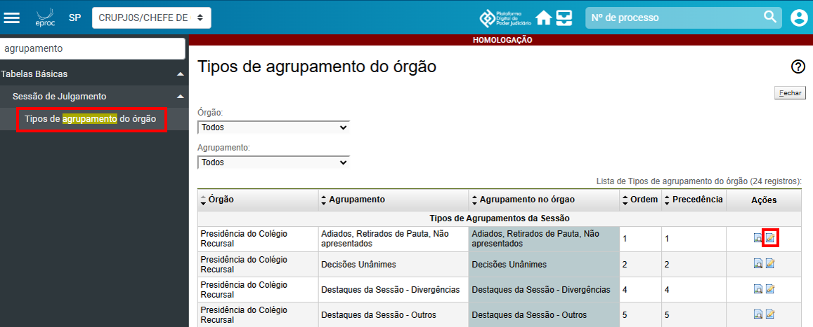

---

SESSÃO DE JULGAMENTO

**EPROC PARA SEGUNDO GRAU****–****UNIDADE JUDICIAL****|**Conteúdo integral do curso
<small>**229**</small><small>**Descrição da imagem**: ícone “Marcar item como em julgamento”.</small>
Caso o gabinete do(a) magistrado não tenha visualizado a minuta do(a) relator(a) antes da**Sessão**

**de Julgamento**, o acesso pode ser feito ao clicar em**“RELATÓRIO/VOTO”**,presente na coluna

**“Minuta”**da linha do processo. Com isso, a minuta será exibida conforme o**“Critério de exibição”**

selecionado.
<small>**Descrição da imagem**: destaque ao link presente na coluna “Minutas” e a exibição da minuta no Painel.</small>
**Cadastro de sustentação oral e preferência**

O cadastro de pedido de sustentação oral ou preferência é realizado pela coluna**“Pedidos”**da

linha do processo em julgamento, acionando o ícone**“Cadastrar Pedido no Item da Sessão de**

**Julgamento”**, representado por um símbolo de adição.
<small>**Descrição da imagem**: destaque ao ícone “Cadastrar Pedido no Item da Sessão de Julgamento”.</small>

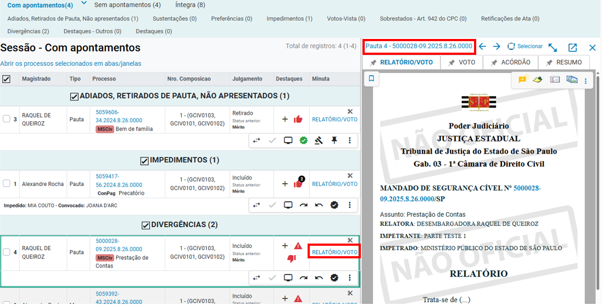

---

SESSÃO DE JULGAMENTO

**EPROC PARA SEGUNDO GRAU****–****UNIDADE JUDICIAL****|**Conteúdo integral do curso
<small>**230**</small>
Caso a coluna**“Pedidos”**não esteja disponível no**Painel da Sessão de Julgamento**, clicar no ícone

**“Critérios de Exibição”**, localizado no lado direito da tela, e, no menu aberto, clicar em**“Colunas a**

**exibir”**e marcar a opção**“Pedidos”**.

Com isso, a coluna**“Pedidos”**passará a ser exibida no**Painel da Sessão de Julgamento**.
<small>**Descrição da imagem**: janela Critérios de exibição com destaques a opção “Colunas a exibir” e a coluna “Pedidos”</small><small>selecionada.</small>
Após acionar o ícone**“Cadastrar Pedido no Item da Sessão de Julgamento”**, representado por um

símbolo de adição, a janela**“Novo Pedido”**será aberta.

Clicar na seta para baixo do campo**“Tipo de Pedido”**e selecionar entre as opções**“Sustentação**

**Oral por Videoconferência”**e**“Sustentação Oral Presencial”**. Também será possível registrar na

mesma tela pedido de**“Preferência”**,selecionando a respectiva opção.
<small>**Descrição da imagem**: janela “Novo Pedido” com destaque ao campo “Tipo de Pedido”.</small>
Na sequência, clicar na seta para baixo nos campos**“Parte”**e**“Procurador”**e selecionar a parte e

o procurador que realizará a sustentação oral.

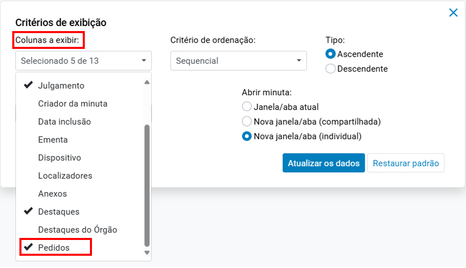

---

SESSÃO DE JULGAMENTO

**EPROC PARA SEGUNDO GRAU****–****UNIDADE JUDICIAL****|**Conteúdo integral do curso
<small>**231**</small>
Caso o pedido seja confirmado, marcar a caixa de seleção**“Pedido Confirmado”**. Por fim, clicar em

**“Salvar”**.
<small>**Descrição da imagem**: destaque aos campos “Pedido Confirmado”, “Parte” e “Procurador”, além do botão “Salvar”.</small>
Os casos de**“Preferência”**são cadastrados com o mesmo preenchimento dos campos na tela

**“Novo Pedido”**, apenas selecionado a opção**“Preferência”**no campo**“Tipo de Pedido”**.

As linhas do processo com pedido cadastrado apresentarão na coluna**“Pedidos”**ícones de

sinalização. As**sustentações orais**são representadas por um ícone de uma pessoa falando e as

**preferências**, por um triângulo.
<small>**Descrição da imagem**: processo contendo os ícones de sustentação oral e preferência cadastrados.</small>
A ordenação dos pedidos cadastrados é realizada ao clicar no ícone**“Mais ações”**, representado

por três pontinhos, acionando a opção**“Ordenar Pedidos da Sessão de Julgamento”**,

representado por uma lista.

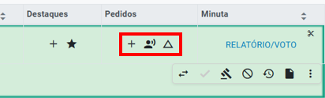

---

SESSÃO DE JULGAMENTO

**EPROC PARA SEGUNDO GRAU****–****UNIDADE JUDICIAL****|**Conteúdo integral do curso
<small>**232**</small><small>**Descrição da imagem**: destaque ao ícone “Mais ações” e à opção “Ordenar Pedidos da Sessão de Julgamento”.</small>
A janela referente aos pedidos cadastrados será aberta, permitindo a alteração da ordem dos

pedidos, utilizando-se o botão disponível no canto direito da coluna ou clicando-se e arrastando-

se com o mouse para cima ou para baixo, entre os pedidos cadastrados.

Na sequência, clicar em**“Confirmar todos”**para salvar a ordem dos pedidos.
<small>**Descrição da imagem**: janela sobre os pedidos contendo destaque ao ícone para modificação da ordem dos pedidos</small><small>na pauta.</small>
**Consulta de memoriais**

Os advogados das partes recorrentes poderão apresentar memoriais nos processos submetidos à

**sessão de julgamento**, utilizando o tipo de petição**“Memoriais”**.

Com a realização do peticionamento e lançamento do correspondente evento no processo, a

coluna**“Destaques”**,da linha do processo no**Painel da Sessão de Julgamento**,apresentará o ícone

**“Memoriais”**, representado por uma folha de papel dobrada.
<small>**Descrição da imagem**: coluna “Destaques” contendo o ícone “Memoriais”.</small>
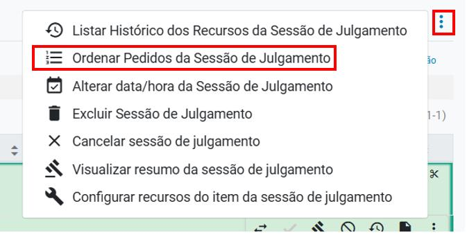

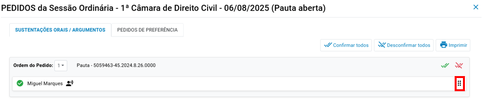

---

SESSÃO DE JULGAMENTO

**EPROC PARA SEGUNDO GRAU****–****UNIDADE JUDICIAL****|**Conteúdo integral do curso
<small>**233**</small>
Os gabinetes dos(as) magistrados(as) poderão identificar a presença do memorial a partir do ícone

presente na coluna**“Destaques”**e, ainda, clicar no*link*disponível no número do processo para

poder visualizar a peça do**memorial**e, eventualmente, efetuar alguma sinalização na votação.

**Alterações e destaques durante a sessão pelo gabinete**

O gabinete do(a) magistrado(a) poderá realizar alterações ou a inclusão de destaques durante a

**Sessão de Julgamento**, com os mesmos passos realizados na fase de revisão, após a

disponibilização das minutas pelos relatores.

O eproc permite a realização de alterações em momento posterior a sessão, mas é necessária a

atenção nos seguintes pontos:

▪ cuidado redobrado no momento da assinatura das minutas;

▪ efetuar alterações da realização da assinatura da minuta modificada.

**ATUALIZAÇÃO DO RESULTADO DO**

**JULGAMENTO**

O(a) responsável pelo secretariado da sessão poderá realizar a alteração do resultado do

julgamento da**Pauta**da**Sessão de Julgamento**individualmente, em razão das conclusões dos

magistrados na apreciação do caso.

A alteração é realizada ao clicar no ícone**“Atualizar Resultado de Julgamento”**, representado por

um símbolo de verificação disponível na linha do processo julgado.
<small>**Descrição da imagem**: destaque ao ícone “Atualizar Resultado de Julgamento”.</small>
Uma nova aba do navegador será aberta constando as informações da votação realizada, inclusive

destacando a votação registrada até o momento no lado direito da tela.

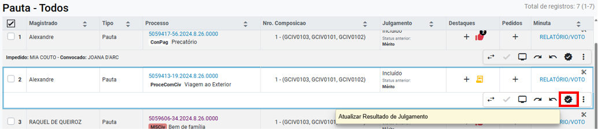

---

SESSÃO DE JULGAMENTO

**EPROC PARA SEGUNDO GRAU****–****UNIDADE JUDICIAL****|**Conteúdo integral do curso
<small>**234**</small>
A modificação do voto do(a) magistrado(a) é realizada ao clicar na caixa de seleção localizada na

frente do número de ordem do(a) magistrado(a) votante e, após, clicar na seta para baixo e

selecionar dentre as opções:

▪ Adicionar divergência;

▪ Pedido de Vista;

▪ Impedido;

▪ Suspeito;

▪ Acompanha o relator.

Também existe a possibilidade de clicar e arrastar o resultado constante no lado direito da tela e

posicioná-lo sobre o outro resultado, fazendo, por exemplo, um voto que acompanhava a

divergência se tornar um acompanhamento ao relator.

Clicar no voto do(a) magistrado que estava em**“Acompanham a Divergência”**e arrastá-lo até a

posição de**“Acompanham o Relator”**.

Preenchidos e configurados os votos, alimentar o campo**“Resultado de Julgamento”**, clicando na

seta para baixo e selecionando uma das opções disponíveis. Após, acionar**“Salvar previsão de**

**resultado”**.

A opção**“Salvar Resultado”**apenas deve ser acionada quando encerrada a votação; já a opção

**“Salvar apenas votantes”**deve ser selecionada quando a votação for interrompida durante a

**Sessão de Julgamento**, como ocorre em casos de intervalos.
<small>**Descrição da imagem**: tela de atualização do resultado do julgamento com destaque aos campos utilizados para a</small><small>modificação.</small>

---

SESSÃO DE JULGAMENTO

**EPROC PARA SEGUNDO GRAU****–****UNIDADE JUDICIAL****|**Conteúdo integral do curso
<small>**235**</small>
O símbolo de verificação ficará com o fundo laranja e, ao posicionar o cursor do mouse sobre ele,

exibirá a informação**“Previsão do Resultado de Julgamento”**.
<small>**Descrição da imagem**: ícone “Previsão de Resultado de Julgamento” laranja após das informações lançadas.</small>
**ADIAMENTOS E RETIRADA DA PAUTA**

Caso, durante a realização da sessão de julgamento, ocorra o adiamento da votação de

determinado processo, o(a) responsável pelo secretariado da**Sessão de Julgamento**deverá

localizar o processo no**Painel da Sessão**e acionar o ícone**“Adiar o julgamento”**, representado por

uma seta apontada para frente.
<small>**Descrição da imagem**: ícone “Adiar o julgamento” presente na barra de atividades da linha do processo.</small>
A janela**“Adiar item da sessão de julgamento”**será aberta. Em**“Tipo de adiamento”**,selecionar

entre**“Adiado”**e**“Adiado nos termos do Art. 935”**. Após, clicar em**“Salvar”**.
<small>**Descrição da imagem**: janela “Adiar item da sessão de julgamento”, destaque ao campo “Tipo de adiamento” e ao</small><small>botão “Salvar”.</small>
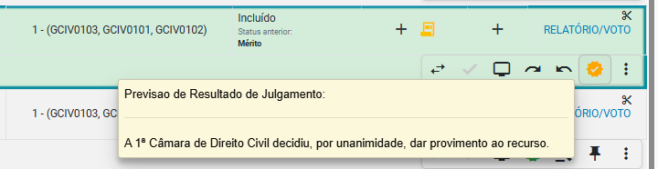

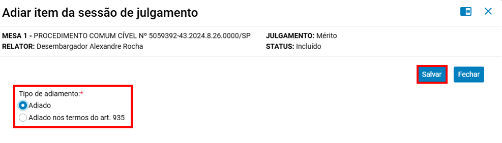

---

SESSÃO DE JULGAMENTO

**EPROC PARA SEGUNDO GRAU****–****UNIDADE JUDICIAL****|**Conteúdo integral do curso
<small>**236**</small>
A coluna**“Julgamento”**passará a exibir a informação**“Adiado”**na linha do processo.

Já a retirada de processo da**pauta**da**Sessão de Julgamento**é realizada ao clicar no ícone**“Retirar**

**de pauta”**, representado por uma seta para trás, presente na linha do processo na pauta.
<small>**Descrição da imagem**: ícone “Retirar de pauta” presente na barra de atividades da linha do processo.</small>
Uma janela de confirmação da retirada de pauta surgirá no navegador. Clicar em**“OK”**.

A coluna**“Julgamento”**passará a exibir a informação**“Retirado”**na linha do processo. O gabinete

do(a) relator(a) deverá incluir posteriormente o processo em uma nova pauta.
<small>**Descrição da imagem**: coluna “Julgamento” com destaque à informação “Retirado”.</small>
**FINALIZAÇÃO EM LOTE DA SESSÃO DE**

**JULGAMENTO**

O(a) responsável pelo secretariado da**Sessão de Julgamento**poderá realizar a finalização do

julgamento em lote, clicando no ícone**“Mais ações”**, representado por três pontinhos localizados

no lado direito superior do**Painel da Sessão de Julgamento**; e selecionar a opção**“Atualizar**

**Resultados da Sessão de Julgamento”**, representado por uma folha de sulfite com um símbolo de

retornar dentro.
<small>**Descrição da imagem**: Painel da Sessão de Julgamento com destaque ao ícone “Mais opções” e à opção “Atualizar</small><small>Resultados da Sessão de Julgamento”.</small>

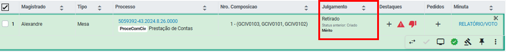

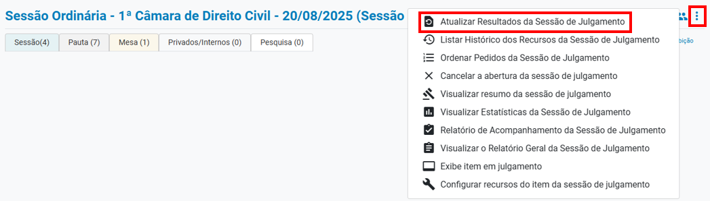

---

SESSÃO DE JULGAMENTO

**EPROC PARA SEGUNDO GRAU****–****UNIDADE JUDICIAL****|**Conteúdo integral do curso
<small>**237**</small>
O eproc agrupará os resultados parecidos na tela**“Atualização de Resultados da Sessão de**

**Julgamento”**.

**Agrupamentos com atualização individual**

Os agrupamentos em que houve a atualização individual do resultado e este está pendente de

confirmação serão sinalizados com o ícone**“Confirmar previsão de resultado”**, representado por

um símbolo de verificação laranja na coluna**“Ações”**.

A coluna também possuirá os ícones**“Atualização Individual”**,representado por um símbolo de

verificação preto, e**“Excluir resultados”**, representado por uma lixeira.
<small>**Descrição da imagem**: destaque a agrupamento e aos ícones na coluna “Ações”.</small>
A confirmação do resultado é realizada ao clicar no ícone**“Confirmar previsão de resultado”**,

representado por um símbolo de verificação laranja. Na janela aberta, clicar em**“Confirmar**

**previsão”**.
<small>**Descrição da imagem**: janela para confirmação da previsão de resultado de julgamento.</small>
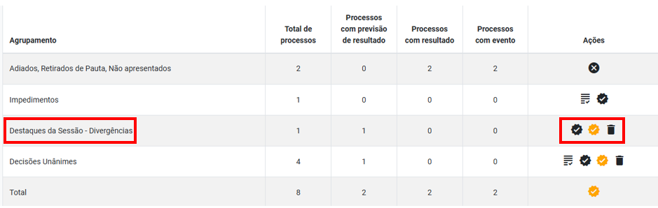

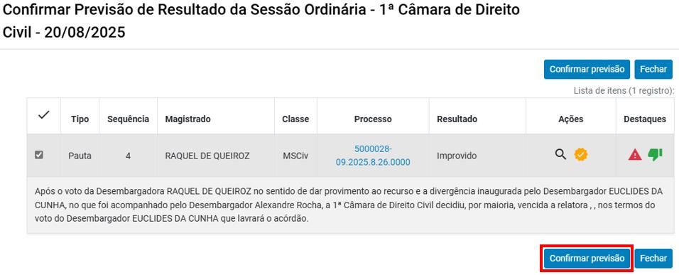

---

SESSÃO DE JULGAMENTO

**EPROC PARA SEGUNDO GRAU****–****UNIDADE JUDICIAL****|**Conteúdo integral do curso
<small>**238**</small>
A coluna**“Ações”**passará a apresentar o ícone**“Lançar eventos”**, representado por um clip.
<small>**Descrição da imagem**: destaque ao ícone “Lançar eventos” da coluna “Ações” do agrupamento.</small>
**Lançamento de resultado em lote de determinado agrupamento**

O lançamento dos resultados em lote de determinado**agrupamento**é realizado ao clicar no ícone

**“Atualizar em Bloco”**, representado por uma folha de papel com o símbolo de verificação no canto

inferior direito, presente na coluna**“Ações”**.
<small>**Descrição da imagem**: destaque a agrupamento com o botão “Atualizar em bloco”, disponível na coluna “Ações”.</small>
Aberta a nova janela, a opção**“Ver processos”**exibirá os processos listados no agrupamento. Caso

seja necessário, clicar na seta para baixo nos campos**“Tipo de Julgamento”**e**“Resultado de**

**julgamento”**e, no menu expansível, selecionar a opção aplicável ao julgamento.

Após, clicar em**“Salvar resultado”**.

---

SESSÃO DE JULGAMENTO

**EPROC PARA SEGUNDO GRAU****–****UNIDADE JUDICIAL****|**Conteúdo integral do curso
<small>**239**</small><small>**Descrição da imagem**: campos referentes ao agrupamento preenchidos e destaque ao botão “Salvar resultado”.</small>
A coluna**“Ações”**passará a apresentar o ícone**“Lançar eventos”**, representado por um clip.
<small>**Descrição da imagem**: destaque ao ícone “Lançar eventos” da coluna “Ações” do agrupamento.</small>
**Lançamento de resultado individual no agrupamento.**

Caso o agrupamento apresente na coluna**“Ações”**apenas o ícone**“Atualização Individual”**,

representado por um símbolo de verificação, será necessário o lançamento individual do resultado

do julgamento.

Após clicar no ícone, será aberta a janela**“Atualização dos Resultados”**, apresentando na coluna

**“Destaques”**as circunstâncias do julgamento.

No exemplo dado, houve uma divergência no julgamento e um magistrado acompanhou a

divergência. O(a) responsável pelo secretariado da**Sessão de Julgamento**deverá clicar no ícone

**“Atualizar resultado de Julgamento”**, presente na coluna**“Ações”**da janela.

---

SESSÃO DE JULGAMENTO

**EPROC PARA SEGUNDO GRAU****–****UNIDADE JUDICIAL****|**Conteúdo integral do curso
<small>**240**</small><small>**Descrição da imagem**: tela “Atualizar Resultados da Sessão” com destaque ao ícone “Atualizar Resultado de</small><small>Julgamento”.</small>
Uma nova aba do navegador será aberta para o lançamento do resultado do julgamento. No caso,

o campo**“Acompanham Divergência”**possui os dois votos e o**resultado da sessão**já está

preenchido com a informação “**decidiu, por maioria, vencido o relator****”**.

Na sequência, por estar próximo ao encerramento da sessão, clicar em**“Salvar resultado”**.
<small>**Descrição da imagem**: aba do navegador com a tela de alteração do resultado do julgamento.</small>
A janela**“Atualizar Resultados da Sessão”**terá o ícone representado por um símbolo de

verificação verde, sinalizando o**resultado de julgamento**ao se passar o mouse sobre ele.

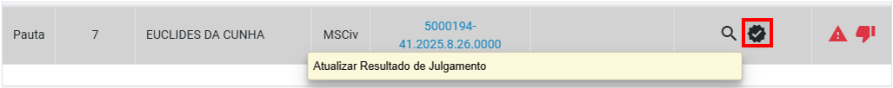

---

SESSÃO DE JULGAMENTO

**EPROC PARA SEGUNDO GRAU****–****UNIDADE JUDICIAL****|**Conteúdo integral do curso
<small>**241**</small><small>**Descrição da imagem**: janela “Atualizar Resultado da Sessão” com destaque ao ícone “Resultado do Julgamento”na</small><small>coluna “Ações”.</small>
Fechada a janela, retornando à tela inicial, a coluna**“Ações”**passará a apresentar o ícone**“Lançar**

**eventos”**, representado por um clip.
<small>**Descrição da imagem**: destaque ao ícone “Lançar eventos” da coluna “Ações” do agrupamento.</small>
**LANÇAMENTO DE EVENTOS**

Após o cadastramento dos resultados do julgamento na Sessão do Julgamento, o lançamento dos

eventos nos processos é realizado por meio do ícone**“Lançar eventos”**, representado por um clip.

O ícone está presente:

▪ na barra de atividades de cada processo no**Painel da Sessão de Julgamento;**

▪ na tela**“Atualização de Resultados da Sessão”**: após a verificação e análise pelo(a)

responsável pelo secretariado da sessão. Sugere-se a utilização por esse caminho para

a realização do trabalho em lote.

Com os agrupamentos verificados e regularizados, clicar no ícone**“Lançar eventos”**, representado

por um clip, disponível na coluna**“Ações”**da linha**“Total”**.

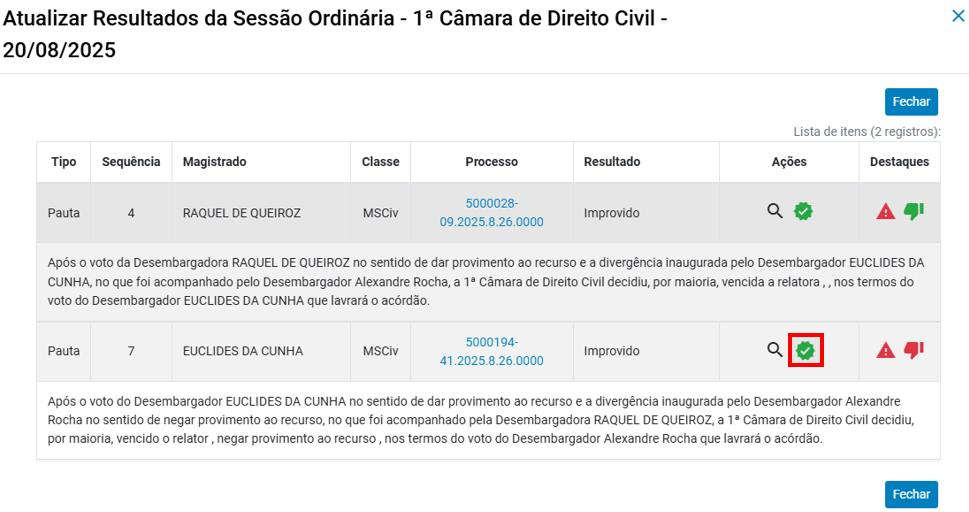

---

SESSÃO DE JULGAMENTO

**EPROC PARA SEGUNDO GRAU****–****UNIDADE JUDICIAL****|**Conteúdo integral do curso
<small>**242**</small><small>**Descrição da imagem**: tela “Atualização de Resultados da Sessão” com destaque ao ícone “Lançar eventos”.</small>
A janela**“Lançar Eventos de Resultado da Sessão”**será aberta e apresentará os processos da pauta

e o resultado cadastrado. Clicar em**“Abrir/Fechar Gerenciamento de Localizador”**para o

gerenciamento dos localizadores dos processos, conforme o método de trabalho da Câmara.

Clicar em**“Lançar eventos”**para a inclusão dos eventos no processo.
<small>**Descrição da imagem**: janela “Lançar Eventos de Resultado da Sessão” com destaque aos campos para o</small><small>lançamento dos eventos.</small>

---

SESSÃO DE JULGAMENTO

**EPROC PARA SEGUNDO GRAU****–****UNIDADE JUDICIAL****|**Conteúdo integral do curso
<small>**243**</small><small>**Descrição da imagem**: evento do julgamento realizado pela Câmara lançado no processo.</small>
**Pedidos de vista**

Os processos com pedido de vista deverão ser atualizados individualmente, no momento da

realização do lançamento do evento.

Na sequência, o gabinete do(a) Relator(a) deverá realizar o envio do processo ao gabinete do(a)

magistrado(a) que solicitou a vista do processo.

Após a análise e apreciação da vista, o último gabinete deverá realizar uma remessa de devolução

ao(à) Relator(a) solicitando que seja incluído em pauta, a fim de que na sessão conste a informação

igual aos demais processos, ou seja, o(a) Relator(a) incluindo o processo em pauta.

O gabinete do(a) Relator(a) deverá incluir em pauta ou mesa novamente o processo, conforme o

método de trabalho da Câmara.

**CANCELAMENTO DO RESULTADO DO**

**JULGAMENTO**

O**cancelamento**do evento do resultado de julgamento não é realizado pela capa do processo,

mas apenas no**Painel**da**Sessão de Julgamento**, localizando o processo com o evento a ser

cancelado, clicando no ícone**“Mais ações do item”**e selecionando a opção**“****Cancelar o evento de**

**resultado de julgamento do item”**, representado pela letra “xis”.
<small>**Descrição da imagem**: destaque ao ícone “Mais ações do item” e à opção “Cancelar o evento de resultado de</small><small>julgamento do item”.</small>

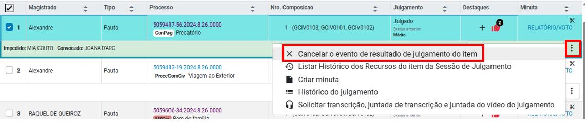

---

SESSÃO DE JULGAMENTO

**EPROC PARA SEGUNDO GRAU****–****UNIDADE JUDICIAL****|**Conteúdo integral do curso
<small>**244**</small>
**RESUMO DO ITEM DA SESSÃO**

Com o lançamento dos eventos de julgamento, as linhas dos processos no**Painel da Sessão de**

**Julgamento**passarão a exibir o ícone**“Visualizar resumo do item da sessão de julgamento”**,

representado por um martelo.
<small>**Descrição da imagem**: ícone “Visualizar resumo do item da sessão de julgamento”, representado por um martelo.</small>
Ao clicar no ícone, será apresentada uma janela com o**“Resumo do item”**, contendo todo o

conteúdo da votação cadastrada.
<small>**Descrição da imagem**: janela “Resumo do Item”.</small>
As mesmas informações poderão ser visualizadas ao clicar no*link*presente em

**“RELATÓRIO/VOTO”**da coluna**“Minuta”**e, com as opções exibidas, clicar na aba**“RESUMO”**.

---

SESSÃO DE JULGAMENTO

**EPROC PARA SEGUNDO GRAU****–****UNIDADE JUDICIAL****|**Conteúdo integral do curso
<small>**245**</small><small>**Descrição da imagem**: aba “Resumo” acessada a partir do*link*disponível na coluna “RELATÓRIO/VOTO”.</small>
**ENCERRAMENTO DA SESSÃO DE**

**JULGAMENTO**

Realizados a atualização dos resultados da sessão de julgamento e o lançamento dos eventos nos

processos, o(a) responsável pelo secretariado providenciará o encerramento da sessão ao clicar

no ícone**“Encerrar a Sessão de Julgamento”**, representado por uma porta com um traço

transversal.
<small>**Descrição da imagem**: ícone “Encerrar a Sessão de Julgamento”.</small>
A janela**“Encerrar a Sessão de Julgamento”**será aberta, com o campo**“Data e Hora do**

**Encerramento”**já preenchido. Clicar em**“Salvar”**.

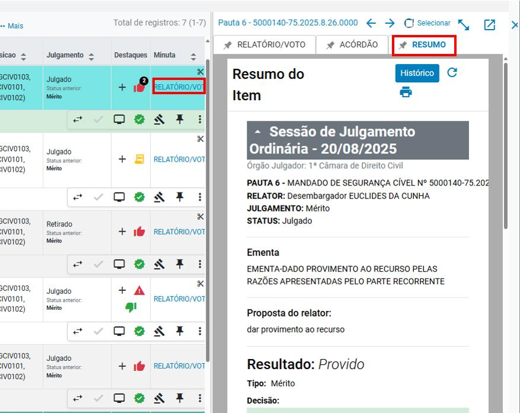

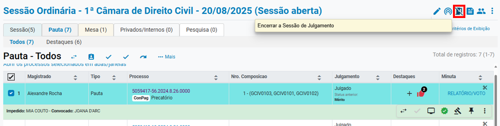

---

SESSÃO DE JULGAMENTO

**EPROC PARA SEGUNDO GRAU****–****UNIDADE JUDICIAL****|**Conteúdo integral do curso
<small>**246**</small><small>**Descrição da imagem**: janela “Encerrar a Sessão de Julgamento”.</small>
O próximo passo será acionar o ícone**“Conferência da Sessão de Julgamento”**, representado por

um olho, disponível nos ícones localizados no lado direito do**Painel**.
<small>**Descrição da imagem**: destaque ao ícone “Conferência de Sessão de Julgamento”.</small>
A tela**“Conferência da Sessão Ordinária”**será aberta. As mudanças de resultado nas minutas e

retiradas de pauta serão sinalizadas nesta tela.

Marcar a caixa de seleção**“Listar itens já conferidos? ”**e clicar em**“Consultar”**, apenas como

confirmação da verificação.

**Importante**

Os gabinetes dos magistrados componentes da Turma Julgadora também deverão

realizar a conferência da sessão de julgamento.

**Outras alterações das informações da pauta**

Após a conferência da**Sessão de Julgamento**, o(a) responsável pelo secretariado deverá clicar no

ícone**“Alterar Dados da Sessão de Julgamento –****Painel”**, representado por um lápis, e, aberta a

janela com os dados da**“Sessão”**, clicar na aba**“TEXTOS DA ATA”**.

Caso o eproc não exiba um texto pré-configurado, clicar em**Novo**para inserir um**“Tipo de**

**Texto”**e seu**“Conteúdo”**, preenchendo os respectivos campos. Clicar em**“Salvar”**para guardar

as informações inseridas.

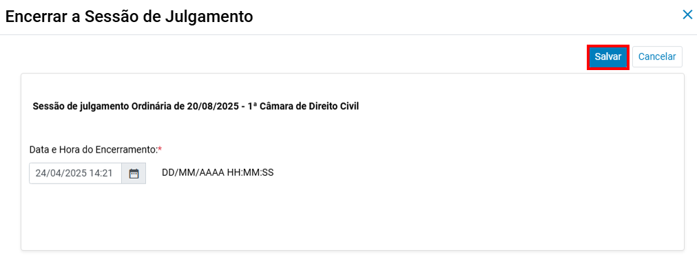

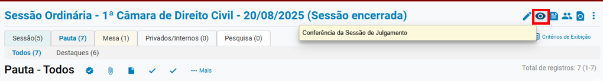

---

SESSÃO DE JULGAMENTO

**EPROC PARA SEGUNDO GRAU****–****UNIDADE JUDICIAL****|**Conteúdo integral do curso
<small>**247**</small><small>**Descrição da imagem**: janela “Sessão” exibindo os campos da aba “TEXTOS DA ATA”.</small>
A finalização da ata de julgamento da sessão é realizada ao clicar em**“Mais ações”**, ícone

representado por três pontinhos, e, na sequência, em**“Encerrar Ata da Sessão de Julgamento”**.
<small>**Descrição da imagem**: destaque à opção “Encerrar Ata da Sessão de Julgamento”.</small>
Eventuais pendências serão sinalizadas na janela aberta. Não havendo pendências, clicar em

**“Encerrar Ata”**.
<small>**Descrição da imagem**: tela de finalização da ata com destaque ao botão “Encerrar Ata”.</small>
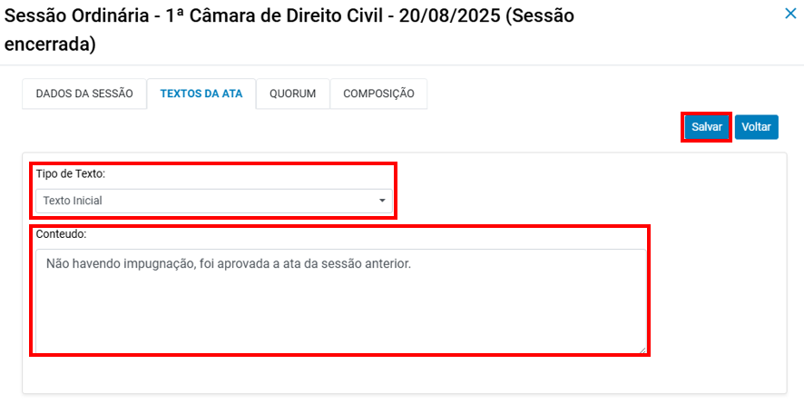

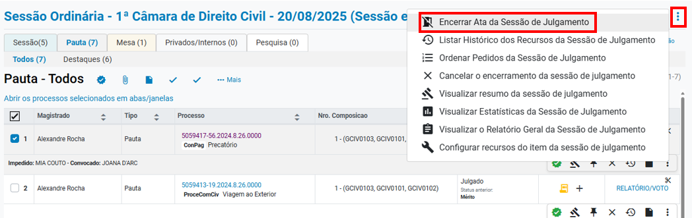

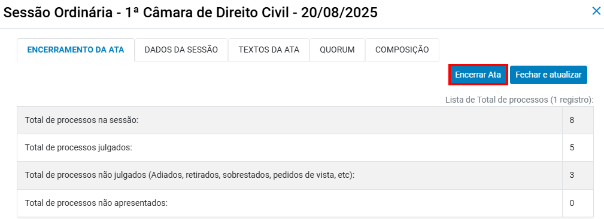

---

SESSÃO DE JULGAMENTO

**EPROC PARA SEGUNDO GRAU****–****UNIDADE JUDICIAL****|**Conteúdo integral do curso
<small>**248**</small>
O sistema eproc formará o documento da ata e ficará disponível para consulta na tela do**Painel**

**da Sessão de Julgamento**, ícone**“Consultar Relatório da Ata da Sessão de Julgamento”**.
<small>**Descrição da imagem**: ícone “Consultar Relatório da Ata da Sessão de Julgamento”.</small>
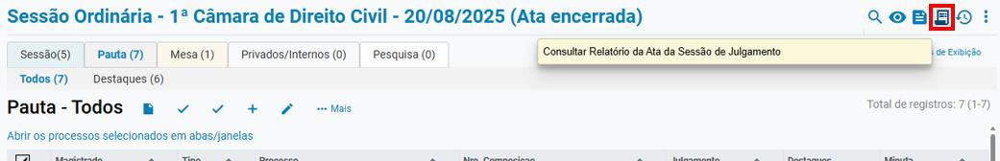

---

**EPROC PARA SEGUNDO GRAU****–****UNIDADE JUDICIAL****|**Conteúdo integral do curso

**CRÉDITOS**

**PORTAL NACIONAL DO CONHECIMENTO EPROC**

*Material desenvolvido pelo TJSP, com base nos tutoriais 2G elaborados*

*pelo TJSC**–**Divisão de Suporte à Jurisdição de Segundo Grau.*
