# ▪ DISTRIBUIÇÃO DE PROCESSOS

*Documento eProc - Material de Treinamento*

---

---

<small>Imagem decorativa de capa: linhas e luzes de sistema e logotipo do eproc. Na lateral está escrit</small><small>o: EPROC</small><small>*PORTAL NACIONAL DO CONHECIMENTO EPROC*</small>
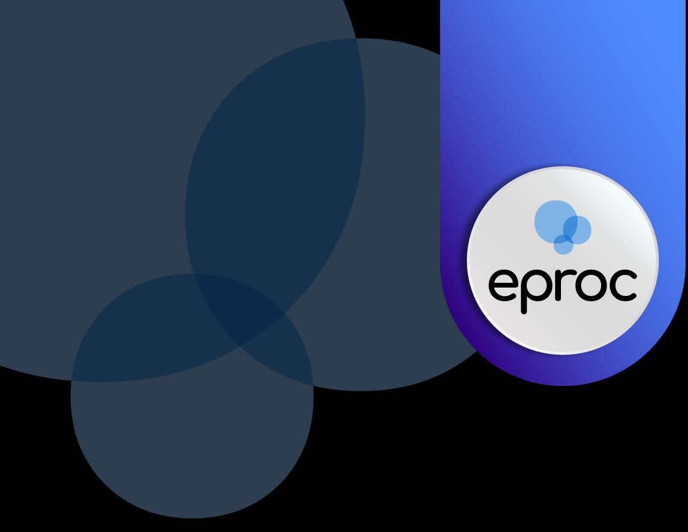

**EPROC PARA CEJUSC**

## Conteúdo integral do curso

Atualizado em**30/05/2025.**

---

**SUMÁRIO**

**EPROC PARA CEJUSC**
<small>▪</small>
**DISTRIBUIÇÃO DE PROCESSOS**

**4**
<small>CADASTRANDO UMA NOVA RECLAMAÇÃO</small><small>4</small><small>Informações do processo</small><small>4</small><small>Seleção de assuntos</small><small>5</small><small>Cadastro do polo ativo</small><small>6</small><small>Cadastro do polo passivo</small><small>8</small><small>Informações adicionais e seleção de documentos</small><small>10</small><small>Seleção de documentos</small><small>10</small><small>Finalização do cadastro da reclamação</small><small>15</small><small>LOCALIZAÇÃO DAS RECLAMAÇÕES</small><small>16</small><small>▪</small>
**AGENDAMENTO DA SESSÃO DE CONCILIAÇÃO/MEDIAÇÃO**

**17**
<small>Modo “Nova audiência (Calendário)”</small><small>18</small><small>Modo “Nova audiência”</small><small>20</small><small>PROCEDIMENTOS APÓS O AGENDAMENTO DA SESSÃO</small><small>21</small><small>Reclamações pré-processuais</small><small>21</small><small>Processos em andamento</small><small>21</small><small>▪</small>
**ELABORAÇÃO DE TERMO DE AUDIÊNCIA**

**23**
<small>DO STATUS DA MINUTA “TERMO DE AUDIÊNCIA”</small><small>25</small><small>Finalização do termo de audiência</small><small>26</small><small>Impressão do termo de audiência e demais providências</small><small>27</small><small>ASSINATURA DO TERMO DE AUDIÊNCIA</small><small>27</small><small>▪</small>
**PROVIDÊNCIAS APÓS A ASSINATURA DO TERMO DE AUDIÊNCIA**

**29**
<small>PROCEDIMENTOS APÓS ALTERAÇÃO DA SITUAÇÃO DA AUDIÊNCIA</small><small>33</small><small>Competência processual</small><small>33</small><small>Competência pré-processual</small><small>34</small><small>SESSÕES DE CONCILIAÇÃO VIRTUAIS</small><small>35</small><small>▪</small>
**MINUTAS DE SENTENÇA HOMOLOGATÓRIA**

**36**
<small>ASSINATURA DA MINUTA DE SENTENÇA</small><small>40</small><small>Assinatura individual</small><small>40</small>

---

DISTRIBUIÇÃO DE PROCESSOS

**EPROC PARA CEJUSC****|**Conteúdo integral do curso
<small>**3**</small><small>Assinatura em lote</small><small>41</small><small>▪</small>
**EVOLUÇÃO DE CLASSE**

**43**
<small>CRÉDITOS</small><small>45</small>

---

<small>DISTRIBUIÇÃO DE PROCESSOS</small>
**EPROC PARA CEJUSC****|**Conteúdo integral do curso
<small>**4**</small>
# ▪ DISTRIBUIÇÃO DE PROCESSOS

**CADASTRANDO UMA NOVA RECLAMAÇÃO**

O cadastro inicial da reclamação pelo CEJUSC no eproc é similar à distribuição de processos no

Juizado Especial Cível. Tudo se inicia com o acesso ao**menu lateral**, opção**“Petição Inicial”**:
<small>**Descrição da imagem**: menu lateral, com destaque para opção “Petição Inicial”.</small>
**Informações do processo**

Na tela**“Informações do Processo”**, preencher os campos:

▪**Desejo entrar com a ação em**:clicar na seta para baixo e selecionar a comarca em que

o CEJUSC está localizado;

▪**Rito**: clicar na seta para baixo e selecionar**“JUIZADO ESPECIAL”**;

▪**Área**: clicar na seta para baixo e selecionar**“CEJUSC”**;

▪**Classe processual**: clicar na seta para baixo e selecionar**“RECLAMAÇÃO PRÉ****-**

**PROCESSUAL”**;

▪**Nível de Sigilo do Processo**: clicar na seta para baixo e selecionar a opção**“Sem Sigilo**

**–****Nível 0”**, exceto se houver determinação judicial e/ou sigilo associado ao assunto.

Apenas nestes casos, a opção a ser selecionada será**“Segredo de Justiça (Nível 1)”**;

▪**Valor da Causa:**preencher o valor estimado da causa, conforme informado pela parte,

levando em consideração os documentos apresentados;

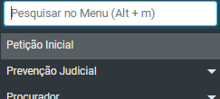

---

<small>DISTRIBUIÇÃO DE PROCESSOS</small>
**EPROC PARA CEJUSC****|**Conteúdo integral do curso
<small>**5**</small><small>**Descrição da imagem**: tela “Peticionamento Eletrônico - Informações do processo” com campos de preenchimento.</small>
Preenchidos os campos, clicar em**“Próxima”**para prosseguir.

**Seleção de assuntos**

Na tela**“Assunto”**, selecionar ao menos um assunto para a reclamação. Recomenda-se que o

primeiro assunto cadastrado seja o principal.
<small>**Descrição da imagem**: tela “Peticionamento Eletrônico - Assuntos”, com seção “Selecionar Assunto Principal” à</small><small>esquerda exibindo barra de busca com os botões “Filtrar”, “Pesquisar” e “Limpar”.</small>
A localização do assunto pode ser realizada digitando o nome ou código no campo respectivo e

clicando em**“Filtrar”**. Serão exibidos apenas os assuntos que contêm a expressão consultada.

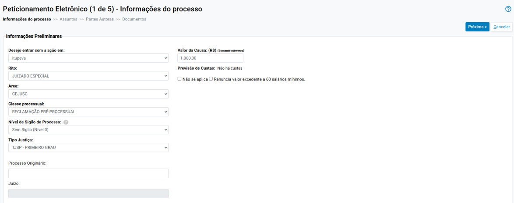

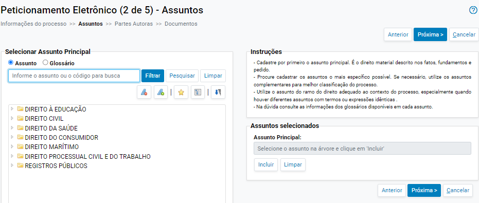

---

<small>DISTRIBUIÇÃO DE PROCESSOS</small>
**EPROC PARA CEJUSC****|**Conteúdo integral do curso
<small>**6**</small><small>**Descrição da imagem**: seção “Selecionar Assunto Principal”, com campo para busca preenchido com a palavra</small><small>“acidente” e, abaixo, a exibição dos resultados após acionado o botão “Filtrar”.</small>
Ao clicar sobre o assunto, ele será listado no campo**“Assunto Principal”**. Clicar em “Incluir” e

repetir a operação caso seja necessário incluir assuntos adicionais.
<small>**Descrição da imagem**: seção “Assuntos selecionados”, com destaque para o botão” Incluir”.</small>
Após, clicar no botão**“Próxima”**para prosseguir.
<small>**Descrição da imagem**: indicação dos assuntos incluídos, com destaque para o botão “Próxima”.</small>
**Cadastro do polo ativo**

Na tela**“Partes (reclamantes)”**é possível o cadastro dos integrantes do polo ativo do processo.

Para tanto, indicar se o processo é relativo à pessoa física ou jurídica e, então, digitar CPF ou CNPJ.

Depois disso, clicar no botão**“Consultar”**.

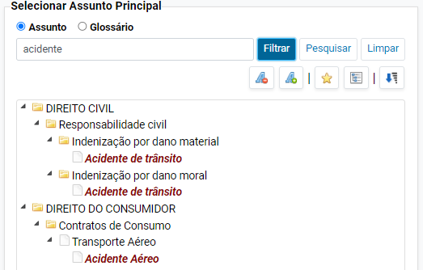

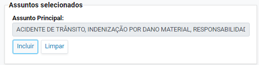

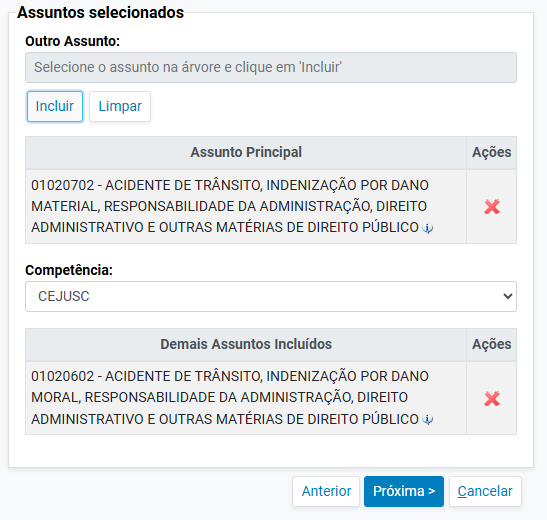

---

<small>DISTRIBUIÇÃO DE PROCESSOS</small>
**EPROC PARA CEJUSC****|**Conteúdo integral do curso
<small>**7**</small><small>**Descrição da imagem**: tela “Peticionamento Eletrônico – Partes (autores)”, com o campo “CPF” preenchido e</small><small>destaque para o botão “Consultar”.</small>
O sistema efetuará consulta na base de dados da Receita Federal, exibindo abaixo o resultado da

busca. Então, clicar sobre o botão**“Incluir”**para adicioná-la ao polo ativo.
<small>**Descrição da imagem**: resultado da consulta por CPF, com destaque para o botão “Incluir”.</small>
**Importante**

Tendo em vista a consulta à base de dados da Receita Federal, recomenda-se que a

pesquisa de pessoas seja sempre realizada pelo CPF ou CNPJ.

Selecionada a parte com os dados pesquisados a partir da**Receita Federal**, a complementação dos

dados de qualificação ou outros endereços da parte somente será possível após a distribuição da

reclamação, na seção**“Partes e Representantes”**da capa do processo.

Após a inclusão, indicar se o integrante é ou não parte ativa principal (ao menos uma deve ser

marcada como principal) ou alterar o tipo de representação da parte, clicando nos botões

presentes nas colunas “**Principal?**” e “**Tipo Representação**”.

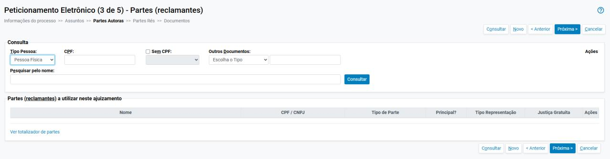

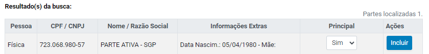

---

<small>DISTRIBUIÇÃO DE PROCESSOS</small>
**EPROC PARA CEJUSC****|**Conteúdo integral do curso
<small>**8**</small><small>**Descrição da imagem**: tela “Peticionamento Eletrônico – Partes (reclamantes)”.</small>
O procedimento acima descrito deve ser repetido para cada uma das partes a serem acrescentadas

no polo ativo. Na sequência, clicar no botão**“Próxima”**para prosseguir.

**Cadastro do polo passivo**

Na tela**Partes (Reclamados)**é possível cadastrar os integrantes do polo passivo da reclamação. A

consulta da pessoa (física ou jurídica) é realizada à semelhança do exemplificado para o cadastro

do polo ativo.

Não havendo a informação do CPF ou CNPJ, marcar a caixa de seleção**“Sem CPF/Sem CNPJ”**ou

preencher o campo**“Pesquisar pelo nome”**e clicar em**“Consultar”**.

Caso o sistema não localize ou identifique a pessoa, será aberta a tela para preenchimento dos

dados do**“Cadastro da Pessoa”**.

No campo**“Endereço(s)”**é possível digitar o CEP no campo**“CEP”**e clicar no ícone representado

pela lupa para a pesquisa. Os campos serão preenchidos com as informações dos Correios. Clicar

em**“Incluir”**para selecionar o endereço.

Já no campo**“Contato(s)”**é possível clicar na seta para baixo em**“Forma de Contato”**, selecionar

a forma e preencher as informações em**“Contato”**. Sugere-se o preenchimento das informações

sobre telefone e e-mail.

Preenchidos os campos, clicar em**“Salvar”**.

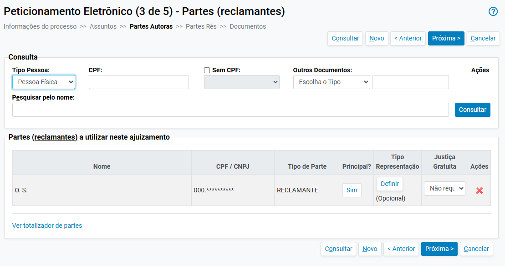

---

<small>DISTRIBUIÇÃO DE PROCESSOS</small>
**EPROC PARA CEJUSC****|**Conteúdo integral do curso
<small>**9**</small><small>**Descrição da imagem**: tela “Cadastro de Pessoa Física”, com os campos preenchidos.</small>
Inseridos os dados dos reclamados, clicar em**“Incluir”**.
<small>**Descrição da imagem**: tela “Peticionamento Eletrônico – Partes (Reclamados)”, com a pessoa cadastrada para ser</small><small>incluída na reclamação.</small>
Repetido o procedimento para cada uma das partes a serem acrescentadas ao polo passivo, clicar

no botão**“Próxima”**para prosseguir.

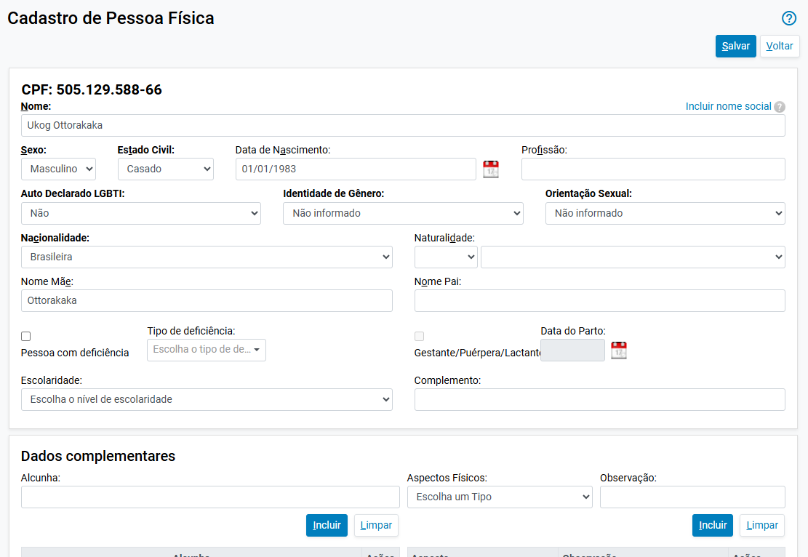

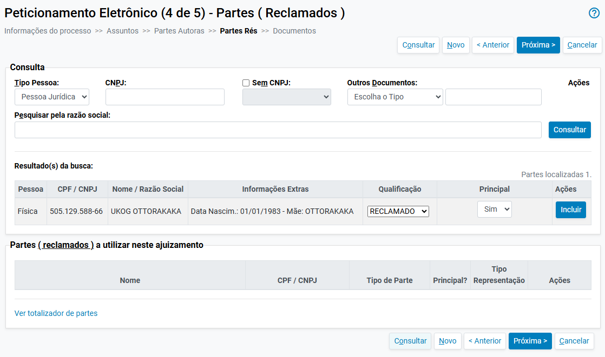

---

<small>DISTRIBUIÇÃO DE PROCESSOS</small>
**EPROC PARA CEJUSC****|**Conteúdo integral do curso
<small>**10**</small>
**Informações adicionais e seleção de documentos**

Por fim, será possível a indicação de**informações adicionais**sobre a reclamação e a**seleção de**

**documentos**.

**Informações adicionais**

▪**Requer prioridade de tramitação****–****Doença Grave**;

▪**Intervenção do Ministério Público**: inclui o Ministério Público no processo como fiscal

da lei;

▪**Requer prioridade de tramitação - Pessoa com deficiência**;

▪**Processo com pessoa enquadrada na Lei 14. 289/2022**;

▪**Petição Urgente**: não precisa ser marcada nos casos de reclamação junto ao CEJUSC;

▪**Requer Liminar/Antecipação de Tutela**;

▪**Requer prioridade de tramitação****–****Idoso**: marcado automaticamente pelo sistema

quando verificado que pelo menos uma parte do polo ativo é pessoa idosa;

▪**Requer prioridade de tramitação - Criança e Adolescente**.
<small>**Descrição da imagem**: tela “Peticionamento Eletrônico – Documentos”, destaque para as opções presentes na seção</small><small>“Informações Adicionais”.</small>
**Seleção de documentos**

A etapa**“Documentos”**do cadastro da reclamação permite a inclusão de arquivos de diversos

tipos:

O sistema eproc aceita a juntada de arquivos de diversos tipos:

▪**Documentos**: PDF, HTM, HTML e KML (tamanho máximo 11 MB);

▪**Áudio**: MP3, WMA e WAV (tamanho máximo 250 MB);

▪**Imagens**: JPEG, JPG, PNG e GIF (tamanho máximo 11 MB);

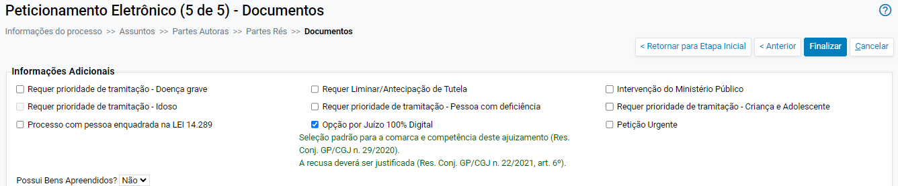

---

<small>DISTRIBUIÇÃO DE PROCESSOS</small>
**EPROC PARA CEJUSC****|**Conteúdo integral do curso
<small>**11**</small>
▪**Vídeos**: MP4, WMV, MPG, MPEG e WEBM (tamanho máximo 250 MB).
<small>**Descrição da imagem**: tela “Peticionamento Eletrônico – (Documentos)”, destaque à área de seleção de</small><small>documentos.</small>
O registro do ajuizamento poderá ser realizado de duas formas:

▪**adicionando um arquivo;**

▪**acionando a opção “Digitar Documento”**.

**Adicionando um arquivo**

O CEJUSC poderá ter os seus modelos de ajuizamentos disponíveis em formato de editor de textos.

Comparecendo o reclamante e realizado o atendimento, o conteúdo da reclamação é redigido

neste arquivo.

Preenchidas as informações, o documento poderá ser impresso em formato PDF e salvo em uma

pasta do computador.

Na sequência, esse conteúdo poderá ser inserido no eproc, na tela de**“Peticionamento Eletrônico**

**(Documentos)”**, ao clicar em**“Escolher arquivo”**e selecionar o documento em sua pasta de origem

para anexá-lo.

Em**“Tipo”**, digitar parte do tipo para filtrar as opções ou clicar em**“Listar todos”**para visualizá-

las. O primeiro documento deverá, obrigatoriamente, ter o tipo**“PETIÇÃO INICIAL”**.
<small>**Descrição da imagem**: área de seleção de documentos, com o campo “Tipo” preenchido com “inic” e exibição das</small><small>opções “emenda da inicial” e “petição inicial”. Destaque para o botão “Listar todos”.</small>
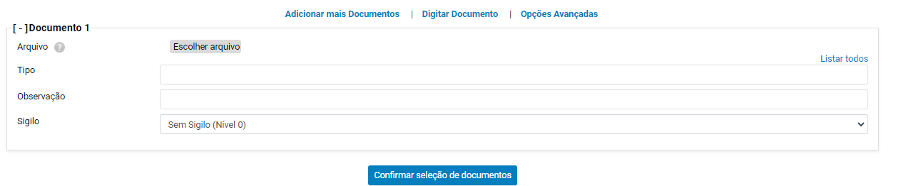

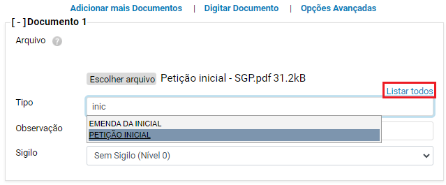

---

<small>DISTRIBUIÇÃO DE PROCESSOS</small>
**EPROC PARA CEJUSC****|**Conteúdo integral do curso
<small>**12**</small>
O campo**“Observação”**é de preenchimento facultativo. Em**“Sigilo”**, pode-se definir o nível de

sigilo para a peça em questão. Por fim, clicar em**“Confirmar seleção de documentos”**para incluí-

lo no cadastro.
<small>**Descrição da imagem**: área de seleção de documentos com os campos “Tipo”, “Observação” e “Sigilo” preenchidos.</small><small>Destaque para o botão “Confirmar seleção de documentos”.</small>
Após repetir o procedimento para cada um dos arquivos a serem juntados, estes serão listados no

quadro**“Documentos selecionados e ainda não utilizados em movimentação”**.
<small>**Descrição da imagem**: quadro “Documentos selecionados e ainda não utilizados em movimentação”.</small>
Nesse quadro, é possível alterar a ordem dos arquivos juntados (clicando e arrastando para o local

desejado ou utilizando as setas na coluna**“Sequencial”**), o tipo dos documentos, o sigilo e a

observação. Para excluir um arquivo selecionado indevidamente, clicar no botão**“Excluir**

**documento”**, representado por um “x” vermelho.

**Digitar documento**

A outra opção para o registro do ajuizamento é clicar em**“Digitar Documento”**, na tela

**“Peticionamento Eletrônico”**.

O eproc abrirá uma nova janela no navegador. No campo**“Tipo de documento/Modelo”**, digitar

**“Termo”**para localizar o modelo de “Termo de Ajuizamento” a ser utilizado.

Clicar em**“Criar e Editar”****.**

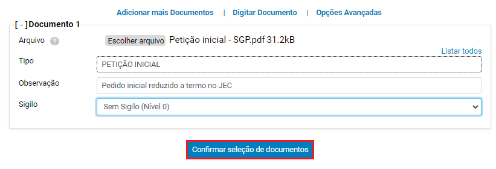

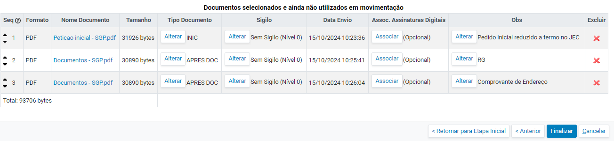

---

<small>DISTRIBUIÇÃO DE PROCESSOS</small>
**EPROC PARA CEJUSC****|**Conteúdo integral do curso
<small>**13**</small><small>**Descrição da imagem**: janela do eproc, com destaque ao campo “Tipo de documento/Modelo” e ao botão “Criar e</small><small>Editar”.</small>
O eproc abrirá uma outra tela contendo o editor de texto, permitindo a redação sobre o

ajuizamento da reclamação apresentada no balcão do CEJUSC.

Preenchidas as informações, clicar no botão**“Anexar Documento e Sair”**, representado por um

disquete com uma seta para frente.
<small>**Descrição da imagem**: janela do editor de textos do eproc com destaque ao botão “Anexar Arquivo e Sair”.</small>
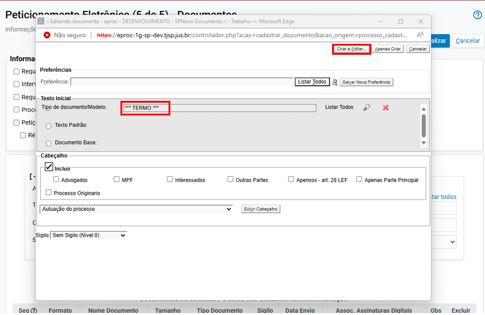

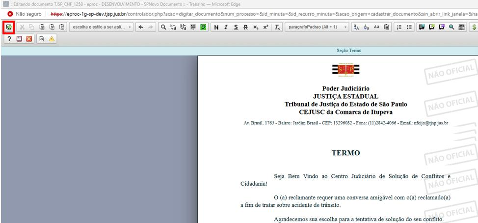

---

<small>DISTRIBUIÇÃO DE PROCESSOS</small>
**EPROC PARA CEJUSC****|**Conteúdo integral do curso
<small>**14**</small>
O documento elaborado ficará disponível no campo inferior**“Documentos selecionados e ainda**

**não utilizados em movimentação”**.

O responsável pelo registro da reclamação deverá clicar no*link*presente na coluna**“Nome**

**Documento”**, abrindo em uma aba/janela o documento elaborado.
<small>**Descrição da imagem**: destaque ao*link*presente na coluna “Nome Documento”.</small>
Na aba/janela aberta, clicar no ícone representado por uma impressora para imprimir o

documento elaborado em formato PDF.
<small>**Descrição da imagem**: destaque ao ícone representado por uma impressora.</small>
Na sequência, no campo**“Documento 1”**, clicar em**“Escolher arquivo”**e selecionar o arquivo

impresso em formato PDF.

Preencher o campo**“Tipo”**com a opção**“PETIÇÃO INICIAL”**, clicar em**“Confirma seleção de**

**documentos”**e o documento passará a constar na lista do campo inferior da tela.

O documento elaborado no sistema possui, na coluna**“Formato”**,a informação**“HTML”**. Em razão

da inclusão do termo elaborado em formato PDF, clicar no ícone**“Excluir documento”**,

representado por um “x” vermelho, localizado na coluna**“Excluir”**,para a retirada do documento

criado no sistema.
<small>**Descrição da imagem**: destaque ao ícone “Excluir documento” na linha do documento gerado no eproc.</small>
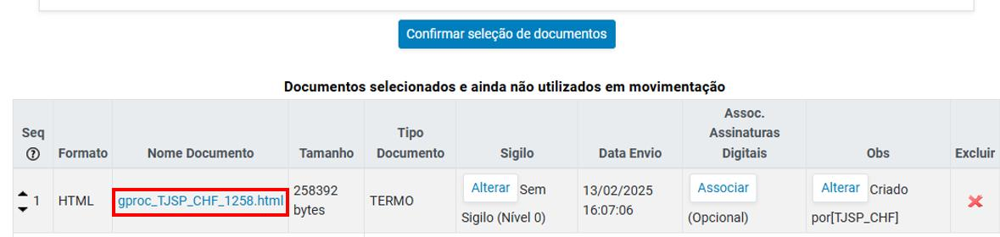

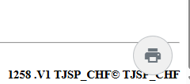

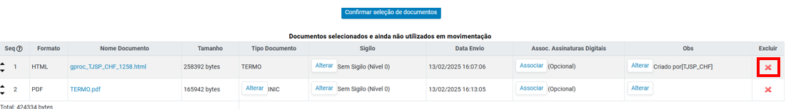

---

<small>DISTRIBUIÇÃO DE PROCESSOS</small>
**EPROC PARA CEJUSC****|**Conteúdo integral do curso
<small>**15**</small>
**Finalização do cadastro da reclamação**

Após anexar o documento contendo o ajuizamento do reclamante e eventuais outros documentos

apresentados, clicar em**“Finalizar”**.

Um resumo do cadastro efetuado será apresentado na tela. Acionar o botão**“Confirmar**

**ajuizamento”**para prosseguir.
<small>**Descrição da imagem**: resumo das informações e documentos selecionados no ajuizamento.</small>
A informação**“Processo distribuído”**será apresentada na tela, com indicação do**“Número do**

**Processo”**e a**“Chave para Consulta”**. O reclamante poderá utilizar ambos para consultar a

reclamação, inclusive em razão do sigilo das reclamações do CEJUSC.
<small>**Descrição da imagem**: tela de confirmação da distribuição, destaque a “Número do Processo” e “Chave para</small><small>Consulta”.</small>
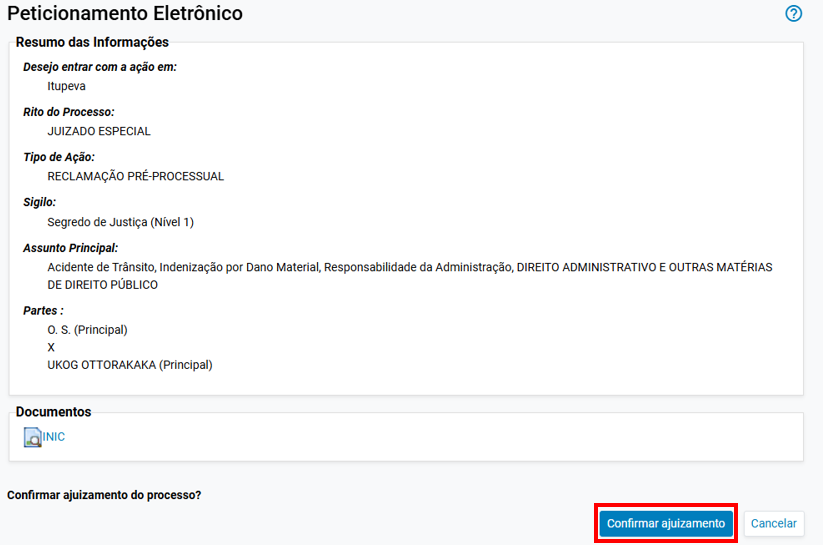

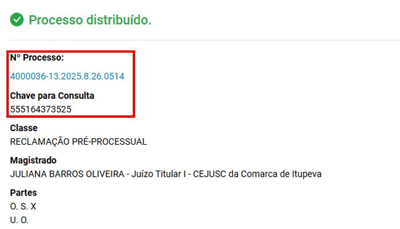

---

<small>DISTRIBUIÇÃO DE PROCESSOS</small>
**EPROC PARA CEJUSC****|**Conteúdo integral do curso
<small>**16**</small>
**LOCALIZAÇÃO DAS RECLAMAÇÕES**

Após a distribuição, as reclamações podem ser visualizadas no localizador de sistema**“PETIÇÃO**

**INICIAL JEE”**, localizado no painel do**“Gestor da Unidade”**.

Já os processos em andamento junto às unidades judiciais redistribuídos ao CEJUSC para a

realização da sessão de conciliação e mediação podem ser visualizados no localizador de sistema

**“PETIÇÃO INICIAL”**.
<small>**Descrição da imagem**: Painel do Gestor da Unidade, com destaque para os localizadores “PETIÇÃO INICIAL” e</small><small>“PETIÇÃO INICIAL JEE”.</small>
Clicando sobre o número indicado na coluna**“Quantidade de Processos”**, será aberta a tela**“Lista**

**de Processos por Localizador”**, a partir da qual os processos poderão ser trabalhados

individualmente ou em lote.
<small>**Descrição da imagem**: tela “Lista de Processos por Localizador”, com exibição dos processos no localizador</small><small>“PETIÇÃO INICIAL JEE”.</small>
Clicar sobre o número de um dos processos fará com que ele seja aberto no navegador, sendo

possível observar, na sua capa, o respectivo localizador.
<small>**Descrição da imagem**: capa do processo com destaque para a indicação do localizador.</small>
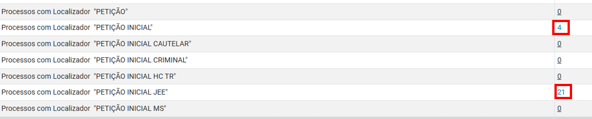

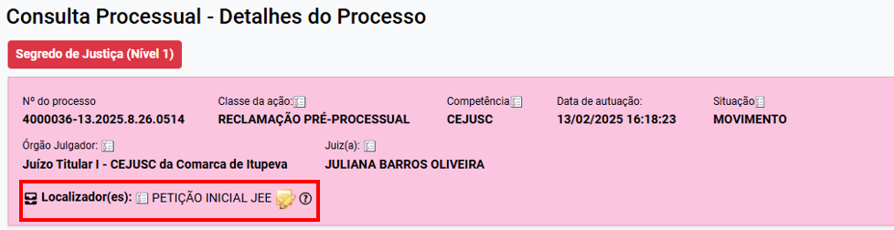

---

<small>AGENDAMENTO DA SESSÃO DE CONCILIAÇÃO/MEDIAÇÃO</small>
**EPROC PARA CEJUSC****|**Conteúdo integral do curso
<small>**17**</small>
# ▪ AGENDAMENTO DA SESSÃO DE

**CONCILIAÇÃO/MEDIAÇÃO**

O CEJUSC visualiza no eproc tanto a competência**Pré-Processual**quanto a**Processual**no mesmo

login do usuário.

Por esse motivo, o agendamento das sessões de conciliação e mediação de ambas as competências

é realizado a partir dos respectivos localizadores:

▪**Pré-processual**: localizador**“PETIÇÃO INICIAL JEE”**. O agendamento deverá ser

realizado logo após a distribuição da reclamação, permitindo a seleção da data de

interesse por parte do(a) reclamante;

▪**Processual**: localizador**“PETIÇÃO INICIAL”**.

**Importante**

As salas de audiência do CEJUSC são cadastradas e alteradas no item**“Gerenciamento**

**de Salas”**do**menu lateral**, dentro da categoria**“Audiência”**. Aberta a tela**“Sala de**

**Audiência”**, são exibidas as salas criadas. Clicar em**“Nova”**para a criação de novas

salas.

O acesso aos localizadores é feito na tela inicial do eproc, sessão**“Localizadores”**. Para acessar os

processos com o localizador desejado, clicar no*link*disponível na linha do localizador, coluna

**“Quantidade de Processos”**.

Aberta a tela**“Lista de Processos por Localizador”**, clicar no*link*disponível no número do processo

para a abertura da capa do processo.

O agendamento da sessão de conciliação e mediação é realizado na seção**“Ações”**, opção

**“Audiência”**.
<small>**Descrição da imagem**: capa do processo, com destaque para a opção “Audiência” da seção “Ações”.</small>
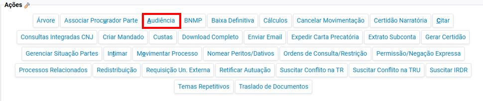

---

<small>AGENDAMENTO DA SESSÃO DE CONCILIAÇÃO/MEDIAÇÃO</small>
**EPROC PARA CEJUSC****|**Conteúdo integral do curso
<small>**18**</small>
Na tela aberta selecionar entre as opções:

▪**Nova audiência (calendário)**;

▪**Nova audiência**.
<small>**Descrição da imagem**: tela “Audiências” com as opções “Nova audiência (calendário)” e “Nova audiência”.</small>
**Modo “Nova audiência (Calendário)”**

Ao selecionar o modo**“Nova audiência (Calendário)”**, o eproc maximiza um calendário com visão

panorâmica das audiências já designadas. É possível navegar entre meses, semanas e dias por meio

das setas e dos botões localizados na parte superior.

O servidor pode selecionar o horário neste calendário expandido ou escolher o dia no calendário

compacto exibido à esquerda da tela para, então, definir o horário.
<small>**Descrição da imagem**: tela “Calendário de audiências” do modo “Calendário”.</small>
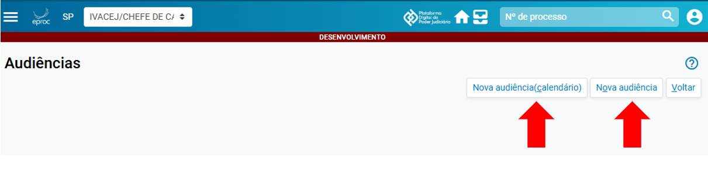

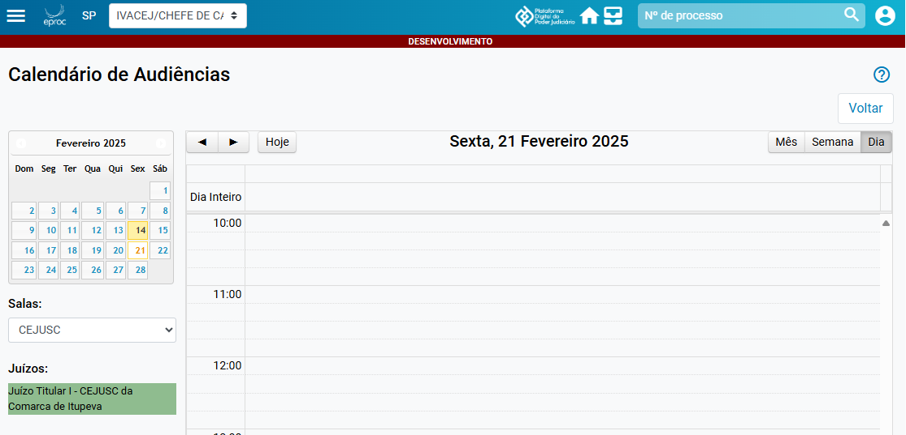

---

<small>AGENDAMENTO DA SESSÃO DE CONCILIAÇÃO/MEDIAÇÃO</small>
**EPROC PARA CEJUSC****|**Conteúdo integral do curso
<small>**19**</small>
Selecionado o horário, será aberta a tela**“Nova Audiência”**para preenchimento dos campos:

▪**Tipo de Audiência**: selecionar entre**“Presencial”**e**“Meio eletrônico”**;

▪**Evento**: selecionar o tipo de audiência designada. No CEJUSC são designadas

**“Audiência de conciliação”**ou**“Audiência de mediação”**;

▪

**Data**,**Hora início**e**Hora fim prevista**: campos preenchidos conforme a seleção no

calendário. O usuário poderá alterar o agendamento realizado pelo sistema;

▪

**Sala:**clicar na seta para baixo para selecionar a sala de audiência em que a sessão

ocorrerá, conforme a metodologia de trabalho do CEJUSC;

▪

**Descrição Observação (aparecerá no portal)**: inserir uma informação considerada

importante e que ficará disponível para quem consultar o processo;

▪

**Magistrado**: selecionar o(a) magistrado(a) responsável pelo CEJUSC;

▪

**Gerenciar Localizadores**: a tela permite o gerenciamento dos localizadores

utilizados pelo CEJUSC.
<small>**Descrição da imagem**: tela “Nova Audiência” com dados do processo e do evento.</small>
Clicar em**“Salvar”**(atalho “Alt+S”). A audiência estará pautada e será exibida na tabela de eventos.

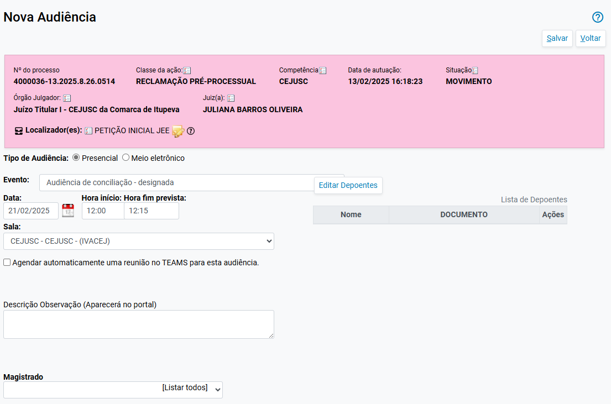

---

<small>AGENDAMENTO DA SESSÃO DE CONCILIAÇÃO/MEDIAÇÃO</small>
**EPROC PARA CEJUSC****|**Conteúdo integral do curso
<small>**20**</small><small>**Descrição da imagem**: tela da reclamação ou processo com destaque para o evento “Audiência de conciliação –</small><small>designada”.</small>
**Modo “Nova audiência”**

O eproc não exibirá o calendário maximizado com a visualização das audiências já designadas ao

se optar pelo modo**“Nova audiência”**.

A tela**“Nova Audiência”**será aberta sem qualquer informação preenchida. Os campos deverão

ser preenchidos todos manualmente. Clicar em**“Salvar”**para registrar a audiência marcada.
<small>**Descrição da imagem**: tela “Nova Audiência” aberta para inserção dos dados do evento.</small>
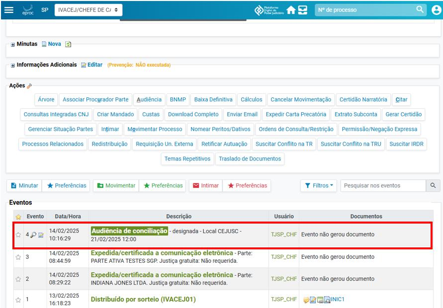

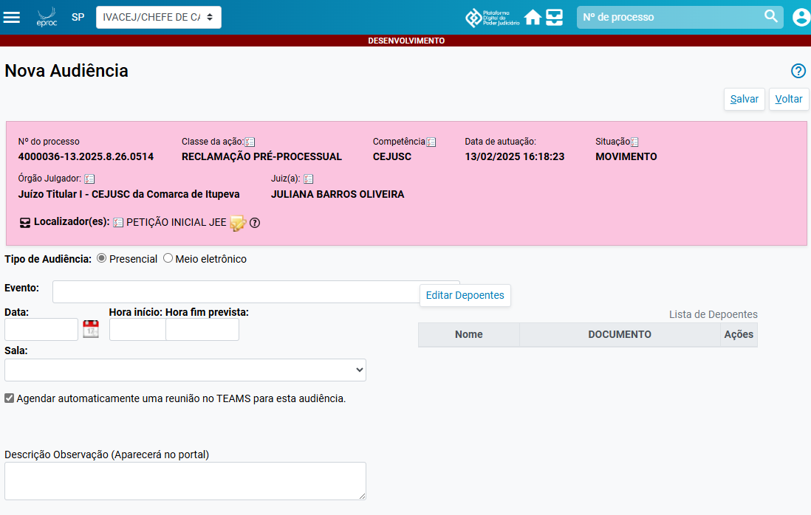

---

<small>AGENDAMENTO DA SESSÃO DE CONCILIAÇÃO/MEDIAÇÃO</small>
**EPROC PARA CEJUSC****|**Conteúdo integral do curso
<small>**21**</small>
**PROCEDIMENTOS APÓS O AGENDAMENTO**

**DA SESSÃO**

**Reclamações pré-processuais**

Após o agendamento das sessões de conciliação ou mediação na competência Pré-Processual do

CEJUSC, o(a) reclamante será informado(a) sobre a data da audiência agendada e orientado(a)

sobre como proceder para a participação no ato.

O CEJUSC também providenciará a expedição da carta-convite para que o(s) reclamado(s)

possa(m) comparecer à tentativa de retomada de diálogo.

Para orientações sobre como expedir minuta de documentos, acessar a aula “Expedição de

documentos” do curso**“Eproc para Unidade Judicial –****Módulo Básico”**.

**Processos em andamento**

Os CEJUSCS possuem especificidades na forma de atuação, em especial na competência

**“Processual”**.

Conforme o método de trabalho adotado pela unidade do CEJUSC, no momento do agendamento

da sessão de conciliação será possível a realização da**“Intimação/Citação”**da parte ou, ainda, a

expedição de minuta referente à citação ou intimação do polo passivo para comparecer à sessão

de conciliação.

Para orientações sobre como expedir minuta de documentos e, ainda, sobre as

citações/intimações eletrônicas, acessar a aula “Expedição de documentos” do curso**“Eproc para**

**Unidade Judicial****–****Módulo Básico”**.

Em outra hipótese, o CEJUSC poderá redistribuir o processo à unidade judicial para a realização de

tais diligências e, posteriormente, os autos são novamente redistribuídos ao CEJUSC para a

realização da sessão de conciliação e mediação.

A devolução ou redistribuição do processo pelo CEJUSC à unidade judicial de origem é realizada na

capa do processo do eproc, acionando o botão**“Movimentar Processo”**, disponível na seção

**“Ações”**, ou o botão**“Movimentar”**, localizado entre as**“Ações”**e a tabela de**“Eventos”**.

---

<small>AGENDAMENTO DA SESSÃO DE CONCILIAÇÃO/MEDIAÇÃO</small>
**EPROC PARA CEJUSC****|**Conteúdo integral do curso
<small>**22**</small><small>**Descrição da imagem**: destaque às opções “Movimentar Processo” e “Movimentar” da capa do processo.</small>
Aberta a tela**“Movimentação Processual”**, o campo “Evento a ser lançado” deverá ser preenchido

com o evento**“Remetidos os Autos à Vara/Turma de Origem”**. Na sequência, clicar em

**“Movimentar”**para devolver o processo ao cartório de origem.
<small>**Descrição da imagem**: tela “Movimentação Processual”, destaque ao campo “Evento” e ao botão “Movimentar”.</small>
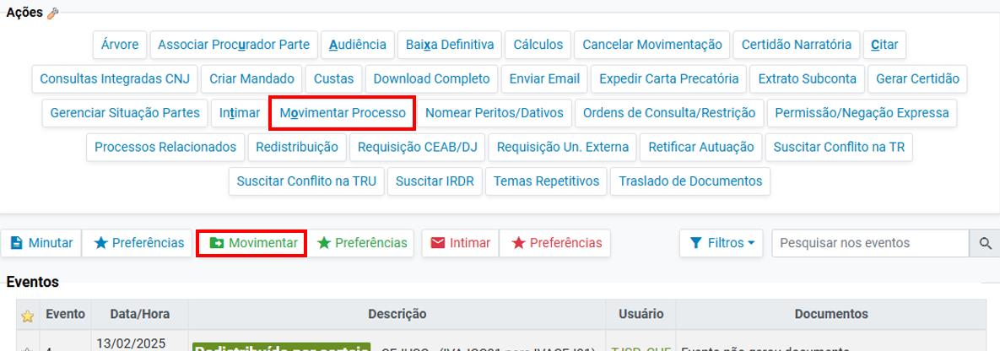

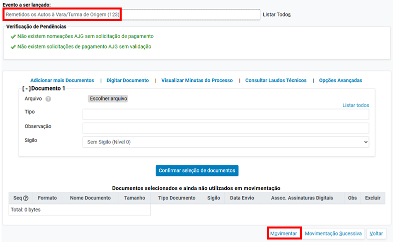

---

<small>ELABORAÇÃO DE TERMO DE AUDIÊNCIA</small>
**EPROC PARA CEJUSC****|**Conteúdo integral do curso
<small>**23**</small>
# ▪ ELABORAÇÃO DE TERMO DE AUDIÊNCIA

Os termos de audiência no CEJUSC são elaborados da mesma forma para as competências**Pré-**

**Processual**e**Processual**, porém o pós-audiência apresentará diferenças nos procedimentos.

Lembrando que, no eproc, tanto as reclamações pré-processuais quanto os processos em

andamento tramitam no mesmo login do usuário.

A elaboração do termo de audiência é realizada na capa do processo, seção**“Minutas”**, opção

**“Nova”**. Aberta a tela**“Nova Minuta”**, selecionar o tipo de documento/modelo adequado à

situação do caso.
<small>**Descrição da imagem**: tela do processo, com destaque à seção “Minutas”, opção “Nova”.</small><small>**Descrição da imagem**: tela “Nova Minuta”, com destaque para a seleção do modelo de termo de audiência.</small>
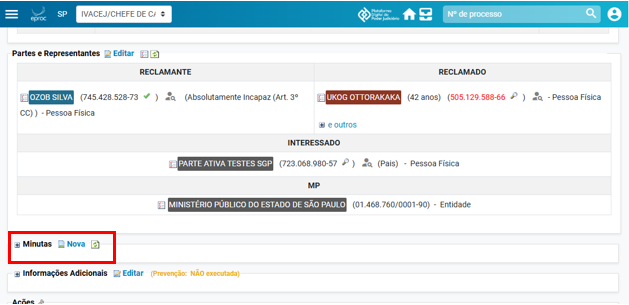

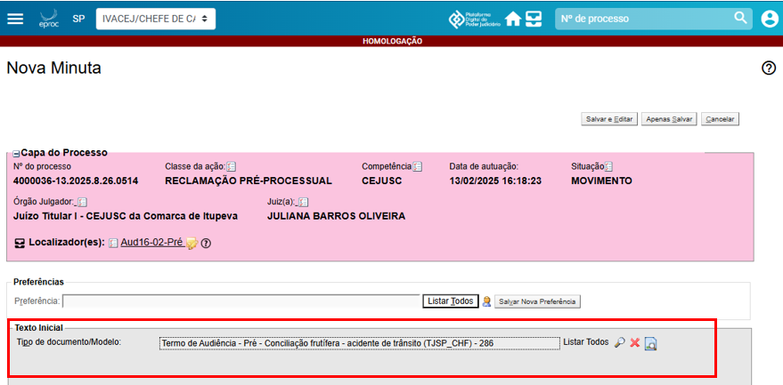

---

<small>ELABORAÇÃO DE TERMO DE AUDIÊNCIA</small>
**EPROC PARA CEJUSC****|**Conteúdo integral do curso
<small>**24**</small>
**Atenção**

Durante a emissão de termo de audiência, não se deve agendar eventos. Isso deve

ser feito apenas após a realização do ato, na movimentação processual referente ao

resultado da audiência.

Nos CEJUSCs não existem juntada de mídia, em razão do sigilo das sessões de

conciliação ou mediação.

Inserir a**“Classificação”**e a**“Descrição”**referentes ao termo de audiência.

Clicar na seta para baixo em**“Assinante”**e selecionar o(a) servidor(a) responsável pelo CEJUSC e

que realizará a conferência e assinatura do termo de audiência elaborado.

Em**“Tratamento”**, clicar na seta para baixo e selecionar o tratamento aplicável ao(à) servidor(a)

responsável pelo CEJUSC.

Após, clicar em**“Salvar e Editar”**.
<small>**Descrição da imagem**: destaque aos campos preenchidos para a elaboração da minuta.</small>
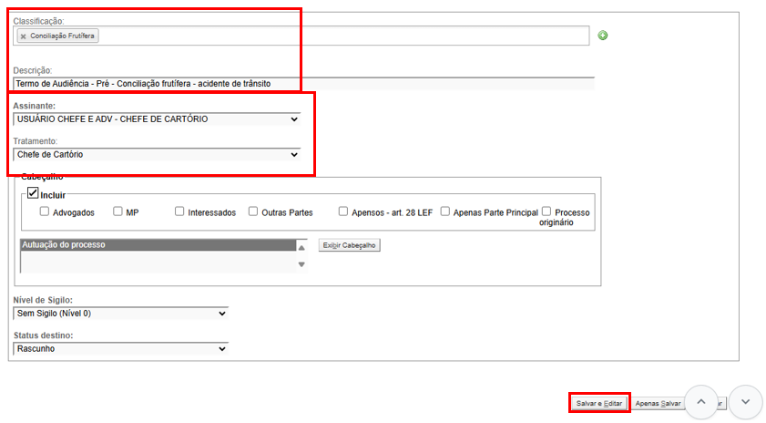

---

<small>ELABORAÇÃO DE TERMO DE AUDIÊNCIA</small>
**EPROC PARA CEJUSC****|**Conteúdo integral do curso
<small>**25**</small>
**DO STATUS DA MINUTA “TERMO DE AUDIÊNCIA”**

Selecionada a opção**“Salvar e Editar”**, o editor de texto será aberto para que o usuário elabore o

documento conforme o ocorrido na sessão de conciliação ou mediação.

As informações sobre o horário de início e término da sessão de conciliação ou mediação, bem

como a identificação do(a) responsável pelos trabalhos de intermediação do diálogo entre as

partes deverão ser inseridas no**termo de audiência**, para fins de remuneração dos conciliadores

ou mediadores.
<small>**Descrição da imagem**: tela com a minuta “Termo de Audiência” para edição.</small>
**Atenção**

O recurso**“****texto-****padrão”**é muito útil na elaboração dos termos de audiência. Com

ele, diversas possibilidades de textos e informações podem ser inseridas

automaticamente. Esses textos ficam disponíveis para seleção ou exclusão no

momento da realização da audiência.

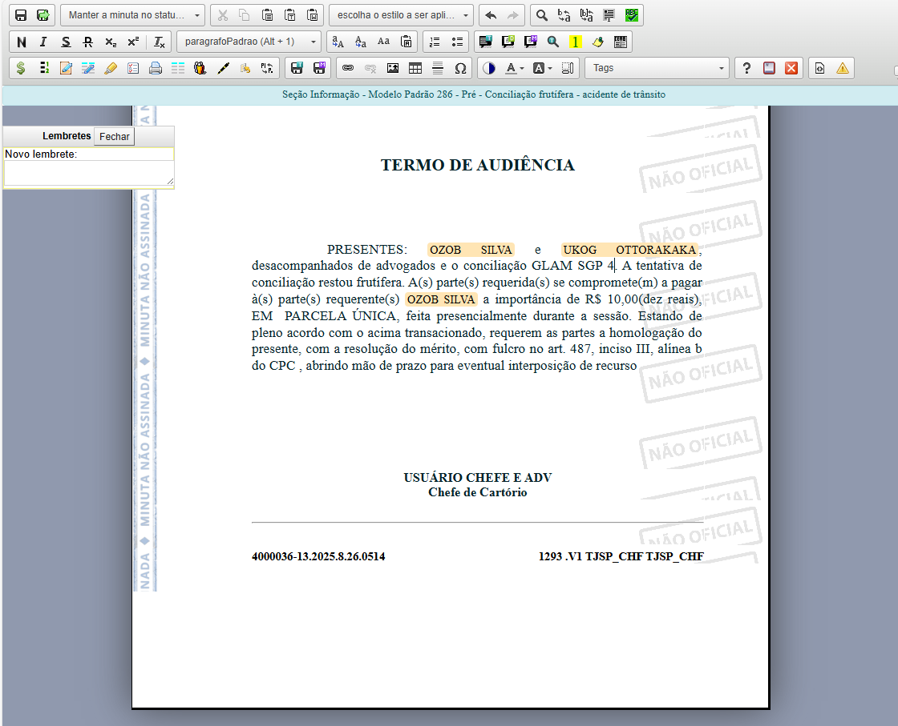

---

<small>ELABORAÇÃO DE TERMO DE AUDIÊNCIA</small>
**EPROC PARA CEJUSC****|**Conteúdo integral do curso
<small>**26**</small>
**Finalização do termo de audiência**

Após a redação do conteúdo do termo de audiência, clicar na seta para baixo no campo**“Status**

**desejado ao salvar”**, disponível na primeira linha do**Editor de Textos**e selecionar**“Encaminhar**

**minuta para assinatura”**. Após, acionar o ícone**“Salvar minuta e Sair”**, representado por um

disquete com uma seta para frente.
<small>**Descrição da imagem**: destaque ao botão “Salvar minuta e Sair” e de acesso ao Status desejado ao salvar.</small>
A minuta do termo de audiência será exibida na seção**“Minutas”**da capa do processo, com o

status**“Para assinar”**.

Nas reclamações pré-processuais e nos processos em que houver sigilo aplicável aos autos, caso o

conteúdo do termo de audiência possua o nome das partes na íntegra, em razão do uso de***tags***,

o eproc abrirá uma janela alertando e perguntando se se deseja**“Salvar sem anonimizar”**.

Clicar em**“Cancelar”**para realizar as alterações às menções aos nomes das partes ou clicar em

**“Salvar”**para continuar a finalização do termo.
<small>**Descrição da imagem**: janela de alerta sobre os nomes das partes identificados na minuta.</small>
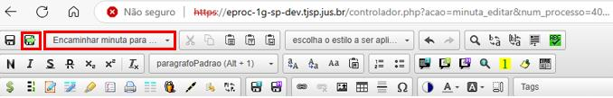

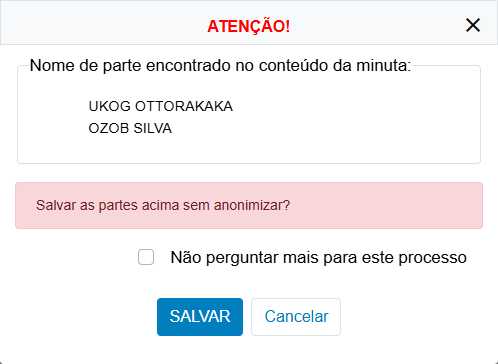

---

<small>ELABORAÇÃO DE TERMO DE AUDIÊNCIA</small>
**EPROC PARA CEJUSC****|**Conteúdo integral do curso
<small>**27**</small>
**Impressão do termo de audiência e demais providências**

Quando da realização da sessão de conciliação/mediação, o conciliador ou funcionário do CEJUSC

imprimirá 03 (três) vias do termo, colherá a assinatura em todas as vias e entregará 01 (uma) via

para cada parte (a outra será digitalizada para ser inserida no sistema eproc).

A assinatura dos termos de audiência será realizada pelo(a) gestor responsável pelo CEJUSC,

sempre ao final do dia, juntamente com todos os outros expedientes.

Nos casos de**não comparecimento das partes**ou**conciliação infrutífera**, inexiste a necessidade

de digitalização do termo de audiência assinado ou dos documentos das partes. Será**necessária**

**apenas a assinatura do gestor**na minuta do termo de audiência, para o posterior arquivamento

do procedimento.

**ASSINATURA DO TERMO DE AUDIÊNCIA**

Após a realização da sessão de conciliação e mediação, o(a) servidor(a) responsável pelo CEJUSC

efetuará as verificações necessárias nos termos, acessará a minuta elaborada e clicará no ícone

representado por uma caneta para assinar o documento.
<small>**Descrição da imagem**: seção “Minutas”, com destaque ao status “Para assinar” de minuta e ao botão “Assinar</small><small>minuta” na coluna “Recursos disponíveis”.</small>
Na janela**“Assinar Minuta”**, verificar os campos**“Assinante”**e**“Tratamento”**, acionando a seta

para baixo para modificar eventual informação equivocada.

Marcar a caixa de seleção**“Marque esta opção para utilizar sempre o tratamento selecionado”**e

preencher o campo**“Senha”**com a mesma utilizada para acessar o sistema.

Após, clicar em**“Assinar com Senha”**.

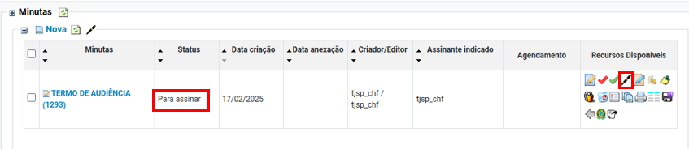

---

<small>ELABORAÇÃO DE TERMO DE AUDIÊNCIA</small>
**EPROC PARA CEJUSC****|**Conteúdo integral do curso
<small>**28**</small><small>**Descrição da imagem**: janela “Assinar Minutas”, com destaque aos campos de preenchimento para assinatura.</small>
Uma vez assinada, a minuta será exibida na seção**“Minutas”**com o status alterado para

**“Assinada”**.
<small>**Descrição da imagem**: tela com a minuta “Termo de Audiência” com o status “Assinada”.</small>
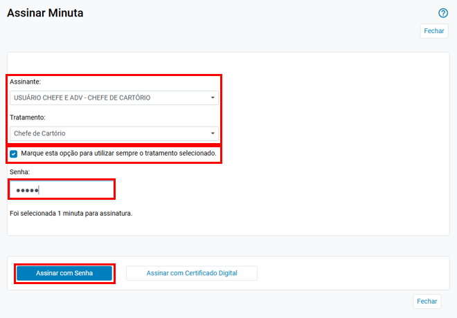

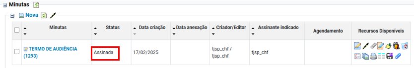

---

<small>PROVIDÊNCIAS APÓS A ASSINATURA DO TERMO DE AUDIÊNCIA</small>
**EPROC PARA CEJUSC****|**Conteúdo integral do curso
<small>**29**</small>
# ▪ PROVIDÊNCIAS APÓS A ASSINATURA

**DO TERMO DE AUDIÊNCIA**

Após a assinatura do termo de audiência de conciliação ou mediação pelo responsável pelo

CEJUSC, independentemente da competência (**Pré-processual**ou**Processual**), será necessária a

atualização do*status*da audiência. Para tanto, clicar no botão**“Audiência”**, disponível na seção

**“Ações”**.
<small>**Descrição da imagem**: seção “Ações”, com destaque para a opção “Audiências”.</small>
Aberta a tela**“Audiências”**, clicar no ícone**“Alterar Audiência”**, representado por uma folha de

sulfite com um lápis, disponível na coluna**“Ações”**.
<small>**Descrição da imagem**: tela “Audiências”, com destaque para o ícone “Alterar Audiência” na coluna “Ações”.</small>
Na tela**“Alterar Audiência”**, clicar em**“Evento”**e selecionar a opção que se adeque ao que ocorreu

na audiência de conciliação, dentre as seguintes disponíveis:

▪**Audiência de conciliação não-realizada**: não realização da audiência devido à ausência

de uma das partes ou de todas;

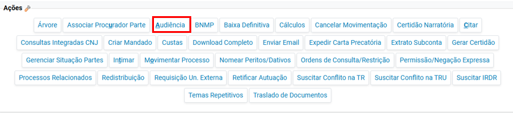

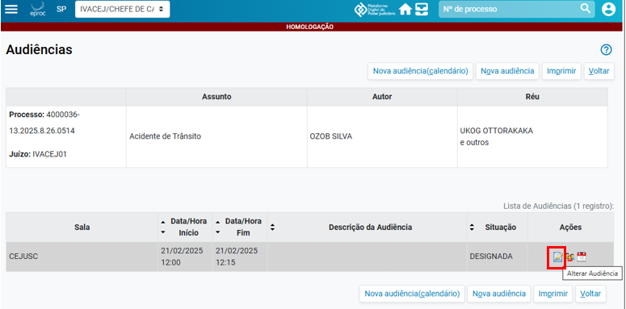

---

<small>PROVIDÊNCIAS APÓS A ASSINATURA DO TERMO DE AUDIÊNCIA</small>
**EPROC PARA CEJUSC****|**Conteúdo integral do curso
<small>**30**</small>
▪**Audiência de conciliação****–****realizada com conciliação****–****Conciliador(a)**ou**Audiência**

**de conciliação****–****realizada com conciliação****–****Mediador(a)**: houve a conciliação das

partes sobre o objeto do litígio;

▪**Audiência de conciliação****–****realizada com conciliação parcial****–****Conciliador(a)**ou

**Audiência de conciliação****–****realizada com conciliação parcial****–****Mediador(a)**: houve a

conciliação parcial das partes sobre o objeto do litígio;

▪**Audiência de conciliação****–****realizada sem conciliação**: tentativa de conciliação restou

infrutífera;

▪**Audiência de conciliação****–****redesignada**: utilizada nas reclamações pré-processuais em

que as partes têm interesse em retomar o diálogo em outro momento.
<small>**Descrição da imagem**: tela “Alterar Audiência”, com opções de status para o evento.</small>
Havendo acordo na sessão de conciliação ou mediação, marcar a caixa de seleção**“Gerou Acordo”**.

Na opção**“Gerenciar Localizadores”**,realizar a gestão dos localizadores conforme o método de

trabalho do CEJUSC. A gestão é mais importante nos casos de reclamação pré-processual, a qual

precisará, se o caso, ser encaminhada para manifestação pelo Ministério Público como fiscal da lei

e, ainda, ser homologada pelo(a) MM. (ª) Juiz(íza) Coordenador(a) do CEJUSC.

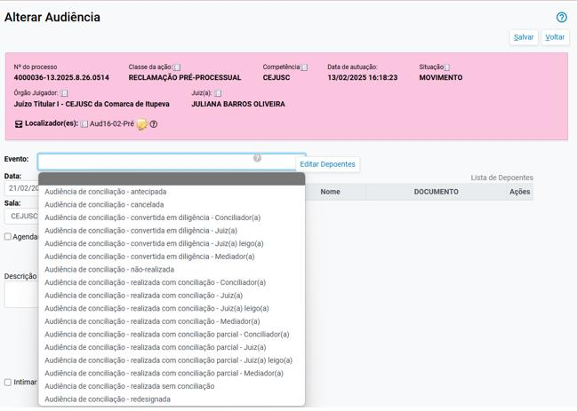

---

<small>PROVIDÊNCIAS APÓS A ASSINATURA DO TERMO DE AUDIÊNCIA</small>
**EPROC PARA CEJUSC****|**Conteúdo integral do curso
<small>**31**</small>
No campo inferior, será possível inserir os arquivos referentes ao termo de audiência digitalizado

e aos documentos das partes.

O primeiro passo será clicar em**“Visualizar Minutas do Processo”**, marcar a caixa de seleção do

termo de audiência elaborado e, após, acionar o ícone**“Enviar minuta para movimentação”**,

representado por um clipe, disponível na coluna**“Recursos Disponíveis”**.

Com isso, o termo de audiência assinado passará a constar no rol dos**“Documentos selecionados**

**e ainda não utilizados em movimentação”**, localizado logo abaixo na tela.
<small>**Descrição da imagem**: opção “Visualizar Minutas do Processo” e destaque ao ícone “Enviar minuta para</small><small>movimentação”.</small>
Na sequência, clicar novamente em**“Adicionar mais documentos”**e acionar a opção**“Escolher**

**arquivo”**. Selecionar o arquivo digitalizado do termo de audiência no formato PDF na janela

aberta. Preencher o campo**“Tipo”**com a informação sobre**TERMO DE AUDIÊNCIA**.

Clicar em**“Confirmar seleção de documentos”**.

Repetir o mesmo procedimento para inserir o arquivo com os documentos das partes,

selecionando o tipo**“Apresentação de documentos”**.

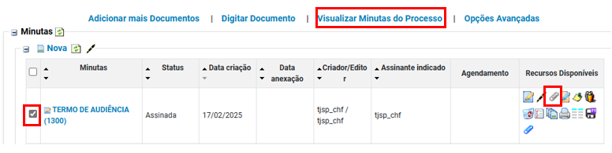

---

<small>PROVIDÊNCIAS APÓS A ASSINATURA DO TERMO DE AUDIÊNCIA</small>
**EPROC PARA CEJUSC****|**Conteúdo integral do curso
<small>**32**</small><small>**Descrição da imagem**: opções para anexar documentos ao termo de audiência.</small>
Preenchidos todos os campos, clicar em**“Salvar”**, alterando a situação da audiência.
<small>**Descrição da imagem**: audiência com a situação atualizada após o preenchimento do evento.</small><small>**Descrição da imagem**: evento lançado sobre a audiência e sua situação.</small>
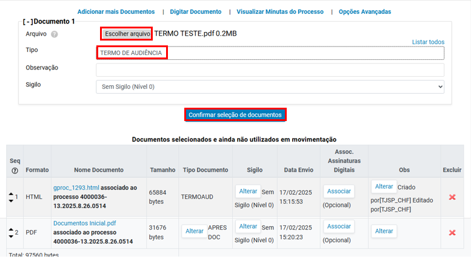

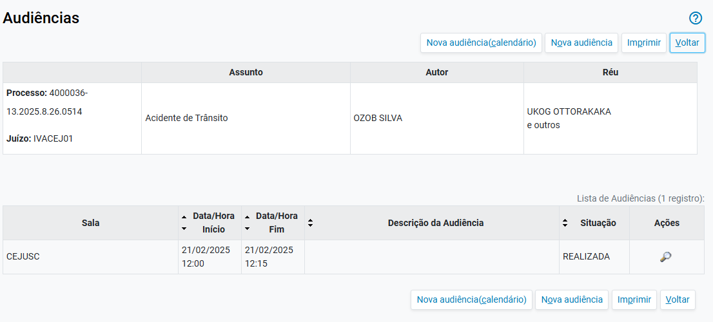

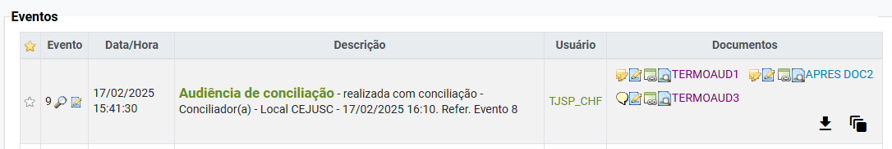

---

<small>PROVIDÊNCIAS APÓS A ASSINATURA DO TERMO DE AUDIÊNCIA</small>
**EPROC PARA CEJUSC****|**Conteúdo integral do curso
<small>**33**</small>
**PROCEDIMENTOS APÓS ALTERAÇÃO DA**

**SITUAÇÃO DA AUDIÊNCIA**

**Competência processual**

Depois de assinado o termo de audiência, realizada a atualização da sua situação, inseridos os

documentos e movimentada a minuta, o processo encaminhado ao CEJUSC (por redistribuição)

para a tentativa de conciliação ou mediação deverá ser devolvido à unidade judicial de origem.

A devolução é realizada pela capa do processo do eproc, acionando o botão**“Movimentar**

**Processo”**, disponível na seção**“Ações”**, ou**“Movimentar”**, localizado entre as**“Ações”**e as

informações dos**“Eventos”**.
<small>**Descrição da imagem**: destaque às opções “Movimentar Processo” e “Movimentar” da capa do processo.</small>
Aberta a tela**“Movimentação Processual”**, o campo**“Evento a ser lançado”**deverá ser preenchido

com**“Remetidos os Autos à Vara/Turma de Origem”**. Na sequência, clicar em**“Movimentar”**para

devolver o processo à unidade judicial de origem.

---

<small>PROVIDÊNCIAS APÓS A ASSINATURA DO TERMO DE AUDIÊNCIA</small>
**EPROC PARA CEJUSC****|**Conteúdo integral do curso
<small>**34**</small><small>**Descrição da imagem**: tela de “Movimentação Processual”, com destaque ao campo “Evento” preenchido e ao</small><small>botão “Movimentar”.</small>
**Competência pré-processual**

As reclamações receberão o adequado andamento conforme o tipo de procedimento e a

existência ou não de acordo entre as partes.

Nas reclamações com termo de audiência**“****infrutífer****o”**ou**“****ausência de qualquer das partes****”**,

após a movimentação do termo de audiência assinado, acionar o botão**“Baixa Definitiva”**,

disponível na seção**“Ações”**da capa do processo.

Caso a conciliação ou mediação seja**frutífera**, serão possíveis as seguintes providências:

▪**Gerenciar o Localizador da reclamação**– neste caso, a reclamação deverá ser

encaminhada para o localizador do órgão do CEJUSC utilizado para a elaboração das

sentenças homologatórias.

O próximo passo é alterar a situação da reclamação. Para isso, clicar em

**“MOVIMENTAR”**e, na tela**“Movimentação Processual”**, preencher o campo**“Evento**

**a ser lançado”**com**“Conclusos para Julgamento”**. Selecionar o(a) magistrado(a)

Coordenador(a) do CEJUSC no campo**“Magistrado”**e, após, clicar em**“Movimentar”**.

A situação do processo será alterada para**“MOVIMENTO –****AGUARDA SENTENÇA”**;

---

<small>PROVIDÊNCIAS APÓS A ASSINATURA DO TERMO DE AUDIÊNCIA</small>
**EPROC PARA CEJUSC****|**Conteúdo integral do curso
<small>**35**</small>
▪**Realização da intimação eletrônica do MP**– para os casos em que atua como fiscal da

lei, realizar a remessa ao Ministério Público para manifestação sobre o acordo

entabulado entre as partes.

Para isso, o CEJUSC deverá acionar o botão**“Intimar”**e configurar a intimação

eletrônica para manifestação pelo MP.

Na tela aberta, clicar na seta para baixo em**“Evento de citação/intimação”**e

selecionar**“Vista ao MP para Parecer”**.

Em opções avançadas, inserir o prazo para manifestação do Ministério Público como

fiscal da lei. No campo**“Vincular Evento de Citação ou intimação”**,clicar na seta para

baixo e selecionar o evento referente ao Termo de audiência.

Gerenciar os localizadores e clicar em**“Intimar”**.

**SESSÕES DE CONCILIAÇÃO VIRTUAIS**

As sessões de conciliação ou mediação dos CEJUSCs poderão ocorrer no ambiente virtual do

Microsoft Teams, sendo conduzida pelo(a) conciliador(a) ou mediador(a), com a presença dos

interessados de forma virtual.

O termo será elaborado pelo(a) conciliador(a) e inserido no chat de mensagens do aplicativo

Teams, para manifestação das partes no próprio chat.

O conteúdo do termo aprovado por todos será extraído do chat e encaminhado ao CEJUSC para a

formalização do termo de sessão, juntamente com os documentos de identificação das partes e

com os demais documentos do caso.

---

<small>MINUTAS DE SENTENÇA HOMOLOGATÓRIA</small>
**EPROC PARA CEJUSC****|**Conteúdo integral do curso
<small>**36**</small>
## ▪ MINUTAS DE SENTENÇA HOMOLOGATÓRIA

As reclamações pré-processuais em que houver acordo entre as partes serão encaminhadas para

o(a) magistrado(a) Coordenador(a) do CEJUSC, para a prolação de sentença homologatória.

Após a assinatura do termo de audiência e atualização da situação da audiência, com o

gerenciamento dos localizadores, clicar em**“Movimentar Processo”**,na seção**“Ações”**,ou acionar

**“Movimentar”**, localizado entre a seção**“Ações”**e a tabela de**“Eventos”**.
<small>**Descrição da imagem**: destaque aos botões “Movimentar Processo” e “Movimentar” da capa do processo.</small>
A tela**“Movimentação Processual”**será aberta. Verificar o localizador da reclamação e, caso

necessário, realizar a alteração.

No campo**“Evento a ser lançado”**,digitar e selecionar**“Conclusos para Julgamento”**. Clicar na

seta para baixo no campo**“Magistrado”**e selecionar o(a) magistrado(a) Coordenador(a) do

CEJUSC.

Clicar em**“Movimentar”**.
<small>**Descrição da imagem**: tela “Movimentação Processual” com os campos preenchidos.</small>
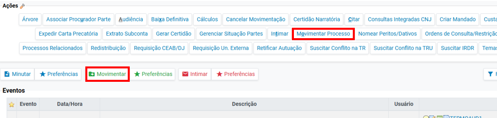

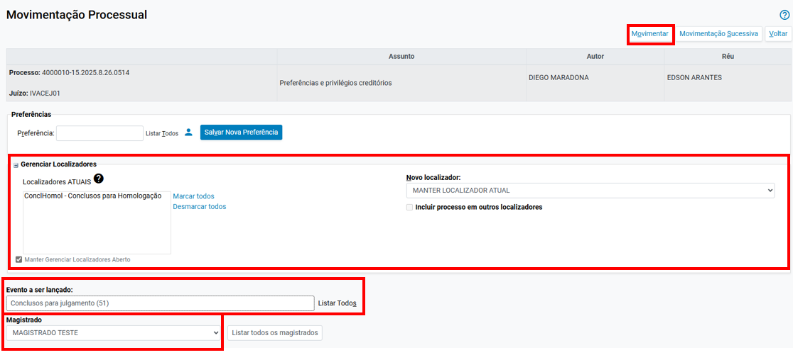

---

<small>MINUTAS DE SENTENÇA HOMOLOGATÓRIA</small>
**EPROC PARA CEJUSC****|**Conteúdo integral do curso
<small>**37**</small>
A situação da reclamação será alterada para**“MOVIMENTO –****AGUARDA SENTENÇA”**.
<small>**Descrição da imagem**: reclamação com a situação MOVIMENTO- AGUARDA SENTENÇA.</small>
A elaboração da minuta de sentença homologatória depende de que a reclamação esteja com a

situação**“MOVIMENTO****-****AGUARDA SENTENÇA”**.

Na sequência, acionar na seção**“Minutas”**a opção**“Nova”**ou clicar em**“Minutar”**.

Na tela**“Nova Minuta”**, selecionar o “Tipo de documento/modelo” na seção “Texto Inicial”. Neste

exemplo, selecionar o modelo-matriz “Sentença”.
<small>**Descrição da imagem**: tela “Nova Minuta” exibindo os campos mencionados.</small>
Após, marcar a caixa de seleção**“Agendar lançamento de evento/troca de localizador”**elançar o

**evento**correspondente à sentença de homologação do acordo estabelecido no CEJUSC

(**“Homologada a Transação”**).

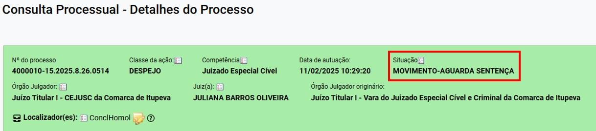

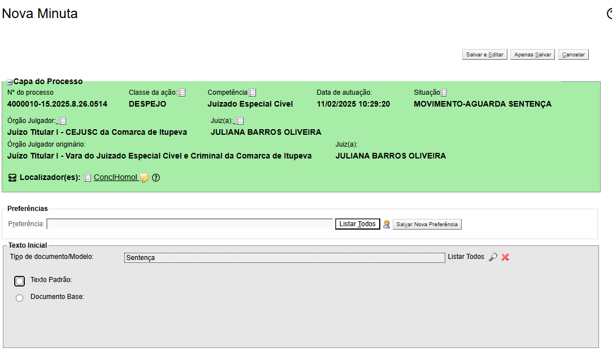

---

<small>MINUTAS DE SENTENÇA HOMOLOGATÓRIA</small>
**EPROC PARA CEJUSC****|**Conteúdo integral do curso
<small>**38**</small><small>**Descrição da imagem**: caixa de seleção “Agendar lançamento de evento/troca de localizador” selecionada e campo</small><small>“Evento a ser lançado” preenchido com o evento “Sentença – Homologada a Transação”.</small>
Caso os envolvidos possuam advogados ou cadastro próprio no sistema eproc, sugere-se realizar

a intimação eletrônica das partes acerca da sentença proferida. Também é necessário selecionar

o evento relacionado à intimação, para que, assim que assinada a sentença, a intimação eletrônica

seja realizada e o respectivo evento fique disponível na seção**“Eventos”**.

O próximo passo é fazer o gerenciamento dos localizadores, inserir a**classificação**,se o caso, a

**descrição**e selecionar**assinante**,**tratamento**,**nível de sigilo**e**status destino**. Em seguida,**“Salvar**

**e Editar”**.

Aberto o editor de textos, redigir o conteúdo da sentença homologatória ou efetuar qualquer

alteração, caso tenha sido utilizado um modelo-padrão da unidade.

Após conferência, é**obrigatório**definir o**dispositivo**da sentença se este não tiver sido configurado

no modelo-padrão. Só assim o eproc reconhecerá a minuta como sentença. Selecionar o trecho do

texto correspondente ao dispositivo e teclar “**Alt+D**” ou “**Ctrl+D**” ou configurar pelo campo

localizado no menu superior do editor de texto.
<small>**Descrição da imagem**: editor de texto do documento, com destaque para o dispositivo da sentença e para o campo</small><small>“Estilo de bloco” com seleção da opção “Dispositivo”.</small>
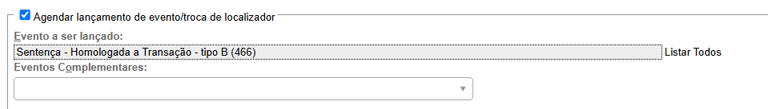

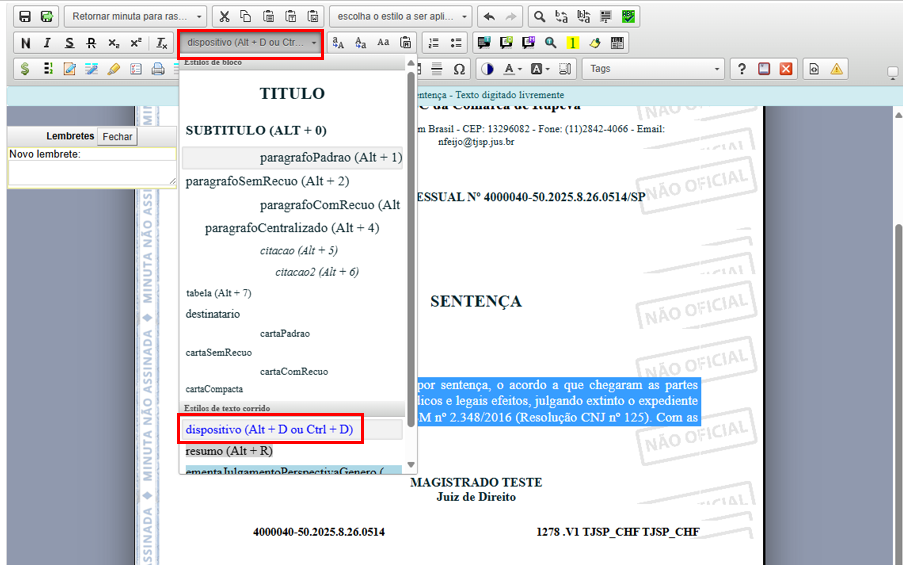

---

<small>MINUTAS DE SENTENÇA HOMOLOGATÓRIA</small>
**EPROC PARA CEJUSC****|**Conteúdo integral do curso
<small>**39**</small>
O trecho ficará na cor azul até o momento da assinatura do documento. Uma vez assinado, ele

retorna à cor padrão.

Se necessário desfazer a marcação do dispositivo, selecioná-lo e teclar “**Ctrl+D**”.
<small>**Descrição da imagem**: editor de texto do documento, com destaque para o dispositivo da sentença na cor azul.</small>
Para finalizar, configurar o campo**“Status desejado ao salvar”**. Neste exemplo, será usado o status

**“Encaminhar minuta para assinatura”**. Em seguida,**“Salvar Minuta e Sair”**.

A minuta da sentença ficará disponível na seção**“Minutas”**, com a coluna Status contendo a

informação**“Para assinar”**.

Após assinatura e disponibilização do documento nos autos, o resumo será visualizado desta forma

na**tabela de****eventos**:
<small>**Descrição da imagem**: seção “Eventos”, tabela de eventos com destaque para o dispositivo da decisão.</small>
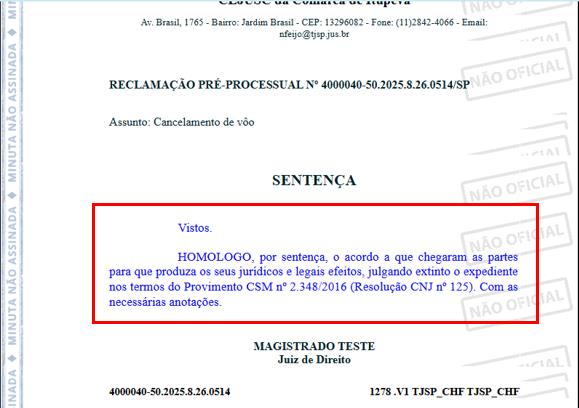

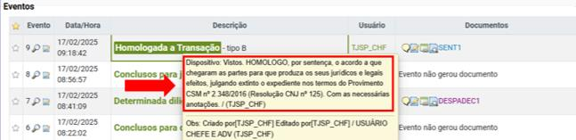

---

<small>MINUTAS DE SENTENÇA HOMOLOGATÓRIA</small>
**EPROC PARA CEJUSC****|**Conteúdo integral do curso
<small>**40**</small>
**ASSINATURA DA MINUTA DE SENTENÇA**

O(a) magistrado(a) poderá assinar as sentenças homologatórias das reclamações de forma

individual ou em lote.

A assinatura poderá ser realizada a partir do**Painel do Magistrado**na lotação do CEJUSC. Na seção

**“Minutas”**, clicar sobre o*link*disponível na coluna**“Quantidade”**da linha**“Minutas para assinar”**.
<small>**Descrição da imagem**: seção “Minutas” do Painel do Magistrado.</small>
A tela**“Minuta Área de Trabalho”**será exibida.

Mover a barra de rolagem para baixo, a fim de localizar, na parte inferior da tela, as reclamações

pendentes de assinatura. O(a) magistrado(a) poderá realizar a assinatura após a conferência das

minutas.

**Assinatura individual**

A assinatura pode ser realizada tanto pelo editor de texto do documento quanto pela tela**“Minuta**

**Área de Trabalho”**. Nas duas hipóteses, localizada a minuta a ser assinada, clicar no ícone**“Assinar**

**minuta”**, representado por uma caneta.
<small>**Descrição da imagem**: tela “Minuta Área de Trabalho” com destaque para ícone “Assinar Minuta”.</small>
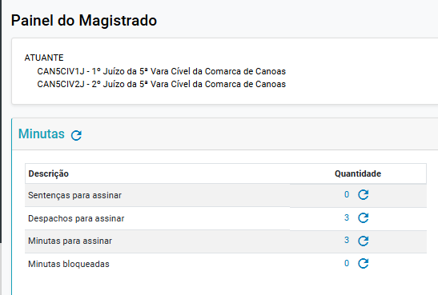

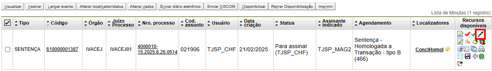

---

<small>MINUTAS DE SENTENÇA HOMOLOGATÓRIA</small>
**EPROC PARA CEJUSC****|**Conteúdo integral do curso
<small>**41**</small>
**Assinatura em lote**

A assinatura em lote depende da conferência, pelo(a) magistrado(a), das minutas elaboradas. A

conferência é realizada ao clicar na primeira coluna à esquerda das minutas de sentença e acionar

o botão**“Visualizar”**.
<small>**Descrição da imagem**: destaque ao processo selecionado e à opção “Visualizar”.</small>
Uma tela com o conteúdo da minuta será aberta para conferência dessa minuta. Acionar as setas

apontando para frente e para trás para navegar entre as minutas abertas.

O(a) magistrado(a) poderá retirar a seleção de uma minuta que não será assinada, desmarcando

a caixa de seleção com a expressão**“(selecionada na área de trabalho)”**.
<small>**Descrição da imagem**: tela aberta com minutas para conferência e com destaque à caixa de seleção “selecionada na</small><small>área de trabalho”.</small>
Conferidas as minutas, clicar em**“Fechar”**. O(a) magistrado(a) retornará à tela**“Minutas Área de**

**Trabalho”**, com as minutas ainda selecionadas.

Clicar no botão**“Assinar”**. A tela**“Assinar lista de minutas”**será exibida.

O(a) magistrado(a) deverá inserir a senha e clicar em**“Assinar com Senha”**. Após processamento,

o eproc informa a conclusão da atividade. Em seguida, acionar**“Fechar”**.

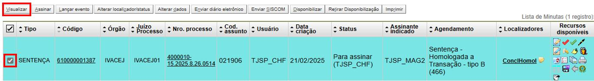

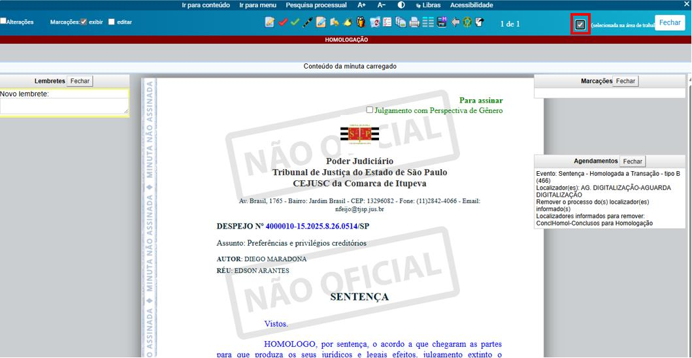

---

<small>MINUTAS DE SENTENÇA HOMOLOGATÓRIA</small>
**EPROC PARA CEJUSC****|**Conteúdo integral do curso
<small>**42**</small><small>**Descrição da imagem**: tela “Assinar lista de minutas”.</small>
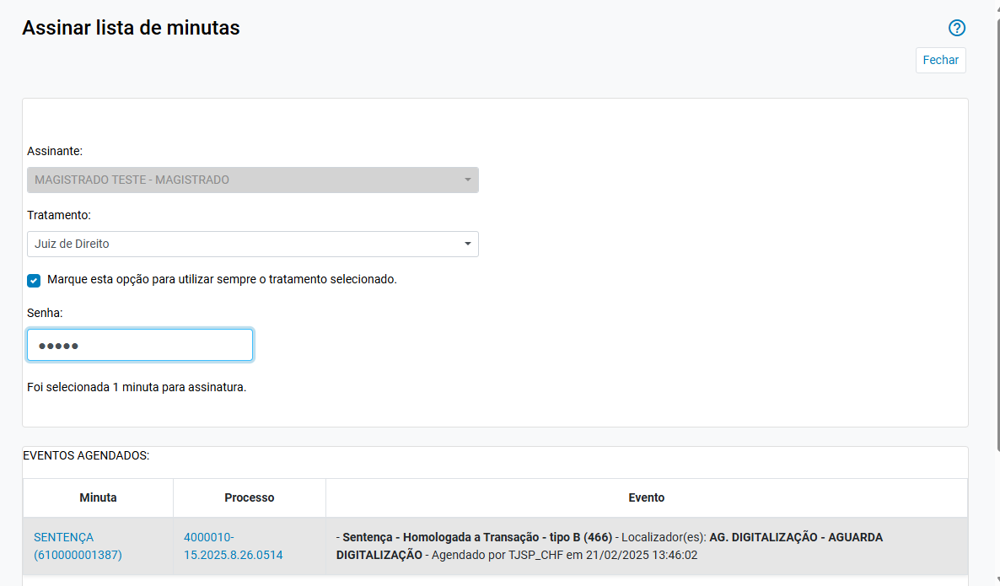

---

<small>EVOLUÇÃO DE CLASSE</small>
**EPROC PARA CEJUSC****|**Conteúdo integral do curso
<small>**43**</small>
# ▪ EVOLUÇÃO DE CLASSE

Na competência**Pré-processual**,os CEJUSCs possuem uma importante atividade a ser realizada,

principalmente após a homologação dos acordos obtidos nas sessões de conciliação e mediação.

Trata-se da evolução de classe da reclamação, realizada quando o processo se inicia em uma classe

processual e, após um fato novo, tem sua classe alterada.

A classe originária da reclamação deverá ser evoluída de**“11875****- Reclamação Pré-****Processual”**ou

**“12136****- Pedido de Mediação Pré-****Processual”**para a classe**“12374****- Homologação de Transação**

**Extrajudicial”**.

A realização da operação é feita ao acessar o item**“Retificação de Autuação”**do**menu lateral**,

dentro da categoria**Retifica Autuação**.

Na tela**“Consulta Processual –****Retificar Processo”**,preencher o campo**“Nº Processo”**com o

número do processo a ter a classe evoluída. Clicar em**“Consultar”**.
<small>**Descrição da imagem**: tela “Consulta Processual – Retificar Processo” com destaque ao campo “nº processo” e ao</small><small>botão “Consultar”.</small>
Clicar na seta para baixo no campo**“Classe da Ação”**e selecionar a opção**“Homologação de**

**Transação Extrajudicial”**.

Na sequência, acionar**“Salvar”**para finalizar o procedimento.

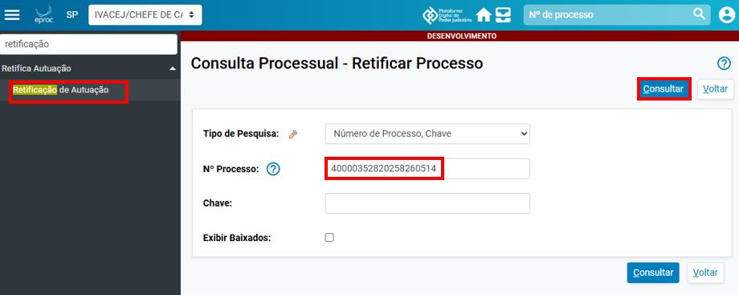

---

<small>EVOLUÇÃO DE CLASSE</small>
**EPROC PARA CEJUSC****|**Conteúdo integral do curso
<small>**44**</small><small>**Descrição da imagem**: campo “Classe da Ação” alterado para “Homologação da Transação Extrajudicial”.</small>
Em se tratando de acordo de sucessão*causa mortis*, deverá ser utilizado o assunto**“50283 –**

**Partilha de bens do Direito das Sucessões****–****CEJUSC”**e o*de cujus*deverá ser cadastrado no polo

passivo com o tipo de participação**“Inventariado”**.

A atualização do assunto é realizada na própria tela de**“Retificação Autuação Processual”**, campo

**“Assuntos”**, localizado logo abaixo do**“Ramo do Direito”**; basta clicar na opção**“Assunto”**e

realizar o filtro de pesquisa.
<small>**Descrição da imagem**: destaque ao campo “Assunto” da tela “Retificação Autuação Processual”.</small>
A inclusão de*de cujus*no polo passivo deverá ser realizada na capa do processo, seção**“Partes e**

**Representantes”**, acionando o botão**“Editar”**e, na sequência, o botão**“Incluir Nova Parte”**,

realizando o cadastro com as informações necessárias.

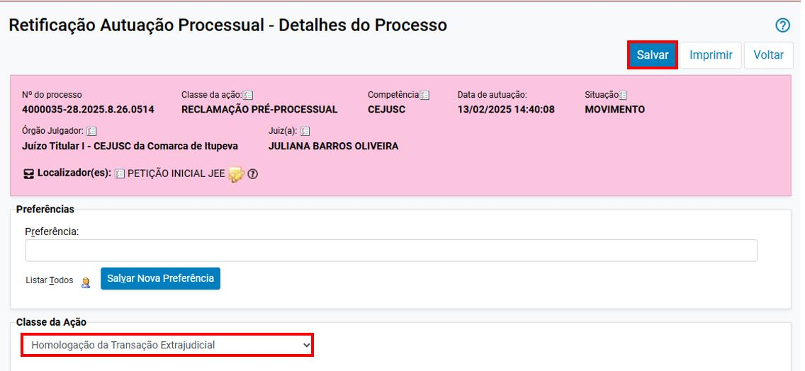

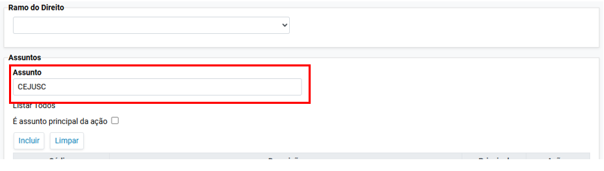

---

**EPROC PARA CEJUSC****|**Conteúdo integral do curso

**CRÉDITOS**

**PORTAL NACIONAL DO CONHECIMENTO EPROC**

*Material desenvolvido pelo TJSP.*
