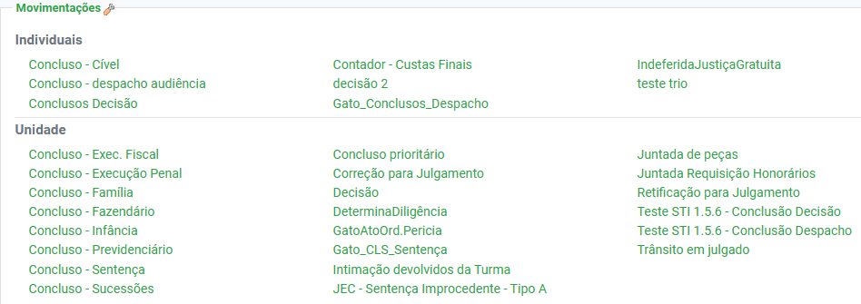
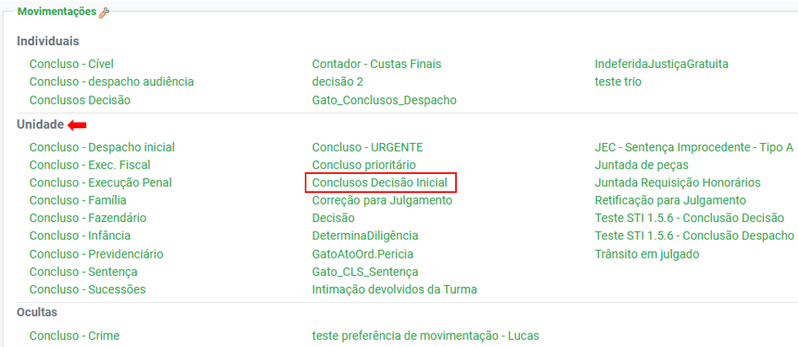
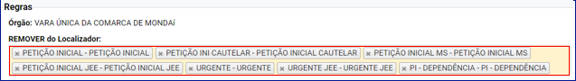
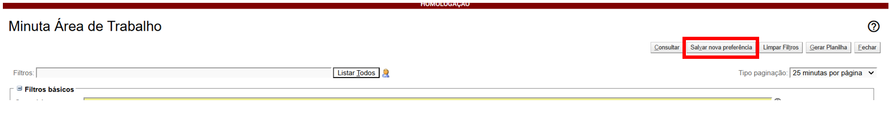
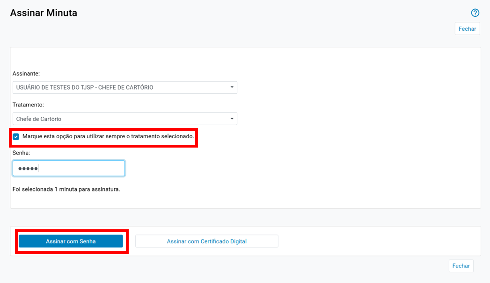
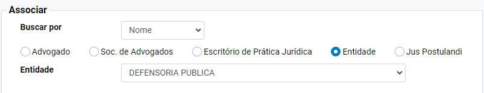

# ▪ CAPA DO PROCESSO

*Documento eProc - Material de Treinamento*

---

---

<small>Imagem decorativa de capa: símbolo do eproc, composto por ilustração de 3 círculos azuis com intersecção entre si,</small><small>e seu logotipo ao lado.</small>
*PORTAL NACIONAL DO CONHECIMENTO EPROC*

**EPROC PARA GABINETE****–**

**MÓDULO INTERMEDIÁRIO**

## Conteúdo integral do curso

Atualizado em**01/07/2025.**

---

**SUMÁRIO**

**EPROC**

**PARA**

**GABINETE**

**–**

**MÓDULO**

**INTERMEDIÁRIO**
<small>▪</small>
**CAPA DO PROCESSO ______________________________________________________________________ 6**
<small>CONTEXTO GERAL</small><small>6</small><small>CAPA DO PROCESSO</small><small>6</small><small>LEMBRETES</small><small>7</small><small>▪</small>
**PARTES E REPRESENTANTES _____________________________________________________________ 11**
<small>Gerenciamento de partes a partir do ícone “Editar”</small><small>11</small><small>Consulta a partir do link contido no nome das partes</small><small>19</small><small>▪</small>
**SUBSTABELECIMENTO NO EPROC _______________________________________________________ 22**
<small>CONTEXTO GERAL</small><small>22</small><small>SUBSTABELECIMENTO INDIVIDUAL</small><small>22</small><small>SUBSTABELECIMENTO EM BLOCO</small><small>26</small><small>RECEBIMENTO DO SUBSTABELECIMENTO</small><small>28</small><small>REVOGAÇÃO DO SUBSTABELECIMENTO</small><small>29</small><small>Com reserva de poderes</small><small>29</small><small>Sem reserva de poderes</small><small>31</small><small>▪</small>
**LOCALIZADORES DO ÓRGÃO ____________________________________________________________ 33**
<small>CRIAÇÃO DOS LOCALIZADORES DO ÓRGÃO</small><small>33</small><small>Nomenclatura</small><small>34</small><small>Uso de emojis</small><small>35</small><small>ALTERAÇÃO DO CADASTRO DO LOCALIZADOR DO ÓRGÃO</small><small>36</small><small>DESATIVAÇÃO DO LOCALIZADOR DO ÓRGÃO</small><small>37</small><small>ÍCONES EXISTENTES NA COLUNA “AÇÕES” DA TELA “LOCALIZADORES DO ÓRGÃO”</small><small>37</small><small>AÇÕES PREFERENCIAIS POR LOCALIZADOR</small><small>38</small><small>▪</small>
**AUTOMATIZAÇÃO DE TRAMITAÇÃO PROCESSUAL****–****INTRODUÇÃO, MODELAGEM DE**

**PROCESSOS, LÓGICA E LOCALIZADORES _______________________________________________________ 42**
<small>MODELAGEM DE PROCESSOS</small><small>43</small><small>LÓGICA NA TRAMITAÇÃO DOS PROCESSOS ELETRÔNICOS</small><small>44</small><small>Princípios lógicos</small><small>45</small>

---

**EPROC PARA GABINETE****–****MÓDULO INTERMEDIÁRIO****|**Conteúdo integral do curso
<small>**3**</small><small>LOCALIZADORES</small><small>47</small><small>▪</small>
**AUTOMATIZAÇÃO DE TRAMITAÇÃO PROCESSUAL****–****EFICIÊNCIA DAS**

**AUTOMATIZAÇÕES _______________________________________________________________________________ 51**
<small>Formação de gargalos</small><small>51</small><small>Como evitar a formação de gargalos</small><small>52</small><small>RAZÕES PARA AUTOMATIZAR</small><small>53</small><small>BLOCOS DE RACIOCÍNIO</small><small>53</small><small>GESTÃO DAS AUTOMATIZAÇÕES</small><small>54</small><small>▪</small>
**AUTOMATIZAÇÃO DE TRAMITAÇÃO PROCESSUAL****–****PASSOS INICIAIS E CAMPOS**

**DISPONÍVEIS ______________________________________________________________________________________ 55**
<small>PASSOS INICIAIS PARA AUTOMATIZAÇÃO</small><small>55</small><small>DADOS PARA IMPULSIONAR O PROCESSO</small><small>55</small><small>CRIAR UMA REGRA DE AUTOMATIZAÇÃO</small><small>58</small><small>CAMPOS DISPONÍVEIS NA TELA “CADASTRAR NOVA REGRA DE ATP”</small><small>59</small><small>Campo “Remover do Localizador”</small><small>59</small><small>Campo “Incluir no Localizador”</small><small>61</small><small>Campo “Tipo de Controle”</small><small>61</small><small>▪</small>
**AUTOMATIZAÇÃO DE TRAMITAÇÃO PROCESSUAL****–****FILTROS OPCIONAIS __________ 64**
<small>▪</small>
**AUTOMATIZAÇÃO DE TRAMITAÇÃO PROCESSUAL****–****REGRAS DE AUTOMATIZAÇÃO****–**

**PARTE I ____________________________________________________________________________________________ 66**
<small>Priorização das regras</small><small>66</small><small>Classificação das regras</small><small>67</small><small>Ações disponíveis para gerenciar as regras de automatização</small><small>68</small><small>CRIAÇÃO DE REGRAS</small><small>68</small><small>Automatização para triagem de processos de entrada</small><small>68</small><small>▪</small>
**AUTOMATIZAÇÃO DE TRAMITAÇÃO PROCESSUAL****–****REGRAS DE AUTOMATIZAÇÃO****–**

**PARTE II ___________________________________________________________________________________________ 76**
<small>Automatização para triagem de processos com base em informações de cadastro e dados</small><small>complementares</small><small>76</small><small>Automatização no ciclo de citação</small><small>79</small><small>▪</small>
**AUTOMATIZAÇÃO DE TRAMITAÇÃO PROCESSUAL****–****REGRAS DE AUTOMATIZAÇÃO****–**

**PARTE III __________________________________________________________________________________________ 84**
<small>Automatização em localizadores de Emenda da Petição Inicial</small><small>84</small><small>▪</small>
**AUTOMATIZAÇÃO DE TRAMITAÇÃO PROCESSUAL****–****DISPONIBILIZAÇÃO E**

**IMPORTAÇÃO DE GRUPOS DE AUTOMATIZAÇÃO _____________________________________________ 91**

---

**EPROC PARA GABINETE****–****MÓDULO INTERMEDIÁRIO****|**Conteúdo integral do curso
<small>**4**</small><small>IMPORTAÇÃO DE GRUPOS DE AUTOMATIZAÇÃO</small><small>92</small><small>▪</small>
**TRIAGEM DE PETIÇÕES INICIAIS ________________________________________________________ 95**
<small>TRIAGEM DE PETIÇÕES INICIAIS</small><small>95</small><small>Criação das regras de automatização</small><small>96</small><small>Triagem por competência</small><small>97</small><small>Triagem por classe do processo</small><small>101</small><small>▪</small>
**TRIAGEM DE PETIÇÕES INTERMEDIÁRIAS ____________________________________________ 105**
<small>Criação das regras de automatização</small><small>106</small><small>Triagem por tipo de petição</small><small>107</small><small>▪</small>
**MINUTAS****–****ÁREA DE TRABALHO ______________________________________________________ 111**
<small>SEÇÃO “MINUTAS”</small><small>111</small><small>Filtros disponíveis na tela “Minuta Área de Trabalho”</small><small>111</small><small>Função “Agrupar Minutas”</small><small>114</small><small>Inserir filtros de minutas no Painel Inicial</small><small>115</small><small>▪</small>
**MINUTAS****–****EDITOR DE TEXTOS _______________________________________________________ 118**
<small>Campo “Estilo de Formatação”</small><small>119</small><small>Campo “Maiúsculas/Minúsculas”</small><small>120</small><small>Campo “Tags”</small><small>120</small><small>Outros ícones disponíveis no editor de textos</small><small>122</small><small>Ícones de salvar e status desejado ao salvar</small><small>127</small><small>▪</small>
**ALTERAÇÃO EM LOTE DE MINUTAS ___________________________________________________ 129**
<small>Edição em lote da minuta</small><small>132</small><small>▪</small>
**ASSINATURA DE MINUTAS ____________________________________________________________ 134**
<small>LOCALIZAÇÃO DAS MINUTAS PARA ASSINAR</small><small>134</small><small>Filtro de minutas para assinar urgente</small><small>135</small><small>ASSINATURA DAS MINUTAS</small><small>137</small><small>Assinatura de minutas em lote</small><small>138</small><small>▪</small>
**ÁREA DE TRABALHO DAS MINUTAS****–****VISÃO GERAL E PESQUISA POR**

**CLASSIFICAÇÃO ________________________________________________________________________________ 142**
<small>Visão geral</small><small>142</small><small>Uso de classificação como filtro para pesquisa</small><small>144</small><small>▪</small>
**ÁREA DE TRABALHO DAS MINUTAS****–****PESQUISA POR DESCRIÇÃO, POR AÇÃO E POR**

**COMPETÊNCIA __________________________________________________________________________________ 150**
<small>Uso de descrição como filtro para pesquisa</small><small>150</small>

---

**EPROC PARA GABINETE****–****MÓDULO INTERMEDIÁRIO****|**Conteúdo integral do curso
<small>**5**</small><small>Uso de ações da minuta como filtro para pesquisa</small><small>152</small><small>Uso de competência como filtro para pesquisa</small><small>154</small><small>▪</small>
**RELATÓRIOS****–****PARTE I _________________________________________________________________ 156**
<small>RELATÓRIO GERAL</small><small>156</small><small>Importantes filtros de pesquisa</small><small>162</small><small>▪</small>
**RELATÓRIOS****–****PARTE II ________________________________________________________________ 164**
<small>RELATÓRIO DE EVENTOS LANÇÁVEIS POR SITUAÇÃO ATUAL</small><small>164</small><small>RELATÓRIO DE PROCESSOS SEM MOVIMENTAÇÃO NOS ÚLTIMOS “N” DIAS</small><small>165</small><small>RELATÓRIO DE ACESSOS AO SISTEMA</small><small>167</small><small>RELATÓRIO ESTATÍSTICO DE MINUTA</small><small>168</small><small>▪</small>
**OUTRAS AÇÕES NO PROCESSO ________________________________________________________ 170**
<small>Associar procurador à parte</small><small>170</small><small>Nomear perito</small><small>173</small><small>Requisição para unidade externa</small><small>175</small><small>Requisição CEAB/DJ</small><small>178</small><small>CRÉDITOS</small><small>181</small>

---

**EPROC PARA GABINETE****–****MÓDULO INTERMEDIÁRIO****|**Conteúdo integral do curso
<small>**6**</small>
# ▪ CAPA DO PROCESSO

**CONTEXTO GERAL**

O módulo intermediário abordará mais detalhadamente funções e ferramentas do sistema eproc

que permitem agilidade e eficiência na tramitação de processos de forma intuitiva. Com elas, a

prestação jurisdicional é mais célere e a leitura de processos por usuários internos e externos, mais

simples.

**CAPA DO PROCESSO**

Como visto no módulo básico, na capa do processo estão informações importantes deste, como

os dados cadastrais, a distribuição, a unidade judicial e a fase do andamento processual.

Ao consultar um processo no eproc, será aberta a tela “Consulta Processual – Detalhes do

Processo”, conhecida como “Capa do Processo”, na qual há ações que permitem ao usuário o

cumprimento dos autos.

Na parte superior dela, o eproc traz algumas etiquetas vermelhas com dados importantes do

processo consultado, previamente anotados na seção “Informações Adicionais”. Essas etiquetas

correspondem às tarjas dos antigos processos físicos e digitais, ou seja, são dados relevantes,

exibidos em forma de alerta para os usuários.
<small>**Descrição da imagem**: informações adicionais em destaque na capa do processo, como etiquetas e os botões de</small><small>atividade.</small>
Ao lado das etiquetas, o sistema exibe botões de atividade dentre os quais destacamos o botão

“Download Completo”, que gera um arquivo PDF único, com todas as peças dos autos eletrônicos.

Na sequência, o sistema traz a capa do processo propriamente dita: um retângulo colorido, cuja

cor varia de acordo com a classe processual cadastrada, com informações como o número do

processo, a classe da ação, a competência, a data de autuação, a situação, o Órgão Julgador, o(a)

Juiz(a), os localizadores e os eventuais processos relacionados (apensados).

---

**EPROC PARA GABINETE****–****MÓDULO INTERMEDIÁRIO****|**Conteúdo integral do curso
<small>**7**</small><small>**Descrição da imagem**: capa do processo com os dados cadastrados.</small>
**Atenção**

Toda vez que aparecer o ícone “Histórico” ao lado de um campo da capa do processo,

significa que existe um histórico de todos os registros já cadastrados para esse

campo.
<small>**Descrição da imagem**: capa do processo com destaque para o histórico da situação.</small>
**LEMBRETES**

Os lembretes são notas ou alertas rápidos relacionados ao processo como um todo, os quais

podem ser associados diretamente à capa do processo.

Eles ajudam o usuário a lembrar de ações importantes ou pendências que precisam ser observadas

no cumprimento dos autos. Por não integrarem a árvore do processo, não se tratam de minutas.

---

**EPROC PARA GABINETE****–****MÓDULO INTERMEDIÁRIO****|**Conteúdo integral do curso
<small>**8**</small><small>**Descrição da imagem**: seção “Lembretes” da capa do processo.</small>
Na capa do processo, por meio do ícone “Personalizar Visualização dos Lembretes”, representado

pelo desenho de uma ferramenta, é aberta a tela “Configurações personalizadas”.
<small>**Descrição da imagem**: seção “Lembretes” com destaque para o ícone “Personalizar Visualização dos Lembretes”.</small>
Nela estão disponíveis diversas opções de personalização. Entre elas, que os lembretes sejam

exibidos toda vez que o processo for movimentado em uma carga ou remessa e que os lembretes

sejam cadastrados e visualizados com cores, ambas na seção “Lembretes”.
<small>**Descrição da imagem**: seção “Lembretes” da tela “Configurações personalizadas”.</small>
Para cadastrar um novo lembrete, basta clicar no ícone “Novo Lembrete” ou diretamente na

palavra “Novo”.
<small>**Descrição da imagem**: seção “Lembretes” com destaque para o ícone “Novo Lembrete”.</small>
Ao clicar em “Novo Lembrete”, o sistema abrirá a janela “Cadastro de Lembretes”.

---

**EPROC PARA GABINETE****–****MÓDULO INTERMEDIÁRIO****|**Conteúdo integral do curso
<small>**9**</small><small>**Descrição da imagem**: janela “Cadastro de Lembretes”.</small>
No cadastro, o usuário preencherá campos referentes a:

▪ descrição: o texto aqui anotado será o exibido como lembrete;

▪ destinatário do lembrete:

**◦**

“Para usuários internos” - com seleção do órgão e usuário de destino; para

todos ou apenas para um determinado usuário; com opção de exibição do

lembrete na movimentação do processo e anotação do período de validade;

**◦**

“Para usuários externos” - devendo ser inserido o nome ou login do usuário e

eventual período de validade;

**◦**

“Usuários externos (procuradores do processo)”, podendo selecionar todos ou

apenas determinado procurador e anotar eventual período de validade do

lembrete;

▪ cor do lembrete: possibilidade de convenção por parte do Gestor da Unidade para fácil

identificação de determinadas situações, como: para todos os processos que

contenham penhora no rosto dos autos, deverão ser cadastrados lembretes na cor

vermelha, servindo como um alerta aos servidores que trabalharem com o processo;

---

**EPROC PARA GABINETE****–****MÓDULO INTERMEDIÁRIO****|**Conteúdo integral do curso
<small>**10**</small><small>**Descrição da imagem**: seleção de cor do lembrete.</small>
▪ “Mostrar lembretes desativados e vencidos”: ao marcar esta caixa de seleção, o

sistema exibirá todos os lembretes já cadastrados para o processo.
<small>**Descrição da imagem**: opção de seleção “Mostrar desativados e vencidos”.</small>
Na sequência, são exibidos os lembretes válidos para os usuários internos e os botões de atividade

“Salvar” e “Fechar”.

Na aba “Ações”, o usuário poderá desativar o lembrete, clicando no respectivo ícone representado

pelo desenho de uma lixeira, ou alterar o lembrete já cadastrado, no ícone representado pelo

desenho de um lápis.
<small>**Descrição da imagem**: seção “Lembretes para usuários internos”.</small>

---

**EPROC PARA GABINETE****–****MÓDULO INTERMEDIÁRIO****|**Conteúdo integral do curso
<small>**11**</small>
# ▪ PARTES E REPRESENTANTES

Na seção “Partes e Representantes” da tela “Capa do processo”, o usuário pode realizar inúmeras

ações relacionadas às partes processuais, como inclusão, alteração, exclusão e cadastramento de

advogados, com a verificação da regularidade do cadastro das pessoas físicas e jurídicas, de acordo

com os dados da Receita Federal, e do eventual falecimento das partes do processo.

Na parte superior dessa faixa, há 3 ícones de atividades: “Editar Partes e Representantes”,

“Histórico de Retificação das Partes” e “Verificar Partes Presas ou Internadas”.
<small>**Descrição da imagem**: seção “Partes e Representantes” com destaque para os ícones de atividades.</small>
**Gerenciamento de p****artes a partir do ícone “Editar”**

Ao clicar em “Editar”,o sistema abrirá a tela**“Gerenciamento de Partes”**com uma série de

recursos referentes aos polos ativo e passivo.
<small>**Descrição da imagem**: tela “Gerenciamento de Partes” com destaque para os botões de atividade.</small>

---

**EPROC PARA GABINETE****–****MÓDULO INTERMEDIÁRIO****|**Conteúdo integral do curso
<small>**12**</small>
**Botão “Salvar”**

O botão “Salvar” salva as edições realizadas pelo usuário.

**Botão “Associar Procurador”**

Em “Associar Procurador”, o usuário poderá incluir, editar e excluir advogado para a parte.

**Atenção**

O próprio advogado se habilita automaticamente no processo como usuário

Procurador do sistema eproc a partir da correta juntada da procuração ou, ainda,

quando realiza o substabelecimento a partir de uma movimentação gerada pelo

sistema, sem a necessidade de juntada do documento (pdf).

Não sendo feita essa habilitação de forma correta, caberá ao usuário servidor

proceder às devidas associações das partes e seus procuradores.

Ao clicar em “Associar Procurador”, o sistema abrirá a tela**“Gerenciamento de Procuradores de**

**Partes”**.
<small>**Descrição da imagem**: tela “Gerenciamento de Procuradores de Partes”.</small>
A tela “Gerenciamento de Procuradores de Partes” contém o número do processo, um alerta

chamado “Atenção”, todas as partes do processo e os procuradores já cadastrados e a faixa

“Ações” com todos os botões de atividade.

---

**EPROC PARA GABINETE****–****MÓDULO INTERMEDIÁRIO****|**Conteúdo integral do curso
<small>**13**</small>
O alerta “Atenção” informa que, para associar um procurador para mais de uma parte, o usuário

deve selecionar as partes desejadas e clicar no botão “Adicionar”. Feito isso, na tela seguinte o

eproc exibe as partes selecionadas e um campo para associação do procurador referente.
<small>**Descrição da imagem**: tela “Gerenciamento de Procuradores de Partes” com destaques.</small>
O usuário pode pesquisar o procurador a partir do número da OAB ou pelo nome, indicando ser

“Procurador Dativo” ou “Procurador”. Inseridas as informações corretamente, clicar em “Incluir”.

Para adicionar um procurador para uma parte, basta selecioná-la e, em “Ações”, clicar no ícone

“Adicionar Procurador”, representado pelo desenho de círculo verde com um sinal de adição

branco ao centro.
<small>**Descrição da imagem**: parte da tela “Gerenciamento de Procuradores de Partes” com destaque.</small>
No exemplo fictício da imagem acima, a parte do tipo “Exequente – ‘Agostini Materiais’” já possui

um procurador cadastrado, indicado na aba “Procurador”, que não é dativo nem voluntário. Na

coluna “Ações”, o usuário poderá editar este procurador já cadastrado por meio do ícone “Editar

Procurador”, representado por uma sulfite com um lápis, ou removê-lo por meio do “Remover

Procurador”, representado por uma lixeira.

---

**EPROC PARA GABINETE****–****MÓDULO INTERMEDIÁRIO****|**Conteúdo integral do curso
<small>**14**</small><small>**Descrição da imagem**: aba “Ações” com destaque aos botões “Adicionar Procurador”, “Editar Procurador” e</small><small>“Remover Procurador”.</small>
**Botão “Permissão Expressa”**

Ferramenta importante para o controle de acesso a informações com níveis elevados de sigilo

dentro do sistema eproc, o botão “Permissão Expressa” configura a concessão de acesso a

processos ou documentos com nível de sigilo superior ao permitido a um usuário externo pelo seu

perfil padrão.
<small>**Descrição da imagem**: tela “Cadastro de Permissões”.</small>
**Botão “Representação de Partes”**

Em “Representação de Partes” serão cadastrados os advogados, procuradores ou responsáveis

legais para as partes do processo que precisam de representação, como os menores, a massa

falida, o espólio, o civilmente incapaz, entre outros.

Ao clicar em “Representação de Partes”, o sistema abrirá a respectiva tela, exibindo a capa do

processo e os campos para seleção da parte a ser representada, sua qualificação, o representante

---

**EPROC PARA GABINETE****–****MÓDULO INTERMEDIÁRIO****|**Conteúdo integral do curso
<small>**15**</small>
ou interveniente, a qualificação deste e a anotação referente à sua atuação ou não como parte do

processo.
<small>**Descrição da imagem**: tela “Representação de Partes”.</small>
**Atenção**

Se o representante não for parte do processo, o usuário, por primeiro, deverá

cadastrá-lo no sistema para que, então, ele possa ser associado ao representado.

Ao salvar a representação, o nome do representante passa a constar na capa do processo.
<small>**Descrição da imagem**: seção “Partes e Representantes” com destaque para a representante da parte ré.</small>

---

**EPROC PARA GABINETE****–****MÓDULO INTERMEDIÁRIO****|**Conteúdo integral do curso
<small>**16**</small>
**Botão “Incluir Nova Parte”**

Ao clicar no botão “Incluir Nova Parte”, o sistema abrirá a tela “Gerenciamento de Partes –

Cadastro de Partes” e o usuário poderá consultar uma parte a partir do número do seu documento

de identificação, como CPF ou CNPJ, se pessoa física ou jurídica, respectivamente, ou do seu nome.

Em seguida, clicar em “Consultar”.
<small>**Descrição da imagem**: tela “Gerenciamento de Partes – Cadastro de Partes” com destaque aos campos “CPF”,</small><small>“Pessoa Física sem CPF” e “Pesquisar pelo nome”.</small>
Ao clicar em “Consultar”, o eproc apresentará a lista de partes, devendo ser indicado seu tipo

(autor, réu, MP, interessado etc. ) e a informação sobre eventual Justiça Gratuita (deferida,

indeferida, não requerida etc. ). Por último, em “Ações”, clicar em “Incluir”.

Se a parte não possuir CPF, o usuário deverá marcar o campo “Pessoa Física sem CPF”,

selecionando “ESTRANGEIRO SEM CPF”, “MENOR DE IDADE” ou “SEM DOCUMENTOS”.
<small>**Descrição da imagem**: menu suspenso do campo “Pessoa Física sem CPF”.</small>

---

**EPROC PARA GABINETE****–****MÓDULO INTERMEDIÁRIO****|**Conteúdo integral do curso
<small>**17**</small>
Na tela “Cadastro de Pessoa Sem Dados Completos”, inserir os dados da parte constantes no

processo, clicando, então, em “Salvar”.
<small>**Descrição da imagem**: tela “Cadastro de Pessoa sem Dados Completos”.</small>
O sistema retornará à tela “Consulta Processual – Detalhes do Processo”, também chamada de

“Capa do Processo”, já exibindo a nova parte.

De volta à seção “Partes e Representantes”, ao clicar no ícone “Editar” as partes do processo são

listadas.
<small>**Descrição da imagem**: tela “Gerenciamento de Partes”.</small>

---

**EPROC PARA GABINETE****–****MÓDULO INTERMEDIÁRIO****|**Conteúdo integral do curso
<small>**18**</small>
A lista de partes contém as seguintes abas:

▪ “CPF/CNPJ”;

▪ “Nome da Parte”;

▪ “Tipo Parte”: autor, réu, MP, interessado, amicus curiae, ordenante, rogante,

assistente de acusação, ofendido, assistente de defesa, confrontante, herdeiro,

testemunha autor, testemunha réu e jurado;

▪ “Situação”: importante campo de anotação para a área Criminal, com as diversas

situações das partes. Nas demais competências, por padrão, o sistema traz o campo

previamente preenchido como “NORMAL”;

▪ “Justiça Gratuita”: “Deferida”, “Indeferida”, “Não requerida”, “Parcialmente

Deferida”, “Requerida”, “Requerida no Recurso” e “Revogada”;

▪ “Principal”: “SIM” para as partes principais. Para estas, em “Ações”, o eproc trará o

ícone “Retirar parte como sendo principal”, representado por um tique na cor

vermelha. Para as não anotadas como principais, haverá o ícone “Tornar Parte como

principal”, representado por um tique na cor verde;

▪ “Ações”: com diversos ícones, tais como, “Retirar Parte como sendo principal”,

“Marcar Parte como excluída digital”, “Excluir parte do processo”, “Consultar Parte do

processo”, “Histórico da Parte”, “Alterar Parte do processo”, “Permitir acesso ao

processo”, “Adicionar Procurador”, entre outros.
<small>**Descrição da imagem**: ícones de “Ações” da tela “Gerenciamento de Partes”.</small>

---

**EPROC PARA GABINETE****–****MÓDULO INTERMEDIÁRIO****|**Conteúdo integral do curso
<small>**19**</small>
**Botão “Importar Partes de Processo”**

A partir desse botão, o usuário pode importar as partes de um outro processo, facilitando sua

inclusão.

Na tela “Gerenciamento de Partes – Importar Partes de Processo”, o usuário deverá: inserir o

número do processo cuja parte será importada; anotar os campos referentes ao tipo de parte,

justiça gratuita e importação dos procuradores já cadastrados; e, conferidos os dados, clicar em

“Importar Partes”.
<small>**Descrição da imagem**: tela “Gerenciamento de Partes – Importar Partes de Processo”.</small>
**Botão “Imprimir”**

Versão de impressão dos dados ou dos documentos associados às partes do processo constantes

da tela “Gerenciamento de Partes”.

**Botão “Fechar”**

Fecha a tela “Gerenciamento de Partes”, retornando à tela capa do processo (“Consulta Processual

– Detalhes do Processo”)

**Consulta a partir do link contido no nome das partes**

A seção “Partes e Representantes” possibilita também a consulta às partes do processo a partir de

um clique sobre os respectivos nomes já cadastrados.
<small>**Descrição da imagem**: seção “Partes e Representantes” da tela “Gerenciamento de Partes – Importar Partes de</small><small>Processo”.</small>

---

**EPROC PARA GABINETE****–****MÓDULO INTERMEDIÁRIO****|**Conteúdo integral do curso
<small>**20**</small>
Na seção “Partes e Representantes”, o sistema exibe o nome da parte, a idade (se pessoa natural),

o número do CPF ou CNPJ seguido de um sinal (um tique na cor verde é um indicativo de situação

regular do CPF ou CNPJ na Receita Federal), a indicação expressa se pessoa física, pessoa jurídica

(privada) ou entidade (como o Ministério Público e a Defensoria Pública) e, logo abaixo, o nome

do advogado ou procurador, cujos dados também podem ser consultados a partir do link constante

no seu nome, com o respectivo número de inscrição na OAB.

Ao clicar sobre o nome da parte, o sistema abrirá a tela “Consultar Pessoa Física” ou “Consultar

Pessoa Jurídica” com botões de atividades, como “Alterar Dados Pessoais”, “Atualizar Dados da

Receita”, “Atualizar Contatos”, “Imprimir Endereços” e “Fechar”.
<small>**Descrição da imagem**: tela “Consultar Pessoa Física”.</small>
**Botão****“Alterar Dados Pessoais”**

Usado para alterações manuais nos dados pessoais das partes cadastradas no sistema, como

endereço, telefone, e-mail e contatos de WhatsApp.

**Botão “Atualizar Dados da Receita”**

A partir desse botão, os dados da pessoa são sincronizados com as informações disponíveis na

base da Receita Federal.

---

**EPROC PARA GABINETE****–****MÓDULO INTERMEDIÁRIO****|**Conteúdo integral do curso
<small>**21**</small>
**Botão “Atualizar Contatos”**

Aqui, o sistema abre a tela “Alterar Cadastro” para correção dos dados da parte, tais como

documentos, cadastro de dependentes, endereço, contatos da parte como endereço de e-mail,

número de WhatsApp, comunicação por aplicativos de mensagens, formação e grau de

escolaridade.

**Botão “Imprimir Endereços”**

Fornece uma lista com todos os endereços da parte registrados no processo.

**Botão “Fechar”**

Fecha a tela “Consultar Pessoa Física/Jurídica”, retornando a “Consulta Processual – Detalhes do

Processo” (“Capa do Processo”).

---

**EPROC PARA GABINETE****–****MÓDULO INTERMEDIÁRIO****|**Conteúdo integral do curso
<small>**22**</small>**▪**SUBSTABELECIMENTO NO EPROC****
**CONTEXTO GERAL**

No sistema eproc não é mais preciso realizar a juntada do substabelecimento (documento em

PDF).

O advogado originário poderá substabelecer os poderes que lhe foram outorgados por meio de

uma movimentação gerada no eproc.

O substabelecimento pode ser feito**com ou sem reserva de poderes**, sendo necessário que o

advogado substabelecido esteja devidamente cadastrado no sistema.

É possível realizar o procedimento de forma individual ou em bloco, conforme será demonstrado

a seguir.

**SUBSTABELECIMENTO INDIVIDUAL**

Para realizar o substabelecimento de forma individual, após acessar o sistema, o advogado pode

proceder de duas formas:

▪ Por meio do**menu lateral**, selecionando a opção**Substabelecimento**>

**Substabelecimento Individual**.
<small>**Descrição da imagem**: menu lateral com destaque para as opções “Substabelecimento” e “Substabelecimento</small><small>Individual”.</small>

---

**EPROC PARA GABINETE****–****MÓDULO INTERMEDIÁRIO****|**Conteúdo integral do curso
<small>**23**</small>
Em seguida, selecionar o tipo de pesquisa. Neste caso, optaremos pelo número do processo,

inserindo-o nos campos correlatos e acionando o botão**Consultar**para acessar a tela

**Substabelecimento de Processo**.

▪ Pela capa do processo. Inserir o número do processo no campo de pesquisa**(1)**e, na

seção**Ações (2)**,selecionar o botão**Substabelecimentos (3)**para acessar a tela

**Substabelecimento de Processo**.
<small>**Descrição da imagem**: capa do processo com destaque para os itens numerados acima.</small>
Na tela**Substabelecimento de Processo**, o advogado deve selecionar o**Tipo de**

**substabelecimento**(com ou sem reserva)**(1)**e o tipo de**Busca**(se por nome ou login e, além disso,

se por advogado, sociedade de advogados ou escritório de prática jurídica)**(2)**, inserindo o nome

do substabelecido no campo correspondente**(3)**para realizar a busca.
<small>**Descrição da imagem**: tela “Substabelecimento de Processo” com destaque para aos itens citados.</small>
Ao localizar o nome do substabelecido e clicar sobre ele, o sistema automaticamente carregará o

nome no campo localizado à direita da tela**(1)**e, neste caso, exibirá o campo**Sociedade de**

**Advogados**com a informação “Não representado por Sociedade de Advogados”**(2)**. Selecionar a

**Parte Representada (3)**e em seguida, clicar**em Gerar Substabelecimento****(4)**.

---

**EPROC PARA GABINETE****–****MÓDULO INTERMEDIÁRIO****|**Conteúdo integral do curso
<small>**24**</small><small>**Descrição da imagem**: tela “Substabelecimento de Processo” com destaque aos itens citados.</small>
**Atenção**

Quando necessário indicar mais de um substabelecido, o advogado deverá inserir o

nome do favorecido no respectivo campo para que o sistema efetue a busca.

Após o processamento, o sistema apresenta o**Resultado do Substabelecimento de Processo**.
<small>**Descrição da imagem**: tela “Resultado do Substabelecimento de Processo”.</small>
Ao acessar o processo, é possível visualizar, na seção**Partes e Representantes**, o advogado

substabelecido, o qual passará a receber as publicações e intimações eletrônicas.
<small>**Descrição da imagem**: capa do processo, seção “Partes e Representantes” com destaque para o advogado</small><small>substabelecido.</small>

---

**EPROC PARA GABINETE****–****MÓDULO INTERMEDIÁRIO****|**Conteúdo integral do curso
<small>**25**</small>
A depender do**Tipo de Substabelecimento**escolhido, o advogado substabelecente será mantido

ou não na capa do processo. Se selecionado o substabelecimento**com reserva**de poderes,

**substabelecente**e**substabelecido(s)**são mantidos; se opção for**sem reserva**de poderes,

permanece(m)**apenas o(s) substabelecido(s)**.
<small>**Descrição da imagem**: capa do processo, seção “Ações” – à esquerda, “Substabelecimento com reserva” com</small><small>exibição de todos os advogados; à direita, “Substabelecimento sem reserva”, exibindo apenas o advogado</small><small>substabelecido.</small>
Na tabela de**eventos**, o sistema exibe o evento gerado relacionado ao substabelecimento.
<small>**Descrição da imagem**: capa do processo, seção “Eventos” exibindo o evento relacionado ao substabelecimento.</small>
Uma vez realizado o(s) substabelecimento(s)**sem reserva de poderes**, o botão

**Substabelecimentos**deixar de ser exibido para o advogado substabelecente, o que não ocorre

quando o substabelecimento é com reserva.
<small>**Descrição da imagem**: capa do processo, seção “Ações” exibindo os botões existentes, exceto o botão</small><small>“Substabelecimentos”.</small>

---

**EPROC PARA GABINETE****–****MÓDULO INTERMEDIÁRIO****|**Conteúdo integral do curso
<small>**26**</small>
**SUBSTABELECIMENTO EM BLOCO**

Esta ferramenta possibilita que o advogado realize substabelecimentos em múltiplos processos

em uma única vez, de forma prática e eficiente.

Para isso, o advogado deve selecionar, no**menu lateral**, a opção**Substabelecimento**>

**Substabelecimento em Bloco**.
<small>**Descrição da imagem**: menu lateral com destaque para as opções “Substabelecimento” e “Substabelecimento em</small><small>Bloco”.</small>
Ao clicar sobre a opção**Substabelecimento em Bloco**, o sistema exibirá a tela**Substabelecimento**

**de Processo**. O advogado deve proceder ao preenchimento dos campos, nos mesmos moldes do

tópico “**Substabelecimento Individual**”, sendo opcional seleção da Vara ou Turma Recursal.

Em seguida selecionar, na relação de processos exibida, aqueles nos quais será realizado o

substabelecimento e clicar em**Gerar Substabelecimento**.

---

**EPROC PARA GABINETE****–****MÓDULO INTERMEDIÁRIO****|**Conteúdo integral do curso
<small>**27**</small><small>**Descrição da imagem**: tela “Substabelecimento de Processo” com destaque para o campo “Vara Estadual ou Turma</small><small>Recursal”, coluna para seleção de processo e botão “Gerar Substabelecimento”.</small>
Após o processamento, o sistema exibirá o**Resultado do Substabelecimento de Processo em**

**Bloco**.
<small>**Descrição da imagem**: tela “Resultado do Substabelecimento de Processo em Bloco”.</small>
Assim como ocorre no**Substabelecimento Individual**, ao realizar o**Substabelecimento em Bloco**,

é possível visualizar, na capa dos processos, o nome do advogado substabelecido. Vale lembrar

que se o tipo do substabelecimento for com reserva de poderes, aparecerão o nome do

substabelecente e do substabelecido; se for sem reserva, somente o nome do substabelecido.

---

**EPROC PARA GABINETE****–****MÓDULO INTERMEDIÁRIO****|**Conteúdo integral do curso
<small>**28**</small>
**RECEBIMENTO DO SUBSTABELECIMENTO**

No sistema eproc, o advogado substabelecido poderá conferir o(s) substabelecimento(s) no**Painel**

**do Advogado**, seção**Área de Trabalho**, selecionando a aba**Substabelecimento**e clicando sobre o

número que se encontra na coluna**Quantidade**da linha**Recebidos nos últimos 30 dias**.
<small>**Descrição da imagem**: Painel do Advogado, seção “Área de trabalho”, aba “Substabelecimento” com destaque para</small><small>a linha “Recebidos nos últimos 30 dias”.</small>
Ao clicar sobre a quantidade de processos, o sistema apresenta a tela “Substabelecimentos

recebidos nos últimos 30 dias”, com relação dos processos, nome da parte, tipo de

substabelecimento, quem é o substabelecente e a data que foi realizada a operação.
<small>**Descrição da imagem**: tela “Substabelecimentos recebidos nos últimos 30 dias”.</small>

---

**EPROC PARA GABINETE****–****MÓDULO INTERMEDIÁRIO****|**Conteúdo integral do curso
<small>**29**</small>
**REVOGAÇÃO DO SUBSTABELECIMENTO**

**Com reserva de poderes**

Para revogar o substabelecimento realizado com reserva de poderes, o advogado**substabelecente**

deve acessar o processo e, na seção**Ações**, acionar o botão**Substabelecimentos**.
<small>**Descrição da imagem**: capa do processo, seção “Partes e Representantes” com destaque ao advogado</small><small>substabelecente, à seção “Ações” e botão “Substabelecimentos”.</small>
Após o processamento, o sistema exibirá a tela**Substabelecimento de Processo**e, então, o

advogado deve acionar o ícone**Revogar Substabelecimento**, localizado na coluna**Ações**.
<small>**Descrição da imagem**: tela “Substabelecimento de Processo” com destaque para o ícone “Revogar</small><small>Substabelecimento”.</small>

---

**EPROC PARA GABINETE****–****MÓDULO INTERMEDIÁRIO****|**Conteúdo integral do curso
<small>**30**</small>
Ao acionar o ícone, o sistema exibe uma mensagem confirmando se o usuário realmente deseja

realizar a revogação do substabelecimento para o advogado em questão.
<small>**Descrição da imagem**: caixa de mensagem solicitando confirmação da revogação.</small>
Ao clicar em**OK**, o sistema exibe uma nova mensagem, informando que a revogação foi efetuada

com sucesso.
<small>**Descrição da imagem**: caixa de mensagem confirmando a efetivação da revogação.</small>
O sistema gera automaticamente um evento relacionado à revogação do substabelecimento.
<small>**Descrição da imagem**: capa do processo, seção “Eventos” exibindo o evento relacionado à revogação do</small><small>substabelecimento.</small>
Consequentemente, o advogado substabelecido é excluído da capa do processo e, na seção**Partes**

**e Representantes**, só constará o advogado substabelecente.
<small>**Descrição da imagem**: capa do processo, seção “Partes e Representantes” exibindo apenas o advogado</small><small>substabelecente.</small>

---

**EPROC PARA GABINETE****–****MÓDULO INTERMEDIÁRIO****|**Conteúdo integral do curso
<small>**31**</small>
**Sem reserva de poderes**

Para realizar a revogação do substabelecimento sem reserva de poderes, o advogado

**substabelecido**deve acessar o processo e, na seção**Ações**, clicar no botão**Substabelecimentos**e

em seguida proceder ao substabelecimento sem reservas ao**advogado originário**.
<small>**Descrição da imagem**: capa do processo, seção “Partes e Representantes” com destaque para o advogado</small><small>substabelecido, seção “Ações” e botão “Substabelecimentos”.</small>
Na tela**Substabelecimento de Processo**, o substabelecido deve selecionar a opção**Sem Reserva**.

Em**Tipo de substabelecimento**, preencher o campo correspondente com o nome do advogado

originário, selecionar a parte e clicar em**Gerar Substabelecimento**.
<small>**Descrição da imagem**: tela “Substabelecimento de Processo” com destaque à opção “Sem Reserva” em “Tipo de</small><small>substabelecimento”, ao advogado originário, à parte representada e ao botão “Gerar Substabelecimento”.</small>

---

**EPROC PARA GABINETE****–****MÓDULO INTERMEDIÁRIO****|**Conteúdo integral do curso
<small>**32**</small>
Após o processamento, o sistema exibirá a tela**Resultado do Substabelecimento de Processo**com

as informações do processo substabelecido.
<small>**Descrição da imagem**: tela “Resultado do Substabelecimento de Processo”.</small>
Revogado o substabelecimento**sem reserva**de poderes pelo advogado**substabelecido**, seu nome

é excluído da seção**Partes e Representantes**, passando a constar o nome do**advogado originário**.
<small>**Descrição da imagem**: capa do processo, seção “Partes e Representantes” exibindo apenas o advogado originário.</small>

---

**EPROC PARA GABINETE****–****MÓDULO INTERMEDIÁRIO****|**Conteúdo integral do curso
<small>**33**</small>
# ▪ LOCALIZADORES DO ÓRGÃO

Como visto, os localizadores do órgão são criados pela unidade judicial para gerenciar e organizar

os processos com base na rotina dos servidores e magistrados, refletindo a posição do processo

ao longo do seu trâmite.

Os localizadores podem ser criados e excluídos por qualquer usuário, inclusive estagiários, sem a

possibilidade, até o momento, de verificar quem efetuou estas tarefas, exceto por meio de

auditoria.

**CRIAÇÃO DOS LOCALIZADORES DO ÓRGÃO**

Aqui vale a pena reforçar a importância de:

▪ alinhar com toda a equipe (unidade judicial e gabinete) a criação de localizadores para

que sejam efetivamente necessários à unidade;

▪ não replicar no sistema eproc as metodologias utilizadas no sistema anterior, que

podem comprometer a lógica da tramitação do processo;

▪ gerir continuamente os localizadores, excluindo os que se tornaram obsoletos e

criando novos sempre que necessário.

**Importante**

A exclusão de localizadores somente é possível se eles não estiverem vinculados a

processo ou utilizados em automatizações.

A criação de localizadores é uma tarefa simples, mas que requer cuidado devido à sua importância

dentro do eproc. Para manter a padronização dentro da unidade judicial e evitar inconveniências,

a seguir será recapitulado o processo de criação de localizadores e sugeridas algumas diretrizes

com relação à nomenclatura e ao preenchimento dos campos de cadastro.

Primeiro, buscar e acessar**(1)**a tela “Localizadores do Órgão” no menu lateral. Nela**(2)**, clicar em

“Novo”**(3)**.

---

**EPROC PARA GABINETE****–****MÓDULO INTERMEDIÁRIO****|**Conteúdo integral do curso
<small>**34**</small><small>**Descrição da imagem**: tela do eproc com menu lateral exibindo busca pelo termo “localizadores”, página</small><small>“Localizadores do Órgão” aberta ao centro e destaque aos itens citados.</small>
**Nomenclatura**

Em seguida, inserir um nome para o localizador, sua sigla (sugere-se repetir o nome), especificar

se ele será fixo ou não e elaborar uma descrição, de extrema importância para que todos saibam

a quais casos ele se aplica. Após, “Salvar”.
<small>**Descrição da imagem**: tela “Novo Localizador do Órgão” com seus campos preenchidos.</small>
É importante padronizar a nomenclatura dos localizadores, facilitando sua gestão e utilização,

inclusive para obter melhor fluidez, andamento especializado, utilização do bloco de raciocínio,

entre outras vantagens.

Sendo assim, uma alternativa é nomear com a primeira letra de cada palavra em caixa alta (letra

maiúscula), as seguintes em caixa baixa (minúscula) e, caso a unidade tenha duas ou mais

competências, uma sigla à frente do nome que diferencie o localizador. Exemplos: “FAM – Ag.

Contestação”, “JEC – Ag. Audiência”, “CIV – Ag. Emenda Inicial”, “CRI – Ag. Resposta Escrita” etc.

Caso julgue pertinente, a unidade pode desenvolver uma tabela de controle interno com as siglas,

suas descrições e critérios de separação no eproc, conforme exemplo.

---

**EPROC PARA GABINETE****–****MÓDULO INTERMEDIÁRIO****|**Conteúdo integral do curso
<small>**35**</small>
**Prefixo eproc**

**(localizador)**

**Descrição**

**Critérios de separação no eproc**
<small>**CIV**(Cível Geral)</small><small>Todos os processos inerentes ao</small><small>procedimento comum cível e que não sejam</small><small>de outras áreas (Fazenda Pública, Juizados,</small><small>Família e Infância)</small><small>Prioridade e competência: “Civil –</small><small>Acidentes de Trânsito” OU “Civil –</small><small>Cobrança” OU “Civil – Consumidor”</small><small>OU “Civil – Contratos Civis” OU</small><small>“Civil Contratos Comerciais” etc.</small><small>**FAZ**(Fazenda Pública)</small><small>Processos em que há no polo passivo ente</small><small>público de um modo geral. A triagem</small><small>automatizada é complexa, tendo em vista</small><small>que seria necessário prever todas as</small><small>entidades no polo passivo, mas a triagem por</small><small>competência é muito eficiente.</small><small>Prioridade e competência:</small><small>“Fazenda Pública – Desapropriação”</small><small>OU “Fazenda Pública” OU</small><small>“Registros Públicos” OU “Ações</small><small>Constitucionais” OU “Tributário –</small><small>exceto Execução Fiscal” etc.</small>
Também é possível nomear os localizadores por fase de tramitação, como “FP Inicial – busca e

apreensão”. “FP” significa “fase postulatória” e, se o processo estiver vinculado a um localizador

de fase postulatória, pode-se concluir que ainda não houve citação.

Outra sugestão é utilizar nomes objetivos, que indiquem exatamente para que serve aquele

determinado localizador, como “Aguarda Emenda Inicial”.

A utilização de códigos deve ser evitada por dificultar a compreensão dos usuários. Suponha-se a

existência de um localizador chamado “Agcon”, uma abreviação de “Aguarda Contestação”. No

caso de novos servidores ou servidores transferidos para a unidade, deve-se considerar o quão

intuitivos serão os títulos utilizados.

**Uso de emojis**

É possível utilizar emojis nos nomes dos localizadores, mas com cautela para que estejam

relacionados ao teor do localizador.

Um emoji de uma caneta pode ser usado em um localizador sobre assinatura de alvará, assim

como um emoji de ampulheta condiz com um localizador de decurso de prazo, por exemplo.

Se utilizado, o emoji deve ser inserido ao final do título a fim de não comprometer a busca por

digitação. Basta posicionar o cursor após o nome do localizador, clicar com o botão inverso do

mouse, selecionar “Emojis”, pesquisar o desejado e, por fim, “Salvar”.

---

**EPROC PARA GABINETE****–****MÓDULO INTERMEDIÁRIO****|**Conteúdo integral do curso
<small>**36**</small><small>**Descrição da imagem**: tela “Alterar Localizador do Órgão” com destaque às opções de emojis e ao botão “Salvar”.</small>
**ALTERAÇÃO DO CADASTRO DO**

**LOCALIZADOR DO ÓRGÃO**

Para realizar algum tipo de alteração do cadastro do localizador do órgão, na tela “Localizadores

do Órgão”, selecionar o localizador a ser alterado e clicar no ícone “Alterar Localizador do Órgão”,

representado por uma folha de papel e um lápis.
<small>**Descrição da imagem**: tela “Localizadores do Órgão” com um localizador selecionado e destaque ao ícone “Alterar</small><small>Localizador do Órgão”.</small>
Na tela “Alterar Localizador do Órgão”, realizar a alteração e clicar em “Salvar”.
<small>**Descrição da imagem**: tela “Alterar Localizador do Órgão” com alteração feita na sigla.</small>

---

**EPROC PARA GABINETE****–****MÓDULO INTERMEDIÁRIO****|**Conteúdo integral do curso
<small>**37**</small>
**DESATIVAÇÃO DO LOCALIZADOR DO ÓRGÃO**

Para desativar um localizador do órgão, ir até a tela “Localizadores do Órgão”, selecionar o

localizador desejado e clicar no ícone “Desativar Localizador Órgão”. Em seguida, confirmar a

desativação.

Essa ação será possível somente se o localizador não estiver vinculado a processos ou utilizado em

automatizações.
<small>**Descrição da imagem**: tela “Localizadores do Órgão” com destaque para o ícone “Desativar Localizador Órgão”.</small>
**ÍCONES EXISTENTES NA COLUNA “AÇÕES” DA**

**TELA “LOCALIZADORES DO ÓRGÃO”**

Assim que criado um localizador, ele passa a fazer parte da relação de localizadores do órgão da

unidade e é exibido na tela “Localizadores do Órgão”.
<small>**Descrição da imagem**: tela “Localizadores do Órgão” exibindo localizador criado.</small>
Na coluna “Ações” estão presentes os seguintes ícones:

▪**“****Incluir Memo em localizador****”**(representado por uma sulfite amarela e um lápis): o

sistema exibe a tela “Memo Localizador Órgão”. Nela, o campo “Informações” pode

ser preenchido com informações do localizador. Feito isso, clicar em “Salvar”. O ícone

será alterado, representado agora por um balão de diálogo amarelo. Ao posicionar o

mouse sobre ele (na relação de localizadores ou na capa do processo), o sistema exibe

o texto que foi inserido e o usuário responsável. Para excluir o memo, clicar sobre o

balão e, então, “Desativar”.

▪**“Consultar Localizador Órgão”**(representado por uma sulfite azul e uma lupa):

permite consultar os campos de cadastro do localizador, porém não habilita nenhum

campo para alteração.

---

**EPROC PARA GABINETE****–****MÓDULO INTERMEDIÁRIO****|**Conteúdo integral do curso
<small>**38**</small>
▪**“Alterar Localizador Órgão”**(representado por uma sulfite azul e um lápis): permite

realizar alterações nos dados do localizador, como nome, sigla e descrição. O campo

“Localizador Fixo” não permite alteração se no momento de sua criação foi

selecionada a opção “Não”. Esta situação será abordada mais adiante.

▪**“Listar Minutas Agendadas”**(representado por duas colunas paralelas de quatro

linhas cada, a primeira azul e as demais, cinza): exibe as minutas pendentes de

assinatura com agendamento selecionado para aquele determinado localizador.

▪**“Desativar Localizador Órgão”**(representado por uma folha amassada e duas setas

verdes): este ícone está presente somente na coluna “Ações” dos localizadores que

não estão associados a nenhum processo (quando na coluna “Total de processos”

aparece o número zero). Ao acioná-lo, o sistema solicita a confirmação da desativação.

Ao clicar em “OK”, o localizador é desativado.

▪**“Listar alterações do localizador”**(representado por uma lupa): o eproc exibe a tela

“Histórico do Localizador” com as alterações realizadas, data e horário, usuário

responsável, a identificação anterior e a atual.

▪**“Tornar localizador fixo”**(representado por um alfinete de mapa): o localizador torna-

se fixo e a cor do alfinete, que era cinza, fica verde. Automaticamente o campo

“Localizador fixo” (que pode ser consultado pelo ícone “Consultar Localizador Órgão”)

é alterado para a opção “Sim” e o campo fica habilitado para alteração se selecionado

o ícone “Alterar Localizador do Órgão”.

**AÇÕES PREFERENCIAIS POR LOCALIZADOR**

Como visto anteriormente, o eproc permite a vinculação de ações preferenciais a determinados

localizadores.

Essa vinculação é realizada com o objetivo de não “poluir” localizadores com ações preferenciais

que não serão utilizadas naquela etapa processual. Por exemplo, uma ação preferencial

relacionada à movimentação “Conclusos Decisão Inicial” deve estar vinculada apenas aos

localizadores relacionados às petições iniciais.

---

**EPROC PARA GABINETE****–****MÓDULO INTERMEDIÁRIO****|**Conteúdo integral do curso
<small>**39**</small><small>**Descrição da imagem**: tela “Ações preferenciais por localizador do órgão” exibindo lista de localizadores referentes</small><small>a petição inicial, todos com a movimentação “Conclusos Decisão Inicial”.</small>
Por outro lado, essa mesma ação preferencial não deve ser aplicada aos processos que estejam

em fase de sentença, pois nestes casos a movimentação aplicável é “Conclusos Sentença”.

A seguir, será demonstrado o acesso a essa ação preferencial (“Conclusos Decisão Inicial”), que

está oculta dos localizadores que não estão vinculados a ela, para utilizá-la, se necessário.

No exemplo da imagem abaixo, o processo possui os localizadores “Conclusos – Assistente Lucas”

e “Teste – SGP4”.
<small>**Descrição da imagem**: capa do processo com destaque para a exibição dos localizadores “Conclusos - Assistente</small><small>Lucas” e “Teste – SGP4”.</small>
Ao acessar a seção das “Ações Preferenciais” de “Movimentação”, o sistema exibirá as ações

preferenciais individuais. Selecionada a opção “Mostrar preferências da unidade”, também

aparecerão as preferências da unidade.

---

**EPROC PARA GABINETE****–****MÓDULO INTERMEDIÁRIO****|**Conteúdo integral do curso
<small>**40**</small><small>**Descrição da imagem**: visualização das ações preferenciais de movimentação.</small>
Como é possível observar na imagem acima, a ação preferencial de movimentação “Conclusos

Decisão Inicial” está oculta, não aparecendo em nenhuma das subseções (“Individuais” ou

“Unidade”), pois o processo não possui nenhum localizador ao qual ela esteja relacionada.

Porém, é possível visualizá-la clicando no ícone “Ações Preferenciais”, representado por uma

chave inglesa, e selecionando a opção “Mostrar preferências ocultas”.
<small>**Descrição da imagem**: visualização das ações preferenciais de movimentação com destaque para o ícone “Ações</small><small>preferenciais” e para a opção “Mostrar preferências ocultas”.</small>
Realizada a seleção, o sistema exibe as subseções de ações preferenciais “Individuais”, “Unidade”

e “Ocultas”. Nesta, pode-se visualizar e utilizar a ação “Conclusos Decisão Inicial”.
<small>**Descrição da imagem**: visualização das ações preferenciais de movimentação com destaque para as subseções</small><small>“Individuais”, “Unidade” e “Ocultas” e para o item “Conclusos decisão inicial”.</small>

---

**EPROC PARA GABINETE****–****MÓDULO INTERMEDIÁRIO****|**Conteúdo integral do curso
<small>**41**</small>
Se neste mesmo processo houver o localizador “PETIÇÃO INICIAL”, por exemplo, a ação

preferencial em questão não se encontraria na subseção “Ocultas”, mas na “Unidade”, conforme

podemos observar na imagem abaixo.
<small>**Descrição da imagem**: visualização das ações preferenciais de movimentação com destaque para a ação preferencial</small><small>“Conclusos Decisão Inicial” dentro da subseção “Unidade”.</small>

---

**EPROC PARA GABINETE****–****MÓDULO INTERMEDIÁRIO****|**Conteúdo integral do curso
<small>**42**</small>
## ▪ AUTOMATIZAÇÃO DE TRAMITAÇÃO

**PROCESSUAL****–****INTRODUÇÃO, MODELAGEM**

**DE PROCESSOS, LÓGICA E LOCALIZADORES**

Com o objetivo de otimizar, simplificar e desburocratizar o andamento processual, o sistema eproc

permite automatizar tarefas a partir de configurações realizadas pelas próprias equipes da unidade

judicial e gabinete.

Essas configurações possibilitam, entre outras coisas, a movimentação automática de processos

entre localizadores, acionada por um gatilho que pode ser um evento, o decurso de um prazo ou

ainda a entrada de uma petição.

As automatizações também permitem:

▪ realizar a triagem de processos ou petições;

▪ promover a limpeza dos processos com a desvinculação de localizadores;

▪ controlar prazos, metas e prioridades.

**Importante**

Neste primeiro momento, as automatizações não lançam eventos e não realizam

intimações de forma automática.

Ressalta-se, novamente, que não devem ser replicadas no sistema eproc as metodologias

utilizadas no sistema anterior.

O funcionamento correto da automatização depende que a unidade possua um fluxo funcional de

localizadores, representando o caminho que o processo percorre desde o ajuizamento da petição

inicial até seu arquivamento.

No entanto, antes de estruturar esse fluxo funcional, é fundamental realizar o mapeamento dos

processos de trabalho. A modelagem de processos é uma ferramenta que auxilia muito nesta

atividade.

---

**EPROC PARA GABINETE****–****MÓDULO INTERMEDIÁRIO****|**Conteúdo integral do curso
<small>**43**</small>
**MODELAGEM DE PROCESSOS**

A modelagem de processos nada mais é do que a representação gráfica dos processos de trabalho

executados em uma organização.

É uma importante ferramenta que nos permite entender e analisar os fluxos de trabalho existentes

na unidade e, a partir disso, realizar as automatizações desejadas. Isto significa que, antes de iniciar

a automatização de localizadores, deve-se pensar de forma lógica no procedimento como um todo

e construir fluxogramas procedimentais. Somente assim é possível saber exatamente quais são as

rotinas da unidade e como o processo tramita para, então, por último, proceder à automatização

dos localizadores.
<small>**Descrição da imagem**: representação gráfica de um processo de trabalho.</small>
A fim de dar a ideia de um fluxograma, será usado o exemplo de uma unidade judicial com

múltiplas competências e um advogado que protocolou uma petição inicial da Infância e

Juventude.

A depender da seleção do advogado no campo “Requer Liminar/Antecipação de Tutela” no

momento do peticionamento, o localizador vinculado poderá ser “PETIÇÃO INICIAL”, se não

houver o pedido, ou “URGENTE”, se houver a solicitação.

O próximo passo é saber qual a competência para apreciar este processo. No exemplo a

competência é Infância e Juventude, devendo o processo ser vinculado ao localizador “GAB Iniciais

IJ”. Sendo de outra competência, o processo seria vinculado ao localizador “GAB Iniciais”.

A partir dessas informações, dá-se início à construção do fluxograma.

---

**EPROC PARA GABINETE****–****MÓDULO INTERMEDIÁRIO****|**Conteúdo integral do curso
<small>**44**</small><small>**Descrição da imagem**: fluxograma parcial de um ofício judicial com peticionamento inicial na competência da</small><small>Infância e Juventude.</small>
Existem diversos softwares disponíveis para realizar a modelagem de processos, merecendo

destaque o**Bizagi Modeler**, o**Miro**, o**ClickUp**e o**Heflo**.

**LÓGICA NA TRAMITAÇÃO DOS PROCESSOS**

**ELETRÔNICOS**

No contexto do sistema eproc e de acordo com o que já foi visto, pode-se afirmar que a lógica

desempenha um papel fundamental na construção de um fluxo de tramitação eficiente. Ela

estrutura nosso pensamento, servindo de base para uma análise organizada e precisa sobre os

processos de trabalho e facilitando a criação de localizadores específicos, fluxogramas e a posterior

programação das automatizações.

Como exemplo, cita-se uma situação frequente em unidades judiciais: um servidor que**não**

trabalha com expedição de minutas de decisão precisa ler uma petição de emenda de inicial antes

do processo ir para a conclusão. Por que este servidor tem que ler essa petição se ele não é o

destinatário final? Apenas para que ele faça a movimentação de conclusão?

Tomando este caso, poderia ser mais eficiente criar um localizador específico para receber a

petição, como “Aguarda Emenda da Inicial”, e automatizá-lo para que, quando apresentada uma

petição pelo polo ativo, ele seja excluído e substituído pelo “Conclusos Decisão”. Desta forma, o

processo passaria para a próxima etapa sem a necessidade de intervenção do servidor.

---

**EPROC PARA GABINETE****–****MÓDULO INTERMEDIÁRIO****|**Conteúdo integral do curso
<small>**45**</small><small>**Descrição da imagem**: exemplo de automatização de localizadores, com os campos “REMOVER do Localizador” e</small><small>“INCLUIR no Localizador” devidamente preenchidos.</small>
Pode acontecer, porém, de surgir neste localizador uma petição com pedido de prorrogação de

prazo. Neste caso, o gabinete teria que analisar o pedido da mesma forma.

É por isso que as automatizações organizam e otimizam o trabalho, impulsionando os processos

de forma automática e eliminando a necessidade de intervenção de usuários. Elas também

permitem agrupar situações iguais em localizadores específicos, possibilitando o trabalho com

blocos de raciocínio.

No entanto, é importante destacar que, sem um fluxo funcional, essas automatizações perdem

sua eficiência. Por isso, o segredo está em fazer várias perguntas e sempre questionar o caminho

dos processos dentro das unidades.

**Princípios lógicos**

Ao invés de focar em códigos de programação ou algoritmos, é possível dedicar-se aos princípios

lógicos que devem ser aplicados à tramitação processual para torná-la mais eficiente e organizada.

São eles:

▪**Etapas e sequência**: esse princípio mostra como identificar etapas claras e seguir uma

sequência lógica. É importante certificar-se de que cada etapa seja cumprida na ordem

correta.

---

**EPROC PARA GABINETE****–****MÓDULO INTERMEDIÁRIO****|**Conteúdo integral do curso
<small>**46**</small>
▪**Consistência**: garantir que os procedimentos sejam consistentes e que não haja

contradições.

▪**Fluxogramas e visualização**: como já foi visto, os fluxogramas têm grande importância

na representação dos processos de trabalho. Eles nos auxiliam a visualizar o fluxo e

identificar possíveis gargalos.

▪**Regras e procedimentos**: a lógica ajuda a entender e aplicar as regras e

procedimentos, garantindo que tudo flua de acordo com as normas estabelecidas.

▪**Tomadas de decisões lógicas**: priorizando tarefas e alocando recursos.

▪**Identificação de caminhos alternativos**: permitindo a escolha da melhor abordagem

para um caso específico. É importante identificar o caminho perfeito, mas os demais

também devem ser mapeados e previstos.

Outros exemplos que esclarecem o quanto a lógica é essencial para auxiliar na definição dos

processos de trabalho:

▪**“Fazer j****untada de petição****”**: esta frase é adequada para o processo eletrônico? Caso o

processo esteja vinculado ao localizador “PETIÇÃO”, não é necessário fazer a juntada

da respectiva petição porque ela já estará no processo. O correto seria dizer “analisar

a petição”.

▪ Localizador “**Processos recebidos do juiz”**: é necessário ter um localizador genérico

como este? Em um processo eletrônico, é preferível direcioná-lo a um localizador que

melhor represente sua etapa processual, como “Expedir Alvará”, “Expedir Mandado

de Citação”, “Expedir Ofício” etc.

Estes exemplos servem para reforçar como o processo eletrônico é muito diferente do físico e do

digital. Por isso, ele pede novas formas de trabalhar que sejam diferentes das tradições de sempre.

Para que não seja replicado no eproc uma metodologia do processo físico ou digital, a unidade

deve reavaliar todos os seus processos utilizando a lógica como uma aliada indispensável na

definição e aprimoramento da tramitação processual.

Pensamentos como “sempre foi feito dessa maneira” ou “não entendo de programação de

sistemas, então não vou conseguir fazer essas automatizações” devem ser evitados.

---

**EPROC PARA GABINETE****–****MÓDULO INTERMEDIÁRIO****|**Conteúdo integral do curso
<small>**47**</small>
**LOCALIZADORES**

Os localizadores desempenham o papel central nas automatizações. Abaixo, serão listados os seus

tipos para auxiliar na recapitulação do conteúdo de estudo.

▪**Localizadores de Sistema**: já vêm pré-configurados e não permitem alteração,

exclusão ou renomeação. Muitos deles servirão como gatilho para as automatizações.

▪**Localizadores de Órgão**: criados pelas equipes da unidade judicial ou gabinete. Via de

regra, pode-se dizer que os localizadores de órgão são subdivididos em:

**◦**

**de cumprimento**: vinculados a processos que possuem determinação de

expedição de documentos.

Ex. : localizador “Citação - Expedir Ofício” – recebe os processos com

determinação de citação por ofício;

**◦**

**de passagem**: vinculados a processos que aguardam providência a ser

cumprida por um agente externo, que não seja qualquer uma das partes, como

quando os Correios precisam realizar a entrega de um ofício expedido ou o

Juízo Deprecado deve cumprir o ato que consta da carta precatória. São

considerados “localizadores de passagem” por não ser possível definir a

situação do processo até a concretização do ato.

Ex. : localizador “Citação - Retorno do Ofício” – nesse caso, não há que se falar

em prazo ainda, uma vez que não é possível saber se a citação foi positiva ou

negativa. Esse tipo de localizador possui grande possibilidade de automação;

**◦**

**de prazo**: são vinculados aos processos nos quais o ato da citação/intimação

positiva já foi realizado e o prazo já está aberto ou no prazo de abertura do

portal (em caso de citação ou intimação eletrônica).

Ex. : localizador “Prazo para Contestação” – neste exemplo, este localizador

será vinculado aos processos que aguardam contestação.

---

**EPROC PARA GABINETE****–****MÓDULO INTERMEDIÁRIO****|**Conteúdo integral do curso
<small>**48**</small>
A tabela abaixo ilustra a divisão entre os tipos de localizadores para melhor compreensão do tema.

**Localizador**

**Descrição**

**Citação****–****Expedir Ofício**

**Localizador de Cumprimento**
<small>Vinculado a processos que possuem determinação para citação por ofício</small>
**Citação****–****Retorno do Ofício**

**Localizador de Passagem**
<small>Vinculado a processos nos quais foi expedido o ofício de citação e aguardam</small><small>cumprimento pelos Correios. Ao retornar, temos duas possibilidades:</small><small>▪</small><small>**AR Entregue**–**por automatização**, o localizador “Citação – Retorno do</small><small>ofício” é removido do processo e inserido o localizador “Prazo para</small><small>Contestação”.</small>
▪
<small>**AR Não Entregue**– o localizador “Citação – Retorno do ofício” é</small><small>removido do processo e é inserido o localizador relacionado ao</small><small>próximo passo da tramitação de acordo com fluxo da unidade, tudo</small><small>**por automatização**. Ex. : se a unidade analisa os ARs e intima de forma</small><small>dirigida a parte autora, é necessário ter um localizador específico para</small><small>receber o produto dessa automação (ex. : localizador “Intimar Autor</small><small>Citação Negativa”).</small>
**Prazo para Contestação**

**Localizador de Prazo**
<small>Neste exemplo, este localizador é vinculado aos processos que tiveram</small><small>citação positiva. Quando realizada a citação eletrônica (configurada pelo</small><small>gabinete), este localizador se torna a porta de entrada de processos</small><small>recebidos do gabinete pela unidade. Duas possibilidades se apresentam:</small><small>▪</small><small>**Apresentada contestação**– por automatização, o localizador “Prazo</small><small>para Contestação” é removido do processo e é inserido o localizador</small><small>destinado à conferência e intimação da parte autora (ex. : localizador</small><small>“Intimar Autor Manifestar sobre Contestação”).</small><small>▪</small><small>**Decorrido o prazo**– também por automação o localizador “Prazo para</small><small>Contestação” é removido do processo e é inserido o localizador</small><small>relacionado à conclusão (ex. : localizador “Conclusos para Decisão”), se</small><small>este for o procedimento da unidade.</small>
Neste exemplo, observa-se que a automatização das citações realizadas é possível em razão do

localizador de órgão “Citação – Retorno do Ofício” estar mapeado e separado dos demais tipos de

ofícios expedidos.

Em uma unidade que não mapeia seus processos de trabalho, mantendo os processos vinculados

a localizadores genéricos de devolução de ofício, não seria possível automatizar para que o

processo caminhasse para o próximo passo a partir da devolução do AR.

---

**EPROC PARA GABINETE****–****MÓDULO INTERMEDIÁRIO****|**Conteúdo integral do curso
<small>**49**</small>
No máximo essa unidade conseguiria, em termos de automatização, separar**quaisquer**ofícios

entregues dos não entregues, não alcançando, assim, todo o potencial que a ferramenta pode

oferecer.

Consequentemente, a depender do volume de processos, poderia ser formado um gargalo de

processos, demandando um trabalho manual dos servidores, muito semelhante ao realizado nos

processos físicos e digitais, em que se torna necessário abrir o processo para verificar o próximo

passo.

Como é possível ver, mapear o processo de trabalho é requisito essencial para o uso eficiente das

automatizações. Observe como ficou o fluxograma desse procedimento para citação.
<small>**Descrição da imagem**: fluxograma do procedimento para citação.</small>
O*start*desse fluxograma foi a decisão que recebeu a petição inicial e determinou a citação. Com

essa decisão:

▪ o processo foi vinculado ao localizador “Citação – Expedir Ofício”;

▪ por ação preferencial (a qual também é um tipo de automatização), o ofício foi

expedido, o localizador anterior excluído e foi incluído o específico “Citação – Retorno

do Ofício”;

▪ se o AR foi entregue, o localizador “Citação – Retorno do Ofício” será excluído e será

incluído o localizador “Prazo para Contestação”;

▪ se o AR não foi entregue, o localizador “Citação – Retorno do Ofício” será excluído e

será incluído o localizador “Intimar Autor Citação Negativa”;

▪ apresentada a contestação, o localizador “Prazo para Contestação” é excluído e será

incluído o localizador “Intimar Autor Manifestar sobre Contestação”;

---

**EPROC PARA GABINETE****–****MÓDULO INTERMEDIÁRIO****|**Conteúdo integral do curso
<small>**50**</small>
▪ se a contestação não for apresentada, o localizador “Prazo para Contestação” é

excluído e será inserido o localizador “Conclusos para Decisão”, por exemplo, se esta

for a realidade da unidade.

É importante para a construção dos fluxogramas sempre praticar perguntas e respostas sobre o

próximo passo, de acordo com o processo de trabalho da unidade, utilizando a lógica como aliada.

Por exemplo:

▪ Há uma decisão que determina citação. O que fazer?

▪ Devia-se expedir ofício de citação. O ofício foi expedido, e agora?

▪ É preciso inserir em um localizador específico para aguardar o retorno desse ofício?

Resumindo: para alcançar um nível satisfatório de automatização, é imprescindível realizar um

mapeamento detalhado dos processos de trabalho, elaborar fluxogramas claros e criar

localizadores específicos. Dessa forma, é possível abranger todas as funções que a automatização

oferece.

Por isso, neste primeiro momento é essencial investir tempo na construção dos fluxos de

tramitação para que, no futuro, seja possível alcançar mais eficiência com menos esforço.

**Importante**

A unidade pode e deve criar quantos localizadores entender necessários para a

construção dos seus fluxos de trabalho, não havendo limites. Apenas lembramos da

importância de alinhar com toda equipe e fazer o gerenciamento contínuo desses

localizadores.

---

**EPROC PARA GABINETE****–****MÓDULO INTERMEDIÁRIO****|**Conteúdo integral do curso
<small>**51**</small>
# ▪ AUTOMATIZAÇÃO DE TRAMITAÇÃO

**PROCESSUAL****–****EFICIÊNCIA DAS**

**AUTOMATIZAÇÕES**

Pode-se afirmar que uma automatização é eficiente quando cumpre o máximo de suas funções:

▪ inserir o processo no próximo passo da tramitação;

▪ fazer a triagem de processos e/ou petições;

▪ limpar processos, excluindo localizadores que não são necessários;

▪ controlar prazos, metas e prioridades.

**Formação de gargalos**

Não se espera que as regras de automatização se tornem geradoras de gargalos na unidade.

É importante lembrar que a automatização executa o que foi determinado pelo usuário, ou seja,

se há um fluxo de localizadores não funcional, é bem provável que algumas regras formem

gargalos, não por culpa da regra em si, mas por conta da metodologia de trabalho empregada.

Abaixo serão listados alguns exemplos de automatizações que não são eficientes e, portanto,

devem ser evitadas.

**Exemplo 1**: há uma regra para remover o localizador “CAMP – Sisbajud Negativo” sempre que

entrar uma petição e incluir o localizador “Unidade Judicial Despacho”.

**Remover**

**Controle**

**Incluir**

**CAMP****–****Sisbajud Negativo**
<small>Por tipo de Petição:**PETIÇÃO**</small>
**Unidade Judicial**

**Despacho**

Esta é uma regra formadora de gargalo por excluir um**localizador mapeado**para a inclusão de um

**localizador genérico**. O localizador genérico “Unidade Judicial Despacho”possuirá vários tipos de

processos com ações distintas a serem realizadas, tornando necessária a abertura dos processos

para análise, alterando a todo momento a linha de raciocínio do servidor e, consequentemente,

tornando o trabalho pouco eficiente.

---

**EPROC PARA GABINETE****–****MÓDULO INTERMEDIÁRIO****|**Conteúdo integral do curso
<small>**52**</small>
A sugestão para uma automatização eficiente seria a adoção de um localizador para consultas

negativas de Sisbajud, como o localizador “Análise Sisbajud Negativo”, inserindo-o no cronograma

de trabalho para análise.

Desta forma, o servidor responsável pode movimentar o processo considerando a petição

apresentada e, ainda que ela não tenha relação com a fase em que o processo se encontra, o

mapeamento não estaria prejudicado.

**Exemplo 2:**há uma regra que remove o localizador “Aguardando Mandado de Citação” sempre

que ocorrer a juntada de mandado cumprido e inclui o localizador “Prazo parte passiva”.

**Remover**

**Controle**

**Incluir**

**Aguardando Mandado de Citação**
<small>Por tipo de Evento:</small><small>**Juntada de mandado cumprido**</small>
**Prazo parte passiva**

Esta é outra regra que forma gargalos, uma vez que um**localizador mapeado**é excluído para a

inclusão de um**localizador genérico**de prazo geral da parte passiva.

O ideal seria a criação de um localizador específico de prazo de contestação (ex. : localizador “Prazo

para Contestação”) para abrigar o produto desta automatização. Desta forma, a regra formaria um

“bloco de raciocínio” (contestações a serem conferidas e intimação do polo ativo para

manifestação), que, inclusive, poderia ser automatizado para a inclusão de um terceiro localizador

onde se daria a intimação por ação preferencial.

**Como evitar a formação de gargalos**

Suponhamos que em uma unidade não exista o localizador específico “Prazo para contestação” e

que, por conta disso, os processos são vinculados a localizadores genéricos de devolução de ofício

ou de prazo geral.

Ainda nesse contexto, a unidade cria uma regra de automatização para capturar a manifestação

do réu, utilizando como gatilho o tipo de petição denominada “Contestação”. A regra em si está

correta, mas, utilizando-se desta forma, o sucesso da automatização dependerá exclusivamente

de o usuário externo utilizar a denominação correta da petição. Isto é, o sucesso da regra fica por

conta do usuário externo.

Por outro lado, se a regra for associada ao localizador específico “Prazo para Contestação”, o

gatilho pode abranger até mesmo uma petição genérica associada à apresentação pelo polo

passivo. Isso tornaria a automatização mais eficiente, uma vez que a probabilidade da petição

---

**EPROC PARA GABINETE****–****MÓDULO INTERMEDIÁRIO****|**Conteúdo integral do curso
<small>**53**</small>
apresentada ser uma contestação é significativamente maior, independente do nome a ela

atribuído.

**Importante**

Associar regra de captura de petição a localizadores mapeados blinda a unidade dos

equívocos do usuário externo!

Posto isto, pode-se reafirmar que uma visão global dos processos de trabalho da unidade é

fundamental para identificar soluções que minimizem obstáculos no sistema produtivo, tornando

as automatizações mais eficientes.

**RAZÕES PARA AUTOMATIZAR**

A otimização do trabalho é essencial para o alcance de bons resultados. Logo, se a unidade está se

valendo de recursos humanos para atividades que podem ser realizadas com regras de

automatização, ela está desperdiçando recursos.

Aqui estão elencadas algumas razões para se adotar a automatização:

▪ economia de tempo e de recursos;

▪ eliminação do retrabalho e celeridade processual;

▪ redução de erros, tanto por parte dos usuários internos quanto dos externos;

▪ melhoria no tempo de resposta;

▪ cumprimento de prazos e aumento da eficiência.

**BLOCOS DE RACIOCÍNIO**

Esta é uma técnica para elaborar as tarefas de forma mais produtiva e com menor esforço por

parte do servidor.

Consiste em agrupar atividades de mesma natureza para execução em conjunto em determinado

período de tempo específico e cíclico, evitando o que chamamos de “fadiga decisória” (sensação

de “secar gelo”).

---

**EPROC PARA GABINETE****–****MÓDULO INTERMEDIÁRIO****|**Conteúdo integral do curso
<small>**54**</small>
O servidor foca em um determinado tipo de atividade por um tempo, como a expedição de ofício

de citação. Finalizada esta atividade, ele foca em outra, como a expedição de mandado de

penhora, e assim sucessivamente.

Pode-se imaginar uma rotina de executar atividades diversas sem organização: primeiro expedir

um ofício de citação, depois um mandado de penhora, então uma certidão narratória e, por último,

uma carta precatória. A sensação seria de que se trabalhou, trabalhou e não rendeu nada. Logo,

essa organização mental é essencial para evitar este tipo de fadiga.

A formação desses blocos de raciocínio pode estar diretamente relacionada às automatizações,

desde que essas etejam associadas a localizadores específicos, como o localizador “Prazo para

Contestação” que vimos anteriormente.

Ainda que a atividade demande uma execução individual, só o fato do servidor estar focado em

uma única atividade sem precisar alterar seu raciocínio já é um facilitador e garante maior

produtividade com menor esforço.

**Atenção**

Não se deve confundir a técnica do bloco de raciocínio com a emissão de documentos

em bloco ou lote, que é um método de trabalho.

**GESTÃO DAS AUTOMATIZAÇÕES**

É importante criar automatizações, porém esta é somente uma parte do processo. O

monitoramento é fundamental para o seu sucesso.

Quando se fala em uma automatização, pressupõe-se que ela será uma ferramenta útil para a

unidade, previamente analisada. Não havendo mais utilidade, a sugestão é que a automatização

seja desativada.

Para isso, é importantíssimo que os usuários reportem a utilidade das automatizações para que a

unidade possa estar sempre evoluindo na criação e manutenção da ferramenta.

O monitoramento permite identificar falhas ou deficiências, possibilitando, ainda, a análise da

quantidade de processos atingidos e possíveis novos alvos, analisando-se aqueles não atingidos

pela automatização, bem como abrindo oportunidades de melhorias.

---

**EPROC PARA GABINETE****–****MÓDULO INTERMEDIÁRIO****|**Conteúdo integral do curso
<small>**55**</small>
# ▪ AUTOMATIZAÇÃO DE TRAMITAÇÃO

**PROCESSUAL****–****PASSOS INICIAIS E**

**CAMPOS DISPONÍVEIS**

**PASSOS INICIAIS PARA AUTOMATIZAÇÃO**

É preciso seguir alguns passos para que a automatização seja bem-sucedida:

▪ identificar as tarefas que podem ser automatizadas;

▪ priorizar as tarefas que terão maior impacto na eficiência e produtividade;

▪ desenvolver soluções de automatização adequadas para essas tarefas;

▪ implementar de forma eficaz, inclusive capacitando, ensinando aos usuários como elas

vão funcionar;

▪ monitorar o desempenho das soluções, a fim de comprovar sua eficiência.

**DADOS PARA IMPULSIONAR O PROCESSO**

Também é importante entender que, para a criação das automatizações, o processo eletrônico

requer dados para ser impulsionado, sejam eles informados pelo usuário ou aqueles combinados

com as informações que o advogado fornece no momento do peticionamento.

Como exemplo, será abordada uma situação na qual as informações para impulsionamento são

exclusivamente prestadas pelo usuário.
<small>**Descrição da imagem**: exemplo de automatização com dados informados pelo usuário.</small>

---

**EPROC PARA GABINETE****–****MÓDULO INTERMEDIÁRIO****|**Conteúdo integral do curso
<small>**56**</small>
A regra de automatização criada é a seguinte:

▪ o sistema monitora o localizador específico “Ag. Emenda Inicial” (coluna “Localizador

REMOVER”);

▪ o gatilho é acionado no momento em que entra uma petição dentre os tipos

selecionados (coluna “Tipo de Controle/Critério”) e então o sistema aplica a

automatização;

▪ retira o processo do localizador ao qual ele estava vinculado (“Ag. Emenda Inicial”) e o

inclui no localizador “Conclusos Decisão” (coluna “Localizador INCLUIR/Ação”).

Neste caso, não havia nenhuma informação fornecida pelo advogado que pudesse ser utilizada na

regra de automatização.

Na próxima automatização será também utilizada uma informação fornecida pelo advogado.

Na etapa 5 do peticionamento, se o advogado selecionar a opção “Requer Liminar/Antecipação de

Tutela”, este dado fica salvo e podemos utilizá-lo nas automatizações para, por exemplo, vincular

um localizador de urgência.
<small>**Descrição da imagem**: tela do advogado para peticionamento eletrônico com destaque para a caixa de seleção</small><small>“Requer liminar antecipação de tutela” marcada.</small>
Apenas para esclarecimentos, a unidade judicial pode confirmar esta informação acessando o

processo na seção “Informações Adicionais”.
<small>**Descrição da imagem**: seção “Informações adicionais” da tela “Consulta processual” com destaque para o campo</small><small>“Antecipação de tutela” exibindo o status “Requerida”.</small>

---

**EPROC PARA GABINETE****–****MÓDULO INTERMEDIÁRIO****|**Conteúdo integral do curso
<small>**57**</small>
Será demonstrado agora como este dado pode ser utilizado em uma automatização de uma

unidade judicial com múltiplas competências.
<small>**Descrição da imagem**: tela de automatização com a regra criada e destaque às colunas existentes e ao dado</small><small>complementar informado pelo advogado no momento do peticionamento inicial.</small>
A regra de automatização criada é a seguinte:

▪ o sistema monitora os localizadores de petição selecionados (coluna “Localizador

REMOVER”);

▪ o gatilho é acionado no momento em que o processo é distribuído (coluna “Tipo de

Controle/Critério”) e, então, o sistema aplica a automatização;

▪ retira o processo do localizador de petição ao qual estava vinculado e o inclui no

localizador “Conclusos Urgente” (coluna “Localizador INCLUIR/Ação”);

▪ isso acontecerá dentro das competências selecionadas (neste exemplo, as

competências Cível, Família ou Infância e Juventude) e considerando os processos nos

quais foi selecionada a opção “Requer Liminar/Antecipação de Tutela” no

peticionamento inicial (coluna “Outros Critérios”).

**Importante**

É essencial ter em mente que a tramitação do processo eletrônico pode e deve ser

alimentada por dados e não necessariamente pela análise de um servidor. A partir do

momento em que ocorre essa mudança de mentalidade, não vamos mais desperdiçar

recursos humanos e tempo com tarefas que podem ser automatizadas.

---

**EPROC PARA GABINETE****–****MÓDULO INTERMEDIÁRIO****|**Conteúdo integral do curso
<small>**58**</small>
**CRIAR UMA REGRA DE AUTOMATIZAÇÃO**

Para criar uma regra de automatização, o usuário deve buscar e acessar a página “Automatizar

Tramitação Processual” pelo menu lateral.
<small>**Descrição da imagem**: tela “Automatizar Tramitação Processual”.</small>
Utilizando a barra de rolagem, é possível acessar a relação com todas as regras existentes na

unidade.
<small>**Descrição da imagem**: tela “Automatizar Tramitação Processual” com uma relação de todas as regras existentes na</small><small>unidade.</small>
No canto superior direito da tela, clicar no botão “Novo”, quando o sistema exibirá a tela

“Cadastrar Nova Regra de ATP”, na qual será feita a criação das regras de automatização.

**Atenção**

Esta funcionalidade está disponível exclusivamente para usuários com perfis de

Magistrado e Gestor de Unidade, a fim de se evitar conflito de regras.

---

**EPROC PARA GABINETE****–****MÓDULO INTERMEDIÁRIO****|**Conteúdo integral do curso
<small>**59**</small>
**CAMPOS DISPONÍVEIS NA TELA “CADASTRAR**

**NOVA REGRA DE ATP”**

A seguir, serão explorados os campos existentes na tela para criação das automatizações e suas

respectivas funções.

**Campo “Remover do Localizador”**

Neste campo deve-se especificar os localizadores vinculados ao processo quando a regra é

aplicada. Quando o gatilho é acionado, o processo é removido do localizador indicado.

Também é possível fazer a indicação de vários localizadores utilizando-se da funcionalidade

“Múltiplos Localizadores”.
<small>**Descrição da imagem**: tela “Cadastrar nova regra de ATP” com destaque para a opção “Múltiplos Localizadores”</small><small>presente no campo “REMOVER do localizador”.</small>
Neste cenário, é possível escolher se o sistema selecionará somente os processos que estão em

um dos localizadores indicados (condição “**OU****”**) ou em todos os localizadores ao mesmo tempo

(condição “**E****”**). É preciso muita atenção ao selecionar a condição, especialmente quando se utiliza

as condições de**múltiplos localizadores**e**localizadores de sistema**, que geralmente possuem

vários processos e podem causar prejuízos à unidade. Exemplos de automatizações serão

abordados em mais detalhe adiante.
<small>**Descrição da imagem**: tela “Cadastrar nova regra de ATP” com destaque para a seleção das condições “OU” e “E”</small><small>quando utilizados múltiplos localizadores.</small>

---

**EPROC PARA GABINETE****–****MÓDULO INTERMEDIÁRIO****|**Conteúdo integral do curso
<small>**60**</small>
O campo “Comportamento do Localizador REMOVER” determina como o sistema se comporta

com base na opção escolhida. O sistema disponibiliza as seguintes opções:

▪ “Remover o processo do(s) localizador(es) informado(s)”: o sistema removerá o

localizadores especificados no campo “REMOVER” e substituirá pelo localizador

indicado no campo “INCLUIR”;

▪ “Remover o processo do(s) localizador(es) informado(s), APENAS os de sistema”: são

removidos apenas os localizadores de sistema;

▪ “Remover o processo de TODOS os localizadores”: o processo é removido de todos os

localizadores, independentemente de serem de sistema ou não;

▪ “Remover de TODOS os localizadores, EXCETO os de sistema”: o processo é removido

de todos os localizadores, com exceção dos localizadores de sistema.

▪ “Não remover o processo de localizador algum (apenas acrescentar o indicado)”: o

processo não é removido de nenhum localizador, havendo apenas a inclusão do

localizador especificado no campo “INCLUIR”.

Essas opções demonstram como os localizadores são tratados durante a automação, permitindo

que o usuário escolha o comportamento mais adequado às necessidades da regra que está sendo

criada.
<small>**Descrição da imagem**: tela “Cadastrar nova regra de ATP” com destaque para as opções existentes no campo</small><small>“Comportamento do Localizador REMOVER”.</small>

---

**EPROC PARA GABINETE****–****MÓDULO INTERMEDIÁRIO****|**Conteúdo integral do curso
<small>**61**</small>
**Campo “Incluir no Localizador”**

Neste campo devemos especificar o localizador que será incluído no momento da aplicação da

regra.

Aqui também é possível fazer a indicação de vários localizadores, utilizando-se da funcionalidade

“Múltiplos Localizadores” (1), e valer-se da opção “Aplicar regra em processo específico” (2),

momento em que será exibido o campo para inserção do número do processo (3).
<small>**Descrição da imagem**: tela “Cadastrar nova regra de ATP” com aos itens citados.</small>
**Campo “Tipo de Controle”**

É neste campo que será escolhido o gatilho que desencadeia a aplicação da regra.

Ele pode ser definido das seguintes formas:

▪**Por evento**: utilizado quando definimos que a movimentação do processo será

baseada em um determinado evento, como “Juntada de mandado cumprido”. Para

este tipo de evento, também é necessário preencher o campo “Tipos de Evento”. Essa

opção agiliza o gerenciamento processual, possibilitando que o processo esteja no

local adequado após a finalização de uma etapa específica, como o cumprimento de

um mandado.
<small>**Descrição da imagem**: tela “Cadastrar nova regra de ATP” com campo “Tipo de Controle” preenchido com a opção</small><small>“Por Evento”.</small>
▪**Por tipo de petição**ou**por documento**: neste caso, o tipo de controle é definido pelo

tipo de petição, como “Apelação” e “Contestação”, ou por documento, como

“Procuração”, “Laudo”, “Cálculo” etc. Em ambos os tipos, é necessário inserir o tipo de

petição ou do documento, de acordo com o caso. Se o tipo de controle for com base

no tipo de petição, também é necessário preencher o campo “Restringir petições

---

**EPROC PARA GABINETE****–****MÓDULO INTERMEDIÁRIO****|**Conteúdo integral do curso
<small>**62**</small>
lançadas por representantes de”. A regra é acionada automaticamente quando a

petição ou o documento são lançados no processo.
<small>**Descrição da imagem**: tela “Cadastrar nova regra de ATP” com destaque para campo “Tipo de Controle” preenchido</small><small>com a opção “Por Tipo de Petição”.</small>
▪**Por data ou periodicamente**: ao selecionar esta opção, a regra é executada em dias

específicos. Um novo campo (“Tipo Data Controle”) será exibido para preenchimento.

Por exemplo, pode-se criar uma regra para que em toda 2ª feira do mês o sistema

remova o processo de um determinado localizador e insira em outro para realização

de determinada análise.
<small>**Descrição da imagem**: tela “Cadastrar nova regra de ATP” com destaque para campo “Tipo de Controle” preenchido</small><small>com a opção “Por Data ou Periodicamente”.</small>
▪**Por tempo no localizador**: este tipo de controle é usado com base na quantidade de

dias que um processo passa em determinado localizador. Ainda nesta opção é possível

indicar se devem ser contados apenas os dias úteis. Ao selecionar este tipo de controle,

um novo campo (“Número de Dias no Localizador”) será exibido para preenchimento.
<small>**Descrição da imagem**: tela “Cadastrar nova regra de ATP” com destaque para campo “Tipo de Controle” preenchida</small><small>com a opção “Por Tempo no localizador”.</small>
▪**Por tempo na situação**: aqui é possível a criação de regra de controle para processos

que estão em determinada situação por um período específico. A movimentação

ocorre em todos os processos que estão na situação informada**há mais tempo que o**

---

**EPROC PARA GABINETE****–****MÓDULO INTERMEDIÁRIO****|**Conteúdo integral do curso
<small>**63**</small>
**número de dias indicado**, por exemplo, processos que estejam na situação

“Movimento – Aguarda Sentença” há mais de 70 dias. Ao selecionar este tipo de

controle, dois novos campos (“Por Situação do Processo” e “Número de Dias na

Situação”) serão exibidos para preenchimento.
<small>**Descrição da imagem**: tela “Cadastrar nova regra de ATP” com destaque para campo “Tipo de Controle” preenchido</small><small>com a opção “Por Tempo na situação”.</small>
▪**Verificação de processos sem movimentação**: esta regra pode ser criada para que o

sistema indique quais processos estão sem movimentação por um período

determinado. Todos os processos que estiverem sem movimentação há mais tempo

do que o número de dias indicado serão incluídos na automatização, como processos

parados, controle de metas etc. Ao selecionar este tipo de controle, um novo campo

(“Número de Dias sem movimentação”) será exibido para preenchimento.
<small>**Descrição da imagem**: tela “Cadastrar nova regra de ATP” com destaque para campo “Tipo de Controle” preenchido</small><small>com “Verificação processos sem movimentação”.</small>
**Atenção**

Para os tipos de controle “Por evento”, “Por tipo de petição” e “Por documento”, a

regra é acionada imediatamente quando o evento, a petição ou o documento são

registrados no processo. Os demais rodam na madrugada, a partir das 2 horas e

obedecem à ordem de apresentação na página de criação da regra.

---

**EPROC PARA GABINETE****–****MÓDULO INTERMEDIÁRIO****|**Conteúdo integral do curso
<small>**64**</small>
# ▪ AUTOMATIZAÇÃO DE TRAMITAÇÃO

**PROCESSUAL****–****FILTROS OPCIONAIS**

Os filtros opcionais servem para restringir a finalidade das regras definidas nos campos anteriores.

Não há necessidade de preenchimento se as opções do primeiro conjunto de campos forem

suficientes para alcançar os objetivos.

Nesses filtros há a flexibilidade de indicar informações adicionais, como o juízo, a classe, a

competência e o prazo (processos com prazo aberto ou sem prazo aberto).

Os filtros existentes são:

▪**Juízo do processo**: exibirá apenas o juízo da lotação da pessoa que está criando a regra;

▪**Classe**: campo de seleção múltipla com as classes processuais disponíveis no eproc;

▪**Competência**: campo de seleção múltipla com as competências disponíveis no eproc;

▪**Rito**: permite definir se a regra é para juizado ou para rito comum;

▪**Assunto**: campo de seleção múltipla com os assuntos disponíveis no eproc;

▪**Por Dado Complementar**: este filtro corresponde aos dados informados nas

informações adicionais do processo, como por exemplo, antecipação de tutela

requerida;

▪**Prazo**: este filtro pode ser usado para controlar processo com ou sem prazo aberto;

▪**Última Movimentação**: a regra será aplicada apenas aos processos movimentados nos

últimos “x” dias;

▪**Por situação do processo**: podemos utilizar este filtro quando é necessário selecionar

processo em situações específicas, como “baixado” ou “movimento”, por exemplo;

▪**Nível de Sigilo**: filtro com os níveis de sigilo utilizados no eproc;

▪**Data de Autuação**: utilizado para selecionar o período em que o processo foi

distribuído;

▪**Valor da Causa**: pode ser usado para indicar um valor específico ou uma faixa de valor;

▪**Último evento**: a regra só será acionada quando o último evento do processo for o

selecionado. Este campo permite múltipla seleção;

---

**EPROC PARA GABINETE****–****MÓDULO INTERMEDIÁRIO****|**Conteúdo integral do curso
<small>**65**</small>
▪**Localidade de origem**: filtro pela comarca do processo;

▪**Dado complementar da Parte**: este filtro corresponde aos dados informados para as

partes no processo, como por exemplo, justiça gratuita indeferida;

▪**Resultado do Último Laudo Médico de Incapacidade**;

▪**Localizador (que contenha todos)**: a regra é aplicada quando o processo estiver no

localizador selecionado;

▪**Localizador (que não contenha nenhum)**: se mais de um localizador for selecionado,

o processo não poderá estar em nenhum dos localizadores (critério E entre os itens

selecionados);

▪**Usuário Criador de Documento (Nome ou Login)**: este filtro é utilizado para inserir o

usuário que criou a minuta no processo. É possível inserir o nome ou login ou

selecionar o que o sistema indica;

▪**Tema Repetitivo**: filtro com os temas repetitivos cadastrados no eproc;

▪**Entidade**: filtro com as entidades cadastradas no eproc;

▪**Tipo Parte Entidade**: filtro com o polo que a entidade selecionada no filtro acima

representa;

▪**Advogado/Procurador (Nome ou Login)**: filtro com a relação de advogados

cadastrados no eproc;

▪**Tipo Parte Representada**: filtro com o polo da parte que o advogado selecionado

representa;

▪**Dígito de Distribuição do Processo**: o sistema eproc considera o último algarismo da

primeira parte do número do processo como o dígito para esse fim. Ex. : 501234**5**-

67. 2022. 8. 24. 6655.

---

**EPROC PARA GABINETE****–****MÓDULO INTERMEDIÁRIO****|**Conteúdo integral do curso
<small>**66**</small>
# ▪ AUTOMATIZAÇÃO DE TRAMITAÇÃO

**PROCESSUAL****–****REGRAS DE**

**AUTOMATIZAÇÃO****–****PARTE I**

**Priorização das regras**

Após a criação das regras, se necessário, é possível determinar a ordem de prioridade entre elas

no sistema.

Na tela inicial de automatização de localizadores, na coluna “Nº/Prioridade”, o usuário indica a

ordem que as regras devem ser executadas.
<small>**Descrição da imagem**: tela “Automatizar tramitação processual” com destaque para a coluna</small><small>“Nº/Prioridade” da relação de regras criadas.</small>
É importante destacar que a priorização serve apenas para definir a ordem de execução entre as

regras do mesmo tipo de controle estático, ou seja, aquelas que são programadas para execução

pelo sistema durante a madrugadas.

Além disso, ao utilizar a priorização, é importante observar que pode haver impacto nos processos

afetados pela primeira regra que é executada. Por exemplo, se criadas duas regras utilizando-se o

tipo de controle “Verificação de processos sem movimentação”, uma com prazo de 10 dias e outra

com prazo de 20 dias. Priorizada a execução da primeira regra, todos os processos sem

movimentação há mais de 10 dias serão identificados, incluindo aqueles com prazo de 20 dias.

Com isso, a segunda regra está prejudicada, porque não localizará nenhum processo.

Agora, se a priorização for para a regra de processos com mais de 20 dias, ao executar a segunda

regra (processos com mais de 10 dias) apenas os processos com mais de 10 dias e menos de 20

---

**EPROC PARA GABINETE****–****MÓDULO INTERMEDIÁRIO****|**Conteúdo integral do curso
<small>**67**</small>
dias serão selecionados. Isso ocorre porque os processos com mais de 20 dias já terão sido

afetados pela execução da primeira regra.

**Atenção**

É importante ressaltar que essa questão de “prejudicialidade” se aplica somente às

regras com mesmo tipo de controle, não afetando aquelas com tipos de controle

diferentes.

**Classificação das regras**

A classificação por grupo é uma funcionalidade que permite agrupar regras para facilitar sua

organização posterior.

Essa função é altamente útil, especialmente quando se cria várias regras, pois se torna mais fácil

localizá-las para realizar ajustes, consultas, importação e outras ações.

A classificação pode ser feita logo após a criação da regra. Para isso, na coluna “Grupo” da tela

**“****Automatizar Tramitação Processual****”**, clicar no ícone “Definir Grupo”, simbolizado pelo sinal de

adição.
<small>**Descrição da imagem**: tela “Automatizar tramitação processual” com destaque para a coluna “Grupo” e para as</small><small>opções existentes.</small>
Será exibida uma tela onde você pode selecionar uma das opções já existentes, criar e desabilitar

grupos e alterar a ordenação, tudo com o fim de organizar as regras de forma lógica e acessível,

simplificando a gestão e a manutenção do sistema.

---

**EPROC PARA GABINETE****–****MÓDULO INTERMEDIÁRIO****|**Conteúdo integral do curso
<small>**68**</small>
**Ações disponíveis para gerenciar as regras de automatização**

Na coluna “Ações” estão disponibilizados diversos ícones para execução de determinadas ações.

▪**“****Incluir Memo em regra automatizada****”**: assim como acontece com os localizadores,

nas regras também é possível adicionar memos. Ao ser acionado este ícone, podemos

inserir informações sobre a regra. Ao salvar essas informações, o ícone é alterado para

um balãozinho amarelo e ao posicionar o mouse sobre o memo, o sistema exibe as

informações e o usuário que as cadastrou.

▪**“****Consultar****”**: ao selecionar este ícone, o sistema exibe a relação dos processos que

foram abrangidos por esta regra (nº do processo, data da alteração, usuário da

alteração e detalhes da regra).

▪**“****Clonar Regra****”**: ao clicar neste ícone, a regra é clonada, ganhando um novo número.

▪**“****Executar regra agendada****”**: nos casos em que utilizados o tipo de controle que é feito

por data (pré-agendado), ao clicar neste ícone conseguimos executar a regra de forma

manual. Isso elimina a necessidade de se esperar até a madrugada para que a regra

seja acionada automaticamente.

▪**“****Editar Regra****”**: por meio deste ícone conseguimos fazer alterações no cadastro da

regra.

▪**“****Excluir Regra****”**: ao selecionar este ícone, é possível remover a regra criada.

▪**“****Ativa/Inativa****”**: neste ícone, também é possível tornar a regra inativa ou ainda ativá-

la.

**CRIAÇÃO DE REGRAS**

Vale relembrar que, antes de criar as regras, deve-se analisar os processos de trabalho e criar

fluxogramas de acordo com as necessidades da unidade.

Após acessar a tela**“Automatizar Tramitação Processual”**pelo menu lateral, acionar o botão

“Novo” e, na página aberta, “Cadastrar Nova Regra de ATP”, preencher os campos.

**Automatização para triagem de processos de entrada**

Caso não seja criada nenhuma automatização para triagem de processos de entrada, eles

continuarão a ingressar no fluxo de trabalho, via de regra, nos localizadores “PETIÇÃO INICIAL”,

---

**EPROC PARA GABINETE****–****MÓDULO INTERMEDIÁRIO****|**Conteúdo integral do curso
<small>**69**</small>
“PETIÇÃO INICIAL CAUTELAR”, “PETIÇÃO INICIAL JEE”, “PETIÇÃO INICIAL MS”, “URGENTE”,

“URGENTE JEE” e “PI-DEPENDÊNCIA”.

Ao adotar este método de “trabalho” (sem criação de regra), os processos serão triados com base

na competência (se juizados especiais ou não), nos pedidos de liminar/tutela de urgência e na

existência de dependência relacionada ao processo.

**Triagem por Localizador Único****–****PETIÇÃO INICIAL**

Algumas unidades, especialmente aquelas que são de competência exclusiva, preferem que todos

os processos que ingressam no sistema sejam analisados exclusivamente no localizador “PETIÇÃO

INICIAL”.
<small>**Descrição da imagem**: fluxograma elaborado pela unidade, exibindo o item “Peticionamento inicial” à esquerda,</small><small>passando por etapas “Petição inicial cautelar”, “Petição inicial JEE”, “Petição inicial MS”, “Urgente”, “Urgente JEE” e</small><small>“PI dependência” e finalizando em “Petição inicial”.</small>
A criação desta regra de automatização é bem simples. Na tela**“****Cadastrar Nova Regra de ATP****”**:

▪ inserir no campo “REMOVER do Localizador” os localizadores de entrada, tais como,

“PETIÇÃO INICIAL CAUTELAR”, “PETIÇÃO INICIAL JEE”, “PETIÇÃO INICIAL MS”,

“URGENTE”, “URGENTE JEE” e “PI-DEPENDÊNCIA”;
<small>**Descrição da imagem**: tela “Cadastrar Nova Regra de ATP”, campo “REMOVER do Localizador” com destaque para</small><small>os localizadores escolhidos.</small>

---

**EPROC PARA GABINETE****–****MÓDULO INTERMEDIÁRIO****|**Conteúdo integral do curso
<small>**70**</small>
▪ selecionar a condição que será utilizada na regra: processos que estão em qualquer

um dos localizadores (condição “OU”) ou processos que estão em todos os

localizadores (condição “E”). Neste caso, usamos a condição “OU”;
<small>**Descrição da imagem**: tela “Cadastrar Nova Regra de ATP” com destaque para a condição escolhida.</small>
▪ no campo “Comportamento do Localizador REMOVER”, selecionar a opção desejada,

neste caso, “Remover o processo do(s) localizador(es) informado(s)”;
<small>**Descrição da imagem**: tela “Cadastrar Nova Regra de ATP” com destaque para campo “Comportamento do</small><small>Localizador REMOVER”.</small>
▪ no campo “INCLUIR no Localizador” inserir o localizador para onde os processos serão

direcionados, neste caso, “PETIÇÃO INICIAL”;
<small>**Descrição da imagem**: tela “Cadastrar Nova Regra de ATP”, campo “INCLUIR no Localizador” com destaque para o</small><small>localizador escolhido.</small>
▪ em “Tipo de Controle”, selecionar uma das opções existentes. Neste caso, será “Por

Evento”, ou seja, ocorrendo um evento de distribuição, a automatização será aplicada;
<small>**Descrição da imagem**: tela “Cadastrar Nova Regra de ATP”, campo “Tipo de Controle” configurado para “Por</small><small>Evento”.</small>
▪ se selecionado o tipo de controle “Por Evento”, será aberto um novo campo(“Tipos

de Evento”). Neste exemplo, deve-se selecionar os tipos de evento relacionados à

distribuição.

---

**EPROC PARA GABINETE****–****MÓDULO INTERMEDIÁRIO****|**Conteúdo integral do curso
<small>**71**</small><small>**Descrição da imagem**: tela “Cadastrar Nova Regra de ATP”, campo “Tipo de Controle” com destaque para os tipos</small><small>de evento selecionados.</small>
Neste caso, não serão usados filtros opcionais para o processo. Logo, preenchidos os campos, clicar

em “Salvar”. O eproc exibirá a informação de que a regra foi criada com sucesso.
<small>**Descrição da imagem**: caixa de diálogo com texto “Regra 66 criada com sucesso” e botão “OK”.</small>
Para visualizar a regra, acessar a tela**“****Automatizar Tramitação Processual****”**e rolar a barra e então

a relação com todas as regras existentes será exibida.
<small>**Descrição da imagem**: tela “Automatizar tramitação processual” com destaque para a regra criada.</small>
Para finalizar, é importante entender como o sistema interpretará esta regra criada. Sempre que

ocorrer um dos eventos de distribuição selecionados, considerado um gatilho, o eproc removerá

os processos dos localizadores de entrada e incluirá o localizador selecionado.

---

**EPROC PARA GABINETE****–****MÓDULO INTERMEDIÁRIO****|**Conteúdo integral do curso
<small>**72**</small>
**Triagem por mais de um localizador****–****PETIÇÃO INICIAL + “LOCALIZADOR DE CLASSE”**

Para as unidades com múltiplas competências, sugere-se utilizar localizadores específicos

(podendo ser chamados de localizadores de classe) para as competências existentes e, ainda,

torná-los fixos (ex. : “Localizador JEC”, “Localizador Cível”, “Localizador Família” etc. ).

Ao optarem pelo uso desse tipo de localizador, após o ajuizamento, o “localizador de classe” já é

vinculado ao processo e, ainda, se a unidade preferir, os processos podem ser encaminhados para

o localizador “PETIÇÃO INICIAL” para análise.
<small>**Descrição da imagem**: fluxograma exibindo o item “Peticionamento inicial” à esquerda, sendo conectado aos ícones</small><small>“Petição inicial cautelar”, Petição inicial MS”, “Urgente” e “PI dependência”, seguidos pelo campo “Competência</small><small>família” e, por último, os itens “Família” e “Petição inicial”.</small>
Como exemplo, supõe-se uma unidade com múltiplas competências que utilizará os localizadores

de classe referentes a Família e a petição inicial para triagem dos processos. A regra de

automatização criada é a seguinte:

▪ inserir no campo “REMOVER do Localizador” os localizadores de entrada, tais como

“PETIÇÃO INICIAL CAUTELAR”, “PETIÇÃO INICIAL MS”, “URGENTE” e “PI-

DEPENDÊNCIA”;
<small>**Descrição da imagem**: tela “Cadastrar Nova Regra de ATP”, campo “REMOVER do Localizador” com destaque aos</small><small>localizadores escolhidos.</small>
▪ selecionar a condição que será utilizada na regra: no caso, processos que estão em

qualquer um dos localizadores (condição “OU”);

---

**EPROC PARA GABINETE****–****MÓDULO INTERMEDIÁRIO****|**Conteúdo integral do curso
<small>**73**</small><small>**Descrição da imagem**: tela “Cadastrar Nova Regra de ATP” com destaque para a condição escolhida.</small>
▪ no campo “Comportamento do Localizador REMOVER”, selecionar a opção desejada,

no caso, “Remover o processo do(s) localizador(es) informado(s)”;
<small>**Descrição da imagem**: tela “Cadastrar Nova Regra de ATP” com destaque para o campo “Comportamento do</small><small>Localizador REMOVER”.</small>
▪ no campo “INCLUIR no Localizador”, inserir os localizadores, neste caso, “Família” e

“PETIÇÃO INICIAL”;
<small>**Descrição da imagem**: tela “Cadastrar Nova Regra de ATP”, campo “INCLUIR no Localizador” com destaque para os</small><small>localizadores escolhidos.</small>
▪ em “Tipo de Controle”, selecionar uma das opções existentes. Neste caso, “Por

Evento”, ou seja, ocorrendo um evento de distribuição, a automatização será aplicada;
<small>**Descrição da imagem**: tela “Cadastrar Nova Regra de ATP”, campo “Tipo de Controle” configurado com “Por</small><small>Evento”.</small>
▪ Se selecionado o tipo de controle “Por Evento”, será aberto um novo campo (“Tipos

de Evento”). Neste exemplo, deve-se selecionar os tipos de evento relacionados à

distribuição.

---

**EPROC PARA GABINETE****–****MÓDULO INTERMEDIÁRIO****|**Conteúdo integral do curso
<small>**74**</small><small>**Descrição da imagem**: tela “Cadastrar Nova Regra de ATP”, campo “Tipo de Controle” com destaque para os tipos</small><small>de evento selecionados.</small>
Neste caso, será utilizado o filtro opcional “Competência”, selecionando aquelas relacionadas à

competência “Família”.
<small>**Descrição da imagem**: tela “Cadastrar Nova Regra de ATP”, seção “Filtros opcionais para os processos” com</small><small>destaque para as opções da competência “Família”.</small>
Realizada a seleção, clicar em “Salvar”. Após o salvamento, o sistema exibe a informação de que a

regra foi criada com sucesso.
<small>**Descrição da imagem**: caixa de diálogo com mensagem “Regra 67 criada com sucesso” e botão “OK”.</small>
Para visualizar a regra, acessar a tela**“****Automatizar Tramitação Processual****”**. Nela, rolar a barra e,

então, a relação com todas as regras existentes será exibida.

---

**EPROC PARA GABINETE****–****MÓDULO INTERMEDIÁRIO****|**Conteúdo integral do curso
<small>**75**</small><small>**Descrição da imagem**: tela “Automatizar tramitação processual” com destaque para a regra criada.</small>
Para finalizar, o eproc interpretará a regra criada da seguinte forma: sempre que ocorrer um dos

eventos de distribuição selecionados relacionado à competência “Família”, o sistema removerá os

processos dos localizadores de entrada e incluirá os localizadores selecionados.

---

**EPROC PARA GABINETE****–****MÓDULO INTERMEDIÁRIO****|**Conteúdo integral do curso
<small>**76**</small>
# ▪ AUTOMATIZAÇÃO DE TRAMITAÇÃO

**PROCESSUAL****–****REGRAS DE**

**AUTOMATIZAÇÃO****–****PARTE II**

**Automatização para triagem de processos com base em**

**informações de cadastro e dados complementares**

Conforme já foi visto, no campo “Filtros opcionais para os processos” há diversas opções que, ao

serem selecionadas, traz informações, como “Classe”, “Competência”, “Rito”, “Situação”, “Justiça

Gratuita”, “Por Dado Complementar”, “Antecipação de Tutela Requerida”, entre tantas outras

existentes.

A partir dessas informações, pode-se criar regras para, por exemplo, agrupar em um determinado

localizador processos com a mesma classe, competência, valor da causa, nível de sigilo etc.

Ainda, é possível criar regras com base em vários dados complementares do processo, como

informações de que a parte está presa, de que há pedido de justiça gratuita e se se trata de criança

ou adolescente.

Neste exemplo, a regra será a seguinte: sempre que ocorrer um dos eventos de distribuição

selecionados, considerado um gatilho, no qual o autor seja**idoso maior de 80 anos**e**esteja**

**internado em hospital**, o sistema removerá os processos dos localizadores de entrada e incluirá o

localizador “Conclusos Urgente”.
<small>**Descrição da imagem**: fluxograma mostrando que, após o peticionamento inicial, há um gatilho indicando autor com</small><small>mais de 60 anos ou em internação hospitalar, levando até o item “Conclusos Urgente – Idoso 80+”.</small>

---

**EPROC PARA GABINETE****–****MÓDULO INTERMEDIÁRIO****|**Conteúdo integral do curso
<small>**77**</small>
Os campos devem ser preenchidos desta forma:

▪ inserir no campo “REMOVER do Localizador” os localizadores de entrada, tais como

“PETIÇÃO INICIAL”, “PETIÇÃO INICIAL CAUTELAR”, “PETIÇÃO INICIAL MS”, “PETIÇÃO

INICIAL JEE URGENTE”, “URGENTE”, “URGENTE JEE” e “PI-DEPENDÊNCIA”;
<small>**Descrição da imagem**: tela “Cadastrar Nova Regra de ATP”, campo “REMOVER do Localizador” com destaque aos</small><small>localizadores escolhidos.</small>
▪ selecionar a condição que será utilizada na regra. No caso, processos que estão em

qualquer um dos localizadores (condição “OU”);

▪ no campo “Comportamento do Localizador REMOVER”, selecionar a opção desejada,

neste caso, “Remover o processo do(s) localizador(es) informado(s)”;
<small>**Descrição da imagem**: tela “Cadastrar Nova Regra de ATP” com destaque ao campo “Comportamento do Localizador</small><small>REMOVER”.</small>
▪ no campo “INCLUIR no localizador” inserir o localizador para onde os processos serão

direcionados, neste caso, “Conclusos Urgente – Idoso 80+”;
<small>**Descrição da imagem**: tela “Cadastrar Nova Regra de ATP”, campo “INCLUIR no Localizador” com destaque ao</small><small>localizador escolhido.</small>
▪ em “Tipo de Controle”, selecionar uma das opções existentes. Neste caso, será “Por

Evento”, ou seja, ocorrendo um evento de distribuição, a automatização será aplicada;

---

**EPROC PARA GABINETE****–****MÓDULO INTERMEDIÁRIO****|**Conteúdo integral do curso
<small>**78**</small><small>**Descrição da imagem**: tela “Cadastrar Nova Regra de ATP”, campo “Tipo de Controle” configurado com “Por</small><small>Evento”.</small>
▪ se selecionado o tipo de controle “Por Evento”, será aberto um novo campo (“Tipos

de Evento”). Neste exemplo, deve-se selecionar os tipos de evento relacionados à

distribuição;
<small>**Descrição da imagem**: tela “Cadastrar Nova Regra de ATP”, campo “Tipo de Controle” com destaque para os tipos</small><small>de evento selecionados.</small>
▪ nos filtros opcionais do processo, selecionar no campo “Por Dado Complementar”, a

opção “Idoso – maior de 80 anos – Sim” e, no campo “Dado Complementar da Parte”,

a opção “Autor em Internação Hospitalar – Sim”.
<small>**Descrição da imagem**: tela “Cadastrar Nova Regra de ATP”, seção “Filtros opcionais para os processos” com</small><small>destaque para os campos “Por Dado Complementar” e “Dado Complementar da Parte”.</small>

---

**EPROC PARA GABINETE****–****MÓDULO INTERMEDIÁRIO****|**Conteúdo integral do curso
<small>**79**</small>
Definida a regra, clicar em “Salvar” e então o sistema confirmará a criação da regra.

A criação dessa regra agiliza muito a triagem desse tipo de processo que requer urgência na análise

e decisão.

**Automatização no ciclo de citação**

Neste tópico veremos exemplos de automatização no ciclo de citação.

**Triagem automatizada por classe processual para cumprimento das citações**

Neste primeiro exemplo, serão trabalhados os localizadores específicos para cumprimento da

citação de acordo com as classes processuais de maior incidência na unidade (por exemplo:

“Cumprir Citação – Execução de Título Extrajudicial”, “Cumprir Citação – Despejo”, “Cumprir

Citação – Monitória”) e, por consequência, criar automatizações que direcionem para esses

localizadores.

Esse tipo de automatização possibilita, inclusive, uma análise de gestão para que se saiba quanto

tempo se leva para expedir o documento relacionado à citação. Consequentemente, é possível

avaliar a celeridade que está sendo imprimida ao fluxo e, quando necessário, implementar

melhorias nas automatizações.

Essa “segmentação” permite que o servidor responsável pelas citações tenha um ganho de

produtividade devido à especialização proporcionada pela triagem.

Isso ocorre porque a análise se concentra nos mesmos aspectos prévios à emissão da minuta

dentro de uma mesma classe processual.

Com a repetição do procedimento, o servidor adquire maior familiaridade e identifica com mais

facilidade padrões visuais, o que contribui para distinguir eventuais diferenças entre decisões da

mesma classe e direcionar o cumprimento de forma mais precisa e eficiente.

Tendo em vista que nesta forma de trabalho o servidor confeccionará minutas quase sempre

iguais, sugere-se a utilização de modelo-padrão de minuta de citação para determinada classe

processual, cujo teor possa se amoldar às mais diversas situações ocorrentes naquele determinado

contexto (citação) de uma classe específica.

Vale ressaltar a importância de também fazer uso de preferências para cada tipo de modelo-

padrão de minuta a fim de otimizar e padronizar ainda mais o cumprimento processual.

---

**EPROC PARA GABINETE****–****MÓDULO INTERMEDIÁRIO****|**Conteúdo integral do curso
<small>**80**</small><small>**Descrição da imagem**: fluxograma da unidade, começando por “decisão que determina citação”, passando por</small><small>“Localizador Citação – Expedir mdd/ofício/carta” e dividindo-se entre opções referentes a despejo, execução de</small><small>título extrajudicial e monitória.</small>
A regra criada é a seguinte:

▪ inserir no campo “REMOVER do Localizador” o localizador genérico que está vinculado

ao processo, neste caso, “Cumprir Citação”;
<small>**Descrição da imagem**: tela “Cadastrar Nova Regra de ATP”, campo “REMOVER do Localizador” com opção</small><small>selecionada.</small>
▪ no campo “Comportamento do Localizador REMOVER”, selecionar a opção desejada;
<small>**Descrição da imagem**: tela “Cadastrar Nova Regra de ATP” com destaque para o campo “Comportamento do</small><small>Localizador REMOVER”.</small>
▪ no campo “INCLUIR no Localizador” inserir o localizador para onde os processos serão

direcionados, neste caso, “Cumprir Citação – Despejo”;
<small>**Descrição da imagem**: tela “Cadastrar Nova Regra de ATP”, campo “INCLUIR no Localizador” com destaque ao</small><small>localizador escolhido.</small>

---

**EPROC PARA GABINETE****–****MÓDULO INTERMEDIÁRIO****|**Conteúdo integral do curso
<small>**81**</small>
▪ em “Tipo de Controle”, neste exemplo, vamos optar “Por Tempo no Localizador” e no

campo “Número de Dias no Localizador” vamos selecionar o número zero;
<small>**Descrição da imagem**: tela “Cadastrar Nova Regra de ATP”, campo “Tipo de Controle”, com destaque para opção por</small><small>tempo no localizador e número de dias no localizador igual a zero</small>
▪ nos filtros opcionais do processo, selecionar no campo “Classe” as opções relacionadas

a**despejo**.
<small>**Descrição da imagem**: tela “Cadastrar Nova Regra de ATP”, seção “Filtros opcionais para os processos” com</small><small>destaque para o campo “Classe” e suas opções.</small>
Definida a regra, clicar em “Salvar” e, então, o sistema confirmará a criação da regra.

Criada a regra para a classe “Despejo”, a unidade passa à criação das regras para as demais classes.

Resumindo, o sistema interpreta essa regra: todos os dias (tipo de controle = gatilho) a

automatização é executada e os processos que pertencem à classe “Despejo” são removidos do

localizador “Cumprir Citação” (que recebe processos de diversas classes para citação) e

encaminhados para o localizador específico “Cumprir Citação – Despejo” para que o servidor

expeça as minutas.

Aqui foi utilizado o tipo de controle “Por tempo no localizador” propositalmente para que sejam

vistas as possibilidades de uso das diversas opções existentes.

Nos próximos exemplos, as opções “Por Data ou Periodicamente” e “Todos os dias” serão

abordadas, ilustrando o motivo de serem escolhas comuns dos usuários, mas reforçando que não

há um único caminho para se chegar aos resultados esperados.

---

**EPROC PARA GABINETE****–****MÓDULO INTERMEDIÁRIO****|**Conteúdo integral do curso
<small>**82**</small>
**Triagem automatizada para retorno do mandado de citação**

Neste exemplo, faremos a automatização relacionada ao retorno do mandado de citação,

lembrando que estamos na fase postulatória.

Aqui, o mandado de citação já foi expedido, o processo está vinculado ao localizador “Ag

Devolução Mandado Citação” e o mandado foi cumprido positivamente.

A regra criada é a seguinte:

▪ inserir no campo “REMOVER do Localizador” os localizadores “Ag Devolução Mandado

Citação” e “MANDADO CUMPRIDO”;
<small>**Descrição da imagem**: tela “Cadastrar Nova Regra de ATP”, campo “REMOVER do Localizador” com destaque aos</small><small>localizadores escolhidos.</small>
▪ selecionar a condição a ser utilizada na regra. Neste caso, condição “E”;
<small>**Descrição da imagem**: tela “Cadastrar Nova Regra de ATP” com destaque para campo “Condição”.</small>
▪ no campo “Comportamento do Localizador REMOVER”, selecionar a opção desejada;
<small>**Descrição da imagem**: tela “Cadastrar Nova Regra de ATP” com destaque para o campo “Comportamento do</small><small>Localizador REMOVER”.</small>
▪ no campo “INCLUIR no Localizador”, inserir o localizador para onde os processos serão

direcionados, neste caso, “Ag Contestação”;
<small>**Descrição da imagem**: tela “Cadastrar Nova Regra de ATP”, campo “INCLUIR no Localizador” com destaque para o</small><small>localizador escolhido.</small>

---

**EPROC PARA GABINETE****–****MÓDULO INTERMEDIÁRIO****|**Conteúdo integral do curso
<small>**83**</small>
▪ em “Tipo de Controle”, neste exemplo, deve-se optar pela opção “Por Data ou

Periodicamente” e no campo “Tipo Data Controle”, selecionar “Todos os dias”.
<small>**Descrição da imagem**: tela “Cadastrar Nova Regra de ATP”, campo “Tipo de Controle” configurado com a opção “Por</small><small>Data ou Periodicamente” e ao campo “Tipo Data Controle” com a opção “Todos os dias”.</small>
Uma alternativa seria selecionar o tipo de controle “Por Evento” e, em seguida,

“Juntada de mandado cumprido”;

▪ nos filtros opcionais do processo, selecionar no campo “Classe” as classes que

admitem contestação (“Despejo”, “Procedimento Comum”, “Reintegração de Posse”

etc. ). Neste exemplo, selecionamos cinco classes, como podemos observar na imagem

abaixo.
<small>**Descrição da imagem**: tela “Cadastrar Nova Regra de ATP”, seção “Filtros opcionais para os processos” com</small><small>destaque ao campo “Classe”.</small>
Definida a regra, clicar em “Salvar” e, então, o sistema confirmará a criação da regra.

Em suma, o sistema interpreta essa regra: diariamente (tipo de controle = gatilho), durante a

madrugada, a automatização é executada e os processos relacionados às classes que admitem

contestação e que estão concomitantemente nos localizadores “Ag Devolução Mandado Citação”

e “MANDADO CUMPRIDO” são removidos e encaminhados para o localizador específico “Ag

Contestação”.

Assim como foi criada regra valendo-se dos localizadores “Ag Devolução Mandado Citação” e

“MANDADO CUMPRIDO”, também pode-se criar para os localizadores “Ag Devolução Ofício” e “AR

ENTREGUE”, por exemplo, e para os demais que se fizerem necessários.

E da mesma forma que se criou uma regra para o mandado que foi cumprido positivamente, deve-

se criar para os casos em que o mandado foi parcialmente cumprido e não cumprido, bem como

para as demais fases processuais.

---

**EPROC PARA GABINETE****–****MÓDULO INTERMEDIÁRIO****|**Conteúdo integral do curso
<small>**84**</small>
# ▪ AUTOMATIZAÇÃO DE TRAMITAÇÃO

**PROCESSUAL****–****REGRAS DE**

**AUTOMATIZAÇÃO****–****PARTE III**

**Automatização em localizadores de Emenda da Petição Inicial**

**Emendas da Inicial relacionadas à Justiça Gratuita**

Neste exemplo, será utilizado um processo no qual foi requerida a justiça gratuita, porém houve

uma decisão concedendo prazo para que a parte apresente documentos que caracterizem sua

hipossuficiência.

A determinação foi cumprida e o processo encontra-se vinculado ao localizador “Aguarda Emenda

Inicial – Justiça Gratuita”. A partir daí, as automatizações podem atuar de três formas:

▪ a partir de um peticionamento (qualquer petição);

▪ com o registro do pagamento (parte renuncia à Justiça Gratuita e decide pagar as

custas iniciais) ou

▪ pelo decurso de prazo, quando o gabinete fará a análise e expedirá uma nova decisão.
<small>**Descrição da imagem**: fluxograma criado pela unidade conforme descrito acima.</small>
**1)****A partir de um peticionamento:**

Os campos devem ser preenchidos desta forma:

▪ inserir no campo “REMOVER do Localizador” os localizadores “Ag Emenda Inicial –

Justiça Gratuita” e “PETIÇÃO”;

---

**EPROC PARA GABINETE****–****MÓDULO INTERMEDIÁRIO****|**Conteúdo integral do curso
<small>**85**</small><small>**Descrição da imagem**: tela “Cadastrar Nova Regra de ATP”, campo “REMOVER DO LOCALIZADOR” com destaque</small><small>para localizadores escolhidos.</small>
▪ selecionar a condição que será utilizada na regra. Neste caso, foi usada a condição “E”.
<small>**Descrição da imagem**: tela “Cadastrar Nova Regra de ATP” com destaque para o campo para seleção da condição.</small>
Aqui é preciso muita atenção, pois o sistema traz como padrão a opção “OU”.

Quando utilizado um**localizador de sistema**(neste caso, “PETIÇÃO”) como uma das

condições de automatização, é preciso redobrar os cuidados ao selecionar a

condição, pois, via de regra, estes localizadores, devido à sua natureza, possuem

vários processos.

Neste exemplo, a regra é que o processo esteja**concomitantemente**nos

localizadores “Ag Emenda Inicial – Justiça Gratuita” e “PETIÇÃO” (este localizador

será vinculado quando a petição intermediária for juntada), por isso preferiu-se a

condição “E”.

Se fosse usada a condição “OU”, todos os processos da unidade que estivessem no

localizador “Ag Emenda Inicial – Justiça Gratuita”OUno localizador“PETIÇÃO”

seriam erroneamente removidos para o localizador “GAB Emenda da Inicial”,

causando um problema considerável até que a situação fosse regularizada;

▪ no campo “Comportamento do Localizador REMOVER”, selecionar a opção desejada,

neste caso, “Remover o processo do(s) localizador(es) informado(s)”;
<small>**Descrição da imagem**: tela “Cadastrar Nova Regra de ATP” com destaque para o campo “Comportamento do</small><small>Localizador REMOVER”.</small>
▪ no campo “INCLUIR no Localizador” inserir o localizador para onde os processos serão

direcionados, neste caso, “GAB Emenda da Inicial”;

---

**EPROC PARA GABINETE****–****MÓDULO INTERMEDIÁRIO****|**Conteúdo integral do curso
<small>**86**</small><small>**Descrição da imagem**: tela “Cadastrar Nova Regra de ATP”, campo “INCLUIR NO LOCALIZADOR” com destaque para</small><small>o localizador escolhido.</small>
▪ em “Tipo de Controle”, neste caso, será selecionada a opção “Por Data ou

Periodicamente” e, em “Tipo Data Controle”, “Todos os dias”;
<small>**Descrição da imagem**: tela “Cadastrar Nova Regra de ATP”, campo “Tipo de Controle” com destaque para a opção</small><small>“Por Data ou Periodicamente”.</small>
▪ nos filtros opcionais do processo, selecionar no campo “Prazo” a opção “Processos

SEM prazo aberto/ag. abertura”.

Vale ressaltar que a seleção desse filtro é especialmente válida nos casos em que há

prazo aberto para que as duas partes se manifestem. Este filtro evita que a

automatização opere de forma prematura, somente encaminhando o processo para o

localizador subsequente quando todas as partes tiverem se manifestado.
<small>**Descrição da imagem**: tela “Cadastrar Nova Regra de ATP”, campo “Filtros opcionais para os processos”, com</small><small>destaque para campo prazo.</small>
Definida a regra, clicar em “Salvar” e então o sistema confirmará a criação da regra.

Para finalizar, o sistema interpreta a regra criada da seguinte forma: diariamente (tipo de controle

= gatilho), e desde que não haja prazos em aberto, o sistema removerá os processos que estejam

vinculados**concomitantemente**aos localizadores selecionados (“Ag Emenda Inicial – Justiça

Gratuita”e“PETIÇÃO”) e incluirá o localizador indicado (“GAB Emenda da Inicial”).

---

**EPROC PARA GABINETE****–****MÓDULO INTERMEDIÁRIO****|**Conteúdo integral do curso
<small>**87**</small>
**2)****Com o registro do pagamento**:

Nesta automatização, a parte renunciou à justiça gratuita e apresentou o comprovante de

pagamento, logo, os campos devem ser preenchidos desta forma:

▪ inserir no campo “REMOVER do Localizador” o localizador “Ag Emenda Inicial – Justiça

Gratuita”;
<small>**Descrição da imagem**: tela “Cadastrar Nova Regra de ATP”, campo “REMOVER do Localizador” com destaque para o</small><small>localizador selecionado.</small>
**Atenção**

Como não está sendo utilizada a opção “Múltiplos Localizadores”, o campo para

escolha da condição não é exibido.

▪ no campo “Comportamento do Localizador REMOVER”, selecionar a opção desejada;
<small>**Descrição da imagem**: tela “Cadastrar Nova Regra de ATP” com destaque para campo comportamento do</small><small>localizador remover.</small>
▪ no campo “INCLUIR no Localizador” inserir o localizador para onde os processos serão

direcionados, neste caso, “GAB Emenda da Inicial”;
<small>**Descrição da imagem**: tela “Cadastrar Nova Regra de ATP”, campo “INCLUIR no Localizador” com destaque para</small><small>localizador escolhido.</small>

---

**EPROC PARA GABINETE****–****MÓDULO INTERMEDIÁRIO****|**Conteúdo integral do curso
<small>**88**</small>
▪ em “Tipo de Controle”, neste caso, vamos selecionar a opção “Por Evento” e em “Tipos

de Evento”, vamos optar por “Juntada – Registro de pagamento”.
<small>**Descrição da imagem**: tela “Cadastrar Nova Regra de ATP”, campo “Tipo de Controle” com destaque para a opção</small><small>“Por Evento” e para o tipo de evento “Juntada - Registro de pagamento”.</small>
Neste caso, não é necessário utilizar o filtro opcional “Prazo”, utilizado na regra anterior, tendo

em vista que as regras que operam com o tipo de controle “Por Evento” só são acionadas no exato

momento em que o evento ocorre no processo.

Definida a regra, clicar em “Salvar” e então o sistema confirmará a criação da regra.

Para finalizar, o sistema interpreta a regra criada da seguinte forma: assim que ocorrer o evento

de juntada do registro de pagamento (gatilho), o sistema removerá o processo que está vinculado

aolocalizador selecionado (“Ag Emenda Inicial – Justiça Gratuita”) e incluirá o localizador indicado

(“GAB Emenda da Inicial”).

**3)****Pelo decurso de prazo:**

Decorrido o prazo para apresentar os documentos que comprovam a hipossuficiência, o

magistrado concederá um prazo para recolhimento das custas. Esta regra será construída da

seguinte forma:

▪ inserir no campo “REMOVER do Localizador” os localizadores “Ag Emenda Inicial –

Justiça Gratuita” e “DECURSO DE PRAZO”;
<small>**Descrição da imagem**: tela “Cadastrar Nova Regra de ATP”, campo “REMOVER DO LOCALIZADOR” com destaque</small><small>para os localizadores selecionados.</small>
▪ selecionar a condição que será utilizada na regra. Neste caso, usamos a condição “E”.
<small>**Descrição da imagem**: tela “Cadastrar Nova Regra de ATP” com destaque para o campo para seleção da condição.</small>

---

**EPROC PARA GABINETE****–****MÓDULO INTERMEDIÁRIO****|**Conteúdo integral do curso
<small>**89**</small>
Mais uma vez, vale destacar a importância de ficar atentos à escolha da condição de

automatização, pois, novamente utiliza-se na regra de automatização deste exemplo

um localizador de sistema (“DECURSO DE PRAZO”) em concomitância com outro que,

geralmente, possui uma grande quantidade de processos.

Se nesta situação fosse utilizada a condição “OU”, todos os processos da unidade que

estivessem no localizador “Ag Emenda Inicial – Justiça Gratuita” ouno localizador

“DECURSO DE PRAZO” seriam erroneamente removidos para o localizador “GAB

Emenda da Inicial”;

▪ no campo “Comportamento do Localizador REMOVER”, selecionar a opção desejada,

qual seja, “Remover o processo do(s) localizador(es) informado(s)”;
<small>**Descrição da imagem**: tela “Cadastrar Nova Regra de ATP” com destaque para campo “Comportamento do</small><small>Localizador REMOVER”.</small>
▪ no campo “INCLUIR no Localizador” inserir o localizador para onde os processos serão

direcionados, neste caso, “GAB Emenda da Inicial”;
<small>**Descrição da imagem**: tela “Cadastrar Nova Regra de ATP”, campo “INCLUIR no Localizador” com destaque para</small><small>localizador escolhido.</small>
▪ em “Tipo de Controle”, neste caso, serão selecionadas as opções “Por Data ou

Periodicamente” e, no campo seguinte, “Todos os dias”;
<small>**Descrição da imagem**: tela “Cadastrar Nova Regra de ATP”, campo “Tipo de Controle” com destaque para opção</small><small>“Por Data ou Periodicamente”.</small>
▪ nos filtros opcionais do processo, selecionar no campo “Prazo” a opção “Processos

SEM prazo aberto/ag. abertura”.

---

**EPROC PARA GABINETE****–****MÓDULO INTERMEDIÁRIO****|**Conteúdo integral do curso
<small>**90**</small>
Lembrando que este filtro é importante para que o sistema não acione a

automatização de forma prematura, conforme vimos no primeiro tópico.
<small>**Descrição da imagem**: tela “Cadastrar Nova Regra de ATP”, campo “Filtros opcionais para os processos” com</small><small>destaque para o campo “Prazo”.</small>
Definida a regra, clicar em “Salvar” e, então, o sistema confirmará a criação da regra.

Para finalizar, o sistema interpreta a regra criada da seguinte forma: diariamente (tipo de controle

= gatilho), decorrido o prazo para apresentação do documento e desde que não haja prazos em

aberto, o sistema removerá os processos que estejam vinculados**concomitantemente**nos

localizadores selecionados (“Ag Emenda Inicial – Justiça Gratuita” e “DECURSO DE PRAZO”) e

incluirá o localizador indicado (“GAB Emenda da Inicial”).

---

**EPROC PARA GABINETE****–****MÓDULO INTERMEDIÁRIO****|**Conteúdo integral do curso
<small>**91**</small>
### ▪ AUTOMATIZAÇÃO DE TRAMITAÇÃO

**PROCESSUAL****–****DISPONIBILIZAÇÃO E**

**IMPORTAÇÃO DE GRUPOS DE AUTOMATIZAÇÃO**

O eproc permite a disponibilização de automatizações criadas em uma unidade para outras.

Para isso, pesquisar e acessar o item “Automatizar Tramitação Processual” pelo menu lateral.

Localizar a regra que se quer disponibilizar e verificar, na coluna “Grupo”, se foi criado um grupo

para ela.
<small>**Descrição da imagem**: regra criada com destaque para coluna “Grupo”.</small>
Não havendo grupo criado, clicar no ícone “Definir Grupo”, representado pelo sinal de adição. O

sistema exibirá uma nova tela, com opções para alterar, criar, desabilitar e gerenciar grupos, bem

como uma relação dos grupos já existentes.
<small>**Descrição da imagem**: tela para gerenciar grupo e relação de grupos existentes após acionar ícone “Definir Grupo”.</small>
Com a tela aberta, clicar em “Novo Grupo” e, na tela que se abre, inserir, no campo “Descrição”,

um nome para o grupo. Neste exemplo, o nome será “Idoso”. Selecionar a opção “Público”, pois

**somente com essa seleção a regra poderá ser importada**por outra unidade/usuário. Em seguida,

clicar em “Salvar”.

---

**EPROC PARA GABINETE****–****MÓDULO INTERMEDIÁRIO****|**Conteúdo integral do curso
<small>**92**</small><small>**Descrição da imagem**: tela “Automatizar Localizadores - Grupo Regra”.</small>
Criado o grupo, ele constará na coluna “Grupo” da automatização correlata e então estará

disponível para importação.
<small>**Descrição da imagem**: regra com destaque para o grupo criado.</small>
**IMPORTAÇÃO DE GRUPOS DE**

**AUTOMATIZAÇÃO**

Para realizar a importação de grupos de localizadores, o usuário buscar e acessar o item

“Automatizar Tramitação Processual” pelo menu lateral. Na tela seguinte, no canto superior

direito, acionar o botão “Importar Grupos de Automatização”.
<small>**Descrição da imagem**: tela “Automatizar Tramitação Processual” com destaque para botão “Importar Grupos De</small><small>Automatização”.</small>
Ao clicar neste botão, o sistema exibirá a tela “Importar Grupo de Automatização”, devendo o

usuário selecionar a origem a ser pesquisada para a busca das regras e, em seguida, “Pesquisar”.
<small>**Descrição da imagem**: tela “Importar Grupos de Automatização” e campo “BUSCAR REGRAS DA ORIGEM”.</small>

---

**EPROC PARA GABINETE****–****MÓDULO INTERMEDIÁRIO****|**Conteúdo integral do curso
<small>**93**</small>
Serão exibidas todas as automatizações disponíveis para importação. Para visualizar a regra, clicar

sobre a opção “Visualizar”, disponível na coluna “Ações”.
<small>**Descrição da imagem**: tela exibindo relação das regras disponíveis para importação.</small>
Neste exemplo, vamos visualizar o grupo de automatização “DTR ag manif exceção”, que possui

duas regras disponíveis.

Ao clicar em “Visualizar”, o sistema exibirá,**em outra aba**, as regras disponíveis para este grupo.
<small>**Descrição da imagem**: tela com as duas regras disponíveis para o grupo de automatização “DTR ag manif exceção”.</small>
Por meio desta tela é possível analisar a regra criada para confirmar se há interesse em importá-

la. Havendo interesse, o usuário deve clicar na aba anterior, para exibição da tela**“Importar**

**Grupos de Automatização”**, e acionar o ícone “Importar Grupo”, disponível na coluna “Ações” do

referido grupo.
<small>**Descrição da imagem**: tela “Importar Grupos de Automatização” exibindo grupo “DTR ag manif exceção” com</small><small>destaque para ícone “Importar Grupo”.</small>
Ao acionar o ícone, o sistema exibe mensagem informando que a operação cria automaticamente

regras de automatização e novos localizadores, não podendo ser desfeita, e, ainda, notificando

que os localizadores associados às regras que não existirem no órgão serão criados

automaticamente (exceto localizadores de sistema).

Por fim, solicita a confirmação da importação do grupo.

---

**EPROC PARA GABINETE****–****MÓDULO INTERMEDIÁRIO****|**Conteúdo integral do curso
<small>**94**</small><small>**Descrição da imagem**: mensagem exibida pelo sistema.</small>
Ao clicar em “OK”, o sistema confirma que a importação foi realizada com sucesso e exibe o

resultado da importação.

As regras importadas constarão na relação de todas as regras existentes na unidade.

---

**EPROC PARA GABINETE****–****MÓDULO INTERMEDIÁRIO****|**Conteúdo integral do curso
<small>**95**</small>
# ▪ TRIAGEM DE PETIÇÕES INICIAIS

A triagem de petições no eproc é etapa crucial para garantir a eficiência e a organização do

processamento judicial. Ferramentas disponíveis no sistema, como a criação e automatização de

localizadores, permitem o direcionamento das petições de forma precisa e rápida, de acordo com

suas especificidades e urgências.

O resultado é agilidade do andamento do processo e a redução de erros.

**TRIAGEM DE PETIÇÕES INICIAIS**

A triagem de petições iniciais envolve a criação de regras de automação para remoção dos

processos dos localizadores de entrada (“PETIÇÃO INICIAL” ou “PETIÇÃO INICIAL – JEE”, por

exemplo) e inclusão em localizadores específicos criados pela unidade, conforme sua divisão de

trabalho.

Antes de estabelecer as regras de automação, a unidade deverá criar os localizadores aos quais

pretende enviar os processos automaticamente, buscando e acessando a tela “Localizadores do

Órgão” pelo menu lateral e acionando o botão “Novo”. A criação de localizadores é apresentada

com detalhes no conteúdo da aula 02.
<small>**Descrição da imagem**: tela do eproc com destaque ao menu lateral exibindo o item “Localizadores do Órgão” como</small><small>resultado de busca e, ao centro, a respectiva tela aberta com destaque ao botão “Novo”.</small>

---

**EPROC PARA GABINETE****–****MÓDULO INTERMEDIÁRIO****|**Conteúdo integral do curso
<small>**96**</small>
**Criação das regras de automatização**

Buscar e acessar a página “Automatizar tramitação processual” pelo menu lateral e clicar no botão

“Novo”.
<small>**Descrição da imagem**: tela do eproc com destaque ao menu lateral exibindo o item “Automatizar Tramitação</small><small>Processual” como resultado de busca e, ao centro, a respectiva tela aberta com destaque ao botão “Novo”.</small>
Na tela “Cadastrar Nova Regra de ATP” será possível configurar as regras aplicáveis a triagem das

petições iniciais.

**d**
<small>**Descrição da imagem**: tela “Cadastrar Nova Regra de ATP”.</small>

---

**EPROC PARA GABINETE****–****MÓDULO INTERMEDIÁRIO****|**Conteúdo integral do curso
<small>**97**</small>
**Triagem por competência**

Neste exemplo, será cadastrada uma regra de automação que realize a**triagem das petições**

**iniciais de acordo com a competência**. Tal regra pode ser especialmente útil nos casos de varas

cumulativas que utilizem alguma forma de divisão de tarefas por competência do processo.

Abaixo está ilustrado o início do fluxo de trabalho de uma vara fictícia.
<small>**Descrição da imagem**: fluxo de trabalho de uma vara fictícia desde o peticionamento inicial, passando pela análise</small><small>de tutela e da competência, com envio ao Gabinete Inicial Genérico ou Gabinete Inicial Família.</small>
Nele é possível observar que, após o peticionamento inicial, os processos recebem os localizadores

de sistema “PETIÇÃO INICIAL” ou “URGENTE”.

Então, a partir desses dois localizadores, uma triagem será realizada, movimentando os processos

da competência da Família e Sucessões diretamente para o localizador do órgão “GAB iniciais

família”. Os processos das demais competências serão movidos para o localizador do órgão “GAB

iniciais”.

Inicialmente, vamos criar a regra para os processos da competência Família e Sucessões. Na tela

“Cadastrar Nova Regra de ATP”, preencher da seguinte forma:

▪ no campo “REMOVER do Localizador”, clicar em “Múltiplos Localizadores” para

possibilitar a seleção de mais de um localizador de partida;
<small>**Descrição da imagem**: campo “REMOVER do Localizador” com destaque ao botão “Múltiplos Localizadores”.</small>

---

**EPROC PARA GABINETE****–****MÓDULO INTERMEDIÁRIO****|**Conteúdo integral do curso
<small>**98**</small>
▪ inserir os localizadores que serão removidos do processo após a execução da regra (no

exemplo, “PETIÇÃO INICIAL” e “URGENTE”);
<small>**Descrição da imagem**: campo “REMOVER do Localizador” preenchido com os localizadores “PETIÇÃO INICIAL” e</small><small>“URGENTE”.</small>
▪ escolher a condição “OU”, de forma a selecionar processos que estiverem em qualquer

um dos localizadores indicados;
<small>**Descrição da imagem**: menu suspenso com destaque à opção “Selecionar processos que estiverem em qualquer um</small><small>dos localizadores (condição “OU”)”.</small>
▪ no campo “Comportamento do Localizador REMOVER”, selecionar “Remover o

processo do(s) localizador(es) informado(s)”;
<small>**Descrição da imagem**: menu suspenso com destaque à opção “Remover o processo do(s) localizador(es)</small><small>informado(s)”.</small>
▪ no campo “INCLUIR no Localizador”, selecionar “GAB iniciais família”;

---

**EPROC PARA GABINETE****–****MÓDULO INTERMEDIÁRIO****|**Conteúdo integral do curso
<small>**99**</small><small>**Descrição da imagem**: campo “INCLUIR no Localizador” preenchido com o localizador “GAB iniciais família – GAB</small><small>iniciais família”.</small>
▪ em “Tipo de Controle”, selecionar “Por Data ou Periodicamente”, e em “Tipo Data

Controle”, indicar “Todos os dias”. Com isso, a regra será executada diariamente;
<small>**Descrição da imagem**: campos “Tipo de Controle” e “Tipo Data Controle” preenchidos com “Por Data ou</small><small>Periodicamente” e “Todos os dias”, respectivamente.</small>
▪ na seção “Filtros opcionais para os processos”, preencher o campo “Competência”

apenas com a opção “Família e Sucessões”;
<small>**Descrição da imagem**: seção “filtros opcionais para os processos” com destaque ao campo “Competência”</small><small>preenchido com “Família e Sucessões”.</small>
▪ por fim, clicar em “Salvar” para criar a regra ou em “Salvar e Criar em Sequência” para

iniciar a criação de nova regra.
<small>**Descrição da imagem**: botões “Salvar” e “Salvar e Criar em Sequência”.</small>

---

**EPROC PARA GABINETE****–****MÓDULO INTERMEDIÁRIO****|**Conteúdo integral do curso
<small>**100**</small>
Uma mensagem será exibida na tela informando o número da regra criada com sucesso.
<small>**Descrição da imagem**: mensagem de confirmação da criação da regra exibindo seu número e a informação da</small><small>criação com sucesso.</small>
Agora, vamos criar a regra para encaminhar os processos das demais competências para o

localizador “GAB iniciais”.

Na tela “Cadastrar Nova Regra de ATP”, o preenchimento será semelhante ao feito para a regra

anterior, com as seguintes distinções:

▪ no campo “INCLUIR no localizador”, selecionar “GAB iniciais”;
<small>**Descrição da imagem**: campo “INCLUIR no Localizador” preenchido com o localizador “GAB iniciais – GAB iniciais”.</small>
▪ na seção “Filtros opcionais para os processos”, campo “Competência”, marcar todas

as caixas de seleção das competências, exceto aquela referente a Família e Sucessões;
<small>**Descrição da imagem**: campo “Competência” com todas as caixas de seleção marcadas, exceto “Família e</small><small>Sucessões”.</small>

---

**EPROC PARA GABINETE****–****MÓDULO INTERMEDIÁRIO****|**Conteúdo integral do curso
<small>**101**</small>
As regras criadas poderão ser visualizadas a partir da tela “Automatizar tramitação processual”.
<small>**Descrição da imagem**: tela “Automatizar tramitação processual”.</small>
**Triagem por classe do processo**

Vejamos agora o cadastro de uma regra de automação que realize a**triagem de petições iniciais**

**de acordo com a classe processual**.

Observe a imagem abaixo, relativa ao início do fluxo de trabalho uma vara fictícia.
<small>**Descrição da imagem**: fluxo de trabalho de uma vara fictícia desde o peticionamento inicial, passando para análise</small><small>de tutela e da competência, com envio ao Gabinete Inicial Genérico ou Gabinete Alimentos.</small>
Nele é possível observar que, após o peticionamento inicial, os processos recebem os localizadores

de sistema “PETIÇÃO INICIAL” ou “URGENTE”.

Então, a partir desses dois localizadores, uma triagem será realizada, de forma que os processos

com classes relativas a Alimentos sejam movidos para o localizador do órgão “GAB Alimentos”.

Vejamos como criar essa regra.

---

**EPROC PARA GABINETE****–****MÓDULO INTERMEDIÁRIO****|**Conteúdo integral do curso
<small>**102**</small>
Na tela “Cadastrar Nova Regra de ATP”, faremos o seguinte preenchimento:

▪ no campo “REMOVER do localizador”, clicar em “Múltiplos Localizadores”, para

possibilitar a seleção de mais de um localizador de partida;
<small>**Descrição da imagem**: campo “REMOVER do Localizador” com destaque a “Múltiplos Localizadores”.</small>
▪ inserir os localizadores que serão removidos do processo após a execução da regra, no

exemplo, “PETIÇÃO INICIAL” e “URGENTE”;
<small>**Descrição da imagem**: campo “REMOVER do Localizador” preenchido com os localizadores “PETIÇÃO INICIAL” e</small><small>“URGENTE”.</small>
▪ escolher a condição “OU”, de forma a selecionar processos que estiverem em qualquer

um dos localizadores indicados;
<small>**Descrição da imagem**: menu suspenso com destaque a opção “Selecionar processos que estiverem em qualquer um</small><small>dos localizadores (condição “OU”)”.</small>
▪ no campo “Comportamento do Localizador REMOVER”, selecionar “Remover o

processo do(s) localizador(es) informado(s)”;

---

**EPROC PARA GABINETE****–****MÓDULO INTERMEDIÁRIO****|**Conteúdo integral do curso
<small>**103**</small><small>**Descrição da imagem**: destaque a opção “Remover o processo do(s) localizador(es) informado(s)”.</small>
▪ no campo “INCLUIR no localizador”, selecionar “GAB Alimentos”;
<small>**Descrição da imagem**: campo “INCLUIR no Localizador” preenchido com o localizador “GAB Alimentos – GAB</small><small>Alimentos”.</small>
▪ em “Tipo de Controle”, vamos selecionar “Por Evento”, e em “Tipos de Evento”, indicar

todos os eventos de distribuição e redistribuição. Dessa forma, a regra será executada

tão logo o processo ingresse na unidade;
<small>**Descrição da imagem**: campo “Tipo de Controle” preenchido com a opção “Por Evento” e campo “Tipos de Evento”</small><small>com todas as opções referentes a distribuição marcadas.</small>

---

**EPROC PARA GABINETE****–****MÓDULO INTERMEDIÁRIO****|**Conteúdo integral do curso
<small>**104**</small>
▪ na seção “Filtros opcionais para os processos”, selecionar no campo “Classe” com

todas as opções referentes a Alimentos;
<small>**Descrição da imagem**: campo “Classe” com busca pelo termo “alimentos” e todos os itens exibidos selecionados.</small>
▪ por fim, clicar em “Salvar” para criar a regra, ou em “Salvar e Criar em Sequência” para

já iniciar a criação de nova regra.
<small>**Descrição da imagem**: botões “Salvar” e “Salvar e Criar em Sequência”.</small>
Assim, ao ingressar em um processo com uma das classes informadas, por distribuição ou

redistribuição, ele será encaminhado diretamente para o localizador “GAB Alimentos”.
<small>**Descrição da imagem**: destaque a localizados de processo que, devido a automação, foi encaminhado ao localizador</small><small>“GAB Alimentos”.</small>

---

**EPROC PARA GABINETE****–****MÓDULO INTERMEDIÁRIO****|**Conteúdo integral do curso
<small>**105**</small>
# ▪ TRIAGEM DE PETIÇÕES INTERMEDIÁRIAS

A triagem de petições intermediárias também pode ser realizada de forma automática, como

ocorre com as petições iniciais, liberando os usuários para tarefas de maior complexidade.

Importante relembrar que, não havendo automações configuradas na unidade, após a

protocolização de petição intermediária, os processos recebem o localizador de sistema

“PETIÇÃO”.
<small>**Descrição da imagem**: fluxo demonstrando o peticionamento intermediário encaminhando a petição para o</small><small>localizador “PETIÇÃO”.</small>
A triagem de petições intermediárias envolve a criação de regras de automação para remoção dos

processos do localizador PETIÇÃO e inclusão em localizadores específicos criados pela unidade,

conforme seu próprio de trabalho e divisão de tarefas.

Antes de estabelecer as regras de automação, a unidade deverá criar os localizadores que

pretende enviar os processos automaticamente, buscando e acessando a tela “Localizadores do

Órgão” pelo menu lateral e, nela, clicando em “Novo”. A criação de localizadores é apresentada

com detalhes no conteúdo da aula 02.
<small>**Descrição da imagem**: menu lateral exibindo o item “Localizadores do Órgão”, em destaque, e a página aberta no</small><small>centro da tela com destaque ao botão “Novo”.</small>

---

**EPROC PARA GABINETE****–****MÓDULO INTERMEDIÁRIO****|**Conteúdo integral do curso
<small>**106**</small>
**Criação das regras de automatização**

Buscar e acessar a página “Automatizar Tramitação Processual” pelo menu lateral e, nela, clicar

em “Novo”.
<small>**Descrição da imagem**: menu lateral exibindo o item “Automatizar Tramitação Processual”, em destaque, e a página</small><small>aberta no centro da tela com destaque ao botão “Novo”.</small>
Na tela “Cadastrar Nova Regra de ATP” será possível configurar as regras aplicáveis à triagem das

petições intermediárias.

**d**
<small>**Descrição da imagem**: tela “Cadastrar Nova Regra de ATP”.</small>

---

**EPROC PARA GABINETE****–****MÓDULO INTERMEDIÁRIO****|**Conteúdo integral do curso
<small>**107**</small>
**Triagem por tipo de petição**

É possível cadastrar uma regra de automação que realize a**triagem das petições intermediárias**

**de acordo com o tipo de petição**.

Supõe-se uma vara fictícia que, após mapear seu fluxo de trabalho, identificou a necessidade de

iniciar a triagem de suas petições intermediárias considerando as**contestações**,**emendas à inicial**

e**laudos periciais juntados**.

Para cada um desses tipos de petição, foi criado um localizador de órgão (“Recebida a

Contestação”, “Recebida a Emenda” e “Laudo Juntado”), conforme ilustrado no fluxograma

abaixo.
<small>**Descrição da imagem**: fluxograma demonstrando o protocolo da petição conforme os tipos “Contestação”, “Emenda</small><small>à inicial” ou “Laudo pericial” e o respectivo destino.</small>
Vejamos como criar a regra para que os processos que receberem contestações recebam o

localizador “Recebida a Contestação”.

Na tela “Cadastrar Nova Regra de ATP”, faremos o seguinte preenchimento:

▪ no campo “REMOVER do localizador”, selecionar o localizador de partida. No exemplo

dado, o localizador “PETIÇÃO”;
<small>**Descrição da imagem**: campo “REMOVER do Localizador” preenchido com o localizador “PETIÇÃO”.</small>

---

**EPROC PARA GABINETE****–****MÓDULO INTERMEDIÁRIO****|**Conteúdo integral do curso
<small>**108**</small>
▪ no campo “Comportamento do Localizador REMOVER”, selecionar o comportamento

desejado em relação aos localizadores já existentes no processo. No exemplo dado,

selecionar “Remover o processo do localizador informado”;
<small>**Descrição da imagem**: menu suspenso com destaque à opção “Remover o processo do(s) localizador(es)</small><small>informado(s)”.</small>
▪ no campo “INCLUIR no Localizador”, selecionar “Recebida a Contestação”;
<small>**Descrição da imagem**: campo “INCLUIR no Localizador” preenchido com a opção “Recebida a Contestação”.</small>
▪ em “Tipo de Controle”, selecionar “Por Tipo de Petição”; em “Tipos de Petição”,

escolher “CONTESTAÇÃO”;
<small>**Descrição da imagem**: campo “Tipo de Controle” preenchido com a opção “Por tipo de Petição” e campo “Tipos de</small><small>Petição” preenchido com “CONTESTAÇÃO”.</small>
▪ no campo “Restringir petições lançadas por representantes de: ” é possível limitar a

execução da regra a partes ou polos específicos;

---

**EPROC PARA GABINETE****–****MÓDULO INTERMEDIÁRIO****|**Conteúdo integral do curso
<small>**109**</small><small>**Descrição da imagem**: campo “Restringir petições lançadas por representantes de: ”.</small>
▪ na seção “Filtros opcionais para os processos” existe, ainda, uma série de filtros

adicionais para definir os limites de abrangência da regra a ser executada, conforme

as necessidades da unidade;
<small>**Descrição da imagem**: seção “Filtros opcionais para os processos” com seus campos a serem preenchidos.</small>
▪ por fim, clicar em “Salvar” para criar a regra ou em “Salvar e Criar em Sequência” para

iniciar a criação de nova regra.

---

**EPROC PARA GABINETE****–****MÓDULO INTERMEDIÁRIO****|**Conteúdo integral do curso
<small>**110**</small><small>**Descrição da imagem**: botões “Salvar” e “Salvar e Criar em Sequência”.</small>
Uma mensagem será exibida na tela informando o número da regra criada com sucesso.
<small>**Descrição da imagem**: caixa de diálogo com a mensagem “Regra 65 criada com sucesso” e o botão “OK”.</small>

---

**EPROC PARA GABINETE****–****MÓDULO INTERMEDIÁRIO****|**Conteúdo integral do curso
<small>**111**</small>
# ▪ MINUTAS – ÁREA DE TRABALHO

**SEÇÃO “MINUTAS”**

A seção “Minutas”do**Painel do Chefe de Cartório**e do**Painel do Servidor**do eproc exibe as

informações sobre as minutas com situação “Para assinar”, “Devolvidas” e “Bloqueadas”.
<small>**Descrição da imagem**: Painel do Chefe de Cartório do eproc com destaque a seção “Minutas”.</small>
O sistema permite a inclusão de novas opções (filtros) para a seção “Minutas”por meio da tela

**“Minuta Área de Trabalho”**, que pode ser buscada e acessada pelo menu lateral.

**Filtros disponíveis na tela “Minuta Área de Trabalho”**

Conforme visto anteriormente, a tela**“Minuta Área de Trabalho”**possibilita que o(a) usuário(a)

trabalhe com as minutas elaboradas pela unidade, realizando a pesquisa, a localização e, se

necessário, a adoção das providências sobre a minuta.

Para isso, a tela**“Minuta Área de Trabalho”**possui os seguintes filtros de pesquisa para a

localização de minuta emitida no eproc:

▪**Filtros básicos**, com as opções:

**◦**

**“****Conteúdo****”**: permite digitar uma expressão inserida na minuta para a

localização;

**◦**

**“Órgão proprietário”**: acionar o botão “Selecionar”para identificar o órgão

proprietário da minuta, permitindo a localização de minuta elaborada por

outras unidades;

---

**EPROC PARA GABINETE****–****MÓDULO INTERMEDIÁRIO****|**Conteúdo integral do curso
<small>**112**</small>
**◦**

**“Usuário criador”**: clicar em “Listar Todos” para filtrar a pessoa responsável

por gerar o documento;

**◦**

**“Tipo de documento”**: clicar na seta para baixo e selecionar o tipo de minuta

que se deseja visualizar;

**◦**

**“Status”**: qual é a situação da minuta;

**◦**

**“Localizador”**: seleção do localizador ou localizadores específicos em que o

processo esteja;

▪**Filtros avançados minuta**, com as opções:

**◦**

**“****Descrição**;

**◦**

**“****Assinante indicado;**

**◦**

**“Assinante efetivo;**

**◦**

**“****Lembrete****”**;

**◦**

**“Data criação”:**

**◦**

**“Destinatário da devolução”;**

**◦**

**“Sigilo”;**

**◦**

**“Cód documento”;**

**◦**

**“****Lote****”****;**

**◦**

**“****Minutas Bloqueadas****”**: indicar se a pesquisa listará ou não as minutas

bloqueadas;

**◦**

**“Classificação”**;

**◦**

**“Conteúdo origem”**;

**◦**

**“Histórico da minuta”**;

**◦**

**“Executante da ação”**;

**◦**

**“Data da ação”**;

▪**Filtros processo**, com as opções:

**◦**

**“Classe processo”**: clicar na seta para baixo e selecionar uma ou mais classes

que se deseja pesquisar a minuta;

---

**EPROC PARA GABINETE****–****MÓDULO INTERMEDIÁRIO****|**Conteúdo integral do curso
<small>**113**</small>
**◦**

**“Assunto”**: selecionar o assunto a ser pesquisado;

**◦**

**“Competência”**: clicar na seta para baixo e selecionar aquela desejada;

**◦**

**“Juízo”**;

**◦**

**“Situação”**: selecionar a situação atual do processo;

**◦**

**“Dado complementar”**;

**◦**

**“Sigilo do processo”**;

**◦**

**“Nro**.**Processo”**: caso se deseje a pesquisa da minuta de um processo

específico em andamento no eproc;

▪**“****Agrupar****”**: clicar na caixa de seleção “Agrupar por descrição”para separar a

visualização das minutas conforme as descrições inseridas no agendamento.

Clicar em “Ordem crescente” ou “Ordem decrescente” para configurar a forma de

exibição dos resultados da pesquisa do mais antigo para o mais novo ou vice-versa.

Os filtros poderão ser exibidos ou ocultos acionando os ícones com o símbolo de adição ou

subtração, ambos localizados ao lado do nome.

Após preencher os filtros desejados, clicar em “Consultar”(teclas de atalho “Alt” e “C”) para a

exibição do resultado da pesquisa no campo inferior da tela.

**Importante**

A realização de pesquisa na tela**“Minuta Área de Trabalho”**depende do

preenchimento de um dos filtros disponíveis.

No exemplo baixo, temos pesquisa de minuta realizada com o filtro “Conteúdo”preenchido com

a expressão “laudo”. Acionando o botão “Consultar”(teclas de atalho “Alt” e “C”), foi identificado

um ato ordinatório elaborado com essa palavra em seu conteúdo:

---

**EPROC PARA GABINETE****–****MÓDULO INTERMEDIÁRIO****|**Conteúdo integral do curso
<small>**114**</small><small>**Descrição da imagem**: tela “Minuta Área de Trabalho” com destaque aos botões para exibir e ocultar filtros, ao</small><small>campo “Conteúdo” preenchido com a expressão “laudo” e ao botão “Consultar”.</small>
Acima dos resultados da pesquisa existem diversos botões de atividade, entre eles “Visualizar”,

“Assinar” e “Lançar evento”, permitindo a realização de trabalhos com a minuta, após a obtenção

do resultado da pesquisa.

**Função “Agrupar Minutas”**

Como apresentado nas aulas 07 e 09 do curso Eproc para Cartório – Módulo Básico, ao inserir uma

“Descrição” para a minuta quando da configuração do agendamento desta, é possível, na tela

“Minuta Área de Trabalho”, ativar a função “Agrupar Minutas”.
<small>**Descrição da imagem**: tela de agendamento da minuta com destaque no campo “Descrição” preenchido e tela</small><small>“Minuta Área de Trabalho” com destaque no campo “Agrupar por descrição” selecionado.</small>
Referida funcionalidade é uma importante ferramenta de auxílio aos magistrados e servidores

encarregados da emissão de minutas na otimização da revisão de minutas decisórias, permitindo

que o magistrado, por exemplo, ao conferir minutas pendentes de assinatura ou conferência,

consiga fazê-la por blocos temáticos de decisões, baseados na fase processual, no tipo de peça, no

teor da decisão etc.

---

**EPROC PARA GABINETE****–****MÓDULO INTERMEDIÁRIO****|**Conteúdo integral do curso
<small>**115**</small>
Realizada a pesquisa com o campo “Agrupar por descrição” selecionado, uma a lista de minutas

será gerada, agrupada conforme a descrição atribuída a elas.
<small>**Descrição da imagem**: resultado da pesquisa, com destaque nos blocos de decisão agrupadas de acordo com a</small><small>descrição.</small>
Aquelas que eventualmente não tiverem seu campo “Descrição” preenchido pelo usuário emissor

serão agrupadas como “SEM DESCRIÇÃO”, no topo da planilha.

**Inserir filtros de minutas no Painel Inicial**

Realizada a pesquisa de minutas a partir de filtros na tela de “Minuta Área de Trabalho”, no canto

superior direito da tela ficará disponível o botão “Salvar nova preferência”.
<small>**Descrição da imagem**: destaque ao botão “Salvar nova preferência” disponível após a realização da pesquisa.</small>

---

**EPROC PARA GABINETE****–****MÓDULO INTERMEDIÁRIO****|**Conteúdo integral do curso
<small>**116**</small>
A janela “Descrição da Pesquisa Preferencial”será aberta. O campo “Descrição da Pesquisa”deve

ser preenchido com a descrição desejada da pesquisa. Na sequência, clicar na caixa de seleção

“Exibir no Painel Inicial” e, após, em “Salvar”.
<small>**Descrição da imagem**: janela “Descrição da Pesquisa Preferencial” preenchida com a descrição da pesquisa,</small><small>destaque à caixa de seleção “Exibir no Painel Inicial” e “Salvar”.</small>
A preferência salva poderá ser acessada diretamente no campo “Filtros” da tela “Minuta Área de

Trabalho”, ao clicar diretamente no campo ou em “Listar Todos” para selecionar a opção de

pesquisa criada.

Os campos de filtro serão automaticamente preenchidos para a realização da pesquisa.
<small>**Descrição da imagem**: campo “Filtros” preenchido com a preferência criada.</small>
Por outro lado, a seção “Minutas”do**Painel do Chefe de Cartório**ou**Painel do Servidor**exibirá a

preferência cadastrada na tela**“Minuta Área de Trabalho”**. O primeiro passo para acessar as

minutas é acionar ícone “Atualizar”, representado por duas setas verdes, uma para cima e outra

para baixo, e disponível na coluna “Quantidade de minutas”.

O número exibido na coluna possui link de acesso ao resultado da pesquisa na tela**“Minuta Área**

**de Trabalho”**. Clicar no link para visualizar as minutas desejadas.

---

**EPROC PARA GABINETE****–****MÓDULO INTERMEDIÁRIO****|**Conteúdo integral do curso
<small>**117**</small><small>**Descrição da imagem**: seção “Minutas” contendo a preferência de pesquisa cadastrada, destaque ao ícone</small><small>“Atualizar”</small>

---

**EPROC PARA GABINETE****–****MÓDULO INTERMEDIÁRIO****|**Conteúdo integral do curso
<small>**118**</small>
# ▪ MINUTAS – EDITOR DE TEXTOS

A aula 7 do curso “Eproc para Gabinete – Módulo Básico” apresenta as informações essenciais

sobre a elaboração das minutas no sistema.

Serão abordadas neste momento as diversas ferramentas disponíveis no “Editor de Textos”do

eproc, voltadas a facilitar a emissão e configuração da minuta do documento.

O primeiro destaque ao editor de textosdo eproc é seu*layout*, muito similar ao utilizado nos

editores de textos disponíveis.

Com isso, o(a) usuário(a) está mais familiarizado com a tela e os botões de atividade disponíveis.
<small>**Descrição da imagem**: layout do editor de textos do eproc</small>
A partir do terceiro ao sétimo campo da linha superior, estão disponíveis ícones com as opções

referentes a edição de texto:

▪**“Recortar”**(teclas de atalho “Ctrl” + “X”),**“Copiar”**(teclas de atalho “Ctrl” + “C”),

**“Colar”**(“Ctrl” + “V”), “**Colar como Texto sem Formatação**(teclas de atalho “Ctrl“ +

“Shift” + “C”) e**“Colar do Word”**;

▪**“****Estilo ao colar****”**: permite a seleção do estilo que será aplicado ao texto trabalhado no

editor de textos;

▪**“Desfazer”**(“Ctrl” + “Z”) e**“Refazer”**(“Ctrl” + “Y”): representados respectivamente por

uma seta para frente e uma seta para trás. Opção utilizada para retornar ao texto

anterior após modificação ou trazer de volta o texto final;

---

**EPROC PARA GABINETE****–****MÓDULO INTERMEDIÁRIO****|**Conteúdo integral do curso
<small>**119**</small>
▪**“Localizar”**(representado por uma lupa),**“Procurar/Substituir”**,**“****Procurar/Substituir**

**Variáveis”**,**“Selecionar Tudo”**(representado por uma página de papel),

**“Ativa/Desativa o corretor ortográfico nativo do computador”**(representado pelas

letras “ABC” dentro de um quadrado verde com um símbolo de verificação);

▪**“Negrito”**(“Alt” + “N”),**“Itálico”**(“Alt” + “I”),**“Sublinhado”**(“Alt” + “S”),**“Riscado”**

(“Alt” + “K”),**“Subscrito”**,**“Sobrescrito”**e**“Remover Formatação”**.
<small>**Descrição da imagem**: campos disponíveis no editor de textos diretamente utilizados para a edição da formatação.</small>
**Campo “Estilo de Formatação”**

O campo “Estilo de Formatação” está localizado no lado direito da linha superior e permite a

seleção do estilo de texto a ser aplicado ao documento.

Clicar sobre o campo para exibição das possibilidades de estilo. Os estilos mais utilizados são

“dispositivo” (“Alt” + “D ou “Ctrl” + “D”) e “resumo” (“Alt” + “R”), aplicados, respectivamente, aos

dispositivos das sentenças e aos resumos de decisões e despachos.
<small>**Descrição da imagem**: editor de textos com o campo “Estilo de Formatação” expandido, com destaque para estilos</small><small>dispositivo e resumo.</small>
A alteração do estilo do texto é realizada selecionando-se o conteúdo desejado no campo “Estilo

de bloco”.

---

**EPROC PARA GABINETE****–****MÓDULO INTERMEDIÁRIO****|**Conteúdo integral do curso
<small>**120**</small>
Em nosso exemplo, após a seleção de apenas um trecho do texto, foi acionado o “Estilo de

Formatação” e, no campo “Estilo de bloco” foi escolhida a opção “cartaPadrao”, modificando o

texto para o estilo desejado:
<small>**Descrição da imagem**: destaque ao estilo de bloco “cartaPadrao” selecionado e o texto no editor de textos</small><small>modificado pela seleção.</small>
**Campo “Maiúsculas/Minúsculas”**

Ainda na linha superior, temos o campo relacionado às configurações das letras, por onde é

possível fazer a alternância entre maiúsculas e minúsculas, de acordo com as seguintes opções:

▪**“****MAIÚSCULAS****”**(teclas de atalho “Alt” + “U”): ao selecionar um texto e utilizar esta

opção, o sistema torna maiúsculas todas as letras desse texto;

▪**“****minúsculas****”**(teclas de atalho “Alt” + “L”): ao acionar esta opção após selecionar um

texto, todas as letras serão tornadas minúsculas;

▪**“****Primeira Letra em Maiúscula****”**(“Alt” + “C”): já quando o usuário seleciona um texto

e aciona esta opção, a primeira letra de cada palavra selecionada se tornará maiúscula;

▪ “**AGRUPAR TEXTO**”: ao acionar este comando, o sistema agrupa todo o texto existente

no documento em um único parágrafo.
<small>**Descrição da imagem**: campo com as opções para alternância entre maiúsculas e minúsculas.</small>
**Campo “Tags”**

---

**EPROC PARA GABINETE****–****MÓDULO INTERMEDIÁRIO****|**Conteúdo integral do curso
<small>**121**</small>
O campo “Tags” está localizado na linha inferior do editor de textos, próximo ao campo “Estilo de

Bloco”, permitindo a inclusão no conteúdo do documento de campos variáveis do processo de

forma automática.

As*tags*podem ser inseridas de diversas formas, digitando “@+todo ou parte do nome da*tag*” ou

acionando o botão inverso do mouse e selecionando a opção “Inserir Texto-Padrão ou TAG”.

Outra forma é acionar a seta para baixo do campo “Tags”e selecionar na lista aberta a*tag*desejada

para ser incluída no texto.

Em nosso exemplo, será inserido no texto do documento o nome da parte passiva. Com o cursor

do mouse no local em que nome será inserido, clicar no campo “Tags”e selecionar a*tag*

“@NOMEREU@”.

A minuta será preenchida automaticamente com as informações do sistema sobre a variável

“NOMEREU”.

Na sequência, posicionar o mouse após o nome e clicar novamente no campo “Tags” e, agora,

selecionar a opção “@ENDERECOREULISTA@”. O texto será atualizado com o endereço do réu do

processo.
<small>**Descrição da imagem**: destaque ao campo “Tags” e ao texto da minuta com a inserção das variáveis conforme as</small><small>*tags*selecionadas.</small>
***Tag*****iniciais nomes das partes**

---

**EPROC PARA GABINETE****–****MÓDULO INTERMEDIÁRIO****|**Conteúdo integral do curso
<small>**122**</small>
Em razão de legislação, normas específicas ou circunstâncias processuais, poderá ser necessário

manter em sigilo o nome das partes em determinados processos, inserindo-se apenas as iniciais

nos documentos emitidos durante o trâmite processual (decisões, despachos, sentenças e termos

de audiência).

Por esse motivo, o eproc conta com*tags*sobre as iniciais das partes envolvidas no processo,

permitindo a elaboração da minuta com preservação do sigilo do nome.

As*tags*sobre iniciais dos nomes das partes são:

▪ @INICIASNOMEAUTOR@;

▪ @INICIAISNOMEAUTORLISTA@;

▪ @INICIAISNOMEPARTESLISTA@;

▪ @INICIAISNOMEREU@;

▪ @INICIAISNOMEREULISTA@.

Durante a redação da minuta e sendo necessária a menção ao nome da parte, o(a) usuário(a) do

eproc poderá acionar o campo “Tags”e selecionar aquela aplicável ao documento.
<small>**Descrição da imagem**: destaque ao campo “Tags” com seção da opção sobre iniciais dos nomes das partes e ao</small><small>conteúdo abreviado inserido na minuta de documento.</small>
**Outros ícones disponíveis no editor de textos**

O primeiro campo disponível na linha inferior do cabeçalho do editor de textosapresenta os

seguintes ícones para utilização:

---

**EPROC PARA GABINETE****–****MÓDULO INTERMEDIÁRIO****|**Conteúdo integral do curso
<small>**123**</small>
▪**“Inserir Texto padrão ou TAG” (“Alt” + “T”)**: representado por uma caixa de diálogo

com a letra T. O ícone permite a inclusão na redação do documento de texto padrão

ou uma*tag*, a partir da janela que será aberta;

▪**“Inserir Documento Base” (“Alt” + “A”)**: representado por uma caixa de diálogo com

a letra D. O ícone permite a inclusão de documento base na minuta elaborada. Ao ser

acionado abrirá a janela “Selecionar Documento Base”;

▪**“Inserir Modelo” (“Alt” + “M”):**representado por uma caixa de diálogo com a letra M.

Ao ser acionado abrirá a janela de “Selecionar modelo padrão” para a consulta e

utilização do conteúdo do modelo na minuta;

▪**“****Visualizar Texto Padrão****”****(****“****Alt****” + “****V****”****)**: representado por uma lupa com a letra T no

interior. Inserido um texto padrão com a*tag*“@! TXT” e acionado o ícone, será aberta

uma janela contendo o texto da*tag*para visualização;
<small>**Descrição da imagem**: primeiro campo disponível na linha inferior do editor de textos com destaque à exibição do</small><small>texto da*tag*após acionamento do ícone “Visualizar Texto Padrão”.</small>
▪**“Inserir/Editar nota de fim do texto”**(**nota de rodapé**)**:**representado por uma sulfite

amarela contendo o número um dentro. Acionado o ícone será aberta a janela “Note

de fim de texto”. No campo “Texto para nota de fim de texto” será possível redigir o

conteúdo da nota. Após clicar em “OK”, a minuta de documento receberá uma nota

com um número e no rodapé do documento estarão as informações redigidas.

---

**EPROC PARA GABINETE****–****MÓDULO INTERMEDIÁRIO****|**Conteúdo integral do curso
<small>**124**</small><small>**Descrição da imagem**: destaque a nota de fim de texto destacada no documento minutado e no rodapé da página.</small>
▪**“Inserir lembrete”**: representado por uma sulfite amarela. Ao acionar o ícone será

aberta a janela “Novo Lembrete da Minuta”, permitindo a redação de um novo

lembrete que passará a acompanhar a minuta do documento.

A segunda caixa de ícones da linha inferior do editor de textospossui os seguintes ícones:

▪**“Escrever por extenso” (“Alt” + “O”)**: representado por um cifrão na cor verde. Ao

digital um valor em espécie no editor de textos, selecioná-lo e acionar o ícone, o

próprio sistema irá redigir por extenso a quantia;

▪**“****Renumerar notas de fim de texto****”**: representado por uma lista com os números 1 e

2. O ícone permite a renumeração das notas de fim de texto inseridas;

▪**“Alterar dados” (alterar agendamento)**: representado por uma folha de papel laranja

com um lápis azul. Acionado o ícone é aberta a janela “Alterar Dados da Minuta”

(agendamento) possibilitando a edição dos dados cadastrados anteriormente;

▪**“Alterar localizador”**: representado por uma lista com um lápis azul na frente. O ícone

abre a janela “Alteração de localizadores do processo” permitindo a alteração do

localizador. Pode ser utilizado conforme os métodos de trabalho da unidade;

▪**“Exibir Marcações”**: representado por uma caneta amarela. Exibe as marcações

inseridas na minuta;

---

**EPROC PARA GABINETE****–****MÓDULO INTERMEDIÁRIO****|**Conteúdo integral do curso
<small>**125**</small>
▪**“****Registro de Ações****”**: representado por uma folha de papel contendo símbolos de

correção na cor vermelha. Abre o “Histórico da Minuta” contendo as informações

sobre a elaboração. O responsável por cada ação sobre a minuta é identificado na

coluna “Executante”;

▪**“Imprimir”**: representado por uma impressora;

▪**“****Atualizar Cabeçalho****”**: representado por duas colunas com quatro linhas com as duas

primeiras linhas na cor anil. O ícone abre a janela “Atualizar cabeçalho da Minuta”,

permitindo a seleção de informações extras. Para isso, clicar na caixa de seleção no

lado esquerdo da opção desejada e clicar em “Salvar”;
<small>**Descrição da imagem**: janela “Atualizar cabeçalho da Minuta”.</small>
▪**“Disponibilizar”**: representado por várias pessoas umas próximas as outras. O ícone

abre a janela “Disponibilizações da minuta” permitindo a acesso a outras unidades;

▪**“Assinar”**: representado por uma caneta. A assinatura do documento poderá ser feita

pelo responsável diretamente no editor de textosdo eproc ao acionar o ícone;

▪**“****Devolver minuta****”**: representado por uma folha de papel com uma seta amarela

voltada para trás. Ao ser acionado o ícone, a minuta será devolvida ao responsável que

encaminhou para conferência e assinatura, a fim de que sejam adotadas providências;

▪**“Anonimizar/Desanonimizar Pessoa Física”**: representado por um ciclo ligando a

expressão PI com a expressão P. O ícone possui uma função similar a*tag*sobre as

iniciais das partes. Selecionando o nome da parte pessoa física e acionando ícone,

haverá a redução do nome para a sigla de identificação.

O ícone permite que o eproc redija por extenso uma quantia em espécie digita pós

digitar o valor em espécie uma determinada quantia e selecionar o texto, o próprio

eproc irá informar por extenso.

---

**EPROC PARA GABINETE****–****MÓDULO INTERMEDIÁRIO****|**Conteúdo integral do curso
<small>**126**</small><small>**Descrição da imagem**: ícones da segunda caixa de ícones da linha inferior do editor de textos.</small>
No centro da linha inferior de ícones do editor de textosestão disponíveis os ícones de:

▪**“Salvar como Texto Padrão”:**representado por um disquete com a letra T. Ao acionar

o ícone o conteúdo da minuta poderá ser salvo como texto padrão na janela “Novo

Texto Padrão”;

▪**“Salvar como Modelo”**: representado por um disquete com a letra M. Ao acionar o

ícone será aberta a janela “Novo modelo padrão”para que o conteúdo da minuta

possa ser salvo como um modelo da unidade.
<small>**Descrição da imagem**: ícones “Salvar como Texto Padrão” e “Salvar como Modelo”.</small>
O quarto campo com ícones da linha inferior possui os seguintes ícones referente a inclusão de

links e conteúdo na minuta:

▪**“****Inserir/Editar Link****”****(****“****Ctrl****” + “****K****”****)**: representado pelo símbolo do infinito;

▪**“Remover****Link****”**: representado pelo símbolo do infinito com um xis;

▪**“Inserir imagem local”:**representado por uma paisagem. O editor de textosdo eproc

permite a inclusão de imagens nos documentos finais elaborados pelos(as)

usuários(as), por meio da janela “Inserir imagem local”, aberta após acionar o ícone.

Clicar no botão “Escolher arquivo” para selecionar o arquivo de imagem a ser anexado

no documento. A função não está disponível na criação de modelos;

▪**“Tabela”**: ao clicar neste ícone, representado por uma tela com três colunas e duas

linhas, o sistema abre uma janela para preenchimento dos campos que deverão

constar na tabela a ser inserida no documento;

▪**“****Inserir Linha Horizontal****”**: representado por um texto com uma linha em destaque.

Ao ser acionado, linhas na cor cinza são inseridas no documento.

▪**“****Inserir Caractere Especial****”**: representado pelo símbolo de ômega, ao ser acionado, o

sistema exibe uma janela para selecionar um caractere especial a ser inserido no

documento, como por exemplo, o símbolo do direito de cópia.

---

**EPROC PARA GABINETE****–****MÓDULO INTERMEDIÁRIO****|**Conteúdo integral do curso
<small>**127**</small>
No lado esquerdo do campo “Tags” estão disponíveis os seguintes ícones sobre a configuração de

exibição da tela:

▪**“Altera cor de fundo azul/branco”:**representado por um círculo metade branco

metade azul. Ao acionar o ícone o fundo do editor de textosserá modificado para azul

ou branco;

▪**“Cor do texto”:**representado pela letra A com um traço abaixo. O ícone permite a

seleção da cor do texto trabalhado;

▪**“****Cor do Plano de Fundo****”**: representado pela letra A dentro de um quadrado. O ícone

permite a modificação da cor do plano de fundo do editor de textos.

No lado direito do campo “Tags” estão disponíveis em campo conjunto os seguintes ícones:

▪**“Sobre o CKEditor 4”:**representado por um ponto de interrogação. O ícone apresenta

informações técnicas sobre o editor de textos;

▪**“****Teclas de atalho****”**: representado por uma sulfite com a borda vermelha. O ícone

abrirá a janela “Teclas de Atalhos” apresentando a lista de atalhos a serem utilizados

no editor de textos;

▪**“****Fechar minuta****”****(****“****Alt****” e “****X****”****)**: representado por um xis branco de um retângulo

vermelho. Encerrado os trabalhos na minuta e sem encaminhamento para conferência

ou assinatura, o editor de textos deverá ser fechado por esse ícone.

O(a) usuário(a) jamais deve utilizar o botão de fechar localizado no próprio navegador,

pois representa um fechamento abrupto da tela, como ocorre com uma queda de rede

e energia, fazendo com que a minuta seja bloqueada para edição.

**Ícones de salvar e status desejado ao salvar**

O editor de textosconta no primeiro campo à esquerda da primeira linha com os botões:

▪**“Salvar Minuta” (“Alt” e “B ou “Ctrl” e “S”):**representado por um disquete. O ícone

salva as informações inseridas na minuta cadastrada;

▪**“Salvar Minuta e Sair” (“Alt” e “Z”):**representado por um disquete com uma seta

verde na frente. Deverá ser acionado quando encerrada a minuta e já selecionado o

encaminhamento no campo “Status desejado ao salvar”.

Antes de acionar o botão “Salvar Minuta e Sair” ou mesmo o botão “Fechar minuta”, o(a)

usuário(a) deverá preencher o campo “Status desejado ao salvar”, segundo campo à esquerda da

primeira linha.

---

**EPROC PARA GABINETE****–****MÓDULO INTERMEDIÁRIO****|**Conteúdo integral do curso
<small>**128**</small>
Redigida a minuta, acionar a seta para baixo do campo e serão disponibilizadas as seguintes opções

para status do documento:

▪**“Manter a minuta no status atual”**;

▪**“Encaminhar minuta para conferência”**: sinaliza que a minuta está pronta para

conferência pelo(a) usuário(a) responsável na unidade;

▪**“Definir minuta como conferida”:**a minuta foi conferida e está pronta para ser

encaminhada a assinatura;

▪**“Encaminhar minuta para assinatura”:**encaminha a minuta para assinatura pelo

responsável, com a sinalização na seção “Minutas” do respectivo painel;

▪**“Retornar minuta para rascunho: ”**retorna a minuta para o status de rascunho para

ser finalizada posteriormente.
<small>**Descrição da imagem**: botões referentes ao salvamento e campo “Status desejado ao salvar”.</small>

---

**EPROC PARA GABINETE****–****MÓDULO INTERMEDIÁRIO****|**Conteúdo integral do curso
<small>**129**</small>
# ▪ ALTERAÇÃO EM LOTE DE MINUTAS

As aulas sobre minutas do curso “Eproc para Gabinete – Módulo Básico” demonstram a criação de

minutas em lote e partir do mesmo localizador.

Essa tarefa é feita buscando e acessando a tela**“Lote de minutas”**pelo menu lateral. Nela, localizar

o lote de minutas a ser trabalhado, marcar a caixa de seleção da primeira coluna à esquerda e

acionar o ícone “Consultar processos”, representado por uma lupa e disponível na coluna “Ações”.
<small>**Descrição da imagem**: destaque ao item “Lote” disponível no menu lateral à esquerda e à página “Lotes de minutas”</small><small>aberta na tela central, com destaque ao ícone “Consultar processos”.</small>
O lote com as minutas será exibido. A alteração da minuta é realizada ao clicar sobre o link

presente na coluna “Minuta”. O eproc abrirá uma nova aba no navegador exibindo o conteúdo da

minuta.

Nesta tela estão disponíveis diversas funções para trabalho nas minutas.

**Importante**

A janela aberta ao clicar no ícone da coluna “Minuta” é a mesma exibida ao acionar

a opção “Visualizar” na área de trabalho das “Minutas”. Inclusive as mesmas funções

estarão disponíveis.

No lado esquerdo estão as opções de:

▪**“Alterações”**: marcar a caixa de seleção para a exibição das modificações inseridas na

minuta;

---

**EPROC PARA GABINETE****–****MÓDULO INTERMEDIÁRIO****|**Conteúdo integral do curso
<small>**130**</small>
▪**“Marcações”**: marcar a caixa de seleção para exibir as marcações inseridas na minuta.

Uma nova caixa de seleção “editar” ficará disponível ao(à) usuário(a) para alterar as

marcações inseridas no documento;
<small>**Descrição da imagem**: opções “Alterações” e “Marcações”.</small>
No centro da tela estão disponíveis as seguintes opções:

▪**“Editar minuta”**: ícone representado por uma sulfite com um lápis. Ao ser acionado

abrirá o editor de textosdo eproc para a alteração do conteúdo da minuta selecionada;

▪**“Editar lote de minutas”**: ícone representando por duas sulfites com um lápis. A

função é retornar o sistema para a tela com as informações do lote da minuta;

▪**“Encaminhar minuta para conferência”**: ícone representado pelo símbolo de visto na

cor vermelha. Encaminha a minuta para conferência;

▪**“Conferir minuta”**: ícone representado pelo símbolo de visto na cor verde. O ícone

sinaliza a conferência da minuta;

▪**“Encaminhar minuta para assinatura”**: ícone representado pelo símbolo de visto na

cor azul. Encaminha a minuta finalizada para a assinatura pelo responsável;

▪**“Assinar minuta”**: ícone representado por uma caneta, o qual realiza a assinatura da

minuta elaborada, após seu encerramento;

▪**“Altera dados cadastrais da minuta”**: representado por uma sulfite laranja com um

lápis azul. Acionado o ícone é aberta a janela**“Alterar Dados da Minuta”**possibilitando

a edição dos dados cadastrados inicialmente apenas para a minuta exibida na tela;

▪**“Gerenciar lembretes da minuta”**: representado por uma sulfite amarela. Ao acionar

o ícone será aberta a janela**“Novo Lembrete da Minuta”**, permitindo a redação de um

novo lembrete que passará a acompanhar a minuta do documento. Caso a minuta já

tenha um lembrete cadastrado, será aberta a janela**“Lembretes”**para inclusão de

novos ou mesmo desativação dos lembretes anteriores;

▪**“Disponibilizar minuta”**: representado por várias pessoas umas próximas as outras. O

ícone abre a janela**“Disponibilizações da minuta”**permitindo a acesso a outras

unidades;

---

**EPROC PARA GABINETE****–****MÓDULO INTERMEDIÁRIO****|**Conteúdo integral do curso
<small>**131**</small>
▪**“Excluir minuta”**: ícone representado por uma lixeira, responsável por descartar a

minuta configurada;

▪**“Registro de ações da minuta”**: representado por uma folha de papel contendo

símbolos de correção na cor vermelha. Abre uma janela contendo o histórico da

minuta com as informações sobre a elaboração, incluindo cadastros, bloqueios,

retiradas de bloqueio, gerenciamento de lembretes e edições. O responsável por cada

ação sobre a minuta é identificado na coluna “Executante”;
<small>**Descrição da imagem**: janela “Histórico da Minuta”.</small>
▪**“Histórico de versões da minuta (consultar/comparar/copiar)”:**ícone representando

por diversas folhas de papel uma sobre a caixa. Ao ser acionado o ícone serão exibidas

as versões da minuta redigidas anteriormente.

Por se tratar de uma minuta elaborada em lote, será apresentada apenas a primeira

versão. Após a elaboração de novas versões, o sistema irá sinalizá-las na janela. A

comparação das versões será possível ao clicar no botão “Comparar”;

▪**“Imprimir minuta”**: ícone representado por uma impressora;

▪**“****Atualizar Cabeçalho****da minuta”**: representado por duas colunas com quatro linhas

com as duas primeiras linhas na cor anil. O ícone abre a janela**“****Atualizar cabeçalho da**

**Minuta”**, permitindo a seleção de informações extras. Para isso, clicar na caixa de

seleção no lado esquerdo da opção desejada e clicar em “Salvar”;

▪**“Salvar minuta como novo modelo”**: representado por um disquete com a letra M. Ao

acionar o ícone será aberta a janela**“Novo modelo padrão”**para que o conteúdo da

minuta possa ser salvo como um modelo da unidade;

▪**“Transferir minuta para outro órgão”**: representado por uma folha de papel com uma

seta para a frente. O ícone ao ser acionado abre a tela**“Transferir minuta”**para a

transferência da minuta para outro órgão.

---

**EPROC PARA GABINETE****–****MÓDULO INTERMEDIÁRIO****|**Conteúdo integral do curso
<small>**132**</small><small>**Descrição da imagem**: ícones disponíveis do centro da tela referente a minuta.</small>
**Edição em lote da minuta**

Após clicar no link da coluna “Minuta” do documento desejado no**lote da minuta**, na tela aberta

clicar no ícone “Editar minuta”, representado por uma folha de papel com um lápis.

O eproc abrirá o editor de textos permitindo a realização das alterações necessárias sobre a minuta

elaborada.

Finalizadas as modificações, clicar no campo “Status desejado ao salvar”, selecionando, em nosso

exemplo, a opção “Encaminhar minuta para assinatura”. Na sequência, clicar no ícone “Salvar

minuta e sair” (“Alt” e “Z”), representado por um disquete com uma seta verde na frente.
<small>**Descrição da imagem**: minuta de lote editada com destaque ao ícone “Salvar minuta e sair” e, também, ao campo</small><small>“Status desejado ao Salvar” preenchido com a opção “Encaminhar minuta para assinatura”.</small>
A tela**“Processos do lote”**será exibida novamente e a coluna “Ações” passará a ter dois ícones:

▪**“Retirar processo do lote”**: representado por uma lixeira;

▪**“Replicar as alterações desta minuta para todo o lote”**: representado por um

triângulo apontando para cima sobre um triângulo apontando para baixo. A tela

**“Editar Minutas do Lote”**será aberta, com o campo “Documento Base” preenchido

com o número da minuta alterada.

---

**EPROC PARA GABINETE****–****MÓDULO INTERMEDIÁRIO****|**Conteúdo integral do curso
<small>**133**</small>
Com isso, as demais minutas do lote terão as informações do**documento base**aplicadas, inclusive

as alterações. Clicar em “Salvar” para que as alterações sejam replicadas, concluindo a alteração

em lote de minutas.

---

**EPROC PARA GABINETE****–****MÓDULO INTERMEDIÁRIO****|**Conteúdo integral do curso
<small>**134**</small>
# ▪ ASSINATURA DE MINUTAS

**LOCALIZAÇÃO DAS MINUTAS PARA ASSINAR**

A localização das minutas para assinar podem ser realizadas a partir da:

▪ seção “Minutas” do**Painel do Chefe de Cartório**;

▪ Item “Área de Trabalho”, dentro de “Minutas”, no menu lateral.
<small>**Descrição da imagem**: destaque ao item “Área de Trabalho” no menu lateral e à seção “Minutas” do Painel do Chefe</small><small>de Cartório.</small>
Caso o(a) usuário(a) prefira utilizar a seção “Minutas” do**Painel do Chefe de Cartório**, deverá clicar

no número disponível na coluna “Quantidade de minutas” da linha de descrição “Para assinar”.

A tela**“Minuta Área de Trabalho”**será aberta com o campo “Status” já preenchido com a opção

“Para assinar” e, ainda, o resultado da pesquisa disponível no campo inferior da tela.
<small>**Descrição da imagem**: tela “Minuta Área de Trabalho” com o campo “Status”preenchido com o resultado da</small><small>pesquisa.</small>

---

**EPROC PARA GABINETE****–****MÓDULO INTERMEDIÁRIO****|**Conteúdo integral do curso
<small>**135**</small>
Caso o(a) usuário(a) prefira o acesso as minutas pendentes de assinatura pelo menu lateral,

buscando e acessando o item “Área de Trabalho” na categoria a “Minutas”, será necessário o

preenchimento dos filtros de pesquisa para localizar os documentos.

**Filtro de minutas para assinar urgente**

A identificação das minutas urgentes a serem assinadas poderá ser feita pelo preenchimento de

campos específicos.

▪**Filtros básicos**,preencher os campos:

**◦**

**“Tipo documento”**:se o caso, clicar na seta para baixo e selecionar o tipo de

documento desejado para realizar a assinatura, pesquisando pela barra de

rolagem ou a caixa de pesquisa. Localizado o documento, clicar na caixa de

seleção na frente do nome, sendo possível a seleção de mais de um

documento;

**◦**

**“****Status****”**: clicar na seta para baixo e digitar na caixa de pesquisa a expressão

“assinar” para realizar o filtro. Clicar na caixa de seleção da opção “Para

assinar”.

Caso a unidade possua outra metodologia de trabalho sobre as minutas urgentes, como, por

exemplo, mantendo-as como “Rascunho”, deverá ser selecionado no campo “Status” a opção

correspondente.

Além disso, no agendamento da minuta é possível a inserção de descrição específica sobre a

urgência, como “Urgente”. A inclusão da descrição permitirá utilizar o filtro presente no campo:

▪**“Agrupar”**: clicar na caixa de seleção “Agrupar por descrição” para facilitar a exibição

dos resultados da pesquisa organizando pela descrição.
<small>**Descrição da imagem**: tela “Minuta Área de Trabalho” com os campos “Status” e “Agrupar por descrição”</small><small>preenchidos.</small>

---

**EPROC PARA GABINETE****–****MÓDULO INTERMEDIÁRIO****|**Conteúdo integral do curso
<small>**136**</small>
Clicar em “Consultar” (“Alt” e “C”) para a exibição do resultado da pesquisa no campo inferior da

tela. As minutas estarão agrupadas conforme a descrição, incluindo as sinalizadas como urgentes.
<small>**Descrição da imagem**: resultado da pesquisa com destaque ao agrupamento das minutas consideradas urgentes.</small>
A exibição da consulta com as informações agrupadas pelas descrições na seção “Minutas”do

**Painel do Chefe de Cartório**é realizada ao acionar o botão “Salvar nova preferência”.

Na janela**“****Descrição da Pesquisa Preferencia**l”, preencher o campo “Descrição da Pesquisa” com

a sinalização da pesquisa por descrição, marcar a caixa de seção “Exibir no Painel Inicial” e, após,

clicar em “Salvar”.
<small>**Descrição da imagem**: janela “Descrição da Pesquisa Preferencial”.</small>
A configuração da pesquisa ficará disponível para acesso na seção “Minutas” do**Painel do Chefe**

**de Cartório**.

---

**EPROC PARA GABINETE****–****MÓDULO INTERMEDIÁRIO****|**Conteúdo integral do curso
<small>**137**</small><small>**Descrição da imagem**: preferência de pesquisa inserida na seção “Minutas”.</small>
**ASSINATURA DAS MINUTAS**

Com o resultado da pesquisa das minutas para assinar no campo inferior da tela**“Minuta Área de**

**Trabalho”**, a assinatura das minutas pode ser individual ou em lote.

A assinatura individual da minuta é realizada ao clicar na caixa de seleção da primeira coluna da

minuta a ser assinada e clicar no botão “Visualizar”, localizado na linha acima do resultado da

pesquisa:
<small>**Descrição da imagem**: minuta pendente de assinatura com a caixa de seleção marcada e destaque ao botão</small><small>“Visualizar”.</small>
A tela aberta apresentará o conteúdo da minuta para conferência. Conforme apresentado no

material sobre “Alteração em lote de minutas”, nela estão disponíveis diversos ícones para a

realização de atividades sobre a minuta.

A edição do conteúdo da minuta é realizada ao clicar no ícone “Editar minuta”, representado por

uma folha de papel com um lápis, abrindo o editor de textos do eproc.

A assinatura da minuta poderá ser realizada nesta mesma tela, acionando o ícone “Assinar

minuta”, representado por uma caneta.

Aberta a janela**“Assinar Minuta”**, o campo “Assinante” estará preenchido com os dados do(a)

usuário(a) responsável pela assinatura. Clicar na seta para baixo do campo “Tratamento” e

selecionar a opção referente ao assinante.

---

**EPROC PARA GABINETE****–****MÓDULO INTERMEDIÁRIO****|**Conteúdo integral do curso
<small>**138**</small>
Na sequência, marcar a caixa de seleção do campo “Marque esta opção para utilizar sempre o

tratamento selecionado” para registrar o tratamento escolhido para o(a) assinante.

Em razão da vinculação automática do cargo do tratamento selecionado, o campo “Tratamento”

será automaticamente preenchido com a informação selecionada nas próximas vezes em que for

realizada uma assinatura de minuta.

O campo “Senha” deve ser preenchido com a senha de acesso ao sistema eproc. Após, clicar em

“Assinar com Senha”.
<small>**Descrição da imagem**: janela “Assinar Minuta” com destaque à opção de utilizar o tratamento selecionado e</small><small>“Assinar com senha”.</small>
Clicar em “Fechar” para sair da tela de visualização da minuta. A minuta passará a ter o status

“Assinada” na tela “Minutas Área de Trabalho”.
<small>**Descrição da imagem**: minuta com status “Assinada”.</small>
**Assinatura de minutas em lote**

A assinatura de minutas em lote também é realizada a partir da tela “Minuta Área de Trabalho”,

após a realização do filtro para identificar as minutas pendentes de assinatura.

---

**EPROC PARA GABINETE****–****MÓDULO INTERMEDIÁRIO****|**Conteúdo integral do curso
<small>**139**</small>
O primeiro passo é clicar na caixa de seleção da primeira coluna à esquerda das minutas a serem

assinadas em lote. Na sequência, clicar em “Visualizar” para verificar o conteúdo das minutas.
<small>**Descrição da imagem**: destaque às minutas selecionadas para visualização e assinatura em lote, além do botão</small><small>“Visualizar”.</small>
A tela aberta apresentará o conteúdo da primeira minuta selecionada para análise e conferência.

Conforme apresentado no material sobre**alteração em lote de minutas**, nela estão disponíveis

diversos ícones para a realização de atividades sobre a minuta.

Após a análise da minuta, eventual edição ou alteração, caso a minuta realmente tenha que ser

assinada, o(a) usuário(a) poderá passar para a próxima ao clicar no ícone representado por uma

seta para frente disponível no lado direito da tela.
<small>**Descrição da imagem**: tela para visualização e conferência das minutas, com destaque ao botão para prosseguir à</small><small>próxima minuta selecionada.</small>
O procedimento de verificação deverá ser repetido em todas as minutas selecionadas para

visualização.

Caso a minuta não deva ser assinada, clicar na caixa de seleção e retirar a marcação da opção

“selecionada na área de trabalho”, disponível no lado direito da tela, apagando o texto da opção.

---

**EPROC PARA GABINETE****–****MÓDULO INTERMEDIÁRIO****|**Conteúdo integral do curso
<small>**140**</small><small>**Descrição da imagem**: caixa da opção “selecionada na área de trabalho” desmarcada por não ser necessária a</small><small>assinatura da minuta.</small>
Após clicar em “Fechar”e retornar à tela**“Minuta Área de Trabalho”**, a minuta não estará mais

selecionada para o trabalho em lote.
<small>**Descrição da imagem**: tela “Minuta Área de Trabalho” com destaque a minuta com a caixa de seleção desmarcada</small><small>por não ser assinada em lote.</small>
Com as minutas a serem assinadas selecionadas na tela**“Minuta Área de Trabalho”**, clicar no

botão “Assinar”.
<small>**Descrição da imagem**: destaque às minutas selecionadas na tela “Minuta Área de Trabalho” e ao botão “Assinar”.</small>
A janela**“Assinar lista de minutas”**será aberta. O campo “Assinante” estará preenchido com os

dados do(a) responsável pela assinatura. Caso o campo “Tratamento” não esteja preenchido, clicar

na seta para baixo e selecionar a opção aplicável ao(à) responsável pela assinatura.

Na sequência, marcar a caixa de seleção do campo “Marque esta opção para utilizar sempre o

tratamento selecionado” para registrar o tratamento selecionado para o(a) assinante.

---

**EPROC PARA GABINETE****–****MÓDULO INTERMEDIÁRIO****|**Conteúdo integral do curso
<small>**141**</small>
Em razão da vinculação automática do cargo do tratamento selecionado, o campo “Tratamento”

será automaticamente preenchido com a informação selecionada nas próximas vezes em que for

realizada uma assinatura de minuta.

O campo “Senha” deve ser preenchido com a senha de acesso ao sistema eproc. Após, clicar em

“Assinar com Senha”.
<small>**Descrição da imagem**: janela “Assinar lista de minutas” com os campos preenchidos.</small>
Os documentos serão assinados e não mais ficarão exibidos na tela, recebendo os passos seguintes

conforme o agendamento configurado.

---

**EPROC PARA GABINETE****–****MÓDULO INTERMEDIÁRIO****|**Conteúdo integral do curso
<small>**142**</small>
## ▪ ÁREA DE TRABALHO DAS MINUTAS – VISÃO

**GERAL E PESQUISA POR CLASSIFICAÇÃO**

**Visão geral**

A tela**“Minuta Área de Trabalho”**, acessada pelo menu lateral, é uma das mais relevantes do

eproc. Ela permite fazer configurações que otimizam o trabalho, buscar por documentos de outras

unidades e comarcas, entre outras funções.

**Filtros básicos**

Por meio dos filtros básicos é possível realizar vários tipos de pesquisa de documentos, inclusive

anulados ou excluídos. Para obter resultados mais específicos, sugere-se combinar filtros.

No exemplo dado, é feita uma pesquisa por minutas excluídas dos documentos do tipo

“despacho/decisão” que tenham sido criadas por usuários de teste do TJSP.
<small>**Descrição da imagem**: tela “Minuta Área de Trabalho” com destaque aos campos de critérios de busca da seção</small><small>“Filtros básicos”.</small>
Ao configurar os filtros e clicar em “Consultar”, o sistema apresenta a relação de documentos de

acordo com os parâmetros informados.

**Filtros avançados da minuta**

Entre os filtros avançados, estão os critérios “Assinante indicado” e “Assinante efetivo”. Pode-se

ter um usuário como assinante indicado, mas que não assinou o documento de fato. Portanto, o

filtro “Assinante efetivo” exibe documentos efetivamente assinados por determinado usuário.
<small>**Descrição da imagem**: seção “Filtros avançados minuta” com destaque ao campo “Assinante efetivo” preenchido.</small>

---

**EPROC PARA GABINETE****–****MÓDULO INTERMEDIÁRIO****|**Conteúdo integral do curso
<small>**143**</small>
Ainda, é possível realizar a pesquisa pelo conteúdo da descrição atribuída ao documento no

momento de sua elaboração. Basta inseri-la no campo “Descrição” e clicar em “Consultar” para

que o sistema apresente a relação dos documentos.
<small>**Descrição da imagem**: tela “Minuta Área de Trabalho” com destaque para o filtro “Descrição”.</small>
Ao realizar pesquisas, é importante ficar atento ao campo “Minutas Bloqueadas” e suas opções:

▪**“Não listar minutas bloqueadas”**– o sistema lista somente minutas desbloqueadas,

ou seja, aquelas que não estão sendo editadas.

▪**“Listar também minutas bloqueadas”**– o sistema exibe, além das minutas

desbloqueadas, também as bloqueadas. Ao selecionar esta opção, é preciso verificar

se as minutas estão bloqueadas por estarem em edição ou por terem sido fechadas de

forma errada (pela aba do navegador).

▪**“Listar somente minutas bloqueadas”**– raramente utilizada, pois temos, por padrão,

esta opção no Painel Inicial, na seção “Minutas”.
<small>**Descrição da imagem**: tela “Minuta Área de Trabalho” com destaque para o campo “Minutas Bloqueadas”.</small>
**Filtros do processo**

Esta é outra seção com diversos filtros que auxiliam na busca por documentos. Por exemplo, pode-

se usar o filtro “Número processo” para pesquisar todas as minutas elaboradas para determinado

processo ou o filtro “Dado complementar” para verificar minutas em processos nos quais há

antecipação de tutela requerida, processos de réu preso, entre outros.

---

**EPROC PARA GABINETE****–****MÓDULO INTERMEDIÁRIO****|**Conteúdo integral do curso
<small>**144**</small><small>**Descrição da imagem**: tela “Minuta Área de Trabalho” com destaque para o filtro “Número do processo”.</small>
Também é nessa área de trabalho que podem ser criadas preferências para inclusão no painel

inicial do sistema, na seção “Minutas”, conforme visto no início da aula.
<small>**Descrição da imagem**: painel inicial com destaque para a preferência incluída na seção “Minutas”.</small>
**Critérios de exibição**

Por fim, ainda na tela**“Minuta Área de Trabalho”**está a seção “Critérios de Exibição”.

Cada um desses critérios é uma coluna e podemos selecionar os itens de acordo com a forma que

queremos que a relação seja exibida.
<small>**Descrição da imagem**: tela “Minuta Área de Trabalho” com destaque para os critérios selecionados e para a relação</small><small>de documentos exibida logo abaixo, de acordo com os parâmetros.</small>
Além disso, no campo “Agrupar” é possível juntar documentos que possuem a mesma descrição,

em ordem crescente ou decrescente.
<small>**Descrição da imagem**: tela “Minuta Área de Trabalho” com destaque para o campo “Agrupar”.</small>
**Uso de classificação como filtro para pesquisa**

Uma das formas para filtrar documentos e criar preferências é usando o filtro “Classificação”.

Ao criar uma preferência com a classificação correta e utilizar o filtro “Classificação” para buscar

documentos, o eproc exibirá as minutas existentes com base na classificação citada.

---

**EPROC PARA GABINETE****–****MÓDULO INTERMEDIÁRIO****|**Conteúdo integral do curso
<small>**145**</small>
Como exemplo, será realizada uma busca por “Despachos/Decisões” que foram criados pelo

“Usuário de Testes TJSP” e se encontram com o status “Rascunho”.
<small>**Descrição da imagem**: tela “Minuta Área de Trabalho” com destaque para os filtros citados acima.</small>
O resultado da pesquisa exibe um total de 38 registros.
<small>**Descrição da imagem**: resultado da pesquisa com destaque para o número de registros encontrados.</small>
A partir daqui, deseja-se que apenas os documentos relacionados à emenda da inicial sejam

exibidos. Sendo assim, adicionar o filtro avançado de minuta “Classificação” e selecionar a opção

“Emenda à inicial”. O sistema exibe o resultado com apenas 5 registros, facilitando a rotina de

buscas e otimizando o trabalho.
<small>**Descrição da imagem**: resultado da pesquisa com destaque para o número de registros encontrados.</small>
Não há a necessidade de preencher todos os filtros sempre que uma nova consulta for realizada.

Para otimizar também esta parte do trabalho, pode-se criar uma preferência.

Basta preencher os filtros necessários, “Consultar” e, na tela seguinte, “Salvar nova preferência”.

Na página aberta,**“Descrição da Pesquisa Preferencial”**, inserir uma descrição, definir se a

preferência será exibida ou não no Painel Inicial, especificar o seu tipo e, se o caso, definir o grupo.

Feito isso, “Salvar”.

---

**EPROC PARA GABINETE****–****MÓDULO INTERMEDIÁRIO****|**Conteúdo integral do curso
<small>**146**</small><small>**Descrição da imagem**: tela “Descrição da Pesquisa Preferencial” com campos preenchidos.</small>
**Atenção**

Sugere-se nunca selecionar a opção “Marcar como padrão”. Se acionada, o campo

“Filtros” sempre será exibido com essa preferência.

No Painel Inicial, seção “Minutas”, pode-se visualizar a preferência criada.
<small>**Descrição da imagem**: painel inicial com destaque para a preferência criada na seção “Minutas”.</small>
É possível ver que os cinco registros apresentados quando da realização da pesquisa se encontram

na coluna “Quantidade de minutas”. Ao clicar sobre a quantidade, serão exibidos todos os

processos que se encontram dentro dos parâmetros indicados.

Também pode-se criar uma preferência para conferência de minutas, selecionando a opção “para

conferir” no filtro “Status” e mantendo as configurações vistas anteriormente. Após a criação, ela

será exibida no painel inicial.

---

**EPROC PARA GABINETE****–****MÓDULO INTERMEDIÁRIO****|**Conteúdo integral do curso
<small>**147**</small><small>**Descrição da imagem**: painel inicial com destaque para a preferência “Minuta Cível – Emenda à inicial – para</small><small>conferência”.</small>
Com base na imagem acima, ainda não há nenhuma minuta para conferência. O status da minuta

pode ser alterado clicando no ícone “Encaminhar minuta para conferência”, localizado na coluna

“Recursos disponíveis” da relação de minutas com status “Rascunho” que foi exibida

anteriormente.
<small>**Descrição da imagem**: relação de minutas com status “Rascunho”, destaque ao ícone “Encaminhar minuta para</small><small>conferência”.</small>
Acionado o ícone, a linha em que está localizada a minuta ficará na cor laranja. Ao atualizar o

sistema, esta minuta terá sido removida da lista de minutas com status “Rascunho” e aparecerá

na contabilizada na relação daquelas para conferência no Painel Inicial.
<small>**Descrição da imagem**: relação de minutas com destaque para minuta encaminhada para conferência</small><small>**Descrição da imagem**: painel inicial destacando os itens “Minuta Cível – Emenda à Inicial” e “Minuta Cível – Emenda</small><small>à Inicial – para conferência” com suas respectivas quantidades na coluna ao lado.</small>

---

**EPROC PARA GABINETE****–****MÓDULO INTERMEDIÁRIO****|**Conteúdo integral do curso
<small>**148**</small>
**Alteração dos dados cadastrais da minuta**

Supõe-se que um servidor esteja analisando as minutas com status “Rascunho”, cuja classificação

é “Emenda à Inicial”. Porém ele detecta que dentre as minutas que o sistema apresentou com a

classificação “Emenda à Inicial” há uma que se refere à classificação “JEC”, tendo sido classificada

erroneamente.

Para realizar essa correção, clicar no ícone “Alterar dados cadastrais da minuta”, localizado na

coluna “Recursos disponíveis”, e na tela**“Alterar Dados da Minuta de Despacho/Decisão”**fazer a

alteração para “JEC” no campo correspondente. Após, “Salvar”.
<small>**Descrição da imagem**: tela “Alterar dados da minuta de despacho/decisão” com destaque para a classificação</small><small>correta.</small>
Após o salvamento, essa minuta sairá da relação na qual constam todas com a classificação

“Emenda à Inicial”.

Ainda, é possível realizar a alteração dos dados cadastrais em lote. Para isso, selecionar os

processos que serão alterados e acionar o botão “Alterar dados”.
<small>**Descrição da imagem**: relação de minutas com destaque para seleção de processos e botão “Alterar dados”.</small>
Na tela**“Alterar Dados das Minutas”**, selecionar a opção “Alterar Classificação” e inserir a nova

classificação no campo correlato.

---

**EPROC PARA GABINETE****–****MÓDULO INTERMEDIÁRIO****|**Conteúdo integral do curso
<small>**149**</small><small>**Descrição da imagem**: tela “Alterar dados das minutas” com destaque para a opção “Alterar classificação” e para o</small><small>campo “Classificação”.</small>
Em seguida, “Salvar”. Desta forma, todas as classificações de todas as minutas serão alteradas.

---

**EPROC PARA GABINETE****–****MÓDULO INTERMEDIÁRIO****|**Conteúdo integral do curso
<small>**150**</small>
## ▪ ÁREA DE TRABALHO DAS MINUTAS –

**PESQUISA POR DESCRIÇÃO, POR AÇÃO E**

**POR COMPETÊNCIA**

**Uso de descrição como filtro para pesquisa**

Se no momento da criação da minuta ou da preferência o usuário inseriu uma descrição para

aquele documento, haverá mais uma possibilidade para realizar pesquisas.

Ao utilizar a descrição como critério para filtro, é possível agrupar minutas. Para isso, na tela

**“Minuta Área de Trabalho”**, selecionar no campo “Critérios de exibição” a opção “Descrição”,

marcando a caixa de seleção “Agrupar” e escolhendo a ordem de apresentação.
<small>**Descrição da imagem**: relação de minutas com destaque para os agrupamentos por descrição.</small>
Neste exemplo, opta-se pela ordem de apresentação decrescente. Se escolhida a ordem crescente,

o sistema apresentaria primeiramente todas as minutas que**não**possuem descrição.

Assim como visto no tópico “Uso de classificação como filtro para pesquisa”, é possível valer-se do

ícone “Alterar dados cadastrais da minuta” para inserir ou alterar a descrição de forma individual

e do botão “Alterar dados” para realizar a alteração em lote.

Além de separá-las, essa funcionalidade permite marcar e desmarcar as minutas do grupo por

meio de caixa de seleção existente ao lado do nome da descrição. Ao clicar, todos os processos

são selecionados e, ao clicar novamente, a seleção é excluída. Se, por exemplo, 2 processos

estiverem selecionados e o usuário quiser selecionar todos, basta clicar sobre a caixa de seleção.
<small>**Descrição da imagem**: agrupamento “Despacho para emenda inicial” com caixa de seleção.</small>

---

**EPROC PARA GABINETE****–****MÓDULO INTERMEDIÁRIO****|**Conteúdo integral do curso
<small>**151**</small>
**Atenção**

É possível inserir a**descrição**e selecionar a opção “Agrupar” no momento de criação

das preferências.

Além de utilizar esta ferramenta para agrupamento dos documentos, também pode-se usá-la

como um dos critérios de exibição da consulta.
<small>**Descrição da imagem**: relação de minutas por agrupamento com destaque para a coluna “Descrição”.</small>
Neste caso, o usuário pode selecionar as minutas e clicar no botão “Visualizar”.
<small>**Descrição da imagem**: relação de minutas com destaque para processos selecionados e botão “Visualizar”.</small>
A tela será exibida com a primeira minuta selecionada, devendo o usuário fazer uso do ícone

representado por uma seta azul apontando para a direita para avançar para a próxima minuta. Ao

acioná-lo, o sistema habilita um segundo ícone, representado por uma seta azul apontando para

a esquerda, para que o usuário possa navegar entre as minutas.
<small>**Descrição da imagem**: tela exibindo a primeira minuta selecionada, destaque para os botões de navegação.</small>
Se não houver nada para ser alterado, fechar a tela e, se o caso, realizar a assinatura dos

documentos em bloco por meio do botão“Assinar”.

---

**EPROC PARA GABINETE****–****MÓDULO INTERMEDIÁRIO****|**Conteúdo integral do curso
<small>**152**</small>
No caso de alterações, utilizar os ícones existentes no alto da página, conforme a necessidade.
<small>**Descrição da imagem**: tela exibindo a primeira minuta selecionada, destaque para os ícones existentes.</small>
**Uso de ações da minuta como filtro para pesquisa**

As ações da minuta são os registros do sistema para aquela determinada minuta. Todas as

alterações ficam registradas em um histórico e é possível buscar documentos com base nessas

ações.

Na tela**“Minuta Área de Trabalho”**, o usuário deve escolher, nos filtros avançados, campo

“Histórico da Minuta”, a ação que deseja pesquisar. Neste exemplo, será usada a ação “Editar

minuta”.
<small>**Descrição da imagem**: tela “Minuta Área de Trabalho” com destaque para o campo “Histórico da minuta”.</small>
Realizada a consulta, o sistema exibe todas as minutas que foram editadas dentro dos parâmetros

selecionados (“despachos/decisões” criadas pelo “Usuário de Testes do TJSP”, cujo status seja

“Rascunho” e que tenha sido editada). Para visualizar, clicar no ícone “Registro de ações da

minuta”, localizado na coluna “Recursos disponíveis” da relação das minutas.
<small>**Descrição da imagem**: relação de minutas com destaque para o ícone “Registro de ações da minuta”.</small>

---

**EPROC PARA GABINETE****–****MÓDULO INTERMEDIÁRIO****|**Conteúdo integral do curso
<small>**153**</small>
Ao acioná-lo, o sistema exibe a tela “Histórico da Minuta de Despacho/Decisão” com todas as

ações desse documento, inclusive indicando a data, a hora e o executante.
<small>**Descrição da imagem**: tela “Histórico da Minuta” com relação das ações do documento.</small>
Na relação acima, podemos ver que a minuta foi criada e, depois, editada três vezes. Neste caso,

caso o usuário queira, é possível visualizar as versões da minuta. Para isso, acionar o ícone

“Histórico de versões da minuta”, que também se encontra disponível na coluna “Recursos

disponíveis”.
<small>**Descrição da imagem**: coluna “Recursos Disponíveis” com destaque para o ícone “Histórico de versões da minuta”.</small>
Ao clicar neste ícone, a tela**“Versões da Minuta de Despacho/Decisão”**é apresentada. Nela,

pode-se visualizar quantas versões a minuta possui, a data e hora da versão, o usuário que fez as

edições, a descrição (se foi salva ao ser criada, se houve autossalvamento, se o usuário salvou e

saiu do editor) e a coluna “Ações”.
<small>**Descrição da imagem**: tela “Versões da Minuta de Despacho/Decisão”.</small>
**Atenção**

Passados 60 dias, as informações relacionadas ao autossalvamento e ao salvamento

pelo usuário são excluídas automaticamente, restando apenas as versões inicial e

final.

---

**EPROC PARA GABINETE****–****MÓDULO INTERMEDIÁRIO****|**Conteúdo integral do curso
<small>**154**</small>
Por meio do ícone “Visualizar conteúdo da versão”, presente na coluna “Ações”, é possível abrir

cada minuta, visualizar seu conteúdo e copiá-lo, criando, assim, uma nova versão, acionando o

ícone “Copiar versão da minuta”.
<small>**Descrição da imagem**: conteúdo da versão 3 da minuta.</small>
Para comparar as versões, selecionar sempre duas minutas (o sistema não permite selecionar

mais) e acionar o botão “Comparar”. No comparativo aberto, a informação sobre a versão anterior

e o conteúdo excluído encontram-se tachados na cor vermelha e a versão atual e o que foi incluído

estará destacado na cor azul.
<small>**Descrição da imagem**: comparativo das versões 3 e 4 da minuta.</small>
**Uso de competência como filtro para pesquisa**

Na tela**“Minuta Área de Trabalho”**, no campo “Competência”, em “Filtros processo”, selecionar

as competências de interesse. Neste exemplo, foi utilizada a preferência “Minutas Cível – Emenda

à Inicial”, excluída a “Classificação” do campo correlato e selecionada a competência “Civil –

Consumidor”.

---

**EPROC PARA GABINETE****–****MÓDULO INTERMEDIÁRIO****|**Conteúdo integral do curso
<small>**155**</small><small>**Descrição da imagem**: tela “Minuta Área de Trabalho” com destaque para a preferência selecionada e para os</small><small>campos “Classificação” e “Competência”.</small>
Após clicar em “Consultar”, o sistema exibe as minutas existentes para os parâmetros selecionados

para que o usuário possa analisá-las e providenciar o necessário.
<small>**Descrição da imagem**: relação das minutas relacionadas à competência “Civil – Consumidor”.</small>

---

**EPROC PARA GABINETE****–****MÓDULO INTERMEDIÁRIO****|**Conteúdo integral do curso
<small>**156**</small>
# ▪ RELATÓRIOS – PARTE I

A partir do menu lateral, opção “Relatórios”, o eproc disponibiliza diversos tipos de relatórios que

auxiliam na gestão e controle das informações processuais das Unidades Judiciais.

Nessa aula, será detalhada a emissão e utilização de relatórios importantes para o monitoramento

de prazos e identificação dos processos não movimentados ou pendentes.

**RELATÓRIO GERAL**

Trata-se de uma ferramenta muito utilizada, inclusive como ponto de partida do trabalho diário

de usuários internos do sistema, magistrados, gestores e servidores.

Para acessá-lo, basta buscar por “Relatório Geral” no menu lateral.
<small>**Descrição da imagem**: menu lateral, opção “Relatório Geral” e tela “Relatório Geral de Processos”.</small>
Como ele pode ser extraído rotineiramente e para que não seja necessário o preenchimento dos

critérios de pesquisa a cada consulta, o sistema permite que ele seja salvo com a seleção dos filtros

desejados como uma preferência de relatório geral, seja da unidade ou mesmo do servidor, de

maneira individualizada, com opção da sua exibição no painel inicial do sistema, tela customizada

por cada usuário.

Os inúmeros tipos de relatório geral, salvos como preferências, geram verdadeiras filas de trabalho

com informações atualizadas em tempo real, permitindo o controle de todas as entradas, das

remessas, das movimentações processuais, o acompanhamento a partir da data mais antiga dos

processos, das petições juntadas e dos dados das unidades com total transparência.

---

**EPROC PARA GABINETE****–****MÓDULO INTERMEDIÁRIO****|**Conteúdo integral do curso
<small>**157**</small>
Na parte superior da tela**“Relatório Geral de Processos”**, o ícone “Listar Preferência”,

representado pela imagem de três pontos azuis em paralelo seguidos de três pequenos traços

azuis também em paralelo, exibe os tipos de relatórios já salvos como preferências, como os

constantes na imagem abaixo: relatório dos processos “Ag Despacho – JEC”, “Petições Iniciais –

Distribuído por Sorteio”, “Relatório Conclusão mais de 30 dias”, “Relatório Processo sem

Movimentação 100 dias”, “Relatório Processo sem Movimentação 50 dias”, entre outros.
<small>**Descrição da imagem**: ícone “Listar Preferências” com exibição da lista de preferências já salvas.</small>
Para exemplificar, o servidor que trabalha com as petições iniciais pode utilizar o relatório

“Petições Iniciais – Distribuído por Sorteio” como uma preferência de relatório, marcando a opção

de exibição no Painel Inicial para que, durante o seu expediente de trabalho, ele possa acessá-lo

sempre que desejar, atualizando-o para que as petições iniciais juntadas sejam identificadas e

analisadas prontamente.

Para salvar uma preferência de relatório, selecionar os filtros desejados e, antes de clicar em

“Consultar”, clicar no ícone “Adicionar preferência”, representado pelo sinal de adição na cor azul.
<small>**Descrição da imagem**: ícone “Adicionar preferência” em destaque.</small>

---

**EPROC PARA GABINETE****–****MÓDULO INTERMEDIÁRIO****|**Conteúdo integral do curso
<small>**158**</small>
Ao clicar em “Adicionar Preferência”, o sistema exibirá: uma janela para inserção do nome do

relatório; as caixas de seleção “Marcar como padrão” e “Exibir no Painel Inicial”; o tipo de

preferência (se individual ou da unidade); e a seleção do grupo, com a observação que se não for

selecionado, a preferência ficará disponível para todos da unidade.

Inseridas as informações, clicar em “Salvar”.
<small>**Descrição da imagem**: janela “Adicionar preferência” em destaque.</small>
Selecionada a opção “Exibir no Painel Inicial”, o relatório geral salvo como preferência será exibido

no painel do usuário, atualizado em tempo real no ícone “Atualizar”.
<small>**Descrição da imagem**: painel do usuário com destaque para o relatório geral salvo como preferência e para o ícone</small><small>“Atualizar”.</small>

---

**EPROC PARA GABINETE****–****MÓDULO INTERMEDIÁRIO****|**Conteúdo integral do curso
<small>**159**</small>
Na tela “Relatório Geral de Processo”, selecionados os filtros desejados, ao clicar em “Consultar”,

o sistema exibirá o relatório com possibilidade de seleção das colunas visíveis e download do

relatório.
<small>**Descrição da imagem**: relatório geral de processos com destaques para as colunas visíveis e o ícone “Download”.</small>
Os critérios de pesquisa do relatório geral de processos são divididos em seções:

▪ “Geral”;
<small>**Descrição da imagem**: seção “Geral” dos critérios de pesquisa.</small>

---

**EPROC PARA GABINETE****–****MÓDULO INTERMEDIÁRIO****|**Conteúdo integral do curso
<small>**160**</small>
▪ “Eventos”;
<small>**Descrição da imagem**: seção “Eventos” dos critérios de pesquisa.</small>
▪ “Partes”;
<small>**Descrição da imagem**: seção “Partes” dos critérios de pesquisa.</small>
▪ “Classe/Assunto”;
<small>**Descrição da imagem**: seção “Classe/Assunto” dos critérios de pesquisa.</small>

---

**EPROC PARA GABINETE****–****MÓDULO INTERMEDIÁRIO****|**Conteúdo integral do curso
<small>**161**</small>
▪ “Valores”;
<small>**Descrição da imagem**: seção “Valores” dos critérios de pesquisa.</small>
▪ “Medicamentos”;
<small>**Descrição da imagem**: seção “Medicamentos” dos critérios de pesquisa.</small>
▪ “Temas”;
<small>**Descrição da imagem**: seção “Temas” dos critérios de pesquisa.</small>

---

**EPROC PARA GABINETE****–****MÓDULO INTERMEDIÁRIO****|**Conteúdo integral do curso
<small>**162**</small>
**Importantes filtros de pesquisa**

**Seção “Geral –****Competência”**

As unidades judiciais que trabalham com mais de uma competência podem se valer do filtro

“Competência” para controle e gerenciamento dos processos.

**Seção “Geral****-****Minutas Pendentes de Juntada”**

Na seção “Geral”, destaque para o campo “Minutas pendentes de juntada”, com as opções de

seleção: “Possuam minutas pendentes de juntada” e “NÃO possuam minutas pendentes de

juntada”.
<small>**Descrição da imagem**: filtro “Minutas pendentes de juntada”.</small>
A partir desse filtro, o usuário poderá verificar se minutas já devidamente assinadas não foram

juntadas aos processos.

**Seção “Geral****-****Situação e Situação há mais de (dias)”**

No eproc, quando o processo está com a situação “MOVIMENTO”, significa que ele ainda não foi

movimentado para ser analisado, ou seja, ele ainda não foi encaminhado para a conclusão.

Uma verificação importante da unidade é saber quais os processos que estão em determinada

situação e há quantos dias.

---

**EPROC PARA GABINETE****–****MÓDULO INTERMEDIÁRIO****|**Conteúdo integral do curso
<small>**163**</small><small>**Descrição da imagem**: tela “Relatório Geral” com seleção dos filtros “Situação” e “Situação há mais de (dias)”.</small>
**Seção “Geral –****Informação Complementar”**

A partir desse filtro, a unidade pode gerenciar os processos de acordo com as informações

adicionais cadastradas para o processo, ou seja, por meio das etiquetas/tarjas do processo, seja

por prioridade de tramitação, como processos com parte idosa, com pessoa com deficiência, com

doença grave, META 2, entre outras.
<small>**Descrição da imagem**: tela “Relatório Geral” com destaque para o filtro “Informação complementar”.</small>

---

**EPROC PARA GABINETE****–****MÓDULO INTERMEDIÁRIO****|**Conteúdo integral do curso
<small>**164**</small>
# ▪ RELATÓRIOS – PARTE II

**RELATÓRIO DE EVENTOS LANÇÁVEIS POR**

**SITUAÇÃO ATUAL**

Importante informação contida na capa do processo, a situação indica a etapa ou condição em que

o processo se encontra, se “MOVIMENTO”, “CONCLUSÃO”, “SUSPENSÃO”, “BAIXADO”, entre

outras.

A situação de um processo determina quais eventos/ações podem ser realizados naquele

momento, como a possibilidade de emitir minutas de despacho/decisão e sentença apenas

quando o processo estiver na situação “CONCLUSÃO” dentre as opções “MOVIMENTO – AGUARDA

DESPACHO” ou “MOVIMENTO – AGUARDA SENTENÇA”, respectivamente.
<small>**Descrição da imagem**: tela “Relatório Geral” com seleção dos filtros “Situação” e “Situação há mais de (dias)”.</small>
A partir do menu lateral, buscar e acessar “Eventos Lançáveis por Situação atual do Processo”,

para consultar quais eventos podem ser lançados em cada situação do processo.

---

**EPROC PARA GABINETE****–****MÓDULO INTERMEDIÁRIO****|**Conteúdo integral do curso
<small>**165**</small><small>**Descrição da imagem**: tela “Relatório de Eventos Lançáveis Por Situação Atual Processo”</small>
Ao trabalhar com os processos no sistema eproc, por vezes nos deparamos com situações em que

o sistema não permite a realização de determinado ato processual.

E nessas ocasiões, o servidor poderá se valer desse relatório de consulta para verificação da

situação e a respectiva movimentação/evento a ser realizado.

O conhecimento sobre as inúmeras funcionalidades do sistema permite ao usuário mais agilidade

e celeridade no desempenho do trabalho!

**RELATÓRIO DE PROCESSOS SEM**

**MOVIMENTAÇÃO NOS ÚLTIMOS “N” DIAS**

Importante ferramenta de gerenciamento das unidades e dos gabinetes, esse relatório identifica

e lista os processos que estão sem movimentação durante um período específico de dias, definido

pelo usuário.

Podemos acessá-lo a partir do menu lateral, buscando por “Processos sem Movimentação nos

Últimos N Dias”.

---

**EPROC PARA GABINETE****–****MÓDULO INTERMEDIÁRIO****|**Conteúdo integral do curso
<small>**166**</small><small>**Descrição da imagem:**tela “Relatório de processo sem movimentação nos últimos dias”.</small>
Para salvar como uma preferência de relatório, selecionar, primeiramente, os filtros desejados e,

após, clicar em “Salvar Nova Preferência”.

Para exemplificar, podemos extrair o relatório dos processos que estão sem movimentação há

mais de 100 dias, refinando a pesquisa a partir dos filtros “Localizador”, “Juízo”, “Competência”,

“por período” e “por classe”, de forma a agilizar o cumprimento dos processos parados/atrasados.

O usuário poderá selecionar os campos para que apenas sejam considerados processos em

tramitação, que não sejam considerados os processos que aguardam digitalização e que não sejam

exibidos processo com prazos em aberto.
<small>**Descrição da imagem:**opções de seção dos critérios de busca desejados com destaques.</small>

---

**EPROC PARA GABINETE****–****MÓDULO INTERMEDIÁRIO****|**Conteúdo integral do curso
<small>**167**</small>
**RELATÓRIO DE ACESSOS AO SISTEMA**

Ao buscar e acessar a opção “Relatório de Acessos ao Sistema” pelo menu lateral, o usuário poderá

extrair lista de acessos ao sistema, lista de eventos lançados, lista com o total de eventos lançados

por data, lista com o total por tipo de evento e lista dos processos consultados.

**Atenção**

Todos os atos realizados no sistema ficam registrados e podem ser consultados.
<small>**Descrição da imagem:**destaque para os tipos de relatório de acessos.</small>
Em “Tipo de Usuário”, selecionar “Interno” ou “Externo” e, em “Situação do Usuário”, “Ativo” ou

“Inativo”, indicando o nome ou login do usuário e o período a ser pesquisado. Após, clicar em

“Consultar”.

O relatório de acesso trará a informação do usuário que acessou o sistema, a data e o horário do

acesso, bem como o endereço do IP da máquina utilizada.

---

**EPROC PARA GABINETE****–****MÓDULO INTERMEDIÁRIO****|**Conteúdo integral do curso
<small>**168**</small><small>**Descrição da imagem:**destaque para a lista “Acessos de Sessão”</small>
**RELATÓRIO ESTATÍSTICO DE MINUTA**

Extraído a partir da tela “Estatística”, acessada pelo menu lateral dentro da categoria “Minutas”,

esse relatório contabiliza a produtividade dos usuários para minutas de forma individualizada.
<small>**Descrição da imagem:**tela “Estatística de Minutas” exibindo seção “Critérios de pesquisa”.</small>

---

**EPROC PARA GABINETE****–****MÓDULO INTERMEDIÁRIO****|**Conteúdo integral do curso
<small>**169**</small>
Os critérios de pesquisa disponíveis são:

▪ “Data criação inicial” e “Data criação final”;

▪ “Usuário criador”: pode ser selecionado mais de um servidor;

▪ “Tipo de Documento”;

▪ “Classe processo”;

▪ “Assunto”: possibilidade de seleção de vários assuntos;

▪ “Status”, com três opções de seleção:

**◦**

“Somente minuta”: serão relacionados apenas os documentos emitidos pelo

usuário consultado que ainda não foram liberados nos autos, ou seja, apenas

as minutas que estão aguardando assinatura ou análise;

**◦**

“Somente documentos anexados ao processo”: serão relacionadas as minutas

assinadas e que já foram liberadas nos processos;

**◦**

“Ambos”: todos os documentos do tipo selecionado emitidos pelo usuário no

período consultado.

Informados os critérios de pesquisa, o sistema permite a escolha dos dados que serão exibidos no

relatório, como o nome do usuário consultado, o tipo de documento selecionado, a classe, o

assunto e o evento.
<small>**Descrição da imagem:**seção “Exibir no relatório” da tela “Estatística de Minutas”.</small>
Após, clicar em “Consultar”.

O sistema apresentará um relatório com a produtividade dos usuários consultados por meio de

gráfico comparativo.

A partir deste relatório, pode-se gerar uma planilha para acompanhamento dos trabalhos.

---

**EPROC PARA GABINETE****–****MÓDULO INTERMEDIÁRIO****|**Conteúdo integral do curso
<small>**170**</small>
# ▪ OUTRAS AÇÕES NO PROCESSO

Neste material, serão abordadas algumas funções disponíveis na seção “Ações” de um processo.

Nela, clicar em “Demais Ações” para expandir as ações disponíveis.
<small>**Descrição da imagem**: seção “Ações” de página de processo com destaque ao botão “Demais Ações”.</small>
**Associar procurador à parte**

Para associar um procurador à parte, clicar no botão “Associar Procurador Parte”.
<small>**Descrição da imagem**: seção “Ações” com destaque ao botão “Associar Procurador Parte”.</small>
Será aberta a tela “Gerenciamento de procuradores de partes”. No quadro “Partes do processo e

seus procuradores atuais”, coluna “Ações”, é possível iniciar o gerenciamento conforme a

necessidade clicando em um dos ícones disponíveis.
<small>**Descrição da imagem**: tela “Gerenciamento de Procuradores de Partes” com destaque à coluna “Ações” do quadro</small><small>“Partes do processo e seus procuradores atuais”.</small>
**Adicionar Procurador (símbolo de adição)**

Abre a tela para inclusão de procurador à parte selecionada. Na seção “Associar”, selecionando a

opção “Advogado” ou “Sociedade de Advogados”, é possível a busca por Nome ou OAB, enquanto

as opções “Escritório de Prática Jurídica”, “Entidade” e “Jus Postulandi” somente habilita a busca

por Nome.

---

**EPROC PARA GABINETE****–****MÓDULO INTERMEDIÁRIO****|**Conteúdo integral do curso
<small>**171**</small>
O sistema também apresenta as opções “Procurador Dativo” e “Procurador Voluntário” para

indicação se “Sim” ou “Não”, conforme o caso concreto.
<small>**Descrição da imagem**: seção “Associar” com seleção da opção “Advogado” e exibição do menu de busca por nome</small><small>ou OAB.</small>
Para cadastrar a Defensoria Pública como Procuradora, selecionar a opção “Entidade” e localizar

o órgão no campo respectivo.
<small>**Descrição da imagem**: seção “Associar” com seleção da opção “Entidade” e do órgão “DEFENSORIA PÚBLICA”.</small>
Após seleção ou preenchimento dos dados do procurador, clicar em “Incluir”, repetindo a

operação para todos os procuradores a serem associados à mesma parte.
<small>**Descrição da imagem**: seção “Associar” com o campo “OAB (UF + Número)” preenchido e destaque ao botão</small><small>“Incluir”.</small>
Os procuradores incluídos serão listados no quadro “Procuradores pendentes de associação”. Para

excluir uma das inclusões realizadas, clicar no ícone “Remover Item”, presente na coluna “Ações”.

Por fim, clicar em “Confirmar Associação” para concluir o procedimento.

---

**EPROC PARA GABINETE****–****MÓDULO INTERMEDIÁRIO****|**Conteúdo integral do curso
<small>**172**</small><small>**Descrição da imagem**: quadro “Procuradores pendentes de associação” com destaque ao ícone “Remover item” da</small><small>coluna “Ações” e ao botão “Confirmar Associação”.</small>
**Editar Procurador (ícone de sulfite com lápis)**

Permite a edição do status da representação para as opções “Procurador Dativo” e “Procurador

Voluntário”. Após a nova seleção, clicar em “Salvar” para registrar as alterações.
<small>**Descrição da imagem**: seção “Editar”, acessada a partir da consulta ao número do processo, com seleção da opção</small><small>“Não” para os itens “Procurador Dativo” e “Procurador Voluntário” e destaque ao botão “Salvar”.</small>
**Remover Procurador (ícone de lixeira)**

Promove a exclusão do procurador selecionado. Caso existam pendências, como prazos em

aberto, a exclusão não será possível, e uma janela será exibida informando a ocorrência.

**Partes sem procurador cadastrado**

Caso a parte não possua nenhum procurador cadastrado, além do ícone “Adicionar Procurador”,

será exibido campo para seleção do status da parte, dentre as opções:

▪ “Sem Procurador - Renúncia de Mandato”;

▪ “Citado e sem Procurador”;

▪ “Não Citado”;

▪ “Citado por Edital”;

▪ “Citado por Hora Certa”.

---

**EPROC PARA GABINETE****–****MÓDULO INTERMEDIÁRIO****|**Conteúdo integral do curso
<small>**173**</small><small>**Descrição da imagem**: seção “Partes do processo e seus procuradores atuais” com destaque às opções de seleção</small><small>para o status da parte na coluna “Ações”.</small>
**Nomear perito**

Para nomear um perito, na seção “Ações”, clicar no botão “Nomear Peritos/Dativos”.
<small>**Descrição da imagem**: seção “Ações” com destaque ao botão “Nomear Peritos/Dativos”.</small>
Na tela “Nomeação de Perito/Dativo” será possível indicar informações nos campos “Localidade”,

“Tipo Perito” e “Especialidade”. Então, no campo “Perito”, digitar parte do nome para localizar o

profissional ou clicar em “Listar todos” para visualização da lista de perito que atendem aos

critérios indicados.
<small>**Descrição da imagem**: tela “Nomeação de Perito/Dativo” com destaque aos campos “Localidade”, “Tipo Perito” e</small><small>“Especialidade” preenchidos e ao botão “Listar Todos” do campo “Perito”.</small>
Logo abaixo da seção “Seleção do perito”, encontra-se o campo “Intimar Perito Nomeado”. Ao

selecioná-lo, será possível configurar a intimação do profissional.

---

**EPROC PARA GABINETE****–****MÓDULO INTERMEDIÁRIO****|**Conteúdo integral do curso
<small>**174**</small><small>**Descrição da imagem**: seção “Seleção do perito” com destaque à seleção do campo “Intimar Perito Nomeado”.</small>
Para tanto, indicar o**prazo**ou**data final**da intimação e se é ou não uma**intimação urgente.**
<small>**Descrição da imagem**: seção “Seleção do perito” com destaque ao quadro com os itens mencionados acima.</small>
Na seção “Gerenciar Localizadores”, o usuário poderá indicar se o sistema deve remover ou incluir

o processo em um ou mais localizadores, tendo em vista a nomeação do perito.

Em nosso exemplo, vamos remover o localizador atual, “Nomear Perito”, e incluir o novo

localizador “Ag. Prazo Perito”.
<small>**Descrição da imagem**: seção “Gerenciar Localizadores” com destaque ao localizador atual a ser removido (“Nomear</small><small>Perito – Nomear Perito”) e ao novo localizador (“Ag. Prazo Perito – Ag. Prazo Perito”).</small>
Por fim, também será possível incluir documentos na intimação clicando nos botões:

▪**“****Escolher arquivo****”**, para incluir documento salvo no dispositivo do usuário;

▪**“****Digitar Documento****”**, para abrir a tela para criação de nova minuta; ou

▪**“****Visualizar Minutas do Processo****”**, para abrir tela para visualização e seleção de

minutas já existentes no processo.

Após selecionar ou criar os documentos necessários, clicar em “Confirmar seleção de documentos”

para incluí-los na intimação.

---

**EPROC PARA GABINETE****–****MÓDULO INTERMEDIÁRIO****|**Conteúdo integral do curso
<small>**175**</small><small>**Descrição da imagem**: campo para anexação de documentos na intimação do perito, com destaque aos botões</small><small>“Digitar Documento” e “Visualizar Minutas do Processo” na barra superior e aos botões “Escolher arquivo” e</small><small>“Confirmar seleção de documentos”.</small>
Então, clicar em “Nomear perito”, localizado na base e no topo da página, confirmando em seguida

a operação.
<small>**Descrição da imagem**: tela “Nomeação de Perito/Dativo” com destaque ao botão “Nomear Perito”.</small>
Com isso, o perito será incluído no cadastro de “Partes e Representantes” do processo.
<small>**Descrição da imagem**: tela “Partes e Representantes” do processo com destaque ao campo “PERITO” preenchido.</small>
O evento relativo à intimação do perito poderá ser visualizado na tabela de eventos.
<small>**Descrição da imagem**: tabela de eventos com visualização do evento relativo à intimação do perito nomeado.</small>
**Requisição para unidade externa**

A requisição para unidade externa no eproc permite a intimação de entes para se manifestar no

processo, mesmo sem fazer parte dele. Exemplos de unidades externas incluem unidades

prisionais, cartórios extrajudiciais, secretarias municipais, casas de acolhimento, entre outros.

---

**EPROC PARA GABINETE****–****MÓDULO INTERMEDIÁRIO****|**Conteúdo integral do curso
<small>**176**</small>
Para que possam ser requisitados desta forma, os órgãos precisam solicitar previamente ao

suporte eproc seu registro como unidade externa.

Para realizar a requisição para unidade externa, clicar no botão “Requisição Un. Externa” na seção

“Ações”.
<small>**Descrição da imagem**: seção “Ações” com destaque ao botão “Requisição Un. Externa”.</small>
A tela “Requisição para unidade externa” será aberta já com o campo “Evento de

citação/intimação” automaticamente preenchido.
<small>**Descrição da imagem**: tela “Requisição para unidade externa” com o campo “Evento de citação/intimação”</small><small>automaticamente preenchido.</small>
Em “Vincular Evento de Citação/Intimação”, selecionar o evento a ser associado à

citação/intimação. É possível adicionar mais de um evento clicando no botão “Incluir Evento”

(ícone de adição).
<small>**Descrição da imagem**: eventos selecionados na seção “Vincular Evento de Citação/Intimação”.</small>
Na seção “Gerenciar Localizadores”, o usuário poderá indicar se o sistema deve remover e/ou

incluir o processo em um ou mais localizadores, tendo em vista a atividade realizada.

Em nosso exemplo, vamos manter o localizador atual (mantendo-o desmarcado) e incluir o

localizador “Ag. Prazo”.

---

**EPROC PARA GABINETE****–****MÓDULO INTERMEDIÁRIO****|**Conteúdo integral do curso
<small>**177**</small><small>**Descrição da imagem**: seção “Gerenciar Localizadores” com exibição do localizador atual desmarcado e destaque</small><small>para o novo localizador.</small>
Na seção “Requisição Unidade Externa”, indicar o**prazo**ou**data final**da intimação e se é ou não

uma**intimação urgente**. No campo “Incluir nova parte”, selecionar a unidade externa a ser

intimada. Finalizados os preenchimentos, clicar em “Intimar”.
<small>**Descrição da imagem**: seção “Requisição Unidade Externa” com o campo relativo ao prazo preenchido, o nome da</small><small>parte a ser incluída selecionado e destaque ao botão “Intimar”.</small>
Com isso, a unidade externa será incluída no cadastro de partes e representantes do processo.
<small>**Descrição da imagem**: tela “Partes e Representantes” do processo com destaque ao campo “UNIDADE EXTERNA”</small><small>preenchido.</small>
O evento referente à requisição poderá ser visualizado na tabela de eventos.
<small>**Descrição da imagem**: tabela de eventos com visualização do evento relativo à requisição.</small>

---

**EPROC PARA GABINETE****–****MÓDULO INTERMEDIÁRIO****|**Conteúdo integral do curso
<small>**178**</small>
**Requisição CEAB/DJ**

A**Requisição CEAB/DJ**é um tipo especial de requisição para unidade externa direcionada ao INSS,

mais especificamente à CEAB/DJ (Central de Análise de Benefícios para Atendimento de Demandas

Judiciais), que analisa e implanta benefícios por decisão judicial.

Para realizar a requisição para a CEAB/DJ, acessar a página do processo e, na seção “Ações”, clicar

no botão “Requisição CEAB/DJ”.
<small>**Descrição da imagem**: seção “Ações” com destaque ao botão “Requisição CEAB/DJ”.</small>
A tela “**Requisição para****CEAB/DJ INSS”**será aberta já com o campo “Evento de citação/intimação”

automaticamente preenchido.
<small>**Descrição da imagem**: tela “Requisição para CEAB/DJ INSS” com o campo “Evento de citação/intimação”</small><small>automaticamente preenchido.</small>
Em “Vincular Evento de Citação/Intimação”, selecionar o evento a ser associado à

citação/intimação. É possível adicionar mais de um evento clicando no botão “Incluir Evento”

(símbolo de adição).
<small>**Descrição da imagem**: eventos selecionados na seção “Vincular Evento de Citação/Intimação”.</small>
Na seção “Gerenciar Localizadores”, o usuário poderá indicar se o sistema deve remover e/ou

incluir o processo em um ou mais localizadores, tendo em vista a atividade realizada.

Em nosso exemplo, vamos remover o localizador atual, “Requisitar INSS”, e incluir o localizador de

órgão, “Ag. Resposta INSS”.

---

**EPROC PARA GABINETE****–****MÓDULO INTERMEDIÁRIO****|**Conteúdo integral do curso
<small>**179**</small><small>**Descrição da imagem**: seção “Gerenciar Localizadores” com destaque ao localizador atual a ser removido</small><small>(“Requisitar INSS – Requisitar INSS”) e ao novo localizador (“Ag. Resposta INSS – Ag. Resposta INSS”).</small>
Na seção “Requisição CEAB/DJ INSS”, indicar o**prazo**ou**data final**da intimação, e se trata ou não

de**intimação urgente**. No campo “Incluir nova parte”, ao clicar em “Listar Todas” serão

apresentadas as agências do INSS com procurador associado para seleção.
<small>**Descrição da imagem**: seção “Requisição CEAB/DJ INSS” com destaque ao campo “Prazos” preenchido e ao botão</small><small>“Listar Todas” do campo “Incluir nova parte”.</small>
Na seção “Dados do benefício”, preencher os dados conforme constam nos autos. Finalizado o

preenchimento, clicar em “Intimar”.
<small>**Descrição da imagem**: seção “Dados do benefício” com todos os campos preenchidos e destaque ao botão</small><small>“Intimar”.</small>
Com isso, a agência da Previdência Social será incluída no cadastro de partes e representantes do

processo.

---

**EPROC PARA GABINETE****–****MÓDULO INTERMEDIÁRIO****|**Conteúdo integral do curso
<small>**180**</small><small>**Descrição da imagem**: tela “Partes e Representantes” do processo com destaque ao campo “AGÊNCIA DA</small><small>PREVIDÊNCIA SOCIAL” preenchido.</small>
O evento referente à requisição poderá ser visualizado na tabela de eventos.
<small>**Descrição da imagem**: tabela de eventos, com visualização do evento relativo à requisição.</small>

---

**EPROC PARA GABINETE****–****MÓDULO INTERMEDIÁRIO****|**Conteúdo integral do curso

**CRÉDITOS**

**PORTAL NACIONAL DO CONHECIMENTO EPROC**

*Material desenvolvido pelo TJSP, utilizando a*

*base de homologação gentilmente cedida pelo TJSC e TJRS.*
