# Acoes II - Atos de Comunicacao _3_

*Documento eProc - Material de Treinamento*

---

---

---

<small>**SUMÁRIO**</small>
**Citação e Intimação eletrônica. .. .. .. .. .. .. .. .. .. .. .. .. .. .. .. .. .. .. .. .. .. .. .. .. .. .. .. .. .. .. .. .. .. .. .. .. .. .. .. .. .. .. .. .. .. .. .. .. .. .. .. .. .. .. .. .. .. 3**
<small>Agendar citação/intimação pelo lançamento de evento. .. .. .. .. .. .. .. .. .. .. .. .. .. .. .. .. .. .. .. .. .. .. .. .. .. .. .. .. .. .. .. .. .. .. .. .. .. .. 3</small><small>Citação/Intimação de documento “Novo”. .. .. .. .. .. .. .. .. .. .. .. .. .. .. .. .. .. .. .. .. .. .. .. .. .. .. .. .. .. .. .. .. .. .. .. .. .. .. .. .. .. .. .. .. .. .. .. .. . 8</small><small>Ações Citar/Intimar. .. .. .. .. .. .. .. .. .. .. .. .. .. .. .. .. .. .. .. .. .. .. .. .. .. .. .. .. .. .. .. .. .. .. .. .. .. .. .. .. .. .. .. .. .. .. .. .. .. .. .. .. .. .. .. .. .. .. .. .. .. .. .. .. .. 10</small>
**Vista ao Ministério Público - custos juris. .. .. .. .. .. .. .. .. .. .. .. .. .. .. .. .. .. .. .. .. .. .. .. .. .. .. .. .. .. .. .. .. .. .. .. .. .. .. .. .. .. .. .. .. .. .. .. .. . 16**

**Enviar e-mail. .. .. .. .. .. .. .. .. .. .. .. .. .. .. .. .. .. .. .. .. .. .. .. .. .. .. .. .. .. .. .. .. .. .. .. .. .. .. .. .. .. .. .. .. .. .. .. .. .. .. .. .. .. .. .. .. .. .. .. .. .. .. .. .. .. .. .. .. .. .21**

---

**ATOS DE COMUNICAÇÃO PROCESSUAL POR MEIO ELETRÔNICO**

O Código de Processo Civil de 2015 dispõe que os atos processuais podem ser total ou

parcialmente digitais, permitindo que sejam produzidos, comunicados, armazenados e validados

por meio eletrônico, conforme a lei.

Dessa forma, as citações e intimações serão feitas, preferencialmente, por meio eletrônico,

observando-se o procedimento indicado.

**Citação e Intimação eletrônica**

O sistema permite a realização de citação eletrônica apenas para entidades representadas por

procurador(a) e para pessoas jurídicas que possuam representante legal devidamente cadastrado e

associado ao sistema.

É possível verificar na capa dos autos se a parte cadastrada poderá receber citação eletrônica. Ao

posicionar o cursor sobre o nome da parte, na seção “Partes e Representantes”, o sistema exibirá a

mensagem: “**Citação eletrônica**”.

Quanto às**intimações eletrônicas**, estas serão realizadas para todas as partes que possuírem

procuradores(as) ou advogados(as) devidamente habilitados nos autos.

Verificada a possibilidade de realização da**citação/intimação eletrônica**, sua execução poderá ser

realizada de duas formas: a primeira, por meio de**agendamento no ato da elaboração da minuta**;

e a segunda, através das funcionalidades**“Citar”**e**“Intimar”**, ambas localizadas nas ações do

processo.

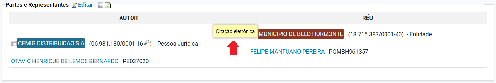

---

**Agendar citação/intimação pelo lançamento de evento**

O agendamento da citação/intimação será realizado durante a pré-configuração da minuta. Para

tanto:

1. ​ Dentro dos autos digitais, na seção “**Minutas”**, clicar em “Nova” ou clicar no botão

“**Minutar**”.

2. ​ O sistema abrirá a página “Nova Minuta”, para pré-configuração da minuta.

3. ​ O usuário deverá marcar o checkbox “**Agendar lançamento de evento/troca de**

**localizador”.**O sistema abrirá os campos de preenchimento para a realização da

comunicação**.**

4. ​ Escolher o evento a ser lançado e o complemento, caso haja:

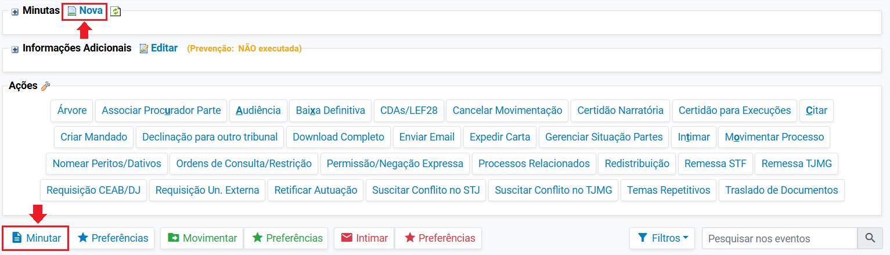

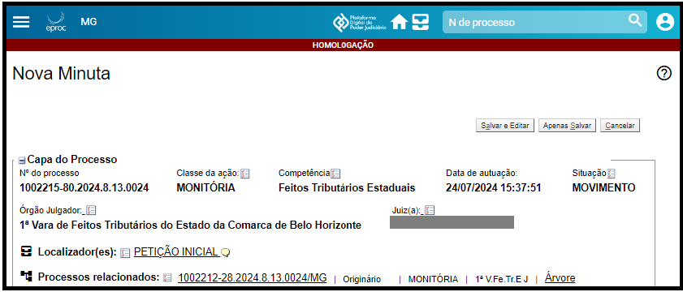

---

5. ​ Marcar o checkbox “**Intimar / Citar Partes”**e escolher o evento referente a

Citação/Intimação;

6. ​ Selecionar a parte e inserir o prazo, que poderá ser incluído em dias ou com a inserção da

data final.

7. ​ Além dos autores, réus e interessados, é possível realizar o ato de comunicação para o MP

(custos juris), peritos, autoridades coatoras unidades externas e APS já incluídas. É possível,

ainda, incluir unidade externa.

8. ​ Nos casos em que houver urgência na intimação, marcar o checkbox**“intimação urgente”**.

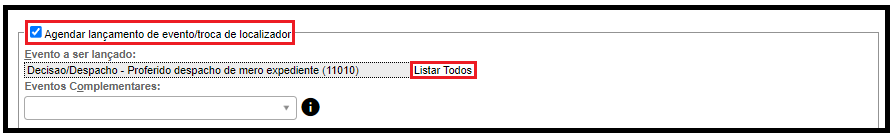

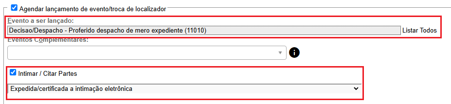

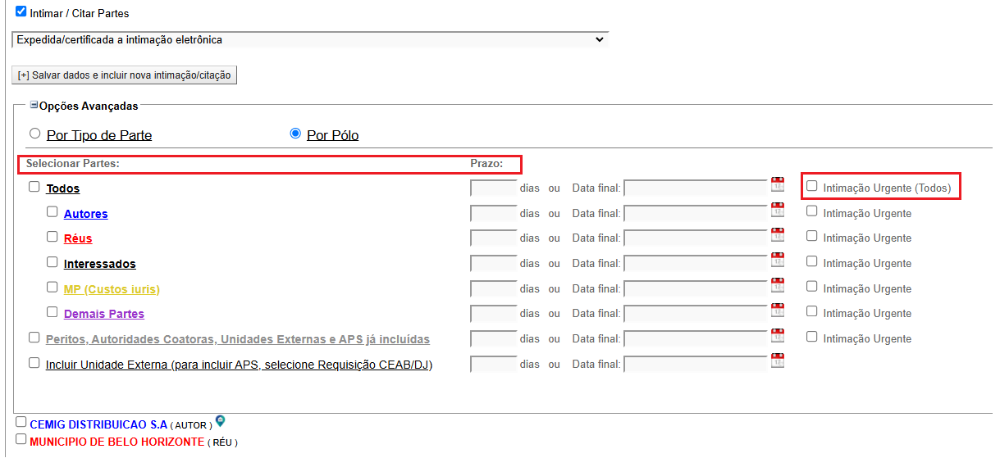

---

9. ​ Para inserir mais de uma intimação/citação referente à mesma minuta, clicar em “**[+] Salvar**

**dados e incluir nova intimação/citação**”. A intimação/citação salva ficará gravada.

10. ​Para

realizar

as

demais

intimações/citações,

selecionar

novamente o evento

correspondente, as partes e o prazo.

11. ​Nos casos de**citação de entidade**, escolher o Local (Município) em que o ato será realizado

e indicar o Procurador-Chefe que receberá a citação.

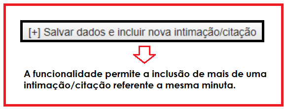

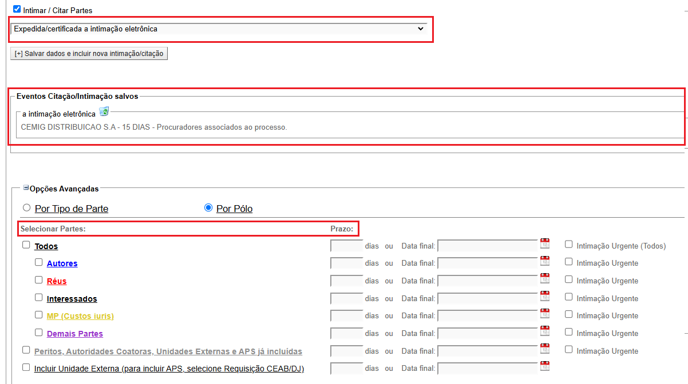

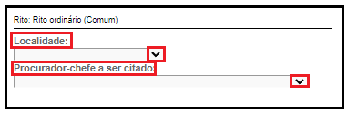

---

12. ​Realizar o gerenciamento de localizadores:

13. ​Preencher a última seção indicando**Classificação da Minuta, Descrição, Assinante,**

**Tratamento, Cabeçalho, Nível de Sigilo e Status de Destino**(Anotação concluída,

Conferida, Para assinar, Para conferir, Rascunho)**.**

14. ​Clicar em “**Salvar e Editar**”.

15. ​Após a conferência, assinatura e movimentação da minuta, o evento de citação/intimação

eletrônica será lançado na cronologia dos autos com a mesma data e horário do

lançamento da minuta realizada, conforme demonstrado a seguir:

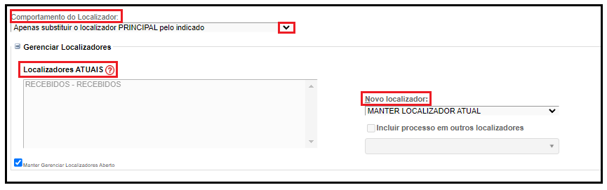

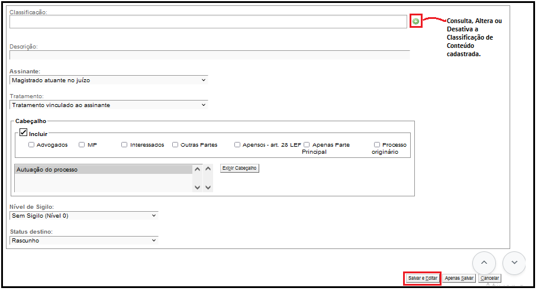

---

**Citação/Intimação de documento “Novo”**

Caso a citação/intimação deva ser acompanhada por um documento novo, ou seja, documento

que não está anexado aos autos, a intimação/citação deverá ocorrer por meio da minuta.

1. ​ Dentro dos autos digitais, na seção “**Minutas”**, clicar em “**Nova**” ou clicar no botão

“**Minutar**”.

2. ​ O sistema abrirá a página “**Nova Minuta**”, para pré-configuração da minuta.

3. ​ Em “**Tipo de documento/Modelo**”, selecionar a opção “**Ato Ordinatório**”.

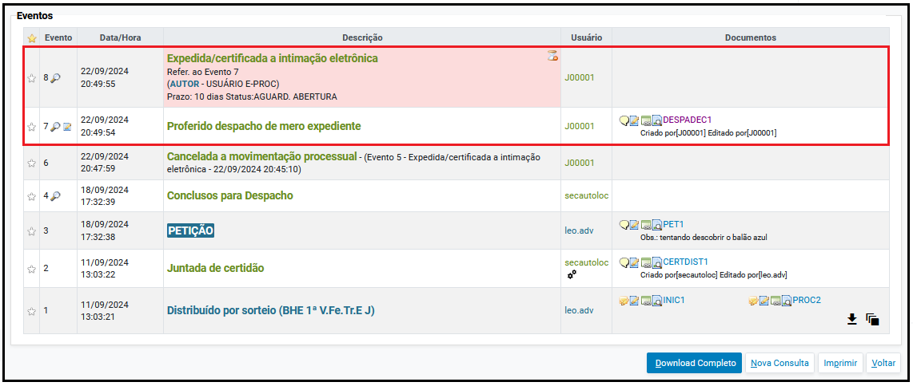

---

4. ​ Marcar o*checkbox*“**Agendar lançamento de evento/troca de localizador”.**

5. ​ Em “**Evento a ser lançado**”, selecionar a opção “**Ato ordinatório praticado (11383)**”.

6. ​ Marcar o checkbox “**Intimar/Citar Partes**” e, em seguida, selecionar a opção

“**Expedida/certificada a intimação eletrônica**”, se for realizada intimação, ou

“**Expedida/certificada a citação eletrônica**”, se for citação.

7. ​ Selecionar a parte e inserir o prazo, que poderá ser incluído em dias ou com a inserção da

data final.

8. ​ Além dos autores, réus e interessados, é possível realizar o ato de comunicação para o MP

(custos juris), peritos, autoridades coatoras unidades externas e APS já incluídas. É possível,

ainda, incluir unidade externa.

9. ​ Nos casos em que houver urgência na intimação, marcar o checkbox**“intimação urgente”**.

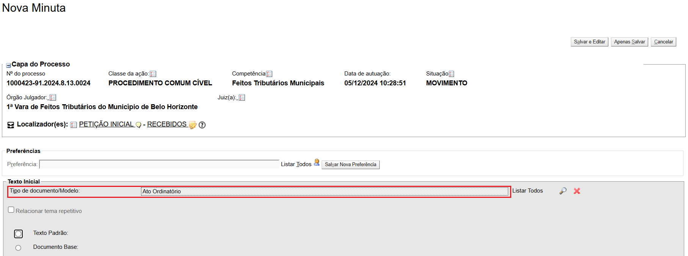

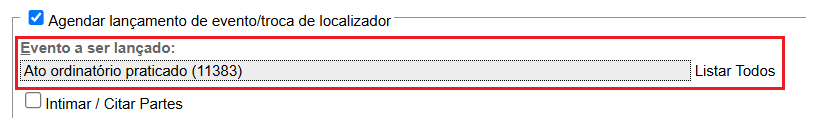

---

10. ​Para inserir mais de uma intimação/citação referente à mesma minuta, clicar em “**[+] Salvar**

**dados e incluir nova intimação/citação**”. A intimação/citação salva ficará gravada.

11. ​Para

realizar

as

demais

intimações/citações,

selecionar

novamente o evento

correspondente, as partes e o prazo.

12. ​Finalizar o procedimento conforme demonstrado no tópico anterior.

**Ações Citar/Intimar**

1. ​ Caso o agendamento da comunicação eletrônica**não**tenha sido realizado durante a

configuração da minuta, é possível que o(a) usuário(a) realize o procedimento por meio das

opções “**Citar”**ou**“Intimar”,**disponíveis na capa dos autos, na seção “**Ações”**.

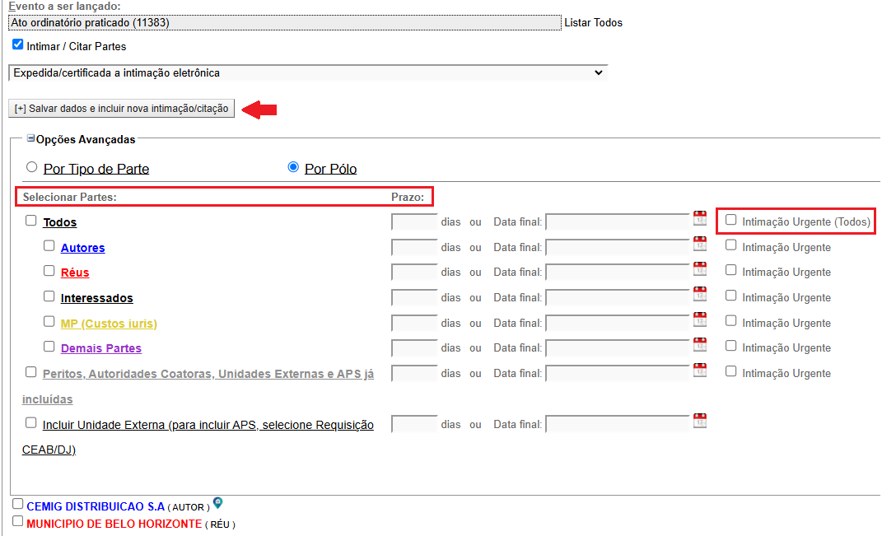

---

**ATENÇÃO!**As ações “**Intimar**” e “**Citar**” deverão ser utilizadas apenas quando houver no processo,

algum evento e/ou documento que será suficiente para acompanhar a comunicação.

2. ​ O sistema abrirá a página correspondente ao ato de comunicação escolhido e, a depender

do evento selecionado, exibirá os campos necessários para preenchimento.

A seguir, seguem exemplos:

**a)****​****Citação com lançamento do evento “Expedida/certificada a citação eletrônica”.**

1. ​ Escolher em “Evento de citação/intimação”, a opção “Expedida/certificada a citação

eletrônica”.

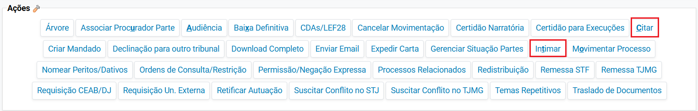

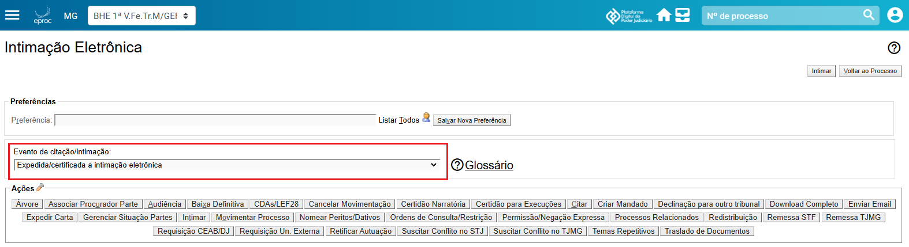

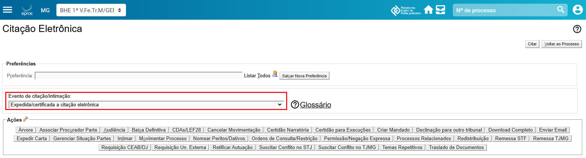

---

2. ​ Em “**Opções avançadas**”, escolher se a comunicação será realizada por tipo de parte

(Entidades com prazo especial, Entidades com prazos simples, Partes com prazo simples,

DPU e Escritórios de Prática Jurídica) ou**por pólo**(Autores, Réus, Interessados,*MP - custos*

*juris*e demais partes).

3. ​ Indicar o prazo da comunicação (em dias ou data final).

**Por Tipo de Parte**

**Por Pólo**

**Obs. :**O(a) usuário(a) deverá se atentar caso o processo tenha mais de uma parte no polo passivo,

pois, ao selecionar o checkbox localizado à esquerda de “Réus”, o sistema replicará

automaticamente o prazo indicado para todas as partes que compõem esse polo.

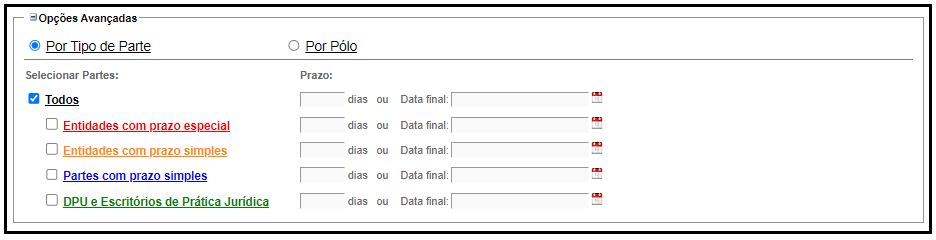

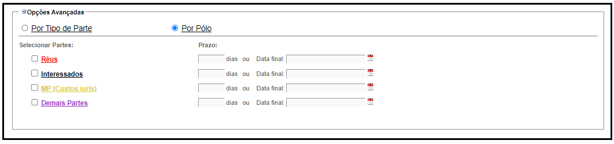

---

*(Exemplo: prazo inserido no campo “Prazos” é replicado para todas as partes)*

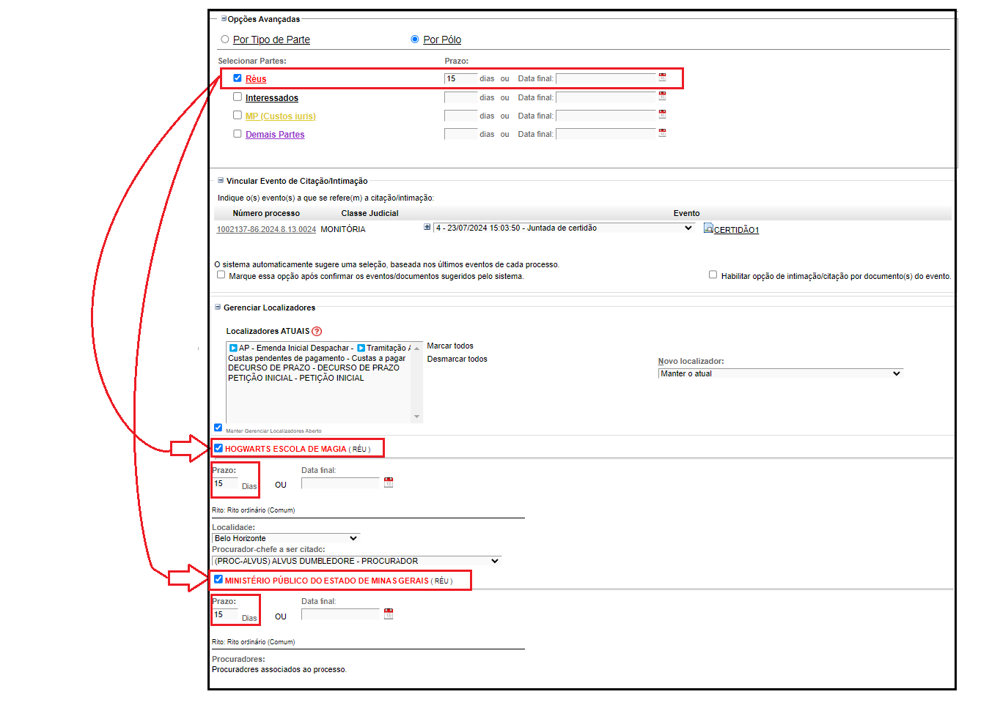

---

Exemplo a seguir:

4. ​ Na aba “**Vincular Evento de Citação/Intimação**”, marcar o*checkbox*de confirmação dos

eventos/documentos sugeridos pelo sistema ou, se for o caso, selecionar o evento que

acompanhará a citação.

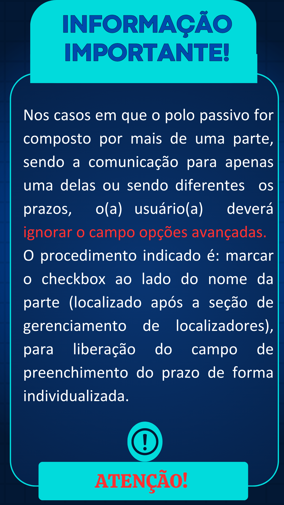

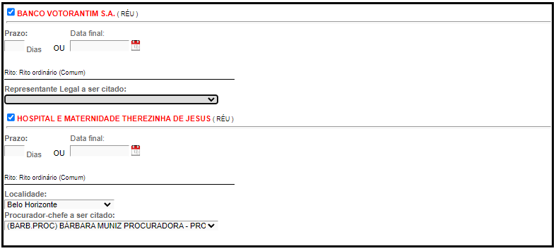

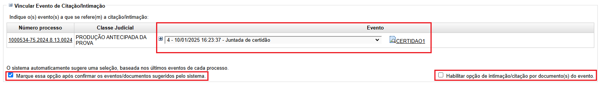

---

5. ​ Caso o evento contenha mais de um documento e o ato de comunicação for direcionado a

um deles, marcar o*checkbox*para habilitar opção de intimação/citação por documento do

evento.

6. ​ Em**“Gerenciar Localizadores:**”, selecionar os localizadores que deseja remover do processo

e indicar novo localizador, caso haja.

7. ​ Para concluir, clicar no botão “**Citar**”.

**b) Intimação com lançamento do evento “Expedida/ certificada a intimação eletrônica”.**

O procedimento para realização de intimação eletrônica é semelhante ao demonstrado para

citação.

1. ​ O usuário deverá, conforme a necessidade do caso, realizar o preenchimento dos campos:

**Opções Avançadas, Vincular Evento de Citação/Intimação, Gerenciar Localizadores**e, por

fim, clicar em “Intimar”.

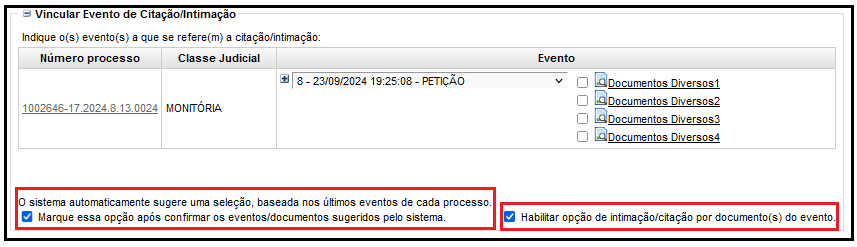

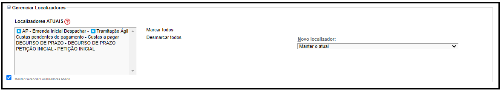

---

2. ​ Tratando-se de intimação, havendo urgência na comunicação, o(a) usuário(a) deverá

preencher o checkbox referente a**“Intimação Urgente”**.

**Vista ao Ministério Público -*****custos juris***

Nos casos em que houver atuação do MP no processo como custos juris, ou seja, quando não for

parte no processo, sua intimação poderá ser realizada de duas formas:

**a)****​****Na realização de minuta com agendamento de evento**

Durante a realização de minutas com a opção de agendamento de evento, é possível realizar

diferentes atos de comunicação referentes a um mesmo evento. Por exemplo, caso seja necessária

a intimação da parte e seja dada vista ao Ministério Público para parecer, o(a) usuário(a) deverá:

1. ​ Selecionar o evento a ser lançado.

2. ​ Marcar checkbox Intimar/Citar Partes.

3. ​ Selecionar as partes e indicar o prazo.

4. ​ Clicar no botão “**[+] Salvar dados e incluir nova intimação/citação”.**

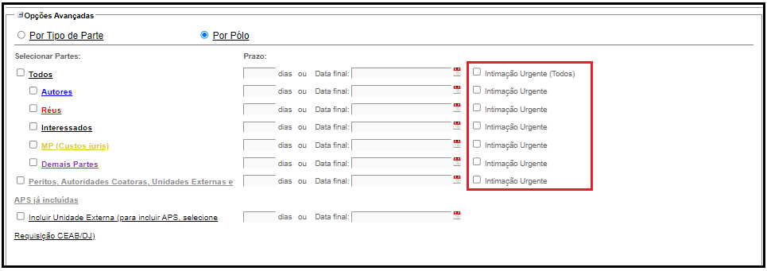

---

5. ​ Após clicar em “**[+] Salvar dados e incluir nova intimação/citação**”,a intimação para as

partes ficará salva em “**Eventos Citação/Intimação salvos”.**

6. ​ Na caixa de seleção abaixo de “**Intimar/Citar Parte”,**escolher o evento: “**Expedida/**

**certificada a intimação eletrônica - Vista ao MP para Parecer**”.

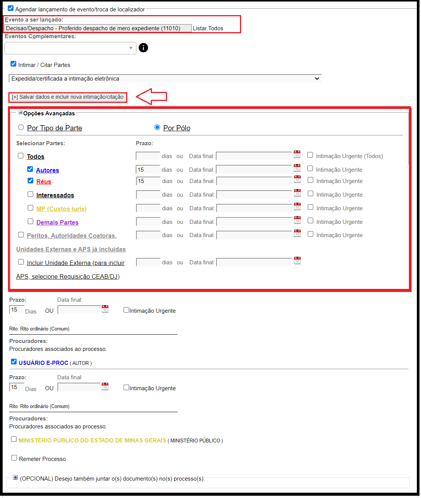

---

7. ​ Em “**Opções Avançadas**”,marcar o checkbox localizado à esquerda de MP (*custos juris*),

incluindo o prazo no respectivo campo, que será replicado ao final da seção, conforme

demonstrado.

8. ​ Após, deverá finalizar o preenchimento da configuração da minuta, realizando o

gerenciamento dos localizadores, a classificação, a descrição, o assinante, vincular o

tratamento, o nível de sigilo e o status de destino.

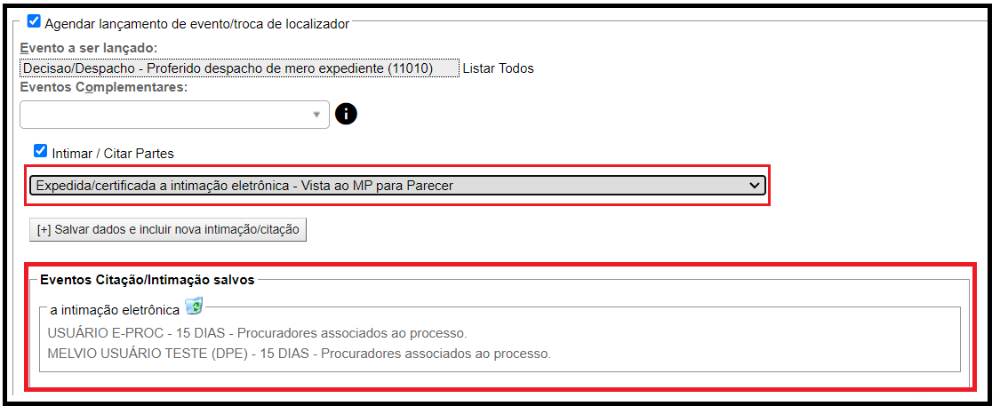

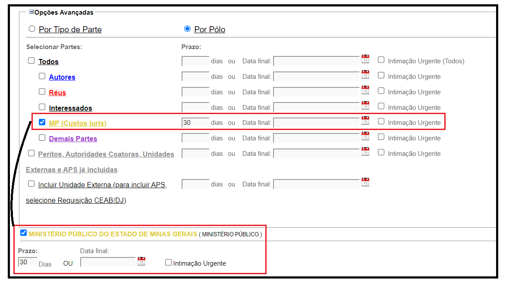

---

9. ​ Clicar em**“Salvar e Editar”.**Após assinatura da minuta os eventos de intimação serão

lançados no processo.

10. ​O sistema lançará um evento para cada parte, bem como o evento “**Expedida/certificada a**

**intimação eletrônica**- Vista ao MP para Parecer”.

**b) Através do botão “Intimar” em Ações**

Caso o(a) usuário(a) que elaborou a minuta não tenha agendado a intimação, é possível realizá-la

em momento posterior através do botão “**Intimar**” localizado em**Ações**.

1. ​ Clicar no botão “**Intimar**”, localizado em ações.

2. ​ Na página “Intimação Eletrônica”, em “Evento de citação/intimação”, inserir o evento

“**Expedida/certificada a intimação eletrônica - Vista ao MP para Parecer”.**

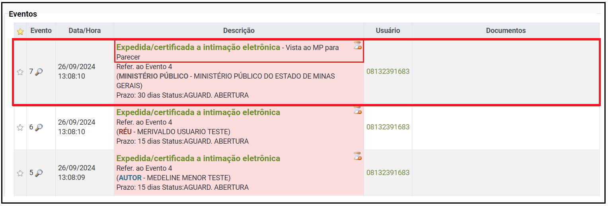

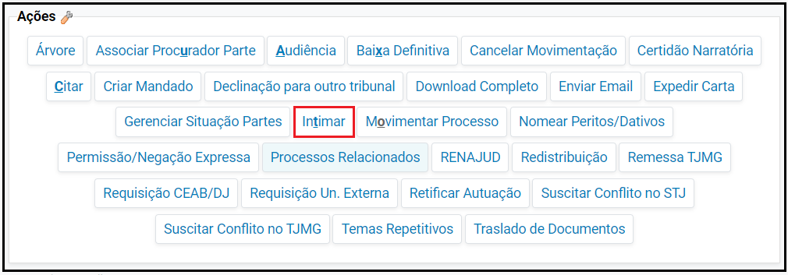

---

3. ​ Marcar o checkbox MP (custos juris) e indicar o prazo;

4. ​ Em “Vincular Evento de Citação/Intimação”, marcar o*checkbox***“Marque essa opção após**

**confirmar os eventos/documentos sugeridos pelo sistema”.**

5. ​ Gerenciar os localizadores, caso deseje, para melhor organização da Unidade Judiciária.

6. ​ Clicar em “**Intimar**”.

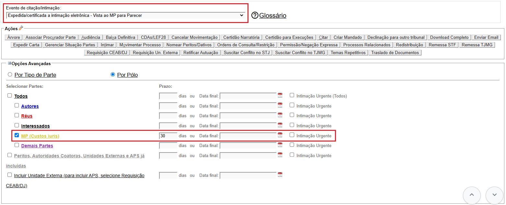

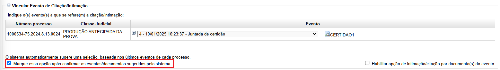

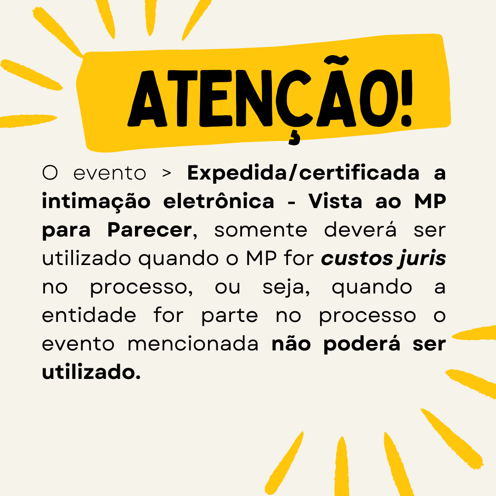

---

**Enviar e-mail**

Havendo necessidade de contactar a parte via e-mail, o(a) usuário(a) poderá realizar a

comunicação por meio da Ação disponível na capa dos autos.

1. ​ Clicar na ação “**Enviar Email**”.

2. ​ Na página “**Enviar Email**”, marcar os destinatários (partes no processo) no campo “Para -

partes do processo”.

**Nota:**Para marcar e/ou desmarcar a parte é necessário manter a tecla “Ctrl” pressionada.

3. ​ Caso o destinatário não faça parte do processo, basta incluir o endereço de e-mail no

campo**“Para - outros destinatários (se mais de um destinatário separar com [, ] vírgula**

**ou [; ] ponto e vírgula**”.

4. ​ O assunto virá preenchido com a Unidade Jurisdicional e o número do processo.

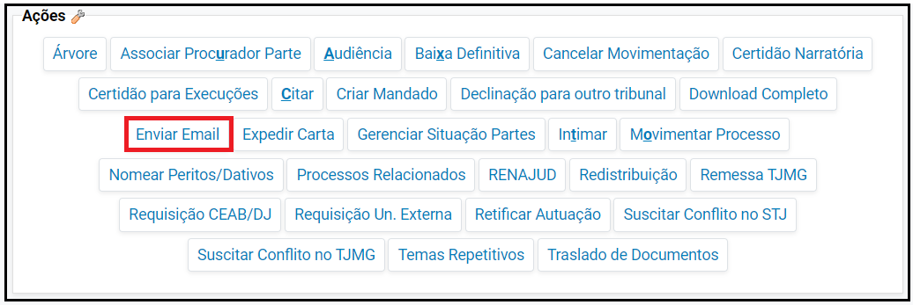

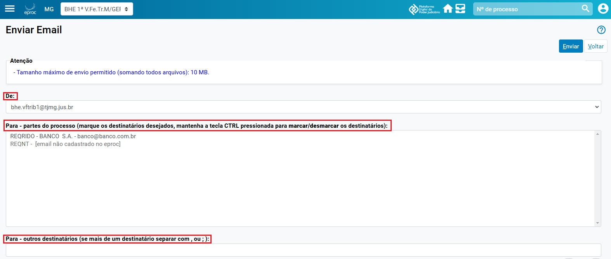

---

5. ​ Escrever o motivo do contato no campo “**Mensagem”**.

6. ​ Caso deseje enviar algum documento do processo, basta selecioná-lo na lista de

documentos;

7. ​ É possível, ainda, anexar um documento externo, ao clicar em “Escolher ficheiro”;

Obs. : O tamanho máximo de envio permitido (somando todos os arquivos) é de 10MB.

8. ​ Para finalizar, clicar em “**Enviar**”.

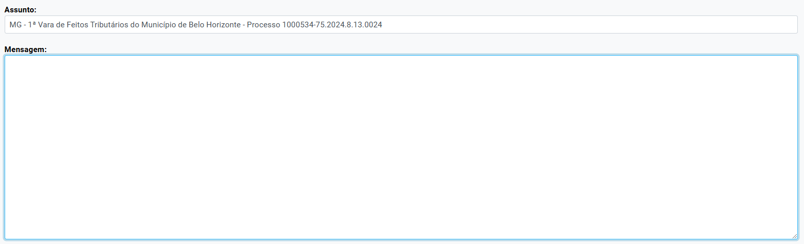

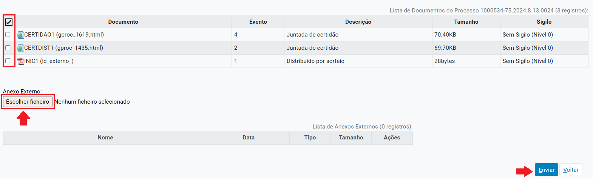

