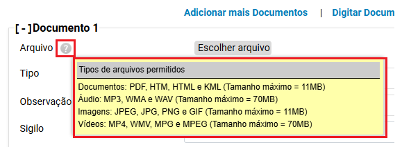

# Acoes IV - Movimentacao Processual e Regra de Sequencialidade de Eventos _1_

*Documento eProc - Material de Treinamento*

---

---

---

<small>**SUMÁRIO**</small>
**Movimentação Processual. .. .. .. .. .. .. .. .. .. .. .. .. .. .. .. .. .. .. .. .. .. .. .. .. .. .. .. .. .. .. .. .. .. .. .. .. .. .. .. .. .. .. .. .. .. .. .. .. .. .. .. .. .. .. .. .. .. .. .. .. 3**
<small>Movimentação Processual Individual. .. .. .. .. .. .. .. .. .. .. .. .. .. .. .. .. .. .. .. .. .. .. .. .. .. .. .. .. .. .. .. .. .. .. .. .. .. .. .. .. .. .. .. .. .. .. .. .. .. .. .. .. .3</small><small>Movimentação Sucessiva. .. .. .. .. .. .. .. .. .. .. .. .. .. .. .. .. .. .. .. .. .. .. .. .. .. .. .. .. .. .. .. .. .. .. .. .. .. .. .. .. .. .. .. .. .. .. .. .. .. .. .. .. .. .. .. .. .. .. .. .. .. . 7</small>
**Movimentação Processual em Bloco. .. .. .. .. .. .. .. .. .. .. .. .. .. .. .. .. .. .. .. .. .. .. .. .. .. .. .. .. .. .. .. .. .. .. .. .. .. .. .. .. .. .. .. .. .. .. .. .. .. .. .. .. .8**

**Cancelar movimentação. .. .. .. .. .. .. .. .. .. .. .. .. .. .. .. .. .. .. .. .. .. .. .. .. .. .. .. .. .. .. .. .. .. .. .. .. .. .. .. .. .. .. .. .. .. .. .. .. .. .. .. .. .. .. .. .. .. .. .. .. . 13**

**Regra de Sequencialidade de Eventos. .. .. .. .. .. .. .. .. .. .. .. .. .. .. .. .. .. .. .. .. .. .. .. .. .. .. .. .. .. .. .. .. .. .. .. .. .. .. .. .. .. .. .. .. .. .. .. .. .. .. . 15**
<small>Como verificar os eventos lançáveis por situação do processo? .. .. .. .. .. .. .. .. .. .. .. .. .. .. .. .. .. .. .. .. .. .. .. .. .. .. .. .. .. .. .. .17</small>

---

**Movimentação Processual**

Movimento processual pode ser entendido como o registro dos procedimentos e das rotinas dos

atos processuais que impulsionam o processo. O sistema eproc permite a movimentação de forma

individual ou em bloco, possibilitando maior celeridade na tramitação dos processos na Unidade

Jurisdicional.

**Movimentação Processual Individual**

A movimentação processual individual poderá ser realizada de duas formas:

1. ​ No “**Menu**” textual, clicar em “**Movimentação Processual**” → “**Movimentação Processual**

**Individual**”; ou

2. ​ Clicar na ação “**Movimentar Processo**” ou no botão “**Movimentar**”.

3. ​ O sistema abrirá a tela “**Movimentação Processual**”.

---

**Observação:**Casoa configuração “Exibir lembrete na movimentação” esteja ativa, e o

processo contenha lembrete cadastrado em sua capa, este será exibido na tela de

movimentação, bastando clicar em “fechar” para continuar.

4. ​ Em “**Gerenciar Localizadores**”, marcar os localizadores que deseja remover do processo

após o lançamento do evento e, em seguida, selecionar o novo localizador no qual o

processo será incluído. Caso pretenda incluir o processo em mais de um localizador, marcar

a caixa de seleção “**Incluir processo em outros localizadores**”.

**Observação:**Para que**não**haja troca de localizadores após a movimentação, o(a)

usuário(a) deverá desmarcar todos os localizadores no campo**“Localizadores ATUAIS”**e

selecionar a opção “**MANTER LOCALIZADOR ATUAL”**no campo**“Novo localizador”**.

---

5. ​ No campo**“Evento a ser lançado**”, selecionar a movimentação que será realizada no

processo. Ao clicar em “Listar Todos”, o sistema exibirá a lista dos eventos disponíveis, em

ordem alfabética, e de acordo com a tabela do CNJ.

6. ​ Na tela de movimentação processual, é possível adicionar documentos, digitar

documentos, visualizar minutas do processo, consultar laudos técnicos e utilizar opções

avançadas (permite a alteração do tipo e do sigilo de todos os documentos anexados, para

o tipo e sigilo indicado).

**Observação:**Uma vez indicado um novo tipo de documento e sigilo em**“Opções Avançadas”**,

estes serão replicados de forma geral para todos os documentos anexados. Caso haja diferença de

tipo ou sigilo de algum documento na lista, o usuário**não**deverá utilizar essa opção.

7. ​ Para verificar os tipos de documentos aceitos pelo sistema, basta posicionar o cursor no

ícone (

), localizado ao lado de “Arquivo”.

---

8. ​ Após selecionar o arquivo, clicar em**“Confirmar seleção de documentos”**.

9. ​ Para finalizar, clicar em “**Movimentar**” ou utilizar a tecla de atalho (Alt + o).

10. ​ A movimentação (evento) será lançada no processo, constando data e horário da

realização, bem como o login do(a) usuário(a) responsável.

11. ​Para verificar as informações do evento, basta posicionar o cursor sobre o ícone

“**Informações do Evento**” (

).

12. ​Para editar o magistrado da fase vinculado ao evento, clicar no ícone “**Editar Magistrado**”.

---

**Movimentação Sucessiva**

Ainda na tela “Movimentação Processual”, é possível realizar a “**Movimentação Sucessiva**”, que

permite executar uma nova movimentação sem a necessidade de retornar à capa dos autos.

Para realizar a movimentação sucessiva, após o preenchimento dos dados da primeira

movimentação, o usuário(a) deverá clicar no botão “**Movimentação Sucessiva**”.

O sistema exibirá mensagem indicando que a movimentação foi realizada com sucesso, e

permanecerá na tela de**“Movimentação Processual”**para a realização da nova movimentação.

---

**Movimentação Processual em Bloco**

A funcionalidade de movimentação processual em bloco tem o objetivo de otimizar e facilitar o

trabalho, garantindo maior celeridade à tramitação dos processos, por meio da execução massiva

da tarefa. Para realizar a movimentação processual em bloco:

1. ​ No “Menu” textual, buscar por “**Movimentação Processual em Bloco”.**

2. ​ O sistema abrirá a página “**Movimentação Processual em Bloco**”, onde será possível

pesquisar os processos a serem movimentados, utilizando diversos critérios de busca.

3. ​ Após realizar a busca, clicar em “**Consultar**”.

---

4. ​ Após a consulta, o sistema listará todos os processos que atenderem aos critérios

indicados, sendo necessário selecionar aqueles que receberão a movimentação.

**Observação:**Caso seja necessário visualizar os processos que serão movimentados em bloco,

o(a) usuário(a) deverá marcar o checkbox à esquerda, conforme demonstrado, e clicar na

opção “**Consultar processos selecionados em nova aba**”.

---

5. ​ Para movimentar em bloco, clicar em “**Movimentação em Bloco**”.

6. ​ Ao clicar no botão “Movimentação em Bloco”, o sistema abrirá a página “**Movimentação**

**Processual em Bloco**”, para gerenciamento dos localizadores e escolha do evento que será

lançado.

*(Tela “Movimentação Processual em Bloco”)*

---

*(Tela “Movimentação Processual em Bloco”)*

7. ​ O uso das preferências é opcional; todavia, sua importância para a otimização da tarefa

deve ser considerada.

8. ​ Gerenciar os localizadores, de acordo com a movimentação que será executada.

9. ​ Escolher o evento a ser lançado nos processos. Na movimentação processual em bloco, o

evento lançado será refletido em todos os processos selecionados.

---

**Observação:**A depender do evento a ser lançado, outros campos de edição surgirão para

preenchimento.

10. ​Assim como na movimentação individual, é possível a**inclusão de documentos**, que serão

replicados em todos os processos que integram o bloco.

11. ​Para finalizar, clicar no botão “**Movimentar em Bloco**”, localizado à direita, no final da

página.

12. ​O sistema retornará o resultado da movimentação em bloco, exibindo nos detalhes a

informação “**Movimentado com Sucesso**”. Além disso, permitirá que o usuário faça nova

consulta, realize nova movimentação e/ou tenha acesso a mais opções.

---

**Cancelar movimentação**

O sistema permite que, havendo necessidade, o(a) usuário(a) interno(a) cancele determinadas

movimentações processuais e/ou exclua documentos. Para tanto:

1. ​ Selecionar a ação “**Cancelar Movimentação**”; ou

*(Ação “Cancelar Movimentação”)*

2. ​ No “**Menu**” textual, selecionar a opção “**Cancelamento da Movimentação Processual**”.

*(Menu**→**Cancelamento da Movimentação Processual)*

---

3. ​ Na tela “**Cancelamento da Movimentação Processual**”, os eventos do processo serão

listados. Para cancelar algum evento, basta clicar no ícone “**Desativar Evento**” ( ),

localizado em “Ações”.

4. ​ Havendo documentos anexos ao evento cancelado, estes permanecerão visíveis tão

somente aos usuários internos.

5. ​ Caso seja necessário excluir apenas o documento, deverá clicar em**Documentos,**uma

nova tela será aberta, informando o evento a que o documento encontra-se atrelado.

6. ​ Clicar no ícone “**Desativar**” e, após, confirmar a desativação do documento.

---

**IMPORTANTE!**

Após o cancelamento, o sistema gera o evento:**“Cancelada a movimentação**

**processual”**, com a descrição do evento cancelado, a data e o horário do

cancelamento, bem como o login do responsável.

**Regra de Sequencialidade de Eventos**

A sequencialidade de eventos está vinculada à movimentação do processo em relação à sua

situação. Ou seja, dependendo da situação em que o processo se encontra, apenas determinados

eventos poderão ser lançados.

O sistema eproc possui uma sequencialidade rígida em relação à movimentação processual,

conforme estabelecido pela Tabela Unificada de Movimentação Processual - CNJ, razão pela qual

o(a) usuário(a) deverá observar a situação em que o processo se encontra antes de movimentá-lo,

para que o evento lançado reflita o andamento processual ocorrido de forma real e sequencial.

Como exemplo, em processos com a situação**MOVIMENTO**não será possível o lançamento de

eventos referentes à DESPACHO ou DECISÃO.

A situação do processo poderá ser verificada na capa dos autos, conforme a seguir:

Desta forma, se o processo estiver na situação**MOVIMENTO**e o usuário elaborar minuta de

despacho com agendamento de evento “Proferido despacho de mero expediente (11010)”, o

sistema apresentará a seguinte mensagem:

---

No exemplo demonstrado, para que o(a) usuário(a) possa agendar o evento “Proferido despacho

de mero expediente (11010)”, deverá:

a)​ Abrir os autos;

b)​ Na seção “**Ações”**, clicar em “**Movimentar Processo”**ou no botão**“Movimentar**”;

c)​ Na tela “**Movimentação Processual**”, escolher o evento “**Conclusos para**

**despacho**”, o magistrado responsável e, em seguida, clicar em “**Movimentar**”.

d)​ Concluída a movimentação, a situação do processo será modificada para

“**MOVIMENTO - AGUARDA DESPACHO**”, que permitirá o agendamento do evento

de despacho.

---

Quando o processo estiver concluso para sentença, a situação será:**MOVIMENTO - AGUARDA**

**SENTENÇA.**Nesta situação, não será possível o lançamento de eventos diferentes de sentença,

como por exemplo os de despacho ou de decisão.

Caso seja necessário retificar a conclusão e haja dúvidas quanto ao procedimento, o usuário

poderá consultar o manual*Minutas IV - Como elaborar, despachos, decisões e sentenças*.

**Como verificar os eventos lançáveis por situação do processo?**

No “**Menu**” textual, selecionar a opção “**Eventos Lançáveis por Situação atual do Processo**”,

disponível em “Relatórios”.

Na tela “Relatório de Eventos Lançáveis Por Situação Atual Processo”, será possível consultar os

eventos lançáveis pela situação atual do processo ou a situação pelo evento judicial lançável:

---

