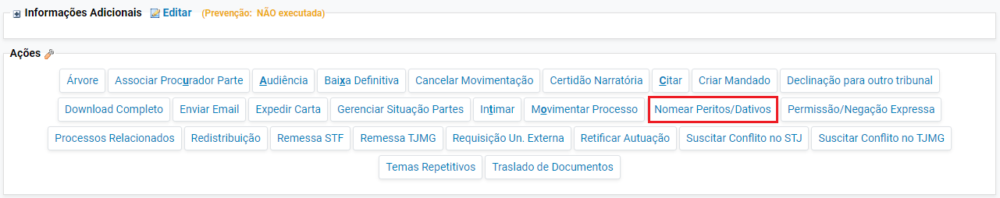
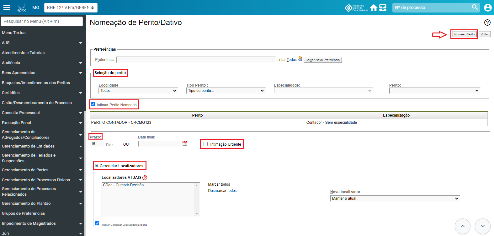
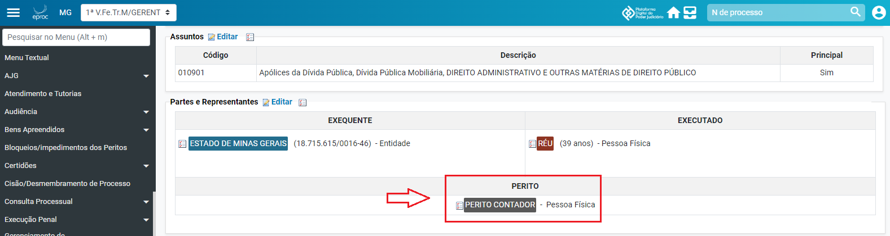

# Acoes V - Nomear Peritos _2_

*Documento eProc - Material de Treinamento*

---

---

---

**NOMEAR PERITOS**

O cadastramento e intimação dos Auxiliares da Justiça (Peritos, Tradutores, Intérpretes, Corretores

e Leiloeiros) ocorrerá através da funcionalidade "**Nomear Peritos/Dativos**".

Para realizar essa ação, o servidor necessita saber o nome e a especialidade do Auxiliar da Justiça a

ser nomeado. Apenas aqueles devidamente credenciados no Sistema AJ, nos termos da Resolução

do Órgão Especial nº 822/2018, serão inseridos. Além disso, é necessário que o Auxiliar da Justiça

esteja previamente cadastrado no sistema eproc.

Para nomear o Perito, Tradutor, Intérprete, Corretor ou Leiloeiro:

1. ​ Selecionar a ação “**Nomear Peritos/Dativos**” disponível no processo.

2. ​ Em seguida, o sistema exibirá a tela "**Nomeação de Perito/Dativo**".

3. ​ Na aba "**Seleção do Perito**", preencher os campos "**Localidade**", "**Tipo Perito**",

"**Especialidade**" e, no campo "**Perito**", informar o nome do perito designado no processo.

4. ​ Marcar a caixa de seleção “**Intimar Perito Nomeado**” e inserir o prazo da intimação. Em

caso de urgência, selecionar a caixa de seleção “Intimação Urgente”.

5. ​ Em “**Gerenciar Localizadores**”, o servidor poderá selecionar o localizador que o processo

aguardará a resposta do Auxiliar da Justiça, de acordo com a organização de cada unidade.

6. ​ Por fim, ao final da tela, clicar no botão “**Nomear Perito**”.

---

7. ​ Após, o perito será imediatamente cadastrado em “**Partes e Representantes**” como Perito.

**Observação**: Intimado, o Auxiliar da Justiça poderá recusar a nomeação ou não se manifestar,

sendo o silêncio interpretado como desinteresse. Nessas situações, o servidor deverá encaminhar

os autos para a nomeação de um novo perito, excluir o perito anterior do cadastro e repetir os

procedimentos de nomeação previamente descritos.

