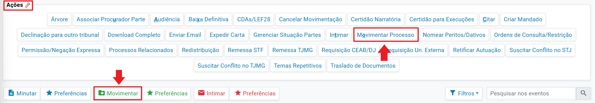
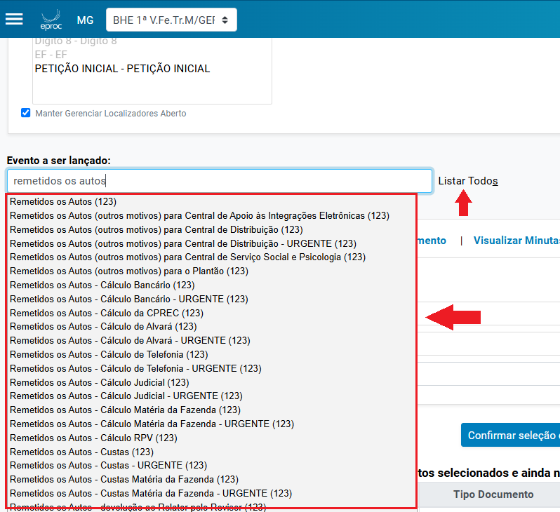
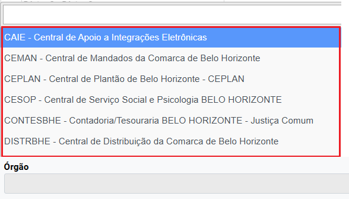
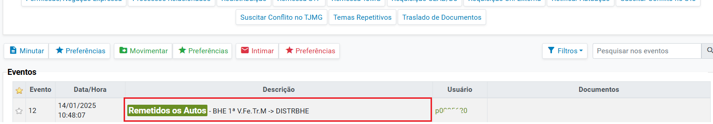

# Acoes VII - Remessa de Processos para Orgaos Internos do TJMG _2_

*Documento eProc - Material de Treinamento*

---

---

---

****REMESSA DE PROCESSOS PARA ÓRGÃOS INTERNOS DO TJMG****
A remessa de processos para órgãos internos do TJMG, como a contadoria, psicossocial, CAIE,

entre outros, ocorrerá via movimentação. Para tanto, dentro dos autos:

1. ​ Clicar na ação “**Movimentar Processo**”, “**Movimentar**” ou acionar o atalho do teclado

“**CTRL+O**”.

2. ​ Na tela “**Movimentação Processual**” que se abrir, em “**Gerenciar Localizadores**”, serão

listados no quadro “Localizadores atuais” quais os localizadores que o processo se

encontra, sendo possível “Marcar todos” ou “Desmarcar todos”. Em “Novo Localizador”,

o(a) usuário(a) poderá selecionar qual(is) localizador(es) o processo deverá receber após a

movimentação para o órgão interno do TJMG.

**Observação:**Se a opção “Marcar todos” for utilizada, os localizadores existentes no

processo serão excluídos, e o processo será incluído nos novos localizadores indicados. Se a

opção “Desmarcar todos” for utilizada, os localizadores existentes no processo serão

mantidos e, caso o usuário indique um novo localizador, este será incluído. O processo não

pode ficar sem nenhum localizador.

**Atenção!**Recomenda-se que o usuário aloque o processo em um localizador de remessa

para fins de organização da unidade, considerando que, após a remessa para o órgão

interno, o processo não receberá automaticamente nenhum localizador.

3. ​ No campo “**Evento a ser selecionado**”, selecionar a opção “**Remetidos os Autos (123)**”

correspondente à remessa que será realizada.

---

4. ​ Após selecionar o evento “Remetidos os Autos (123)”, o sistema habilitará o campo

“**Órgão**” para seleção do órgão interno do TJMG que receberá o processo.

5. ​ Em seguida, clicar em “**Movimentar**”.

---

6. ​ Realizada a movimentação, o processo será remetido com êxito para o órgão interno

selecionado e, nos autos, será gerado o evento de remessa, conforme a seguir:

