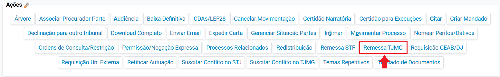
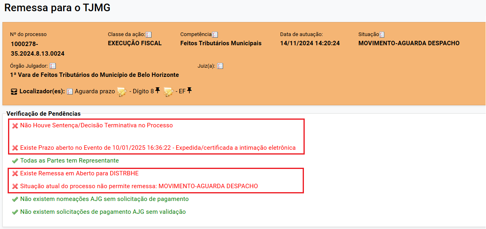
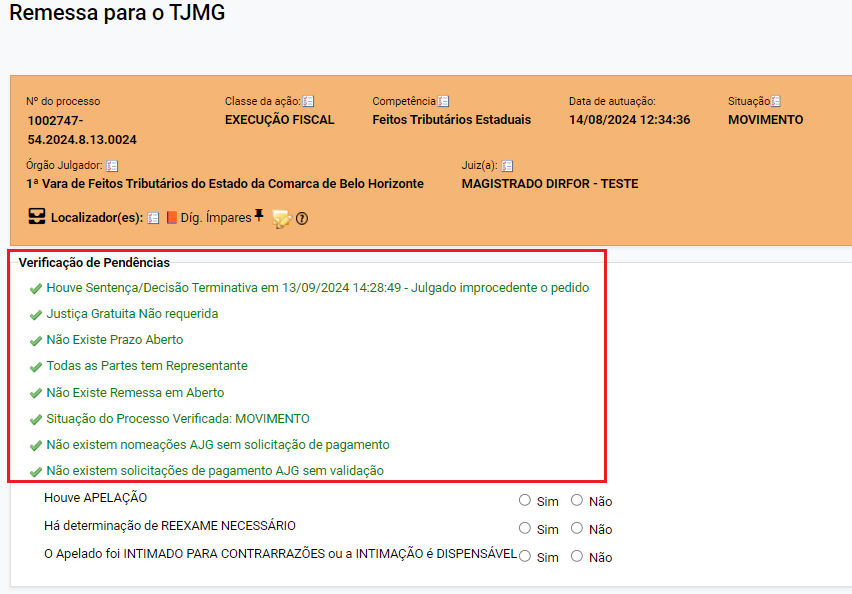
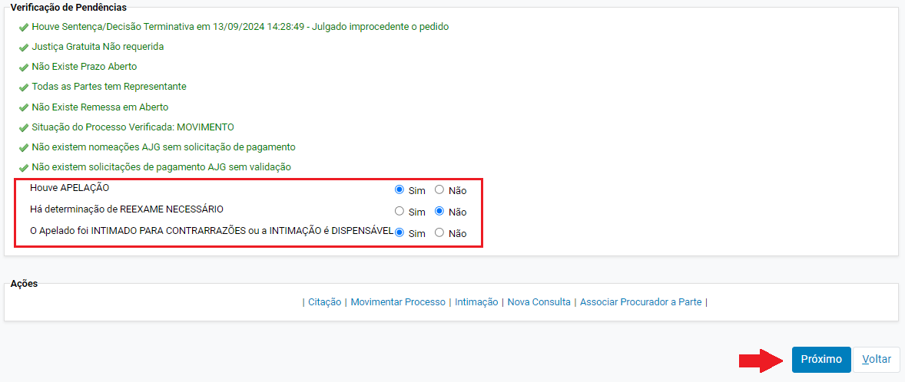
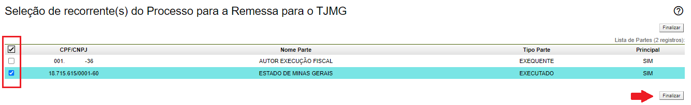
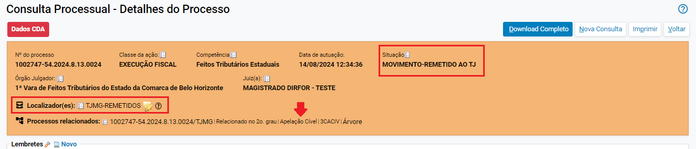
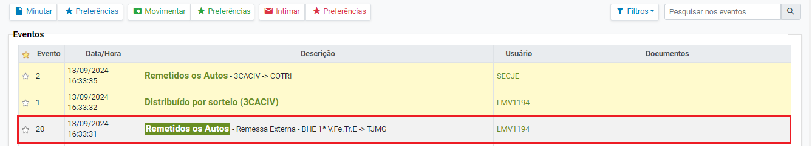
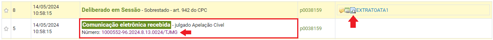
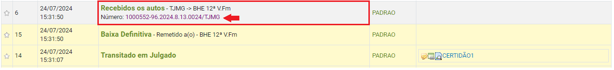
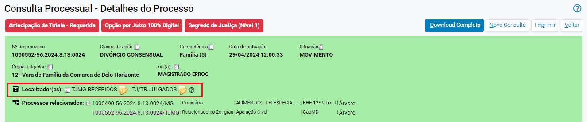

# Acoes VIII - Remessa para o TJMG _1_

*Documento eProc - Material de Treinamento*

---

---

---

**REMESSA E RECEBIMENTO DE APELAÇÕES CÍVEIS**

A remessa de Apelações Cíveis para o TJMG (2ª Instância) será realizada por meio do sistema

eproc. Para efetuar a remessa, o usuário(a) deverá:

1. ​ Abrir os autos e, na aba “**Ações**”, clicar em “**Remessa TJMG**”.

2. ​ Na tela “**Remessa para o TJMG**” que se abrir, o sistema fará a verificação das seguintes

pendências:

➔​

Se houve Sentença/Decisão terminativa

➔​

Se o pedido de Justiça Gratuita foi apreciado

➔​

Se existe prazo aberto

➔​

Se todas as partes possuem representantes

➔​

Se não há remessa em aberto para setores internos do TJMG ou unidades externas

➔​

Se a situação do processo está como “MOVIMENTO”

➔​

Se não existe nomeação de auxiliares da justiça sem solicitação de pagamento

➔​

Se não existe solicitações de pagamento de auxiliares da justiça sem validação

3. ​ Em caso de pendências, o sistema as sinalizará ( )

para que o servidor faça os ajustes

necessários, considerando que apenas processos sem pendências poderão ser remetidos.

---

4. ​ As pendências validadas serão apresentadas na cor verde com o respectivo símbolo (

).

5. ​ O usuário(a) deverá marcar se houve apelação, determinação de reexame necessário e se o

apelado foi intimado para contrarrazões ou a intimação é dispensável. Após o

preenchimento, clicar em “**Próximo**”.

---

6. ​ Na tela “**Seleção de recorrente(s) do Processo para a Remessa para o TJMG**”, selecionar a

caixa de seleção correspondente à parte recorrente.

7. ​ Em seguida, clicar em “**Finalizar**”.

8. ​ Após a remessa, o processo terá a situação modificada para “**MOVIMENTO-REMETIDO AO**

**TJ**” e receberá o localizador “**TJMG-REMETIDOS**” automaticamente. Além disso, em

“**Processos relacionados**” ficará registrado o número da apelação e será gerado o evento

de remetidos os autos.

---

9. ​ Realizado o julgamento da Apelação Cível na 2ª Instância, no processo que tramita na 1ª

Instância será gerado o evento “**Comunicação Eletrônica recebida - Julgado Apelação**

**Cível**”. Para acessar os autos da Apelação Cível, basta clicar no número do processo que

consta no evento. Para acessar o documento da decisão, clicar ou colocar o cursor do

mouse sobre o ícone “Informações do Documento” ( ).

10. ​Além disso, o processo será inserido no localizador “**TJ/TR - JULGADOS**” de forma

automática.

11. ​Após o trânsito em julgado da apelação cível e a baixa definitiva no TJMG, no processo que

tramita na 1ª Instância será gerado o evento “Recebidos os autos” e o processo será

inserido no localizador “**TJ/TR - RECEBIDOS**” automaticamente. Além disso, o processo

retornará para a situação “**MOVIMENTO**”.

