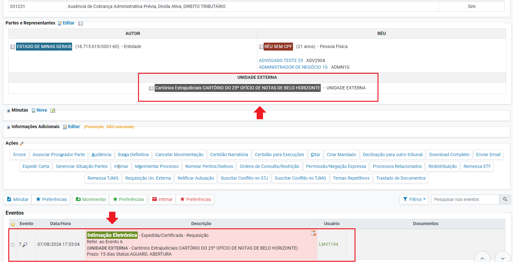

# Acoes X - Requisicao de Unidade Externa _2_ (1)

*Documento eProc - Material de Treinamento*

---

---

---

**REQUISIÇÃO DE UNIDADE EXTERNA**

No eproc, alguns órgãos são cadastrados como unidades externas, podendo ser intimados e se

manifestarem sem integrar o processo como partes. Exemplos incluem**Cartórios Extrajudiciais,**

**Unidades Prisionais, CREAs, entre outros.**

Para efetuar a intimação das Unidades Externas:

1. ​ Abrir os autos e clicar na ação “**Requisição Un. Externa**”:

2. ​ Na tela “**Requisição para Unidade Externa**” que se abrir, selecionar, obrigatoriamente, a

opção “**Intimação Eletrônica – Expedida/Certificada – Requisição**” no campo “**Evento de**

**Citação/Intimação**”.

---

3. ​ Em “**Vincular Evento de Citação/Intimação**”, selecionar o evento relacionado à intimação,

como um despacho, uma certidão, entre outros. Para selecionar mais de um evento, clicar

no ícone “**+**”.

4. ​ Em seguida, marcar a caixa de seleção “**Marque essa opção após confirmar os**

**eventos/documentos sugeridos pelo sistema**”, sendo essa marcação obrigatória para

finalizar a requisição.

5. ​ Caso o evento possua mais de um documento e apenas um deva ser encaminhado na

requisição, marcar a caixa “**Habilitar opção de intimação/citação por documento(s) do**

**evento**” e selecionar qual(is) documento(s) do evento será(ão) encaminhado(s).

6. ​ No campo “**Gerenciar Localizadores**”, serão listados no quadro “Localizadores atuais” quais

os localizadores que o processo se encontra, sendo possível “Marcar todos” ou “Desmarcar

todos”. Em “Novo Localizador”, o(a) usuário(a) poderá selecionar qual(is) localizador(es) o

processo deverá receber após a assinatura do documento.

**Observação:**Se a opção “Marcar todos” for utilizada, os localizadores existentes no

processo serão excluídos, e o processo será incluído nos novos localizadores indicados. Se a

opção “Desmarcar todos” for utilizada, os localizadores existentes no processo serão

mantidos e, caso o usuário indique um novo localizador, este será incluído. O processo não

pode ficar sem nenhum localizador.

---

7. ​ Em**“Prazos”**, inserir o prazo determinado em dias ou a data final para manifestação. Caso

seja urgente, selecionar a caixa de seleção**“Urgente”**, para que a intimação eletrônica seja

encaminhada para uma aba específica no Painel do Usuário da Unidade Externa.

8. ​ No campo “**Incluir nova parte**”, selecionar a unidade externa desejada. O usuário poderá

buscar pelo nome da Unidade ou clicar em “Listar Todas” e localizar a unidade que será

intimada. Serão listadas somente as unidades que possuem procurador associado.

9. ​ Em seguida, clicar em “**Intimar**”.

10. ​Após, a Unidade Externa será imediatamente cadastrada como “**Unidade Externa**” e nos

autos será gerado o evento de intimação eletrônica, que poderá ser respondido pelo

usuário da Unidade Externa.

---

**Observação:**As Unidades Externas poderão ser intimadas também no momento de realizar

intimação eletrônica,*vide “Manual Ações - Atos de Comunicação por Meio Eletrônico”.*

