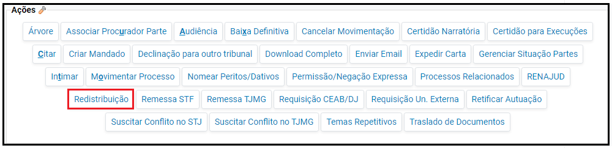
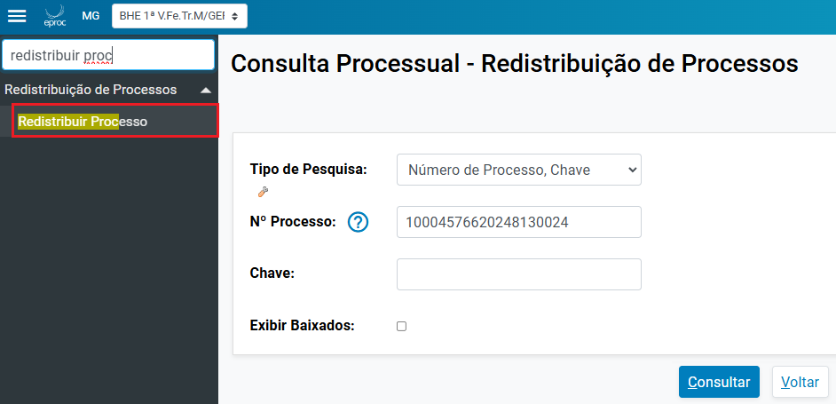
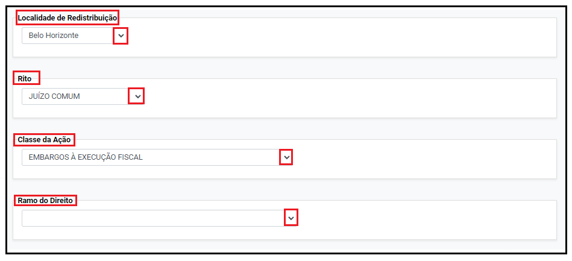
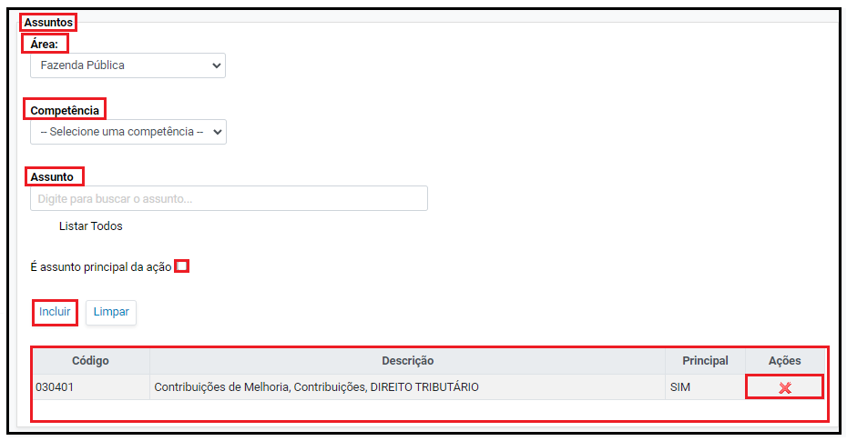
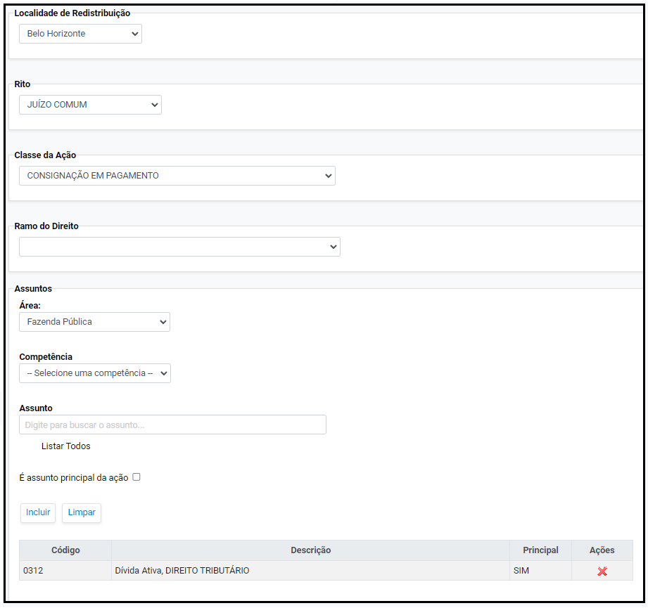
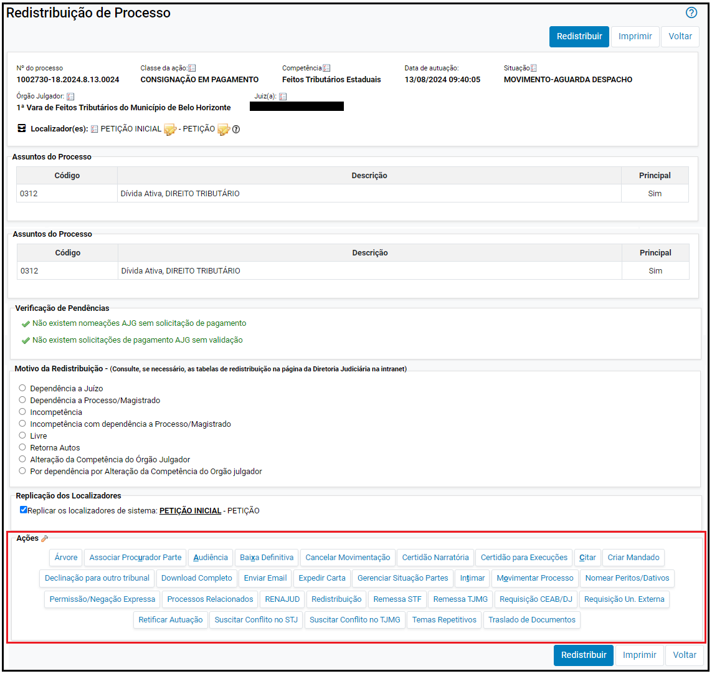

# Acoes XI - Redistribuicao de Processo _3_

*Documento eProc - Material de Treinamento*

---

---

---

**SUMÁRIO**

**REDISTRIBUIÇÃO DE PROCESSO NO SISTEMA EPROC. .. .. .. .. .. .. .. .. .. .. .. .. .. .. .. .. .. .. .. .. .. .. .. .. .. .. .. .. .. .. .. .. .. .. .. .. .. .. .. .. 3**
<small>Motivos da Redistribuição. .. .. .. .. .. .. .. .. .. .. .. .. .. .. .. .. .. .. .. .. .. .. .. .. .. .. .. .. .. .. .. .. .. .. .. .. .. .. .. .. .. .. .. .. .. .. .. .. .. .. .. .. .. .. .. .. .. .. .. .. .. 4</small><small>Redistribuição por dependência a juízo: .. .. .. .. .. .. .. .. .. .. .. .. .. .. .. .. .. .. .. .. .. .. .. .. .. .. .. .. .. .. .. .. .. .. .. .. .. .. .. .. .. .. .. .. .. .. .. .4</small><small>Redistribuição por dependência a processo/magistrado: .. .. .. .. .. .. .. .. .. .. .. .. .. .. .. .. .. .. .. .. .. .. .. .. .. .. .. .. .. .. .. .. .. .. .4</small><small>Redistribuição por incompetência: .. .. .. .. .. .. .. .. .. .. .. .. .. .. .. .. .. .. .. .. .. .. .. .. .. .. .. .. .. .. .. .. .. .. .. .. .. .. .. .. .. .. .. .. .. .. .. .. .. .. .. . 5</small><small>Redistribuição por incompetência com dependência a Processo/Magistrado: .. .. .. .. .. .. .. .. .. .. .. .. .. .. .. .. .. .. 6</small><small>Redistribuição livre: .. .. .. .. .. .. .. .. .. .. .. .. .. .. .. .. .. .. .. .. .. .. .. .. .. .. .. .. .. .. .. .. .. .. .. .. .. .. .. .. .. .. .. .. .. .. .. .. .. .. .. .. .. .. .. .. .. .. .. .. .. .. .. 6</small><small>Redistribuição Retorna Autos: .. .. .. .. .. .. .. .. .. .. .. .. .. .. .. .. .. .. .. .. .. .. .. .. .. .. .. .. .. .. .. .. .. .. .. .. .. .. .. .. .. .. .. .. .. .. .. .. .. .. .. .. .. .. .. 7</small><small>Redistribuição por Alteração da Competência do Órgão Julgador. .. .. .. .. .. .. .. .. .. .. .. .. .. .. .. .. .. .. .. .. .. .. .. .. .. .. .. .7</small><small>Redistribuição por dependência por Alteração da Competência do Órgão Julgador. .. .. .. .. .. .. .. .. .. .. .. .. .. 8</small>

---

**REDISTRIBUIÇÃO DE PROCESSO NO SISTEMA EPROC**

A redistribuição de um processo ocorrerá nos casos em que houver determinação do(a)

magistrado(a), devendo ser observado, além do disposto no Código de Normas da Corregedoria

Geral de Justiça do Estado de Minas Gerais -CGJ, o seguinte procedimento:

1. ​ Clicar na ação “**Redistribuição**”, localizada em “**Ações**” dentro dos autos; ou

2. ​ No “**Menu**” textual, escolher a opção "**Redistribuir Processo**”, inserir o número do processo

e “Consultar.

3. ​ Na tela “**Redistribuição de Processo**”, na aba “**Motivos da Redistribuição**”, selecionar o

motivo correspondente ao caso concreto.

---

**Motivos da Redistribuição**

**Redistribuição por dependência a juízo:**

Permite a redistribuição direcionada à determinada unidade jurisdicional, sem que seja indicado

processo de referência. Diante disso, sua utilização não é recomendada, em atenção ao disposto

nos artigos 169 a 172 do Provimento 355/2018 - Código de Normas da Corregedoria- Geral de

Justiça.

**Redistribuição por dependência a processo/magistrado:**

Utilizado para redistribuir quando há outro magistrado prevento. Redistribui o processo por

dependência a um magistrado exigindo, para tanto, a identificação do processo que induz a

prevenção.

Ao inserir o número do processo relacionado, o sistema buscará sua unidade de tramitação.

Para concluir a redistribuição, clicar em "**Redistribuir**”.

---

**Redistribuição por incompetência:**

Na redistribuição por incompetência, é necessário que o(a) usuário(a) informe a**Localidade de**

**Redistribuição**, o**Rito**, a**Classe da Ação**eo**Ramo do Direito**.

Na seção**Assuntos**, indicar a**Área**e a**Competência**. Ainda, caso haja a inclusão de**Assunto**,

marcar o*checkbox*“**É assunto principal da ação**”se este novo assunto for o principal da ação.

Após, clicar em “**Incluir**”.

Havendo necessidade de excluir o assunto cadastrado originariamente, basta clicar no (

),

localizado em**Ações**.

Para concluir a redistribuição, clicar em**"Redistribuir”**.

---

**​**

**Redistribuição por incompetência com dependência a Processo/Magistrado:**

Na redistribuição por incompetência com dependência a processo/magistrado, o procedimento

assemelha-se ao de redistribuição por incompetência mencionado anteriormente, sendo

necessária a inclusão da Localidade de Redistribuição, do Rito, da Classe da Ação, do Ramo do

Direito, da Área, da Competência e do Assunto.

Além dos campos mencionados, o(a) usuário(a) deverá informar o número do processo

relacionado.

Para concluir a redistribuição, deverá clicar em**"Redistribuir”**.

**Redistribuição livre:**

Redistribui o processo de forma livre entre todos os magistrados que possuem competência para a

matéria.

Na redistribuição livre, assim como na redistribuição por incompetência, os seguintes campos

deverão ser informados:**Localidade de Redistribuição**,**Rito**,**Ramo do Direito**,**Área**,**Competência**

e**Assunto**, marcando o*checkbox*“**É assunto principal da ação”**caso seja o assunto principal da

ação.

Para concluir a redistribuição, deverá clicar em**"Redistribuir”**.

---

**Redistribuição Retorna Autos:**

Permite a devolução dos autos a juízo que anteriormente esteve na titularidade do processo. Desta

forma, o sistema apresentará como padrão*,*no campo “**Locais para Retornar os Autos”**,o juízo

em que o processo tramitou anteriormente.
<small>Em seguida, é necessário marcar o motivo pelo qual os autos estão sendo retornados.</small>
Por fim, o(a) usuário(a) deverá preencher os demais campos relacionados aos dados do processo.

Para concluir a redistribuição, clicar em**"Redistribuir”**.

**Redistribuição por Alteração da Competência do Órgão Julgador**

Utilizada para redistribuir processosnos casos em que o órgão julgador originário tem a sua

competência alterada e não possui mais determinada competência. O usuário deverá preencher os

campos indicados:

---

Para concluir a redistribuição, deverá clicar em**"Redistribuir”**.

**Redistribuição por dependência por Alteração da Competência do Órgão Julgador**

A redistribuição por dependência por alteração da competência do órgão julgador será utilizada

quando a competência do órgão julgador for alterada.

Para realizar o procedimento o(a) usuário(a) deverá apenas informar o número do processo

relacionado, devendo marcar o*checkbox*caso deseje replicar os localizadores de sistema no órgão

que receberá o processo.

---

Para concluir a redistribuição, clicar em**"Redistribuir”**.

**OBSERVAÇÕES:**

1. ​ Posicionando o cursor sobre o motivo da redistribuição é possível verificar sua breve

descrição. Exemplo:

2. ​ A funcionalidade “**Ações**” está disponível na página “**Redistribuição de Processo**”. Ou seja,

caso o usuário deseje realizar outra ação que não seja a redistribuição, poderá fazê-lo sem

precisar retornar à capa dos autos, selecionando a nova ação ainda na página de

Redistribuição.

---

3. ​ Os localizadores da unidade remetente**não**serão replicados na unidade que receberá o

processo, sendo a funcionalidade relacionada apenas aos**localizadores de sistema,**em

razão da necessidade de compatibilidade dos localizadores.

