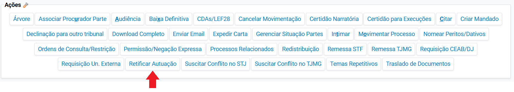
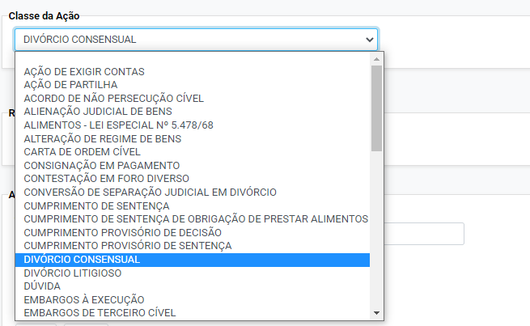
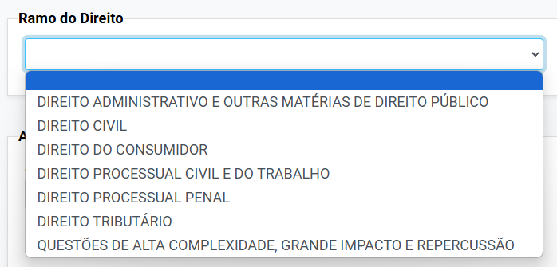
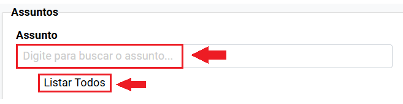
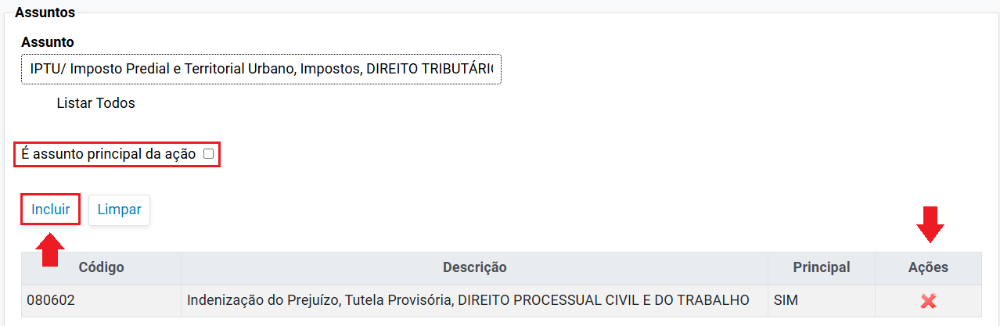
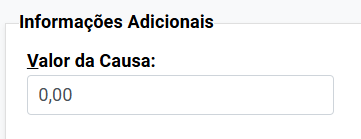
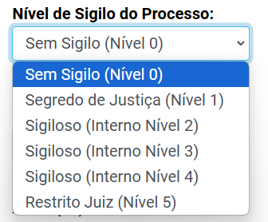
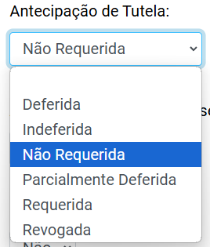
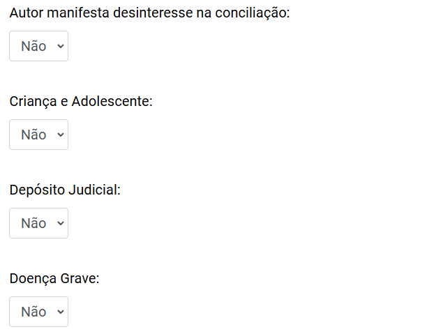
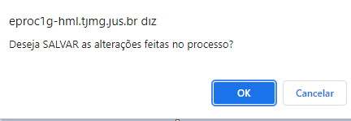

# Acoes XII - Retificar Autuacao _2_

*Documento eProc - Material de Treinamento*

---

---

---

**RETIFICAR AUTUAÇÃO**

Para acessar a funcionalidade “Retificar Autuação”, o usuário deverá:

1. ​ Clicar na ação “**Retificar Autuação**”, disponível em “Ações”, dentro dos autos.

2. ​ O sistema abrirá uma tela chamada “Retificação Autuação Processual - Detalhes do

Processo”. Nessa tela, poderão ser alterados os seguintes itens:

**2. 1. Classe da Ação**

Para alterar a classe da ação, clicar no nome da classe atual. O sistema apresentará uma lista de

classes para que o servidor selecione a classe desejada.

**2. 2. Ramo do Direito**

---

Para alterar o Ramo do Direito, clicar sobre o nome do ramo atualmente cadastrado. Nesse

momento, o sistema apresentará uma lista de ramos do direito, podendo o usuário selecionar o

ramo desejado que se encontra dentro da lista.

**2. 3. Assuntos**

Para cadastrar assunto no processo, o usuário poderá inserir alguma palavra-chave no campo

“**Digite para buscar o assunto****…**” ou clicar “**Listar Todos**”, para que o sistema apresente a lista de

assuntos disponível no sistema.

Após localizar o assunto desejado, clicar sobre ele e, em seguida, clicar no botão “**Incluir**”. Se for o

assunto principal, marcar o*checkbox*“**É assunto principal da ação**”.

Para remover algum assunto cadastrado, clicar no ícone “**Remover Item**” ( ).

---

**IMPORTANTE:**O usuário poderá selecionar vários assuntos, mas deverá, OBRIGATORIAMENTE,

cadastrar um assunto como principal, marcando a caixa de seleção “É assunto principal da ação”.

**2. 4. Competência**

Para alterar a competência do processo, clique sobre o nome da competência atualmente

cadastrada. O sistema, então, exibirá uma lista de competências, e o usuário deverá selecionar a

desejada dentre as disponíveis.

**2. 5. Valor da Causa**

Para alterar o valor da causa, o usuário deverá apagar o valor cadastrado atualmente e inserir o

valor correto no campo “Valor da Causa”.

**2. 6. Nível de Sigilo do Processo**

Para alterar o nível de sigilo do processo, selecionar, no campo “Nível de Sigilo do Processo”, o

correspondente. O sistema apresentará uma lista com todos os níveis de sigilo disponíveis, de 0

(zero) a 5 (cinco).

---

**2. 7. Antecipação de Tutela**

O campo “Antecipação de Tutela” deverá ser preenchido de acordo com o trâmite processual, se

requerida, não requerida, deferida, indeferida, parcialmente deferida ou revogada.

**2. 8. Demais Informações Adicionais**

As demais informações adicionais disponibilizadas em “Retificar Autuação” serão alteradas apenas

marcando a opção “SIM” ou “NÃO”, a depender das características processo, conforme exemplo:

---

3. ​ Após retificar a autuação alterando os dados necessários, clicar no botão “**Salvar**”. Nesse

momento, o sistema apresentará uma tela com a seguinte mensagem: “**Deseja SALVAR as**

**alterações feitas no processo?**”.

4. ​ Clicar em “**OK**” para finalizar.

