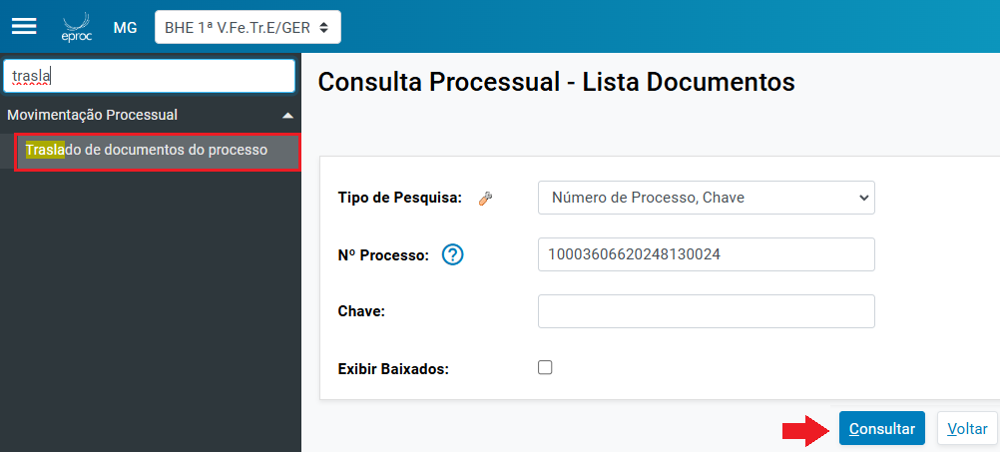
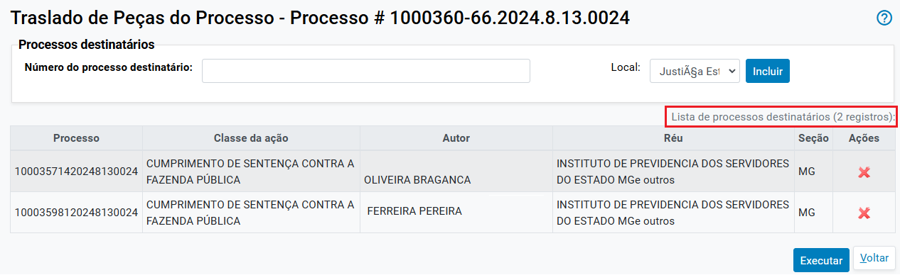
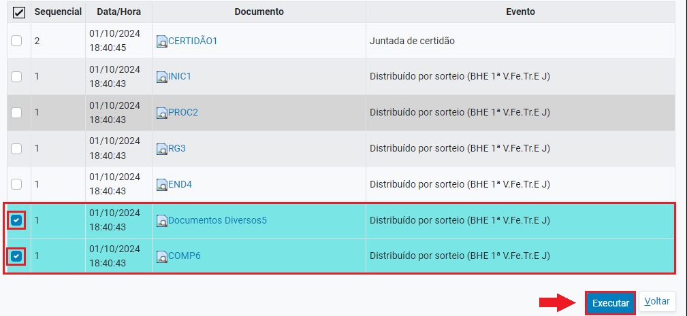
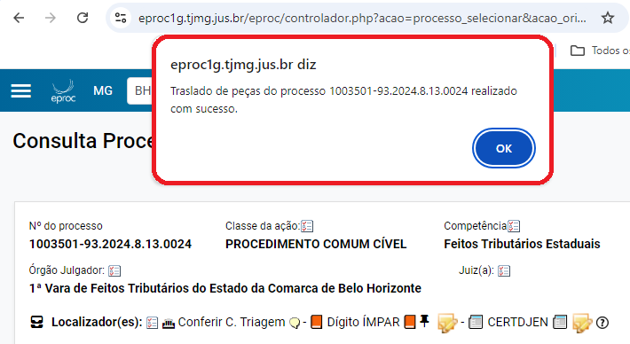
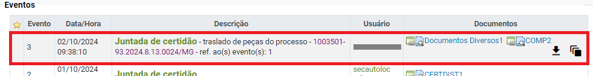

# Acoes XIII - Traslado de Documentos _2_

*Documento eProc - Material de Treinamento*

---

---

---

**Traslado de Documentos**

O sistema eproc permite a realização de traslado de documentos de um processo para outro,

mesmo que estejam tramitando em unidades jurisdicionais distintas.

Para acessar a funcionalidade o usuário poderá:

1. ​ Clicar na ação “**Traslado de Documentos**”, localizada nas “**Ações**” do processo; ou

2. ​ No “**Menu**” textual, selecionar a opção “**Traslado de documentos do processo**” e buscar o

processo.

3. ​ O sistema abrirá a página “**Traslado de Peças do Processo**”, exibindo o número do processo

do qual os documentos serão trasladados.

4. ​ No campo “**Processos destinatários**”, indicar o número do processo destinatário e o local

de tramitação,sendo “Justiça Estadual de Minas Gerais” quando o processo tramitar na

justiça estadual e “Tribunal de Justiça de Minas Gerais” para os processos que tramitarem

no Tribunal de Justiça de Minas Gerais.

5. ​ Em seguida, clicar em “**Incluir**”

---

**Nota:**É possível incluir vários processos para receber as peças trasladadas, bastando adicioná-los

um a um no campo mencionado acima. Após a inclusão, eles constarão na “**Lista de Processos**

**Destinatários**”.

6. ​ Selecionar os documentos que serão trasladados. Os documentos selecionados ficarão

destacados na cor azul. Em seguida, clicar no botão “**Executar**”

---

7. ​ O sistema exibirá mensagem informando sobre a realização do traslado, conforme a seguir:

8. ​ O evento “**Juntada de certidão**- traslado de peças para o processo(número do processo

que recebeu as peças)” será lançado nos autos, suprindo a necessidade de realização de

certidão pelo servidor.

9. ​ No processo destinatário, os documentos serão lançados juntamente com o evento

“**Juntada de certidão**- traslado de peças do processo (nº do processo)”.

