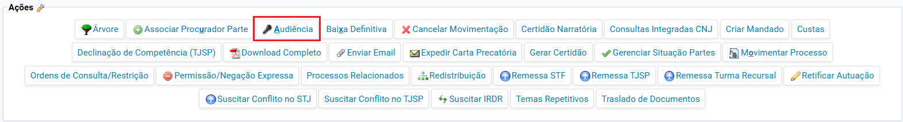
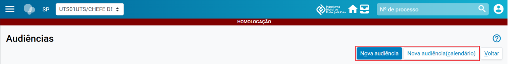
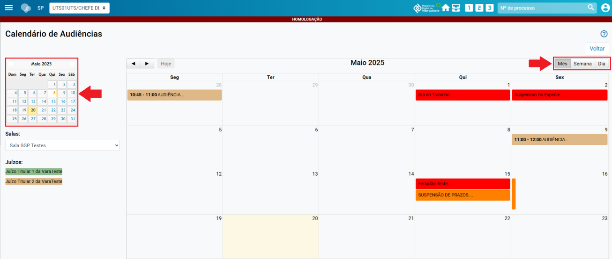
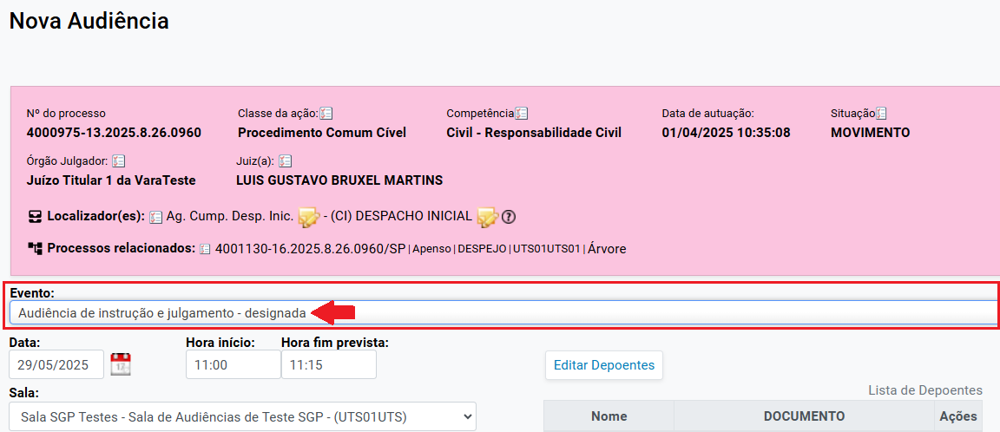
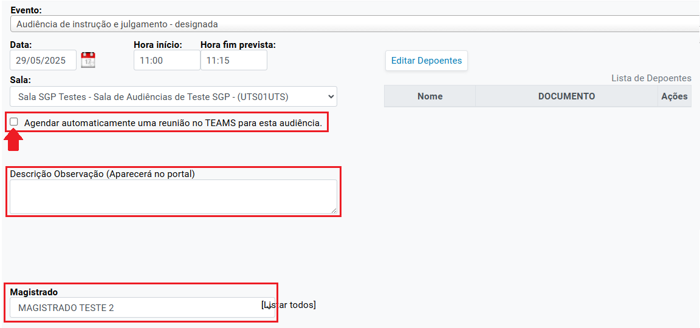
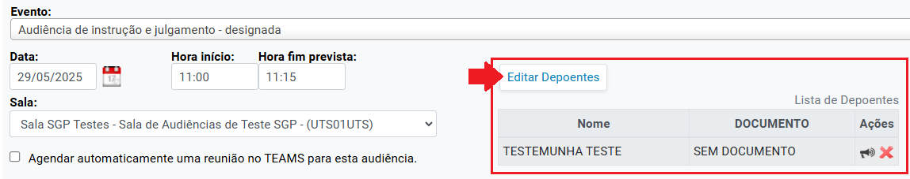
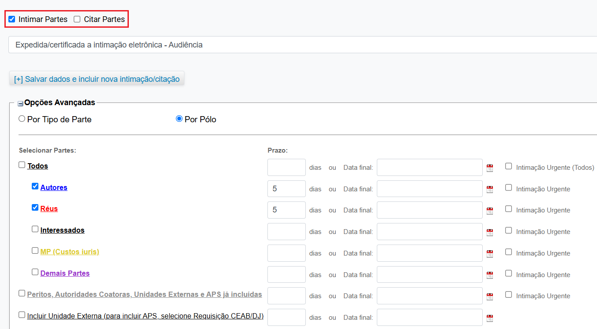
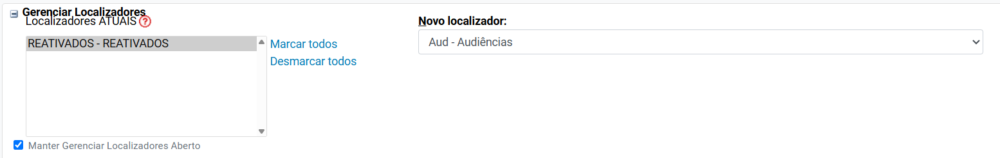
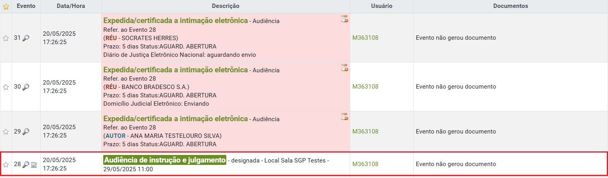

# Eproc para Gabinete – Módulo Básico

*Documento eProc - Material de Treinamento*

---

---

<small>Imagem decorativa de capa: símbolo do eproc, composto por ilustração de 3 círculos azuis com intersecção entre si,</small><small>e seu logotipo ao lado.</small>
*PORTAL NACIONAL DO CONHECIMENTO EPROC*

**AGENDAMENTO DE AUDIÊNCIAS**

**PRESENCIAIS****–****PARTE I**

# Eproc para Gabinete – Módulo Básico

Atualizado em**23/05/2023.**

---

**SUMÁRIO**

**AGENDAMENTO**

**DE**

**AUDIÊNCIAS**

**PRESENCIAIS****–****PARTE I**

**AGENDAMENTO DE AUDIÊNCIAS PRESENCIAIS**

**3**

**CRÉDITOS**

**8**

---

**AGENDAMENTO DE AUDIÊNCIAS PRESENCIAIS****–****PARTE I****|**Eproc para Gabinete – Módulo Básico

**3**

**AGENDAMENTO DE AUDIÊNCIAS**

**PRESENCIAIS**

Designada uma audiência presencial pelo magistrado, esta deverá ser agendada no eproc. Na

seção “Ações” da capa de um processo, selecionar “Audiências” e optar entre**“Nova audiência”**e

**“Nova audiência (Calendário)”**.
<small>**Descrição da imagem**: tela do processo com destaque para a opção “Audiência” da seção “Ações”.</small><small>**Descrição da imagem**: tela “Audiências” com as opções “Nova audiência (calendário)” e “Nova audiência”.</small>
A opção**“Nova Audiência (Calendário)”**levará para a tela “Calendário de Audiências”, que exibe

um calendário para visualização da agenda de datas, horários e audiências designadas pela

unidade judicial, filtradas por salas e juízos. Já a opção**“Nova audiência"**pulará essa etapa e levará

o usuário diretamente para o preenchimento dos dados da audiência, onde este poderá selecionar

data e horário sem visualizar as demais audiências agendadas na unidade. No nosso exemplo,

vamos utilizar a opção “Nova Audiência (Calendário)”, onde o usuário deverá selecionar o dia, o

horário e a sala que será realizada a audiência.

---

**AGENDAMENTO DE AUDIÊNCIAS PRESENCIAIS****–****PARTE I****|**Eproc para Gabinete – Módulo Básico

**4**
<small>**Descrição da imagem**: tela “Calendário de audiências” do modo “Calendário” com destaque nas opções de</small><small>visualização por “Mês”, “Semana” e “Dia” e no calendário compacto.</small>
Selecionados dia e horário, será aberta a tela “Nova Audiência”. No campo “Evento”, selecionar a

opção que se adequa ao caso. Confirmar a data, hora e sala que será realizada a audiência.
<small>**Descrição da imagem**: tela “Nova Audiência” com dados do processo, evento, data, hora e sala.</small>
Por se tratar de audiência presencial, desmarcar a caixa de seleção “Agendar automaticamente

uma reunião no TEAMS para esta audiência”. Se necessário, preencher o campo “Descrição

Observação” e selecionar o magistrado.

---

**AGENDAMENTO DE AUDIÊNCIAS PRESENCIAIS****–****PARTE I****|**Eproc para Gabinete – Módulo Básico

**5**
<small>**Descrição da imagem**: tela “Nova Audiência” com destaque nos campos “Agendar automaticamente uma reunião</small><small>no TEAMS para esta audiência”, “Descrição Observação” e “Magistrado”.</small>
Se existentes depoentes, estes deverão ser cadastrados através do botão “Editar Depoentes”.
<small>**Descrição da imagem**: tela “Nova Audiência” com destaque no botão “Editar Depoentes”.</small>
Ainda no ato do agendamento, é possível programar a citação e/ou intimação eletrônica das

partes. Para isso, selecione as opções “Citar partes” e/ou “Intimar partes”.

---

**AGENDAMENTO DE AUDIÊNCIAS PRESENCIAIS****–****PARTE I****|**Eproc para Gabinete – Módulo Básico

**6**
<small>**Descrição da imagem**: tela “Nova Audiência” com destaque no campo “Intimar/Citar Partes”.</small>
**Atenção**

No caso de mera ciência eletrônica, recomendamos usar o prazo de 5 dias, desde que

não haja qualquer prazo do qual a(s) parte(s) deva(m) ser intimada(s).

Não sendo o caso de citação ou intimação eletrônica, a unidade deverá providenciá-

la pelo meio adequado (carta, mandado etc. ).

Na seção “Gerenciar Localizadores”, escolha o comportamento dos localizadores selecionados,

removendo e/ou incluindo novos, conforme as orientações da unidade judicial.
<small>**Descrição da imagem**: tela “Nova Audiência”, seção “Gerenciar Localizadores”.</small>
Por fim, preenchidos os campos, selecionar a opção “Salvar” ou “Salvar e Intimar as Partes”, se

programadas citações e/ou intimações. A audiência estará pautada e será exibida na tabela de

eventos.

---

**AGENDAMENTO DE AUDIÊNCIAS PRESENCIAIS****–****PARTE I****|**Eproc para Gabinete – Módulo Básico

**7**
<small>**Descrição da imagem**: tela do processo com destaque para o evento “Audiência de conciliação – designada”.</small>

---

**AGENDAMENTO DE AUDIÊNCIAS PRESENCIAIS****–****PARTE I****|**Eproc para Gabinete – Módulo Básico

**CRÉDITOS**

**PORTAL NACIONAL DO CONHECIMENTO EPROC**

*Material desenvolvido pelo TJSP, utilizando a*

*base de homologação gentilmente cedida pelo TJSC e TJRS.*
