# Eproc para Gabinete – Módulo Básico

*Documento eProc - Material de Treinamento*

---

---

<small>Imagem decorativa de capa: símbolo do eproc, composto por ilustração de 3 círculos azuis com intersecção entre si,</small><small>e seu logotipo ao lado.</small>
*PORTAL NACIONAL DO CONHECIMENTO EPROC*

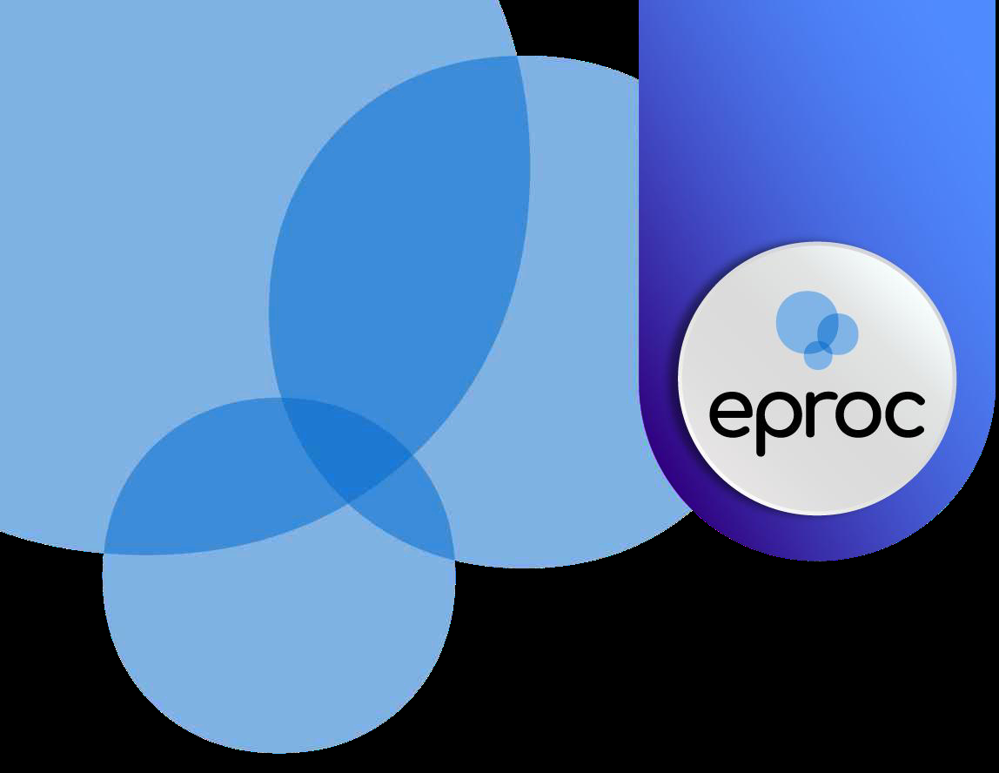

**AGENDAMENTO DE AUDIÊNCIAS**

**VIRTUAIS E HÍBRIDAS****–****PARTE II**

# Eproc para Gabinete – Módulo Básico

Atualizado em**11/07/2025.**

---

**SUMÁRIO**

**AGENDAMENTO DE AUDIÊNCIAS VIRTUAIS E**

**HÍBRIDAS****–****PARTE II**

**LINK DA AUDIÊNCIA VIRTUAL**

**3**

**TAGS DE AUDIÊNCIA**

**4**

**ACESSO À AUDIÊNCIA VIRTUAL**

**6**

**ENVIO DA GRAVAÇÃO PARA O PROCESSO**

**7**

**CRÉDITOS**

**8**

---

<small>**AGENDAMENTO DE AUDIÊNCIAS VIRTUAIS E HÍBRIDAS****–****PARTE II****|**Eproc para Gabinete – Módulo Básico</small>
**3**

**LINK DA AUDIÊNCIA VIRTUAL**

Concluído o agendamento da audiência virtual, o link de acesso à reunião na plataforma Microsoft

Teams estará disponível na tela “Audiências”, que pode ser acessada na seção “Ações” da capa do

processo.
<small>**Descrição da imagem**: seção “Eventos” da capa do processo com destaque na opção “Audiências”.</small>
O botão representado pela imagem de dois quadrados sobrepostos copia o link para a área de

transferência do computador.
<small>**Descrição da imagem**: tela “Audiências” com destaque na audiência cadastrada e respectivo link.</small>
Já os**advogados**poderão acessar o link da audiência de duas formas:

1. Através da capa do processo, na opção “Audiência” da seção “Ações”.
<small>**Descrição da imagem**: seção “Ações” da capa do processo com destaque na opção “Audiência”.</small>
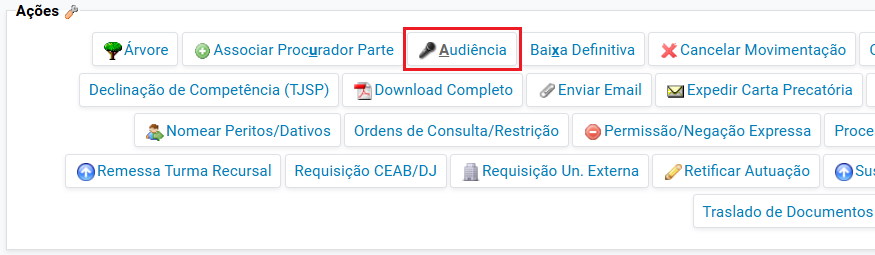

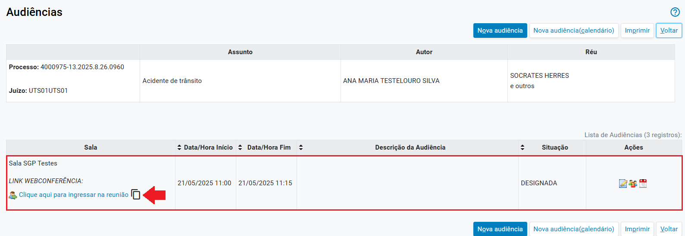

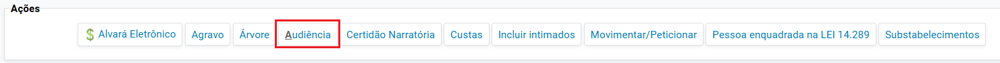

---

<small>**AGENDAMENTO DE AUDIÊNCIAS VIRTUAIS E HÍBRIDAS****–****PARTE II****|**Eproc para Gabinete – Módulo Básico</small>
**4**

2. Através do “Painel do Advogado”, seção “Audiências/Fóruns de Conciliações/Perícias”,

clicando sobre a quantidade de “Audiências Futuras”.
<small>**Descrição da imagem**: painel do advogado com destaque na seção ““Audiências/Fóruns de Conciliações/Perícias” e</small><small>na quantidade de audiências futuras.</small><small>**Descrição da imagem**: tela “Audiências Futuras” do advogado com destaque no link de acesso à audiência.</small>
**TAGS DE AUDIÊNCIA**

As TAGs é uma funcionalidade de atalho para preenchimento automático de textos (autotextos),

dados e metadados do processo. Podem ser inseridos nos modelos de minutas de decisão,

despacho, ofício, carta, mandado etc.

Dessa forma, as TAGs de Audiência inserem informações relativas às próprias audiências, como

por exemplo:

▪

**@AUDTEAMSDATAHORA@**: data e hora da última audiência virtual agendada

naquele processo com integração eproc-Teams;

▪

**@AUDTEAMSLINK@**: link da última audiência virtual agendada naquele processo;

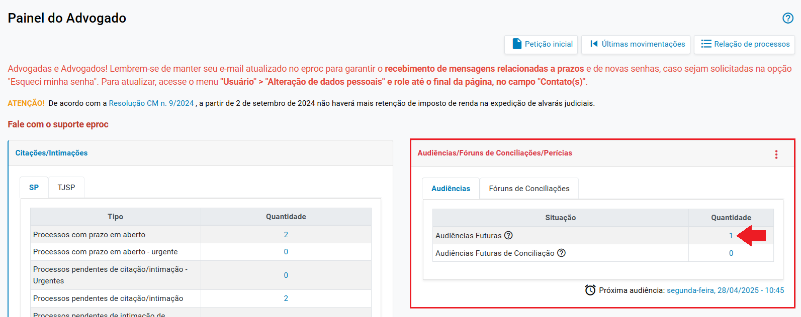

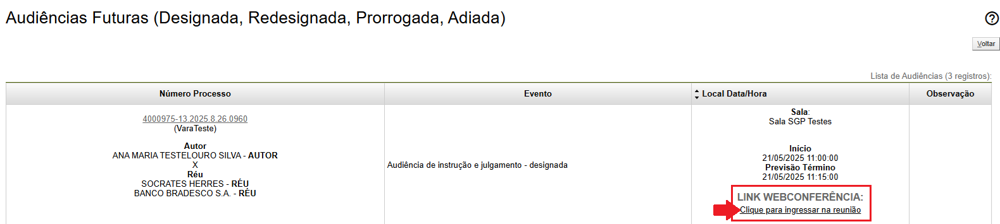

---

<small>**AGENDAMENTO DE AUDIÊNCIAS VIRTUAIS E HÍBRIDAS****–****PARTE II****|**Eproc para Gabinete – Módulo Básico</small>
**5**

▪

**@AUDTEAMSID@**: ID de acesso da última audiência virtual agendada naquele

processo;

▪

**@AUDTEAMSSENHA@**: senha de acesso da última audiência virtual;

▪

**@AUDTEAMSQRCODELINK**: QRCode da última audiência virtual agendada naquele

processo;

▪

**@DATAAUDIENCIA@**: esta TAG**não**está associada às audiências virtuais agendadas

com integração eproc-Teams e, por isso, não leva a palavra “Teams” em sua descrição,

servindo, sobretudo, para informar a data e a hora da última audiência presencial

agendada naquele processo.
<small>**Descrição da imagem**: tela exibindo utilização de TAGs de audiência em uma minuta de mandado</small><small>**Descrição da imagem**: minuta de despacho com as TAGs de Audiência aplicadas</small>
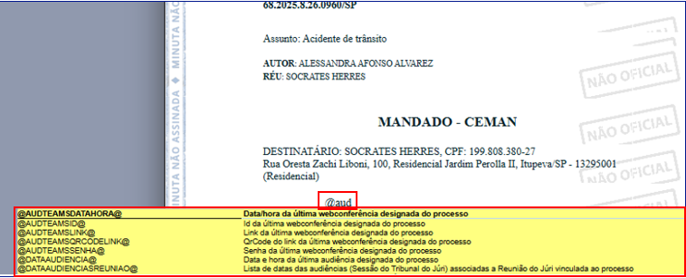

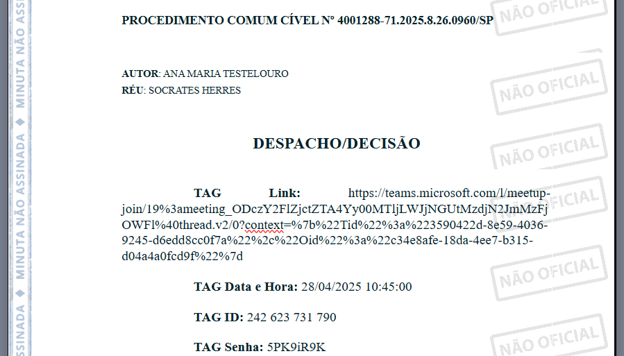

---

<small>**AGENDAMENTO DE AUDIÊNCIAS VIRTUAIS E HÍBRIDAS****–****PARTE II****|**Eproc para Gabinete – Módulo Básico</small>
**6**
<small>**Descrição da imagem**: tela exibindo minuta de mandado de intimação com a TAG QRCode</small>
**ACESSO À AUDIÊNCIA VIRTUAL**

Obtido o link da audiência virtual, ao acessá-lo, o usuário será direcionado a depender do

dispositivo usado:

▪

para uma nova aba do navegador de internet, se não houver aplicativo/programa

instalado no dispositivo;

▪

para o aplicativo Microsoft Teams, se o acesso for a partir de um aparelho celular;

▪

para o software Microsoft Teams, se acesso for de um computador do tipo desktop

com o referido programa instalado.

No Teams, serão exibidas configurações usuais de câmera e microfone, a opção “Ingressar agora”

e o título da reunião, contendo o número do processo e o tipo de audiência, conforme o evento

selecionado durante a etapa de agendamento.

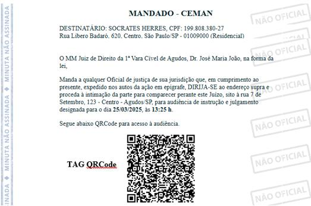

---

<small>**AGENDAMENTO DE AUDIÊNCIAS VIRTUAIS E HÍBRIDAS****–****PARTE II****|**Eproc para Gabinete – Módulo Básico</small>
**7**
<small>**Descrição da imagem**: tela do Teams para ingresso na reunião da audiência, contendo o número do processo e o</small><small>tipo da audiência na parte superior da tela e as configurações de microfone e câmera.</small>
**ENVIO DA GRAVAÇÃO PARA O PROCESSO**

Após encerrar a gravação, o vídeo é salvo no OneDrive do servidor que a iniciou. O envio da

gravação para o processo será realizado de forma automática, através de rotina executada pelo

sistema após o término da audiência. Para cada vídeo será gerado um evento contendo o link da

gravação.
<small>**Descrição da imagem**: tabela de eventos contendo o evento com o link para a gravação da audiência.</small>
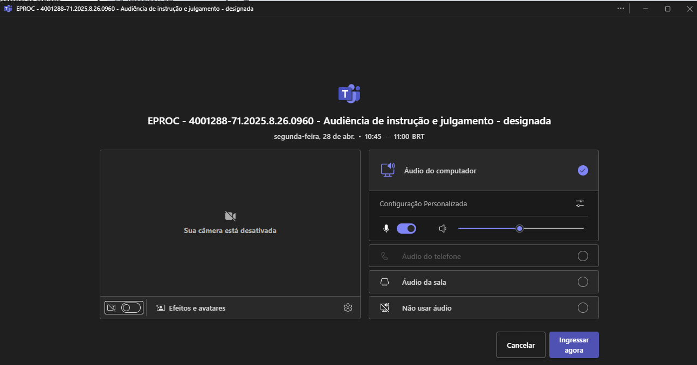

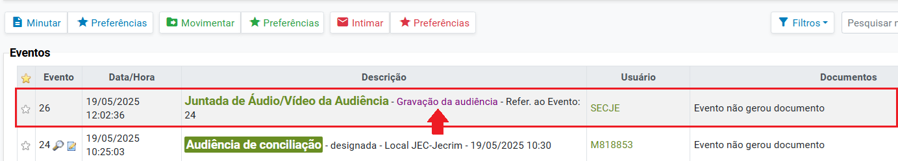

---

<small>**AGENDAMENTO DE AUDIÊNCIAS VIRTUAIS E HÍBRIDAS****–****PARTE II****|**Eproc para Gabinete – Módulo Básico</small>

**CRÉDITOS**

**PORTAL NACIONAL DO CONHECIMENTO EPROC**

*Material desenvolvido pelo TJSP, utilizando a*

*base de homologação gentilmente cedida pelo TJSC e TJRS.*
