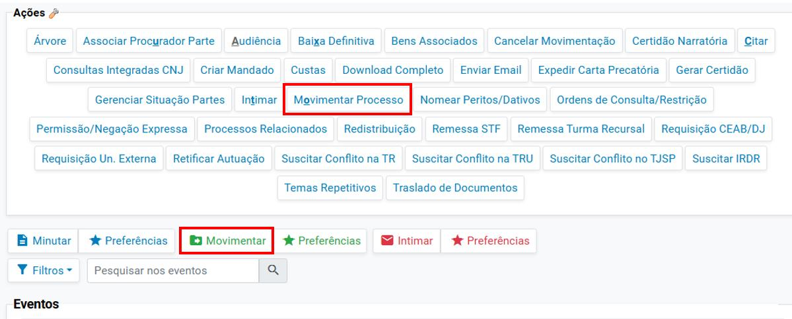
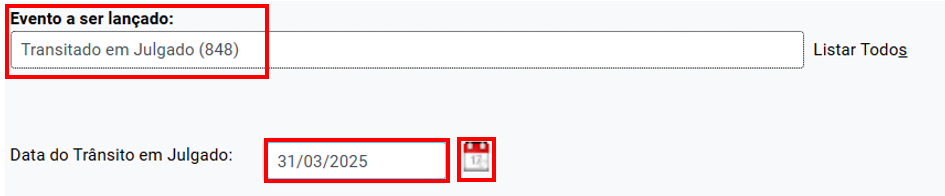
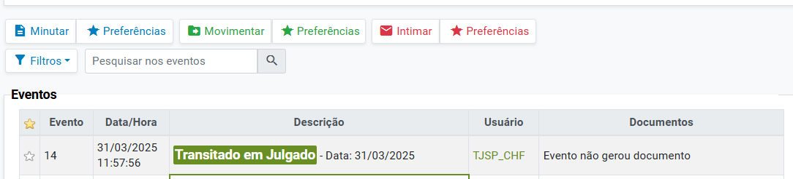

# APOSTILA DO TRÂNSITO EM JULGADO

*Documento eProc - Material de Treinamento*

---

---

<small>P O R T A L N A C I O N A L D O C O N H E C I M E N T O E P R O C</small>
**1**

**Atualizado em 03. 04. 2025.**

**REGISTRO DO TRÂNSITO EM JULGADO**

Eproc – PORTAL NACIONAL

▪**Contexto Geral**

O registro do trânsito em julgado no sistema eproc é realizado ao clicar no botão**“Movimentar**

**Processo”**da seção**“Ações”**ou acionando o botão**“Movimentar”**, localizado entre a seção

**“Ações”**e a seção**“Eventos”**.
<small>**Descrição da imagem**: destaque aos botões Movimentar Processo e Movimentar.</small>
Aberta a tela**Movimentação Processual**, preencher o campo**Evento a ser lançado**com uma das

seguintes opções de eventos referentes ao trânsito em julgado:

**◦**

**Transitado em Julgado**;

**◦**

**Transitado em Julgado – processo físico**;

**◦**

**Transitado em Julgado para a Acusação quanto ao Réu**– aplicável aos processos

criminais;

**◦**

**Transitado em Julgado para o Réu**– aplicável aos processos criminais.

Selecionado o evento referente ao trânsito em julgado, o eproc disponibiliza o campo**Data do**

**Trânsito em Julgado**. Clicar no campo para inserir a data do trânsito em julgado ou, ainda, acionar

o ícone representado por um calendário para a escolha da data.

---

<small>P O R T A L N A C I O N A L D O C O N H E C I M E N T O E P R O C</small>
**2**
<small>**Descrição da imagem**: destaque aos campos Eventos a ser lançado, data do Trânsito em Julgado e ao ícone do</small><small>calendário.</small>
Na sequência, clicar em**Movimentar**. O eproc lançará no processo o evento**Transitado em**

**Julgado**, com a data selecionada de registro do trânsito em julgado.
<small>**Descrição da imagem**: evento Transitado em Julgado com a data cadastrada no processo.</small>

