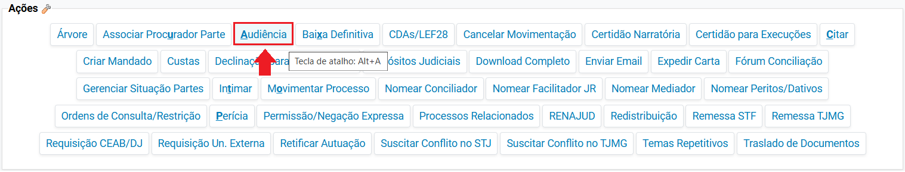
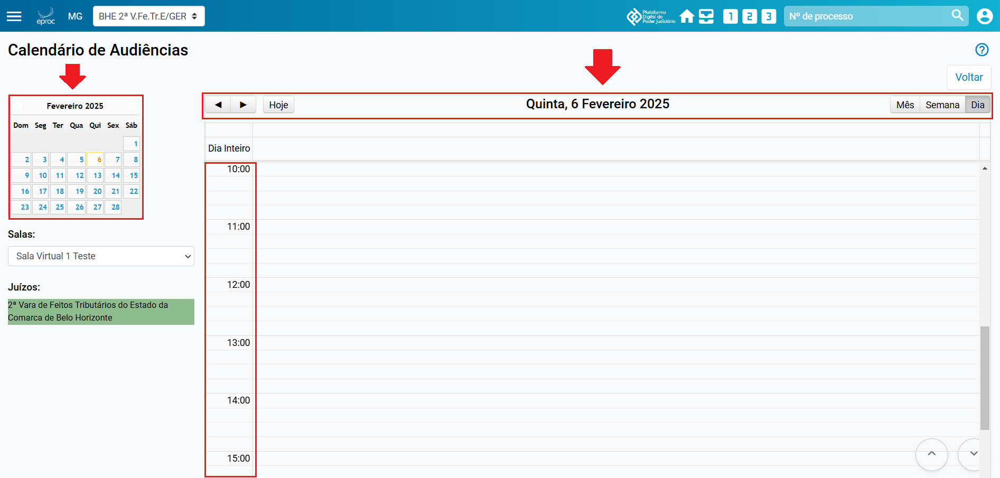
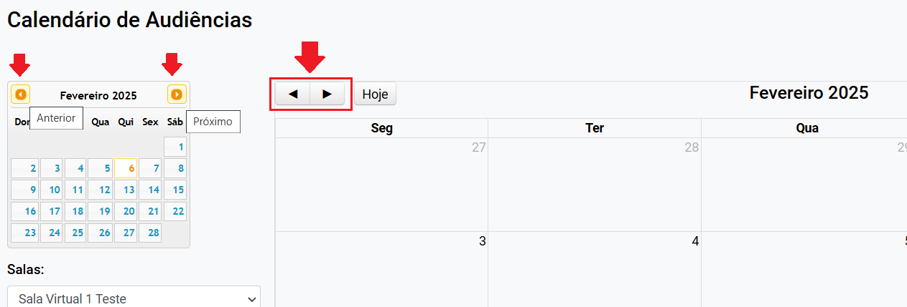
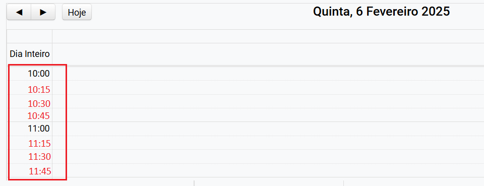
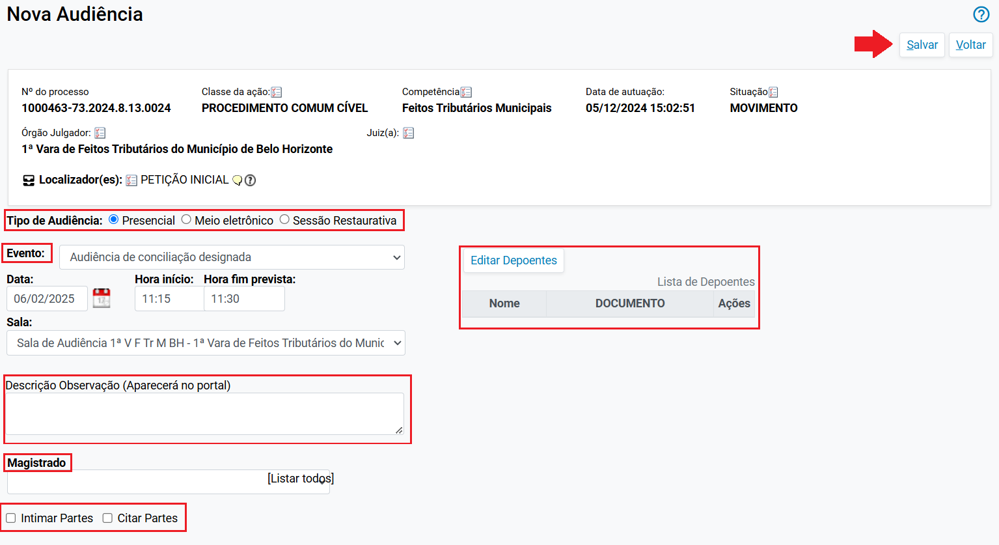

# Audiencia II - Agendar Audiencias

*Documento eProc - Material de Treinamento*

---

---

---

**SUMÁRIO**

**COMO AGENDAR AUDIÊNCIAS NO EPROC. .. .. .. .. .. .. .. .. .. .. .. .. .. .. .. .. .. .. .. .. .. .. .. .. .. .. .. .. .. .. .. .. .. .. .. .. .. .. .. .. .. .. .. .. 3**
<small>Opção “Nova Audiência” (calendário). .. .. .. .. .. .. .. .. .. .. .. .. .. .. .. .. .. .. .. .. .. .. .. .. .. .. .. .. .. .. .. .. .. .. .. .. .. .. .. .. .. .. .. .. .. .. .. .. .. .. .. .3</small><small>Opção “Nova Audiência”. .. .. .. .. .. .. .. .. .. .. .. .. .. .. .. .. .. .. .. .. .. .. .. .. .. .. .. .. .. .. .. .. .. .. .. .. .. .. .. .. .. .. .. .. .. .. .. .. .. .. .. .. .. .. .. .. .. .. .. .. .. .. .. .. .. .. .6</small>

---

**COMO AGENDAR AUDIÊNCIAS NO EPROC**

Para agendar audiências no eproc, o usuário deverá:

1. ​ Na seção “**Ações**” do processo, clicar na ação “**Audiência**”.

2. ​ O sistema abrirá a tela “**Audiências**”. Optar por “**Nova Audiência**

**(Calendário)**” ou “**Nova Audiência**”.

**Opção “Nova Audiência” (calendário)**

Ao selecionar a opção “**Nova Audiência (calendário)**”, o sistema abrirá a tela

“**Calendário de Audiência**”, que permite visualizar, no calendário expandido,

as audiências agendadas, feriados e bloqueios realizados. É possível

selecionar meses, semanas e dias utilizando as setas e os botões localizados

na parte superior.

O usuário poderá selecionar a data da audiência a ser agendada de duas

formas:

1. ​ No calendário compacto localizado à esquerda da tela, clicando na

data que a audiência será agendada e, após, selecionar o horário.

2. ​ No calendário expandido, ao clicar na data/horário que a audiência

será agendada.

---

<small>(Tela “Calendário de Audiências”: Calendário compacto e expandido)</small>
3. ​ Para selecionar meses anteriores ou próximos, basta clicar nos botões

“**Anterior**” ou “**Próximo**” do calendário compacto, ou nas setas

indicadas do calendário expandido.

**ATENÇÃO:**O sistema não permite agendar audiências com datas anteriores

ao dia atual. Caso o usuário selecione uma data anterior, o sistema exibirá a

seguinte mensagem: “A data escolhida não pode ser anterior ao dia de hoje”.

4. ​ Após selecionar a data da audiência, o sistema exibirá uma nova tela

onde o usuário deverá escolher o horário. Cada linha abaixo do

---

horário representa um acréscimo de 15 minutos, conforme ilustrado na

tela abaixo:

5. ​ Após selecionar o horário, o sistema abrirá a tela “**Nova Audiência**”,

para preenchimento do tipo de audiência, magistrado, intimação e

citação das partes, de depoentes e de eventuais novos localizadores.

Os campos deverão ser preenchidos da seguinte forma:

➔​**Tipo de Audiência:**Selecionar se será Presencial, Meio eletrônico ou

Sessão Restaurativa.

➔​**Evento:**Selecionar o tipo de audiência que será designada.

---

➔​**Data, Hora início e Hora fim da audiência:**Campos virão preenchidos

conforme seleção anterior.

➔​**Editar Depoentes:**Campo opcional para incluir depoentes, caso

necessário.

➔​**Sala:**Selecionar o nome da sala que ocorrerá a audiência.

➔​**Magistrado:**Selecionar o nome do magistrado que presidirá a

audiência.

➔​**Intimar Partes:**Selecionar para realizar intimação das partes.

➔​**Citar Partes:**Selecionar para realizar intimação das partes.

6. ​ Após preencher as informações acima, finalizar o agendamento

selecionando

a

opção

“**Salvar**”,

caso

não

tenha

realizado

a

intimação/citação para as partes, ou clicar em “**Salvar e Intimar as**

**Partes**” caso tenha feito a intimação/citação.

**Opção “Nova Audiência”**

Ao selecionar a opção “Nova Audiência”, o sistema abrirá a tela “**Nova**

**Audiência**” para preenchimento do tipo de audiência, magistrado, intimação

e citação das partes, de depoentes e de eventuais novos localizadores.

---

Os campos deverão ser preenchidos da seguinte forma:

➔​**Tipo de Audiência:**Selecionar se será Presencial, Meio eletrônico ou

Sessão Restaurativa.

➔​**Evento:**Selecionar o tipo de audiência que será designada.

➔​**Data, Hora início e Hora fim da audiência:**Selecionar a data e horário

que a audiência ocorrerá.

➔​**Editar Depoentes:**Campo opcional para incluir depoentes, caso

necessário.

➔​**Sala:**Selecionar o nome da sala que ocorrerá a audiência.

➔​**Magistrado:**Selecionar o nome do magistrado que presidirá a

audiência.

➔​**Intimar Partes:**Selecionar para realizar intimação das partes.

➔​**Citar Partes:**Selecionar para realizar intimação das partes.

7. ​ Após preencher as informações acima, finalizar o agendamento

selecionando

a

opção

“**Salvar**”,

caso

não

tenha

realizado

a

intimação/citação para as partes, ou clicar em “**Salvar e Intimar as**

**Partes**” caso tenha feito a intimação/citação.

