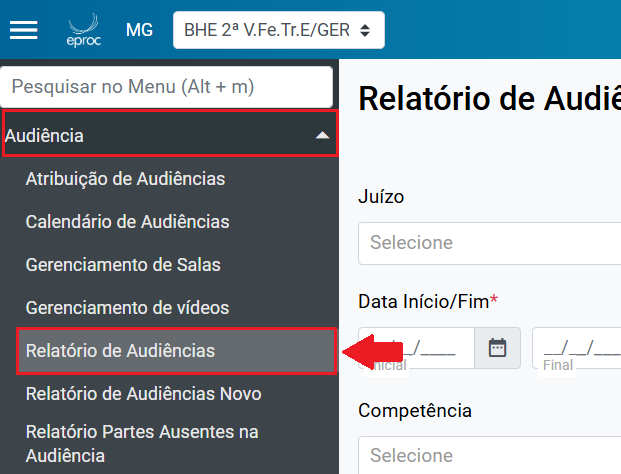
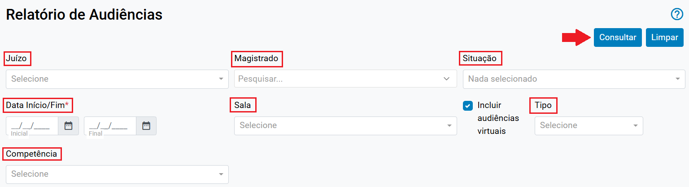
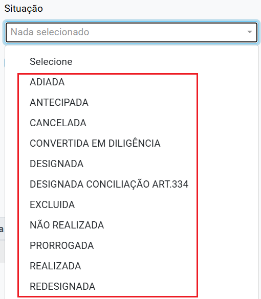
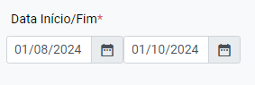
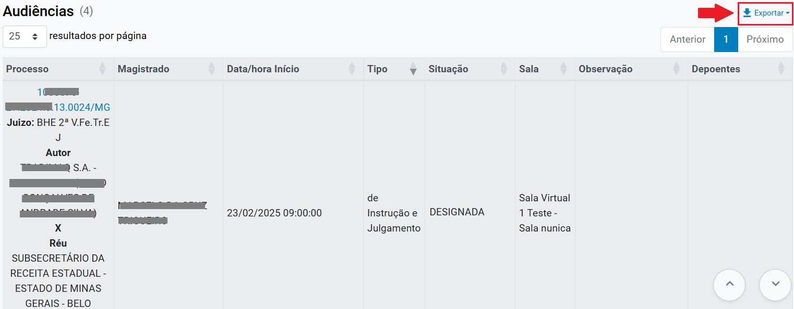
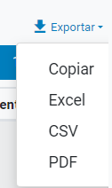

# Audiencia IV - Relatorio de Audiencia

*Documento eProc - Material de Treinamento*

---

---

---

**Relatório de Audiências**

Para acessar o**“Relatório de Audiências”**, o usuário deverá:

1. ​ No “**Menu Textual**”, clicar em “**Audiência**” e selecionar a opção

“**Relatório de Audiência**”.

2. ​ O sistema abrirá a tela “**Relatório de Audiências**”, que permite a busca

de audiências utilizando diversos filtros, como “**Juízo**”, “**Magistrado**”,

“**Situação**”, “**Data Início/Fim**”, “**Sala**” e “**Competência**”:

​

Os campos deverão ser preenchidos conforme a seguir:

➔​**“Juízo”:**selecionar o seu órgão julgador no qual o usuário está

lotado;

---

➔​**“Magistrado”:**campo de preenchimento facultativo. Caso deseje

utilizar um magistrado específico na busca, o usuário deverá inserir

seu nome e aguardar o sistema buscar o resultado.

➔​ “**Situação**”: permite a seleção de uma ou mais situações para a

busca. Caso nenhuma situação seja selecionada, a busca será

realizada para todos os tipos de situação. As opções disponíveis

para seleção são:

**Observação:**Apenas o campo “**Situação**” permite selecionar mais de uma

situação de audiência para pesquisa, ou seja, é possível marcar uma,

nenhuma ou várias situações de forma cumulativa.

➔​ “**Data Início/Fim**”: campo de preenchimento obrigatório. O usuário

deverá selecionar o período que deseja realizar a busca;

---

➔​ “**Sala**”: permite que o usuário selecione as salas configuradas em

sua Unidade Judiciária. Caso o campo não seja preenchido, a

busca será realizada exibindo todas as salas.

➔​**“Incluir audiências virtuais”:**a caixa de seleção virá marcada

automaticamente.

➔​ “**Tipo**”: permite selecionar o tipo de audiência. É possível selecionar

apenas um tipo ou, caso nenhum seja selecionado, o sistema

buscará todos os tipos.

➔​**“Competência”:**permite selecionar competência específica para

busca.

3. ​ Após preencher os critérios de busca, clicar em “**Consultar**”.

4. ​ O sistema exibirá o resultado em forma de lista, com as seguintes

colunas:**“Processo”, “Magistrado”, “Data/Hora Início”, “Tipo”, “Situação”,**

**“Sala”, “Observação” e “Depoentes”**.

5. ​ Para exportar a lista, clicar em “Exportar”. O sistema apresentará as

opções para transformar a planilha em um documento nos formatos

Excel, CSV e PDF. Também é possível copiar o documento e colá-lo no

editor de texto desejado.

