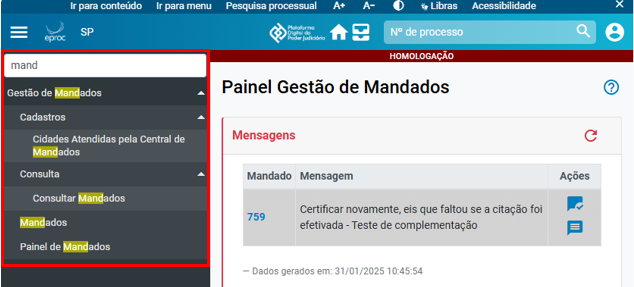

# Eproc para Central de Mandados

*Documento eProc - Material de Treinamento*

---

---

<small>Imagem decorativa de capa: linhas e luzes de sistema e logotipo do eproc. Na lateral está escrit</small><small>o: EPROC</small><small>SGP 4 - Diretoria de Capacitação, Desenvolvimento de Talentos, Novos Projetos,</small><small>Governança em Gestão de Pessoas e Análise de Desempenhos Funcionais</small>

**PRIMEIROS PASSOS**

# Eproc para Central de Mandados

Atualizado em**17/02/2025**

---

**SUMÁRIO**

**PRIMEIROS PASSOS**

**COMO ACESSAR O EPROC**

**3**

**APRESENTAÇÃO DA INTERFACE DO SISTEMA**

**4**
<small>Perfil do usuário</small><small>5</small>
**MENU LATERAL OU MENU TEXTUAL**

**6**

**CRÉDITOS**

**8**

---

**PRIMEIROS PASSOS****|**Eproc para Central de Mandados
<small>**3**</small>
**COMO ACESSAR O EPROC**

Por ser uma plataforma on-line, não é necessário baixar e instalar o sistema eproc. Basta usar um

navegador de internet, como o Microsoft Edge ou o Google Chrome, e acessá-lo por:

▪ ícone na aba “Acesso rápido” da intranet do Tribunal de Justiça;

▪ atalho “eproc 1G” na área de trabalho do computador dos usuários lotados em

cartórios.

Na página inicial do eproc, deve-se escolher a opção “Entrar no Sistema” do menu lateral esquerdo

e inserir o usuário e a senha (os mesmos usados para acessar o e-mail institucional).

Podemos, inclusive, favoritar o endereço eletrônico do sistema, possibilitando seu acesso de forma

direta.
<small>**Descrição da imagem**: tela de acesso ao sistema eproc adicionada aos “favoritos” do navegador.</small>

---

**PRIMEIROS PASSOS****|**Eproc para Central de Mandados
<small>**4**</small>
**APRESENTAÇÃO DA INTERFACE DO SISTEMA**

O eproc pode ser customizado para atender às necessidades do usuário, facilitando o fluxo de

trabalho e aumentando a produtividade.

No topo da página, há uma barra com informações e opções de acesso rápido, descritas abaixo:
<small>**Descrição da imagem**: página inicial do eproc com destaque para a barra azul localizada na parte superior da tela.</small>
▪ o ícone**“****Abrir menu****”**, representado por três linhas brancas paralelas, exibe ou oculta

o**menu lateral**;

▪ o símbolo do eproc abre o**“****Painel Inicial****”**;

▪ a sigla do Estado direciona o usuário à página do Tribunal de Justiça;

▪ o campo seguinte exibe a lotação do usuário;

▪ a**Plataforma Digital do Poder Judiciário****–****Marketplace**;

▪ o ícone representado pelo desenho de uma casa leva à**página inicial do sistema**;

▪**“****Meus Localizadores****”**, representado pelo desenho de um gaveteiro;

---

**PRIMEIROS PASSOS****|**Eproc para Central de Mandados
<small>**5**</small>
▪ os números**1**,**2**e**3**são botões de acesso rápido configurados pelo usuário;

▪ o campo de**pesquisa pelo número do processo**, desconsiderando-se a sequência de

zeros à esquerda e o ano à direita;

▪ e o ícone**“****Perfil do usuário****”**, representado pelo desenho de uma pessoa.

**Perfil do usuário**

O botão “Perfil do usuário” abre um menu com diversas funcionalidades.
<small>**Descrição da imagem**: parte da tela do eproc com destaque para o menu do ícone**“Perfil do Usuário”**.</small>
O ícone**“Novidades”**sinalizado com uma bola vermelha indica alterações ou atualizações no

sistema, exibidas em uma nova página.

Em**“Configurações”**, o servidor pode habilitar e desabilitar notificações, definir acessos rápidos,

conferir as ações mais utilizadas, personalizar recursos de acessibilidade e a aparência do sistema,

entre outros. É importante explorar esta área para deixar o eproc o mais conveniente possível.

É possível habilitar a**“Barra de acessibilidade”**, visível no topo da tela, com opções que facilitam

a navegação.

---

**PRIMEIROS PASSOS****|**Eproc para Central de Mandados
<small>**6**</small><small>**Descrição da imagem**: tela do eproc com destaque ao item**“Barra de acessibilidade”**do ícone**“Perfil do usuário”**e</small><small>à própria barra habilitada no topo da página.</small>
O menu traz a descrição da versão do sistemae a opção**Encerrar Sessão,**que pode também ser

realizada por meio do atalho*Ctrl + Shift + F4*.

**MENU LATERAL OU MENU TEXTUAL**

À esquerda da página inicial do eproc está o**menu lateral**, com uma barra de busca no topo e

opções listadas abaixo.
<small>**Descrição da imagem**: tela do eproc com destaque para o menu lateral esquerdo.</small>

---

**PRIMEIROS PASSOS****|**Eproc para Central de Mandados
<small>**7**</small>
O campo**“Pesquisar no Menu”**, pode ser selecionado por um clique ou pelo atalho “Alt+M” do

teclado. Ao digitar uma palavra completa ou apenas um conjunto de letras, o sistema retorna

todas as funções que contenham tal informação no título.

Por exemplo, uma busca pela expressão “mand” retorna resultados que contêm esta expressão,

como “Consultar Mandados”, “Painel de Mandados” e “Cidades Atendidas pela Central de

Mandados”.
<small>**Descrição da imagem**: tela do eproc com destaque à pesquisa das funcionalidades que contêm a expressão “mand”.</small>

---

**PRIMEIROS PASSOS****|**Eproc para Central de Mandados

**CRÉDITOS**
<small>SGP 4 - Diretoria de Capacitação, Desenvolvimento de Talentos, Novos Projetos,</small><small>Governança em Gestão de Pessoas e Análise de Desempenhos Funcionais</small><small>Todo o material foi desenvolvido utilizando a base de homologação</small><small>gentilmente cedida pelo Tribunal de Justiça de Santa Catarina</small>
