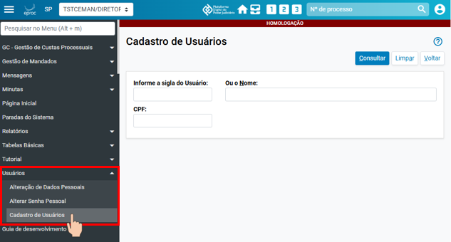
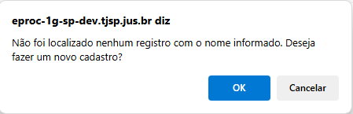
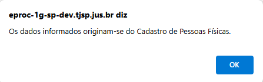
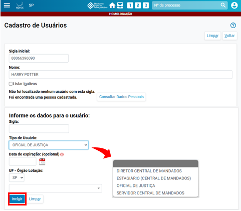
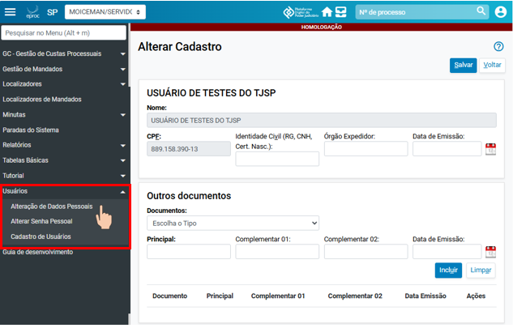
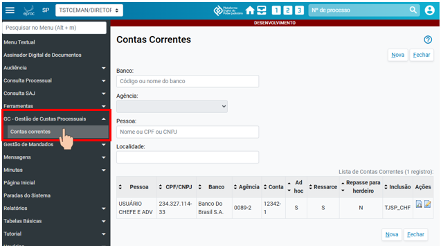
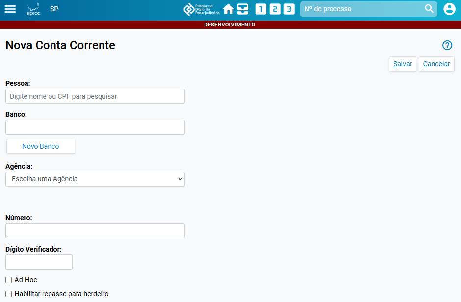
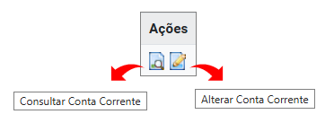

# Eproc para Central de Mandados

*Documento eProc - Material de Treinamento*

---

---

<small>Imagem decorativa de capa: linhas e luzes de sistema e logotipo do eproc. Na lateral está escrit</small><small>o: EPROC</small><small>SGP 4 - Diretoria de Capacitação, Desenvolvimento de Talentos, Novos Projetos,</small><small>Governança em Gestão de Pessoas e Análise de Desempenhos Funcionais</small>

**CADASTRO DE USUÁRIOS E**

**CONTAS CORRENTES**

# Eproc para Central de Mandados

Atualizado em**17/02/2025**

---

**SUMÁRIO**

**CADASTRO**

**DE**

**USUÁRIOS**

**E**

**CONTAS**

**CORRENTES**

**DOS CADASTROS**

**3**
<small>Cadastro de usuários</small><small>3</small><small>Cadastro das contas correntes dos Oficiais de Justiça</small><small>6</small>
**CRÉDITOS**

**8**

---

**CADASTRO DE USUÁRIOS E CONTAS CORRENTES****|**Eproc para Central de Mandados
<small>**3**</small>
**DOS CADASTROS**

Os dados dos servidores, dos logradouros e zoneamentos de todas as Centrais de Mandados do

TJSP, cadastrados no sistema SAJ, foram transferidos, via banco de dados, para o eproc. Isso

significa que, a partir da implantação do novo sistema, os oficiais de justiça, os escreventes e os

gestores das Centrais já estarão devidamente cadastrados e aptos para as atividades diárias.

Os procedimentos a seguir descritos deverão ser adotados para o cadastro de novos servidores,

novos endereços ou rezoneamento das comarcas.

**Cadastro de usuários**

A partir do menu lateral, o gestor da Central de Mandados deve buscar e acessar a tela**“Cadastro**

**de Usuários”**, dentro da categoria “Usuários”.
<small>**Descrição da imagem**: tela “Cadastro de Usuários” do eproc aberta, exibindo, em destaque, a respectiva opção no</small><small>menu lateral.</small>
Nela, digitar o número do CPF da pessoa a ser cadastrada e clicar em “Consultar”. Por ainda não

existir um cadastro, o eproc exibirá a mensagem “Não foi localizado nenhum registro com o nome

informado. Deseja fazer um novo cadastro? ”

---

**CADASTRO DE USUÁRIOS E CONTAS CORRENTES****|**Eproc para Central de Mandados
<small>**4**</small><small>**Descrição da imagem**: caixa com a mensagem mencionada e opções “OK” e “Cancelar”.</small>
Ao clicar em “OK”, o sistema exibirá a mensagem “Os dados informados originam-se do Cadastro

de Pessoas Físicas. ”
<small>**Descrição da imagem**: caixa com a mensagem mencionada e opção “OK”.</small>
Confirmada a opção “OK”, será aberta a tela “Cadastro de Pessoa Física” com alguns campos já

previamente preenchidos de acordo com os dados da Receita Federal. O gestor, então, confirmará

as informações, preencherá os campos faltantes e, uma vez conferidos, clicará em “Salvar”.

Na próxima tela, será atribuída uma sigla para o servidor. Selecionar o tipo de usuário – Diretor

Central de Mandados, Estagiário (Central de Mandados), Oficial de Justiça ou Servidor Central de

Mandados –, a data de expiração (opcional e utilizada, por exemplo, na designação de um Oficial

de Justiça para auxiliar uma Unidade por um determinado período e de estagiários durante o

período de estágio) e o órgão de lotação e clicar em “Incluir”.

---

**CADASTRO DE USUÁRIOS E CONTAS CORRENTES****|**Eproc para Central de Mandados
<small>**5**</small><small>**Descrição da imagem**: tela “Cadastro de Usuários” e seus campos, destaque ao item “Tipo de Usuário” e às opções</small><small>do respectivo menu suspenso.</small>
Confirmada a inclusão, o servidor cadastrado já estará vinculado à sua Central de Mandados.

**Alteração dos dados cadastrais**

O servidor logado no sistema pode alterar seus dados pessoais buscando e acessando a tela

“Alteração de Dados Pessoais”, dentro da categoria “Usuários”, pelo menu lateral.
<small>**Descrição da imagem**: tela “Alterar Cadastro” com o respectivo item exibido, em destaque, no menu lateral.</small>

---

**CADASTRO DE USUÁRIOS E CONTAS CORRENTES****|**Eproc para Central de Mandados
<small>**6**</small>
**Cadastro das contas correntes dos Oficiais de Justiça**

A partir do menu lateral, item “Contas Correntes” dentro da categoria “GC – Gestão de Custas

Processuais”, a Central de Mandados ou mesmo o Oficial de Justiça deverá cadastrar as contas

correntes dos Oficiais.

Esse cadastro é condição para que o servidor Oficial de Justiça possa emitir suas minutas de

certificação dos mandados no eproc.
<small>**Descrição da imagem**: tela “Conta Correntes” aberta e destaque ao respectivo item exibido no menu lateral.</small>
Nela, clicar em “Nova” para abrir a tela “Nova Conta Corrente” e, então, preencher “Pessoa”,

“Banco”, “Agência”, “Número” e “Dígito Verificador”. Após, clicar em “Salvar”.
<small>**Descrição da imagem**: tela “Nova Conta Corrente” com campos para preenchimento.</small>

---

**CADASTRO DE USUÁRIOS E CONTAS CORRENTES****|**Eproc para Central de Mandados
<small>**7**</small>
Registrada a conta corrente, ela poderá ser consultada e alterada a partir da aba “Ações”.
<small>**Descrição da imagem**: botões de atividade de consulta e alteração da conta corrente presentes na aba “Ações”.</small>
**Importante**

A atualização dos dados para o pagamento das diligências, por ora, continuará sendo

realizada nos sistemas SMG (Sistema de Mandados Gratuitos) e SGF (Sistema de

Gestão Financeira).

---

**CADASTRO DE USUÁRIOS E CONTAS CORRENTES****|**Eproc para Central de Mandados

**CRÉDITOS**
<small>SGP 4 - Diretoria de Capacitação, Desenvolvimento de Talentos, Novos Projetos,</small><small>Governança em Gestão de Pessoas e Análise de Desempenhos Funcionais</small><small>Todo o material foi desenvolvido utilizando a base de homologação</small><small>gentilmente cedida pelo Tribunal de Justiça de Santa Catarina</small>
