# Eproc para Central de Mandados

*Documento eProc - Material de Treinamento*

---

---

<small>Imagem decorativa de capa: linhas e luzes de sistema e logotipo do eproc. Na lateral está escrit</small><small>o: EPROC</small><small>SGP 4 - Diretoria de Capacitação, Desenvolvimento de Talentos, Novos Projetos,</small><small>Governança em Gestão de Pessoas e Análise de Desempenhos Funcionais</small>

**DOS CADASTROS**

# Eproc para Central de Mandados

Atualizado em**26/03/2025**

---

**SUMÁRIO**

**DOS CADASTROS**

**CADASTROS DE CARGOS, OFICIAIS DE JUSTIÇA, FÉRIAS E AFASTAMENTOS**

**3**

**CADASTRO DE ZONAS GEOGRÁFICAS**

**5**
<small>Cadastro dos cargos nas zonas</small><small>7</small><small>Cadastro dos logradouros nas zonas</small><small>9</small>
**CRÉDITOS**

**12**

---

**DOS CADASTROS****|**Eproc para Central de Mandados
<small>**3**</small>
**CADASTROS DE CARGOS, OFICIAIS DE**

**JUSTIÇA, FÉRIAS E AFASTAMENTOS**

Na chegada de um novo oficial de justiça à Central de Mandados, o gestor da Central deverá

cadastrar um cargo para o servidor a partir do menu lateral, opção**Gestão de Mandados >**

**Cadastros > Cargos.**
<small>**Descrição da imagem**: tela “Cargos” com destaque para a opção no menu lateral.</small>
Ao clicar em**Novo**, na tela aberta, inserir a descrição do cargo seguindo o padrão dos já criados,

assinalando a flag**Participação na distribuição**, para que o oficial do cargo participe da distribuição

dos mandados.
<small>**Descrição da imagem**: tela “Novo Cargo” com destaque ao campo “Descrição”.</small>
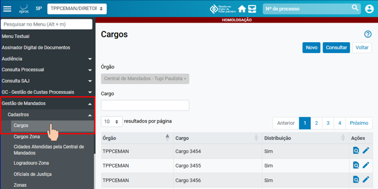

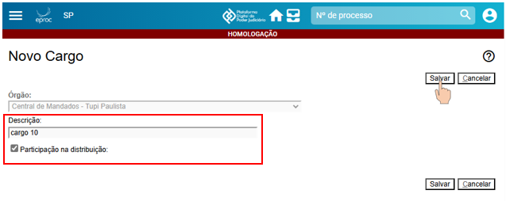

---

**DOS CADASTROS****|**Eproc para Central de Mandados
<small>**4**</small>
Na sequência, cadastrar o oficial de justiça ao novo cargo criado.

No menu lateral, selecionar a opção**Gestão de Mandados > Cadastros > Oficiais de Justiça.**
<small>**Descrição da imagem**: tela “Oficiais de Justiça” com destaque para a opção no menu lateral.</small>
Ao clicar em**Novo**, o sistema exibirá a tela**Novo Oficial de Justiça**, para vinculação do Oficial ao

cargo.

Nessa tela, selecionar o servidor, o cargo, anotar obrigatoriamente a data do início da vinculação,

sendo facultativo o preenchimento do campo “Término”, selecionar o status do Oficial dentre

Titular ou Substituto e clicar em**Salvar.**
<small>**Descrição da imagem**: tela “Novo Oficial de Justiça” com destaque para a opção “Salvar”.</small>
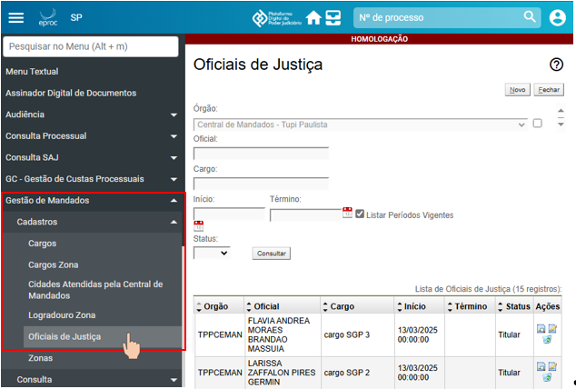

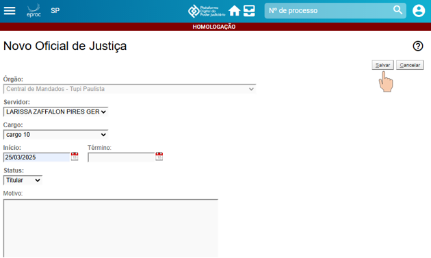

---

**DOS CADASTROS****|**Eproc para Central de Mandados
<small>**5**</small>
**Cadastramento do oficial de justiça substituto durante o período de férias do oficial de**

**justiça titular do cargo**

Quando um oficial de justiça estiver em gozo de férias, o gestor da Central deverá cadastrar um

oficial de justiça com status de**Substituto**para atuar no cargo do oficial titular, durante o período

de sua ausência.

E nessa vinculação do oficial substituto ao cargo do oficial titular, o diretor da Central deverá

anotar o campo início e término da vinculação temporária, bem como descrever o motivo da

substituição no campo**Motivo.**

**Atenção**

No eproc, um oficial de justiça pode estar vinculado a mais de um cargo.

**CADASTRO DE ZONAS GEOGRÁFICAS**

As zonas geográficas cadastradas no sistema SAJ foram migradas para o eproc via banco de dados.

Havendo novos endereços ou a necessidade de um novo zoneamento, o servidor responsável pela

Central de Mandados deverá efetuar este cadastro.

Isso é feito pela tela “Zonas”, na subcategoria “Cadastros” e categoria “Gestão de Mandados” do

menu lateral.
<small>**Descrição da imagem**: tela “Zonas” aberta e destaque à sua localização pelo menu lateral esquerdo.</small>
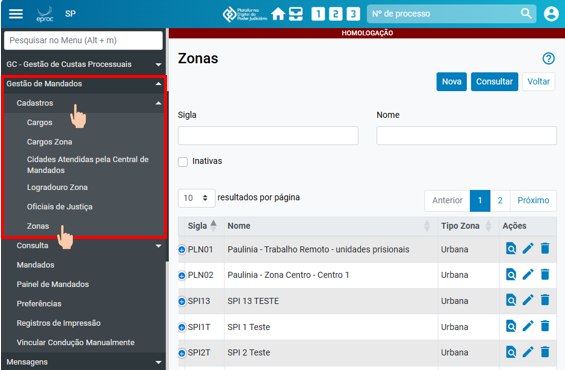

---

**DOS CADASTROS****|**Eproc para Central de Mandados
<small>**6**</small>
Na referida página, o sistema possibilita consultar zonas, ativas e inativas, por sigla ou nome. Há

uma caixa de seleção “Inativas” para tal especificação e um botão “Consultar” no topo, à direita.

Abaixo dos campos de pesquisa são exibidas todas as zonas já cadastradas pela Central, listadas

em uma tabela com as colunas “Sigla”, “Nome”, “Tipo Zona” e “Ações”. Na última, estão presentes

os botões de atividade “Consultar”, “Alterar” e “Desativar”.
<small>**Descrição da imagem**: botões de atividade da aba “Ações” com destaques.</small>
No topo, ao lado do botão “Consultar”, está a opção “Nova”. Acionada, o usuário é levado à tela

“Nova Zona” com os campos “Sigla”, “Nome” e “Tipo” (urbana ou rural) para preenchimento e a

caixa de seleção “Isento despesa condução”, que não deve ser marcada em nenhuma situação.

Preenchidos os campos, clicar em “Salvar”.
<small>**Descrição da imagem**: tela “Nova Zona” e campos para preenchimento.</small>
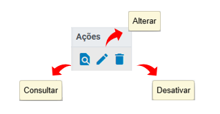

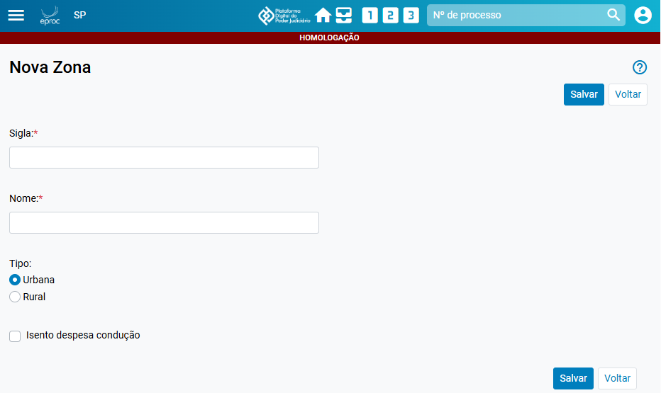

---

**DOS CADASTROS****|**Eproc para Central de Mandados
<small>**7**</small>
**Cadastro dos cargos nas zonas**

Para vincular um cargo a uma zona, buscar e acessar o item “Cargos Zona”, dentro da subcategoria

“Cadastros” e categoria “Gestão de Mandados” do menu lateral.
<small>**Descrição da imagem**: tela “Cargos da Zona” aberta e destaque aos itens citados exibidos no menu lateral.</small>
Na tela “Cargos da Zona”, o usuário poderá fazer uma consulta a partir dos filtros de pesquisa e

consultar as vinculações já realizadas na listagem apresentada.

Na aba “Ações” é possível consultar, alterar ou desativar o cadastro, clicando nos respectivos

botões de atividade.
<small>**Descrição da imagem**: botões de atividade da aba “Ações”.</small>
Para fazer uma nova vinculação, clicar em “Novo”.

O campo “Órgão” virá previamente preenchido com a identificação da Central. No campo “Cargo”,

digitar a palavra “cargo” e clicar em “Consultar” para que sejam listados todos os cargos já

cadastrados na Central. No campo “Zona”, digitar a palavra “zona” e clicar em “Consultar” para

exibição das zonas cadastradas.

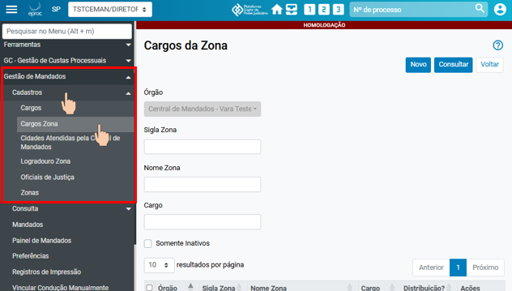

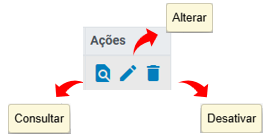

---

**DOS CADASTROS****|**Eproc para Central de Mandados
<small>**8**</small><small>**Descrição da imagem**: tela “Novo Cargo da Zona” com destaque aos campos citados para preenchimento.</small>
Para fazer a vinculação, selecionar, no campo “Ações”, o cargo e a zona ao qual ele será vinculado.

A exemplo, foi selecionado o item referente ao cargo denominado “Cargo 5” para ser vinculado à

zona denominada “Paulina – Zona Centro – Centro 1”.
<small>**Descrição da imagem**: tela “Novo Cargo da Zona” com destaque aos campos citados.</small>
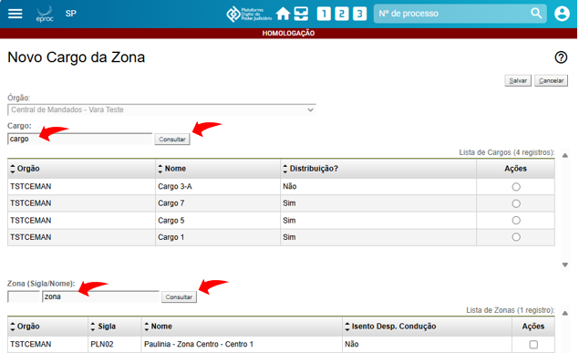

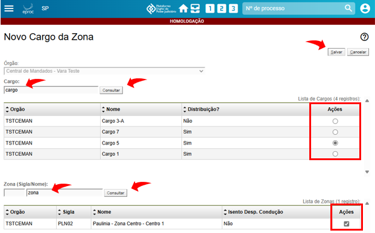

---

**DOS CADASTROS****|**Eproc para Central de Mandados
<small>**9**</small>
Ao clicar em “Salvar”, o sistema exibirá uma mensagem de cadastro realizado com sucesso.
<small>**Descrição da imagem**: caixa de mensagem de confirmação de cadastro de zona.</small>
**Cadastro dos logradouros nas zonas**

Para cadastrar um novo endereço em uma zona, buscar e acessar a página “Logradouros Zona”,

da subcategoria “Cadastros” e categoria “Gestão de Mandados” do menu lateral.
<small>**Descrição da imagem**: tela “Logradouro Zona” aberta com destaque aos itens do menu lateral citados.</small>
Na tela “Logradouros zona”, o usuário poderá fazer uma consulta a partir dos filtros de pesquisa e

consultar as vinculações já realizadas na listagem apresentada.

Na aba “Ações” é possível consultar e desativar um logradouro zona, clicando nos respectivos

botões de atividade.

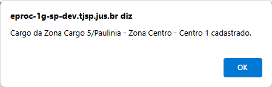

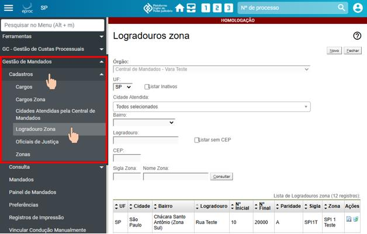

---

**DOS CADASTROS****|**Eproc para Central de Mandados
<small>**10**</small><small>**Descrição da imagem**: botões de atividade da aba “Ações”.</small>
Para cadastrar um novo endereço/logradouro em uma zona, clicar em “Novo”. O campo “Órgão”

virá previamente preenchido com a identificação da Central.

Selecionar a cidade, o bairro, informar o logradouro ou o CEP e clicar em “Consultar”.

O sistema, então, exibirá os logradouros consultados para seleção na aba “Ações”.
<small>**Descrição da imagem**: parte da tela “Novo Logradouro zona” com destaque ao campo de consulta por CEP e à</small><small>exibição de resultados após a busca.</small>
Ainda na tela “Novo Logradouro zona”, o usuário pode descer a barra de rolagem e encontrar, ao

final, o campo “Sigla/Zona” para preenchimento com a sigla ou o nome da zona, podendo digitar

todo ou parte dele, e o botão “Consultar”.

O sistema exibirá a zona que contenha a palavra buscada. Após, clicar em “Salvar”.

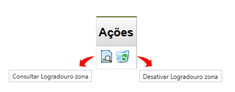

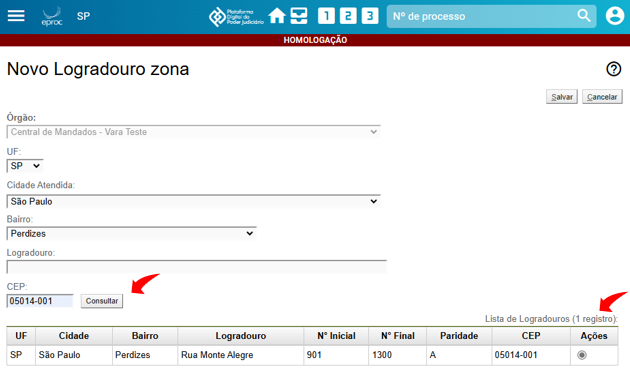

---

**DOS CADASTROS****|**Eproc para Central de Mandados
<small>**11**</small><small>**Descrição da imagem**: parte de busca por sigla ou zona com destaque ao botão “Consultar”, à lista de resultados</small><small>com a seleção da coluna “Ações” e ao botão “Salvar”.</small>
Ao salvar, o sistema exibirá a mensagem de cadastro do logradouro zona realizado com sucesso.
<small>**Descrição da imagem**: caixa com a mensagem citada.</small>
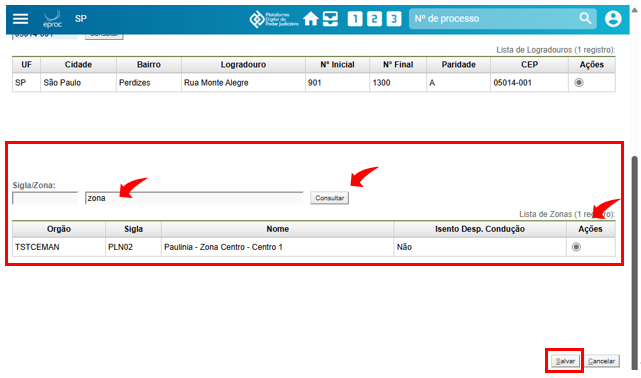

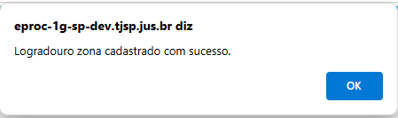

---

**DOS CADASTROS****|**Eproc para Central de Mandados

**CRÉDITOS**
<small>SGP 4 - Diretoria de Capacitação, Desenvolvimento de Talentos, Novos Projetos,</small><small>Governança em Gestão de Pessoas e Análise de Desempenhos Funcionais</small><small>Todo o material foi desenvolvido utilizando a base de homologação</small><small>gentilmente cedida pelo Tribunal de Justiça de Santa Catarina</small>
