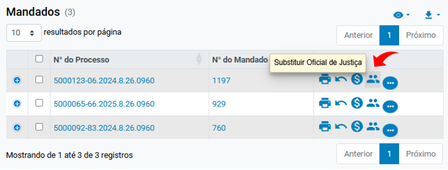
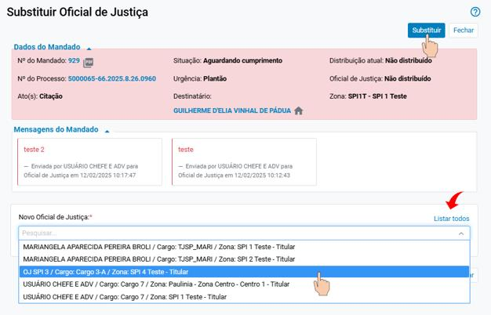
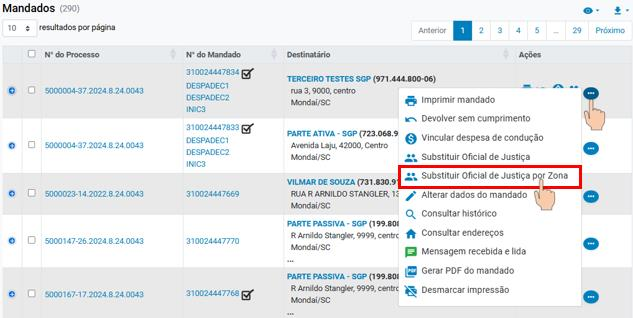
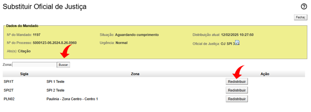

# Eproc para Central de Mandados

*Documento eProc - Material de Treinamento*

---

---

<small>Imagem decorativa de capa: linhas e luzes de sistema e logotipo do eproc. Na lateral está escrit</small><small>o: EPROC</small><small>SGP 4 - Diretoria de Capacitação, Desenvolvimento de Talentos, Novos Projetos,</small><small>Governança em Gestão de Pessoas e Análise de Desempenhos Funcionais</small>

**REDISTRIBUIÇÃO DE**

**MANDADOS**

# Eproc para Central de Mandados

Atualizado em**14/02/2025**

---

**SUMÁRIO**

**REDISTRIBUIÇÃO DE MANDADOS**

**REDISTRIBUIÇÃO DE MANDADOS**

**3**
<small>Substituir Oficial de Justiça (por direcionamento)</small><small>3</small><small>Substituir Oficial de Justiça por Zona (por sorteio)</small><small>4</small>
**CRÉDITOS**

**6**

---

**REDISTRIBUIÇÃO DE MANDADOS****|**Eproc para Central de Mandados
<small>**3**</small>
**REDISTRIBUIÇÃO DE MANDADOS**

Na Central, os mandados podem ser redistribuídos de duas formas: por direcionamento e por

sorteio em zona. Tais ações são realizadas por meio dos botões de atividade “Substituir Oficial de

Justiça” e “Substituir Oficial de Justiça por Zona”, respectivamente.

**Substituir Oficial de Justiça (por direcionamento)**

Essa substituição (redistribuição) é exclusiva da Central de Mandados, ou seja, o Oficial de Justiça

não pode realizá-la.

Nessa modalidade, o mandado é redistribuído para um novo Oficial de Justiça por direcionamento.
<small>**Descrição da imagem**: tela “Painel Gestão de Mandados” com destaque ao item “Substituir Oficial de Jusiça” na</small><small>coluna “Ações”.</small>
Ao ser selecionado, o sistema abrirá a tela “Substituir Oficial de Justiça”. O ícone “Listar todos”

exibe todos os Oficiais de Justiça cadastrados na Central. Selecionar o Oficial substituto e clicar em

“Substituir”.

---

**REDISTRIBUIÇÃO DE MANDADOS****|**Eproc para Central de Mandados
<small>**4**</small><small>**Descrição da imagem**: tela “Substituir Oficial de Justiça” com destaque ao botão “Listar todos” no campo “Novo</small><small>Oficial de Justiça” e ao botão “Substituir” no topo da página.</small>
Finalizada a redistribuição, o sistema exibirá uma mensagem de ação realizada com sucesso.

**Substituir Oficial de Justiça por Zona (por sorteio)**

Essa substituição pode ser realizada tanto pela Central quanto pelo Oficial de Justiça ao verificarem

que o endereço do mandado não pertence à zona de atuação do Oficial. Aqui, a redistribuição

acontece, por sorteio, dentre os Oficiais cadastrados para a zona do logradouro constante no

mandado.

---

**REDISTRIBUIÇÃO DE MANDADOS****|**Eproc para Central de Mandados
<small>**5**</small><small>**Descrição da imagem**: destaque para o botão de atividade “Substituir Oficial de Justiça por Zona” na tabela com</small><small>resultados de consulta por mandados.</small>
Selecionada, o sistema exibirá a tela “Substituir Oficial de Justiça”. Ao clicar em “Buscar”, as zonas

são listadas. Basta identificar a correta e clicar em “Redistribuir”.
<small>**Descrição da imagem**: tela “Substituir Oficial de Justiça” com destaque ao botão “Buscar” do campo “Zona” e ao</small><small>botão “Redistribuir” ao lado de cada zona listada.</small>
Finalizada a redistribuição, o sistema exibirá uma mensagem de ação realizada com sucesso.

---

**REDISTRIBUIÇÃO DE MANDADOS****|**Eproc para Central de Mandados

**CRÉDITOS**
<small>SGP 4 - Diretoria de Capacitação, Desenvolvimento de Talentos, Novos Projetos,</small><small>Governança em Gestão de Pessoas e Análise de Desempenhos Funcionais</small><small>Todo o material foi desenvolvido utilizando a base de homologação</small><small>gentilmente cedida pelo Tribunal de Justiça de Santa Catarina</small>
