# Autos Digitais I - Capa do processo_ lembretes_ cadastro e retificacao de assunto_ Informacoes adicionais e chave de acesso _2_

*Documento eProc - Material de Treinamento*

---

---

---

**SUMÁRIO**

**1. Capa do Processo. .. .. .. .. .. .. .. .. .. .. .. .. .. .. .. .. .. .. .. .. .. .. .. .. .. .. .. .. .. .. .. .. .. .. .. .. .. .. .. .. .. .. .. .. .. .. .. .. .. .. .. .. .. .. .. .. .. .. .. .. .. .. .. .. .. .. .. .. 3**

**2. Lembretes. .. .. .. .. .. .. .. .. .. .. .. .. .. .. .. .. .. .. .. .. .. .. .. .. .. .. .. .. .. .. .. .. .. .. .. .. .. .. .. .. .. .. .. .. .. .. .. .. .. .. .. .. .. .. .. .. .. .. .. .. .. .. .. .. .. .. .. .. .. .. .. .. .. .. .. .. 4**
<small>2. 1. Como cadastrar um lembrete na capa dos autos: .. .. .. .. .. .. .. .. .. .. .. .. .. .. .. .. .. .. .. .. .. .. .. .. .. .. .. .. .. .. .. .. .. 4</small><small>2. 2. Exibição do lembrete na capa dos autos: .. .. .. .. .. .. .. .. .. .. .. .. .. .. .. .. .. .. .. .. .. .. .. .. .. .. .. .. .. .. .. .. .. .. .. .. .. .. .. .. .. .. .7</small><small>2. 3. Como saber se há lembrete no processo sem acessar a íntegra dos autos? .. .. 8</small>
**3. Cadastro e Retificação de Assunto no processo. .. .. .. .. .. .. .. .. .. .. .. .. .. .. .. .. .. .. .. .. .. .. .. .. .. .. .. .. .. .. .. .. .. .. .. . 9**

**4. Informações Adicionais. .. .. .. .. .. .. .. .. .. .. .. .. .. .. .. .. .. .. .. .. .. .. .. .. .. .. .. .. .. .. .. .. .. .. .. .. .. .. .. .. .. .. .. .. .. .. .. .. .. .. .. .. .. .. .. .. .. .. .. .. .. 10**
<small>4. 1. Chave de Acesso. .. .. .. .. .. .. .. .. .. .. .. .. .. .. .. .. .. .. .. .. .. .. .. .. .. .. .. .. .. .. .. .. .. .. .. .. .. .. .. .. .. .. .. .. .. .. .. .. .. .. .. .. .. .. .. .. .. .. .. .. .. .. .. .. .. .. .. .. .. .. .. 11</small>
**5. Editar Informações Adicionais. .. .. .. .. .. .. .. .. .. .. .. .. .. .. .. .. .. .. .. .. .. .. .. .. .. .. .. .. .. .. .. .. .. .. .. .. .. .. .. .. .. .. .. .. .. .. .. .. .. .. .. .. .. .14**
<small>5. 1. Editar Informações Adicionais através da funcionalidade de Retificar</small><small>Autuação. .. .. .. .. .. .. .. .. .. .. .. .. .. .. .. .. .. .. .. .. .. .. .. .. .. .. .. .. .. .. .. .. .. .. .. .. .. .. .. .. .. .. .. .. .. .. .. .. .. .. .. .. .. .. .. .. .. .. .. .. .. .. .. .. .. .. .. .. .. .. .. .. .. .. .. .. .. .. .. .. .. .. .. 18</small>

---

**AUTOS DIGITAIS**

Os autos digitais funcionais, possibilitam a realização direta de diversas

atividades rotineiras sem a necessidade de tramitação dos processos entre

diferentes tarefas.

Dessa forma, é possível, através da capa dos autos, realizar ações como

intimar,

movimentar

processo,

nomear

peritos,

redistribuir,

retificar

autuação, realizar remessa ao TJMG, entre outras.

**1.****​****Capa do Processo**

A capa dos autos digitais contém informações do processo, sendo elas: a

**classe da ação**, o**nº do processo**, a**competência**, a**data de autuação**, a

**situação**, o**órgão julgador**, o(a)**Juiz(a)**, os**localizadores**e, caso haja, os

**processos relacionados**.

**Observação:**Os localizadores são visíveis apenas para os usuários internos.
<small>(Capa dos autos acessada pela tela Consulta Processual - Detalhes do Processo)</small>
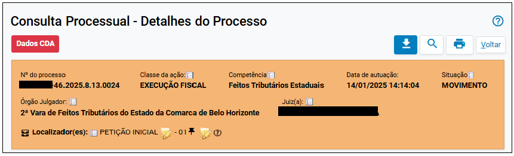

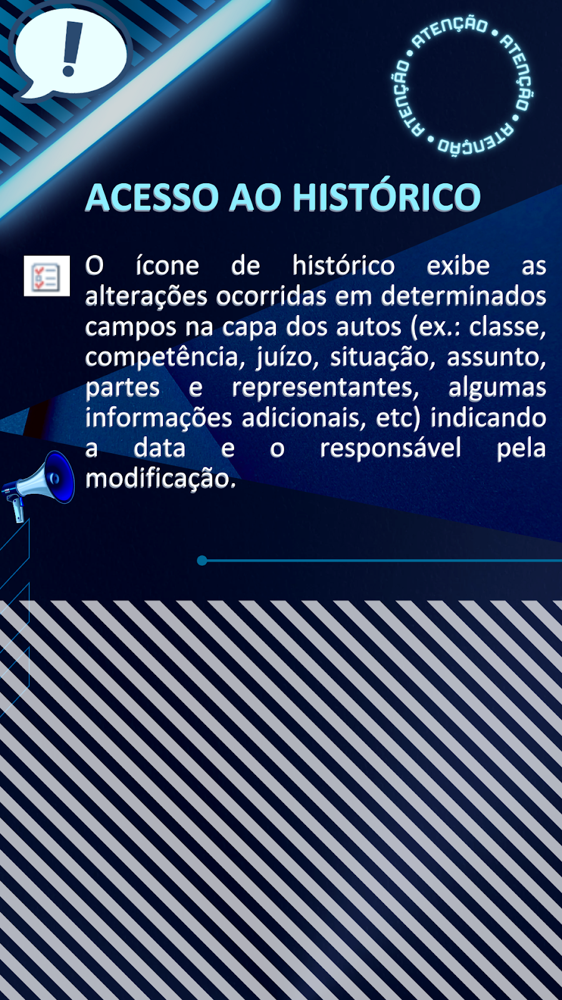

---

**2. Lembretes**

O campo lembrete permite a inserção de conteúdos que podem facilitar a

comunicação entre os usuários que atuarão naquele processo. Podem ser

utilizados também para destacar informações importantes e facilitar o

acompanhamento de atividades, funcionando de maneira semelhante ao

post-it.

Os lembretes cadastrados podem ser direcionados aos usuários internos,

externos ou usuários externos (procuradores do processo). Sendo que, a

visibilidade do conteúdo do lembrete na capa dos autos é restrita ao tipo

de usuário para o qual foi selecionada.

**Observação:**Os usuários das procuradorias que utilizam sistemas próprios

integrados ao eproc via MNI, como a Advocacia Geral do Estado, não

visualizam os lembretes direcionados a eles, por ora, devido a limitações

sistêmicas.

**2. 1. Como cadastrar um lembrete na capa dos autos:**

Para cadastrar um lembrete o usuário deverá:

1. ​ Na seção “**Lembretes**”, localizada na capa dos autos, clicar em “**Novo**”:
<small>(Capa do processo - seção “Lembretes”)</small>
2. ​ Na tela**Cadastro de Lembretes**, preencher:

a. ​ Descrição, limitada a 3000 caracteres.

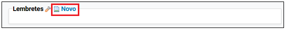

---

<small>(Tela Cadastro de Lembretes - Capa dos autos)</small>
b. ​ Selecionar o tipo de usuário destinatário do lembrete. Para

usuários internos, indicar o órgão de destino e, de forma

opcional, o usuário de destino.

c. ​ Para usuários externos, inserir nome ou login.

d. ​ Para usuários externos (procuradores do processo) selecionar

o(a) procurador(a).

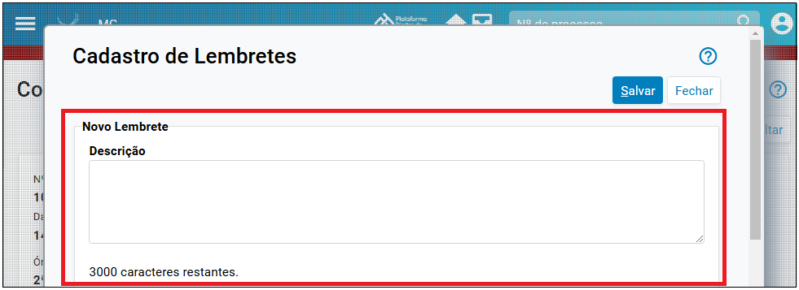

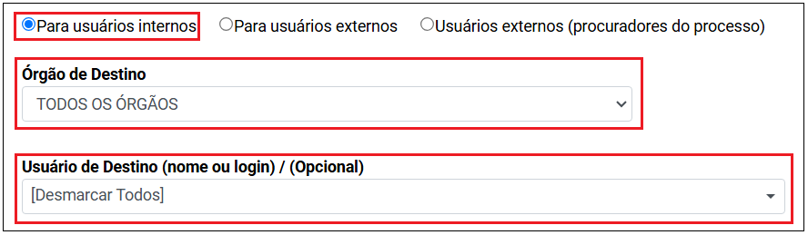

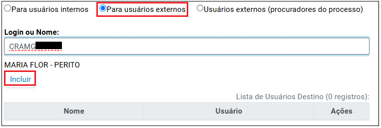

---

e. ​ Marcar o checkbox correspondente para exibir o lembrete na

movimentação do processo (disponível apenas para usuários

internos).

f. ​ Informar o período de validade (opcional).

g. ​ Escolher entre uma das 5 (cinco) cores disponíveis.

h. ​ Para mostrar os lembretes desativados e vencidos, basta marcar

a opção.

**Observações:**

a)​ É possível reativar um lembrete desativado ou vencido. Para tanto,

deverá clicar no ícone localizado em ações. Após a reativação, o(a)

usuário(a) poderá editar o lembrete (

) ou desativá-lo ( ).

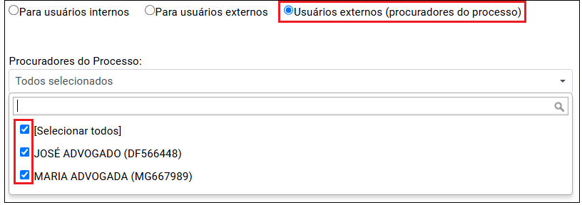

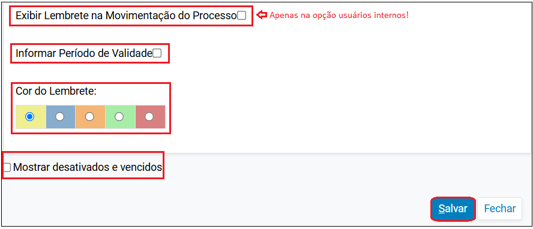

---

b)​ Os lembretes destinados aos usuários externos, só ficarão disponíveis

na capa dos autos para o seu destinatário. Para visualizar estes

lembretes, os usuários internos deverão acessar a tela de cadastro de

lembretes.

c)​ As procuradorias que utilizam sistemas próprios, como exemplo a AGE,

não visualizam lembretes inseridos e destinados a elas, devido a

limitação sistêmica.

**2. 2. Exibição do lembrete na capa dos autos:**

O lembrete interno constará qual a Unidade Judiciária de lotação de seu

criador, o registro do login do usuário responsável por sua inclusão ou

alteração no sistema com data e horário da ativação.

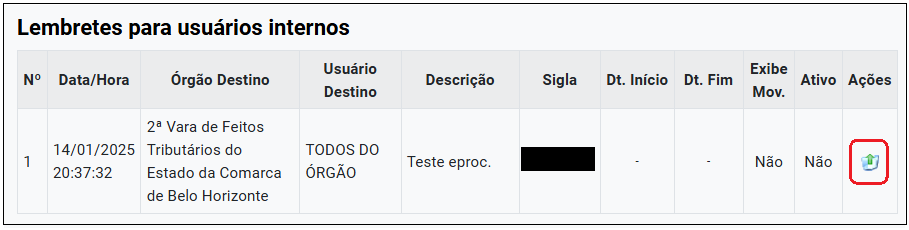

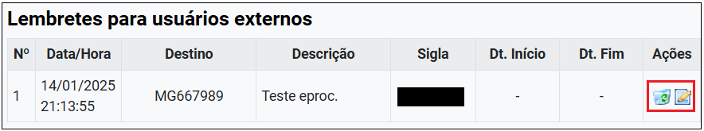

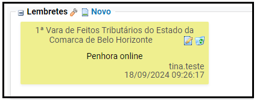

---

Alguns lembretes são criados de forma automática pelo sistema, chamando

atenção para determinadas situações, como por exemplo quando há erro

na execução de alguma regra de automatização.

**2. 3. Como saber se há lembrete no processo sem acessar a íntegra dos**

**autos?**
<small>O ícone (</small>
) representa a existência de um lembrete naquele determinado

processo, sendo que, para verificar seu conteúdo, não há necessidade de

abrir os autos, bastando posicionar o cursor do mouse por cima do ícone.

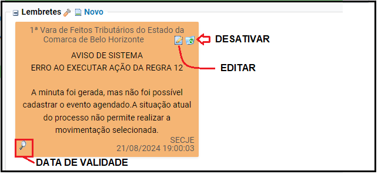

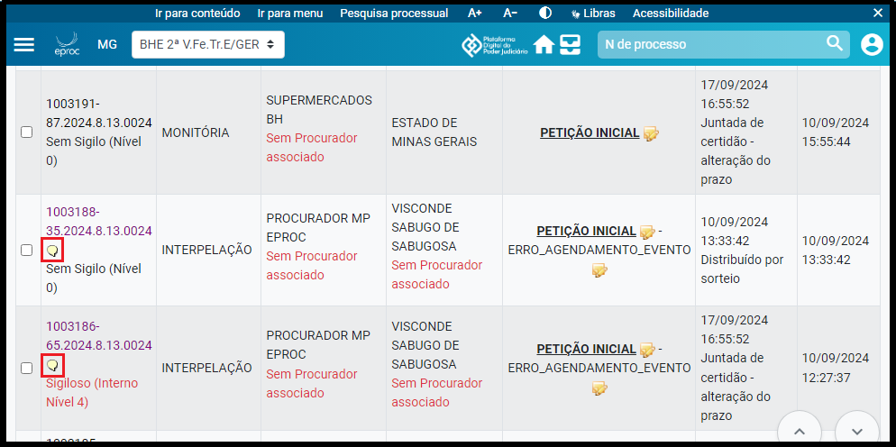

---

**3. Cadastro e Retificação de Assunto no processo**

Os assuntos estão disponíveis para escolha no momento da distribuição do

processo, sendo obrigatório seu cadastramento.

Caso haja necessidade de alteração do assunto cadastrado pelo(a)

advogado(a) ou inclusão de um novo assunto, basta clicar em (

),

localizado ao lado de “**Assuntos**”,na capa dos autos digitais.

Para excluir o assunto cadastrado, clicar no**[x]**à esquerda do assunto.

Exemplo:

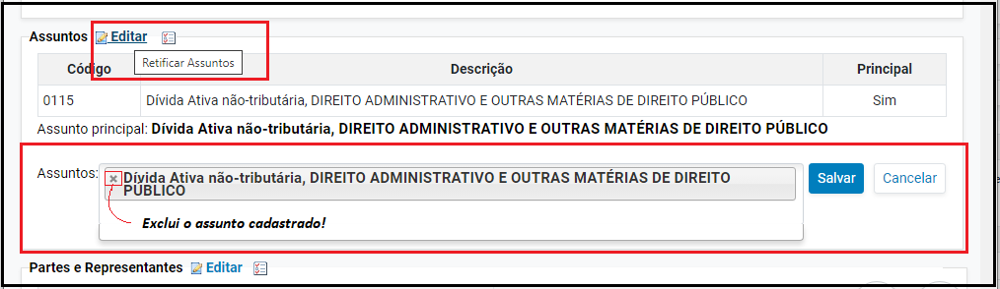

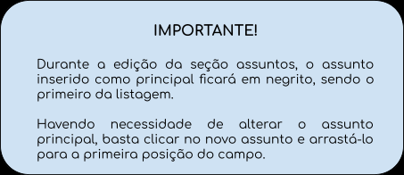

---

Após a inclusão ou retificação dos assuntos, clicar em**“Salvar”**para concluir

a ação.

**4. Informações Adicionais**

As “**Informações adicionais**” são dados complementares informados no

processo, sendo que, algumas delas, ao serem selecionadas, são destacadas

em vermelho na capa dos autos.

No momento do cadastro da inicial, algumas informações adicionais ficam

disponíveis para a seleção pelo(a) advogado(a), como exemplo: requerimento

de antecipação de tutela, parte criança e adolescente, parte com doença

grave, opção por juízo 100% digital, pessoa com deficiência, pessoa

enquadrada na Lei 14. 289, processo com segredo de justiça, entre outras.

O campo “Informações Adicionais” permite a visualização de forma breve e

prática de características do processo e das partes, como: requerimento de

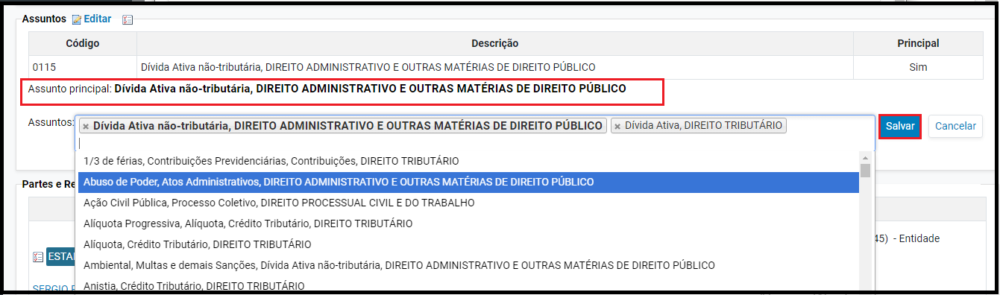

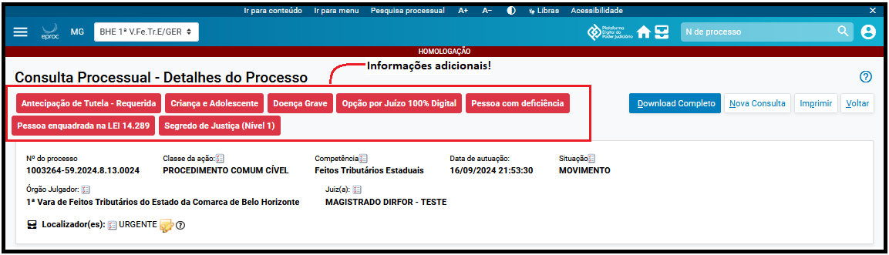

---

justiça gratuita, a chave do processo, grande devedor, nível de sigilo do

processo, idoso, penhora no rosto dos autos, petição urgente, valor da

causa, entre outros.

Desta forma, as informações que consistem em requerimentos realizados no

peticionamento inicial, devem ser analisadas e, se for o caso, retificadas,

logo que houver decisão a respeito do requerimento.

**Exemplo:**Caso haja o indeferimento do pedido de justiça gratuita e tal

informação não seja alterada no campo localizado em informações

adicionais, o sistema não permite a emissão de guia para pagamento das

custas.

**4. 1. Chave de Acesso**

A chave de acesso é um código gerado pelo sistema eproc que permite

visibilidade de documento ou do processo a usuário externo, sem cadastro

no sistema. Ainda, por meio da chave de acesso é possível verificar o

conteúdo de processos ou documentos gravados com algum nível de sigilo.

**a)****​****Chave do processo**

No momento em que um novo processo é distribuído, o sistema gera de

forma automática a chave de acesso dos autos que constará no

comprovante de protocolo da inicial.

Esta chave do processo é um código através do qual, juntamente com o

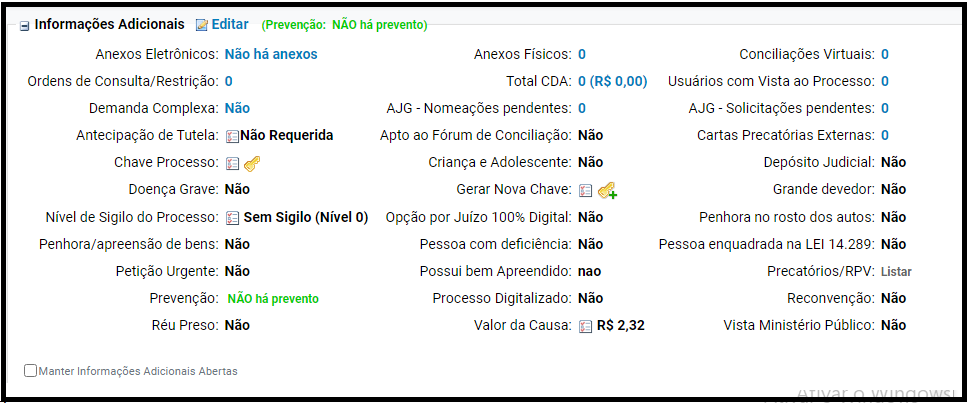

---

número do processo, será possível realizar uma consulta pública onde se

visualiza a íntegra do processo.

O usuário(a) interno poderá verificar qual a chave de acesso do processo

por meio do campo**“Informações adicionais”.**

Se a consulta processual for realizada sem a chave, serão exibidas apenas

as peças públicas do processo. Caso a consulta seja realizada inserindo o

número do processo e a chave, o processo será exibido em sua íntegra. O

sistema também permite definir uma data final de validade para a chave de

acesso.

O botão “**Gerar Nova Chave**”, dentro da seção “Informações Adicionais”, será

utilizado para trocar esse código, caso a chave original (ou anterior) tenha

vazado indevidamente, disponibilizando informações não autorizadas.

Então, ao clicar em “**Gerar Nova Chave**”, a chave é trocada e divulgada

apenas a quem tenha este direito.

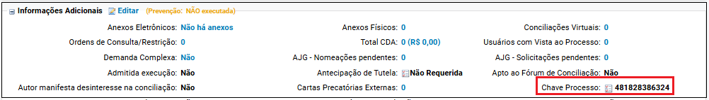

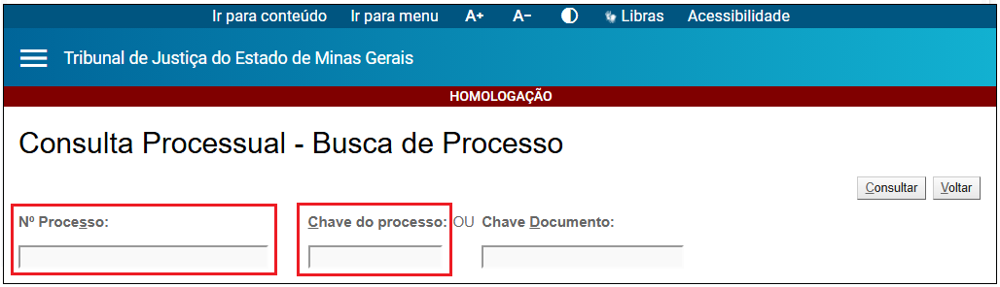

---

(

) Ícone que representa a opção**“Gerar chave”**.

( ) Ícone que representa a opção**“Gerar nova chave”**.

(

) Ícone que representa o histórico de consulta.

Na opção “**Gerar chave**”,o histórico de consultas registra o nome do usuário

e a data do acesso.

Por sua vez, na opção “**Gerar nova chave**”o histórico de consultas registra

todas as chaves já geradas, a data da inclusão e o usuário responsável.

**b)****​****Chave do documento**

Para gerar chave de acesso de determinado documento, o(a) usuário deverá:

1. ​ Acessar o “Menu” textual e pesquisar pela funcionalidade “**Gerar Chave**

**de Documentos**”.

2. ​ O sistema retornará a página**“Consulta Processual”**.

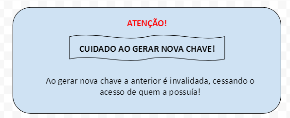

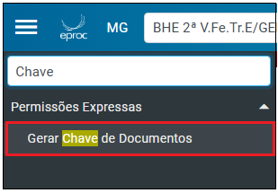

---

3. ​ Após a consulta, será retornada a tela da funcionalidade “**Gerar Chave**

**de Acesso a Documentos**”,na qual será possível a seleção de um ou

mais documentos que serão acessados por meio da chave gerada,

bem como informar a data de validade da chave e selecionar se, além

do acesso, será permitido ou não o envio de resposta ao documento.

4. ​ Por fim, clicar no botão “**Gerar chave de acesso aos documentos**”.

**Observação:**Os documentos gravados com algum grau de sigilo são

destacados na cor vermelha.

**5. Editar Informações Adicionais**

Nos casos em que for necessário a incluir ou retificar uma informação

adicional,

basta clicar em**[Editar]**na seção**“Informações Adicionais”**

localizada na capa dos autos**.**

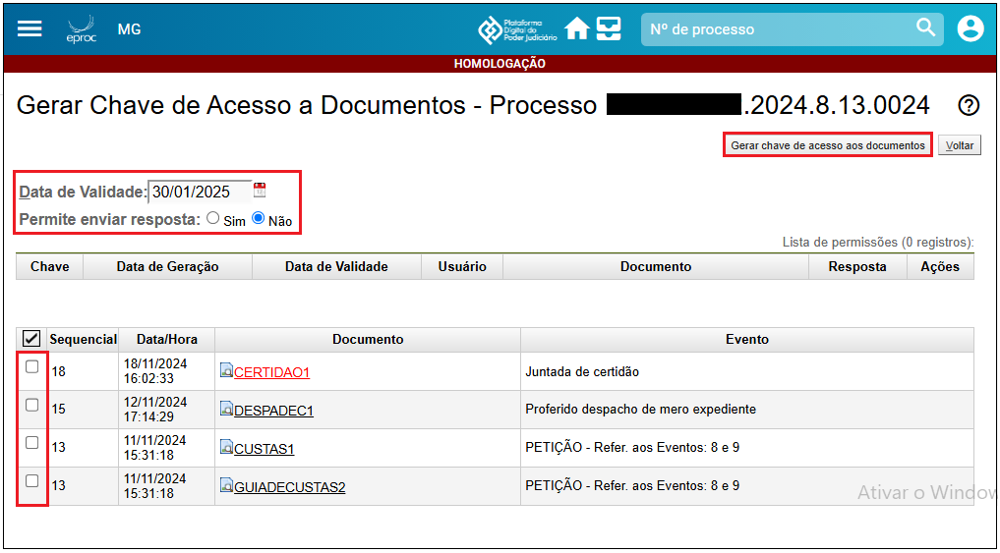

---

O sistema abrirá uma nova tela, com campos para alteração das

informações.

➔​ O(a) usuário(a) deverá escolher o campo a ser alterado, e selecionar o

novo “status” da informação que será retificada.

➔​ Após a realização das alterações necessárias, deverá clicar em

“Salvar”.

➔​ O sistema exibirá uma mensagem de confirmação e o(a) usuário(a)

deverá clicar em**“OK”.**

A informação será alterada no processo.

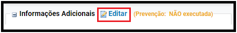

---

Além das informações adicionais já constantes na capa dos autos, é

possível incluir outros dados, através da opção**“Incluir novo dado**

**complementar”.**

Uma nova página será retornada, permitindo a inclusão de novos dados

complementares

(ex:

Prioridade

Atendimento,

Idoso,

RPV/Precatório,

Adolescente Internado, Óbito da parte, Justiça Inclusiva, entre outros):

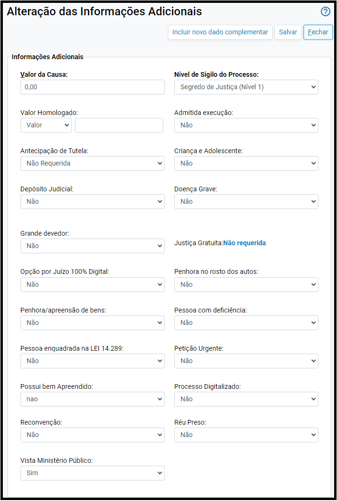

---

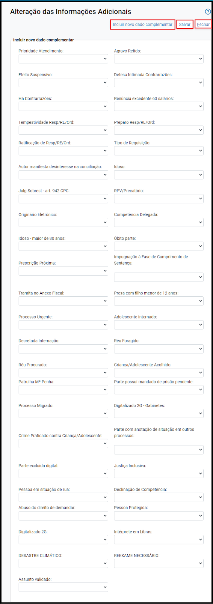

---

**5. 1. Editar Informações Adicionais através da funcionalidade de**

**Retificar Autuação**

Além da possibilidade de editar as informações adicionais, conforme

demonstrado,

o(a)

usuário(a)

poderá

realizar

algumas

alterações

necessárias por meio da “Retificação de Autuação”, conforme orientações

disponíveis no manual “Ações XII - Retificar Autuação”.

