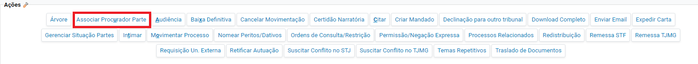
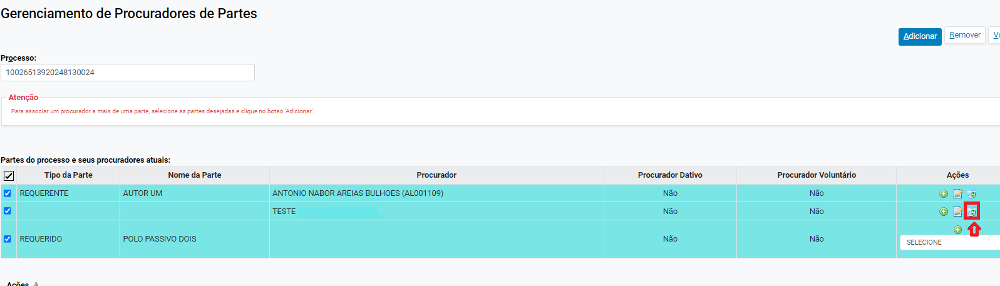
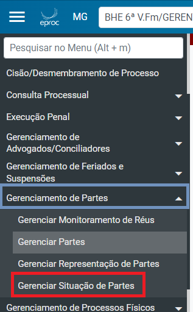

# Autos Digitais II - Cadastro e Edicao de Partes_ Procuradores e Representantes _1_

*Documento eProc - Material de Treinamento*

---

---

---

**SUMÁRIO**

**GERENCIAMENTO DE PARTES. .. .. .. .. .. .. .. .. .. .. .. .. .. .. .. .. .. .. .. .. .. .. .. .. .. .. .. .. .. .. .. .. .. .. .. .. .. .. .. .. .. .. .. .. .. .. .. .. .. .. .. .. .. .. .. .. .. .3**
<small>**Como Incluir Nova Parte. .. .. .. .. .. .. .. .. .. .. .. .. .. .. .. .. .. .. .. .. .. .. .. .. .. .. .. .. .. .. .. .. .. .. .. .. .. .. .. .. .. .. .. .. .. .. .. .. .. .. .. .. .. .. .. .. .. .. .. .. 9**</small><small>**Cadastro de Representante da Parte. .. .. .. .. .. .. .. .. .. .. .. .. .. .. .. .. .. .. .. .. .. .. .. .. .. .. .. .. .. .. .. .. .. .. .. .. .. .. .. .. .. .. .. .. .. .13**</small><small>**Associar Procurador à Parte. .. .. .. .. .. .. .. .. .. .. .. .. .. .. .. .. .. .. .. .. .. .. .. .. .. .. .. .. .. .. .. .. .. .. .. .. .. .. .. .. .. .. .. .. .. .. .. .. .. .. .. .. .. .. .15**</small><small>Remover Procurador. .. .. .. .. .. .. .. .. .. .. .. .. .. .. .. .. .. .. .. .. .. .. .. .. .. .. .. .. .. .. .. .. .. .. .. .. .. .. .. .. .. .. .. .. .. .. .. .. .. .. .. .. .. .. .. .. .. .. .. .. .. .. .. .. .. .. .19</small>
**GERENCIAR SITUAÇÃO DA PARTE. .. .. .. .. .. .. .. .. .. .. .. .. .. .. .. .. .. .. .. .. .. .. .. .. .. .. .. .. .. .. .. .. .. .. .. .. .. .. .. .. .. .. .. .. .. .. .. .. .. .. .. .. .. 21**

**ASSISTÊNCIA JUDICIÁRIA GRATUITA. .. .. .. .. .. .. .. .. .. .. .. .. .. .. .. .. .. .. .. .. .. .. .. .. .. .. .. .. .. .. .. .. .. .. .. .. .. .. .. .. .. .. .. .. .. .. .. .. .. . 23**

---

**GERENCIAMENTO DE PARTES**

O sistema eproc utiliza o banco de dados da Secretaria da Receita Federal

do Brasil para cadastramento das partes, mediante a informação dos

registros do CPF ou do CNPJ.

As partes são cadastradas no processo eletrônico no momento da

distribuição inicial nos polos ativo e passivo. Podem ser cadastradas no

sistema: pessoas físicas, jurídicas, autoridades coatoras ou entidades.

No polo ativo e no polo passivo deve existir, ao menos, uma parte

cadastrada. Há casos, no entanto, nos quais a presença do polo passivo é

dispensável em razão da natureza da classe processual.

Algumas classes judiciais exigem o cadastramento do tipo de pessoa

“Entidade” ou “Autoridade Coatora” no polo passivo, como, por exemplo, na

classe Mandado de Segurança. Nesse caso, o usuário deverá selecionar

alguma das opções pré-cadastradas para tal tipo de pessoa. Caso ainda

não exista a entidade/autoridade coatora pretendida, deverá ser aberto

chamado

para

o

suporte

eproc,

através

do

endereço:

http: //informatica. intra. tjmg. gov. br/ess. do

A exclusão de parte já cadastrada somente poderá acontecer caso exista

mais de uma pessoa cadastrada no mesmo polo, exceto no polo passivo,

quando for dispensável a presença em razão da natureza da classe

processual. Se necessário excluir uma parte, primeiramente deverá incluir a

nova parte e, somente após a parte cadastrada, excluir/inativar a outra

parte.

O cadastro e alteração das partes nos autos, se dará conforme as

orientações a seguir:

1. ​ Dentro dos autos, na sessão “**Partes e Representantes**”, clicar em

“**Editar**”; ou

---

2. ​ No “**Menu**” textual, buscar pela opção “**Gerenciar Partes**”.

**Você Sabia?**

Assim como em outros campos do processo, na sessão**Partes e**

**Representantes**, há o ícone de**Histórico de Retificação das**

**Parte**,que permite a consulta ao histórico de alterações do

campo. Todas as vezes que este ícone estiver ao lado de um

campo ou informação, haverá um histórico de todos os

registros ali realizados.

---

Além das informações de cada parte, ao passar o mouse sobre

o ícone (

), é possível conferir o usuário responsável pela

alteração, bem como a data e o horário que a retificação foi

realizada.

3. ​ O sistema abrirá a tela “**Gerenciamento de Partes**”, que exibirá botões

que permitem determinadas ações, conforme à seguir:

➔​**Salvar**: Permite que sejam salvas as informações inseridas nesta

aba.

➔​**Associar Procurador**: Permite a inclusão de procurador para as

partes, tema que é tratado detalhadamente no tópico “Associar

Procurador a Parte” deste manual.

---

➔​**Permissão Expressa**: É uma autorização concedida a um usuário

para acessar processo com sigilo superior a 2. As informações

estão detalhadas no Manual “Sigilo e Permissões Expressas”.

➔​**Representação de Partes**: Permite a inclusão de procurador para

as partes, tema que é tratado no tópico “Cadastro de

Representante da Parte” deste manual.

➔​**Incluir Nova Parte**: Permite a inclusão de nova parte ao processo,

tema que é tratado no tópico “Inclusão de Nova Parte” deste

manual.

➔​**Importar Partes do Processo**: Permite incluir partes cadastradas

em outros processos. Caso haja processo conhecido que possua

parte(s) que podem ser aproveitadas como parte em outro

processo, poderá ser realizada a inclusão por meio deste ícone.

O tema é tratado no tópico “Importar Partes do Processo”, deste

manual.

➔​**Imprimir**: Permite a impressão da tela “**Gerenciamento de Partes**”.

➔​**Fechar**: Para fechar a tela “**Gerenciamento de Partes**”.

4. ​ Abaixo dos botões que permitem as ações mencionadas, são exibidas

as partes cadastradas e opções para alteração imediata do tipo de

parte, situação da parte no processo, informações sobre o pedido de

justiça gratuita, e demais alterações na coluna ”**Ações**”.

---

➔​**Tipo de Parte**: O sistema apresenta uma lista de opções que poderão

ser alteradas de acordo com a participação daquela parte no

processo.

➔​**Situação**: Havendo alteração na atuação da parte no processo,

poderá realizar a adequação nesta aba.

**OBSERVAÇÃO!**Se uma parte for excluída por meio do ícone “**Excluir Parte**

**do Processo”**( ), automaticamente na coluna “**Ações**” a situação será

alterada para “**EXCLUÍDA”**. Havendo necessidade de reativá-la, será

necessário selecionar outra situação e “**salvar**”.

➔​**Justiça**

**Gratuita**:

Campo

para

controle

do

pedido

e

deferimento/indeferimento da Justiça Gratuita.

**ATENÇÃO!**

Sempre

que

houver

decisão

sobre

o

deferimento

ou

indeferimento da justiça gratuita, o usuário deverá realizar a atualização

nesta aba. Caso a gratuidade seja indeferida e não haja a devida

sinalização neste campo, o advogado não conseguirá emitir a guia para o

pagamento

das

custas. Para mais informações, consulte o tópico

“Assistência Judiciária Gratuita” deste Manual.

➔​**Ações**: São formas de realizar edições no cadastro das partes. Nesta

coluna serão exibidos alguns ícones:

---

**Ícone Descrição**

**Observações**

Retirar

Parte

como

sendo principal

Para retirar a marcação de uma parte

como principal, é necessário que haja uma

outra parte definida como principal no

respectivo polo.

Tornar

Parte

como

principal

Permite que seja inserida mais de uma

parte como principal.

Marcar

parte

como

excluída digital

Permite a indicação de pessoa excluída

digital.

Excluir

Parte

do

processo

Não é permitido um processo sem parte

principal. Para excluir uma parte principal,

é

necessário

que

tenha

outra

parte

principal cadastrada.

Consultar

Parte

do

processo

A tela exibirá além dos dados, ícones que

permitem

alterar

os

dados,

atualizar

informações e imprimir os endereços.

Histórico da Parte

A tela exibirá, além do histórico daquele

cadastro, ícones que permitem alterar os

dados, atualizar informações e imprimir os

endereços.

Alterar

Parte

do

Processo

Funcionalidade que permite a edição dos

dados

como

alteração

de

endereço,

inclusão de informação de documentos e

demais dados referentes a pessoa.

Adicionar Procurador

Além da ação “**Associar Procurador Parte”**

a

inclusão

de

advogados

pode

ser

realizada por este ícone

Permitir

acesso

ao

processo

Permite

buscar

um

usuário

individualmente ou então pesquisar por

um grupo. As permissões serão efetivadas

somente ao clicar no botão “**Salvar”**.

**OBSERVAÇÃO**: Assim como várias funcionalidades do sistema eproc,

algumas alterações no cadastro de partes podem ser realizadas por

caminhos diferentes. Além da opção de“**Alterar Parte do Processo**” na ação

na tela de “**Gerenciamento de Partes**”, a edição dos dados pode ser

realizada clicando diretamente no nome da parte e, depois, em “**Alterar**

**Dados Pessoais**”.

---

**Como Incluir Nova Parte**

Para realizar a inclusão de nova parte, na tela de”**Gerenciamento de Partes”**,

clicar no ícone “**Incluir Nova Parte”:**

---

Em “**Tipo Pessoa”**escolher uma das opções de acordo com a parte a ser

cadastrada:

A depender do tipo de pessoa selecionada, o sistema apresentará diferentes

opções para cadastramento da parte. Vejamos:

➔​**Pessoa Física / Pessoa Jurídica:**o cadastro deve se dar sempre pelo

CPF (pessoa física) ou CNPJ (pessoa jurídica) e somente na

impossibilidade de obtenção do número do documento, selecionar a

opção**Pessoa Física sem CPF**.

É possível realizar a busca também pelo nome (pessoa física) e pela pela

razão social (pessoa jurídica). Ao clicar em “**Consultar”,**o sistema exibirá a

pessoa para seleção.

---

<small>(Pessoa Física)</small><small>(Pessoa Jurídica)</small>
O sistema buscará os dados na base de dados da Receita Federal. Portanto,

se verificada eventual divergência no nome, deverá abrir um chamado

através do endereço http: //informatica. intra. tjmg. gov. br/ess. do, juntando o

Comprovante da Situação Cadastral atualizado, para que seja realizada

adequação no cadastro.

➔​**Entidade / Autoridade Coatora / Juízo**: O sistema listará um rol de

entidades previamente inseridas no eproc. Deve selecionar alguma

das

opções

pré-cadastradas

e,

caso

ainda

não

exista

a

entidade/autoridade/juízo

pretendido,

deve

abrir

um

chamado

através do endereço: http: //informatica. intra. tjmg. gov. br/ess. do.

Após localizar a parte a ser cadastrada, ela será exibida ao final da página

de Gerenciamento de Partes – Cadastro de Partes. Nesse momento, deve-se

selecionar a caixa correspondente à parte a ser inserida, escolher o “**Tipo**

**Parte**”, indicar se houve requerimento, não requerimento, deferimento ou

---

indeferimento da**Justiça Gratuita**e, por fim, concluir a inclusão através do

ícone "**Incluir**". Vejamos:

O sistema exibirá a mensagem abaixo. Clicar em “**OK**”.

**OBSERVAÇÃO 1:**O Ministério Público quando for atuar como amicus curiae,

a alteração poderá ocorrer na edição das “**Informações Adicionais”.**

No campo**“Vista ao Ministério Público”**alterar para**“Sim”:**

Após, clicar em “**Salvar**”.

**OBSERVAÇÃO 2:**Conforme detalhado no tópico “Gerenciamento de Partes”, é

possível incluir partes cadastradas em outro processo em trâmite no eproc,

por meio do ícone “**Importar Partes do Processo**”.

---

**Cadastro de Representante da Parte**

Representantes de parte, como o inventariante em casos de espólio, e o

tutor, curador ou guardião em casos de incapaz, por exemplo, são

cadastrados na tela de “**Gerenciamento de Representantes de Partes**”.

O acesso ao “**Gerenciamento de Representante de Partes”**poderá ser

realizado tanto pelo “**Menu Textual”**quanto pela funcionalidade de “**Edição**

**de Partes**”, através do botão “**Representação de Partes”.**A única diferença é

que fazendo pelo**“Menu Textual”,**será necessário pesquisar pelo processo

primeiramente.
<small>(1. Clicar em “Editar” e, na tela “Gerenciamento de Partes”, clicar em “Representação de</small><small>Partes”)</small><small>(2. No “Menu Textual”, selecionar a opção “Gerenciar Representação de Partes”)</small>
A parte a ser representada e o representante precisam já estar cadastrados

nos autos. Portanto, para inclusão de um novo representante que não figura

---

nos autos, é necessário primeiramente realizar o seu cadastramento,

conforme demonstrado no item anterior ”Inclusão de Nova Parte”.

Uma vez já inserido o representante e o representado no processo, na tela

de “**Gerenciamento de Representante”**deverá:

1. ​ Selecionar a “**Parte”**a ser representada:

2. ​ Selecionar a**Qualificação da Parte**:

3. ​ Selecionar quem será o**Representante/Interveniente**

4. ​ Selecionar a**Qualificação do Representante/Interveniente**

**OBSERVAÇÃO:**As opções para seleção dependerão do tipo de qualificação

selecionado no campo “**Qualificação da Parte”.**

5. ​ Selecionar “Sim” ou “Não” em relação ao representante no campo “‘**Atua**

**também como parte**? ”

---

6. ​ Clicar em**Salvar Representação**

Abaixo, serão apresentadas as informações sobre a representação

cadastrada, de acordo com os campos selecionados.

**Associar Procurador à Parte**

A vinculação de advogado à determinada parte poderá ser realizada

diretamente pela ação específica “**Associar Procurador Parte”**, como também

pelo “**Menu Textual**”, através da opção “**Gerenciar Procurador Parte”**. A

associação poderá ser realizada, ainda, pela tela de “**Gerenciamento Partes**”,

clicando em**“Associar Procurador”.**
<small>(1. Ação “Associar Procurador Parte”)</small>

---

<small>(2. No “Menu Textual”, selecionar a opção “Gerenciar Procurador Parte)</small><small>(3. Clicar em “Editar” e, em “Gerenciamento de Partes”, clicar na opção “Associar Procurador”)</small>
Todos os caminhos abrirão a tela “**Gerenciamento de Procuradores de**

**Partes”**. A única diferença é que fazendo pelo**“Menu Textual”,**será necessário

pesquisar pelo processo primeiramente. Nas demais opções, o sistema

abrirá direto a tela de gerenciamento do procurador.

Em “**Gerenciamento de Procuradores de Partes”,**é possível realizar a

inclusão de advogado individualmente para cada parte ou também de

forma massiva.

Para associar um procurador a mais de uma parte, o usuário deverá

selecionar as partes desejadas e clicar no botão “**Adicionar”:**

---

Para incluir advogado individualmente para cada parte, basta clicar no

ícone em “**Adicionar Procurador**” ( ).

Na tela de “**Gerenciamento de Procuradores de Parte”,**é possível também

associar Sociedade de Advogados, Escritório de Prática Jurídica ou

Entidade.

Quando a vinculação for para advogado ou Sociedade de Advogados, o

usuário deverá realizar a busca pelo número da OAB ou pelo nome. Se for

Entidade ou Escritório de Prática Jurídica, a busca será apenas pelo nome.

Após digitar, aguardar o sistema carregar.

---

Caso se trate de advogado dativo ou voluntário, marcar o respectivo ícone

Caso o advogado esteja vinculado a uma sociedade de advogados, será

possível realizar a sua vinculação:

Após, clicar em “**Incluir**”.

.

O procurador selecionado será exibido em “Procuradores pendentes de

associação”. Após a conformação, clicar em**“Confirmar Associação”.**

---

**Remover Procurador**

A remoção de procurador vinculado à parte é realizada na tela de

“**Gerenciamento de Procuradores de Partes”**. Se a desvinculação for

individual, clicar em “**Remover Procurador**” (

):

Se for excluir procurador de forma massiva, basta selecionar as caixas de

seleção correspondentes e clicar em**“Remover”:**

---

**ATENÇÃO!**Se no momento da alteração das partes/procuradores houver

minuta pendente com evento de intimação agendado, esse agendamento

será excluído, sendo necessária a movimentação após a sua assinatura.

Após concluir a alteração da parte, o sistema exibirá a mensagem:

Para vinculação de procuradoria, consultar os Manuais “Procuradoria I” e

Procuradoria II”.

---

**GERENCIAR SITUAÇÃO DA PARTE**

Além

de

realizar

a

alteração

da

situação

diretamente

na

tela

“**Gerenciamento de Parte”**no processo, há a ação “**Gerenciar Situação**

**Partes”**e também a opção “Gerenciar Situação de Partes” disponível no

“**Menu Textual”**:
<small>(1. Ação “Gerenciar Situação Partes”)</small><small>(2. Clicar em “Menu Textual” e selecionar a opção “Gerenciar Situação de Partes”)</small>
Ambos abrirão a tela “**Gerenciamento da Situação das Partes”,**sendoque

acessando pelo**“Menu Textual”,**será necessário pesquisar pelo processo

primeiramente. Ao acessar pela ação “**Gerenciar Situação Parte**”, o sistema

abrirá direto a tela abaixo, onde será possível alterar a situação de acordo

com o caso concreto:

---

Havendo alteração na atuação da parte no processo, o usuário poderá

realizar a adequação nesta funcionalidade, como exclusão da parte, por

exemplo.

**OBSERVAÇÃO**! Se uma parte for excluída por meio do ícone”**Excluir Parte**

**do Processo”**, automaticamente na coluna “**Ações”**a situação será alterada

para “**EXCLUÍDA”**. Havendo necessidade de reativá-la, será necessário

selecionar outra situação e**“salvar”.**

---

**ASSISTÊNCIA JUDICIÁRIA GRATUITA**

Ao realizar a distribuição de uma ação, no cadastramento das partes, o

peticionante selecionará no campo”**Justiça Gratuita**”, a opção “**Requerida”**

ou “**Não requerida”**. Realizada a análise pelo Magistrado, deverá ser alterada

a situação da parte por meio do “**Gerenciamento de Partes”**.

Para abrir a tela, clicar em “**Editar”**em “**Partes e Representantes”**:

Na coluna de “Justiça Gratuita”, selecionar a opção correspondente à

decisão do Magistrado, se:

​Deferida

​Indeferida

​Não Requerida

​Parcialmente deferida

​Requerida em Recurso

​Revogada

Após marcação correta, clicar em “**Salvar”**:

A alteração é imprescindível, pois quando o pedido de justiça gratuita for

indeferido, será necessário gerar a guia de custas e o boleto para realização

do pagamento devido pela parte.

