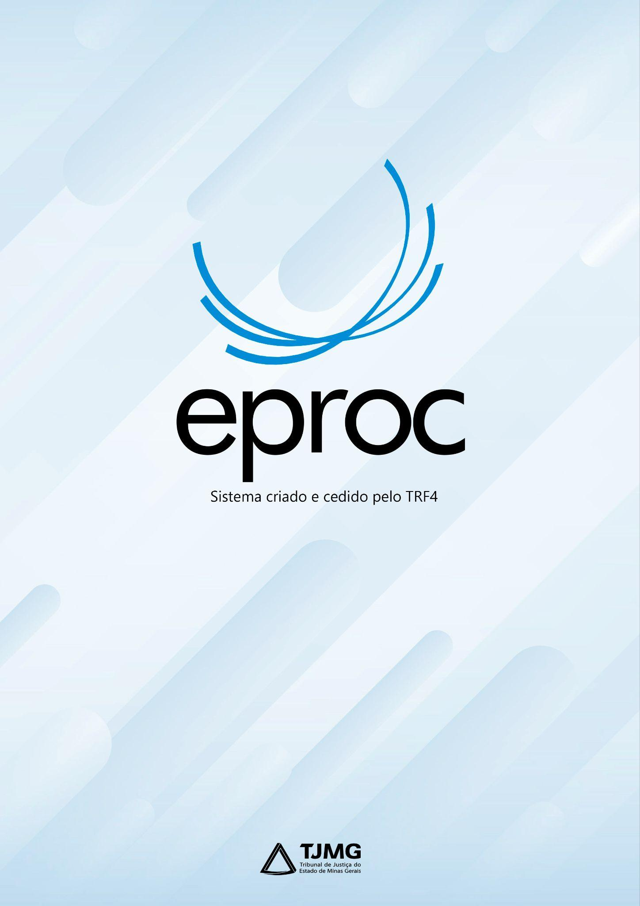

# CADASTRO DE MAGISTRADO PLANTONISTA

*Documento eProc - Material de Treinamento*

---

---

<small>Coordenação de Apoio e Acompanhamento do Sistema PJe (COAPE)</small><small>Gerência de Acompanhamento e de Suporte aos Sistemas Judiciais Informatizados da Justiça de Primeira</small><small>Instância (GESIS)</small><small>Corregedoria Geral de Justiça - TJMG</small>
**CADASTRO DE MAGISTRADO PLANTONISTA**

---

**SUMÁRIO**

**CADASTRO DE MAGISTRADO PLANTONISTA. .. .. .. .. .. .. .. .. .. .. .. .. .. .. .. .. .. .. .. .. .. .. .. .. .. .. .. .. .. .. .. .. .. .. .. .. .. 2**
<small>Cadastro de Perfil. .. .. .. .. .. .. .. .. .. .. .. .. .. .. .. .. .. .. .. .. .. .. .. .. .. .. .. .. .. .. .. .. .. .. .. .. .. .. .. .. .. .. .. .. .. .. .. .. .. .. .. .. .. .. .. .. .. .2</small><small>Associação de Magistrados à Vara Plantonista. .. .. .. .. .. .. .. .. .. .. .. .. .. .. .. .. .. .. .. .. .. .. .. .. .. .. .. .. .. .. .. .. .. .. .. 4</small>

---

**CADASTRO DE MAGISTRADO PLANTONISTA**

É indispensável o cadastro dos servidores e magistrados que atuarão no plantão, sendo

essa responsabilidade do Gerente de Secretaria. Para que o Magistrado tenha acesso à

Vara Plantonista, é necessário que, além de realizar o cadastro, a associação do

Magistrado também seja realizada na Vara Plantonista.

**Cadastro de Perfil**

Para realizar o cadastro do Magistrado plantonista, com o perfil de Gerente de

Secretaria, o usuário deverá:

1. Clicar em “**Menu (Alt + m)**” (

);

2. Clicar na opção “**Usuários**” e, em seguida, selecionar a opção “**Cadastro de**

**Usuários**”;

3. Na tela “**Cadastro de Usuários**”, inserir no campo correspondente o CPF do

Magistrado a ser cadastrado. Após, clicar em “**Consultar**”.

---

**Observação:**Caso o sistema não retorne nenhum resultado, o Gerente de Secretaria

deverá abrir um chamado no Portal de Serviços de Informática do TJMG:

http: //Informatica. intra. tjmg. gov. br para que o suporte eproc analise a questão.

4. Após a consulta, ficarão disponíveis os campos “**Sigla Inicial**”, com uma sigla

sugerida pelo sistema (CPF) e o nome do Magistrado. Para consultar os dados

cadastrados, clicar em “**Consultar Dados Pessoais**”.

5. No campo “**Informe os dados para o usuário:**”, inserir a sigla que será utilizada

pelo Magistrado para acessar o eproc no campo “**Sigla**”. No TJMG, a sigla do

Magistrado será a matrícula com letra minúscula e números (Ex. : t0012345).

**Atenção!**A sigla elaborada deverá ser a matrícula do TJMG e não poderá conter

espaços e caracteres especiais.

6. No campo “**Tipo de Usuário**”, selecionar a opção “**Plantão**”. Para que os

usuários atuem no plantão independente do cargo “Magistrado”, “Gerente de

Secretaria”, “Assessor” ou “Servidor”,**todos terão que utilizar o tipo de usuário**

**“Plantão”**.

7. O campo “**Data de expiração**” não se trata de um campo de preenchimento

obrigatório. Nesse sentido, caso o Gerente de Secretaria deseje preencher esse

campo, a data deverá ser, no mínimo, um dia após o último dia do plantão, uma

vez que, após essa data, o Magistrado não terá mais acesso à Vara Plantonista.

---

8. No campo “**UF - Órgão Lotação:**”: selecionar MG e, em “**Órgão Lotação**”,

selecionar o local onde será lotado (ex: em Belo Horizonte utilizar Central de

Plantão de Belo Horizonte - CEPLAN).

9. Após, clicar em “**Incluir**”.

10. O sistema apresentará mensagem informando que o usuário foi cadastrado

com sucesso. Clicar em “**OK**”.

**Associação de Magistrados à Vara Plantonista**

Após cadastrar o perfil, é necessário que o Gerente de Secretaria associe o Magistrado

à Vara Plantonista, conforme os procedimentos descritos a seguir:

1. Clicar em “**Menu (Alt + m)**” (

);

---

2. Clicar na opção “**Gerenciamento do Plantão**” e, em seguida, clicar na opção

“**Plantão Magistrado**”.

3. Na tela “**Gerenciamento do Plantão - Magistrado**” que se abrir, clicar em

“**Novo**”.

4. O

sistema

abrirá

a

nova

tela

denominada

“**Cadastramento**

**Plantão**

**Magistrado**”. Preencher os campos disponíveis da seguinte forma:

➔“**Login do Magistrado**”: Selecionar o Magistrado que deseja associar.

**Atenção!**Somente podem ser vinculados ao plantão magistrados com o perfil

Magistrado e lotados no órgão “Plantão”.

➔“**Data Início**”: Preencher a data e o horário em que o magistrado iniciará o

plantão. O sistema não permite utilizar uma data retroativa.

**Atenção!**O perfil de plantão estará disponível apenas durante o período (data e

horário) cadastrado para atuação. Assim, recomenda-se que o Gerente de Secretaria

insira um tempo maior de acesso para que o Magistrado possa verificar se seu perfil

está adequado antes de efetivamente iniciar o plantão.

---

➔“**Data Final**”: Incluir a data e o horário que melhor se adequem ao caso

concreto. Sugere-se que o Gerente de Secretaria registre o horário de plantão

com tempo extra após o término efetivo, para que o acesso do Magistrado não

seja interrompido durante alguma diligência ao final do plantão.

➔“**Localidade**”: Selecionar a caixa de seleção correspondente às comarcas que

fazem parte da microrregião do magistrado.

5. Após preencher os dados, clicar em “**Salvar**”.

6. Em seguida, o sistema exibirá uma tela informativa com um resumo do cadastro

efetuado.

**ATENÇÃO!**Não é possível editar a associação já realizada para o usuário plantonista.

Em caso de correções, o Gerente de Secretaria deverá clicar no ícone “**Desativar**

**Procurador**” (

), disponível em “**Ações**” da tela “**Gerenciamento do Plantão -**

**Magistrado**”, excluir a associação do Magistrado e inseri-la novamente da forma

adequada.

---

Em regra, o cadastro dos magistrados será realizado pelo Gerente de Secretaria,

relativamente à unidade judiciária que atua. Na ausência do Gerente de Secretaria e

em caso de urgência, o cadastramento poderá ser solicitado ao suporte eproc por meio

de abertura de chamado no Portal de Serviços de Informática do TJMG, através do

endereço: http: //Informatica. intra. tjmg. gov. br
