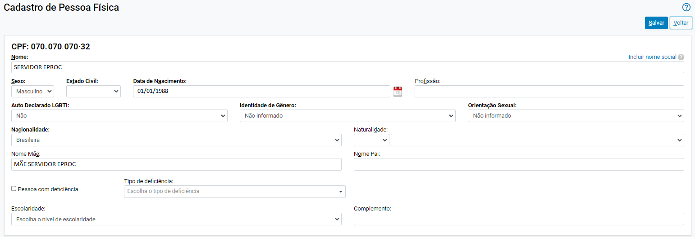

# CADASTRO DE USUARIOS INTERNOS

*Documento eProc - Material de Treinamento*

---

---

<small>Coordenação de Apoio e Acompanhamento do Sistema PJe (COAPE)</small><small>Gerência de Acompanhamento e de Suporte aos Sistemas Judiciais Informatizados da Justiça de Primeira</small><small>Instância (GESIS)</small><small>Corregedoria Geral de Justiça - TJMG</small>
**CADASTRO DE USUÁRIOS INTERNOS**

---

**SUMÁRIO**

**Cadastro de Pessoa Física. .. .. .. .. .. .. .. .. .. .. .. .. .. .. .. .. .. .. .. .. .. .. .. .. .. .. .. .. .. .. .. .. .. .. .. .. .. .. .. .. .. .. .. .. .. .. .. .. .. .. .. 3**

**Cadastro de Perfis. .. .. .. .. .. .. .. .. .. .. .. .. .. .. .. .. .. .. .. .. .. .. .. .. .. .. .. .. .. .. .. .. .. .. .. .. .. .. .. .. .. .. .. .. .. .. .. .. .. .. .. .. .. .. .. .. . 6**

**Como gerar senha para o usuário. .. .. .. .. .. .. .. .. .. .. .. .. .. .. .. .. .. .. .. .. .. .. .. .. .. .. .. .. .. .. .. .. .. .. .. .. .. .. .. .. .. .. .. .. 10**

**Como realizar o primeiro acesso. .. .. .. .. .. .. .. .. .. .. .. .. .. .. .. .. .. .. .. .. .. .. .. .. .. .. .. .. .. .. .. .. .. .. .. .. .. .. .. .. .. .. .. .. .. 11**

**Exclusão de Usuários. .. .. .. .. .. .. .. .. .. .. .. .. .. .. .. .. .. .. .. .. .. .. .. .. .. .. .. .. .. .. .. .. .. .. .. .. .. .. .. .. .. .. .. .. .. .. .. .. .. .. .. .. .. . 12**

---

**CADASTRO DE USUÁRIOS INTERNOS**

O**Gerente da Secretaria**da unidade será responsável pela inclusão e exclusão dos

usuários internos no eproc. Durante o projeto-piloto, o cadastro inicial será realizado

pela Corregedoria-Geral de Justiça, e os demais cadastros ficarão a cargo do gestor.

**Atenção!**A desvinculação de usuários que deixarem de pertencer ao quadro de

servidores ou estagiários da unidade/cartório é uma medida essencial para garantir a

segurança das informações e dos processos armazenados no eproc.

Sendo o eproc um sistema web acessível de qualquer local, e não restrito à rede

interna do TJMG, o usuário poderá continuar acessando-o de qualquer lugar com

conexão à internet.

Portanto, é imprescindível que o gestor esteja atento e providencie a exclusão do

acesso do usuário assim que ele deixar o quadro de funcionários ou for transferido

para outra unidade.

O**cadastro inicial dos usuários internos**no eproc será de responsabilidade da

Corregedoria-Geral de Justiça e será realizado de acordo com a lotação na unidade

judiciária e cargo de exercício da função.

O**cadastro inicial de estagiários**somente será possível mediante a entrega dos Termos

de Responsabilidade, devidamente preenchidos, tanto pelo estagiário quanto pelo

supervisor de estágio, nos moldes do que já ocorre no PJe. Dúvidas relacionadas

poderão ser sanadas por meio de abertura de chamado no Portal de Serviços de

Informática do TJMG > https: //informatica. tjmg. jus. br/

A**alteração do cadastro do usuário interno**, quando necessária, será realizada pelo

Gerente de Secretaria, relativamente à unidade judiciária em que atua. Ausente o

escrivão e em caso de urgência, o cadastramento do juiz, será realizado por abertura

de

chamado

no

Portal

de

Serviços

de

Informática

do

TJMG

>

https: //informatica. tjmg. jus. br.

---

Para realizar o cadastro de usuários internos, com o perfil de Gerente de Secretaria, o

usuário deverá:

**Cadastro de Pessoa Física**

1. Clicar em “**Menu (Alt + m)**” (

);

2. Clicar na opção “**Usuários**” e, em seguida, selecionar a opção “**Cadastro de**

**Usuários**”;

3. Na tela “**Cadastro de Usuários**”, inserir no campo correspondente o CPF, a Sigla

ou o nome do usuário a ser cadastrado. Após, clicar em “**Consultar**”.

4. O eproc buscará os dados do usuário no banco de dados da Receita Federal. Se

a pessoa nunca utilizou o eproc, o sistema enviará uma mensagem informando

a inexistência do usuário e perguntará se deseja realizar um novo cadastro. Para

prosseguir, clicar em “**OK**”.

---

5. Em seguida, o sistema apresentará uma nova tela informando que os dados se

originam do Cadastro de Pessoas Físicas. Clicar em “**OK**”.

6. Na tela “**Cadastro de Pessoa Física**” que se abrir, os principais dados pessoais e

o endereço serão preenchidos automaticamente. Caso algum dado essencial

não vier preenchido, o gerente de secretaria deverá inseri-lo manualmente.

7. No campo “**Endereço(s)**”, o sistema buscará o endereço do usuário que consta

cadastrado na Receita Federal. Caso esteja correto, clicar em “**Incluir**”.

---

8. Caso o endereço buscado não corresponda ao endereço atual do servidor ou do

estagiário, inserir o CEP correto no campo “**CEP**” e clicar no ícone “Buscar

endereço pelo CEP” (

). Após, deverá completar o endereço e clicar em

“**Incluir**”.

9. Após incluir, o endereço ficará listado ao final do campo “**Endereço(s)**”,

podendo ser alterado ou excluído por meio dos botões correspondentes

disponíveis em “**Ações**”.

10. No campo “**Contato(s)**”, selecionar a forma de contato e inserir o dado

correspondente (e-mail, telefone ou celular) do servidor. Em seguida, clicar em

“**Incluir**”.

---

11. Após conferir, preencher e inserir todos os dados nos campos “**CPF**”,

“**Endereço(s)**” e “**Contato(s)**”, clicar no botão “**Salvar**”, localizado ao final e no

topo da página, para gerar o novo usuário no sistema.

12. O sistema gerará uma mensagem informando que o servidor ou estagiário foi

salvo com sucesso. Clicar em “**OK**”.

**Cadastro de Perfis**

Após o cadastro da pessoa física conforme demonstrado acima, na tela “**Cadastro de**

**Usuários**” ficarão disponíveis os campos “**Sigla Inicial**”, com uma sigla sugerida pelo

sistema (CPF do servidor/estagiário) e o nome do servidor ou estagiário. Para consultar

os dados cadastrados, clicar em “**Consultar Dados Pessoais**”.

**Observação:**Caso o usuário já possua cadastro no eproc, não será necessário realizar o

cadastro da pessoa física e o sistema abrirá a tela “Cadastro de Usuários” contendo a

sigla inicial e o nome diretamente.

---

Para configurar a sigla que será utilizada pelo usuário para acessar o eproc, o perfil que

utilizará e o órgão, o gerente de secretaria deverá:

1. Na aba “**Informe os dados para o usuário**”, inserir a sigla que será utilizada pelo

usuário para acessar o eproc no campo “**Sigla**”. No TJMG, a sigla do servidor ou

estagiário será a matrícula com letra minúscula e números (Ex. : f0012345).

**Atenção!**A sigla elaborada deverá ser a matrícula do TJMG e não poderá conter

espaços e caracteres especiais

2. No campo “**Tipo de Usuário**”, selecionar o tipo de usuário que está sendo

cadastrado (ex. : servidor de secretaria, estagiário, magistrado, etc. ).

3. Após escolher o tipo de usuário, o sistema abrirá os campos “**Data de**

**expiração**”, que é opcional, e “**UF - Órgão Lotação:**”, para seleção do Órgão

Julgador em que o servidor ou estagiário será lotado.

---

4. No caso de cadastro de estagiários, o sistema disponibilizará uma caixa de

seleção denominada “**Usuário sem vínculo com a Justiça Estadual**” para

marcação. Deverá ser utilizado apenas se o estagiário não tiver contrato de

estágio com o TJMG, como exemplo, os cedidos de prefeituras. Caso o

estagiário possua contrato com o TJMG, a caixa de seleção não deverá ser

marcada.

5. Após preencher todos os campos, clicar em “**Incluir**”.

---

6. Ao final da tela será exibido o perfil criado, com as informações: Sigla, UF, Órgão

de Lotação, Tipo, se é interno, se está ativo, data do cadastro, Usuário que

ativou e Ações.

*(Ações disponíveis para cadastros de servidores)*

*(Ações disponíveis em cadastros de estagiários)*

7. As “**Ações**” disponíveis são:

➔**Data da expiração do perfil**(

): permite consultar quando o perfil irá

expirar. Este campo aparecerá somente se o gerente de secretaria

preencher o campo “Data de Expiração” durante a criação do perfil.

➔**Desativar Usuário Localmente**(

): permite desativar o cadastro do

usuário localmente

➔**Desativar Usuário em Todos os eproc**(

):

permite

desativar

o

cadastro do usuário em todos os eprocs.

➔**Tipo de Tratamento do Usuário**(

): permite configurar o tipo de

tratamento que aquele usuário possuirá no sistema. É essencial que o

gerente de secretaria preencha o tipo de tratamento. Em seguida,

deverá clicar em “Salvar”.

---

Quando configurada corretamente, essa ação permite que, ao elaborar

minutas, o tratamento do usuário seja preenchido automaticamente.

➔**Alterar Vínculo com a Instituição**(

): permite alterar o vínculo do

usuário com a instituição, se possui ou não vínculo.

**Observação!**O servidor plantonista deverá possuir no mínimo duas lotações, no órgão

julgador que atua e no plantão.

**Como gerar senha para o usuário**

Após finalizar o cadastro, para que o usuário realize o acesso inicial, o gerente de

secretaria deverá:

1. Clicar no botão “**Reinicializar Senha**”, da tela “**Cadastro de Usuários**”.

2. O sistema exibirá uma mensagem informativa. Clicar em “OK”.

---

3. Em seguida, o sistema abrirá a tela “**Reinicialização de Senha**”, com a nova

senha cadastrada, que deverá ser informada ao usuário que foi cadastrado.

4. Após o primeiro acesso, o usuário deverá alterar a senha gerada pelo gerente

de secretaria.

**Como realizar o primeiro acesso**

Para realizar o primeiro acesso, o usuário deverá:

1. Acessar a página do eproc, conforme link disponível no portal do TJMG;

2. Utilizar como login a sigla cadastrada (composta pela matrícula com letra e

número) e a senha gerada pelo gerente de secretaria. Após, clicar em “Entrar”.

---

3. O usuário será imediatamente direcionado para uma tela de alteração de

senha. A nova senha deverá conter entre 8 e 30 caracteres, incluindo letras

maiúsculas, números e caracteres especiais. Preencher os campos “Senha

Atual”, “Senha Nova” e “Confirmar Senha”. Em seguida, clicar em “Alterar”.

4. Após realizar a alteração, o sistema exibirá uma mensagem de confirmação e o

usuário será redirecionado ao seu painel.

**Exclusão de Usuários**

O Gerente de Secretaria é responsável por desativar usuários pertencentes à sua

unidade no sistema eproc.

Portanto, assim que ocorrer o desligamento do usuário do quadro de funcionários ou

sua transferência para outra unidade, o gerente deverá promover sua desativação. Para

desativar determinado usuário, o gerente de secretaria deverá:

1. Clicar em “**Menu (Alt + m)**” (

);

---

2. Clicar na opção “**Usuários**” e, em seguida, selecionar a opção “**Cadastro de**

**Usuários**”;

3. Na tela “**Cadastro de Usuários**”, inserir no campo correspondente o CPF, a Sigla

ou o nome do usuário a ser desativado. Após, clicar em “**Consultar**”.

4. Na coluna “**Ações**”, clicar no ícone “Desativar Usuário Localmente” (

).

5. Após, o sistema apresentará uma mensagem de confirmação. Clicar em “**OK**”.

---

