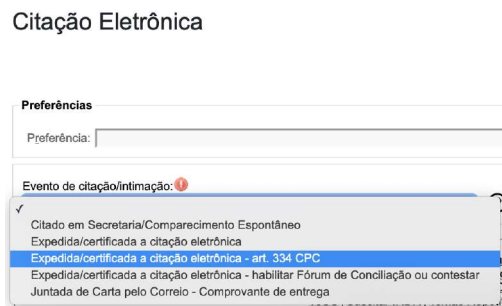
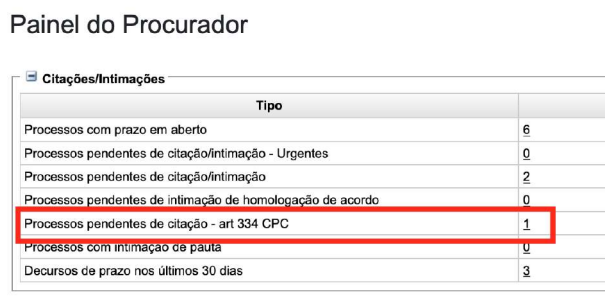
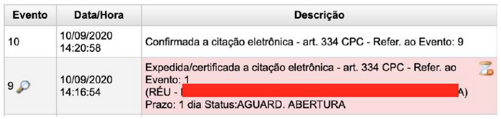
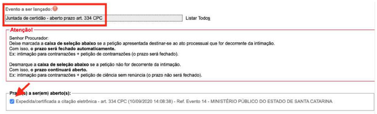
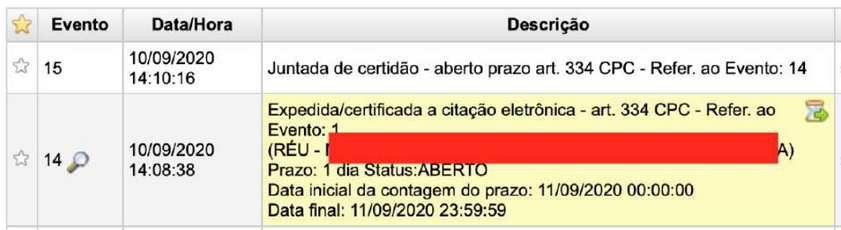

# EVENTO DE CITAÇÃO

*Documento eProc - Material de Treinamento*

---

---

# EVENTO DE CITAÇÃO

# ELETRÔNICA ART. 334 CPC

---

O art. 334 do Novo Código de Processo Civil determina que no procedimento

comum seja realizada audiência de mediação e conciliação logo após a citação

da parte ré. É uma das etapas preliminares do processo que, contudo, pode ser

dispensada por vontade das partes.

Quando designada a audiência pelo magistrado, o agendamento da citação

eletrônica da parte ré, se for o caso, deverá ser feito no eproc por meio da

escolha de um evento de citação específico, denominado**Expedida/certificada**

**a citação eletrônica - art. 334 CPC.**

Esse evento possui algumas particularidades em relação ao evento genérico de

citação eletrônica. Enquanto a citação eletrônica genérica já dá início à

contagem do prazo para resposta do réu, a citação eletrônica para os fins do art.

334 não produz esse efeito.

O prazo para resposta somente passará a correr depois da audiência, mediante a

juntada de certidão específica, como se verá adiante.

Para a citação nos casos em que a audiência tiver sido designada, deverá ser

selecionado o evento**Expedida/certificada a citação eletrônica - art. 334**

**CPC**, conforme figura a seguir:

## EVENTO DE CITAÇÃO ELETRÔNICA

## ART. 334 CPC

**Vale lembrar que para que a parte possa ser citada**

**eletronicamente é necessário que seja cadastrada no sistema**

**como**

**uma**

**Entidade**

**representada**

**por**

**procurador**

**ou**

**representante legal da Pessoa Jurídica devidamente cadastrado**

**no eproc.**

---

Para o procurador/representante legal, a citação ficará disponível no seguinte

local, destacado das demais citações e intimações.

O evento ficará aguardando abertura de prazo até a data da audiência,

independentemente de o prazo ter sido aberto ou não pela parte, pois

conforme prevê o art. 335 do CPC o réu poderá oferecer contestação, no

prazo de 15 (quinze) dias, cujo termo inicial será a data da audiência de

conciliação ou de mediação, quando qualquer parte não comparecer ou,

comparecendo, não houver autocomposição.

---

No dia da audiência o servidor terá duas opções em relação ao prazo acima:

1. caso seja bem sucedida a autocomposição, deverá ser lançado o evento

**Juntada de certidão - encerrado prazo**;

2. nos demais casos - ausência de autocomposição ou não comparecimento

de qualquer das partes, deverá ser lançado o evento**Juntada de certidão -**

**aberto prazo art. 334 CPC**, com o que será iniciada a contagem do prazo

para apresentar a contestação. O lançamento desse evento exige que haja um

prazo aberto.

<small>Divisão de Apoio Judiciário</small><small>Diretoria de Suporte à Jurisdição de Primeiro Grau</small><small>Tribunal de Justiça do Estado de Santa Catarina</small><small>SUPORTE EPROC</small>
