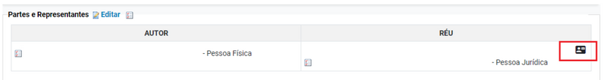
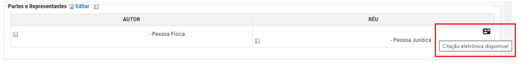
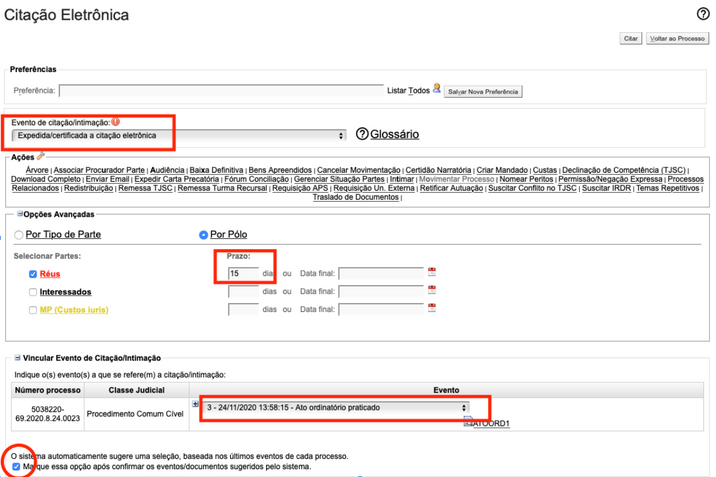
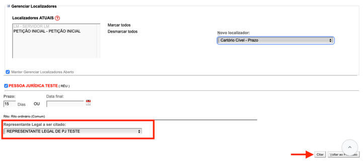

# CITAÇÃO ELETRÔNICA DE

*Documento eProc - Material de Treinamento*

---

---

# CITAÇÃO ELETRÔNICA DE

# PESSOA JURÍDICA

---

Com o intuito de cumprir o artigo 246, § 1º, da Lei nº 13. 105/2015 (Código de Processo

Civil) e as disposições do §6º do art. 9º da Resolução GP/CGJ n. 5/2019 do TJSC, o

sistema eproc disponibiliza uma funcionalidade que permite que o representante

legal de uma pessoa jurídica registrada no eproc receba citações e intimações

eletrônicas em nome da respectiva PJ.

Para ter acesso ao sistema eproc, o representante legal da empresa deverá utilizar

um login e senha específicos criados para esse propósito.

Essas credenciais serão cadastradas pelo setor de Distribuição das comarcas ou pelo

seu próprio cadastro no portal eproc.

Uma vez que uma pessoa jurídica esteja devidamente registrada no eproc como parte

ré em um processo, será exibido um ícone ao lado do nome dessa parte na seção

"Partes e Representantes. "

Esse ícone indica que a parte tem a opção de receber citações eletrônicas.

## CITAÇÃO ELETRÔNICA DE PESSOA

## JURÍDICA

Ao passar o cursor sobre o ícone, o sistema informará que a parte pode ser citada

eletronicamente e disponibilizará o botão "Citar. " Ao clicar neste botão, abrirá a tela

de citação eletrônica.

---

O prazo;

O evento de citação (despacho, decisão, etc. );

Marcar a opção destacada com o círculo vermelho na figura abaixo; e

Selecionar o representante legal a ser citado.

Na tela de citação eletrônica, o evento de citação já estará pré-configurado, não

necessitando de alterações. O usuário deve fornecer as seguintes informações e

clicar em "Citar":

---

*****A unidade judicial, ao cadastrar o advogado, deve obrigatoriamente excluir**

**o representante legal, mantendo apenas o advogado, a fim de evitar possíveis**

**erros em futuras intimações. *****

**Divisão de Apoio Judiciário****Diretoria de Suporte à Jurisdição de Primeiro Grau****Tribunal de Justiça do Estado de Santa Catarina**<small>SUPORTE</small><small>EPROC</small>
Após essas etapas, o representante legal da pessoa jurídica será citado

eletronicamente e deverá acessar o portal eproc para tomar conhecimento do ato.

A citação do representante legal será efetivada no momento em que ele se der por

citado ao abrir o prazo ou quando constituir procurador por meio da ferramenta

disponível no sistema.
<small>**Importante:**Após a citação, o representante legal tem a</small><small>opção de nomear um advogado. Quando ele faz isso, o</small><small>advogado é registrado como representante da parte, e o</small><small>representante legal é desvinculado do processo. No entanto,</small><small>se o advogado enviar a procuração, ele não será</small><small>automaticamente associado ao processo, se houver um</small><small>representante legal vinculado à Pessoa Jurídica no processo.</small>
