# COMO CRIAR E GERENCIAR FLUXOS DE

*Documento eProc - Material de Treinamento*

---

---

# COMO CRIAR E GERENCIAR FLUXOS DE

# AUTOMATIZAÇÕES GENÉRICAS NO EPROC

# (PERFIL GERENTE DE AUTOMATIZAÇÕES)

---

**INTRODUÇÃO**
**A funcionalidade de Fluxos de Automatizações Genéricas no eproc permite****automatizar etapas repetitivas da tramitação processual, como troca de****localizadores e a execução de**Ações Programadas,**tal como lançamento de****eventos e expedição de minutas.****Isso traz mais agilidade e eficiência para o andamento dos processos. Este****tutorial é voltado para usuários com o**perfil Gerente de Automatizações**,****que têm acesso exclusivo a essa funcionalidade.****COMO CRIAR E GERENCIAR FLUXOS DE****AUTOMATIZAÇÕES GENÉRICAS NO EPROC****(PERFIL GERENTE DE AUTOMATIZAÇÕES)**

---

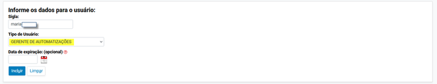

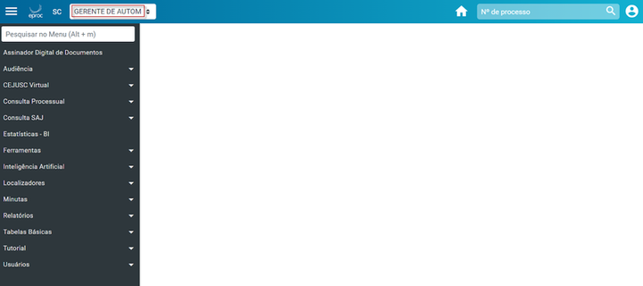

**PASSO A PASSO**

**1. Acesso ao Perfil Gerente de Automatizações**

Apenas o Administrador do Sistema pode atribuir ao usuário o perfil de

Gerente de Automatizações.

Esse perfil possui um menu exclusivo com permissões para criar e gerenciar

**Fluxos de Automatizações Genéricas no eproc**

---

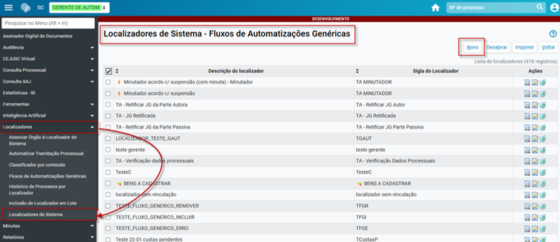

**2. Criar Localizadores de Sistema**

Acesse: Menu Textual > Localizadores > Localizadores de Sistema.

Clique em Novo.

Preencha os campos:

Descrição do localizador

Sigla do localizador

Selecione os órgãos que utilizarão esse localizador.

Clique em Salvar.

---

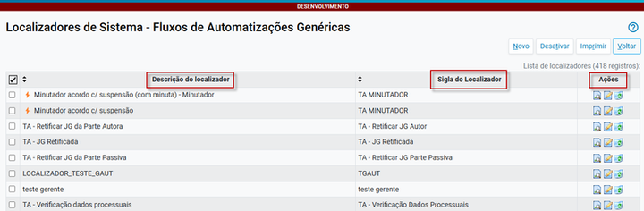

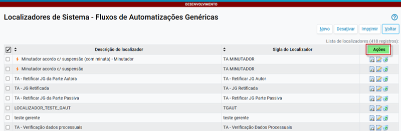

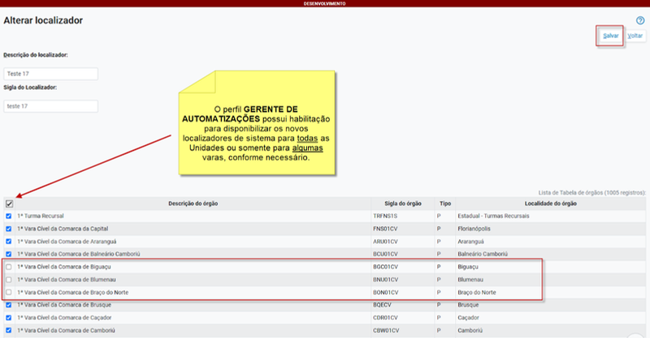

Havendo necessidade de alterar a descrição e/ou sigla do localizador ou a

disponibilidade do mesmo nas Unidades Judiciais, basta ir na coluna ações e

clicar em**Alterar Localizador.**

---

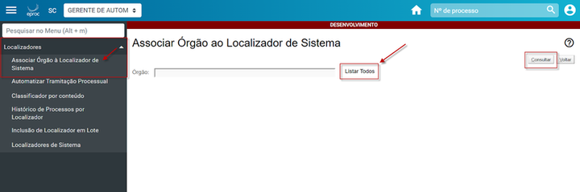

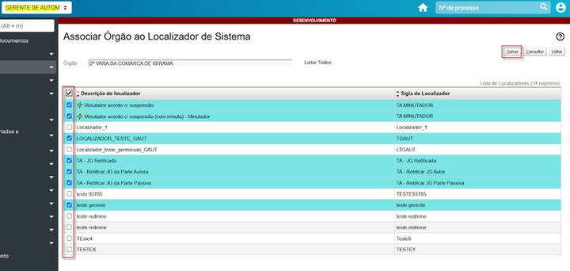

**3. Associar Órgãos ao Localizador**

1. Acesse: Menu Textual > Localizadores > Associar órgãos aos Localizadores

de Sistema.

2. Clique em Listar todos, selecione a unidade judicial e clique em Consultar.

3. Marque os localizadores desejados e clique em Salvar.

Se por acaso um**Localizador de Sistema - Fluxos de Automatizações**

**Genéricas**não for selecionado para determinada Unidade, o mesmo não irá

aparecer para tal vara, em Localizadores do Órgão. Acompanhe no exemplo

abaixo:

---

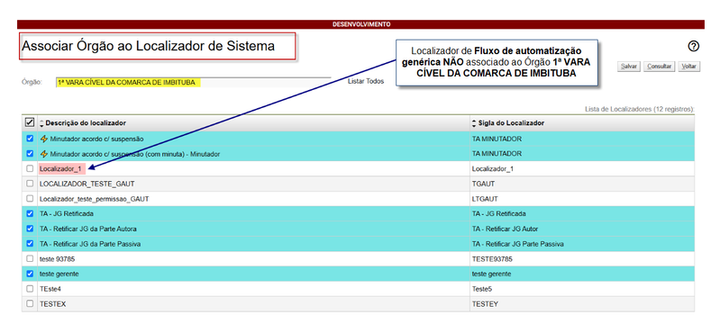

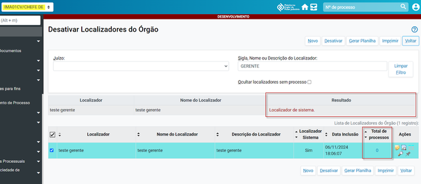

Somente o Gerente de Automatizações possui habilitação para desativar

**localizadores de sistema de Fluxos de Automatizações Genéricas**. A

chefia de cartório fica impedida de realizar tal desativação, mesmo que o

localizador esteja com total de processos igual a ZERO.

---

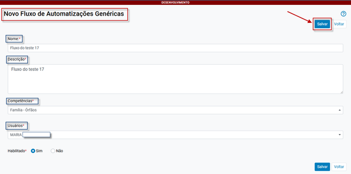

**4. Criar um Fluxo de Automatização Genérica**

1. Acesse: Menu Textual > Localizadores > Fluxos de Automatizações

Genéricas.

2. Clique em Novo.

3. Preencha os campos obrigatórios:

Nome do fluxo

Descrição

Competências (ex: Cível, Família, Criminal)

Usuários (Gerentes que poderão editar o fluxo)

Habilitado (sim ou não)

4. Clique em Salvar.

---

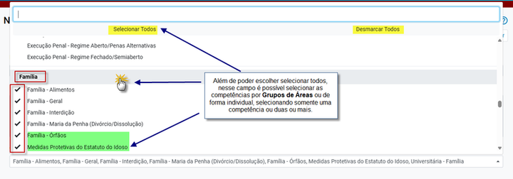

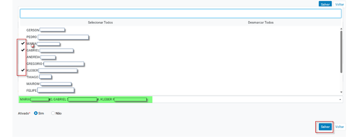

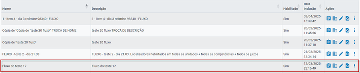
<small>(Campo para a seleção de competências)</small><small>(Usuários: Campo para selecionar os usuários que poderão editar e alterar o fluxo)</small><small>(Novo fluxo cadastrado)</small>

---

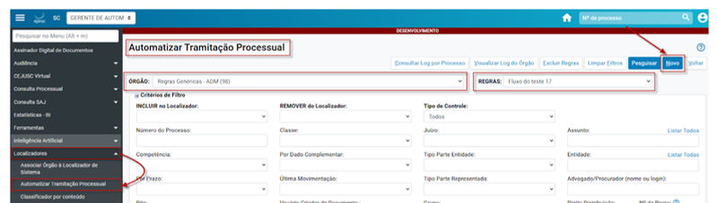

O cadastramento segue o padrão de criação de ATP. Todas as novas regras

criadas (troca de localizadores a partir de um gatilho) em**Fluxos de**

**Automatizações**

**Genéricas,**

cadastradas

pelo

perfil

Gerente

de

Automatizações, nascem como**inativas**.

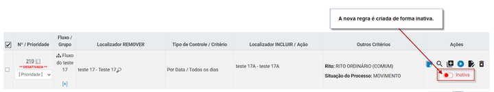

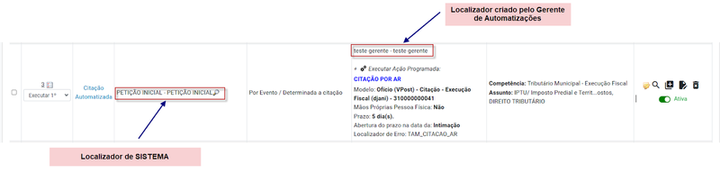

**5. Cadastrar Regras Genéricas**

1. Acesse: Menu Textual > Localizadores > Automatizar Tramitação Processual.

2. Selecione: Órgão > Regras Genéricas.

3. Escolha o fluxo criado e clique em Novo.

Ao criar uma**Regra Genérica**, o Gerente de Automatizações pode escolher

utilizar e mesclar: “**Localizadores de Sistema” (**pré-existentes no eproc) e

**“Localizadores de sistema - Fluxos de Automatizações Genéricas”**

(criados pelo perfil Gerente de Automatizações).

**ATENÇÃO**: Regras e**Fluxos de Automatizações Genéricas**não podem

utilizar “Localizadores do Órgão” (localizadores criados pelas unidades

judiciais).

---

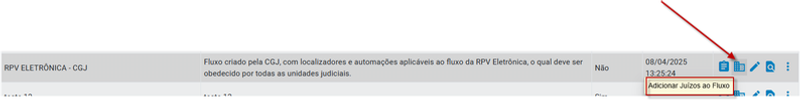

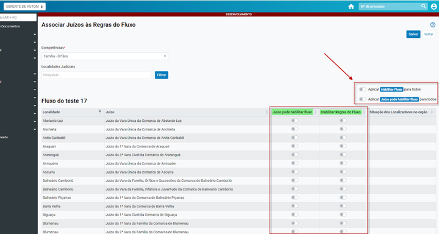

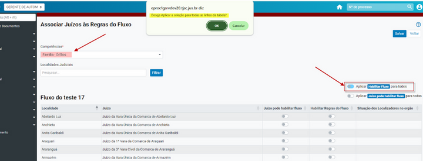

No exemplo abaixo optou-se por habilitar o fluxo para todas as localidades e

Juízos que possuem a competência Família - órfãos.

**6. Adicionar Juízos ao Fluxo**

1. Na tela de Fluxos de Automatizações Genéricas, clique no ícone de prédio

🏛️.

2. Escolha as competências e localidades.

3. Defina se o fluxo será habilitado automaticamente ou se o juízo poderá

decidir.

4. Clique em Salvar.

---

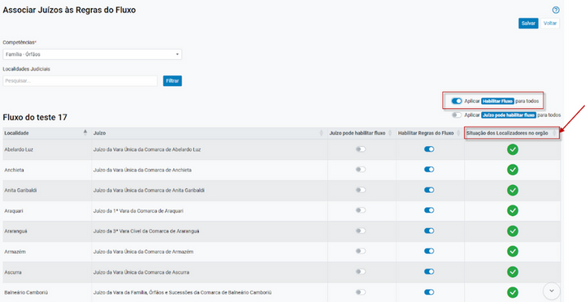

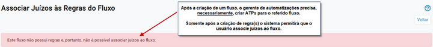

Caso haja inconsistência quanto a situação dos localizadores das regras em

algum dos juízos, será possível verificar na coluna:**situação dos**

**localizadores no órgão.**

**Atenção para a sequencialidade na criação de Fluxos de**

**Automatizações Genéricas e Associação de Juízos ao Fluxo!**

---

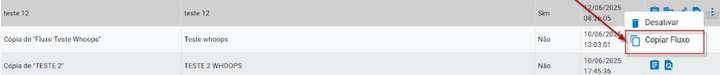

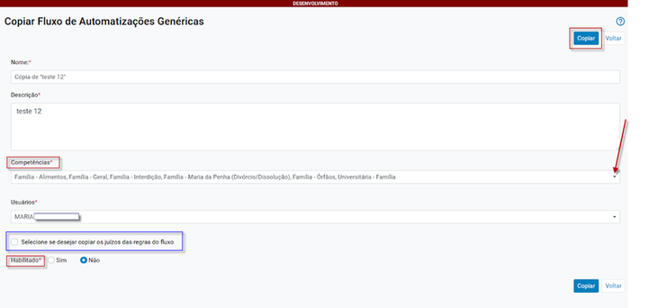

Ao clicar no ícone**Copiar Fluxo,**o eproc permite ao Gerente de

Automatizações incluir e/ou alterar nome, descrição, competências, selecionar

se desejar copiar os juízos das regras do fluxo e indicar se a cópia deve ser

Habilitada.

Ao clicar no botão copiar, o sistema inclui uma cópia de tal fluxo, conforme

apresentação no**painel Fluxos de Automatizações Genéricas**.

**7. Gerenciar Fluxos**

Na tela de listagem de fluxos, utilize os ícones da coluna Ações para:

Consultar Regras (ícone de prancheta)

Adicionar Juízos (ícone de prédio)

Alterar Fluxo (ícone caneta)

Consultar Fluxo (ícone lupa)

Desativar ou Copiar Fluxo (menu ⋮)

Destaque para copiar fluxo:

---

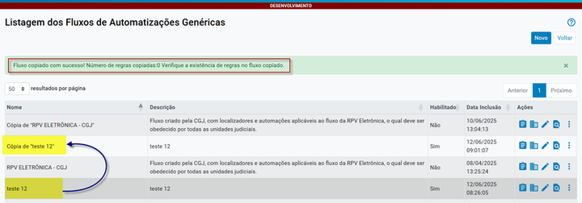

*Fluxos copiados possuem o mesmo funcionamento de um novo fluxo: Podem

ser editados e requerem o ajuste dos passos:**Associar Órgão ao Localizador**

**de Sistema + Associar Juízos às Regras do Fluxo + Ativação da regra.**

**Exemplo**

**Prático:**

**Criando**

**e**

**Executando**

**um**

**Fluxo**

**de**

**Automatização no eproc**

**PASSO A PASSO**

**1. Criar o Fluxo de Automatização**

Perfil utilizado: Gerente de Automatizações

Nome do fluxo: exemplo 1

Competência selecionada: Família

---

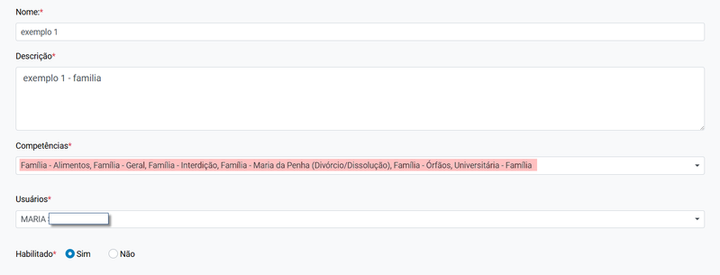

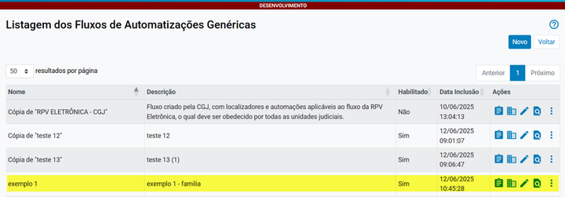

**2. Verificar o Fluxo Criado**

O fluxo aparece na listagem de fluxos disponíveis.

**3. Criar uma Regra para o Fluxo**

1. Clique em Consultar Regras no fluxo criado.

2. Clique em Novo para criar uma nova regra.

3. Configure a regra conforme necessário.

---

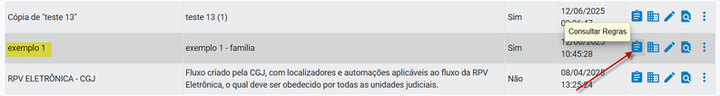

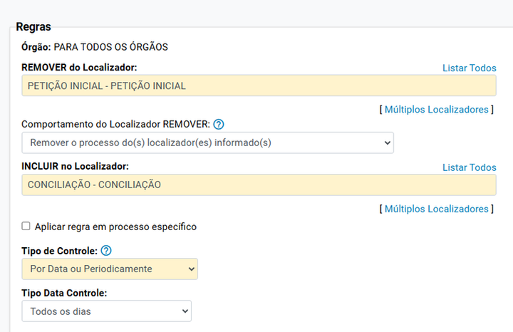

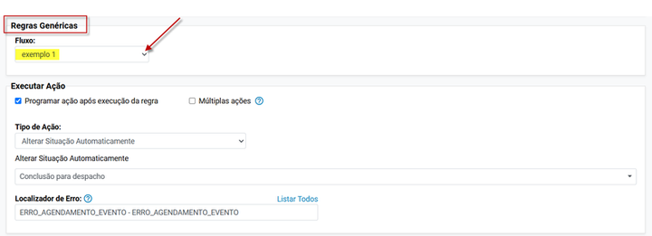

**4. Ativar a Regra Criada**

A regra criada (nº 32) inicialmente está inativa.

Ative a regra para que ela entre em funcionamento.

---

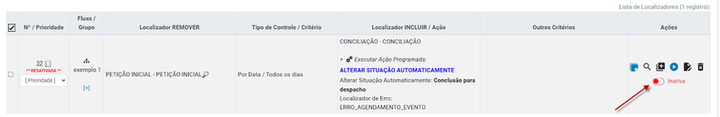

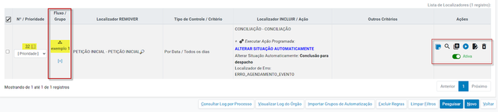

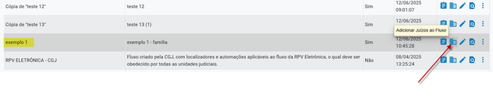

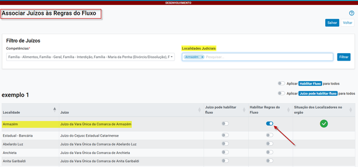

**5. Adicionar Juízos ao Fluxo**

Acesse a opção Adicionar Juízos ao Fluxo.

No exemplo, foi habilitada apenas a Vara Única de Armazém.

---

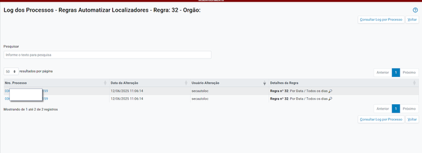

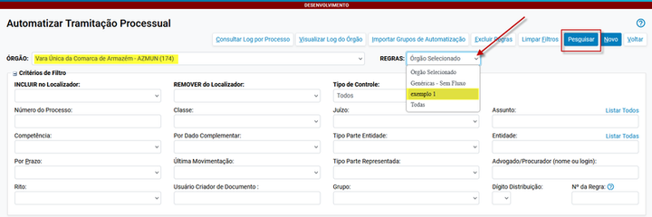

**6. Verificar a Execução da Regra**

A regra 32 foi executada com sucesso e movimentou 2 processos na Vara

Única de Armazém.

A**unidade judicial**pode consultar as regras criadas acessando:

Menu Textual > Automatizar Tramitação Processual

Selecionar o fluxo e clicar em Pesquisar

**DICAS E OBSERVAÇÕES**

**Regras e fluxos não podem usar localizadores do órgão, apenas localizadores**

**de sistema.**

**Regras criadas nascem inativas e devem ser ativadas manualmente.**

**Para desativar um fluxo, todas as regras vinculadas devem estar inativas.**

**Fluxos copiados funcionam como novos fluxos e exigem nova configuração de**

**juízos e ativação de regras.**

**Quer saber mais sobre Tramitação Ágil? Acesse o Portal do Conhecimento Eproc**

<small>Divisão de Apoio Judiciário</small><small>Diretoria de Suporte à Jurisdição de Primeiro Grau</small><small>Tribunal de Justiça do Estado de Santa Catarina</small><small>SUPORTE</small><small>EPROC</small>
