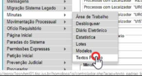
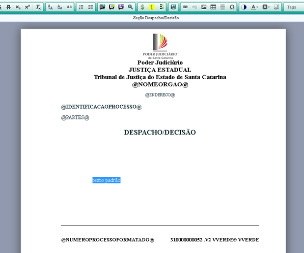
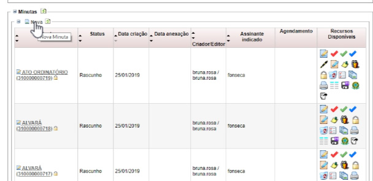
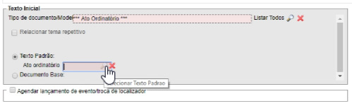

# AULA 4

*Documento eProc - Material de Treinamento*

---

---

### Unidades Judiciais de 1º Grau
**Objetivos de aprendizagem**
# AULA 4

Aprender a criar e utilizar texto padrão em minutas.

## UNIDADE 7

---

<small>pág. 2</small>**UNIDADE 7 - AULA 4**
### 7. 3 Texto padrão

O Texto padrão é conteúdo, ou seja, ele é texto corrido, não tem for­

ma. É um trecho de texto que será salvo para ser utilizado repetidas

vezes em documentos.

Portanto, o Texto Padrão não tem forma, só tem conteúdo. Ele pode

ser uma palavra, uma frase, ou vários parágrafos citando artigos do

CPC, por exemplo. É algo que o usuário tem armazenado em seu ban­

co de textos padrão e ele pode reutilizar dentro de qualquer texto

que esteja editando.

No menu da lateral esquerda, posicionar o mouse sobre “Minutas” e

clicar em “Textos Padrão”.

O Texto padrão é criado a partir do botão “Novo”, no canto supe­

rior direito. No campo “Descrição”, dar um título ao Texto Padrão,

em seguida inserir uma “Sigla de auto-texto”, pois através dessa sigla

será possível transportar o Texto padrão para o documento em edi­

ção utilizando ALT+T. No campo “Classificação” pode criar um termo

que faça referência ao texto padrão para facilitar a sua localização. Se

marcar o fleg “Público”, o Texto padrão ficará disponível para outra

unidade importar e utilizar. Clicar em “Salvar” para abrir o editor de

textos padrão, que é muito semelhante ao editor de texto de minutas.

Aliás, o editor tem a cor verde para lembrar ao usuário que ele não

está editando um documento num processo, e sim está elaborando

um texto padrão.

O Texto padrão pode ter variáveis no meio deles (Tags).

---

<small>pág. 3</small>**UNIDADE 7 - AULA 4**
3) A partir do editor de texto da minuta de um processo, digitar a Sigla

de autotexto e acione ALT+T, e o texto será transportado imediata­

mente. Quando a sigla for composta por duas ou mais palavras e tiver

espaço entre elas, será necessário digitar a sigla, marcá-la e acionar

ALT+T, para o texto ser transportado imediatamente:

O Texto Padrão pode ser utilizado em uma minuta ou no modelo de

minuta. Tem várias formas de inserir um Texto padrão durante a edi­

ção de uma minuta:

1) A partir do editor de texto da minuta de um processo, clicar com o

botão direito do mouse, depois clicar “inserir texto padrão ou TAG”, e

clicar na seta verde para transportar o Texto padrão desejado.

2) A partir do editor de texto da minuta de um processo, clicar no íco­

ne “Inserir Texto Padrão ou TAG”, localizado na barra de ferramentas,

---

<small>pág. 4</small>
4) A partir do editor de texto de um modelo, [no menu da lateral es­

querda, posicionar o mouse sobre “Minutas” e clicar em “Modelos”. O

modelo é criado a partir do botão “Novo”, no canto superior direito]

clicar no ícone “Inserir Texto Padrão ou TAG”, localizado na barra

de ferramentas. Aqui o texto padrão poderá ser transportado para

o modelo de duas maneiras: pela seta verde “transportar este item e

fechar” ou pelo @ verde “transportar @TXT”. A seta verde faz o trans­

porte literal do texto padrão, enquanto que o @ verde transporta em

forma de variável @TXT0000000@. É recomendável utilizar o @ verde,

pois se o texto padrão for atualizado, todos os modelos irão trazer au­

tomaticamente as modificações, ou seja, não será necessário revisar

todos os modelos, por conta da alteração do texto padrão.

5) A partir da tela “Nova Minuta”, na subtela “Texto Inicial”, o usuário

deverá indicar qual o “Tipo de documento/Modelo” que será utilizado

naquela minuta, clicando em “listar todos” para buscar o Modelo de­

sejado, e em seguida clicar em “Texto Padrão”:
**UNIDADE 7 - AULA 4**

---

<small>pág. 5</small>
Ainda no campo “Texto Padrão”, o usuário deve clicar na lupa e se­

lecionar o Texto Padrão, clicando na seta verde, podendo também

utilizar-se dos critérios de pesquisa disponíveis.

Atenção: o Texto Padrão não tem formato, ou seja, quando o

usuário transferir um texto padrão para dentro do texto que

está editando, aquele assume a forma do parágrafo que esti­

ver utilizando.
**UNIDADE 7 - AULA 4**

