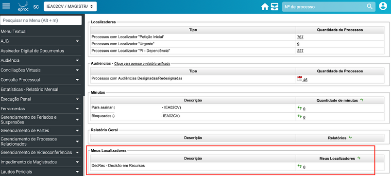

# COMO RECEBER

*Documento eProc - Material de Treinamento*

---

---

# COMO RECEBER

# NOTIFICAÇÃO DAS DECISÕES

# PROFERIDAS EM RECURSOS

---

O sistema eproc oferece uma série de integrações, e uma delas se refere à

comunicação entre processos de primeiro grau (1G) e segundo grau (2G).

Por exemplo, quando um Agravo de Instrumento é distribuído no Tribunal de Justiça de

Santa Catarina (TJSC), no processo de origem no primeiro grau, é registrado o evento

**"Comunicação eletrônica recebida - distribuído Agravo de Instrumento Número:**

**5000000-00. 2021. 8. 24. 0000/TJSC"**.

O mesmo ocorre para Apelações, Tutelas Antecipadas Antecedentes, entre outros.

Essa comunicação também se estende quando um evento de decisão é lançado no

recurso que tramita no segundo grau.

O sistema eproc automaticamente lança no processo de primeiro grau, que recebeu o

recurso, o evento**"Comunicação eletrônica recebida - decisão proferida em**

**Agravo de Instrumento Número: 5000000-00. 2021. 8. 24. 0000/TJSC"**.

Veja o exemplo a seguir:

## COMO RECEBER NOTIFICAÇÃO DAS

## DECISÕES PROFERIDAS EM RECURSOS
<small>FIGURA 1</small>
Com base nos eventos lançados no processo, é possível automatizar localizadores

para receber essas informações.

---

Assim, sempre que o evento "Comunicação eletrônica recebida - decisão proferida

em" for lançado, o processo será movido para um localizador de controle. Abaixo,

sugerimos como fazer isso:

Crie um localizador, por exemplo, "**DecRec - Decisão em Recursos**".

1.

Acesse o menu textual "**Localizadores**" e escolha "**Automatização de**

**Localizadores**".

2.

Preencha os campos conforme indicado na tela abaixo. O gatilho será o evento

"**Comunicação eletrônica recebida - decisão proferida em**", o que significa

que não importa em qual classe de recurso a decisão seja proferida, o sistema

considerará todas.

3.

Salve as configurações.

4.

A partir desse momento, sempre que o evento configurado for lançado no processo, o

sistema o moverá para o localizador "**DecRec - Decisão em Recursos**", sem removê-

lo de outros localizadores em que possa estar, pois o objetivo é manter o controle dos

processos que receberam a decisão.

Para aprimorar ainda mais o controle, é possível adicionar o localizador "DecRec -

Decisão em Recursos" ao painel inicial do Magistrado usando a ferramenta "Meus

Localizadores".

---

<small>Basta consultar o novo localizador, clicar em "Incluir", marcar "Mostrar no Painel</small><small>Inicial" e "Salvar no Painel Inicial".</small>
No painel inicial aparecerá assim:

**Divisão de Apoio Judiciário****Diretoria de Suporte à Jurisdição de Primeiro Grau****Tribunal de Justiça do Estado de Santa Catarina**<small>SUPORTE</small><small>EPROC</small>
*Essa é apenas uma sugestão, caso tenha gostado, coloque em prática, aprimore e*

*compartilhe!*
