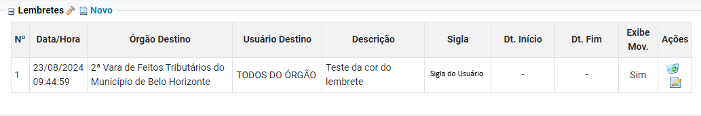

# CONFIGURACOES PERSONALIZADAS IV - Inicializacao_ Lembretes e Localizadores _1_

*Documento eProc - Material de Treinamento*

---

---

---

**SUMÁRIO**

**8. INICIALIZAÇÃO. .. .. .. .. .. .. .. .. .. .. .. .. .. .. .. .. .. .. .. .. .. .. .. .. .. .. .. .. .. .. .. .. .. .. .. .. .. .. .. .. .. .. .. .. .. .. .. .. .. .. .. .. .. .. .. .. .. .. .. .. .. .. .. .. .. .. . 3**
<small>8. 1. Dicas. .. .. .. .. .. .. .. .. .. .. .. .. .. .. .. .. .. .. .. .. .. .. .. .. .. .. .. .. .. .. .. .. .. .. .. .. .. .. .. .. .. .. .. .. .. .. .. .. .. .. .. .. .. .. .. .. .. .. .. .. .. .. .. .. .. .. .. .. .. .. .. .. .. .. 3</small><small>8. 2. Perfil Padrão. .. .. .. .. .. .. .. .. .. .. .. .. .. .. .. .. .. .. .. .. .. .. .. .. .. .. .. .. .. .. .. .. .. .. .. .. .. .. .. .. .. .. .. .. .. .. .. .. .. .. .. .. .. .. .. .. .. .. .. .. .. .. .. .. .. .. .. .. 4</small><small>8. 3. Página Inicial do Sistema. .. .. .. .. .. .. .. .. .. .. .. .. .. .. .. .. .. .. .. .. .. .. .. .. .. .. .. .. .. .. .. .. .. .. .. .. .. .. .. .. .. .. .. .. .. .. .. .. .. .. .. .. .. .. .. .. .. .. 5</small>
**9. LEMBRETES. .. .. .. .. .. .. .. .. .. .. .. .. .. .. .. .. .. .. .. .. .. .. .. .. .. .. .. .. .. .. .. .. .. .. .. .. .. .. .. .. .. .. .. .. .. .. .. .. .. .. .. .. .. .. .. .. .. .. .. .. .. .. .. .. .. .. .. .. .. .6**
<small>9. 1 Exibir Lembrete na Movimentação. .. .. .. .. .. .. .. .. .. .. .. .. .. .. .. .. .. .. .. .. .. .. .. .. .. .. .. .. .. .. .. .. .. .. .. .. .. .. .. .. .. .. .. .. .. .. .. .. .. .. .. 6</small><small>9. 2. Visualizar Lembretes Coloridos. .. .. .. .. .. .. .. .. .. .. .. .. .. .. .. .. .. .. .. .. .. .. .. .. .. .. .. .. .. .. .. .. .. .. .. .. .. .. .. .. .. .. .. .. .. .. .. .. .. .. .. .. .. .. 7</small>
**10. LOCALIZADORES. .. .. .. .. .. .. .. .. .. .. .. .. .. .. .. .. .. .. .. .. .. .. .. .. .. .. .. .. .. .. .. .. .. .. .. .. .. .. .. .. .. .. .. .. .. .. .. .. .. .. .. .. .. .. .. .. .. .. .. .. .. .. .. .. .. 8**
<small>10. 1. Esmaecer Localizadores sem Processo. .. .. .. .. .. .. .. .. .. .. .. .. .. .. .. .. .. .. .. .. .. .. .. .. .. .. .. .. .. .. .. .. .. .. .. .. .. .. .. .. .. .. .. .. .. .. . 8</small><small>10. 2. Lista de Processos por Localizador. .. .. .. .. .. .. .. .. .. .. .. .. .. .. .. .. .. .. .. .. .. .. .. .. .. .. .. .. .. .. .. .. .. .. .. .. .. .. .. .. .. .. .. .. .. .. .. .. .. .. 9</small><small>10. 3. Troca de Localizadores Avançada. .. .. .. .. .. .. .. .. .. .. .. .. .. .. .. .. .. .. .. .. .. .. .. .. .. .. .. .. .. .. .. .. .. .. .. .. .. .. .. .. .. .. .. .. .. .. .. .. .. .. 10</small><small>10. 4. Visualização Alternativa do Histórico de Localizadores. .. .. .. .. .. .. .. .. .. .. .. .. .. .. .. .. .. .. .. .. .. .. .. .. .. .. .. .. .. .. .. .. .. .11</small>

---

**CONFIGURAÇÕES PERSONALIZADAS**

As configurações personalizadas no eproc permitem que os usuários ajustem seu perfil de acordo

com suas necessidades e preferências. Essas opções podem incluir modificações na interface,

notificações, visualização de documentos, entre outras funcionalidades que facilitam o uso da

plataforma de forma mais eficiente e personalizada. Isso garante uma experiência de navegação e

utilização mais alinhada às necessidades específicas de cada usuário.

Todas as alterações realizadas no painel de configurações serão**salvas automaticamente**, sem a

necessidade de confirmação pelo usuário. Para visualizar as mudanças aplicadas, basta atualizar a

página.
****8. INICIALIZAÇÃO****
**8. 1. Dicas**

Esta opção permite que o sistema exiba**dicas úteis para o usuário na página inicial**. Por padrão,

está configurada como ativada, permitindo a exibição de uma caixa com informações úteis.

**Observação:**a caixa de dicas é temporária e se fecha automaticamente após 30 segundos.

---

Para desativar essa função, o usuário deverá clicar na caixa de seleção "Ativado". Assim, o sistema

não exibirá a caixa de dicas. ​

**8. 2. Perfil Padrão**

Ao fazer login no sistema, o usuário tem a opção de escolher entre os perfis cadastrados no

sistema eproc, caso tenha mais de um perfil.

Por meio da configuração "perfil padrão", o usuário poderá escolher um dos perfis cadastrados

para ser**selecionado automaticamente**ao fazer login no sistema. Nesse caso, a página inicial do

perfil padrão será**aberta diretamente**, sem exibir a tela para escolha de perfil.

Para definir um perfil como padrão, é necessário clicar na caixa de seleção correspondente e

escolher o perfil desejado. Outra maneira de definir um perfil como padrão é através da opção

"definir usuário padrão", localizada no canto superior direito da tela de perfis que aparece logo

após o login no sistema.

---

**Observação:**Se for necessária a troca entre os perfis do usuário após o login, a alteração poderá

ser realizada pela caixa de seleção localizada no menu superior do sistema, à esquerda, onde serão

exibidas as opções de perfis cadastrados pelo usuário.

**8. 3. Página Inicial do Sistema**

Esta opção permite ao usuário**definir um painel para ser a página inicial do sistema ao efetuar o**

**seu login**. Diversas opções de painéis são disponibilizadas, especificadas de acordo com as funções

existentes no sistema eproc, considerando as funções e permissões de cada tipo de perfil que o

usuário possui.

---

Por padrão, a página inicial do sistema é configurada na opção "Página Inicial", que exibe o painel

do usuário. Para alterá-la, o usuário deverá escolher entre as opções disponíveis na caixa de

seleção.

A Página Inicial, além de ser o painel exibido após o login, também é identificada pelo

ícone ”Página Inicial” ( ). Ao clicar nesse ícone, o usuário será redirecionado para a página

inicial configurada ou padrão.

**9. LEMBRETES**

**9. 1 Exibir Lembrete na Movimentação**

Esta opção de configuração, uma vez ativada, deixa como padrão marcada a opção “exibir

lembrete na movimentação do processo”, ao criar um lembrete.

Por padrão, essa opção é configurada como desativada, portanto, a opção "exibir lembrete na

movimentação do processo" permanecerá desmarcada ao criar um novo lembrete.

---

No entanto, é possível ao usuário definir a marcação da caixa de seleção “exibir lembrete na

movimentação do processo” como padrão para todos os novos lembretes. Para isso, é necessário

clicar na caixa de seleção “Desativado” da configuração.

**9. 2. Visualizar Lembretes Coloridos**

O sistema eproc permite a criação de lembretes em 5 (cinco) cores diferentes, que podem ser

escolhidas pelo usuário no momento da criação ou edição do lembrete.

​

Assim, se a configuração “visualizar lembretes coloridos” estiver ativada, o sistema exibirá os

lembretes, sejam eles criados pelo próprio usuário ou por outros perfis, na cor que o usuário

criador tiver definido. ​

---

​

Por padrão, essa opção é configurada como ativada, mas o usuário poderá desativá-la clicando na

caixa de seleção “Ativado”. Nesse caso, os lembretes serão exibidos no formato padrão do sistema,

como uma caixa de informação, conforme a seguir.

**10. LOCALIZADORES**

**10. 1. Esmaecer Localizadores sem Processo**

Na tela "Meus Localizadores", que pode ser acessada por meio do ícone “

“,

se

essa

configuração estiver ativada, os localizadores que não contiverem processos

serão exibidos

em uma cor mais clara, diferenciando-os dos localizadores que possuem processos, o que facilita a

identificação visual.

---

Para ativar essa opção, basta clicar na caixa de seleção “Desativado”.

Por padrão, essa configuração virá desativada. Portanto, os localizadores serão exibidos de forma

igual, independentemente de haver ou não processos associados a eles.

**10. 2. Lista de Processos por Localizador**

Essa opção**estabelece um critério padrão de busca para a tela “Lista de Processos por**

**Localizador**”, o qual já permanecerá marcado como regra.

---

Para ativar um critério padrão, o usuário deverá clicar na caixa de seleção e, após, selecionar o

critério que desejar como padrão entre “E” ou “OU.**O critério escolhido será o que permanecerá**

**marcado como regra, mas no momento da busca, é possível que o usuário o altere**, clicando na

opção correspondente ao critério pretendido.

**10. 3. Troca de Localizadores Avançada**

Esta opção**permite o gerenciamento de localizadores por meio da página do processo de forma**

**rápida**. Se ativada, o usuário poderá inserir, modificar e excluir localizadores do processo na

própria página inicial do processo. Para isso, basta clicar em um dos localizadores que será aberta

uma caixa para gerenciamento rápido dos localizadores.

Por meio dessa configuração, o usuário pode incluir e excluir localizadores, além de alterar a

ordem, clicando e arrastando o localizador desejado.

Como padrão, essa opção é configurada como ativada, mas é possível desativá-la ao clicar na caixa

de seleção “Ativado”. Se desativada a opção, o gerenciamento de localizadores será feito por meio

da tela “Localizadores do Processo”, que será aberta ao clicar em um dos localizadores na capa do

processo.

---

*(Tela Localizadores do Processo)*

**10. 4. Visualização Alternativa do Histórico de Localizadores**

Por meio do ícone "Histórico Processo" ( ), localizado ao lado da lista de localizadores do

processo, é possível acessar o histórico de gerenciamento de localizadores para o processo em

questão. Nesse caso, se a opção "visualização alternativa do histórico de localizadores" estiver

ativada, o histórico será exibido de forma mais visual e intuitiva.

​

---

Como padrão, a opção “visualização alternativa do histórico de localizadores” é configurada como

ativada, mas é possível que o usuário a desative, ao clicar na caixa de seleção “Ativado”. Nesse

caso, o histórico de localizadores será exibido da seguinte forma:

