# CONFIGURACOES PERSONALIZADAS V - Minutas_ Partes e Outros _1_ _1_

*Documento eProc - Material de Treinamento*

---

---

---

**SUMÁRIO**

**11. MINUTAS. .. .. .. .. .. .. .. .. .. .. .. .. .. .. .. .. .. .. .. .. .. .. .. .. .. .. .. .. .. .. .. .. .. .. .. .. .. .. .. .. .. .. .. .. .. .. .. .. .. .. .. .. .. .. .. .. .. .. .. .. .. .. .. .. .. .. .. .. .. .. 3**
<small>11. 1. Controle de Alterações - 1. Sempre Exibir as Modificações Destacadas. .. .. .. .. .. .. .. .. .. .. .. .. .. .. .. .. .. .. .. .. .. . 3</small><small>11. 2. Controle de Alterações - 2. Lembrar Escolha Recente sobre Exibição de Modificações. .. .. .. .. .. .. .. .. .. .. 4</small><small>11. 3. Controle de Alterações - 3. Destacar Conteúdo Inserido sem Modificações. .. .. .. .. .. .. .. .. .. .. .. .. .. .. .. .. .. .. 5</small><small>11. 4. Controle de Alterações - 4. Destacar Conteúdo Inserido sem Modificação. .. .. .. .. .. .. .. .. .. .. .. .. .. .. .. .. .. .. . 6</small><small>11. 5. Controle de Alterações - 5. Sempre Exibir Conteúdo de Origem ao Visualizar a Minuta. .. .. .. .. .. .. .. .. . 6</small><small>11. 6. Cor Fixa para Seleção de Texto no Editor. .. .. .. .. .. .. .. .. .. .. .. .. .. .. .. .. .. .. .. .. .. .. .. .. .. .. .. .. .. .. .. .. .. .. .. .. .. .. .. .. .. .. .. .. .. 7</small><small>11. 7. Exibir Agendamento na Visualização de Minuta. .. .. .. .. .. .. .. .. .. .. .. .. .. .. .. .. .. .. .. .. .. .. .. .. .. .. .. .. .. .. .. .. .. .. .. .. .. .. .. . 7</small><small>11. 8. Listar Modelos Institucionais na Criação de Minutas. .. .. .. .. .. .. .. .. .. .. .. .. .. .. .. .. .. .. .. .. .. .. .. .. .. .. .. .. .. .. .. .. .. .. .. .. 8</small><small>11. 9. Marcações - 1. Sempre Exibir as Marcações ao Visualizar a Minuta. .. .. .. .. .. .. .. .. .. .. .. .. .. .. .. .. .. .. .. .. .. .. .. .. . 9</small><small>11. 10. Marcações - 2. Lembrar Escolha Recente sobre Exibição de Marcações. .. .. .. .. .. .. .. .. .. .. .. .. .. .. .. .. .. .. .. .. 9</small><small>11. 11. Marcações - 3. Sempre Exibir as Marcações em Modo de Edição. .. .. .. .. .. .. .. .. .. .. .. .. .. .. .. .. .. .. .. .. .. .. .. .. .. 9</small><small>11. 13. Marcações - 5. Definir Automaticamente uma Descrição Padrão para as Marcações das Minutas. ..</small><small>11</small><small>11. 14. Status da Minuta ao Salvar e Sair. .. .. .. .. .. .. .. .. .. .. .. .. .. .. .. .. .. .. .. .. .. .. .. .. .. .. .. .. .. .. .. .. .. .. .. .. .. .. .. .. .. .. .. .. .. .. .. .. .. 12</small>
**12. PARTES. .. .. .. .. .. .. .. .. .. .. .. .. .. .. .. .. .. .. .. .. .. .. .. .. .. .. .. .. .. .. .. .. .. .. .. .. .. .. .. .. .. .. .. .. .. .. .. .. .. .. .. .. .. .. .. .. .. .. .. .. .. .. .. .. .. .. .. .. .. .. .. 13**

**13. OUTROS. .. .. .. .. .. .. .. .. .. .. .. .. .. .. .. .. .. .. .. .. .. .. .. .. .. .. .. .. .. .. .. .. .. .. .. .. .. .. .. .. .. .. .. .. .. .. .. .. .. .. .. .. .. .. .. .. .. .. .. .. .. .. .. .. .. .. .. .. .. .. 14**
<small>13. 1. Abrir Itens do Painel Clicando na Linha. .. .. .. .. .. .. .. .. .. .. .. .. .. .. .. .. .. .. .. .. .. .. .. .. .. .. .. .. .. .. .. .. .. .. .. .. .. .. .. .. .. .. .. .. .. . 14</small><small>13. 2. Destacar Link Clicado Mais Recentemente. .. .. .. .. .. .. .. .. .. .. .. .. .. .. .. .. .. .. .. .. .. .. .. .. .. .. .. .. .. .. .. .. .. .. .. .. .. .. .. .. .. .. .. 14</small>

---

**CONFIGURAÇÕES PERSONALIZADAS**

As configurações personalizadas no eproc permitem que os usuários ajustem seu perfil de acordo

com suas necessidades e preferências. Essas opções podem incluir modificações na interface,

notificações, visualização de documentos, entre outras funcionalidades que facilitam o uso da

plataforma de forma mais eficiente e personalizada. Isso garante uma experiência de navegação e

utilização mais alinhada às necessidades específicas de cada usuário.

Todas as alterações realizadas no painel de configurações serão**salvas automaticamente**, sem a

necessidade de confirmação pelo usuário. Para visualizar as mudanças aplicadas, basta atualizar a

página.

**11. MINUTAS**

**11. 1. Controle de Alterações - 1. Sempre Exibir as Modificações Destacadas**

Como padrão, as alterações realizadas em uma minuta não serão destacadas, sendo apenas

mostrado o texto da minuta conforme foi salvo.

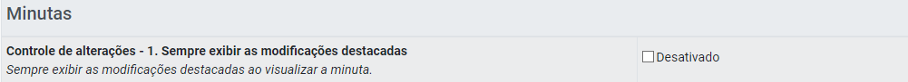

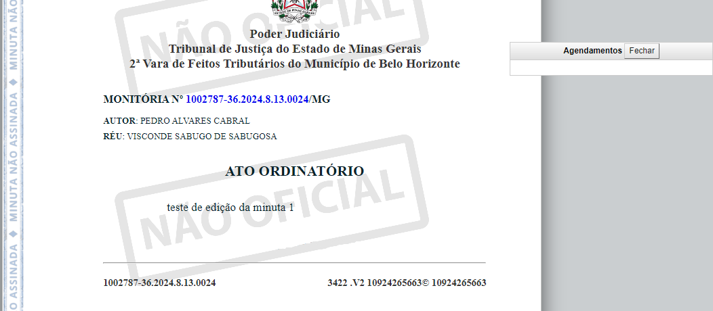

---

Na tela de alteração/edição de uma minuta, se a opção "sempre exibir as modificações

destacadas" estiver ativada, as alterações realizadas na minuta serão automaticamente destacadas

em colorido pelo sistema. Para ativar essa opção, basta clicar na caixa de seleção “Desativado”.

​

**11. 2. Controle de Alterações - 2. Lembrar Escolha Recente sobre Exibição de**

**Modificações**

Esta opção**salvará a marcação que o usuário eventualmente tenha realizado na opção**

**“alterações” ou “marcações”**no menu superior da tela de edição de minutas, para que, sempre

que a minuta for aberta para edição, a marcação realizada anteriormente permaneça ativada. Para

ativar esta opção, o usuário deve clicar na caixa de seleção “Desativado”.

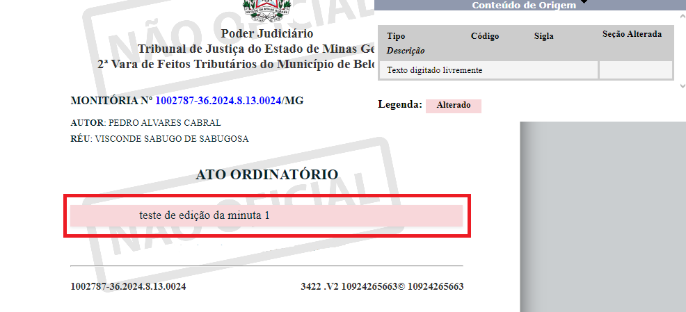

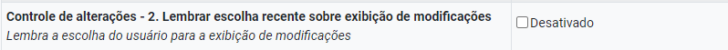

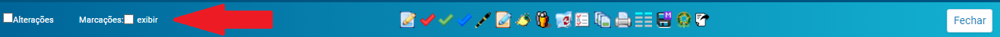

---

**11. 3. Controle de Alterações - 3. Destacar Conteúdo Inserido sem Modificações**

Esta opção permite que o sistema destaque na tela de visualização da minuta, pela cor amarela,

textos padrão inseridos na minuta, nos quais não foi realizada nenhuma alteração.

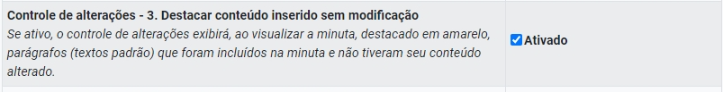

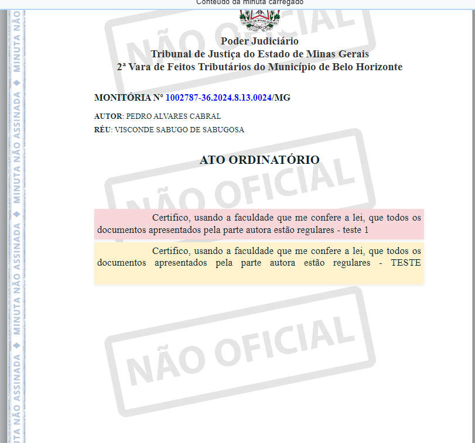

---

**11. 4. Controle de Alterações - 4. Destacar Conteúdo Inserido sem Modificação**

Se ativada, esta configuração permite que o sistema destaque na tela de visualização da minuta,

em vermelho, trechos de texto padrão que foram modificados após sua inserção.

**11. 5. Controle de Alterações - 5. Sempre Exibir Conteúdo de Origem ao Visualizar a**

**Minuta**

Esta opção permite que a caixa com os Conteúdos de Origem seja exibida de forma expandida,

como padrão.

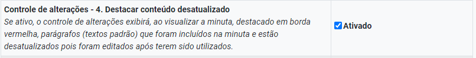

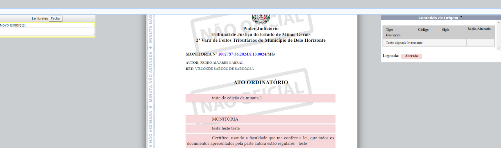

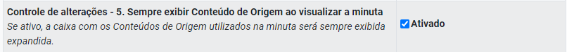

---

​

**11. 6. Cor Fixa para Seleção de Texto no Editor**

Esta configuração permite ao usuário definir uma cor padrão para a seleção de texto, sendo uma

cor fixa exibida apenas no eproc ou a cor configurada no navegador.

Para ativar a cor fixa, clicar no checkbox.

**11. 7. Exibir Agendamento na Visualização de Minuta**

Permite que seja exibida, na tela de visualização da minuta,**uma caixa de informações com o**

**agendamento de evento a ser lançado**após a inclusão da minuta no processo. Por padrão, esta

configuração permanece ativada, mas é possível ao usuário desativá-la ao clicar na caixa de

seleção “Ativado”, para que a caixa de informações de evento agendado não seja exibida.

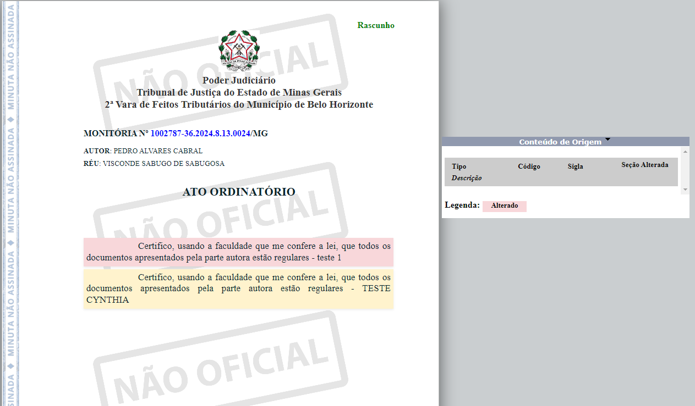

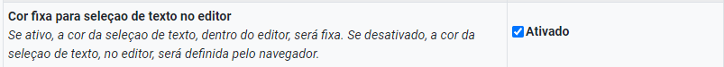

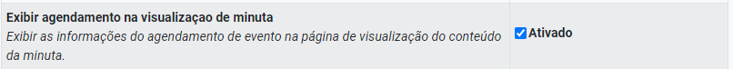

---

**Observação:**O evento agendado a que se refere esta configuração é selecionado na tela inicial de

criação da minuta ou por meio da opção “alterar dados cadastrais da minuta", disponível na coluna

“recursos disponíveis” da aba de minutas do processo ou, ainda, no menu de visualização da

minuta.

**11. 8. Listar Modelos Institucionais na Criação de Minutas**

Ao criar uma minuta, se esta opção estiver ativada, permite que sejam exibidos na tela dos dados

cadastrais da minuta, na opção “Tipo de documento/Modelo” os modelos criados por outros

usuários da unidade.

Por padrão, essa opção é configurada como ativada. Mas é possível desativá-la ao clicar na caixa de

seleção “Ativado”. Nesse caso, somente serão exibidos os modelos padrão do sistema.

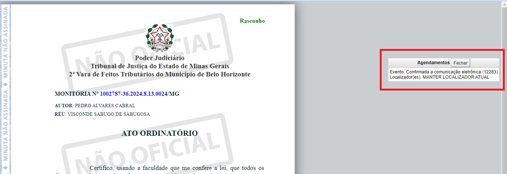

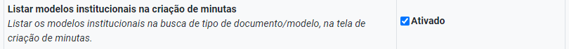

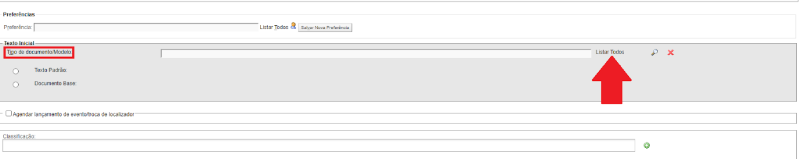

---

**11. 9. Marcações - 1. Sempre Exibir as Marcações ao Visualizar a Minuta**

Se ativada, as marcações serão sempre exibidas ao abrir a visualização da minuta.

Para ativar, basta clicar na caixa de seleção “Desativado”.

Se desativada, as marcações somente serão exibidas se o usuário clicar no checkbox “Marcações”

no menu superior à esquerda, da tela de visualização da minuta.

**11. 10. Marcações - 2. Lembrar Escolha Recente sobre Exibição de Marcações**

Esta opção deixa pré-configurada a exibição de marcações nas minutas de acordo com o que foi

selecionado pelo usuário no último acesso.

Para ativá-la, clicar no checkbox.

**11. 11. Marcações - 3. Sempre Exibir as Marcações em Modo de Edição**

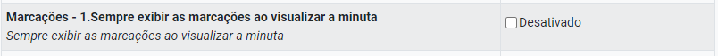

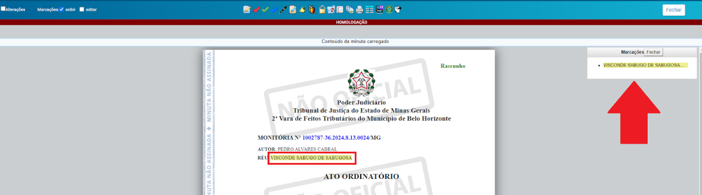

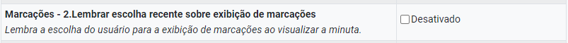

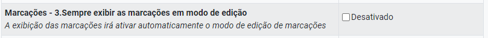

---

Se essa configuração estiver ativada, ao clicar na caixa de seleção "Marcações exibir" (localizada no

menu superior da tela de visualização da minuta) para exibir as marcações, a opção "editar"

também será automaticamente marcada, permitindo a edição das marcações.

Para ativar esta configuração, basta clicar na caixa de seleção “Desativado”. ​

​

​

​

​

**11. 12. Marcações - 4. Ocultar Índice de Marcações**

Como padrão, é exibida uma caixa de informações contendo uma lista das marcações realizadas na

minuta, cujos itens são clicáveis e remetem direto à marcação.

No entanto, através da configuração de “ocultar índice de marcações”, é possível ao usuário

desativar essa caixa de informações. Para isso, basta clicar na caixa de seleção “Desativado” e a

caixa de informação com o índice de marcações não será mais exibida.

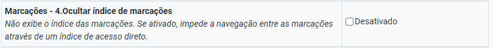

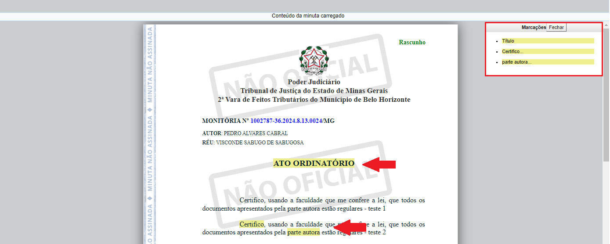

---

**11. 13. Marcações - 5. Definir Automaticamente uma Descrição Padrão para as**

**Marcações das Minutas**

Ao criar uma marcação na minuta, será aberta uma caixa de edição para que o usuário possa

livremente definir a descrição da marcação, a qual será exibida na caixa de índice de marcações.

​

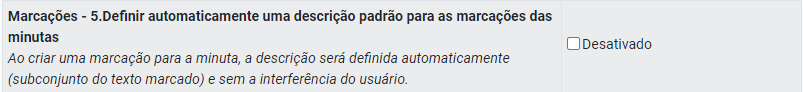

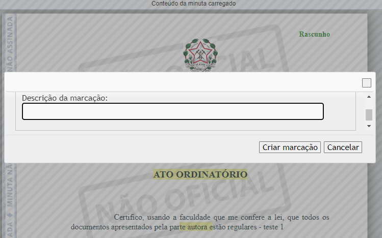

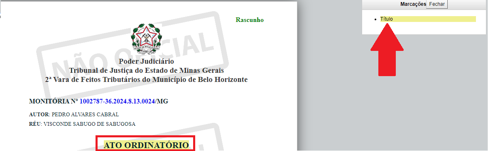

---

No entanto, se a configuração de “definir automaticamente uma descrição padrão para as

marcações das minutas” estiver ativada, não será exibida a caixa de descrição da marcação, sendo

definido automaticamente como termo da marcação o próprio texto marcado.

Caso o usuário opte por manter a descrição padrão, sem opção de definir a descrição da marcação,

deverá clicar na caixa de seleção “Desativado” para ativar a definição automática.

**11. 14. Status da Minuta ao Salvar e Sair**

Esta opção permite definir, como padrão, uma destinação para a minuta, dentre as opções:

●​ Manter a minuta no status atual

●​ Encaminhar minuta para conferência

●​ Definir minuta como conferida

●​ Encaminhar minuta para assinatura

●​ Retornar minuta para rascunho

Para selecionar uma destinação padrão, basta selecioná-la por meio da caixa de seleção. Desta

forma, assim que o usuário salvar a minuta e fechá-la, o*status*pré-definido será aplicado à minuta

automaticamente.

**Observação:**Mesmo que seja definido um status padrão para a minuta, ainda será possível

alterá-lo através do menu superior da tela de edição da minuta ou por meio dos recursos

disponíveis na aba de minutas.

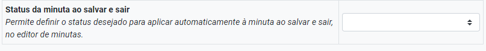

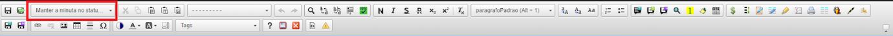

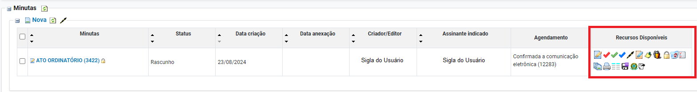

---

**12. PARTES**

​

​

Quando o processo possui mais uma parte cadastrada, seja autor ou réu, como padrão, na página

inicial do processo, todas as partes cadastradas são exibidas.

No entanto, essa configuração, uma vez ativada,**oculta as demais partes, mostrando somente**

**uma parte para cada polo.**Neste caso, é exibido, como link, a informação “e outros”. Para acessar

as demais partes basta clicar em “e outros”.

Para ativar a opção de “ocultar demais partes da capa do processo” é necessário clicar na caixa de

seleção “Desativado”.

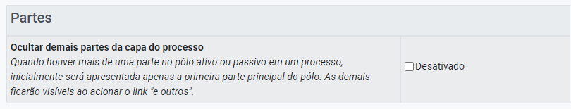

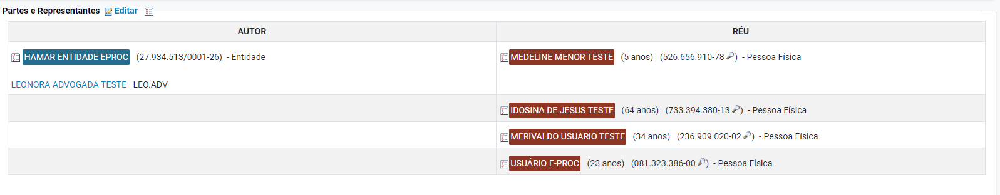

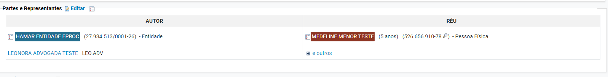

---

**13. OUTROS**

**13. 1. Abrir Itens do Painel Clicando na Linha**

Nas listas de processos por localizador exibidas nos painéis dos perfis de usuários, como padrão,

somente é clicável para abrir o item, o número indicativo da quantidade de processos naquele

localizador.

No entanto, se ativada a opção “abrir itens do painel clicando na linha” também será possível abrir

o item ao clicar em qualquer lugar daquela linha de localizador.

Para ativar essa opção, clicar na caixa de seleção “Desativado”.

**13. 2. Destacar Link Clicado Mais Recentemente**

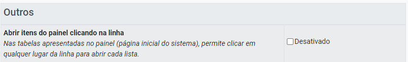

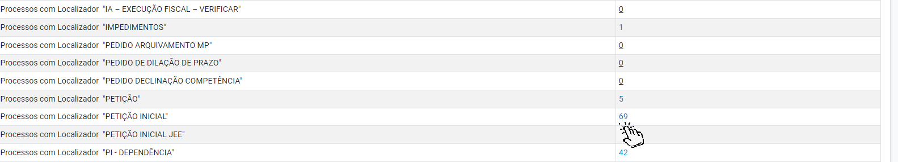

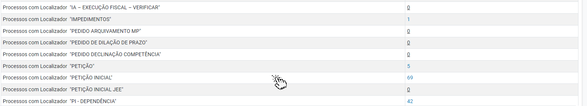

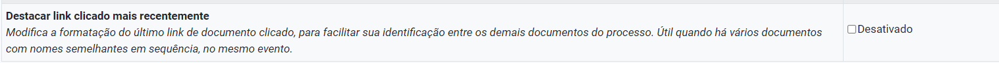

---

Se ativada, essa configuração destacará em uma cor diferente os links dos documentos

recentemente abertos pelo usuário, facilitando sua identificação em meio a uma lista de diversos

documentos. ​ ​

Para ativar essa configuração, clicar na caixa de seleção “Desativado”.

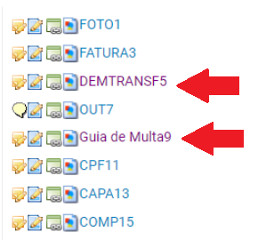
