# Eproc para Unidade Judicial – Módulo Básico

*Documento eProc - Material de Treinamento*

---

---

<small>Imagem decorativa de capa: símbolo do eproc, composto por ilustração de 3 círculos azuis com intersecção entre si,</small><small>e seu logotipo ao lado.</small>
*PORTAL NACIONAL DO CONHECIMENTO EPROC*

**CONSULTA PROCESSUAL**

# Eproc para Unidade Judicial – Módulo Básico

Atualizado em**16/05/2025.**

---

**SUMÁRIO**

**CONSULTA PROCESSUAL**

**CONSULTA PROCESSUAL**

**3**
<small>Na tela inicial do sistema</small><small>3</small><small>No menu lateral</small><small>5</small>
**CAPA DO PROCESSO**

**7**

**CRÉDITOS**

**13**

---

**CONSULTA PROCESSUAL****|**Eproc para Unidade Judicial – Módulo Básico
<small>**3**</small>
**CONSULTA PROCESSUAL**

No eproc, a busca por processo pode ser feita a partir de diversos parâmetros: número, nome das

partes, CPF etc. Detalharemos as duas formas de pesquisa a seguir.

**Na tela inicial do sistema**

Na tela inicial do sistema, o campo de consulta processual localizado na barra superiorpossibilita

digitar os números do processo que vêm após a sequência de zeros e antes do ano. Feito isso, é

possível clicar no ícone de uma lupa, para realizar a busca na mesma janela, ou no ícone**“Abrir em**

**nova janela”**, representado por um quadrado com uma seta diagonal.
<small>**Descrição da imagem**: tela “Consulta Processual” com destaque para o campo de pesquisa e acesso ao processo.</small>
No exemplo acima, após digitado “4537” no campo de consulta processual e teclado o “Enter”, o

site exibiu como resultado todos os processos que contêm o número “4537”, independentemente

do ano.

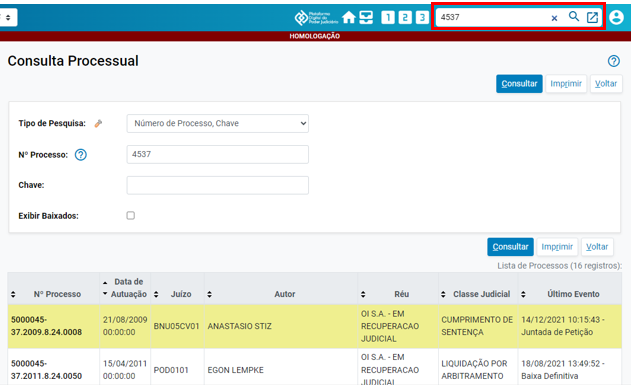

---

**CONSULTA PROCESSUAL****|**Eproc para Unidade Judicial – Módulo Básico
<small>**4**</small><small>**Descrição da imagem**: visualização em detalhe dos resultados da consulta por “4537” com destaques aos números</small><small>completos dos processos.</small>
Se digitado “4537/2009” e teclado o “Enter”,o sistema consultará apenas o processo de número

reduzido “4537” do ano de 2009:
<small>**Descrição da imagem**: tela de resultados da consulta “4537/2009”, destaque à barra de pesquisa por processo no</small><small>topo e ao número completo do processo na tela aberta.</small>
Na consulta, o sistema exibirá todas as informações do processo divididas por seções, como “Capa

do processo”, “Lembretes”, “Assuntos”, “Assinatura” etc.

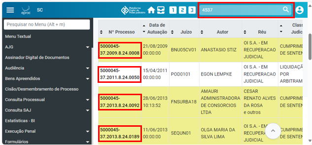

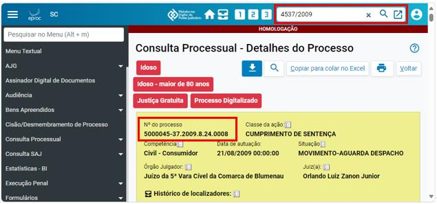

---

**CONSULTA PROCESSUAL****|**Eproc para Unidade Judicial – Módulo Básico
<small>**5**</small>
**No menu lateral**

É possível acessar a tela**“Consulta Processual”**dentro do item**“Consultar Processos”**do**menu**

**lateral**.
<small>**Descrição da imagem**: tela “Consulta Processual” aberta, com destaque à sua localização no menu lateral e ao menu</small><small>expandido do item “Tipo de Pesquisa” no centro da tela.</small>
Na página aberta, o eproc permite especificar o tipo de pesquisa. Um deles é o tipo**“Número de**

**Processo, Chave”**, que obedece a mesma lógica do campo de consulta processual visto

anteriormente, por número simplificado ou completo do processo, com ou sem o ano.
<small>**Descrição da imagem**: tela “Consulta Processual”, destaque ao item “Nº Processo” com o ícone de uma interrogação</small><small>exibindo uma caixa de diálogo com o texto “Consulta simplificada por número de processo”.</small>
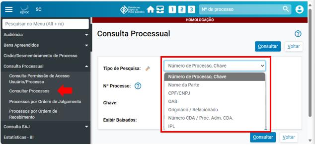

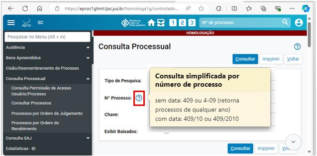

---

**CONSULTA PROCESSUAL****|**Eproc para Unidade Judicial – Módulo Básico
<small>**6**</small>
No tipo**“Nome da Parte”**, após digitado o nome, o usuário deverá especificar o**“Tipo de Parte”**:

autor, réu, interessado,*amicus curiae*, conciliador, testemunha autor, testemunha réu etc.

O eproc usa a base de dados da Receita Federal. Por isso, uma consulta pelo nome de uma das

partes não necessariamente significa que há um processo cadastrado em relação a ela. Da mesma

forma, se a consulta for feita a partir de um nome comum, o sistema exibirá uma lista de nomes

completos e os respectivos CPFs e CNPJs para que a busca seja refinada.

**Atenção**

Para pesquisar processos a partir do nome da vítima, deve-se selecionar o tipo

“Interessado”.

A pesquisa pode ser feita pelo número do CNPJ da pessoa jurídica ou, se pessoa física, pelo CPF.

O sistema também permite selecionar a classe processual, realizar uma pesquisa fonética, incluir

partes interessadas, buscar por variações do nome digitado e consultar processos já baixados.
<small>**Descrição da imagem**: tela “Consulta Processual” aberta, com destaque aos campos de preenchimento.</small>
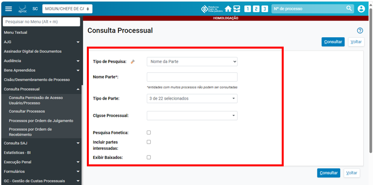

---

**CONSULTA PROCESSUAL****|**Eproc para Unidade Judicial – Módulo Básico
<small>**7**</small>
**CAPA DO PROCESSO**

A capa do processo é uma seção da página que contém informações importantes, como:

▪ Número do processo

▪ Classe da ação

▪ Competência

▪ Data de autuação

▪ Situação – visível para o público externo

▪ Órgão Julgador

▪ Juiz(a)

▪ Localizadores, visível apenas para o público interno

▪ Processos relacionados (no eproc os processos relacionados equivalem aos processos

apensados).
<small>**Descrição da imagem**: capa de processo do Juizado Especial Cível com as informações citadas acima.</small><small>**Descrição da imagem**: capa de processo cível com as informações citadas acima.</small>
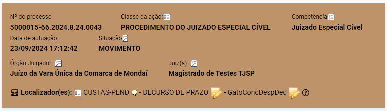

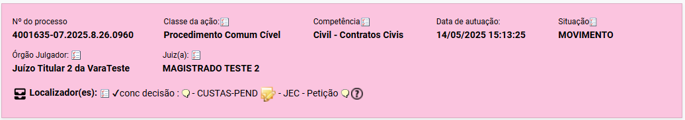

---

**CONSULTA PROCESSUAL****|**Eproc para Unidade Judicial – Módulo Básico
<small>**8**</small>
**Atenção**

O sistema eproc reproduz as cores das capas dos processos da Justiça Federal. A cor

da capa muda de acordo com a classe processual.

**Lembretes**

Os lembretes servem para os usuários internos, podendo ser direcionados a procuradores dos

processos e outros externos.
<small>**Descrição da imagem**: seção “Lembretes” da capa do processo.</small>
**Assuntos**

A seção de assuntos do processo fica logo abaixo dos lembretes.

Na capa do processo, o botão “Editar” permite remover, inserir e alterar os assuntos e sua ordem

de exibição. O assunto principal será sempre exibido em negrito e antes dos demais.
<small>**Descrição da imagem**: seção “Assuntos” da capa do processo.</small>
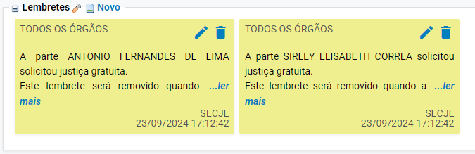

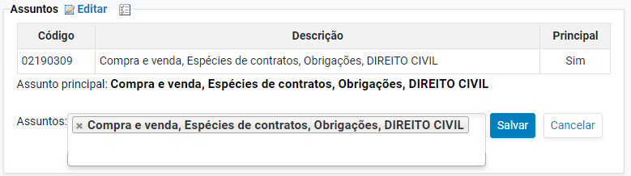

---

**CONSULTA PROCESSUAL****|**Eproc para Unidade Judicial – Módulo Básico
<small>**9**</small>
**Atenção**

Os assuntos do processo devem ser o mais assertivo possível e corresponder

exatamente aos fatos descritos nos autos, sendo um referencial na fiscalização e

análise dos processos por parte do CNJ junto aos Tribunais e às Varas.

**Partes e Representantes**

Na capa do processo, o sistema exibe os autores, os réus e os interessados, com possibilidade de

inclusão, exclusão e alteração dos dados das partes diretamente na capa do processo.

Abaixo do nome de cada parte, o sistema exibe o nome do respectivo procurador com o número

de inscrição na OAB.

**Importante**

Um sinal de verificação verde ao lado do nome e CPF ou CNPJ da parte significa que

ela está com o cadastro de acordo com os dados da Receita Federal.

Se o sinal de verificação estiver amarelo ou com um ponto de interrogação, deve-se

acessar o cadastro da parte clicando em seu nome para atualizar os dados.
<small>**Descrição da imagem**: seção “Partes e Representantes” da capa do processo com destaque para os sinais de</small><small>verificação na cor verde.</small>
**Minutas**

O eproc reúne todos os expedientes emitidos no processo (despachos, sentenças, decisões,

mandados etc. ) na seção**“Minutas”**.

Se a caixa de seleção “Exibir Anexadas ao Processo” for marcada, somente as minutas que já estão

no processo serão listadas. Se não, o sistema mostrará também as minutas em edição.

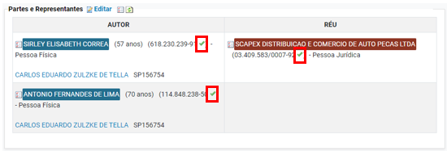

---

**CONSULTA PROCESSUAL****|**Eproc para Unidade Judicial – Módulo Básico
<small>**10**</small>
Há também as opções “Exibir Excluídas/Anuladas” e “Manter minutas em aberto”.
<small>**Descrição da imagem**: seção “Minutas” da capa do processo.</small>
**Informações Adicionais**

As informações dessa seção podem ser alteradas pelo botão “Editar”, localizado no topo.

É possível consultar a chave do processo e, se necessário, gerar nova chave.
<small>**Descrição da imagem**: seção “Informações Adicionais” da capa do processo.</small>
**Ações**

Esta seção reúne todas as atividades que podem ser realizadas no processo: acessar a “árvore”

deste, citar, intimar, movimentar, associar procurador a parte, entre outras.

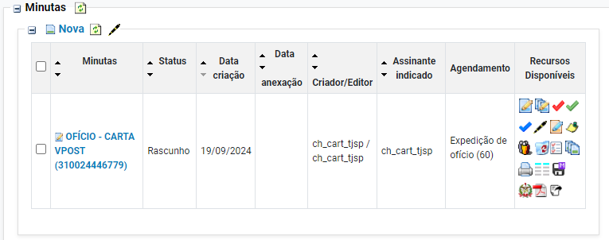

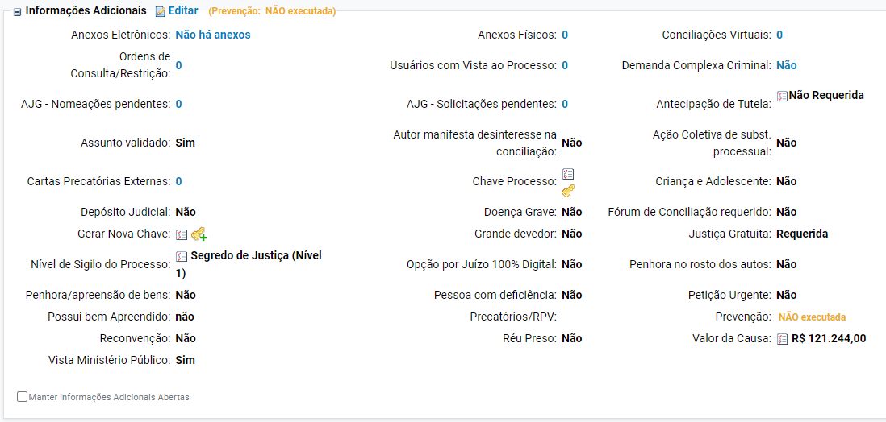

---

**CONSULTA PROCESSUAL****|**Eproc para Unidade Judicial – Módulo Básico
<small>**11**</small><small>**Descrição da imagem**: seção “Ações” da capa do processo.</small>
**Botões facilitadores e preferências**

Logo abaixo da seção**“Ações”**, o sistema apresenta alguns botões que facilitam a realização de

atividades:**Minutar**e**Preferências**(de minutas)**, Movimentar**e**Preferências**(de movimentação),

**Intimar**e**Preferências**(de intimação).
<small>**Descrição da imagem**: barra de botões facilitadores.</small>
**Tabela de eventos**

“Eventos” são o equivalente às “movimentações” do processo.

Aqui, o eproc exibe todos os eventos realizados no processo e suas especificidades.

O usuário pode filtrar por eventos com documentos, eventos de decisão, eventos externos e

eventos marcados como relevantes.

Um evento é marcado como “relevante” se a ele for atribuída uma estrela de destaque, localizada

em coluna própria na tabela de eventos, conforme imagem abaixo.
<small>**Descrição da imagem**: seção “Eventos” com destaques ao menu de filtros e ao ícone de uma estrela ao lado do</small><small>número de um processo.</small>

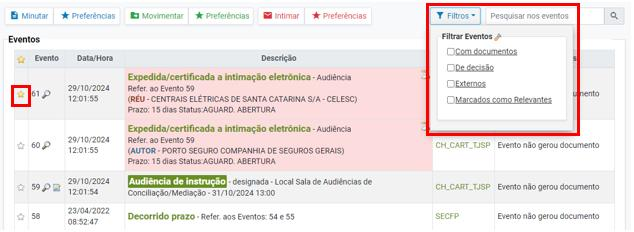

---

**CONSULTA PROCESSUAL****|**Eproc para Unidade Judicial – Módulo Básico
<small>**12**</small>
Além das seções descritas anteriormente, o eproc exibe na capa do processo uma barra com

botões de atividade para download completo do processo, nova consulta, cópia do processo para

colá-lo no Excel, impressão e retorno à tela anterior.
<small>**Descrição da imagem**: botões de atividade citados acima.</small>
**Importante**

Trataremos detalhadamente da capa do processo e todos os seus recursos ao longo

do curso**Eproc para Unidade Judicial****–****Módulo Intermediário**.

---

**CONSULTA PROCESSUAL****|**Eproc para Unidade Judicial – Módulo Básico

**CRÉDITOS**

**PORTAL NACIONAL DO CONHECIMENTO EPROC**

*Material desenvolvido pelo TJSP, utilizando a*

*base de homologação gentilmente cedida pelo TJSC e TJRS.*
