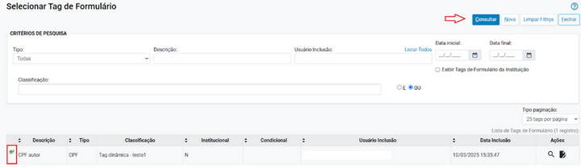
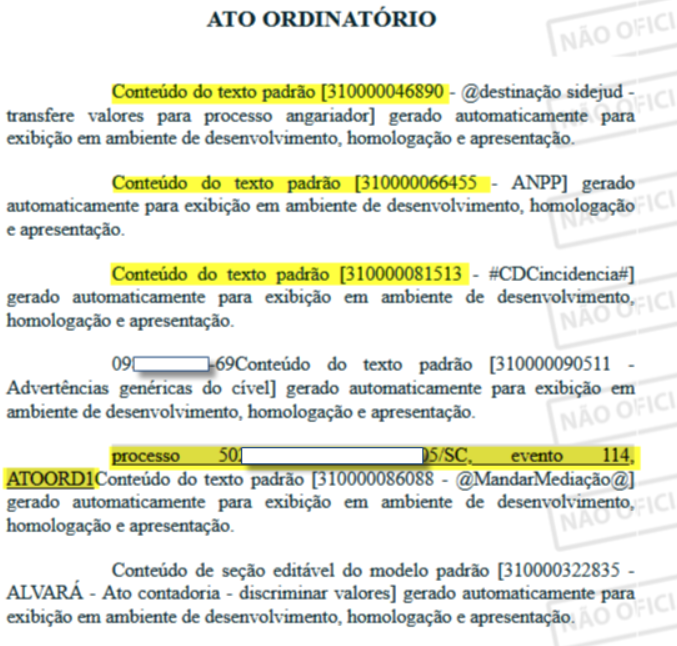

# CRIAÇÃO DO MECANISMO DE TAGS DE

*Documento eProc - Material de Treinamento*

---

---

# CRIAÇÃO DO MECANISMO DE TAGS DE

# FORMULÁRIO

---

## CRIAÇÃO DO MECANISMO DE TAGS DE

## FORMULÁRIO

A versão 9. 13 do eproc introduziu a funcionalidade que permite

ao usuário criar tags personalizadas para uso em modelos de

documentos e textos padrão.

Essas tags tornam o processo de preenchimento de documentos

mais eficiente, possibilitando a automação de diversos campos.

**Tipos de Tags Disponíveis:**

O usuário pode definir o tipo de tag ao criá-la, com as seguintes opções:

CPF

CNPJ

DATA

DINHEIRO

NÚMERO INTEIRO

OPCIONAL

OPCIONAL_LISTA

TEXTO

Cada tipo de tag possui campos específicos para preenchimento dos dados

necessários.

A tag OPCIONAL_LISTA é especial, pois permite ao usuário escolher uma

entre várias opções pré-definidas.

---

1. Acessar o Menu Textual: Vá até Minutas → Tags de Formulário.

2. Clicar em**"Nova"**.

## PASSO A PASSO PARA CRIAÇÃO DE

## UMA NOVA TAG:

---

3. Configuração da Nova Tag de Formulário:

Selecionar o Tipo de Tag: Escolha o tipo de tag desejada (CPF, CNPJ,

DATA, etc. ).

Descrição: Digite uma descrição para a tag.

Cadastrar a Classificação: Clique no ícone "+" para registrar a

classificação.

4. Salvar a Configuração: Após preencher as informações necessárias, salve a

tag para utilizá-la nos modelos de documentos e textos padrão.

---

**Inserção da Tag no Modelo ou Texto Padrão:**

Após criar a tag personalizada, você pode inseri-la facilmente nos modelos

de documentos ou textos padrão. Existem duas formas de fazer isso:

**1. Utilizando a Barra de Ferramentas do Editor:**

Dentro do**editor de texto**do modelo ou do texto padrão, clique na

opção**“Inserir Tag de Formulário”**na barra de ferramentas.

Escolha a**tag personalizada**que foi criada e insira-a no local desejado do

documento.

Ao clicar na ferramenta o sistema exibirá uma tela para seleção da tag:

Clique em “Consultar”.

Selecione a tag desejada clicando no ícone ao lado esquerdo da tag.

---

Ao utilizar, no momento da criação da minuta, um modelo/texto padrão que

contenha a tag de formulário, o sistema exibe uma tela intermediária

solicitando ao usuário que preencha os dados correspondentes à tag:

A tag**OPCIONAL_LISTA**permite ao usuário selecionar uma entre várias

opções pré-definidas.

Ao configurá-la, é possível definir um conteúdo específico para cada opção,

que será inserido automaticamente na minuta. Esse conteúdo pode ser um

**texto padrão**ou um**texto livre**.

---

O usuário pode cadastrar a tag combinando ambas as opções: uma baseada

em um texto padrão e outra permitindo a inserção de um texto livre.

**Texto Padrão:**

---

Tela da tag**OPCIONAL_LISTA**configurada:

---

Ao criar a minuta com a tag**OPCIONAL_LISTA**, quando o usuário selecionar

um modelo que contenha essa tag na tela de configuração da nova minuta, o

sistema exibirá uma tela para que ele escolha a opção desejada a ser inserida

no documento.

Além disso, é possível configurar a tag**OPCIONAL CONDICIONAL**. Ao

cadastrar uma tag do tipo**OPCIONAL**e marcar a opção Condicional, o

sistema criará uma condição.

Quando essa condição for atingida no processo, a informação previamente

configurada na tag será automaticamente inserida no documento conforme o

modelo.

---

Após inserir a tag configurada no modelo, sempre que um processo atender à

condição especificada — como, por exemplo, um valor da causa superior a

R$ 1. 000, 00 — o sistema incluirá automaticamente o texto correspondente

da tag na minuta.

---

---

**Resumo de criação de tags dinâmicas**

1) Criar a Tag

2) Inserir a Tag em um Modelo ou Texto Padrão

3) Em um processo, criar nova minuta

4) Ao escolher um modelo que contenha uma tag de formulário

cadastrada, o sistema exibirá uma tela intermediária solicitando que o

usuário preencha os dados correspondentes à tag.

---

**Novos tipos de tags**

A versão 9. 14 trouxe dois novos tipos de tags de formulário para a confecção

de minutas:**LINK_DOCUMENTO**e**OPCIONAL_LISTA_MULTIPLA.**

Além dos dois novos tipos de Tags, a forma de cadastramento de uma nova

tag ganhou os itens**Rótulo da Tag**e**Armazenar valor para**

**reutilização,**sendo:

**Rótulo da Tag:**corresponde a um “apelido” para a tag

**Armazenar valor para reutilização:**Grava o último valor (conteúdo)

da tag e o preenche na próxima utilização da mesma (funciona como um

copia e cola).

---

**Sobre as novos tipos de Tags**

**LINK_DOCUMENTO:**O novo tipo permite incluir em minutas, através de

uma tag, links de documentos copiados de outros processos do eproc de

forma muito mais ágil. Também é possível mudar o texto do link clicando 2x

sobre o item.

---

**OPCIONAL**

**LISTA**

**MÚLTIPLA:**

Essa

novidade

permite

duas

novas

funcionalidades:

1. A opção de selecionar várias tags para serem utilizadas em uma única

minuta; e

2. A opção de salvar diversos valores (conteúdo) dentro de uma única tag

Observe em comparação com a Tag**OPCIONAL_LISTA**. Nesta, ao editar

uma minuta a partir de um modelo na qual há uma tag**OPCIONAL_LISTA**

cadastrada, o sistema exibe a tela intermediária ao usuário que deve escolher

qual das opções disponíveis deseja inserir no documento.

Já a nova Tag de formulário**OPCIONAL_LISTA_MULTIPLA**, ao editar uma

minuta

a

partir

de

um

modelo

na

qual

há

uma

tag

**OPCIONAL_LISTA_MULTIPLA**

cadastrada,

o

sistema

exibe

a

tela

intermediária ao usuário que pode selecionar tanto várias tags para serem

utilizadas em uma única minuta, quanto salvar diversos valores (conteúdo)

dentro de uma única tag.

---

Observe

o

resultado

do

uso

de

uma

tag

do

tipo

**OPCIONAL_LISTA_MULTIPLA**na elaboração de um ato ordinatório.

---

A funcionalidade de tags personalizada traz mais eficiência e automação para

a criação de documentos e textos padrão.

Com diferentes tipos de tags disponíveis, os usuários podem configurar

campos específicos para preencher automaticamente informações essenciais,

reduzindo erros e otimizando o tempo de trabalho.

Ao dominar essa funcionalidade, os usuários tornam o preenchimento de

minutas mais ágil e preciso, garantindo padronização e produtividade no dia

a dia.

Experimente a criação de tags personalizadas e aproveite ao máximo essa

melhoria no sistema!
**Divisão de Apoio Judiciário****Diretoria de Suporte à Jurisdição de Primeiro Grau****Tribunal de Justiça do Estado de Santa Catarina**
SUPORTE

EPROC
