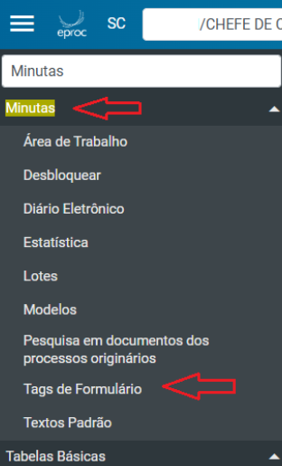
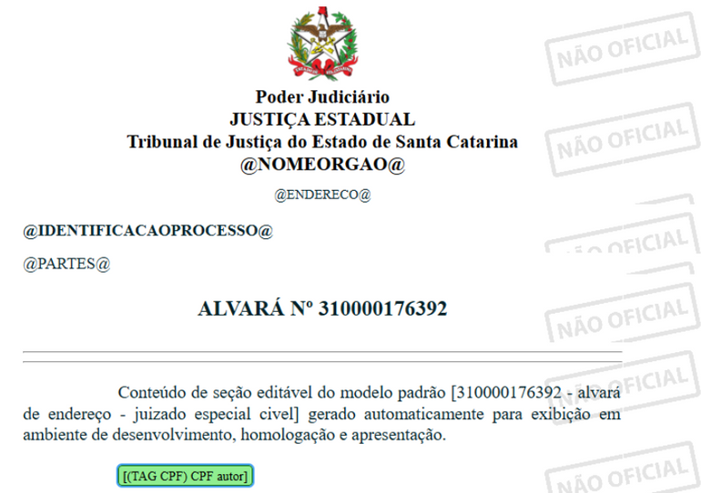
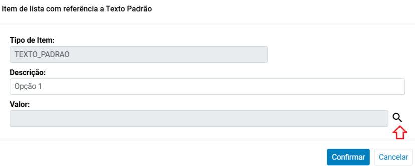
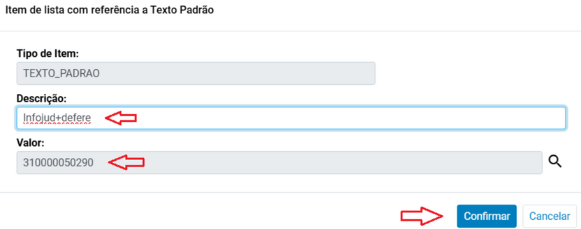
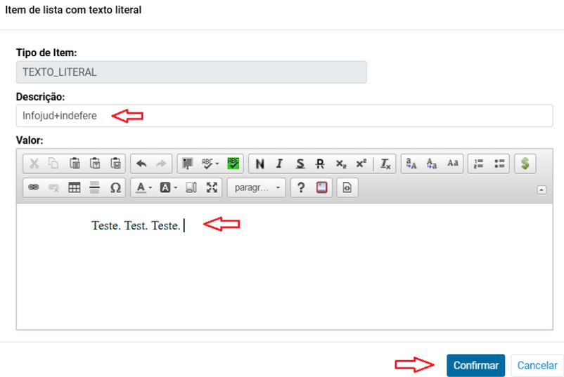
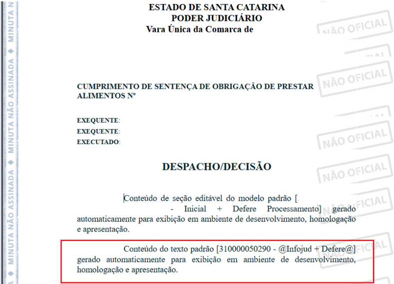
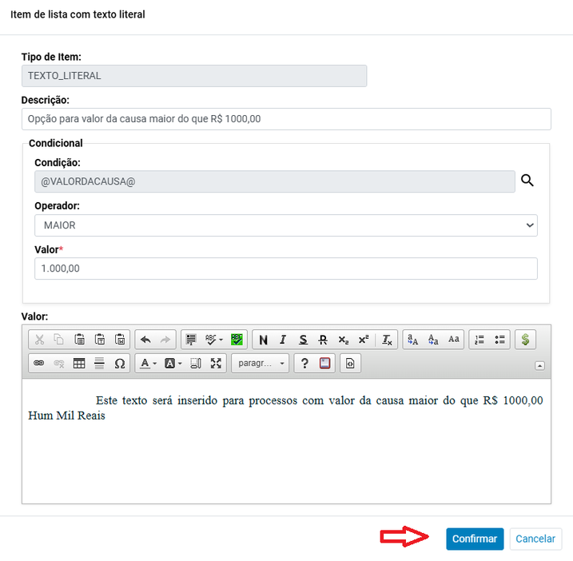
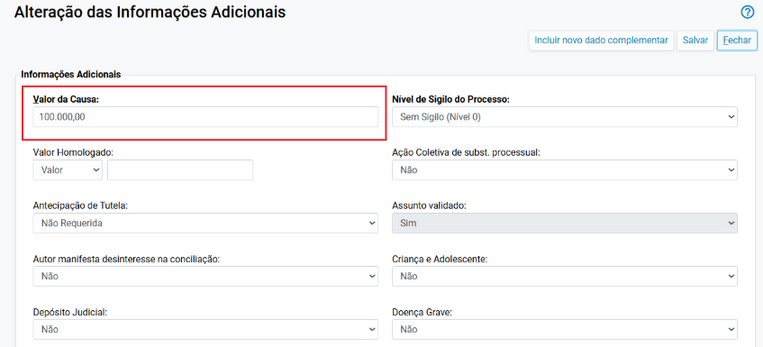
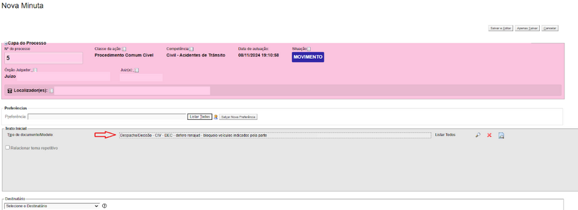

# CRIAÇÃO DO MECANISMO DE TAGS DE

*Documento eProc - Material de Treinamento*

---

---

# CRIAÇÃO DO MECANISMO DE TAGS DE

# FORMULÁRIO

---

## CRIAÇÃO DO MECANISMO DE TAGS DE

## FORMULÁRIO

A versão 9. 13 do eproc introduz a funcionalidade que permite

ao usuário criar tags personalizadas para uso em modelos de

documentos e textos padrão.

Essas tags tornam o processo de preenchimento de documentos

mais eficiente, possibilitando a automação de diversos campos.

**Tipos de Tags Disponíveis:**

O usuário pode definir o tipo de tag ao criá-la, com as seguintes opções:

CPF

CNPJ

DATA

DINHEIRO

NÚMERO INTEIRO

OPCIONAL

OPCIONAL_LISTA

TEXTO

Cada tipo de tag possui campos específicos para preenchimento dos dados

necessários.

A tag OPCIONAL_LISTA é especial, pois permite ao usuário escolher uma

entre várias opções pré-definidas.

---

Acessar o Menu Textual: Vá até Minutas → Tags de Formulário.

1.

2. Clicar em**"Nova"**.

## PASSO A PASSO PARA CRIAÇÃO DE UMA

## NOVA TAG:

---

3. Configuração da Nova Tag de Formulário:

Selecionar o Tipo de Tag: Escolha o tipo de tag desejada (CPF, CNPJ,

DATA, etc. ).

Descrição: Digite uma descrição para a tag.

Cadastrar a Classificação: Clique no ícone "+" para registrar a

classificação.

4. Salvar a Configuração: Após preencher as informações necessárias, salve a

tag para utilizá-la nos modelos de documentos e textos padrão.

---

**Inserção da Tag no Modelo ou Texto Padrão:**

Após criar a tag personalizada, você pode inseri-la facilmente nos modelos

de documentos ou textos padrão. Existem duas formas de fazer isso:

**1. Utilizando a Barra de Ferramentas do Editor:**

Dentro do**editor de texto**do modelo ou do texto padrão, clique na

opção**“Inserir Tag de Formulário”**na barra de ferramentas.

Escolha a**tag personalizada**que foi criada e insira-a no local desejado do

documento.

Ao clicar na ferramenta o sistema exibirá uma tela para seleção da tag:

Clique em “Consultar”.

Selecione a tag desejada clicando no ícone ao lado esquerdo da tag.

---

Ao utilizar, no momento da criação da minuta, um modelo/texto padrão que

contenha a tag de formulário, o sistema exibe uma tela intermediária

solicitando ao usuário que preencha os dados correspondentes à tag:

A tag**OPCIONAL_LISTA**permite ao usuário selecionar uma entre várias

opções pré-definidas.

Ao configurá-la, é possível definir um conteúdo específico para cada opção,

que será inserido automaticamente na minuta. Esse conteúdo pode ser um

**texto padrão**ou um**texto livre**.

---

O usuário pode cadastrar a tag combinando ambas as opções: uma baseada

em um texto padrão e outra permitindo a inserção de um texto livre.

**Texto Padrão:**

---

Tela da tag OPCIONAL_LISTA CONFIGURADA:

---

Ao criar a minuta com a tag**OPCIONAL_LISTA**, quando o usuário selecionar

um modelo que contenha essa tag na tela de configuração da nova minuta, o

sistema exibirá uma tela para que ele escolha a opção desejada a ser inserida

no documento.

Além disso, é possível configurar a tag OPCIONAL CONDICIONAL. Ao

cadastrar uma tag do tipo OPCIONAL e marcar a opção Condicional, o

sistema criará uma condição.

Quando essa condição for atingida no processo, a informação previamente

configurada na tag será automaticamente inserida no documento conforme o

modelo.

---

Após inserir a tag configurada no modelo, sempre que um processo atender à

condição especificada — como, por exemplo, um valor da causa superior a

R$ 1. 000, 00 — o sistema incluirá automaticamente o texto correspondente

da tag na minuta.

---

---

**Divisão de Apoio Judiciário****Diretoria de Suporte à Jurisdição de Primeiro Grau****Tribunal de Justiça do Estado de Santa Catarina**
SUPORTE

EPROC

A nova funcionalidade de tags personalizadas no eproc 9. 13 traz mais

eficiência e automação para a criação de documentos e textos padrão. Com

diferentes tipos de tags disponíveis, os usuários podem configurar campos

específicos

para

preencher

automaticamente

informações

essenciais,

reduzindo erros e otimizando o tempo de trabalho.

Ao dominar essa funcionalidade, os usuários tornam o preenchimento de

minutas mais ágil e preciso, garantindo padronização e produtividade no dia

a dia. Experimente a criação de tags personalizadas e aproveite ao máximo

essa melhoria no sistema!
