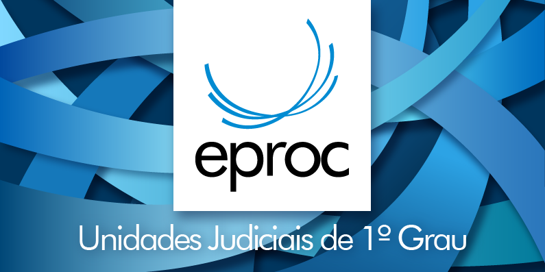

# DOMICÍLIO JUDICIAL

*Documento eProc - Material de Treinamento*

---

---

# DOMICÍLIO JUDICIAL

# ELETRÔNICO

---

O Domicílio Judicial Eletrônico (DE) é um sistema regulamentado pelo Conselho

Nacional de Justiça (CNJ) por meio da Resolução Nº 455 de 27/04/2022, send

o estabelecido inicialmente pela Resolução CNJ no 234/2016.

Essencial para a troca de informações processuais entre os órgãos do Poder

Judiciário e as partes envolvidas nos processos judiciais, ele é de uso obrigatório par

a todos os tribunais.

Para facilitar essa comunicação, o eproc foi integrado ao Domicílio Judicial

Eletrônico.

A identificação no Domicílio Judicial Eletrônico é feita através do CPF ou CNPJ

registrados junto à Receita Federal.

Este sistema permite aos usuários ter acesso centralizado às comunicações

processuais de todos os tribunais do Brasil, além de fornecer funcionalidades par

a consulta r e toma r ciênci a da s comunicações, be m com o acess o a o conteú

do completo dessas informações.

## DOMICÍLIO JUDICIAL ELETRÔNICO

---

**Como funciona?**

A implementação do Domicílio Eletrônico (DE) traz pequenas mudanças ao

procedimento atual no sistema eproc para citações e intimações eletrônicas. Essas

alterações são realizadas por meio de rotinas do sistema, simplificando a

comunicação dos atos processuais por DE.

Com o Domicílio Eletrônico, é possível citar uma parte mesmo que não tenha

Representante Legal no eproc.
<small>ATENÇÃO! Conforme cronograma da Resolução n. 455 de</small><small>27/04/2022 do CNJ, nesse primeiro momento, as citações</small><small>e intimaçõe s eletrônica s vi a D E serã o soment e par a</small><small>as Instituições Financeiras (PJ) e Banco do Brasil (entidade eproc).</small><small>IMPORTANTE! A citação por meio eletrônico será realizada</small><small>exclusivamente pelo Domicílio Judicial Eletrônico, afora o</small><small>s casos em que houver necessidade de citação por Edital, a s</small><small>er realizada via DJEN.</small>

---

Desta forma, a citação eletrônica continua a ser realizada na subtela Partes e

Representantes, por meio do ícone à direita do nome da parte.

Contudo, existem dois cenários distintos nos quais a forma de citação varia,

dependendo da situação da parte:

Quando a parte está cadastrada no DE e possui um Representante Legal no

eproc;

Quando a parte está cadastrada no DE mas não possui Representante Legal no

eproc.

Na primeira situação, em que a parte está "cadastrada no DE e com Representante

Legal no eproc", observamos que:

Na capa do processo, são exibidos dois ícones: o ícone de citação eletrônica do

Representante Legal (clicável) e o ícone do DE (não clicável - soment

e indicativo de cadastro DE);

A citação é realizada por meio de ícone de citação eletrônica do Representante

Legal;

A citação eletrônica requer a seleção do Representante Legal, designando-o

como representante temporário;

A chave de acesso é comunicada na página de inteiro teor acessada via DE.

Para facilitar esse processo, foi adicionado um ícone (representado pelo logo do DE)

na capa do processo, de maneira semelhante ao ícone indicativo de representante

legal para citação eletrônica.

---

Segue o procedimento:

---

No segundo cenário, em que a “Parte com cadastro no DE e sem Representante Legal

no eproc”, observamos que:

Na capa do processo é exibido somente o ícone de citação eletrônica via DE

Citação pode ser efetuada eletronicamente clicando no ícone do DE

Citação eletrônica não requer a indicação de Representante Legal. Assim, a

citação é realizada sem representante no processo

Chave de acesso é comunicada na página de inteiro teor acessada via DE.

Segue o procedimento:

---

De forma prática, foi implementado um ícone (logo do DE) análogo ao ícone

indicativo de representante legal para citação eletrônica, na capa do processo.
<small>O ícone do DE oferece a possibilidade de citação eletrônica,</small><small>bem como permite acesso direto à tela de citação</small><small>. Diferenças entre os ícones do DE e de Citação Eletrônica:</small><small>- Com o ícone DE, ao citar, não solicita indicação de</small><small>representante;</small><small>- Após a citação a parte continua sem representante;</small>
**OBSERVE:**

**Visualização pelo representante da parte no DE:**

Na tela principal do DE, o representante da parte tem acesso aos processos com as

informações de inteiro teor da comunicação processual:

---

A partir da citação eletrônica, o sistema executa quatro rotinas distintas:

**1 - Verificação de habilitação de destinatários:**

Ao realizar a citação ou intimação, uma rotina de verificação automática é ativada

diariamente fora do horário forense (5: 00 da manhã).

Na prática, isso implica que os novos cadastros feitos no DE (Domicílio Eletrônico)

serão reconhecidos pelo sistema eproc apenas no dia seguinte.

Além disso, quando há o cadastro de novas pessoas, o eproc verifica

automaticamente a situação dessas pessoas no DE, indicando se elas possuem ou

não a inscrição correspondente.

**2- Envio de comunicações processuais:**

Em seguida, para as pessoas jurídicas que já têm cadastro verificado pelo eproc no

DE, a comunicação do ato processual será armazenada para envio.

Assim, a cada 10 minutos, uma rotina agendada irá enviar a citação/intimação para o

DE.

<small>Ao citar/intimar eletronicamente uma parte, o eproc:</small><small>Verificará se a pessoa está cadastrada no DE;</small><small>Em caso positivo, a comunicação será armazenada</small><small>enviada para o DE;</small><small>A cada 10 minutos uma rotina agendada verifica e envia</small><small>as citações e intimações para o DE assincronamente.</small>
**RESUMINDO:**

---

Tendo em vista o art. 21 da Resolução Nº 455 de 27/04/2022 CNJ, as comunicações

dos atos processuais deverão indicar as informações que seguem:

I – o tribunal, o sistema de processo eletrônico, o órgão julgador e o número único do

processo judicial, nos termos da Resolução CNJ no 65/2008;

II – a identificação do responsável pela produção da informação;

III – o prazo para eventual cumprimento de ato processual decorrente da publicação;

IV – o fornecimento de endereço virtual (URL), que permita acesso ao conteúdo

integral dos documentos que compõem a comunicação processual.

Assim, na Comunicação Processual - Inteiro Teor do DE haverá o link com acesso ao

processo, número do processo e chave do processo:

---

**3- Ciência de prazo:**

A ciência do prazo pode ocorrer tanto via eproc quanto via DE, e em ambos os casos,

haverá registro de evento no processo.

Nos casos em que a ciência for realizada por meio do DE, o eproc terá uma rotina

noturna em que verifica a ciência da citação, resultando na abertura do prazo d

a citação.

A comunicação de ciência e a subsequente abertura do prazo ocorrem no momento

em que o destinatário obtiver acesso ao conteúdo da comunicação.

---

Então, é lançado no eproc o evento de confirmação informando que a ciência foi

realizada pelo domicílio eletrônico.

No contexto em que a ciência for realizada via eproc, nos casos em que a parte tem

Representante Legal, o DE é atualizado com a leitura aberta.

---

**4 - Ausência de confirmação de ciência de prazo:**

A regra geral é que, se não houver, no prazo de ciência, a confirmação pelo eproc

nem pelo DE, o eproc**dará a ciência automática no final dos 10 dias corridos**,

conforme art. 5o, § 3o, da Lei no 11. 419/2006.

Contudo, a ausência de confirmação de ciência da comunicação processual no DE

respeita um prazo específico se a Pessoa Jurídica não tem Representante Legal

cadastrado no eproc.

---

Nos casos de citação eletrônica, em que a parte não tiver Representante Legal no

eproc,**e não houver ciência no****DE em até 3 (três) dias úteis**, contados da**data do**

**envio**da comunicação processual, o sistema gerará automaticamente a informação

da “**ausência de confirmação de citação no DE**”, e o “status” da citação será

alterado para “fechado”.

Ainda, o processo será incluído no localizador de sistema**“Citação DE Não**

**Confirmada”**, e a unidade deverá realizar a citação, conforme § 1o-A do art. 246 do

CPC/2015, pelos meios:

I - pelo correio;

II - por oficial de justiça;

III - pelo escrivão ou chefe de secretaria, se o citando comparecer em cartório;

IV - por edital.

---

Contudo, a ausência de confirmação de ciência da comunicação processual no DE

respeita prazo específico se a PJ não tem Representante Legal cadastrado no eproc.

Nos casos de citação eletrônica, em que a parte não tiver Representante Legal no

eproc, e não houver ciência no DE em até 3 (três) dias úteis, contados da data do

envio da comunicação processual, o sistema gerará automaticamente a informação

da “ausência de confirmação de citação no DE”, e o “status” da citação será

alterado para “fechado”.

<small>Prazo de Ciência da Citação</small><small>PJ com RL no eproc e DE: 10 dias corridos, com revelia;</small><small>PJ sem RL no eproc e com DE: 3 dias úteis, sem revelia;</small><small>O eproc após os 3 úteis dias certifica e manda para o</small><small>localizador Citação DE não confirmada.</small>
**RESUMINDO:**

Por fim, é importante mencionar que além da ciência feita por usuários no eproc,

outras atualizações também são enviadas ao DE:

**1 - Atualização de Partes/Procuradores:**as alterações em representantes do

processo que possui comunicação enviada, gera atualização no DE;

**2 - Atualização do Prazo de Ciência:**quando houver alguma mudança que gere

impacto no prazo de uma comunicação enviada, o eproc**realizará novo cálculo e**

**enviará ao DE**a devida atualização. Tais situações ocorrem nos casos de alteração

no cadastro de feriados e suspensão de prazos processuais.

---

**Fique atento!**As intimações também poderão ser acessadas pelas instituições

bancárias via DE. Não obstante, o procedimento no eproc para o usuário da unidade

judicial, continua ocorrendo da mesma forma pela ação "Intimar".

<small>Os documentos sigilosos não serão apresentados quando da</small><small>visualização do Representante Legal da Pessoa Jurídica por</small><small>meio DE.</small><small>Assim, se o processo tiver nível de sigilo maior ou igual a 2, o</small><small>usuário será orientado a obter informações junto ao órgão</small><small>judicial.</small>
**IMPORTANTE**
**Divisão de Apoio Judiciário****Diretoria de Suporte à Jurisdição de Primeiro Grau****Tribunal de Justiça do Estado de Santa Catarina**<small>SUPORTE</small><small>EPROC</small>
