# Comunicação processual via Carta AR Digital (E-Carta)

*Documento eProc - Material de Treinamento*

---

---

---

<small>**SUMÁRIO**</small>
**Comunicação processual via Carta AR Digital (E-Carta). .. .. .. .. .. .. .. .. .. .. .. .. .. .. .. .. .. .. .. .. .. .. 3**

Recursos disponíveis no campo destinatário: .. .. .. .. .. .. .. .. .. .. .. .. .. .. .. .. .. .. .. .. .. .. .. .. .. .. .. .. .. .. .. .. .. .. 8

Agendamento de lançamento de evento/troca de localizador. .. .. .. .. .. .. .. .. .. .. .. .. .. 10

Como transportar conteúdo de outra carta - Documento Base. .. .. .. .. .. .. .. .. .. .. .. .12

Edição do conteúdo da Carta AR. .. .. .. .. .. .. .. .. .. .. .. .. .. .. .. .. .. .. .. .. .. .. .. .. .. .. .. .. .. .. .. .. .. .. .. .. .. .. .. .. .. .. .. .. .. .. . 15

Controle das Cartas. .. .. .. .. .. .. .. .. .. .. .. .. .. .. .. .. .. .. .. .. .. .. .. .. .. .. .. .. .. .. .. .. .. .. .. .. .. .. .. .. .. .. .. .. .. .. .. .. .. .. .. .. .. .. .. .. .. .. .. .. .. .. .17

Cancelamento do Envio de Carta. .. .. .. .. .. .. .. .. .. .. .. .. .. .. .. .. .. .. .. .. .. .. .. .. .. .. .. .. .. .. .. .. .. .. .. .. .. .. .. .. .. .. .. .. .. .. . 18

Relatório de Cartas AR. .. .. .. .. .. .. .. .. .. .. .. .. .. .. .. .. .. .. .. .. .. .. .. .. .. .. .. .. .. .. .. .. .. .. .. .. .. .. .. .. .. .. .. .. .. .. .. .. .. .. .. .. .. .. .. .. .. .. .. .19

---

# Comunicação processual via Carta AR Digital (E-Carta)

A integração do e-carta com o sistema eproc possibilita o envio de

correspondências aos Correios nos próprios autos digitais, por meio da

elaboração de uma minuta.

Desta forma, a carta é enviada aos Correios, que providenciarão sua

impressão e cumprimento, sendo o retorno da comunicação (negativo ou

positivo) informado diretamente nos autos.

1. ​ A elaboração de carta AR(digital) poderá ser realizada de forma

individual, através da opção “Nova Minuta”, localizada na capa dos

autos ou, ainda, de forma massiva por meio da opção “Criar Minutas

em Lote”, exibida nas telas de listagem de processo (ex. : Lista de

processos dentro de um localizador):

a)​ Individual: Na capa dos autos, na seção Minutas, clicar em “Nova”

ou clicar no botão “Minutar”:

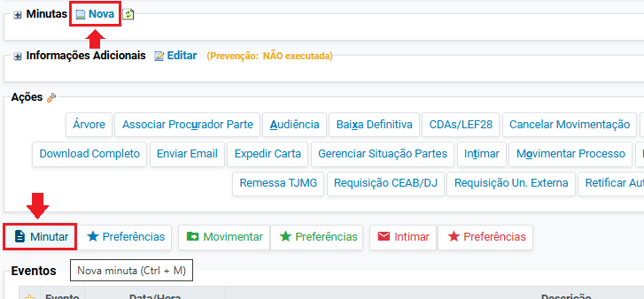

---

b)​ Massiva: Lista de processos → Criar Minutas em Lote:

2. ​ No campo “Tipo de documento/Modelo”, selecionar a opção**“***CARTA**

**AR (ARDIGITAL)***”**ou**“***CARTA AR (ARDIGITAL) - SEM CHAVE DO**

**PROCESSO***”**

**Nota:**Apenas as minutas criadas com o tipo de documento “CARTA AR

(ARDIGITAL)” podem ser enviadas aos correios.

**IMPORTANTE!**

O modelo**“Carta AR (ARDIGITAL)”**contém, no rodapé, as informações de acesso,

indicando o número e a chave do processo, o que possibilita que o destinatário da

carta e, todos aqueles que possuam essa informação, tenham visibilidade da íntegra

dos autos ao realizar a consulta processual.

Tal funcionalidade poderá substituir a “Contrafé Eletrônica”, todavia, nos casos em

que a disponibilização deva se restringir a documentos específicos (ex. : Petição

Inicial) o(a) usuário(a) poderá utilizar para elaboração da carta o modelo**“***CARTA**

**AR (ARDIGITAL) - SEM CHAVE DO PROCESSO***”,**inserindo em seu conteúdo apenas

a(s) chave(s) destes documentos.

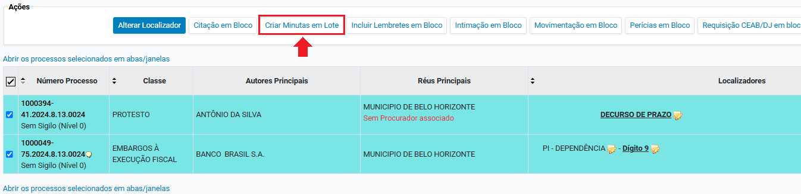

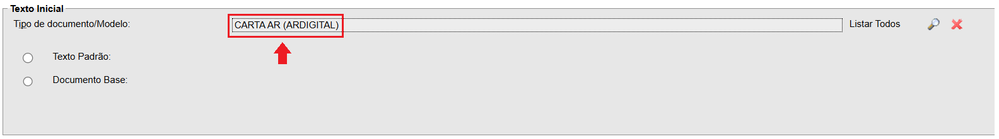

---

**ATENÇÃO EM PROCESSOS COM SIGILO! !**

Nos processos gravados com algum nível de sigilo, para que não haja vazamento

indevido das informações e documentos pessoais, o(a) usuário(a) deverá utilizar o

documento**“***CARTA AR (ARDIGITAL) - SEM CHAVE DO PROCESSO***”,**indicando no

conteúdo da minuta apenas a chave dos documentos necessários. Para saber como

gerar chave de documento, vide manual: Autos Digitais I - Capa do Processo,

Lembretes, Cadastro e Retificação de Assunto, Informações Adicionais e Chave de

Acesso.

3. ​ No campo “Dados da Carta AR” é possível verificar diversas

informações para a realização do procedimento de forma correta,

conforme a seguir:

4. ​ O(a) usuário(a) deverá clicar em “Configurar Envio Automático” para

que o sistema preencha automaticamente o evento a ser lançado, qual

seja: “Expedição de Carta pelo Correio”, vide tópico “Agendamento de

lançamento de evento/troca de localizador”.

5. ​ Para o correto funcionamento da expedição de minutas do tipo “Carta

AR (AR DIGITAL)”, o evento lançado deverá ser, necessariamente,

“Expedição de Carta pelo Correio”.

Obs. : O campo Agendar lançamento de evento/troca de localizador

estará posicionado abaixo do campo “Destinatário”.

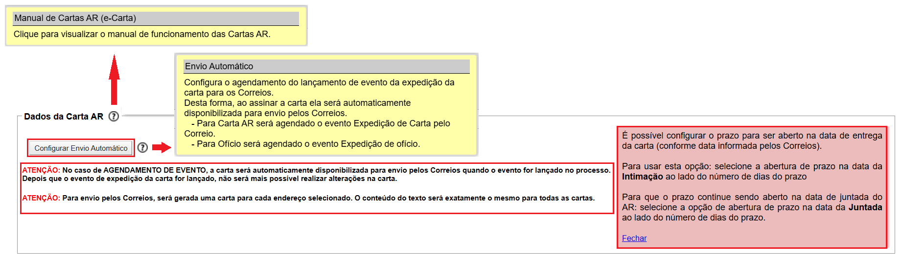

---

6. ​ No campo “Destinatário”, o(a) usuário(a) deverá escolher a parte para a

qual a carta será direcionada.

6. 1. ​

Ao escolher o polo (Autores, Réus, Interessados, Outros, Não

Partes),

o

sistema

marcará

automaticamente

todos

os

integrantes do polo selecionado. Caso a carta seja direcionada a

apenas um dos integrantes, o(a) usuário(a) poderá selecioná-lo

diretamente, clicando na caixa de seleção localizada à esquerda

do nome.

6. 2. ​

O botão “Incluir Pessoa” (

) abrirá a tela “Minuta -

Inclusão de Destinatário”, na qual será possível incluir pessoas

que não integram o processo. Para realizar a busca de pessoas,

poderá ser incluído o Tipo de Pessoa, o CPF/CNPJ, Outros

Documentos ou a pesquisa pelo nome ou razão social. A

inclusão de um novo destinatário não faz com que este seja

cadastrado como parte no processo.

7. ​ Após selecionar o destinatário, não é possível selecionar endereços

incompletos (que não contenham CEP, cidade, bairro ou UF) ou que

possuam dados conflitantes (Ex. : CEP referente à cidade diferente da

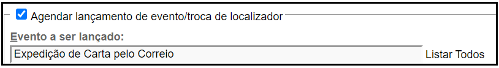

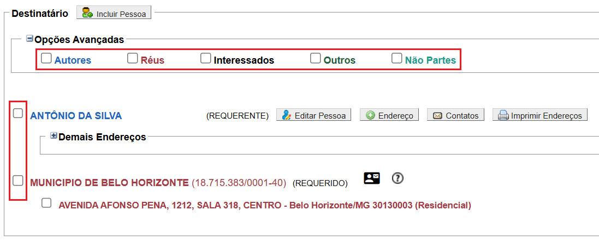

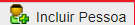

---

informada no cadastro). Nestes casos, é necessário corrigir o endereço

para que ele possa ser utilizado na carta. O ícone “Editar endereço”

( ), localizado à direita do endereço, permite a edição.

**Nota:**Não é possível a realização de envios sucessivos de forma

automática, havendo necessidade, uma nova carta deverá ser

elaborada para envio ao novo endereço.

8. ​ No campo “Prazo”, incluir o prazo da comunicação e selecionar se a

abertura deste se dará da “Juntada” ou da “Intimação”.

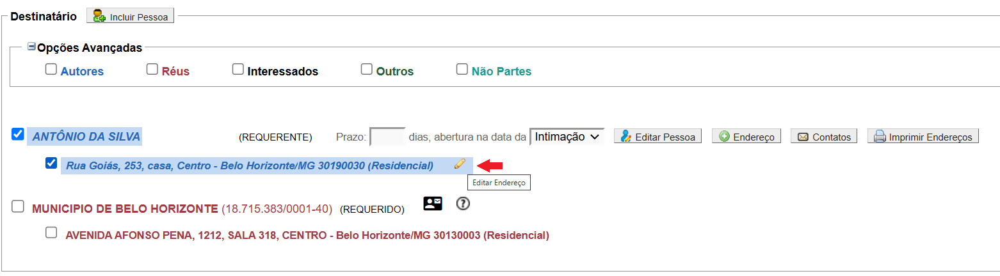

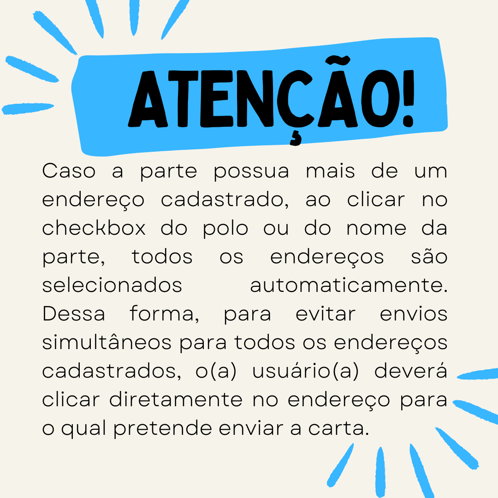

---

**Nota:**O sistema trará de forma automática a marcação da opção

“Intimação”. Dessa forma, caso a abertura do prazo deva ocorrer a

partir da data da “Juntada” do AR nos autos, o usuário deverá clicar

no campo de seleção para realizar a alteração.

9. ​ Selecionar o assinante e o tratamento vinculado ao assinante e, em

seguida, clicar em “Salvar e Editar”, para inserir o conteúdo da carta

AR.

**Recursos disponíveis no campo destinatário:**
<small>●​ “Editar Pessoa” (</small>
)

Permite

a

edição

dos

dados

cadastrais da pessoa selecionada.

●​ “Endereço”( )

É possível incluir um novo endereço da

parte.

**●​**“Contatos”( )

Permite a inclusão de telefone, e-mail, celular

e celular/app mensagens. Caso o contato incluído deva possuir

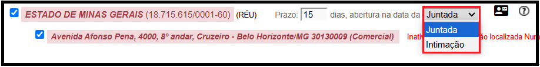

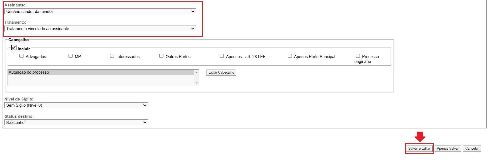

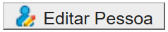

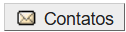

---

restrição de visibilidade aos usuários internos, basta marcar a caixa

de seleção “Interno” ( ).

**●​**“Imprimir Endereços” (

)

Exibe lista de endereços da

parte, permitindo sua impressão.

**Agendamento de lançamento de evento/troca de localizador**

Caso o(a) usuário(a) tenha clicado na opção**“Configurar Envio Automático”**

, o sistema marcará automaticamente a opção**“Agendar**

**lançamento de evento/troca de localizador”**e selecionará o evento a ser

lançado:**“Expedição de Carta pelo Correio”**.

Caso o usuário não tenha clicado na opção mencionada, poderá marcar a

caixa de seleção**“Agendar lançamento de evento/troca de localizador”**e

selecionar o evento de forma manual.

**IMPORTANTE!**

Após a configuração do agendamento de lançamento

do evento, a assinatura da minuta fará com que esta

seja disponibilizada para envio pelo ArDigital, com o

consequente lançamento do evento no processo.

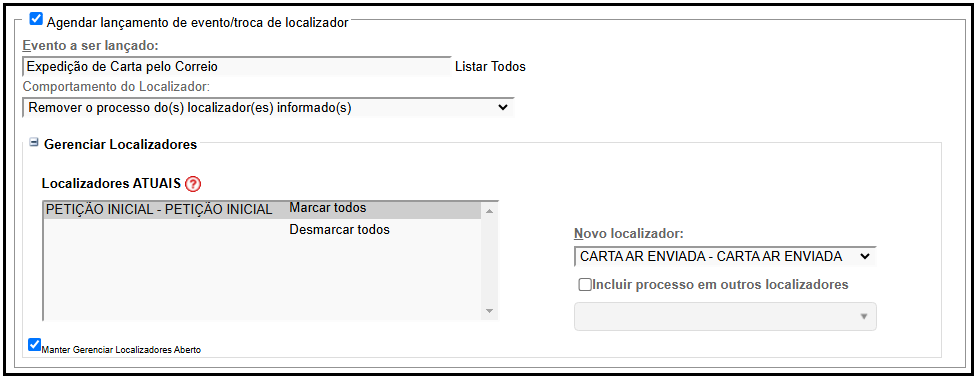

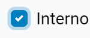

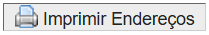

---

Ao final da tela**“Assinar Minuta”**será possível verificar o evento agendado,

conforme a seguir:

Para que não haja disponibilização imediata da minuta para os Correios

com o lançamento do evento nos autos, basta que o(a) usuário(a) não realize

o agendamento. A minuta permanecerá no campo**“Minutas”**na capa dos

autos e será disponibilizada somente após a assinatura e utilização do

recurso de envio aos Correios

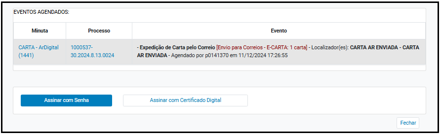

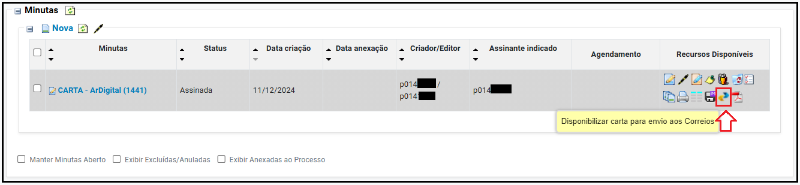

---

**Como transportar conteúdo de outra carta - Documento Base**

O sistema eproc permite a criação de minutas utilizando o mesmo conteúdo

de outra minuta já criada no sistema.

Para tanto:

1. ​ No caso da elaboração da carta, necessário selecionar o modelo

matriz*****CARTA AR (ARDIGITAL)*****, que não possui conteúdo e é

exibido

entre

asteriscos

na

caixa

de

seleção

do

“Tipo

de

documento/Modelo”.

2. ​ Ao selecionar o “Tipo de documento/Modelo”, será exibida a opção de

indicar o número do “Documento Base”.

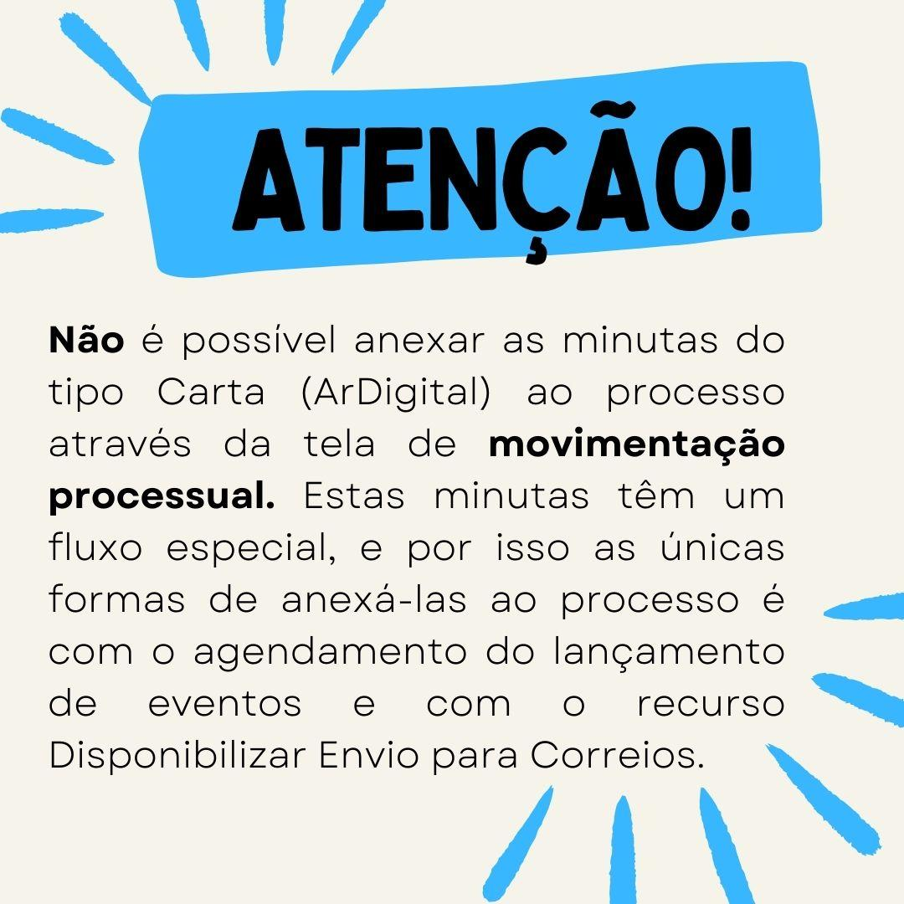

---

<small>●​**( )**O ícone da lupa permite a realização de consulta de</small>
Documento Base, utilizando filtros básicos, filtros avançados de

minuta e filtros do processo.
<small>●​**( )**Remove o documento base.</small>
3. ​ Ao clicar para pesquisar um documento base, o sistema retornará a

página “Selecionar Documento Base”.

4. ​ Na seção “Filtros básicos”, é possível filtrar as minutas pelo tipo de

documento “Carta ARDigital”.

5. ​ Em “Filtros avançados minuta”, é possível realizar marcação para “Não

listar minutas bloqueadas”, “Listar também minutas bloqueadas” ou

“Listar apenas minutas bloqueadas”.

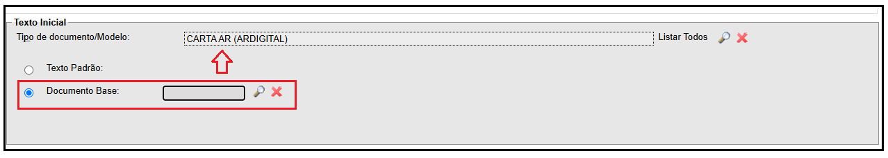

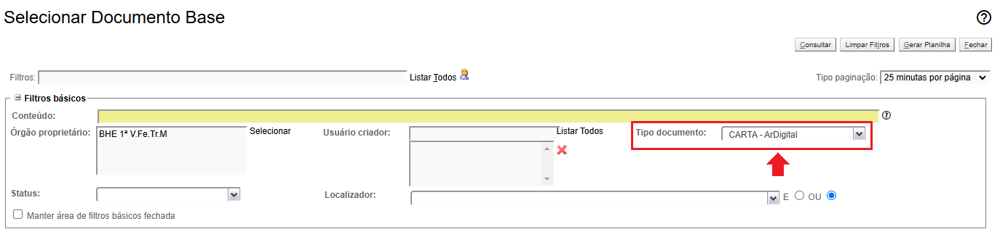

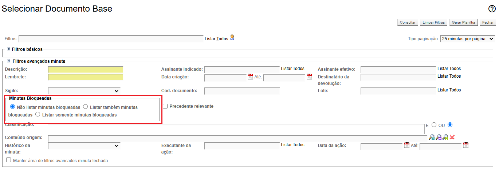

---

6. ​ Nos critérios de exibição, o(a) usuário(a) poderá agrupar por descrição

em ordem crescente ou decrescente.

7. ​ Clicar em “Consultar”.

8. ​ Após o retorno do resultado da pesquisa, para transportar o

conteúdo da minuta, basta clicar no ícone “Transportar este item e

fechar” ( ), localizado em “Recursos disponíveis”.

É possível salvar preferência de filtros de pesquisa de Documento Base. Para

tanto, é necessário preencher os campos desejados e, após, clicar em

“Consultar”.

A opção**Salvar nova preferência**ficará disponível após a consulta.

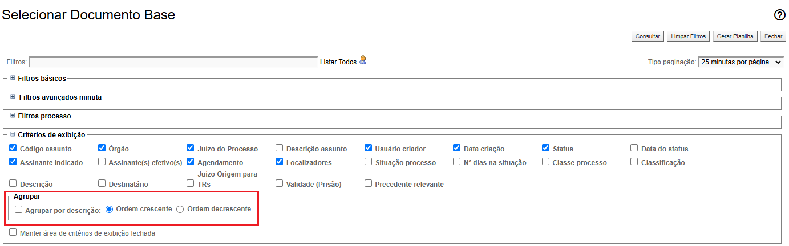

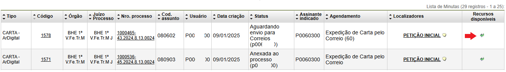

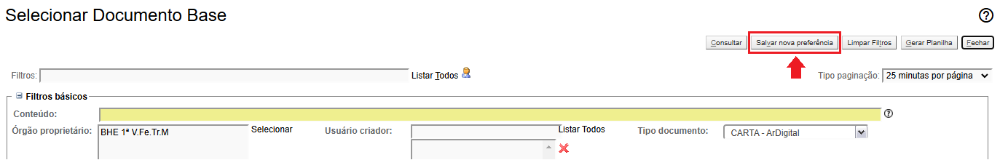

---

**Edição do conteúdo da Carta AR**

Em razão do padrão de impressão das Cartas, o tipo de documento “CARTA

AR (ARDIGITAL)” exige que o conteúdo seja restrito para ocupar no máximo ⅔

de uma página A4.

Caso o conteúdo ultrapasse o limite estabelecido, o sistema exibe uma

mensagem de que não foi possível salvar o documento.

Alguns estilos de textos estão disponíveis para a criação de cartas. Dentre

eles, o estilo CartaCompacta, que é indicado para reduzir a formatação de

textos mais extensos.

É possível visualizar como será a impressão da carta pelos correios ao clicar

no ícone “Visualizar PDF da Carta AR” (

).

As cartas que ainda não foram enviadas para os Correios podem ser

gerenciadas no painel de minutas, na capa dos autos.

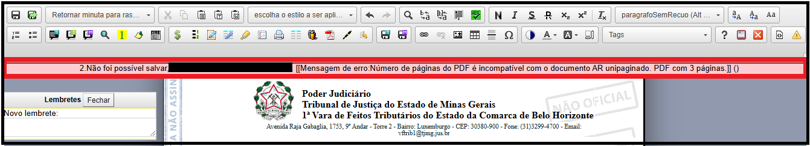

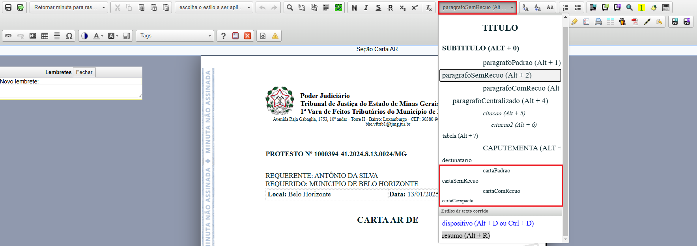

---

Ao clicar no ícone para disponibilizar a carta para os correios, o sistema

exibirá os dados da Carta AR e o Destinatário.

Após o envio da Carta, o sistema lançará nos autos o evento “Expedição de

Carta pelo Correio” com o status (Aguardando Envio para Correios).

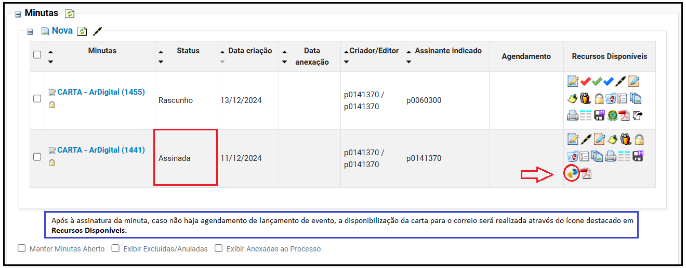

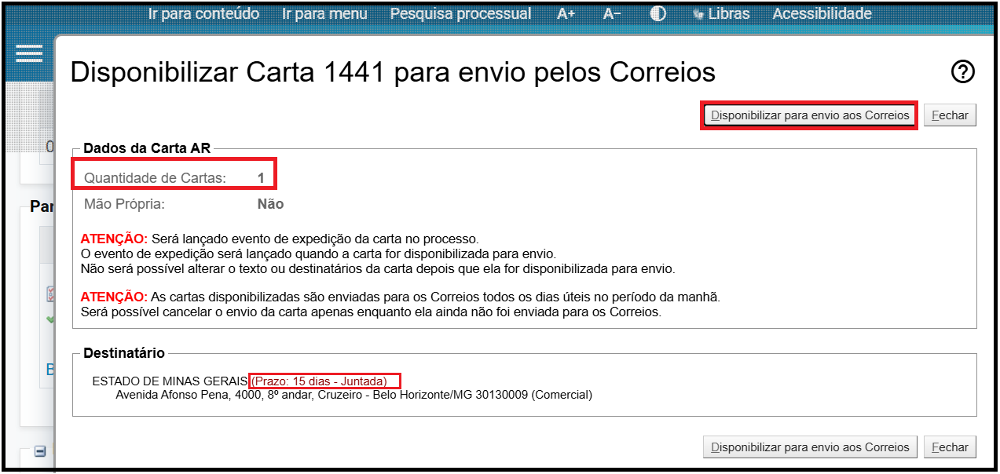

---

Após a efetiva disponibilização para os correios, o status da carta mudará

para “Enviada para Correios em (Data do envio)”.

**Controle das Cartas**

Através do “Painel Inicial” do usuário é possível realizar o controle das cartas

que estão em edição, assinadas mas não enviadas, aguardando envio,

enviadas nos últimos 15 dias, devolvidas nos últimos 15 dias e enviadas há

mais de 40 dias e sem devolução.

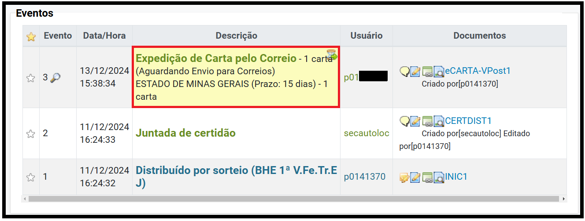

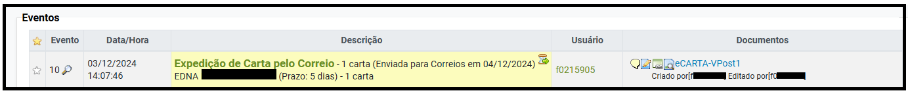

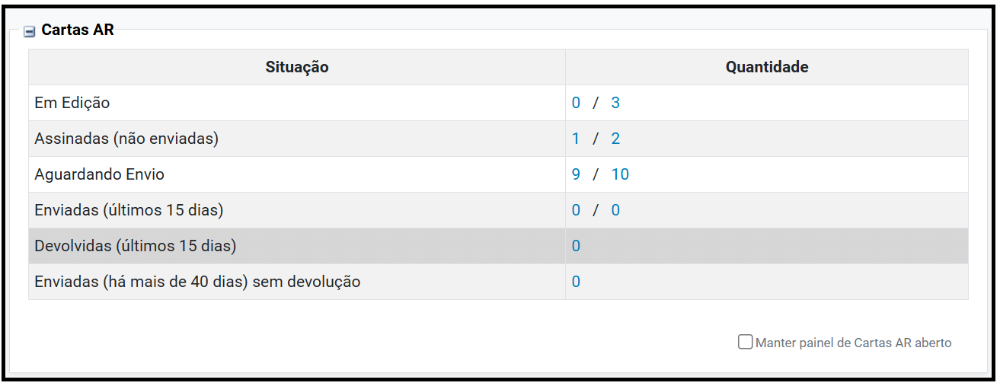

---

**Cancelamento do Envio de Carta**

Nos casos em que houver necessidade de cancelamento do envio da Carta

aos correios, o(a) usuário(a) deverá acessar o campo “Minutas” e clicar no

ícone

de

cancelamento

da

carta,

localizado

na

coluna

“Recursos

Disponíveis”.
<small>**Observação:**Para visualizar os Recursos disponíveis de uma minuta anexada</small>
ao processo, é necessário marcar o checkbox “Exibir Anexadas ao Processo”

localizado ao final da seção “Minutas”.

Após o cancelamento da carta, o evento lançado no processo será alterado

para (Não Enviada).

Para

cancelar

o

evento,

é

necessário

utilizar

a

ação

”Cancelar

Movimentação”.

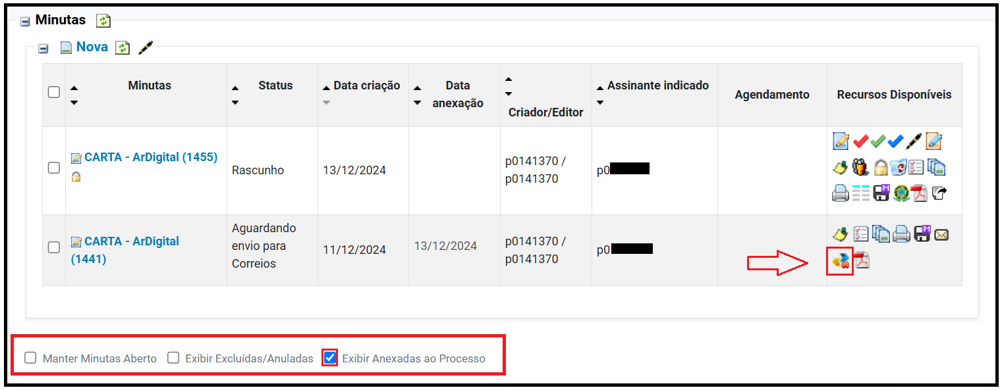

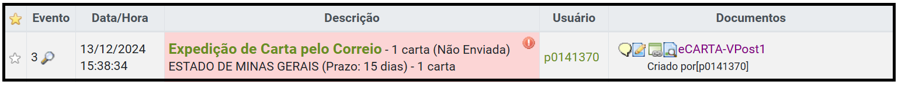

---

**Relatório de Cartas AR**

O relatório de Cartas AR, disponível no “Menu” textual, permite o

acompanhamento do andamento da entrega da carta pelo rastreio dos

Correios.

O Relatório de Cartas exibe o andamento da carta para cada destinatário,

ou seja, todas as cartas geradas de uma mesma minuta serão exibidas de

forma individual, em razão de cada uma possuir sua própria informação de

devolução.

No relatório de carta é possível realizar filtros pela situação, por etiqueta,

por tipo de devolução, por processo, por pagamento do demandante e por

código do documento.

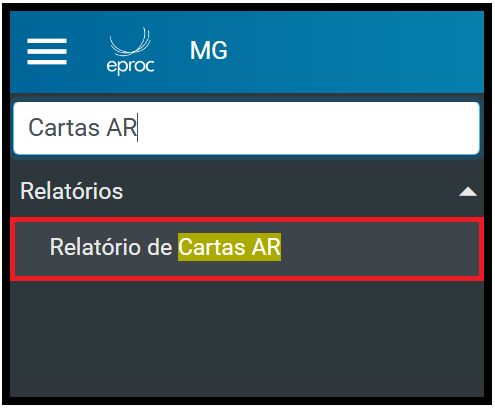

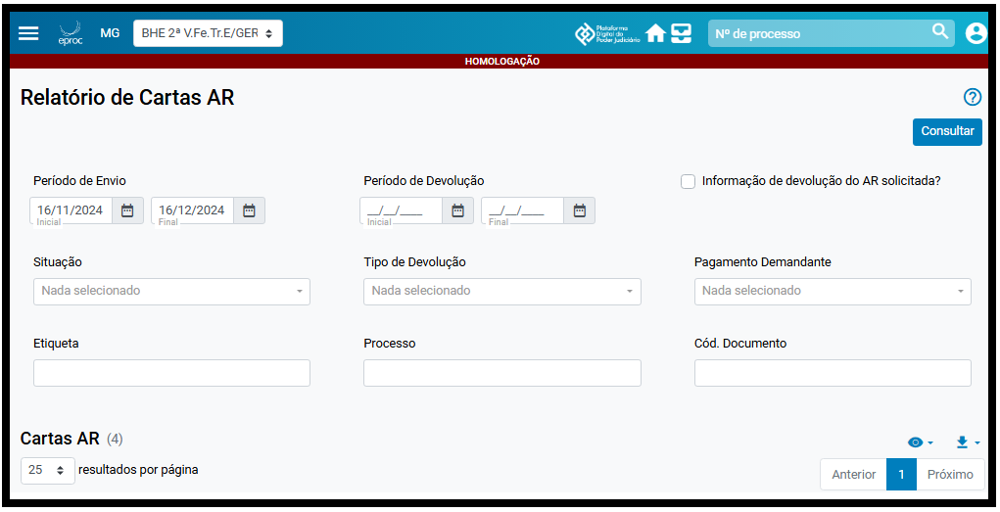

---

Quando o ArDigital envia o comprovante de entrega de uma carta para o

sistema

processual,

é

realizada

automaticamente

a

juntada

deste

comprovante nos autos. O evento de juntada pode ser "Juntada de Carta

pelo Correio - Devolvida sem cumprimento" ou "Juntada de Carta pelo

Correio - Comprovante de entrega", dependendo se a carta foi entregue ou

não.

Quando a juntada do comprovante de entrega é realizada, também é

adicionado um localizador secundário ao processo. Se a carta foi entregue,

será adicionado o localizador “AR ENTREGUE”. Se a carta não foi entregue,

será adicionado o localizador “AR NÃO ENTREGUE”.

Após a juntada do AR no processo, a informação de devolução da carta

também é alterada no evento de expedição da carta.

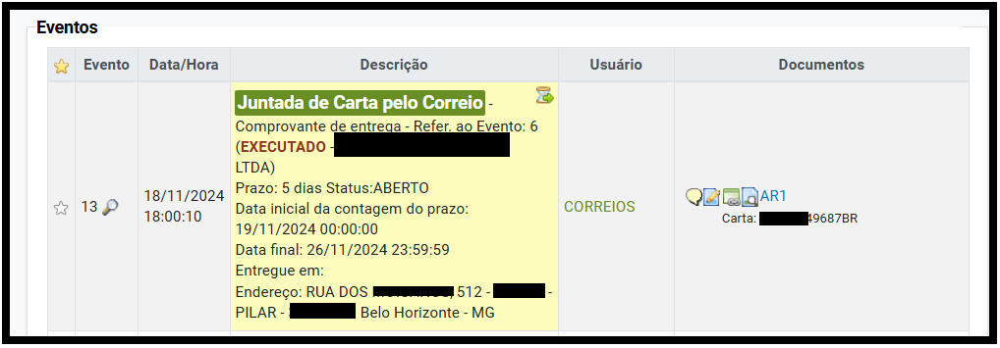

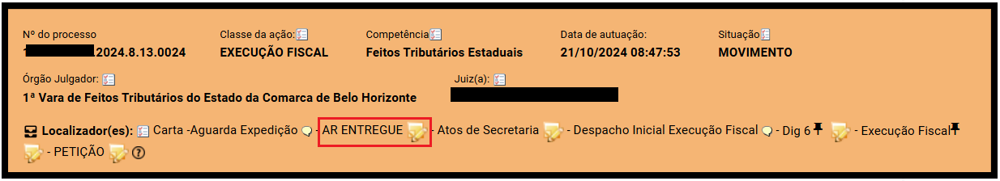

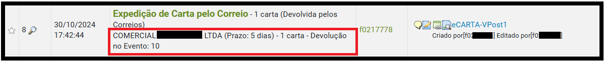

