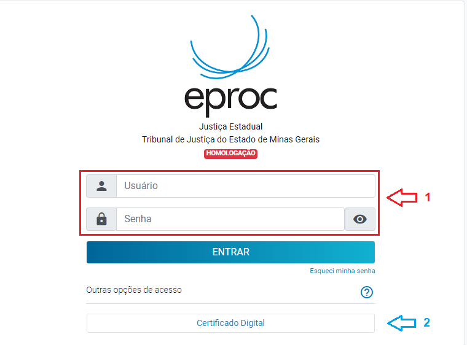
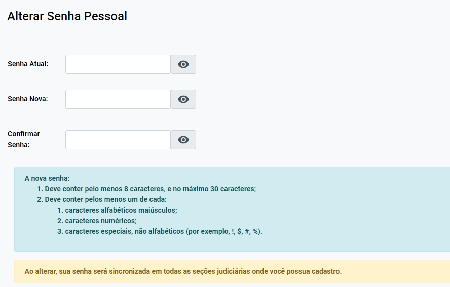
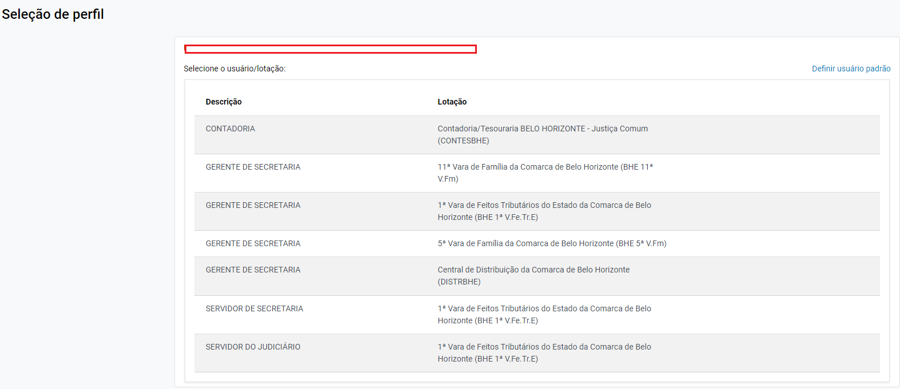
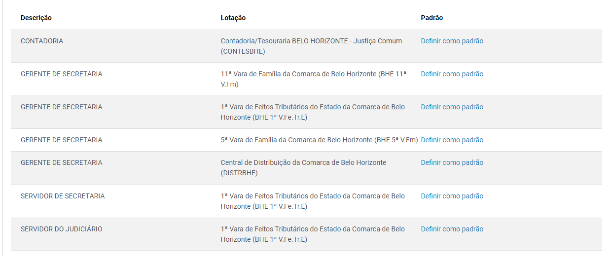
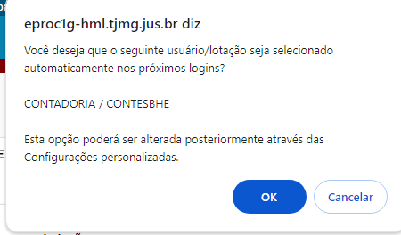
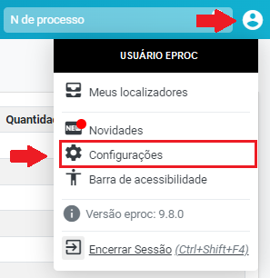
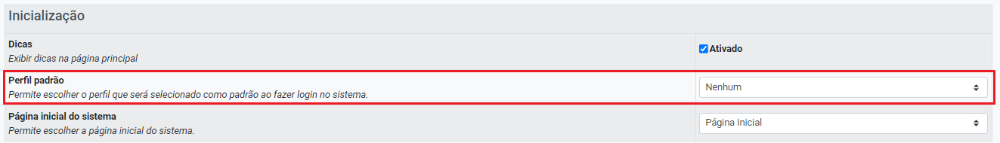
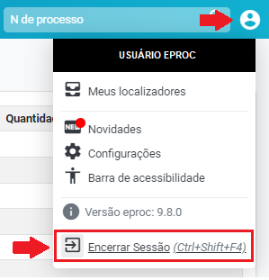

# eproc formas de acesso

*Documento eProc - Material de Treinamento*

---

---

---

****SUMÁRIO****
**PRINCIPAIS VANTAGENS DO EPROC. .. .. .. .. .. .. .. .. .. .. .. .. .. .. .. .. .. .. .. .. .. .. .. .. .. .. .. .. .. .. .. .. .. .. .. .. .. .. .. .. .. .. .. .. .. .. .. .. .. .. .. .. .. .3**
<small>Autos Digitais funcionais. .. .. .. .. .. .. .. .. .. .. .. .. .. .. .. .. .. .. .. .. .. .. .. .. .. .. .. .. .. .. .. .. .. .. .. .. .. .. .. .. .. .. .. .. .. .. .. .. .. .. .. .. .. .. .. .. .. .. .. .. .. .. 3</small><small>Ações na Massiva. .. .. .. .. .. .. .. .. .. .. .. .. .. .. .. .. .. .. .. .. .. .. .. .. .. .. .. .. .. .. .. .. .. .. .. .. .. .. .. .. .. .. .. .. .. .. .. .. .. .. .. .. .. .. .. .. .. .. .. .. .. .. .. .. .. .. .. . 3</small><small>Preferências e Ações Preferenciais. .. .. .. .. .. .. .. .. .. .. .. .. .. .. .. .. .. .. .. .. .. .. .. .. .. .. .. .. .. .. .. .. .. .. .. .. .. .. .. .. .. .. .. .. .. .. .. .. .. .. .. .. .. .. .3</small><small>Localizadores e Fluxo livre de tramitação do processo. .. .. .. .. .. .. .. .. .. .. .. .. .. .. .. .. .. .. .. .. .. .. .. .. .. .. .. .. .. .. .. .. .. .. .. .. .. .. .. .4</small><small>Automatização da Tramitação Processual. .. .. .. .. .. .. .. .. .. .. .. .. .. .. .. .. .. .. .. .. .. .. .. .. .. .. .. .. .. .. .. .. .. .. .. .. .. .. .. .. .. .. .. .. .. .. .. .. .. 5</small>
**DO ACESSO AO SISTEMA. .. .. .. .. .. .. .. .. .. .. .. .. .. .. .. .. .. .. .. .. .. .. .. .. .. .. .. .. .. .. .. .. .. .. .. .. .. .. .. .. .. .. .. .. .. .. .. .. .. .. .. .. .. .. .. .. .. .. .. .. .. .6**
<small>Formas de acesso. .. .. .. .. .. .. .. .. .. .. .. .. .. .. .. .. .. .. .. .. .. .. .. .. .. .. .. .. .. .. .. .. .. .. .. .. .. .. .. .. .. .. .. .. .. .. .. .. .. .. .. .. .. .. .. .. .. .. .. .. .. .. .. .. .. .. .. . 6</small><small>Como realizar o primeiro acesso. .. .. .. .. .. .. .. .. .. .. .. .. .. .. .. .. .. .. .. .. .. .. .. .. .. .. .. .. .. .. .. .. .. .. .. .. .. .. .. .. .. .. .. .. .. .. .. .. .. .. .. .. .. .. .. .. 7</small><small>Tela Inicial: Seleção de Perfil. .. .. .. .. .. .. .. .. .. .. .. .. .. .. .. .. .. .. .. .. .. .. .. .. .. .. .. .. .. .. .. .. .. .. .. .. .. .. .. .. .. .. .. .. .. .. .. .. .. .. .. .. .. .. .. .. .. .. .. .7</small><small>Encerrar Sessão. .. .. .. .. .. .. .. .. .. .. .. .. .. .. .. .. .. .. .. .. .. .. .. .. .. .. .. .. .. .. .. .. .. .. .. .. .. .. .. .. .. .. .. .. .. .. .. .. .. .. .. .. .. .. .. .. .. .. .. .. .. .. .. .. .. .. .. .. 10</small>

---

**PRINCIPAIS VANTAGENS DO EPROC**

**Autos Digitais funcionais**

Os autos digitais do eproc possuem funcionalidades que facilitam a execução de atividades

essenciais para o andamento do processo. Entre essas funcionalidades estão a intimação, citação,

marcação e realização de audiências, redistribuição de feitos e envio de processos ao TJMG.

Dessa forma, o usuário não precisará movimentar os processos entre diferentes tarefas para

realizar tais ações, uma vez que elas podem ser executadas diretamente nos autos digitais,

tornando a tramitação mais ágil e eficiente.

**Ações na Massiva**

O eproc permite, entre outras "ações em massa", a realização de intimações, citações e a inclusão

de documentos em blocos de processos.

Dessa forma, o usuário pode expedir um ato paradigma que será aplicado a vários processos,

racionalizando e otimizando seu trabalho.

**Preferências e Ações Preferenciais**

A "Preferência" é um recurso do eproc que permite ao usuário salvar comandos previamente

preenchidos para a realização de determinados atos, funcionando como um padrão reutilizável em

situações que exijam os mesmos comandos.

Ao acionar a "Preferência" salva, o sistema apresentará todos os campos já preenchidos,

eliminando a necessidade de trabalhos manuais e repetitivos.

Exemplo: Para intimar o autor a emendar a inicial, o usuário normalmente precisa selecionar o

autor, indicar o prazo processual para resposta e editar o texto da intimação. Sempre que essa

---

ação for necessária em um processo, esses campos devem ser preenchidos repetidamente no

sistema.

Entretanto, com o recurso da "Preferência", basta que o usuário realize o preenchimento uma

única vez e o salve como "Preferência". A partir disso, a "Preferência" pode ser acionada em

qualquer processo, preenchendo automaticamente os campos necessários para a realização do

ato.

Para facilitar ainda mais o uso desse recurso, o eproc oferece a "Ação Preferencial", que

disponibiliza a "Preferência" em forma de botão nos autos digitais, permitindo seu acionamento de

maneira mais rápida e prática.

**Localizadores e Fluxo livre de tramitação do processo**

O “Localizador” é um recurso do eproc que tem dupla função:

1. ​ Alocar, guardar processos que estejam em determinada situação ou fase na tramitação

processual (semelhante as tarefas do PJe);

2. ​ Identificar processos de acordo com a necessidade do usuário (etiquetas).

A criação de localizadores é livre por parte da unidade judiciária, que poderá fazê-lo de acordo com

a sua conveniência, tanto para a organização e gestão da unidade quanto para o bom andamento

dos processos.

Desse modo, diferentemente do que ocorre no PJe, que possui um fluxo de tramitação processual

rígido e definido pelos administradores do Sistema, a liberdade de criação de localizadores no

eproc faz com que os seus usuários tenham relevante grau de liberdade e autonomia para definir o

fluxo de tramitação de processos.

No entanto, adverte-se que essa liberdade e autonomia devem ser guiadas pelos princípios da

razoabilidade e proporcionalidade. Caso contrário, em vez de auxiliarem, podem desorganizar e

dificultar o trabalho das unidades na análise processual.

---

**Automatização da Tramitação Processual**

A "Automatização da Tramitação Processual" é, sem dúvida, o recurso do eproc mais apto a

potencializar a economicidade, instrumentalidade e celeridade processual.

Isso ocorre porque permite que os próprios usuários do sistema, conhecedores do rito processual

e do fluxo de trabalho, automatizem rotinas passíveis de automação, fazendo com que atividades

manuais e de baixo grau de cognição sejam realizadas pelo sistema.

**Exemplo 1:**Imagine um processo em que o autor apresenta uma petição de desistência. Até que a

unidade judiciária analise essa petição, conclua os autos ao magistrado, este profira a sentença e

as partes sejam intimadas, um tempo considerável de tramitação terá se passado. ​

No eproc, com o recurso da "Automatização da Tramitação Processual", os próprios usuários das

unidades judiciárias podem programar o sistema para reduzir drasticamente essa tramitação. ​

Para isso, basta programar o sistema de modo que, sempre que uma "Petição de Desistência" for

recebida, o processo seja automaticamente concluso para julgamento, já com uma minuta de

sentença extintiva sugerida, e, após a assinatura do magistrado, as partes sejam devidamente

intimadas.

**Exemplo 2:**Sempre que uma petição de "Contestação" for recebida, o sistema deverá intimar o

autor para apresentar impugnação. Após a apresentação da impugnação ou o decurso do prazo, os

autos serão conclusos.

**Exemplo 3:**Sempre que o magistrado decidir pela suspensão do processo, o sistema deverá

intimar as partes e alocar o processo em um localizador de suspensão, com prazo estipulado

conforme o caso.

Nota-se que as possibilidades de automatização são inúmeras, cabendo aos usuários do eproc

implementá-las conforme as funcionalidades do sistema e as necessidades das unidades

judiciárias.

---

**DO ACESSO AO SISTEMA**

**Formas de acesso**

O eproc do TJMG poderá ser acessado através do link: https: //eproc1g. tjmg. jus. br/

Para acessar o sistema, será necessário fazer login, que pode ser realizado por meio de “usuário e

senha” ou “certificado digital”.

No entanto, o primeiro acesso será feito com login e senha.

O usuário será previamente incluído no sistema e terá um perfil de acesso atribuído.

O Gerente de Secretaria da unidade é, via de regra, o responsável pela inclusão e exclusão dos

usuários internos no eproc. Contudo,**no projeto-piloto o cadastro inicial dos usuários será**

**realizado pela Corregedoria-Geral de Justiça, e os cadastros posteriores serão de**

**responsabilidade do gestor da unidade.**

Após a criação do login de acesso (pela CGJ ou pelo Gerente),**o usuário será informado sobre seu**

**seu login e senha de acesso inicial.**

Em posse do nome de usuário (login) e da senha inicial, o usuário já poderá realizar seu primeiro

acesso ao sistema eproc.

**No eproc, o certificado digital não será imprescindível, sendo que todas as atividades poderão**

**ser realizadas apenas com a senha do usuário.**

---

As informações relativas aos cadastros de usuários no sistema eproc estão descritas no*Manual*

*“Cadastro de Usuário Interno”.*

**Atenção!**O ícone “Esqueci minha senha”, disponível na página de acesso do eproc, é útil apenas

para usuários externos. Se usuários internos perderem a senha, deverão solicitar ao Gerente de

Secretaria a reinicialização.

Se o Gerente de Secretaria esquecer sua própria senha, deverá solicitar à Corregedoria-Geral de

Justiça, mediante abertura de chamado no Portal de Serviços de Informática, através do link:

http: //informatica. tjmg. jus. br

**Como realizar o primeiro acesso**

No primeiro acesso, após inserir a sigla e a senha inicial, o usuário será imediatamente direcionado

para uma tela de alteração de senha, para que o usuário cadastre a senha definitiva.

Após a alteração da senha, o usuário poderá utilizar seu perfil normalmente e o próximo acesso

deverá ocorrer com a nova senha cadastrada.

**Tela Inicial: Seleção de Perfil**

Após entrar no sistema eproc, caso o usuário possua mais de um perfil de acesso, o sistema exibirá

uma tela para seleção do perfil que será utilizado.

---

É possível definir um “usuário padrão” para que, ao realizar o login no sistema, um perfil

específico, previamente configurado, seja aberto automaticamente.

Para isso, basta clicar na opção “**Definir Usuário Padrão**”, disponível no canto superior direito da

tela de seleção de perfil.

Uma nova coluna será exibida, com campos de seleção, permitindo ao usuário escolher o perfil

que deseja definir como padrão, ou seja, o perfil que mais utiliza para realizar suas funções.

---

Após selecionar a opção desejada, o sistema exibirá uma mensagem de confirmação. A partir de

então, sempre que o usuário acessar o eproc, será automaticamente direcionado para o perfil

padrão.

Para alterar ou cancelar a escolha de “**Perfil Padrão**”, realizar os seguinte procedimento:

1. ​ Em “**Perfil do usuário (Ctrl + Shift + U)**”, clicar em “**Configurações**”;

2. ​ Na aba “**Inicialização**”, em “**Perfil Padrão**”, selecionar o perfil que deseja tornar padrão.

---

**Encerrar Sessão**

Ao final do expediente, sempre clicar no botão “**Encerrar Sessão (Ctrl + Shift + U)**”, para evitar que

outra pessoa acesse o computador e utilize o navegador ainda logado, podendo movimentar

processos ou editar minutas em seu nome.

Lembre-se de que o sistema mantém um histórico de todas as movimentações e edições, acessível

a qualquer momento. É importante estar ciente de que você pode ser responsabilizado por

eventuais problemas causados por outra pessoa.

